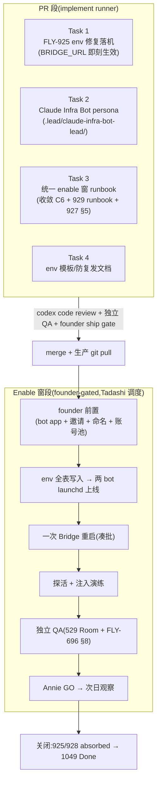

# FLY-1049 FLY-915 alerts 收尾 — 实施计划

Issue: FLY-1049 (https://linear.app/geoforge3d/issue/FLY-1049/build-fly-915-alerts-收尾先确认-925928-剩余排除已-ship-的-927929)
日期: 2026-07-09
基于: research.md(上游 exploration.md;spec = FLY-915 PRD `product/doc/FLY-915-infra-alerts-pipeline/prd.md`)

> **Scope 已由 Tadashi brainstorm gate 拍定(2026-07-09)**:
> ① 统一 enable 窗归 1049,**done 定义 = 915 pipeline 在生产真跑起来**(925 每晚 publish 成功 + standup 不再 exit 22 + 927/929 env 生效),不是 plan 写完;
> ② 不动 bot 池 —— Claude Infra Bot 用 **Annie 新建的 dedicated bot app**(founder 前置项,找她的时机 Tadashi 排);
> ③ 925/928 fold 进 1049,落地时标 absorbed→关闭(comment 指向 1049);
> ④ 不走 CASS_BOT_TOKEN 过渡态,sender 门禁等 W5 一步到位。
> Bridge 重启由 Tadashi 凑批调度;enable 窗 founder-gated + 独立 QA + Annie GO。
>
> **Codex design review R1 修正(2026-07-09,已 ask Tadashi 过目 a89137ab)**:
> **sender 身份必须「永远不当 owner」** —— Discord bot 收不到自己发的 MESSAGE_CREATE(FLY-929 research §sender 约束已记载),而 `FLYWHEEL_ALERT_SENDER_TOKEN_ENV` 会把全部工单发帖收口到单一身份(`LeadAlertNotifier.ts:634-645`);若 sender = Claude Infra Bot(默认 owner,`ticket-owner-map.ts:83-87`),大部分工单 = 它自己发、@ 它自己 → 它的 runtime 永远收不到,工单无人认领。修正为 **专用 dispatcher 身份**(sender-only bot app,Annie 建 bot 时顺手多建一个;不跑 session、无 launchd,只是 Bridge 发工单用的 token)。这是终态而非过渡态,仍是一次 enable,不违背 ④ 的本意(避免半部署)。

## 0. 形态总览

本 issue **零生产 TypeScript 改动**(927/929 已把全部代码接缝 merge 好,均 env-keyed dormant)。交付分两段:

- **PR 段(本分支,merge 前)**:persona 等新物料 + 统一 enable 窗 runbook + env 模板文档 + 925 的 env 落机(见 Task 1 执行边界)。
- **Enable 窗段(merge 后,founder-gated 运维窗)**:照 runbook 执行 —— founder 前置 → env 写入 → 两 bot 上线 → 一次 Bridge 重启 → 探活/演练 → 独立 QA → Annie GO → 次日观察 → 关闭 925/928/1049。



## 1. PR 段任务

### Task 1 · FLY-925 env 修复(缺口 A)

**执行边界(已按 Tadashi「done=真跑起来」授权)**:`~/.flywheel/.env` 是机器态,本 task 直接落机 + 在 DONE 回报里向 Tadashi 报明;两行都是**追加式、可逆**(删行即回滚)。

1. `~/.flywheel/.env` 追加(值见 research §2):
   - `FLYWHEEL_BRIDGE_URL=http://localhost:9876` —— token report 脚本每次运行 source .env,**无需重启**,下一个 00:30 即生效。
   - `STANDUP_PROJECT_NAME=geoforge3d` —— Bridge 启动时读,写入后**等统一窗的凑批重启**生效(提前写入无副作用)。取值依据:`STANDUP_LEAD_ID=cos-lead` 仅存在于 geoforge3d 项目(research §2.2);写入前用 python 读 projects.json 再核一遍 projectName 精确串。
2. 验证(RED→GREEN 形态,先验证「坏」再验证「好」):
   - 写入前留存当前失败日志(`/tmp/flywheel-token-usage-daily.log` 末行 delivered:false)作 before 基线;
   - 手动触发一次 token report(`bash scripts/token-usage-daily.sh`,幂等有锁)确认 `delivered:true` + 频道有消息;若不便手动触发,等次日 00:30 自然运行核对。
   - standup 的 GREEN 在 enable 窗重启后核(次日 03:00 无 exit 22 + STANDUP_CHANNEL 有消息)。
3. Linear:在 FLY-925 留 comment「absorbed into FLY-1049(修复内容+验证证据)」,**关闭动作留到观察日通过后**(与 §3 同步)。

### Task 2 · Claude Infra Bot persona + 身份物料(缺口 C 代码侧)

1. 新建 `.lead/claude-infra-bot-lead/identity.md`,镜像 `.lead/codex-infra-bot-lead/identity.md` 的骨架(三件事 / 回帖纪律 / 边界),职责按 PRD CMP-2 写死:
   - **owner 范围**:默认主力 owner;Codex 侧账号/auth 交叉救援(用 `flywheel-codex-profile` / codex-relogin 既有工具,绝不碰 Claude 侧账号切换 = Codex bot 的活);provider 无关问题(runner 卡死/超时/529 真停 → continue nudge / respawn / 等待重试,复用 Bridge AutoRepairBot 之上的 owner 认领语义);**唯一发 #flywheel-notify**(token report / 重启 / 轮转 digest,每日 1 次,绝不 @Annie)。
   - **回帖纪律**(FLY-220 防刷屏,逐字镜像 Codex persona):只响应 ① Alerts 里显式 @自己 的工单 ② 自己私有频道里 Annie 直令;绝不回自己/别人的普通帖;低频少而准。
   - **铁律**:谁都不救自己;一工单一 owner;修不掉才 @Annie(T2 = 2 次/5 分钟)。
   - 命名:占位「Claude Infra Bot」+ 顶部注明 T3 待 Annie 定名后 rename。
2. projects.json 条目**规格**(写进 runbook,窗内落机):flywheel 项目 leads 追加,仿 codex-infra-bot-lead 条目 —— `agentId: claude-infra-bot-lead`、`botTokenEnv: CLAUDE_INFRA_BOT_TOKEN`(dedicated env 名,防身份顶包教训)、`canSpawnRunners: false`、`department: infra`、`alertChannel = FLYWHEEL_UNIFIED_ALERT_CHANNEL_ID`、chatChannel = 窗内 Annie 建的私有频道。backend = claude-code(belle 同型 manifest,model 档随 fleet 惯例取 sonnet/high)。
3. 上线路径用**标准 lead 安装流**(/setup-discord-lead + flywheel-lead-wrapper.sh manifest + launchd plist,belle 同型;FLY-398 windowed 可见)——**不新写 launcher 代码**。
4. **入站合同写死(Codex R1 #2,runbook 逐字合同化)**——标准 setup 只建 chat 频道 group(requireMention:false),对 alerts 频道远远不够:
   - access.json groups:私有频道 group `requireMention:false`;**#flywheel-alerts group `requireMention:true`**(只有显式 @ 才唤醒,镜像 Codex bot launcher 把 Alerts 走 cross-dept mention-gate 的做法,`run-codex-infra-bot-tui.sh:54-61`),allowFrom 清空/不放行普通成员泛播;
   - **allowBots** 必须包含:dispatcher(sender bot user id,工单帖的作者)+ Codex Infra Bot(升级/证据帖互通)——bot 作者的消息不在 allowBots 内会被直接丢弃(`roundtable-allowbots.ts:5-26`);
   - manifest/launch env 带 `FLYWHEEL_LEAD_CROSS_DEPT_CHANNEL_IDS=$FLYWHEEL_UNIFIED_ALERT_CHANNEL_ID`(allowBots 自愈逻辑只在该 env 设置时运行,`claude-lead.sh:2270-2292`);
   - **上线前探针验证(必过才算 W5 done)**:① 正向 —— 用真 dispatcher token 在 alerts 频道发一条带 <@ClaudeInfraBot> 的工单帖,确认到达 Claude Infra Bot pane;② 负向 —— 无 mention 的 alerts 帖不唤醒;③ 负向 —— @ Codex bot 的帖不唤醒 Claude bot(单 owner 互不抢)。

### Task 3 · 统一 enable 窗 runbook(缺口 B/D/E 收敛)

新建 `engineering/doc/FLY-1049-fly915-alerts-closeout/enable-window-runbook.md`,把三份既有材料收敛成**一份按序清单**(来源:FLY-871 C6、FLY-929 enable-runbook、FLY-927 plan §5 步 2-5;research §6):

- **步 0 · 前置核对**:本 PR merged + 生产 git pull + `pnpm -r build`;FLY-925 env 已落机(Task 1)。
- **步 1 · founder 前置(集中一次找 Annie,时机 Tadashi 排)**:
  - 新建 dedicated bot app ×2(同一次 Portal 会话):
    ① **Claude Infra Bot**(owner bot):token + bot user id;头像 Claude logo;挂 C6 §1 `infra-bot` 角色(Manage Channels/Threads/Webhooks + 基础套装;不给 Manage Roles/Server/Admin);邀进 server;加进 #flywheel-alerts、#flywheel-notify(=token-usage 频道 `1521630422918758472`)、STANDUP_CHANNEL、新建私有频道 #claude-infra-bot。
    ② **Alerts Dispatcher**(sender-only,Codex R1 修正):token + bot user id;只需基础发言套装 + 邀进 server + #flywheel-alerts 发言权;**不跑 session、无 launchd、不进 owner map** —— 它只是 Bridge 发工单用的统一声音。
  - T3 命名(可后补,不 block)。
  - 告警频道权限收紧(927 步 3):Send 收紧到 **dispatcher + 两个 infra bot** 三个身份(改已有频道 overwrites 需 MANAGE_ROLES → founder 做)。
  - provision Claude 账号池:逐账号浏览器登录 + `flywheel-claude-profile capture`(Annie 在场;FLY-696 红线)。
- **步 2 · env 写入(一次写齐,先 env 后重启)**,全表:
  ```bash
  # 927 启用(缺口 E)
  FLYWHEEL_ALERT_ROUTING=1
  FLYWHEEL_ALERT_TICKETS=1
  FLYWHEEL_ALERT_RATE_PER_MIN=20
  FLYWHEEL_ALERT_SENDER_TOKEN_ENV=FLYWHEEL_ALERT_DISPATCH_BOT_TOKEN   # 非-owner dispatcher(Codex R1 修正:作者≠owner 不变量)
  FLYWHEEL_ALERT_REPAIR_BOT_TOKEN_ENV=FLYWHEEL_ALERT_DISPATCH_BOT_TOKEN # auto-repair 同声音(现默认 Cass,plugin.ts:4133;指针 env 零代码改)
  FLYWHEEL_CHECKPOINT_WATCHDOG=1
  # sender 身份(Codex R1 修正)
  FLYWHEEL_ALERT_DISPATCH_BOT_TOKEN=<Annie 新建 ②>
  # 928 W5 身份(缺口 C)
  CLAUDE_INFRA_BOT_TOKEN=<Annie 新建 ①>
  FLYWHEEL_CLAUDE_INFRA_BOT_USER_ID=<Annie 新建 ①>
  # 929 enable(缺口 D)
  FLYWHEEL_ACCOUNT_SELF_HEAL=1
  FLYWHEEL_CLAUDE_PROFILE_BIN=<repo>/packages/claude-runner/bin/flywheel-claude-profile
  FLYWHEEL_NOTIFY_CHANNEL=1521630422918758472
  FLYWHEEL_NOTIFY_DIGEST_EXPECT=1
  ```
  不变量:**工单帖作者(dispatcher)≠ 任何 owner(两 infra bot)** —— Discord bot 收不到自己的 MESSAGE_CREATE,作者=owner 会让 owner 永远收不到 assignment(FLY-929 research 已记载的同一约束)。
- **步 3 · 两 bot 上线**:W4 = C6 原步(装 codex-infra plist → verify-windowed-lead);W5 = projects.json 条目 + /setup-discord-lead + Task 2 §4 入站合同(access.json groups/allowBots/cross-dept env)→ manifest/plist → verify-windowed-lead → **Task 2 §4 三条探针全过**(dispatcher 发 @ClaudeInfraBot 到 pane;无 mention 不醒;@Codex 帖不串)。
- **步 4 · 一次 Bridge 重启**(Tadashi 凑批;FLY-239 精准杀;重启后检查活 issue 线程未被误 archive —— 已知 task#117 bug)。
- **步 5 · 探活 fail-loud**(929 步 4:Claude bot 向 notify/alerts/standup 三频道各发探活;任一失败回步 1 补权限)。
- **步 6 · 注入演练**:① 注入一条工单看 @-target 唯一 owner + ACK + 状态 edit + 20/min 攒批;② 模拟 Claude 账号封顶 → 静默切换 + notify digest(不 @);③ 全封顶 → alerts 工单 @ Codex bot;④ approve-park 1h 巡检措辞(「待你拍板」,绝非「code review 卡」)。
- **步 7 · 独立 QA**(见 §2)。
- **步 8 · Annie GO + 早报确认项**(927 步 5:D1/D2 裁定 + runner_stuck founder page 改 T2 后才页的行为变更)。
- **步 9 · 次日观察清单**:00:30 token report 由 Claude Infra Bot 发出(消息作者=infra bot)+ `~/.flywheel/notify-receipts.json` 落盘;01:00 后 expect tick 安静;03:00 standup 发出且 Simba 侧仍能触发 triage(FLY-71 语义);alert 频道无新噪音源。
- **回滚**:从 .env 移除全部新 env → 重启 = 逐字回现状(全链 byte-compat);Keychain 侧 FLY-696 fail-closed 保登录不坏。

### Task 4 · 防复发文档

- 925 的两个 env + enable 窗全表写进 `fleet/example` 环境说明或 SETUP.md 对应节(实现时看哪处是现行 env 文档惯例落哪,单处不重复)。
- `doc/architecture/infra-alerts-spec.md`(927 交付)补一节「运行时开关与 enable 状态」索引,指向本 runbook。

## 2. QA 计划

- **PR 段**:docs-only PR(persona/runbook/模板 + 机器态 env 两行)。无生产 TS 改动 → 无单测新增;`pnpm lint` 全仓照跑;codex code review 照走(no-code 不豁免 review)。Task 1 的 token report GREEN 证据(delivered:true 日志/频道截图)进 PR 描述。
- **Enable 窗段(独立 QA runner,不由部署者自证)**:
  - 529 Room 注入工单套(927 plan 步 4):@-target/状态 edit/攒批/shell 路径统一频道/生产目录零污染 snapshot;
  - FLY-696 §8 M1 清单(1-13、16):注入 5h cap 真切换 + Keychain verify + 登录不坏;529 瞬时不切;双触发幂等;全封顶 → 工单 + owner mention 无立即 founder 升级;
  - 真 Discord E2E(Claude-in-Chrome)看三频道实际消息作者/内容(memory 红线:独立 QA 默认必跑真 Discord E2E);
  - 观察日(步 9)由 QA/Tadashi 核,不由实现 runner 自报。

## 3. 验收标准(= Tadashi done 定义,逐条可勾)

1. token report 连续 ≥1 自然日 `delivered:true` 且频道有当日消息(925);
2. standup 重启后次日 03:00 无 exit 22 且频道有消息(925);
3. 927 五 env 生效:注入工单走新 pipeline(schema 头 + @ 唯一 owner + 速率攒批),checkpoint watchdog 措辞取权威 stage;
4. 两 infra bot windowed 在线(cmux 可见)且互不抢工单;
5. 模拟封顶 → 静默切换 + notify digest;全封顶 → alerts 工单交叉 @;
6. token report/重启/轮转 sender = Claude Infra Bot,Simba 退出全局发送(929 W3b);
7. 观察日通过后:FLY-925、FLY-928 标 absorbed→关闭(comment 指 FLY-1049),FLY-1049 Done。

## 4. Out of scope

不重写 927/929 任何代码(纯配置/物料/runbook);不动 bot 池 6 槽;卡住 session 不自动搬账号(D2,follow-up);frozen-mid-thinking 真样本(follow-up);PM 验收闭环(FLY-830);#flywheel-notify 频道重命名之外的频道架构改动。

## 5. 风险与缓解(research §7 摘录 + 计划侧)

| 风险 | 缓解 |
|---|---|
| self-heal 弄坏 claude 登录 | FLY-696 红线机制(fail-closed + verify-before-commit)+ 独立 QA M1 清单先行 + Annie 在场 provision |
| 新 sender token 配错静默失活 | ⚠️/🚨 无条件走 legacy 链(929);P-expect 自我健康检查;927 dead-letter + meta-alert |
| founder 前置拖住整窗 | Task 1(925/BRIDGE_URL)不依赖任何 founder 动作,先行止血;其余按 Q4 裁定等 W5,若拖成阻塞回 Tadashi 重拍 |
| Bridge 重启事故(FLY-176 / 线程误 archive) | FLY-239 精准杀已 merge;先 env 后重启;重启后核对活线程;凑批由 Tadashi 调度 |
| 双 bot 竞争/刷屏回归 | 927 mention-gate + 单 owner map(代码已在)+ persona 回帖纪律镜像;观察日清单盯噪音 |
| 工单发出但 owner 收不到(作者=owner 自盲区) | dispatcher sender-only 身份(作者≠owner 不变量)+ 上线前三条真探针(Codex R1 两条 blocker 的根治) |

## 6. 实现阶段 chunk 划分(progress.md cursor 用)

| chunk | 内容 | 依赖 |
|---|---|---|
| impl-1 | Task 1:925 env 落机 + token report GREEN 证据 | 无 |
| impl-2 | Task 2:persona + 身份物料规格 | 无 |
| impl-3 | Task 3:enable-window-runbook.md | impl-1/2 定稿 |
| impl-4 | Task 4:防复发文档 + lint + PR + codex review | impl-1..3 |
| window | enable 窗执行 + 独立 QA + 观察日 + 关闭 925/928(founder-gated,Tadashi 调度) | merge + founder 前置 |
