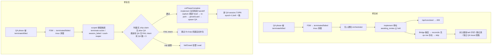

# FLY-1050 三段式 QA 被杀后流水线搁浅 — 探索

Issue: FLY-1050 (https://linear.app/geoforge3d/issue/FLY-1050/infrabug-三段式-qa-session-被杀后流水线搁浅无法干净重生-qareconcile-跳过已有-qa-row)
日期: 2026-07-09
基于: 无

## 1. 现象

三段式流水线（Design → Implement → QA，共享一条 branch B）中，QA phase session 被 terminate/杀死后，整条流水线**永久搁浅**，没有任何干净路径重生 QA：

**事故 1 — FLY-967（2026-07-09，本 issue 的直接来源）**：
- QA session `b7b4b54d` 因 browser-MCP 是 pre-fix 旧状态（连不上 Chrome），Annie 要求换新的 → Tadashi terminate 了它；
- implement session `525f8151` 停在 `awaiting_review`、占着 turn belt；
- `/api/runs/start FLY-967` 被 409 拒绝（`getActivePhaseSessionForIssue` 命中 active implement phase）；
- Bridge 重启后 `reconcileStrandedImplementHandoffs` **跳过**这个 implement——判据是「already has a qa row → handoff already fired → skip」，而那条 qa row 就是已死的 `b7b4b54d`；
- 最终只能绕路：单开独立 QA issue（FLY-1047）验同一 PR #501，`qa-result --target-exec` 绑回 967。

**事故 2 — FLY-1018（同日，第二个真实案例，Tadashi 在 brainstorm gate 补充）**：
两次 takeover 失败把流水线踢回 implement 后搁浅——implement `1d886206` 停在 `awaiting_review`（review binding 已绑），**两条** QA row（`4b50aa52`、`00333827`）均为 `failed`、均无 verdict intent。形态与 967 同款。

## 2. 生产 DB 取证（2026-07-09，~/.flywheel/teamlead.db 只读）

**FLY-967**：

| execution_id | role | status | 关键字段 |
|---|---|---|---|
| `524615b1` | design | `design_done` | 保活 park 中 |
| `525f8151` | implement | `awaiting_review` | review_question_id=`df802a1c`（runner-driven evidence 完好） |
| `b7b4b54d` | qa | **`terminated`** | 无 review binding；session_params 带 `three_stage_verdict.status="pass"`（round-1 PASS，07-08 05:51） |

**FLY-1018**：

| execution_id | role | status | 关键字段 |
|---|---|---|---|
| `a390a8c4` | design | `design_done` | |
| `1d886206` | implement | `awaiting_review` | review_question_id=`80be6c41` |
| `4b50aa52` | qa | **`failed`** | 无 `three_stage_verdict` intent |
| `00333827` | qa | **`failed`** | 无 `three_stage_verdict` intent |

两个案例合起来覆盖了死 QA 的两种终态（`terminated` 和 `failed`）和两种 intent 形态（PASS intent / 无 intent）——都应该允许重生。

## 3. 根因（三层）

### 根因 ①：reconcile 判据只看 qa row「存在」，不看死活

`phase-orchestrator.ts` 的 `hasProgressedPastImplement()`（FLY-939 G-A2 引入）：

```
hasShipFinalizationClaim(issueId) → true
listPhaseSessionRows(issueId, "qa").length > 0 → true   ← 任意状态的 qa row 都算
```

FLY-939 当时的推理是「terminal QA 的 stranded-pass 归 checkStrandedPass 管」——把「handoff 曾经 fire 过一次」和「流水线现在能自我推进」混为一谈。一条已死的 qa row 让 boot reconcile 误判「已交接、无需重生」，而死 QA 既不能自我推进、也没有任何下游机制替它推进。

对照组：design→implement 方向的 `hasProgressedPastDesign()` 用的是 **alive-only** 判据（`getAlivePhaseSession`），死 implement 不挡 design 重驱。implement→qa 方向是唯一用「任意状态 row 存在」判据的地方——本修复即是把两个方向的语义对齐。

### 根因 ②：reconcile 只在 Bridge 启动时跑，terminate 当下无任何事件驱动的重生路径

`reconcileStrandedImplementHandoffs` 只从 `reconcileOnStartup()`（plugin.ts 布线时一次性调用）进入。QA 被杀的当下：

- `handleTerminate`（actions.ts）只做 FSM 转移（→`terminated`）+ 解析 parked gate + tmux/CommDB 清理，**完全不通知 PhaseOrchestrator**；
- `session_failed`（DirectEventSink.emitFailed / event-route）只做 scoped turn-belt reconcile（FLY-921 Fix C），不做 handoff 重驱；
- 即便判据修好，操作员也要重启 Bridge 才能自愈。

### 根因 ③（本次审计新发现）：`terminated` 不在 orchestrator 的终态集合里，连告警都不响

- `phase-orchestrator.ts:169` `TERMINAL_SESSION_STATUS = {"completed", "failed"}` — 不含 `terminated`；
- `checkStrandedPass()` 只认 `completed`/`failed`；
- `StateStore.getStrandedThreeStageQaPassSessions()`（boot sweep (c) 的候选查询）也只查 `status IN ('completed','failed')`。

后果：`b7b4b54d` 带着 PASS intent 死在 `terminated` 状态，**FLY-859 的 stranded-pass 告警也没响**——流水线搁浅且完全静默，正是 FLY-902「never no-op silently」原则要防的形态。

## 4. 方案选项

### 方案 A：修 reconcile 判据（boot 自愈）

「已交接」改为：`ship claim` **或** `alive qa row 存在` **或** `最新 qa row 带 FAIL intent`（fix-loop 机器拥有流水线，见 §5 shape 2/3）。死 QA（无 intent 或 PASS intent）不再挡重生。

- 优点：判据回归正确语义，与 `hasProgressedPastDesign` 对齐；重启 Bridge 即自愈，不再需要 belt 手术/删记录。
- 缺点：单独做 A 仍要重启 Bridge 才能触发。

### 方案 B：事件驱动 scoped 重生（无需重启）

QA phase row 到达死终态的三类位点（terminate action / session_failed 两个 sink / crash-reaper）挂 scoped 重驱：同一判据通过后，复用现成的 `onPhaseComplete(implement)` handoff——capture 最新 head → 幂等 re-park implement → ghostGuard → `dispatchNextPhase(qa)`，新 TURN（epoch+1）由 dispatcher pre-launch seam 发放。terminate 旧 QA 的瞬间自动生出干净的新 QA。

- 优点：直接消灭 967 的操作痛点（换新 QA = terminate 一下即可）；全部复用现有 handoff 机器，无新 spawn 逻辑。
- 缺点：触发位点有三处，需逐处布线；需要防 respawn 循环的护栏（见 §6）。

### 方案 C：Lead 侧 force-respawn 受控入口（不做）

新增 `/api/actions/respawn-qa` 之类的手动入口。**否决**：`/api/actions/*` 是 founder-only-authority（FLY-175）的保留动作面（含 catch-all），新增入口要过 consent 面、扩大授权半径；A+B 已完整覆盖手动需求（terminate 本身就是入口）。

### 决策（brainstorm gate 已批，2026-07-09 Tadashi）

**A + B，不做 C。** Tadashi 补充确认：① FAIL-intent 跳过的理由成立；② C 不做正确；③ 护栏三件套齐；④ respawn 时用最新有效 head 要落实到回归测试里；⑤ FLY-1018 的 DB 状态作为第二个 fixture。

## 5. 边界情形（shape 矩阵）

判据的核心问题是：「最新 qa row 已死」时，什么情况下重生是安全的？

| # | shape | 最新 qa row | verdict intent | 判定 | 理由 |
|---|---|---|---|---|---|
| 1 | FLY-967：QA 被 terminate（PASS 后未开 gate / 验证中） | `terminated` | `pass` 或 无 | **重生** | 死 QA 不拥有任何东西；无 ship claim |
| 1' | FLY-1018：QA takeover 失败落 `failed` | `failed` ×2 | 无 | **重生** | 同上 |
| 2 | QA 发出 FAIL 后被杀，implement 正在修（woken mid-fix） | 终态 | `fail`（fixExecId 已 set） | **跳过** | fix-loop 拥有流水线；重驱会把干活中的 implement re-park + 在半成品 head 上起 QA。implement 修完再次 needs_review 时，现有 live handoff 的 wake-or-spawn 分支会发现 QA 已死 → 自动 spawn 新 QA，无需我们插手 |
| 3 | FAIL flow 未完成（fixExecId 未 set）或 fix 后 spawn 失败 | 终态 | `fail` | **跳过** | 归 verdict 机器（`reconcileQaVerdicts` boot sweep 会 replay FAIL flow）；双驱会造成两个驱动方冲突。维持现状（failClosed 告警覆盖），无回归 |
| 4 | QA 正常 ship 完成 | `completed` | `pass` | **跳过** | `hasShipFinalizationClaim` 已挡 |
| 5 | QA 活着（running / awaiting_review / approved_to_ship / parked） | alive | 任意 | **跳过** | `getAlivePhaseSession` 已挡 |
| 6 | FSM 拒绝终态转移的僵尸 row（parked 被杀但状态停在 awaiting_review） | 状态仍 alive | — | **跳过（已知相邻缺口）** | alive-check 挡住 → 不会重复 spawn（fail-safe 方向）；该僵尸形态是 FLY-921 已知的独立问题，不在本票范围 |

简化后的判据：**只要最新 qa row 带 FAIL intent 就跳过**（覆盖 shape 2/3——FAIL 的一切子状态都归 fix-loop/verdict 机器）；**无 intent 或 PASS intent 的死 QA 一律放行重生**（shape 1/1'，含 967 的 PASS-intent 形态——它没 ship claim、没 gate binding，重生 = 新 QA 重验 + 重开 gate，正是操作员想要的「换新的」）。

## 6. 护栏

1. **respawn 上限**：触发时该 issue 的死 qa row（`completed`/`failed`/`terminated`）数 ≥ 3 → 拒绝重生 + `failClosed` 告警 Lead（防「spawn 即死」无限循环；3 条死 QA 之后应该有人来看了）。
2. **幂等**：重生成功后 alive qa row 存在 → 后续任何触发（重复事件、boot reconcile）天然跳过；orchestrator 内 per-issue in-flight guard 防同进程并发双生。
3. **告警一致性**：`checkStrandedPass` 补 `terminated` 状态；且当 issue 存在存活后继 QA 时不再报 stranded（避免重生成功后误报）。
4. **byte-compat**：全部新行为限定在 `chat_thread_role='qa'` 的三段式 row + `resolveThreeStage(session).enabled` 的项目内；非三段式/三段式 OFF 项目零变化。

## 7. Non-goals（明确不做）

- **方案 C**（手动 respawn 入口）——见 §4。
- **design→implement 方向的事件驱动重驱**（implement 被杀即时重生）：boot reconcile 已用 alive-only 判据覆盖（重启即愈），967 类「重启也救不了」的痛点不存在于该方向；如需即时性另开 follow-up。
- **shape 3 的自动恢复**（FAIL flow 中断/fix 后 spawn 失败）：维持现有 failClosed 告警 + boot verdict sweep 行为，不引入第二个驱动方。
- **shape 6 僵尸 row**（FSM 拒绝终态导致状态停在 alive 集合）：FLY-921 域的独立问题。
- **stranded-pass 的自动 ship-gate 重驱**：FLY-859 语义不动，只补状态覆盖和误报抑制。

## 8. 修复前后流程对比



## 9. 下游

- 调研（代码审计细节、判据推演、触发位点与布线方案）→ 同文件夹 `research.md`
- 实施计划 → 同文件夹 `plan.md`
