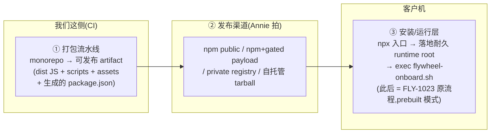

# FLY-1062 Buddy onboarding 分发层(npm 安装包) — 探索

Issue: FLY-1062 (https://linear.app/geoforge3d/issue/FLY-1062/build-buddy-onboarding-分发层-客户-npm-install-安装包零仓库访问替代-curlgit-clone)
日期: 2026-07-09
基于: 无(上游合同 = FLY-910 PRD v3 + FLY-1023 三件套,见 §1)

---

## 1. 问题定义

Annie 原话([FLY-1023] thread, 2026-07-09):

> 「我希望到时候用户在使用的时候,直接 npm install 一个拓展包就行了。作为一个 customer,他不需要还要去克隆我们的代码才能跑这个东西。」

**现状供应链(FLY-1023 分支,PR #523 OPEN)审计结论**——客户机上的获取与构建是这样的:

1. `scripts/flywheel-onboard.sh:85` — `git clone --depth 1 https://github.com/xrliAnnie/flywheel.git ~/Dev/flywheel`(仓库 **PRIVATE**,真客户第一步就挂;彩排包只能靠 gh auth 第 0 步撑);
2. `scripts/provision-fleet-host.sh` `phase_repos` — manifest `repos[]` 逐仓 `git clone` + **`pnpm install && pnpm -r build`**(在客户机上从源码现场构建,要求 pnpm 工具链);
3. `scripts/flywheel-bridge-wrapper.sh:152` — 生产 Bridge = `exec npx tsx scripts/run-bridge.ts`(**直接跑 TS 源码**;run-bridge.ts 本身是薄入口,import 全来自 `packages/*/dist/*.js`);
4. `scripts/update-flywheel.sh` — 更新通道 = `git pull --ff-only` + 重建(同样依赖仓库访问)。

即使仓库转公开可克隆,把全部源码 + git history + doc/(内含全部内部设计与运营文档)交付客户也不是我们的分发形态。

FLY-910 PRD §「一条 command 具体形态」本来就把 `curl … | sh` vs `npx @flywheel/onboard` 留给 Annie 拍;FLY-1023 也刻意把 clone 做成「皮」(onboard 脚本头注释:「if the distribution shape changes later, only this skin changes」)。**本 issue = Annie 已拍 npm 方向后,把这层皮 + 底下的 provision 供应链换成打包产物分发。**

## 2. 硬需求(继承 + 本 issue 新增)

| # | 需求 | 来源 |
|---|---|---|
| R1 | 客户侧安装 = 一条 npm 等效命令,**零仓库访问**(流程任何一步不 git clone 我们的仓) | Annie 原话 |
| R2 | **零源码暴露**(诚实定义见 §3):不交付 src/、tests、doc/、git history;TS 只交付构建产物 | issue 目标 |
| R3 | 断点续传/journal v2 兼容(重跑从 cursor 续,与 FLY-1023 逐字同语义) | issue 目标 |
| R4 | 版本与更新通道有定义(客户如何升级) | issue 目标 |
| R5 | 密钥红线/黑话红线逐字继承 FLY-1023(secret 不进对话·state·日志·argv;客户可见输出零工程黑话) | issue 约束 |
| R6 | 发布渠道(npm public vs private vs 自托管)**先给 Annie 选项再动手** | issue 约束 |
| R7 | Annie 生产 fleet 零变化(byte-compat:不装包的现有机器行为逐字不变) | 项目家规 |
| R8 | FLY-1023 关单前必要项:与 #523 的 seam 对齐,不重写其机制层 | issue 约束 |

## 3. 「零源码暴露」的诚实定义

不同层能做到的程度不一样,必须先说清楚,不许含糊:

- **TS 运行时**(packages/*、run-bridge 入口):交付**构建后 JS**(dist)。构建产物仍是可读 JS(可选 minify),但无 .ts 源、无类型、无内部注释结构。这是业界商用 CLI 的标准形态。
- **bash 层**(onboard/buddy/setup/provision 脚本):脚本本身就是运行格式,**必然以可读形态交付**。它们是安装器,不是核心 IP。
- **prompts/copy/persona**(Buddy 话术、lead-rules、brain-prompts):运行时必需的明文文本,交付即可读。**这是暴露面里最接近产品 IP 的部分**——渠道选项(§5)的差异主要就在谁能拿到这些。
- **绝不交付**:src/、__tests__/、doc/(全部内部设计文档)、git history、fixtures 里的任何真实数据、.env/token 类(打包时过 `scan_for_secrets` 强制门)。

**一句话边界**:Node/bash 产品不存在真·源码保护——bash 与编译后 JS 天然可读。本层真正保证的是:客户拿不到 TS 源码、git 历史、内部文档,全程零仓库访问凭证;防的是「客户必须碰仓库」与「整仓(含历史与内部资料)落入客户手里」,不是「客户读不懂交付产物」。Annie 在 A/B 渠道选项中已知情此边界,并据此拍 B(话术/prompts 只有持 key 客户可得)。

## 4. 方案空间:分发形态(三层拆解)

把问题拆成三层,每层独立可换:

**① 打包流水线(与渠道无关,四个渠道共用)**:新增 assembly 脚本,从 monorepo 组装发布树——curated `scripts/` allowlist、`packages/*/dist`(保留 `packages/<name>/dist` 相对布局,run-bridge 的相对 import 原样成立)、teamlead 资产(prompts/lead-rules-base/static/scripts)、buddy 资产(copy/persona/brain-prompts)、launchd/systemd 模板;生成 package.json(运行时依赖 = 各被装包 dependencies 的**程序化并集**,不手抄);`files:` 白名单(不是 ignore 黑名单);pack 前过 `scan_for_secrets` + 黑话面不变式;run-bridge.ts 入口编译进 dist(bridge wrapper 的 packaged 分支 `exec node <root>/dist/run-bridge.js`,现有 tsx 路径逐字保留)。

**③ 安装/运行层(与渠道无关)**:npm bin 入口(薄 node/bash wrapper)做一件结构性的事——**把运行时落到耐久根**:`npm install --prefix ~/.flywheel/runtime/versions/<ver>` 把包 + 依赖(含 better-sqlite3 原生模块,npm 自己解决 prebuilt 二进制)装进耐久目录(真实落点 `<prefix>/node_modules/<pkg>` = PKG_ROOT,布局合同见 plan §0),建兼容镜像后原子翻 `current` symlink → PKG_ROOT,然后 exec 其中的 `scripts/flywheel-onboard.sh`(FO_ROOT 的 BASH_SOURCE 探测已天然命中包根,onboard 皮的 clone 分支在包内形态永不触发)。为什么不用 npx cache / 全局 node_modules 直接跑:npx cache 是半瞬态的,launchd/systemd 服务要长期指向 FLYWHEEL_DIR,`npm update -g` 会在服务运行中原地换文件;版本化目录 + symlink 才有干净的版本切换。provision 进 **prebuilt 模式**(发布树内置哨兵文件):`phase_repos` 跳过 clone+build,依赖面去掉 pnpm,首装服务安置走 packaged bootstrap;更新通道 = 装新版本目录 → 翻 symlink → 走**新的 packaged update seam**(restart-services.sh 是 monorepo deploy 脚本,packaged 路径禁用;update-flywheel.sh 的 git 路在 packaged 模式给诚实报错并指向 npm 更新命令)。

## 5. 发布渠道选项(R6 — 给 Annie 拍板)

| 选项 | 客户体验 | 源码暴露面 | 我们的成本 | 备注 |
|---|---|---|---|---|
| **A · npm public scoped 包(推荐)** | `npx @flywheel/onboard`,零账号零 token,最贴 Annie 原话 | 任何人可下载 artifact(dist JS + bash + **话术/prompts 可读**);license=UNLICENSED(可下载≠可使用) | 最低:npm org + CI publish | 注意:public 包发出去 72h 后不可彻底 unpublish,A→B 可迁但已发版本永远公开 |
| **B · public 薄壳 + gated payload** | `npx` 同上,但要输入我们发的 license key | 壳零 IP;真 payload(话术/prompts/dist)只有持 key 客户拿到 | 中:payload 托管 + key 签发/吊销 + 多一层失败面 | 商用 license 化的正路;MVP 后可平滑加(③层的落地步天然是挂载点) |
| **C · private registry(GitHub Packages / npm private)** | 客户要先配 registry token 才能 install | 最小 | 低(托管)+ **高**(每客户 token 分发/轮换支持负担) | 对「非工程客户」目标是反的,不推荐 MVP |
| **D · 自托管 tarball + curl** | `curl <带 token URL> \| sh`,零 Node 前置 | 同 B 可控 | 中:托管 + URL 管理(有 FLY-203 publish-report 现成模式) | Annie 已明确 npm 心智;留作零前置入口皮的兜底 |

**推荐 A**,理由:最快到达真客户;暴露的是安装器 + 运行时构建产物,核心竞争力在跑起来的系统与我们的迭代速度,不在这批文本;若 Annie 对话术/prompts 公开有顾虑 → 选 B(多 ~1 个里程碑的量)。

> **✅ 决策(2026-07-09,Annie 原话回在 [FLY-1062] thread,经 Tadashi relay)**:**拍 B · 公共薄壳 + license key**——她要护话术/IP,接受多一个 key 里程碑。设计主线切 B:公共 npm 只发薄壳(安装器+bootstrap,零话术零产物);客户输 key 换 gated payload(真正的构建产物+话术资产);key 签发/校验/吊销、payload 托管与鉴权、key 泄露轮换路径全部进 design;**A 降级为附录**(将来想放开的降级成本);打包流水线层①与安装层③不变(渠道无关正是为此),只有 payload 获取步从 npm fetch 换成 key 换取;key 服务保持薄(静态签名 token + 托管 tarball 鉴权起步,不做大系统)。细节见 research/plan。

**Node 前置的鸡生蛋问题(诚实说明)**:`npm install` 本身要求客户机已有 Node。甲类客户(有技术直觉的 operator)可接受「先装 Node(官网一键)再 npx」;要做到零前置,用 D 形态的 ~30 行公开 curl 皮(装 Node → 转 npx,同一 artifact,无 IP)。皮与渠道解耦,可后补,不影响本 issue 主体。

## 6. 与 FLY-1023(PR #523)的关系

- 本 issue 是 **1023 关单前必要项**(Annie 定性),但机制上是它的**下游皮替换**:1023 把 fetch 做成了 skin、把 provision 做成了 seam,本设计只动 skin + 给 seam 加 prebuilt 分支,**不重写 Buddy shell / step CLI / provider 任何机制层**。
- 实施依赖序:**FLY-1062 implement 必须基于 #523 合并后的 main**(或直接基于其分支 rebase)。设计按 #523 当前 HEAD(`5f4087c0`)写;若 review 期间 1023 变动,受影响的只有 skin 触点(onboard 脚本 fetch 段 + provision phase_repos),seam 合同稳定。
- flywheel-skills 仓(第二个私仓依赖):fleet manifest 对新客户机 `skillsSyncPresent:false`,即 **skills-sync 不在客户 MVP 供应链里**,canonicalRepo 只是记录字段 → 本 issue 不需要解决 skills 分发,列为 phase-2(若未来客户要 skills,走同一打包思路)。

## 7. MVP 范围切分

**In**:打包流水线(assembly + 依赖并集 + files 白名单 + secret-scan/黑话门)· run-bridge 入口 dist 化 + bridge wrapper packaged 分支 · 安装/运行层(bin 入口 + 耐久根落地 + symlink)· provision prebuilt 模式(跳 clone/build、去 pnpm)· onboard fetch 皮替换 · journal 兼容验证 · 版本记录 + 最小更新路径 · hermetic 测试 + 干净 VM 真机 QA · runbook 更新 · npm publish 流程(首发可手动,CI 化随后)。

**Out(明确不做,列 follow-up)**:B 渠道 license 基建 · com.flywheel.updater 的 npm 自动更新改造(MVP 手动更新命令)· 代码混淆/加壳 · flywheel-skills 分发 · 多 registry 镜像 · 已发版本撤回策略 · Codex 等其他 agent CLI adapter(1023 既有 out)。

## 8. 关键风险(研究阶段逐项核)

| # | 风险 | 初判 |
|---|---|---|
| 1 | better-sqlite3 原生模块在客户平台(mac arm64/x64, linux x64/WSL2)prebuilt 覆盖 | npm 装包时自动拉 prebuilt;缺失平台 fallback 编译需要工具链 → 研究阶段核矩阵 |
| 2 | workspace 包互相以**包名** import(非相对路径)→ 发布树内解析断 | 研究阶段 grep 全量 import 图;断点用 esbuild bundle 或布局内嵌收口 |
| 3 | 运行时 tsx 残留面(daily-standup 等 aux 脚本) | 审计客户 MVP 真正需要的服务集;逐个 dist 化或明确不随包 |
| 4 | npm 包名/org 可用性 + 账号(Annie 侧动作) | 渠道拍板时一并给 Annie 清单 |
| 5 | wrapper/provision 改动破坏 Annie 生产 byte-compat | 全部改动走 additive 分支 + 现有 reverse-compat sentinel 模式 |
| 6 | 发布树意外带入 secret/内部文档 | files 白名单 + pack 后 `scan_for_secrets` CI 强制门 + tarball 内容 snapshot 测试 |

## 9. 结论(brainstorm gate 已过;渠道已拍 B)

方案 = **三层拆解:打包流水线(渠道无关)+ 渠道 B(公共薄壳 + license key 换 gated payload,Annie 拍板)+ 安装/运行层(耐久根落地 + provision prebuilt 模式)**;对 FLY-1023 只换 skin/加 seam 分支,不动机制层;「零源码暴露」按 §3 诚实定义交付构建产物,且 B 渠道下话术/prompts 只有持 key 客户可得。
