# FLY-1062 Buddy onboarding 分发层(npm 安装包) — 实施计划

Issue: FLY-1062 (https://linear.app/geoforge3d/issue/FLY-1062/build-buddy-onboarding-分发层-客户-npm-install-安装包零仓库访问替代-curlgit-clone)
日期: 2026-07-09
基于: research.md

> **方向(brainstorm gate 已过;渠道 Annie 已拍)**:三层拆解——① 打包流水线(渠道无关)② 发布渠道 = **B · 公共薄壳 + license key 换 gated payload**(Annie 2026-07-09 拍板,护话术/IP;A 降级为附录)③ 安装/运行层(耐久根 + 原子 symlink + provision prebuilt 哨兵)。对 FLY-1023 只换 skin + 给 seam 加 additive 分支,机制层(Buddy shell/step CLI/provider)零改动。**key 服务保持薄**(静态签名 token / 名单 token + 托管 tarball 鉴权起步,不做账号/席位/计量系统)。
> **实施前置**:#523 已 merge;**本设计已对 origin/main ≥ bc9c9bfb 复核**(7 个被引文件与初审分支逐字一致,行号原样成立)。
> **红线(每 P 验收都含)**:secret/黑话红线逐字继承 1023;Annie 生产 byte-compat(每 seam 一个 reverse-compat sentinel);发布安全门(白名单 + secret-scan + 零 src/tests/doc/.git)。

---

## 0. 一句话方案

新增一条**打包流水线**把 monorepo 组装成单一 payload tarball(curated scripts + agents 运行时资产 + workspace 包经 bundleDependencies+file: 依赖内嵌 + 依赖并集 package.json + run-bridge 入口 dist 化);客户侧 `npx <公共薄壳包>`:薄壳收 license key(隐藏读)→ 凭 key 从 gated 端点换 payload tarball + sha256 校验 → `npm install --prefix` 装进耐久根并落**规范运行根 PKG_ROOT**(见下),原子翻 `current` symlink + 建 `packages/` 兼容镜像后 exec payload 内 `flywheel-onboard.sh`;provision 走 **prebuilt 哨兵模式**(跳 clone+build、去 pnpm、host.json 写 flywheelDir),更新走**新的 packaged update seam**(不复用 restart-services.sh),用已存 key 拉新版。

```mermaid
flowchart LR
  subgraph CI["P0 打包流水线(CI)"]
    A["assembly:白名单收树<br/>+ workspace 包内嵌(bundleDeps+file:)<br/>+ 依赖并集 package.json"] --> G["安全门:scan_for_secrets<br/>+ tarball snapshot + 零 .ts/src/doc"]
    G --> T["payload tarball 上传 gated 端点<br/>(P4;薄壳另走 npm publish)"]
  end
  T --> N["客户:npx <公共薄壳包>"]
  N --> K["P3 薄壳:license key 隐藏读<br/>→ Authorization header 换 payload<br/>→ sha256 校验"]
  K --> M["npm install --prefix versions/<ver><br/>(本地 tarball)→ 兼容镜像<br/>→ 原子翻 current → PKG_ROOT"]
  M --> O["exec payload 内 flywheel-onboard.sh<br/>(FO_ROOT=包根,clone 分支不触发)"]
  O --> P["P2 provision prebuilt 模式<br/>哨兵→跳 clone+build/去 pnpm<br/>host.json flywheelDir=current<br/>+ packaged 首装 bootstrap"]
  P --> S["services:wrapper P1 分支<br/>exec node dist/run-bridge.js"]
```

**规范布局合同(Codex R1#1,先定死再实现)**:`npm install --prefix ~/.flywheel/runtime/versions/<ver> <pkg>` 的真实落点是 `<prefix>/node_modules/<pkg>` —— 该目录即 **PKG_ROOT**,`~/.flywheel/runtime/current` symlink 直接指向它(不是 prefix)。PKG_ROOT 内:`scripts/`、`dist/run-bridge.js`、`agents/` 物理在根;workspace 包物理在 `node_modules/flywheel-*/`(裸 specifier 解析的规范位置);对既有 monorepo 路径合同(`$FLYWHEEL_DIR/packages/teamlead/scripts/claude-lead.sh`、`packages/flywheel-comm/dist/index.js` 等)由 bin 入口在**安装后**创建相对 symlink 兼容镜像 `packages/<dir> → node_modules/flywheel-<name>`(镜像集合由 P0 审计表定,安装期创建规避 npm pack 对 symlink 的不确定处理)。`host.json.flywheelDir = ~/.flywheel/runtime/current` 因此对 wrapper/launcher 全体成立。

## 1. 里程碑(每 P:范围 → 验收 → 可拆点;依赖序 P0→P1→P2→P3→P4→P5,其中 P4 的托管/key 子块可与 P1-P3 并行起)

### P0 · 打包流水线(渠道无关的地基)

**范围**:
1. `scripts/package-onboard.sh`(或 node 脚本,实现期定)——组装发布树:
   - **白名单收树**(显式清单,不是 ignore):curated `scripts/` 子集(onboard/buddy/steps/setup/provision/converge/daily-standup/wrapper/lib/buddy 资产/launchd 模板;**排除** `__tests__/`、`e2e-*.ts`、`cleanup-sessions.ts`、qa-*)+ **`agents/` 运行时 prompt 资产**(generic-executor.md、qa-executor.md——run-infra.ts 从 repo 根解析,漏了 Bridge 起得来但 dispatch 即挂,Codex R1#3);`packages/{teamlead,edge-worker,core,config,flywheel-comm,claude-runner,dag-resolver,agent-team-transport,inbox-mcp,terminal-mcp,token-usage,*-event-transport}` 各取 package.json + dist + 运行资产(teamlead 另含 scripts/prompts/lead-rules-base/static),物理放进发布树 `node_modules/<name>/`;
   - **workspace 包的 npm 打包规则(Codex R1#4,已用真 npm fixture 验证)**:仅 `bundleDependencies` 不够——每个内嵌 workspace 包**同时**要以 `file:node_modules/<name>` 形态列进 `dependencies`,npm pack 才会把它们打进 tarball;CI 断言 tarball 逐包包含后才跑 import 冒烟;
   - **依赖并集生成器**:第三方 dependencies 程序化并集写进发布 package.json;**版本冲突即 fail build**(人工对齐后重跑);
   - **payload** package.json:name(内部名,不进公共 registry)、version=doc/VERSION(CI 断言相等)、`engines.node >= 20`、`license: UNLICENSED`、`files:` 白名单(客户可见 bin 归 P3 薄壳,payload 无需 bin);
   - 哨兵文件 `.flywheel-prebuilt`(内容=版本)进树根。
2. **packaged-path 审计表(Codex R1#5,进包边界的单一真相)**:枚举每个进包脚本中引用 `FLYWHEEL_DIR`/`packages/`/`git`/`pnpm`/`tsx`/`agents/` 的位点,逐行定处置——`included-and-patched`(P1/P2 的 seam)/ `included-but-unreachable`(客户路径到不了,测试锁)/ `excluded`(不进白名单)/ `monorepo-only`(如 restart-services.sh:进包与否都必须证明客户路径不会调它)。已知必入表:flywheel-lead-wrapper.sh(packages/teamlead 路径→兼容镜像覆盖)· flywheel-daemon.sh(硬编码 ~/Dev/flywheel + 从树内拷 wrapper,处置见 P2-5)· daily-standup.sh(plugin.js 探测 + tsx fallback)· buddy-captain-preview.sh(repo 根推导)· restart-services.sh(git/pnpm/tsx 全命中→packaged 路径禁用)。**闭包规则**:兼容镜像集合(§0)与「wrapper 拷贝到 ~/.flywheel/bin 时必须随行的支撑 lib」(host-config.sh 等,Codex R2#2)都由本表收口。
3. **安全门(CI 强制)**:pack 后解包 → ① `scan_for_secrets`(fleet-sanitize.sh path 形态)② tarball 内容 snapshot 测试(新文件必须显式过白名单 diff)③ 断言零 `.ts`/`src/`/`__tests__/`/`doc/`/`.git` ④ **零仓库访问不变式**:发布树内 grep,除「客户项目仓 gh repo create」与「claude-plugins-official(PUBLIC,登记例外)」外零 `git clone`/私仓 URL。
4. **tarball 安装冒烟(CI,真 npm 全链)**:真 `npm pack` → 干净 temp prefix 真 `npm install <tarball>` → 在**真实安装布局**(PKG_ROOT)上:① node 直接 import 每个入口(run-bridge/flywheel-comm/agent-team-transport/validate-projects/两 MCP)零 MODULE_NOT_FOUND;② 兼容镜像创建后 `packages/teamlead/scripts/claude-lead.sh` 等路径合同成立;③ agents/generic-executor.md 从 PKG_ROOT 可解析;④ Bridge 以 stub env 起到 listen + Lead launcher 干跑(dry-run)通过——**装得上 ≠ 起得来,以此为准**(Codex R1#1 建议的 E2E)。

**验收(hermetic)**:RED 起点=「assembly 产出树含内嵌 workspace 包 + 并集 package.json」;安全门四断言各配正反例(注入假 token 文件必须 fail);安装冒烟①-④全绿;审计表覆盖发布白名单全集(表外脚本进包即 fail);重复跑 assembly 幂等(diff 空)。
**可拆点:P0 独立成单(其余全依赖它)。**

### P1 · 运行入口 dist 化 + 三处 packaged 分支(全部 additive + sentinel)

**范围**:
1. run-bridge 入口编译:打包期把 `scripts/run-bridge.ts` 编译为发布树 `dist/run-bridge.js`(单文件 tsc/esbuild,import 目标改指包内 `node_modules/flywheel-*/dist`——路径重写在编译步做,仓库源码不动);
2. `flywheel-bridge-wrapper.sh`:`[ -f "$FLYWHEEL_DIR/dist/run-bridge.js" ]` → `exec node`;否则现有 `exec npx tsx` 行**逐字**保留;
3. `daily-standup.sh:73` fallback 同款分支;
4. `update-flywheel.sh`:树根有 `.flywheel-prebuilt` → 诚实话术报错(黑话 lint 过)+ 指向 npm 更新命令,exit 非 0;否则逐字不变。

**验收(hermetic)**:每处分支两侧测试——packaged 判据成立走新路;判据不成立 **reverse-compat sentinel:行为/输出逐字不变**(复用项目 sentinel 模式)。RED 起点=「wrapper 在 dist/run-bridge.js 存在时 exec node」。
**依赖**:P0(编译步挂在 assembly 里,但 wrapper 分支可先行)。**可拆点:可并入 P0 一单。**

### P2 · provision prebuilt 模式 + host.json 指根 + packaged 首装 bootstrap

**范围**:
1. `provision-fleet-host.sh` `phase_repos`:REPO_ROOT 树根有哨兵 → 跳 flywheel clone + `pnpm install/build`(客户项目仓条目照旧);
2. deps 面:`fs_generate_fleet_artifact` 的 deps_json 在 prebuilt 模式去 `pnpm` required(node/git/jq/gh/tmux 保留);linux 侧为 better-sqlite3 编译兜底补 `build-essential` 条目(prebuilt 模式 only,follow-up 可再收窄);
3. host.json:packaged 安装路径下生成时写 `flywheelDir: ~/.flywheel/runtime/current`(FLY-650 seam 已在 wrapper 落地,**零 wrapper 改动**);
4. **安置版 wrapper 的 host-config 闭包(Codex R2#2)**:wrapper 被拷进 `~/.flywheel/bin/` 后靠 `$SELF_DIR/lib/host-config.sh` 生效——现状 `phase_flywheel_home` 只装 wrapper 三件不装 lib,拷贝版会**静默回落 `~/Dev/flywheel`**。prebuilt 模式下 provision 同步安置 `~/.flywheel/bin/lib/host-config.sh`(及 wrapper 直接 source 的支撑 lib,集合由审计表闭包规则收口);**测试锁:拷贝态 wrapper 在 temp-HOME 解析 flywheelDir=current**;
5. **macOS 首装 packaged bootstrap(Codex R2#1)**:phase_launchd 的 darwin 分支现状叙述指向 restart-services.sh / `flywheel-daemon.sh install`(后者硬编码 `~/Dev/flywheel` 并从该树拷 wrapper)——两者 packaged 模式都禁用,首装因此没有服务安置路径。新增 **packaged bootstrap 步**(哨兵模式下 phase_launchd 走它):从 PKG_ROOT 渲染/安置 Bridge + updater + daily-standup + Lead 的 launchd/systemd 任务与 wrapper(经 supervisor seam,不出现 launchctl 字面),全程零 restart-services.sh、零 `~/Dev/flywheel`;temp-HOME stub 测试 + P5 真机 macOS 段收口;flywheel-daemon.sh 在审计表中标 `included-and-patched`(FLYWHEEL_DIR 尊重 host-config)或 `monorepo-only`+禁用测试,实现期二选一定案;
6. M5-a 交叉项知会:discord plugin 检查脚本(仓外,GEO-296 产物)由 #523 M5-a 收编——本 P 只保证 prebuilt 模式不破坏其安置口。

**验收(hermetic,复用 FLY-648 temp-HOME 全链 idiom)**:prebuilt 树上 `--apply` 全相跑通且零 clone/零 pnpm 调用(stub 断言);无哨兵 sentinel 逐字不变;host.json 写入后**拷贝态** wrapper 解析到 current 根(host-config 既有测试扩一例);packaged bootstrap 在 temp-HOME(launchctl/systemctl stub)把四类服务装到位且 plist/unit 内路径全指 current,负例=packaged 路径调 restart-services.sh/flywheel-daemon.sh 即 fail。
**依赖**:P0。**可拆点:独立成单。**

### P3 · 安装/运行层(公共薄壳 + key 换 payload)+ 更新命令 + 续传

**范围**:
1. **公共薄壳包**(独立小 npm 包,只含 `bin/flywheel-onboard.js` ~百行,零话术零构建产物):检测/复用已装版本 → 无则:收 license key(**唯一正常通道 = 隐藏 TTY 读,或复用已存 0600 `~/.flywheel/.env`;绝不进 argv/history**。`FLYWHEEL_LICENSE_KEY` env 注入**仅限测试/CI**,须显式 `FLYWHEEL_ALLOW_LICENSE_KEY_ENV=1` 双开关,永不写进客户文档——Codex R4#2;key 持久化后从**所有子进程 env 中剥除**)→ 凭 key(**Authorization header,绝不进 URL/日志**)从 gated 端点拉版本 manifest + payload tarball → **sha256 校验** → `npm install --prefix ~/.flywheel/runtime/versions/<ver> <本地 tarball>`(第三方依赖仍由 npm registry 按客户平台装;**PKG_ROOT = <prefix>/node_modules/<pkg>**,§0 布局合同)→ 安装后创建 `packages/<dir> → node_modules/flywheel-<name>` 相对 symlink 兼容镜像(集合=P0 审计表)→ 原子翻 `~/.flywheel/runtime/current` → PKG_ROOT → exec `current/scripts/flywheel-onboard.sh`(FO_ROOT 探测天然命中,clone 分支不触发);key 无效/吊销/网络失败 → 诚实话术(1023 黑话红线)+ 续传安全(不落半成品版本目录);
   **license 换发通道(Codex R4#1——rotation 不能被二次运行快路挡死)**:① 显式 `npx <薄壳> license set` 子命令 = 隐藏读新 key → 校验(打一次 manifest 端点)→ **原子** 0600 覆写 `.env` 后照常续流程;② install/update 途中遇 401/吊销 → 先隐藏 TTY 提示换 key(一次)再失败——已装 runtime + 旧 key 被吊销的客户由此闭环;二次运行快路保留但可被 ①② 绕过;
2. **packaged update seam(新脚本,Codex R1#2——不复用 restart-services.sh)**:`flywheel update` 子命令 = 用已存 key 拉 manifest 比对版本 → 下载+校验+装新版本目录 → 校验新 PKG_ROOT(哨兵+版本+冒烟位)→ 原子翻 current(保留旧版本目录 1 个作回滚位)→ 只重启已安置的 launchd/systemd 服务(经 supervisor seam,不碰 launchctl 字面家规)→ health check,失败自动翻回旧 current。restart-services.sh 是 monorepo deploy 脚本(git 状态检查/pnpm build/tsx fallback/硬编码 ~/Dev/flywheel),**packaged 路径禁用并测试锁定**(客户机上调用它 = 诚实报错);其自身字节不变;
3. 续传(R3):journal v2/state 根不动;版本记录进 journal 非敏感键(**key 绝不进 journal**);**测试锁**:装 v(N+1) 后重跑,v(N) 期 journal cursor 原样续。

**验收(hermetic + 负例,gated 端点用 stub HTTP)**:temp-HOME 全链——npx 形态首装(含 key 隐藏读→0600 落 .env→header 换 payload→sha256 校验)→镜像→symlink→exec 链路;二次运行直 exec 不重装不重问 key;**rotation 三测(Codex R4#1)**:已装 runtime + 存储 key 已吊销 → ① `license set` 换新 key 原子 0600 覆写且流程续走 ② update 途中 401 触发隐藏读换 key 后成功 ③ 全程零半成品版本目录;错 key/吊销 key/篡改 tarball(sha256 不符)三负例给具体诚实话术且零半成品落盘;update 翻版后 plist 指向(current 路径)不变、journal 续传绿、health 失败自动回滚;symlink 翻转原子性(中断注入后 current 恒指向完整版本);**packaged 路径零 git/pnpm/tsx 调用(stub 断言,Codex R1#2)**;**secret-scan:key 零进 journal/日志/argv/npm 输出/转人工摘要,且持久化后子进程 env 中无 FLYWHEEL_LICENSE_KEY(Codex R4#2 注入测试);env 注入通道无 `FLYWHEEL_ALLOW_LICENSE_KEY_ENV=1` 时拒绝**。RED 起点=「薄壳在空 runtime 根时完成 key 换 payload 并建 current 指向 PKG_ROOT」。
**依赖**:P0(有 tarball 才有安装对象)。**可拆点:独立成单。**

### P4 · B 渠道基建(key + payload 托管)+ 发布流程 + Annie 侧清单(∥ P5)

**范围(「尽量薄」为约束,research §10 为合同)**:
1. **payload 托管 + 鉴权端点**:验 token → 返回版本 manifest(`{latest, versions[{ver, sha256}]}`)/ payload tarball;托管底座复用 FLY-203 publish-report 已验证模式(私有 blob + 薄函数层);大文件传输真机核验;
2. **key 生命周期(薄,实现期二选一)**:(a) 服务端名单——每客户一条 ≥128-bit 随机 token,0600 名单/KV,吊销=移出;(b) 静态签名 token(customer-id + HMAC)+ 小吊销名单。**不做**账号/席位/计量/到期(phase-2);签发/吊销/轮换各一条 runbook 化操作(轮换 = 发新 token + 吊旧 + 客户经 P3 换发通道换 key:`license set` 或 401 时一次隐藏重读);
3. **发布流程**:薄壳 → npm publish(显式 tag 触发 + provenance/2FA;壳版本独立);payload → CI 构建后上传 gated 端点 + 更新 manifest(payload version = doc/VERSION,CI 断言);坏版本 = manifest 摘除 + 薄壳侧 `npm deprecate`;
4. **Annie 动作清单**:npm org/包名申请(备选名清单)、2FA/token 入 CI secret、托管位密钥、首批客户 key 签发;
5. runbook 新章(B 供应链 + key 生命周期 + 更新 + 回滚);零前置 curl 皮(~30 行公开脚本:装 Node → 转 npx)= **可选项,不阻塞**。
**验收**:端点 stub 合同测试(壳↔端点的 manifest/tarball/401/吊销四形态);payload 上传/manifest 更新脚本幂等;**薄壳自己的发布内容门(Codex R4#3,与 payload 门平级)**:薄壳 `npm pack`/`publish --dry-run` 产物过显式白名单 + snapshot 测试——零 `scripts/`、零 `packages/`、零 `agents/`、零话术/prompts/构建产物、零 payload tarball,grep 断言除文档化公开端点外零私仓 URL;真发布首次人工按 runbook。
**依赖**:P0(有 tarball)。**可拆点:独立成单(key+托管可再拆)。**

### P5 · 真机 QA 段(独立 QA,∥ P4)

**范围(implement 后 QA 阶段执行)**:① 干净 VM(linux/WSL2)+ macOS 各一次:`npx <薄壳>` → 真 key 换 payload → Buddy 起步 → provision prebuilt(含 packaged bootstrap)→ Bridge/Lead 服务在线,全程零仓库访问(网络 trace 断言无私仓 URL、key 不出现在任何 URL/日志);② better-sqlite3 prebuilt 矩阵(mac arm64/x64、linux x64/WSL2)真装;③ 版本升级(update seam)+ 回滚 + journal 续传真机重放;④ 错 key/吊销 key 真机走一遍诚实话术;⑤ npm 机制核验(bundleDependencies pack 行为、`npm install --prefix` 语义、npx scoped bin)+ gated 端点大文件真传——**vendor 行为真机实测家规**。
**依赖**:P0-P4。**可拆点:QA 单独立派。**

## 2. 测试策略(TDD)

- **idiom**:沿用 FLY-648/1023 hermetic bash 测试(temp-HOME + `FLYWHEEL_SETUP_STATE_DIR` 隔离 + stub 外部二进制(npm/node 假体用于分支逻辑,真 npm 用于 CI 冒烟)+ 隔离断言 + live-fleet guard 负例);打包器自身用 fixture mini-monorepo 测。
- **RED 起点(每 P 首个失败测试)**:见各 P 验收首句。
- **贯穿断言(每 P 自带)**:reverse-compat sentinel(§P1/P2 表逐行)· 发布安全门四断言 · 黑话 lint(新增客户可见输出仅 P3 入口话术 + update 报错话术)· secret-scan。

## 3. 字节兼容 / 风险

**生产零变化承诺**:不改任何 runtime TS 行为;bash 改动全部 additive 分支(哨兵/文件存在性判据),不装包的机器(含 Annie 生产全 fleet)逐字不变;monorepo 根 `private:true` 不动,发布只经 CI tag 流程。**不需要 Bridge 重启**(客户机产品面)。

风险登记 + 缓解:research §11 全表带入,补四条——
| # | 风险 | 缓解 |
|---|---|---|
| 9 | npx 自安装(包安装自己)边角(npm 递归/锁) | bin 入口用自身 tarball 路径(`npm pack` 产物随包 or registry spec)实现期定型,冒烟覆盖两形态 |
| 10 | 旧版本目录膨胀 | update 保留最近 1 个,其余清理(P3) |
| 11 | 装得上但起不来(PKG_ROOT 布局 vs launcher 路径合同不一致,Codex R1#1) | §0 布局合同先定死 + P0 冒烟④在真实安装布局上起 Bridge/Lead + 兼容镜像由审计表收口 |
| 12 | 客户路径漏进未打补丁的 launcher(绕过 seam 撞 git/pnpm/tsx,Codex R1#5) | P0 审计表全量枚举 + 表外脚本进包即 fail + packaged 路径零 git/pnpm/tsx stub 断言 |

## 4. 交付物

- 新:`scripts/package-onboard.sh`(assembly + 依赖并集 + 安全门)· **packaged-path 审计表**(P0 文档产物,进 doc 文件夹)· **公共薄壳包**(独立小包,bin `flywheel-onboard`,key 换 payload)· **payload 托管/鉴权端点 + key 生命周期件**(P4,薄)· **packaged 首装 bootstrap 步**(P2-5)· **packaged update seam 脚本**(P3)· CI 发布流(壳 npm publish + payload 上传)· tarball 安装冒烟/snapshot 测试 · runbook 新章
- 改(全部 additive+sentinel):`flywheel-bridge-wrapper.sh` · `daily-standup.sh` · `update-flywheel.sh` · `provision-fleet-host.sh`(phase_repos + deps 面)· `flywheel-setup.sh`(host.json flywheelDir 一处)· 审计表判定新增的 launcher 触点(如 flywheel-lead-wrapper/daemon,以表为准)
- 测试:`scripts/__tests__/package-onboard*.test.sh`、各 seam sentinel 扩展、tarball 真装 E2E
- 版本号 tentative:**v1.x(ship 时按 held PR 队列 re-version)**

## 5. 实现期核验清单(集中,防散落)

1. npm:bundleDependencies **必须配套 `dependencies` 里的 `file:node_modules/<name>` 条目**(Codex R1#4 fixture 已证)· `npm install --prefix` 落点 `<prefix>/node_modules/<pkg>`(§0 合同)· npx scoped bin 行为 —— 真 npm 实测(P0/P3)。
2. better-sqlite3 ^12 prebuilt 平台×Node ABI 矩阵 —— 干净 VM 真装(P5)。
3. 依赖并集实际冲突面(首跑生成器见真章)(P0)。
4. run-bridge.ts 编译后 import 路径重写正确性(node 直跑冒烟)(P0/P1)。
5. #523 合并后 skin 触点行号复核 + packaged-path 审计表复跑(P1/P2 开工第一步)。
6. 兼容镜像 symlink 集合的最终收口(审计表)+ 真装布局上 Bridge listen + Lead dry-run(P0 冒烟④)。

---

## 附录 · A 渠道(全量公开 npm 包)降级成本(Annie 将来若想放开)

B 已是主线(Annie 2026-07-09 拍板)。若将来决定放开(话术/IP 公开可接受、想去掉 key 摩擦):
1. **payload 直接 npm publish**(P0 tarball 本来就是合法 npm 包)——薄壳加一个「无 key 模式」分支:从 registry 拉而非 gated 端点(客户命令与包名**完全不变**);
2. key/托管端点退役为可选(存量客户平滑,新客户免 key);
3. 更新命令走 npm dist-tags(latest/next)。

**量级**:≈ 数天(全部机制复用,只是打开阀门)。**不可逆注记**:payload 一经公开发布,该版本按 npm 72h 规则永久公开——放开是单向门,须 Annie 明确再拍一次。
