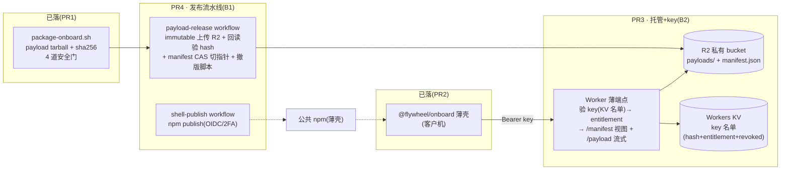

# FLY-1062 npm 分发层收尾圈(PR3 真 key 服务+托管 / PR4 发布 CI/CD) — 探索

Issue: FLY-1062 (https://linear.app/geoforge3d/issue/FLY-1062/build-buddy-onboarding-分发层-客户-npm-install-安装包零仓库访问替代-curlgit-clone)
日期: 2026-07-11
基于: 同文件夹前两圈三件套(exploration.md / research.md / plan.md §P4)+ pr2-thin-shell.md;上游合同 = `product/doc/FLY-1098-release-cicd/prd.md`(FLY-1098,Codex design review APPROVED + Annie lgtm)

---

## 1. 本圈问题定义(PR1/PR2 之后还缺什么)

**已 merge**:
- **PR1 #531(P0+P1+P2)**:打包流水线 `scripts/package-onboard.sh`(白名单收树 + workspace 包内嵌 + 依赖并集 + 4 道安全门 + 真 npm 冒烟)+ packaged-mode 运行时(wrapper dist 分支 / provision prebuilt / compat mirror / supervisor seam)。
- **PR2 #541(P3)**:公共薄壳 `packages/onboard-shell`(`@flywheel/onboard`)——key 隐藏读→Authorization header 换 manifest+payload→sha256→`npm install --prefix`→原子翻 current→exec;`license set`/401 rotation/`update`+自动回滚,37 hermetic checks。

**今天真客户仍然装不了**,因为薄壳的另一端全是空的:

| 缺口 | 现状证据 |
|---|---|
| 无真 gated 端点/托管 | `packages/onboard-shell/lib/config.mjs` `DEFAULT_ENDPOINT = "https://onboard.flywheel.invalid"`(故意 fail-loud 占位);PR2 全部走 stub HTTP |
| 无 key 签发/校验/吊销 | key 生命周期(research §10-3/4)只有客户端半边,服务端为零 |
| payload 无处上传 | `package-onboard.sh` 产 tarball 只落本地/CI;无 manifest、无托管 |
| 薄壳不能发布 | `packages/onboard-shell/package.json` `private: true`(PR2 publish-gate 刻意锁死,"not publishable until PR4") |
| 无发布流程 | 无 npm publish workflow、无 payload 上传/manifest 更新 workflow、无撤版路径 |

**关单合同(PR2 body 白纸黑字)**:「PR2 merge does NOT close FLY-1062 — closing = the full channel-B flow + a clean-machine real-machine QA pass」。即本圈(PR3+PR4)+ P5 真机 QA = 关单;FLY-1062 又是 FLY-1023 关单硬前提。

> **状态修正需知会 Lead**:Linear 上 FLY-1062 已在 PR2 merge 时被 post-ship finalization 自动标 Done(2026-07-11T16:45),与 PR2 body 的「不关单」声明矛盾——需要 Lead 把 issue 拨回 In Progress(或确认以 Done+新一圈 dispatch 的现状继续)。

## 2. 上游合同:FLY-1098 PRD(已批,本圈必须逐条对齐)

FLY-1098(Release CI/CD PRD,Codex 4 轮 APPROVED + Annie lgtm,PR #544)把发布层拆成 B0-B6(build epic = **FLY-1143**,Backlog)。与本 issue 的映射 PRD 自己写死:

- **B1 · 发布流水线 P4 =「FLY-1062 PR4 主体」**:薄壳 npm publish(2FA/OIDC)+ payload immutable-key 上传 R2 + 回读验 hash + manifest CAS 切指针 + 版本机器断言接 CI + 撤版。
- **B2 · R2 payload 托管 + 端点 = FLY-1062 PR3 主体**:R2 私有 bucket + 验 key 薄端点(entitlement 分级)+ lifecycle(current 永不过期 / supersede 后 14/28 天)+ key 签发/校验/吊销(薄)。B1+B2 可并行写,**联合 E2E 后才启用**。
- **B0 · 合同先锁**:版本/channel/manifest 合同——本圈 plan 必须把 B0 的 v1 子集(manifest 字段、版本派生断言、immutable key 规则)定死,交付物即 B0 的落地文本。
- **明确不在本圈(留 FLY-1143)**:B3 判据 c 聚合、B4 auto-ship-on-silence、B5 客户自动更新器 + central quarantine 全自动机制、B6 Bridge 分频。PRD §5.5 本来就要求「先手动 release 走通真 E2E」才许灰度 auto——本圈交付的就是那条手动通路。

PRD 已锁死的渠道决定(不再是开放选项):**payload → Cloudflare R2 + manifest 双指针(`internal-beta` / `customer-release`)+ entitlement 分级**;npm dist-tag 只管薄壳;**不用 GitHub Release**(绑仓库访问);npm provenance 对私仓不生成 → 用 **2FA + OIDC/trusted-publishing** 姿态。

## 3. 分层图(本圈补的就是虚线框)

**客户端合同 byte-stable 红线**:PR2 已 ship 的薄壳期待 `GET <endpoint>/manifest` → `{latest, versions:[{ver, sha256}]}`、`GET <endpoint>/payload/<ver>` → tarball bytes、401/403 = 换 key 信号(`lib/endpoint.mjs`)。PR3 端点必须逐字满足这个视图合同——entitlement 分级发生在服务端(不同 key 看到不同的 `latest`/`versions`),客户端零改动(除填真 `DEFAULT_ENDPOINT` 常量 + 解除 `private:true`)。

## 4. 本圈要拍的设计决定(选项 + 推荐)

### D1 · 端点形态(payload 怎么到客户手里)
| 选项 | 说明 | 判断 |
|---|---|---|
| **a. Worker 流式代理 R2(推荐)** | Worker 验 key 后经 R2 binding 直接流回 tarball;零第二跳、零 URL 签名面;R2 经 Worker 出站免 egress | payload 几十 MB,Worker 流式无响应体积硬限;实现最薄 |
| b. 302 → presigned URL | Worker 验 key 后发短时效签名 URL | 多一层签名/时效管理;undici 跨域 redirect 会剥 Authorization(key 不外泄,安全上可行);留作大文件 fallback |
| c. Vercel(FLY-203 模式) | 复用 publish-report 底座 | PRD r4 已研究并锁 R2,Vercel serverless 响应体积限制对几十 MB tarball 不友好 → 出局 |

### D2 · key 形态(research §10-3 的二选一,本圈定死)
| 选项 | 说明 | 判断 |
|---|---|---|
| **a. 服务端名单(Workers KV,推荐)** | 每客户一条 ≥128-bit 随机 token(带 `fwk_` 前缀便于 secret-scan);KV 存 **sha256(key)** → `{customerId, entitlement, revoked, createdAt, note}`;吊销 = 标 revoked;签发/吊销/轮换 = runbook 一条 wrangler 命令 | 零签名密钥管理;吊销即时;KV 泄露也不漏明文 key;每次请求一次 KV 读,量级完全够 |
| b. HMAC 签名 token + 吊销名单 | 端点离线验签 | 仍要吊销名单(=还是要 KV)+ 多一个 HMAC secret 生命周期 → 不更薄,只更复杂 |

### D3 · manifest 真相与 CAS(PRD §7.3-2/3)
- **manifest 内部形态**(R2 单对象 `manifest.json`,= B0 合同):`{schemaVersion, channels: {"internal-beta": {latest}, "customer-release": {latest}}, versions: {"<ver>": {sha256, key, size, publishedAt, status: "active"|"quarantined"|"superseded"}}}`;Worker 按 entitlement 映射成 PR2 客户端视图。
- **CAS/单飞 v1**:GitHub Actions `concurrency` group(全局单飞,结构性消灭并发写)+ R2 条件写(etag `onlyIf`,**实现期真机核验支持面**;不支持则退化为「单飞 + 写后回读比对」)。不引 Durable Object(违「薄」)。

### D4 · 发布触发形态(PR4,v1 全手动)
- **payload beta 上传**:`workflow_dispatch`(或 tag)→ 打包 → 4 门 → **B0 版本断言**(payload semver 必须是 `doc/VERSION` base 的合法派生 `X.Y.Z-beta.N` 或 `X.Y.Z`)→ immutable key `payloads/<ver>/<sha256>.tgz` 上传 → 回读验 hash → manifest CAS 切 `internal-beta`。
- **promote 到 customer-release**:独立 `workflow_dispatch`(显式版本参数,人工触发)——auto-ship-on-silence 是 B4,明确不在本圈。
- **撤版(B1 内的最小止血原语)**:脚本/workflow:目标版本标 `quarantined` + `customer-release` CAS 回指指定 last-known-good;§8.2 的三情况全自动机制留 B5。
- **薄壳 npm publish**:独立 workflow(薄壳代码变才发,PRD §7.3-4);OIDC trusted publishing(**私仓可用性 = 研究项**,fallback = granular automation token + 2FA);发布前跑 PR2 已落的 publish-content gate。

### D5 · Worker/端点代码放哪、怎么测
- 新独立目录(如 `packages/payload-endpoint/`):纯函数 handler(R2/KV 以接口注入)+ `wrangler.toml`;hermetic 单测直接在 node 跑 handler(fixtures 与 PR2 stub 共享,**合同一致性测试**:同请求 → stub 与真 handler 同响应形态);真 R2/KV 留 P5 真机段。不把 wrangler 拖进主 CI 依赖面。

## 5. 范围切分

**In(本圈 design 覆盖)**:PR3 = Worker 端点 + KV key 名单 + R2 bucket/lifecycle + key 签发/吊销/轮换 runbook;PR4 = 三条 workflow(payload 上传 / promote+撤版 / 薄壳 publish)+ B0 版本断言接 CI + 薄壳去 private + 填真 endpoint 常量;B0 v1 合同文本;Annie 动作清单;P5 真机 QA 段的验收清单更新(真端点 E2E)。

**Out(明确不做,归 FLY-1143 / follow-up)**:B3 判据 c、B4 auto-ship(含否决窗口/日报)、B5 自动更新器 + central quarantine 全自动 + 客户端 quarantined 记账、B6;计费/账号/席位;零前置 curl 皮;flywheel-skills 分发。

## 6. 关键风险(research 阶段逐项核)

| # | 风险 | 初判 |
|---|---|---|
| 1 | R2 条件写(etag CAS)支持面 | Workers binding `put({onlyIf})` 文档核 + 实现期真机验;fallback = 单飞+回读比对 |
| 2 | npm OIDC trusted publishing 对私仓的可用性 | 研究阶段核官方文档;fallback granular token + 2FA |
| 3 | Worker 流式大 tarball(几十 MB)的实际行为 | P5 真机核(PRD/plan 既有风险 #11 的落点) |
| 4 | `@flywheel` npm scope 可用性/归属 | Annie 动作清单项:备选名单(如 `@flywheelhq`/`@flyview`);包名变更只动薄壳 package.json + 文档 |
| 5 | 新 vendor(Cloudflare 账号)进入供应链 | Annie 动作清单:账号/bucket/KV/API token 入 CI secrets;wrangler 只进 devDeps 或独立安装 |
| 6 | key 前缀/pattern 漏进日志或 payload | scan_for_secrets 补 `fwk_` pattern(research §10 既定);端点侧日志红线(key/hash 都不落 log) |
| 7 | 与 FLY-1143 撞车 | gate 里跟 Lead 对齐:B1/B2 以 FLY-1062 PR4/PR3 交付,FLY-1143 留 B3-B6 |

## 7. 结论(交 brainstorm gate)

本圈 = FLY-1062 收尾:**PR3(=B2:R2+Worker 薄端点+KV key 名单)+ PR4(=B1:三条手动发布 workflow + B0 版本断言)**,以 FLY-1098 PRD 为合同、PR2 客户端视图 byte-stable 为红线;推荐 D1a(Worker 流式)+ D2a(KV 名单存 hash)+ D3(R2 单 manifest + Actions 单飞 CAS)+ D4(v1 全手动、promote 独立人工触发);B3-B6 留 FLY-1143。P5 干净机真机 QA(真 key、真端点、全程零仓库访问)仍是关单终点。
