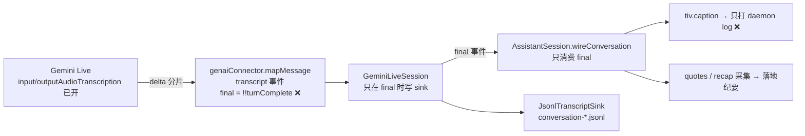

# FLY-1065 /gemini 文本面板双向转写 + 会话记录持久化 — 探索
Issue: FLY-1065 (https://linear.app/geoforge3d/issue/FLY-1065/voice-gemini-文本面板双向转写-会话记录持久化annie-真机验收反馈)
日期: 2026-07-09
基于: 无

## 1. 问题（Annie 真机验收原话,2026-07-09,[FLY-1047] thread）

> 「唯一的一个问题是,它在 Text(文本)界面这边显示得还是不够清晰。这边能够把我说了什么、对方说了什么都显示出来吗?以及我不知道在这里能不能实现类似对话记录的功能,就是把我和对方说的话都记录下来。」

两个诉求:

1. **实时双向转写显示**——语音会话进行中,文本频道里逐轮显示「Annie 说了什么」+「助理答了什么」,谁说的标清楚;
2. **会话记录持久化**——整场对话的逐字转写会后可查(与「会议简报/纪要」区分:纪要是摘要,这个是逐字记录)。

## 2. 现状审计（代码事实,基于 PR #501 head `683418b4`）

转写链路每一层都已存在,但**在生产上是断的**:

### 关键发现 1(推翻 issue 里的假设):`final` 语义错了,整条转写链在生产等于死的

issue 描述假设「Gemini Live 已回传 input transcription + 助理输出文本,主要是渲染/投递层工作」——**渲染层只是一半,根子在上游**:

- `genaiConnector.ts` 里 transcript 事件 `final: !!sc.turnComplete`,但 Gemini 的转写分片(delta)和 `turnComplete` **几乎从不同帧到达**——`final:true` 基本永远不触发;
- `@google/genai` SDK 的 `Transcription` 类型有官方 **`finished?: boolean`** 字段(「the end of the transcription」),967 的 connector 没有用它;SDK 注释还明确「transcription is independent to the model turn — doesn't imply any ordering」;
- **生产铁证**:本机 `~/.flywheel/voice-assistant/flywheel/` 里 12 场会话(7/7-7/9,含 Annie 真机验收)**0 个 `conversation-*.jsonl`**(sink 是 lazy-create,一条 final 都没写过);
- **用户侧铁证**:今天中午那场(FLY-1068)落地的纪要 comment 是空的——「(无 recap——会议在收尾前结束)」+「### 原话引用」下面零条。END_WORDS(「结束」)检测、recap 采集、quotes 全部依赖 final user transcript,所以 967 的收尾流程实际全靠 founder-leave 兜底在跑;
- **续跑复核补充铁证(2026-07-09)**:Annie 真机验收那场(19:27-19:32,FLY-1047 evidence `r2-daemon3-annie-live.log`)——755 ears frames / 283 audio chunks 的完整一来一回,daemon log **全程 0 条 `[caption:*]` 行**(caption 只在 final=true 时打日志);landing 由 founder-leave 触发、confirmed=false。独立证据链,同一结论。

⇒ **FLY-1065 的地基工作是 voice-core 的 turn 级转写聚合**(delta 分片 → 按轮聚合 → 真正的 final 事件),两个诉求都建立在它上面。这不改 967 的 ship(PR #501 原样),是 merge 后我们自己 PR 里的修复。顺带效应:967 的 end-word/recap/quotes 也会活过来(行为增强,非破坏)。

### 关键发现 2:caption 是 967 v1 故意 log-only 的

`wiring.ts` 里 `tiv.caption` 只打 daemon log,注释写明「a message per transcript line would flood the TIV — throttled captions ride with the shared TivPresenter when 545 PR-2 lands it」。545 PR-2 没落地,TivPresenter 不存在 ⇒ **caption 渲染层是本 issue 的绿地**,顺便把 545 计划里的 TivPresenter 形态(状态行单消息 edit ≥1s 节流)在 assistant 范围内先立起来。

### 关键发现 3:状态行本身就在刷屏,是「显示不清晰」的另一半

`tiv.status` 每次都发一条**新** Discord 消息:每轮对话循环 🎙 listening → 💬 speaking → 🎙 listening(+ 🧠 thinking),一场十轮的会 = 二三十条无内容的状态消息刷满文本面板,而真正的对话内容一条都没有。Annie 看到的正是这个。

### 关键发现 4:落地兜底路径指向不存在的文件

`AssistantLanding.transcriptPath = <stateDir>/${sessionId}.jsonl`,但真实 sink 写的是 `conversation-<randomUUID>.jsonl` ——落地失败时给 Annie 的「完整记录在 ...」提示指向一个永远不存在的文件。1065 顺手对齐(sink 文件名改用 sessionId)。

### 现状小结

| 层 | 现状 | FLY-1065 动作 |
|----|------|--------------|
| Gemini 转写回传 | ✅ 双向已开 | 不动 |
| transport 事件映射 | ❌ final 语义错 | 透传 `finished` 字段 |
| session 层 turn 聚合 | ❌ 不存在(只有分片透传) | **新增**(地基) |
| JSONL 落盘 | 接了但从没写过 + 文件名错 | 激活 + 对齐 sessionId + scrub |
| TIV caption 渲染 | log-only | **新增** 逐轮短消息 |
| TIV status | 每变化一条新消息(刷屏) | 单消息 edit 节流 |
| 会后逐字记录 | 无 | **新增** 落地时发 Linear kickoff issue comment |

## 3. 方案空间

### 层 1 · turn 聚合放哪(地基)

| 方案 | 说明 | 判 |
|------|------|----|
| **A. GeminiLiveSession 聚合(推荐)** | session 维护 per-role 文本 buffer;分片照旧发 `final:false` 事件(向后兼容);轮边界到达时发聚合全文的 `final:true` 事件并写 sink | transport 保持「1:1 映射消息」的薄哲学;所有消费者(caption/quotes/sink/545/1018)一次受益 |
| B. connector 聚合 | transport 层拼字符串 | 违反 transport 薄映射纪律;测试都在 backend 层 |
| C. 消费端聚合(voice-bridge) | AssistantSession 自己拼 | 每个消费者重复实现;JSONL sink 在 voice-core 内,够不着 |

轮边界信号(按优先级):
- **主信号**:`Transcription.finished === true`(SDK 官方语义,connector 透传);
- **兜底**:assistant → `turnComplete`;user → 下一个 assistant 输出开始(user 转写独立于 model turn,可能晚到);
- **打断**:`interrupted`/manual interrupt → assistant buffer 以「(被打断)」标记 flush(口播被掐断,转写文本可能多于实际说出的,记录里如实标注);
- **收尾**:close() 前 flush 双向残余。
- **风险**:`finished` 在真机上是否稳定回传需 implement 阶段用现有 spike 形态先验(GEMINI_API_KEY 在机;失败则退兜底信号,设计上两套信号并存,不赌单一来源)。

### 层 2 · 实时显示形态

| 方案 | 判 |
|------|----|
| **A. 逐轮短消息(推荐)** | 每个完成的轮 = 一条短消息:`🗣️ **Annie**:…` / `💬 **助理**:…`。正对 Annie 手机阅读习惯(issue 约束原文「短消息逐轮 > 大段刷屏」);Discord 消息节奏 = 对话轮节奏(几秒一条),天然不撞 rate limit |
| B. 单消息滚动 edit | 545 TivPresenter 的**状态行**形态——适合状态,不适合对话内容(手机上 edit 不推送、历史不可回溯) |
| C. partial 流式字幕 | 每分片 edit 一次,闪烁 + rate limit 风险;v1 不做,留观感反馈后再议 |

配套:status 行改成**单消息 edit-in-place(≥1s 节流)**,把刷屏的状态消息压成一条;长轮文本 >1800 字符截断加「…(截断,完整见会后记录)」。

### 层 3 · 会后持久化形态

| 方案 | 判 |
|------|----|
| **A. Linear kickoff issue comment(推荐)** | 落地时(landing)把逐字记录作为**独立于纪要的第二条 comment** 发到本场的 kickoff issue(如 FLY-1068)。每场会本来就有自己的 issue,纪要已在那——摘要+逐字同处一地,「会后可查」有唯一入口;超长分段(每段 ≤~20k 字符,cap 若干段,超出注明 JSONL 路径) |
| B. Discord per-session thread | 又一个 moving part;TIV 频道本身已是可回看的历史(实时 caption 消息就在那) |
| C. 只留 JSONL 文件 | Annie 手机上看不到;只配当兜底 |

三层叠加后的完整体验:**会中** TIV 逐轮看双向转写;**会后** kickoff issue 里纪要 + 逐字记录;**兜底** 磁盘 JSONL(文件名对齐 sessionId,落地失败提示不再指向空文件)。

### Secret scrub(issue 红线)

转写以口语为主,但助理答案可能复述工具输出(board/issue 内容)。新增共享 `scrubTranscript()`(纯函数,voice-core),覆盖常见凭证形态(`sk-`/`ghp_`/`github_pat_`/`xox*`/`AIza`/`Bearer <tok>`/`*_TOKEN=`/`*_KEY=` 等 → `[redacted]`),应用在**全部三个出口**:JSONL append、TIV caption 消息、Linear comment。

## 4. 约束与依赖

- **PR #501 还没 merge**(OPEN):本分支(flywheel-FLY-1065)基于 main,上面没有 assistant 代码。implement 阶段要么等 #501 merge 后 rebase,要么 stack 在 flywheel-FLY-967 上——**排序问题交 Lead 定**;
- **不改 967 的 ship**:#501 原样过;本 issue 的所有改动(含 voice-core final 修复)在自己的 PR 里;
- **字节兼容**:transcript 事件 shape 只加可选字段(如 `interrupted?`),`final:false` 分片行为不变;不开 /gemini 的路径零变化;
- **与 FLY-1018 组合**:B 线 gemini-agent 走同一 voice-core 事件面,层 1 修复它免费受益;无耦合。

## 5. 开放问题(带进 brainstorm gate)

1. **分支基线**:等 #501 merge 再 implement,还是直接 stack 在 flywheel-FLY-967 上?(推荐前者,Annie 已验收,#501 应该快了)
2. **scope 确认**:voice-core final 语义修复在 1065 范围内(必须——否则两个诉求都是空中楼阁),顺带激活 967 的 end-word/recap/quotes,行为增强可接受?
3. **持久化形态**:推荐 Linear kickoff issue comment(方案 A),OK?
