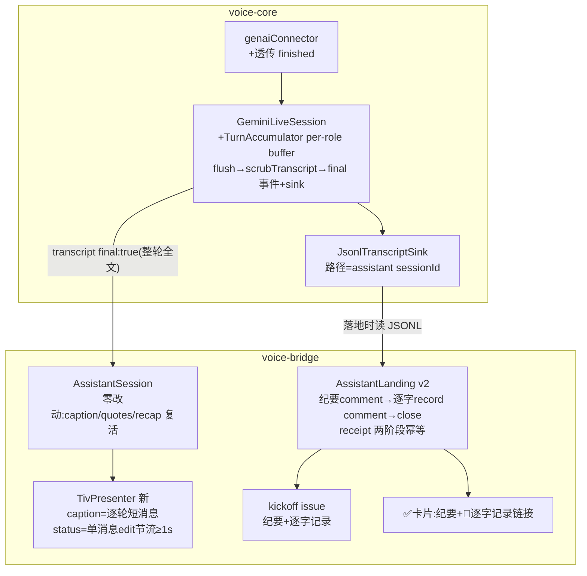

# FLY-1065 /gemini 文本面板双向转写 + 会话记录持久化 — 实施计划
Issue: FLY-1065 (https://linear.app/geoforge3d/issue/FLY-1065/voice-gemini-文本面板双向转写-会话记录持久化annie-真机验收反馈)
日期: 2026-07-09
基于: research.md(brainstorm gate 已过,Tadashi 三问全批 + 一条补充:会后 TIV 发带 issue 链接的短消息)

**版本**: v1.58.0(暂定,ship 取空号)
**Status**: codex-approved(design review 2 轮:R1 八条全采纳,R2 APPROVED + 两条实现 guardrail 已折入——见 §6 review 记录)+ **续跑修订 2026-07-09**(mini-spike 探针结果驱动的 flush 信号链增补,见 §6b;架构不变,per Tadashi 快进指令不开第二轮完整 review,delta 已单独上报)

## 0. 一句话

修活 voice-core 的转写 final 语义(delta 分片 → turn 级聚合,`Transcription.finished` 主信号 + 三层兜底),在 /gemini 的语音文本频道逐轮渲染双向转写(短消息,status 刷屏改单消息 edit),会后把逐字记录落到本场 kickoff issue 的独立 comment(scrub 三出口统一),JSONL 落盘修活并对齐 sessionId。

## 1. 前提与红线

- **开工前提(已解除+已验证)**:#501 已 merge 进 main(`a7de3e8d`)。**续跑注记(2026-07-09)**:本分支已重切到含 #501+#524(FLY-1047 turn-end 修复)的最新 main,preflight 两项**已当场验证过**:① `packages/voice-bridge/src/assistant/` 存在 ✓;② Bridge 路由 `POST /api/linear/comment` 在 `packages/teamlead/src/bridge/plugin.ts:2386` ✓。implement 开工无 rebase 前提。
- **不改 967 ship**:#501 原样;本计划所有改动在本分支的独立 PR。
- **字节兼容**:
  - transcript 事件与 `TranscriptEntry` 只加**可选**字段(`finished?`/`interrupted?`);`final:false` 分片行为不变;
  - 不配 `huddle.assistant` 的项目零行为变化;
  - `assistant.captions !== false` 默认开,显式 `false` = caption 回 v1 log-only(一键逃生);
  - voice-core / voice-bridge 既有测试**不改自绿**(唯一例外:直接断言「final=turnComplete 同帧」旧语义的测试,若存在则改为断言新语义并在 PR 里点名)。
- **秘密红线**:所有对外出口(JSONL 落盘 / Discord caption / Linear comment)必须过 `scrubTranscript()`。
- **控制提示纪律**:`sendText()` 的控制提示(开场/收尾/收音故障)照旧永不入 transcript/caption/记录。
- **中英双语合同**(Annie 补充需求,[FLY-1065] thread 2026-07-09:「we need both chinese and english, we could speak english sometime」):转写语言**不 pin**——SDK `AudioTranscriptionConfig.languageCodes` 不设 = 模型自动检测,967 现行 config 已是空 `{}`,**保持并用测试钉死**(genai-config 测试断言 input/output 转写配置仍为 `{}`,永不引入 languageCodes);渲染/记录/scrub 全链语言无关(字符级处理、无 CJK 特判——TurnAccumulator 纯字符串拼接、caption 截断按字符数、scrub 模式全是凭证形态与自然语言无关);P7 加中英混排单测,QA 验收矩阵加中英混说场景(一轮中文、一轮英文、同轮混说,字幕分轮/角色标注不乱)。

## 2. 架构



## 3. 改动清单(file-by-file)

### P1 · voice-core:transport 透传 `finished`

**`packages/voice-core/src/backends/gemini/transport.ts`**
- `LiveServerEvent` 的 transcript variant 加 `finished?: boolean`(可选,additive)。

**`packages/voice-core/src/backends/gemini/genaiConnector.ts`**(mapMessage)
- `inputTranscription`/`outputTranscription` 事件增发 `finished: sc.inputTranscription.finished === true`(resp. output);
- **(续跑修订)** 透传 `sc.generationComplete` 为新事件 `{ type: "generation-complete" }`(现被 mapMessage 忽略;`LiveServerEvent` 联合加此 variant)——探针实证它紧跟最后一个转写分片(51ms),而 turnComplete 晚 10.2s(见 evidence/finished-flag-probe.md),它是 assistant flush 的主兜底信号;
- `final` 字段**保留原计算**(`!!sc.turnComplete`)不动——分片语义由 P2 的聚合层重新定义 final,connector 保持薄映射(旧 final 字段成为死信号,P2 里 session 层不再依赖它;不删字段是为 transport 类型兼容);
- **同帧顺序钉死**(Codex R1 #5):mapMessage 的 emit 顺序调整为**转写分片先于 `interrupted`**——若 Gemini 在同一 serverContent 里同时带 `interrupted` 和 `outputTranscription`,分片必须先 append 进聚合 buffer,interrupted 的 flush 才能带上这最后半句;否则同帧分片会被 cancel 抑制吞掉。connector 测试断言这个顺序(interrupted + outputTranscription 同帧 → 先 transcript 事件后 interrupted 事件)。

### P2 · voice-core:GeminiLiveSession turn 聚合(地基)

**`packages/voice-core/src/backends/gemini/GeminiLiveBackend.ts`**

新增内部 `TurnAccumulator`(同文件或独立 `turn-accumulator.ts`,纯逻辑可单测):

```ts
class TurnAccumulator {
  private userBuf = "";
  private assistantBuf = "";
  append(role, fragment): void
  /** 返回聚合全文并清空;空 buffer 返回 null(不发事件) */
  flush(role): string | null
  flushAll(): { user: string | null; assistant: string | null }
}
```

`onServerEvent` 的 transcript case 重写(flush 信号链为**续跑修订**版——探针实证 finished 双向不回传 + turnComplete 比生成完成晚 10.2s,原「finished 主信号」在当前生产 model 上不可用,详见 evidence/finished-flag-probe.md;架构不变,信号优先级重排):
1. 分片到达:`acc.append(role, text)` + 照旧 emit `{role, text, final:false}`(分片透传,消费者无感;assistant 分片在 turnCancelled 时照旧抑制);**user 分片到达时**若 assistantBuf 非空(罕见:她的转写晚到跨进了模型答话)不动 assistant——只按各自信号 flush;
2. 事件自带 `finished===true` → `flushFinal(role)`(快路径保留:官方契约字段,model 升级自动受益);
3. **(续跑修订)首个 assistant 输出到达**(本轮第一个 assistant 转写分片或第一个 audio chunk)→ `flushFinal("user")`——她说完、模型才会接话,此刻 user turn 必然可界定(探针:input 转写先于首个 output 分片 5ms 到达);这是 user caption 的主兜底,否则 user 字幕要等 turnComplete(轮末 +10s);
4. **(续跑修订)`generation-complete`** → `flushFinal("user")`(晚到 input 转写的保底)再 `flushFinal("assistant")`——assistant 的主兜底:生成文本已完整,距最后分片 51ms,字幕先于音频播完属正常字幕体验;
5. `turn-complete` → 先 `flushFinal("user")` 再 `flushFinal("assistant")`(终兜底,信号缺失时的轮末保底),然后既有 response-done 逻辑;
6. `interrupted` / manual `interrupt()`:在 `cancelCurrentTurn()` **之前** `flushFinal("assistant", { interrupted: true })`(被打断的半句如实留痕;若 generation-complete 已先 flush 过、buffer 为空则天然无二发——此时她打断的是播放,文本已完整落,不带 interrupted 标是如实的);userBuf 保留(打断=她在说话);
7. `close()`:`flushAll()` 双向残余(rotator 轮换不丢尾巴),再走既有 close;
8. `flushFinal(role, opts?)` 统一实现(判空先于 scrub,Codex R2 guardrail #2):`const raw = acc.flush(role); if (raw == null) return;`(**多信号到达不多发**——判空是所有信号的幂等闸)`const text = scrubTranscript(raw);` emit `{role, text, final: true, interrupted: opts?.interrupted}`;`writeTranscript(role, text, interrupted)`。

**`packages/voice-core/src/types.ts`**
- `ConversationEventMap` transcript 事件对象加 `interrupted?: boolean`(可选);
- `TranscriptEntry` 加 `interrupted?: boolean`(可选)。

**`packages/voice-core/src/scrub.ts`(新)** — `scrubTranscript(text: string): string` 纯函数:
- 模式(→ `[redacted]`):`sk-[A-Za-z0-9_-]{16,}`、`ghp_[A-Za-z0-9]{20,}`、`github_pat_\w{20,}`、`gho_[A-Za-z0-9]{20,}`、`xox[baprs]-[A-Za-z0-9-]{10,}`、`AIza[A-Za-z0-9_-]{30,}`、`Bearer\s+[A-Za-z0-9._~+/=-]{16,}`、`\b[A-Z][A-Z0-9_]*(?:TOKEN|KEY|SECRET|PASSWORD)\s*[=:]\s*\S{8,}`、裸长随机串(`[A-Za-z0-9+/=_-]{40,}` 且含数字与字母);
- 中文口语/普通英文句子必须原样通过(误伤面单测钉死);
- 从 `index.ts` 导出(voice-bridge 复用)。

**接线**:`createConversation` 的 `ConversationOptions` 不变(sink 已在 opts 里)。

### P3 · voice-core:sink 路径对齐 sessionId

**`packages/voice-bridge/src/assistant/wiring.ts`**
- `makeRealConversationFactory` 返回的工厂签名扩为 `(systemPreamble: string, opts: { sessionId: string })`;`JsonlTranscriptSink` 路径改 `join(d.stateDir, `${opts.sessionId}.jsonl`)`(与 AssistantLanding.transcriptPath 同源同名,断链修复);
- `WireAssistantOptions.createConversation` test seam 同步新签名;
- **对齐合同讲清楚**(Codex R1 #6):对齐的是**文件名**(= assistant sessionId,一场会一个文件,天然跨 rotator 轮换聚合);JSONL **行内**的 `sessionId` 字段仍是 Gemini backend session UUID(一场会经 rotator 轮换会出现多个,保留它正好留下轮换痕迹)。landing 只按文件读,行内 sessionId 不参与任何对账。此合同写进 wiring 注释,不给行加 assistantSessionId 字段(文件名已承载)。

**`packages/voice-bridge/src/assistant/AssistantSession.ts`**
- `AssistantSessionOptions.createConversation` 签名同步;`start()` 调用处传 `{ sessionId: this.opts.sessionId }`。

### P4 · voice-bridge:TivPresenter(渲染层)

**`packages/voice-bridge/src/discord/TivPresenter.ts`(新;545 计划路径,后来者复用)**

```ts
export interface TivSendDeps {
  send(text: string): Promise<void>;                       // 现 sendMessage 包一层
  sendForId(text: string): Promise<{ messageId: string }>; // status 锚消息
  edit(messageId: string, text: string): Promise<void>;
}
export interface TivPresenterOptions {
  deps: TivSendDeps;
  founderName?: string;        // 默认 "Annie"
  assistantName?: string;      // 默认 "助理"
  captions?: boolean;          // 默认 true;false = caption 走 log
  statusThrottleMs?: number;   // 默认 1000
  captionMaxChars?: number;    // 默认 1800
  log?: (line: string) => void;
  now?: () => number;          // fake-timer 测试 seam
}
export class TivPresenter {  // 实现 AssistantSession 的 TivSurface
  status(line: string): void
  caption(role: "user" | "assistant", text: string): void
  card(text: string): void
  error(text: string): void
}
```

行为合同:
- **caption**:每次调用 = 一条新消息。`🗣️ **{founderName}**:{text}` / `💬 **{assistantName}**:{text}`;`interrupted`(经 caption 文本尾注传入,见 P5)加「 (被打断)」;超 `captionMaxChars` 截断 +「…(截断,完整见会后记录)」;文本发出前再过一次 `scrubTranscript()`(防御纵深,Codex R1 #7——presenter 是 545/1018 未来复用的共享路径,不能只信上游已洗);`captions:false` 时降级 `log('[caption:...]')`(= 967 v1 行为,逃生口);发送失败 log 不 throw(与现 tiv 一致);
- **status**:单消息 edit-in-place,**single-flight 异步状态机**(Codex R1 #4——status() 是 void 同步接口,底下的 sendForId/edit 是异步,只靠节流挡不住 promise 时序下多发锚消息)。内部合同:
  - 状态:`statusMessageId: string | null`、`latestLine: string`、`dirty: boolean`、`inFlight: Promise<void> | null`、`flushTimer`;
  - `status(line)` 只做:`latestLine = line; dirty = true; scheduleFlush()`——绝不直接发;
  - `scheduleFlush()`:已有 flushTimer 或 inFlight 未决 → 返回(合并);否则按 `statusThrottleMs` 距上次发送的剩余时间挂 timer;
  - flush 执行(任何时刻**至多一个在飞**):`dirty=false` 取 `latestLine`;无 `statusMessageId` → `sendForId`(成功记 id);有 → `edit`;edit 失败 → 重新 `sendForId` 记新 id(自愈);操作 resolve 后若 `dirty` 又为 true → 立即再 schedule(晚到的新行绝不丢、绝不被旧行覆盖——单飞 + 最新行覆写天然免疫 stale write);
  - 全链失败 log 不 throw;
- **card / error**:独立新消息(现行为,error 前缀 ⚠️)。

**`packages/voice-bridge/src/bots/discordWiring.ts`**
- `DiscordDeps` 加(additive):
  - `sendMessageForId(client, channelId, text): Promise<{ messageId: string }>`
  - `editMessage(client, channelId, messageId, text): Promise<void>`
- discord.js 真实现:`channel.send()` 返回 Message → 取 `.id`;edit 走 `channel.messages.edit(messageId, text)`(或 fetch+edit,取现库最简形态);跟随现 `sendMessage` 的错误处理风格。

**`packages/voice-bridge/src/assistant/wiring.ts`**
- 现内联 `tiv` 对象换成 `new TivPresenter({...})`:deps 用 orchestratorClient + `config.voiceChannelId` 闭包 `sendMessage`/`sendMessageForId`/`editMessage`;`captions: assistant.captions !== false`;`founderName` 复用 GeminiCommand 的 founderName 来源(config,默认 "Annie");`assistantName: "助理"`;
- `AssistantSession` 的 `TivSurface` 接口(status/caption/card/error 四方法)**签名不变**。

**`packages/voice-bridge/src/assistant/config.ts`**
- `AssistantModeConfig` 加可选 `captions?: boolean`(projects.json `huddle.assistant.captions`,缺省 true;config 校验:非 boolean 显式报错,照 bargeIn 的 fail-fast 形态)。

### P5 · voice-bridge:AssistantSession 微改(interrupted 贯通 + 落地前 flush 时序)

**`packages/voice-bridge/src/assistant/AssistantSession.ts`**
- `wireConversation` 的 transcript handler:事件对象读可选 `interrupted`;`tiv.caption(t.role, t.interrupted ? `${t.text} (被打断)` : t.text)`(TivSurface 签名不动,尾注在调用侧拼——presenter 不感知语义);
- quotes/END_WORDS/recap 逻辑**零改动**(final 复活它们自动工作);
- 被打断的 assistant final **不**计入 recapText(concluding 中被她打断的 recap 半句不算数——`if (t.interrupted) return` 于 recap 累积分支;quotes 是 user 侧不受影响);
- **落地前 flush 时序(Codex R1 #1 blocker 修复)**:现状 `toLanding()` 先 `landing.run()` 后 `teardown()`,而 P2 的 close-flush(含 rotator 尾巴)发生在 `teardown()` 里的 `conv.close()`——landing 读 JSONL 会读不到收尾残余。`toLanding()` 重排为:
  1. 停新输入:清 join/ears/recap 三 timer(现有 clearTimer),ears 帧路由自然随 state=landing 停(onFrame guard 只认 live/concluding);
  2. **transcript handler 保持订阅**,`await this.conv?.close()`——close-flush 的 final 事件照常走 quotes/recap/caption/sink;**recap 累积守卫**(Codex R2 guardrail #1):recap 分支现在只认 `_state === "concluding"`,而此刻 state 已翻 landing——close-flush 的 assistant final 会漏出 recapText。实现用 `closingFromConcluding` 一类标志(进 landing 时记下来路是否 concluding)让 close-flush 期间的 assistant final 仍进 recap;P7 对应测试为强制项;
  3. `this.conv = null`(teardown 不二次 close);
  4. 然后才 `landing.run(...)`(此刻 JSONL 已含全部残余);
  5. `teardown()` 现有实现对 `conv === null` 已安全(`this.conv?.close()`)。
  单测钉死:fake conversation 的 `close()` 在 resolve 前 emit 一条 final transcript → 断言 landing 读到它(经注入的 readTranscript)且 quotes/recap 含它。

### P6 · voice-bridge:AssistantLanding v2(逐字记录落地)

**`packages/voice-bridge/src/assistant/AssistantLanding.ts`**
- `Receipt` 加可选 `transcript?: { rowCount: number; chunkCount: number; postedChunks: number; completeAt?: string }`(**chunk 粒度幂等**,Codex R1 #2 blocker 修复;旧 receipt 无此字段 = summary 已发、逐字未发,additive 兼容);
- `AssistantLandingOptions` 加 `readTranscript?: () => TranscriptRow[]`(默认实现:读 `transcriptPath` JSONL,逐行 `JSON.parse`,坏行跳过并 log;文件不存在 → `[]`);
- 新静态 `buildTranscriptComments(rows, opts): string[]`(**纯函数、确定性**——同一 JSONL 永远切出同样的段,这是 chunk 幂等的前提;会已结束,JSONL 不再增长):
  - 头「## 逐字对话记录(/{commandName} 助理)」+ marker 行「assistant-transcript {sessionId} chunk {i}/{n}」;
  - 逐轮 `- [HH:MM:SS] **Annie**:…` / `- [HH:MM:SS] **助理**:…`(ts 取本地时间;interrupted 加「 (被打断)」;每行文本再过 `scrubTranscript()`——防御纵深,readTranscript 可注入/旧文件可能未洗,Codex R1 #7);
  - 分段:单条 ≤20_000 字符,最多 3 条;超出末条注明「更长部分见本机 {transcriptPath}」;
- `run()` 顺序改为:summary comment(现状,receipt.commentAt 幂等)→ **transcript comments 逐段**:
  - rows 为空 → 跳过整个 transcript 阶段,不算失败,`transcriptChunks: 0`;
  - 首次进入:receipt 写 `transcript: { rowCount, chunkCount, postedChunks: 0 }`;
  - 从 `postedChunks` 索引起逐条 POST,**每成功一条原子写一次 receipt(postedChunks++)**——chunk 1 成功 chunk 2 失败的重跑从 chunk 2 续,绝不重发 chunk 1;
  - 全部发完写 `completeAt`;
  - 重跑对账:receipt 里 `rowCount/chunkCount` 与本次重建不一致(理论不该发生)→ LOUD log + 以 receipt 的进度为准继续按新切分发剩余段(内容如实优先于格式洁癖),不重发已计数的段;
  - 段失败 → `{ok:false, stage:"transcript", message:"纪要已落,逐字记录发到第 {postedChunks}/{chunkCount} 段失败(…)——完整记录在 {transcriptPath},issue 保持打开,重跑从断点续发。"}`;
  → closeIssue(现状);
- `LandingResult` 的 fail stage 联合加 `"transcript"`;成功返回加 `transcriptChunks?: number`(卡片措辞用)。

**`packages/voice-bridge/src/assistant/AssistantSession.ts`**(landing 卡片,Tadashi gate 补充)
- 成功卡片扩为:`✅ 会议纪要 + 📝 逐字对话记录已落 {issueId}\n{commentUrl}`(transcriptChunks===0 时回落现措辞「✅ 会议纪要已落…」,不谎称有逐字记录);未确认尾注保留。一条消息,不另发第二条。

### P7 · 测试

**voice-core(`packages/voice-core/src/__tests__/`)**
- `turn-accumulator.test.ts`(新):分片累积/flush 清空/空 flush=null;
- `gemini-live.test.ts` 扩:
  - finished 快路径:user 分片×3 + finished → 1 个 final(全文=拼接),sink 1 行;
  - **(续跑修订)首个 assistant 输出 flush user**:user 整句分片 → 首个 assistant 转写分片(或 audio chunk)到达 → user final 立即发(不等 turnComplete);
  - **(续跑修订)generation-complete flush assistant**:assistant 分片×N + generation-complete → assistant final 立即发;其后 turnComplete → 无第二个 final;
  - turnComplete 终兜底:无 finished/generation-complete,turnComplete → user+assistant 各 1 final(user 先);
  - 多信号不多发:finished / generation-complete / turnComplete 任意组合到达 → 每 role 至多 1 个 final(判空幂等闸);
  - interrupted:assistant 分片×2 + interrupted → final{interrupted:true} 先于 response-cancelled,sink 行带 interrupted;后续分片抑制照旧;
  - close flush:双向残余各 1 final;
  - **interrupted + outputTranscription 同帧**:分片先入 buffer、interrupted flush 带上同帧半句(connector emit 顺序 + session 行为双层断言,Codex R1 #5);
  - 控制提示 sendText 不入 transcript(既有断言保持);
  - scrub 在 final 出口生效(分片事件不 scrub 的边界也断言);
- `scrub.test.ts`(新):每类凭证形态命中(纯中文/纯英文/中英混排三种包裹文本下都命中)+ 中文口语/普通英文/中英混说句/URL/issue 号原样通过;
- `genai-config.test.ts` 扩:inputAudioTranscription/outputAudioTranscription 配置断言仍为 `{}`(语言合同哨兵,永不 pin languageCodes);
- 既有 79+ 测试不改自绿(byte-compat 哨兵)。

**voice-bridge(`packages/voice-bridge/src/__tests__/`)**
- `tiv-presenter.test.ts`(新,fake timers):caption 逐轮新消息/角色前缀/截断/caption 出口 scrub/captions:false 走 log/发送失败不 throw;status single-flight 全套(Codex R1 #4):首发前连发多条只出 1 条锚消息、慢 edit 在飞时新行到达不丢不乱序、edit 失败且队列有新行 → 自愈重发且内容是最新行、节流窗口合并只留最新;
- `assistant-landing.test.ts` 扩:transcript comment 分段(1 条/2 条/超 3 条注明路径)/空 rows 跳过/receipt chunk 幂等(**chunk 1 成功 chunk 2 失败 → 重跑不重发 chunk 1、续发 2-3**,Codex R1 #8;旧 receipt 无 transcript 字段兼容;rowCount 不一致 LOUD log 继续)/失败顺序三组(summary 失败、transcript 段失败、close 失败)/坏 JSONL 行跳过/逐行 scrub;
- `assistant-session.test.ts` 扩:interrupted caption 尾注/interrupted 不入 recap/成功卡片含逐字记录措辞(0 chunks 回落)/**落地前 flush 时序**(fake conversation 的 close() resolve 前 emit final transcript → landing 读到它、quotes/recap 含它、teardown 不二次 close,Codex R1 #1/#8);
- `assistant-wiring.test.ts` 扩:sink 路径 = `${sessionId}.jsonl`/tiv 换 presenter 后 status-edit 生效/captions 开关。

**真机(implement 阶段内做,evidence 落 doc 文件夹)**
- **mini-spike(P2 前置)——已完成 ✅**:前任 implement runner OOM 前已跑完,evidence 已固化(`evidence/finished-flag-probe.{md,json}`)。结论:finished 双向不回传、turnComplete 晚 10.2s、generationComplete 及时(51ms)、分片 delta 假设成立(input 整句/output 细碎无重叠)——P1/P2 的续跑修订即由此驱动,implement 不必重跑探针;
- **staged E2E**:gemini-staged.mjs 形态 + autostart,一轮后断言:TIV 出现 ≥1 条 caption 消息、status 消息全程只 1 条(edit)、kickoff issue 出现纪要+逐字两条 comment、JSONL 落盘非空;
- QA 阶段(三段式)独立复验 + 真 /gemini 轮;最终验收 = Annie 真机(她的原始抱怨就是验收判据:文本面板能看清谁说了什么 + 会后能翻记录)。

## 4. 交付切分(单 PR,4 commit 粒度)

| # | 内容 | 验证 |
|---|------|------|
| C1 | P1+P2+scrub(voice-core 地基) | voice-core 全测绿 + mini-spike evidence |
| C2 | P3(sink 路径)+ P4(TivPresenter + DiscordDeps + config) | voice-bridge 单测绿 |
| C3 | P5+P6(session 微改 + landing v2 + 卡片) | 全仓测试 + lint 绿 |
| C4 | staged E2E + evidence + docs 收尾 | E2E 断言全过 |

## 5. 风险与对策

| 风险 | 对策 |
|------|------|
| `finished` 服务端不回传/语义漂移 | **已实证不回传**(探针,evidence/finished-flag-probe.md)——主路径已按实证重排为 首个输出(user)/generation-complete(assistant),turnComplete 终兜底;finished 透传保留作 model 升级快路径 |
| **(续跑修订)`generationComplete` 语义漂移/某些轮缺失** | turnComplete 终兜底仍在(最坏退化为轮末聚合);判空幂等闸保证多信号不多发;P7 单测钉住每条信号路径 |
| user 转写晚到(与 model turn 无序),flush 边界把她下一句开头卷进上一轮 | 已接受的 v1 边界:探针显示正常路径 input 先于首个 output 到达;晚到场景由 generation-complete/turnComplete 保底,错位以轮为界,记录如实、不丢内容 |
| Discord edit 限速/消息被删 | status edit ≤1/s 节流;edit 失败自愈重发;caption 为轮节奏天然低频 |
| Linear comment 尺寸上限未知 | 20k/条保守分段 + cap 3 条 + 溢出注明 JSONL 路径;implement 时真 API 验证一次 |
| scrub 误伤口语 | 模式全部要求长随机串特征;误伤面单测钉死(中文句子/URL/issue 号原样) |
| 967 复活行为算回归? | gate 已裁定为增强;既有测试不改自绿 + 新行为单测点名;staged E2E 验证收尾链路 |
| `/api/linear/comment` 路由不在 main | 它随 #501 的 plugin.ts 来(#501 head plugin.ts:2326,已核);rebase 后 preflight 显式验证(§1),缺失即停报 Lead |
| #501 迟迟不 merge | design 阶段不阻塞(本计划);implement 开工硬前提,卡住则报 Lead |

## 6. Codex design review 记录

- **R1(2026-07-09,xhigh)= CHANGES REQUESTED,8 条全采纳**:
  1. 落地前 flush 时序 blocker → P5 toLanding 重排(close 先于 landing.run);
  2. transcript receipt 改 chunk 粒度幂等 → P6 receipt.transcript{rowCount,chunkCount,postedChunks,completeAt};
  3. /api/linear/comment 路由不在 main → 核实随 #501 plugin.ts:2326 来,§1 加 preflight 显式验证(非新建路由);
  4. TivPresenter status 补 single-flight 异步状态机合同 → P4;
  5. interrupted 同帧转写顺序钉死 → P1 connector emit 顺序 + 双层测试;
  6. sessionId 对齐 = 文件名合同(行内保留 backend UUID)讲明 → P3;
  7. scrub 防御纵深 → caption 出口 + landing 逐行各补一道;
  8. 两个高危回归测试点名 → P7。
- **R2(2026-07-09,xhigh)= APPROVED**,两条非阻塞实现 guardrail 已折入:① P5 recap 累积守卫(closingFromConcluding 标志,close-flush 的 assistant final 不许漏出 recapText);② P2 flushFinal 判空先于 scrub。R2 另独立核验了 /api/linear/comment 随 #501 而来(683418b4 plugin.ts:2326,含 issueId/body 校验 + project binding)。review 原文:design-review-round1.md / design-review-round2.md(同文件夹)。

## 6b. 续跑修订记录(2026-07-09,OOM 事故后续跑 runner)

前任 implement runner(351e77f1)在 OOM 事故(14:27)前跑完了 P7 的 mini-spike 探针,结果未及折入 plan。续跑 runner 独立复核设计(结论与已批版全部一致,另补一条独立铁证:Annie 真机验收那场的 daemon log 全程 0 条 caption——见 exploration §2)后,把探针结果折入:

- **探针事实**(evidence/finished-flag-probe.{md,json},生产同款 model):① `finished` 双向不回传;② `turnComplete` 比 `generationComplete` 晚 10.2s(音频播放时长量级);③ input 转写整句先于首个 output 分片到达;④ output 分片 delta 无重叠,拼接即全文。
- **修订内容**(P1/P2/P7/§5 已就地标注「续跑修订」):connector 透传 `generation-complete`;flush 信号链重排——user 主兜底 = 首个 assistant 输出,assistant 主兜底 = generation-complete,turnComplete 降为终兜底。**不改架构**(TurnAccumulator / 判空幂等闸 / scrub 出口 / receipt 幂等 / TivPresenter 全部原样),是已批设计「不赌单一信号,按优先级兜底」原则下的信号优先级调整;不修订则 caption 比对话晚约十秒,「实时」诉求破功。
- **review 姿态**:per Tadashi 快进指令(brainstorm gate 回复)不开第二轮完整 review;本节 delta 已在 design 阶段收尾时单独上报 Lead,由 Lead 决定是否补一轮轻量 review。
- **补记(implement 段,2026-07-09)**:Tadashi 指令补跑的 §6b 轻量 delta review 已完成——**Codex 3 轮 APPROVED**(design-review-delta-round{1,2,3}.md,同文件夹)。R1 抓出 `inputTranscription + interrupted` 同帧顺序洞(她新话的 cancel-window reset 被 cancel 覆盖 → 下一轮 assistant 输出被误抑制),R2 抓出同类的 interrupted 帧 audio 洞(reset 让旧 generation 音频漏过抑制)——两洞都源于 R1 #5「转写先于 interrupted」被双向套用,修法 = mapMessage 对 interrupted 帧 role-aware:output 转写 → interrupted → audio(留在 cancel 窗口内)→ input 转写(reset 存活)→ generation-complete → turn-complete;非 interrupted 帧字节不变。connector + session 双层测试钉死;真 Gemini E2E(evidence/live-aggregation-e2e.md)修后复跑 8/8。

## 7b. 给 implement 阶段的交接注记(续跑 runner,2026-07-09)

- **分支状态**:本分支(flywheel-FLY-1065)已重切到含 #501+#524 的最新 main;前任设计文档经 cherry-pick 保留(原远端分支的旧 base 历史被覆盖,内容零丢失)。§1 preflight 两项已验,开工无 rebase 前提。
- **前任 implement 现场**:git stash『oom-incident-20260709』(挂在 flywheel-FLY-1065 名下的那条,内容 = untracked 的 `packages/voice-bridge/src/discord/TivPresenter.ts` + `packages/voice-bridge/src/__tests__/tiv-presenter.test.ts`,共 383 行,对应 C2 的 P4 初稿)。恢复:`git stash list` 找到该条 → `git checkout <stash-ref> -- <两个路径>`(两文件是全新文件,与新 base 无冲突);**捡起后必须按 6b 的信号链修订自查一遍再续写**(初稿写于修订前)。前任 progress 显示 implement 走到 1/4(C1 未完)。
- **探针不必重跑**:mini-spike evidence 已固化(P7 已标注)。
- **stash 纪律**:该 stash 在 implement 捡完前不许 drop;同名 stash 还有 FLY-1060/FLY-1062 两条,别拿错。

## 7. 明确不做(v1 边界)

- partial 流式字幕(逐分片 edit)——观感反馈后再议;
- Discord per-session thread 持久化——kickoff issue 是唯一会后入口;
- 545(B 线 huddle)/1018(gemini-agent)的 caption 接入——TivPresenter 放共享路径供后来者复用,接入是它们自己的事;
- `final:false` 分片的 scrub(v1 无消费者展示/落盘分片,边界已文档化);
- 语音端任何行为改动(barge-in/VAD/turn-end 均不碰)。
