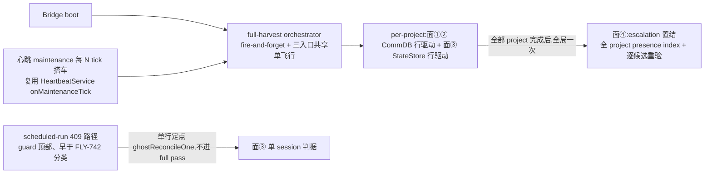

# FLY-1066 Bridge 侧残留收割 — 探索

Issue: FLY-1066 (https://linear.app/geoforge3d/issue/FLY-1066/infra-bridge-侧残留收割-commdb-孤儿注册清理-statestorecommdb-终态同步-scope-free-清理入口)
日期: 2026-07-16
基于: 无(上游取证 = FLY-1050 design addendum F8 系列,权威摘要在 FLY-1066 issue 描述;F8 防御规格另见 engineering/doc/FLY-1070-qa-respawn-verify/research.md §3)

## 1. 现象与取证(2026-07-16 只读复核,全部样本仍在场)

Flywheel 有两本账:**StateStore**(`~/.flywheel/teamlead.db`,Bridge 的 FSM 真相)和 **CommDB**(`~/.flywheel/comm/<project>/comm.db`,Lead↔Runner 通信 + Lead 视图 `runner_terminal_list` 的读模型)。两本账各自可以残留、也可以互相失同步,产生四种「永久僵尸」形态。

本次对生产库快照(scratchpad 只读副本)横扫了 Bridge 配置的全部 6 个 project,规模如下:

| 面 | 形态 | 生产样本(2026-07-16 在场) | 数量 |
|---|---|---|---|
| ① CommDB 孤儿 | CommDB sessions 有 row(status=running),StateStore **无 row** | `d2f31930`(tmux `%194`、issue_id=NULL、lead_id=NULL、2026-05-11) | 1 |
| ② 终态未同步 | StateStore 已终态(failed/blocked),CommDB registration 仍 running | `e4d3b29d`/`e90f3962`(GEO-441 auto-QA,`runner-geoforge3d:pending` 占位)+ geoforge3d 3 条(GEO-342/424/347)+ flywheel 8 条 | ~13 |
| ③ StateStore 幽灵 | StateStore **非终态**(如 awaiting_review),CommDB **无 row**,tmux terminal 已死 | Asha 夜跑事故形态(2026-07-15 夜,3 个夜跑位被吃 + close_runner 报 No session found;brainstorm gate 上 Tadashi 补充为必做面) | 事故实证 |
| ④ 双无主 escalation | `detection_escalations` 表 pending 行,target exec 在**两本账都查无此人** | 2026-07-15 夜 65 条告警风暴的实测形状(Tadashi 实测 sessions 表 0 命中) | 事故实证 |

面①②的 6 个已知样本 tmux 目标全部实测 `probe=dead`(`can't find pane`/`can't find window` 可证死亡消息)。

**面①②的伤害**:Lead 视图永远显示 running 僵尸(alive=false status=running),污染 bootstrap 与 runner_terminal_list;close_runner 够不到(面①无 StateStore row → No session found;跨 project 残留被 checkLeadScope 挡)。
**面③的伤害**:幽灵 session 一直占着 issue 的 active-session 位 → `/api/runs/start` 409 → cron/夜跑静默跳过(FLY-742 的 PR-证据路径只救 PR 已 merge/closed 的形态);close_runner 对 awaiting_review 又 status_not_eligible。
**面④的伤害**:pending escalation 反复驱动告警,风暴复燃源。

## 2. 根因 — 现有清理机制的结构盲区

现有三层清理(全部 Bridge 侧、boot 时跑)的候选枚举方式决定了各自的盲区:

| 机制 | 扫描集 | 对四面的行为 |
|---|---|---|
| FLY-638 `pruneDeadTerminalCommDbSessions` | CommDB `{completed,timeout}` 行 | 面①②③④均不在扫描集 |
| FLY-817 `reconcileCommDbRunningAgainstFsm` | CommDB `{running}` 行 | 面① → `keptNonTerminal`(无 FSM row 视为「无终局证明」豁免);面② → `keptPreserve`(CRASH_PRESERVE 一律不删,模块注释明说「read-model concern, tracked separately」——即本票);面③ **结构上看不见**(没有 CommDB 行可遍历);面④ 不涉及 |
| FLY-720 crash-reaper(心跳 tick) | StateStore running 行 + **CommDB tmux 目标可得** | 面③ 的 CommDB row 缺失 → no-target → 明确不 own(「absent / no-target / indeterminate are NOT owned here」) |

即:**面①②是 FLY-817 有意留下的两个缺口,面③是所有 CommDB-行驱动 sweep 的枚举盲区,面④是另一张表的孤儿**。FLY-1050 的 F8a-F8d fixtures 只保证 reconcile 代码对这些形态防御正确(不崩、不误 respawn),不收割——收割是本票。

## 3. 方案(brainstorm gate 已批,2026-07-16 Tadashi;含 4 条修正全采纳)

### 3.1 总形状:扩展既有 sweep,不建新模块框架、不建新 timer、不建新端点

- **面①②**:扩展 `commdb-fsm-reconcile.ts` 的既有扫描循环,新增两个收割分支(见 §3.2)。
- **面③**:新增 StateStore 侧分支——遍历 StateStore 非终态行,CommDB 无对应 row 且 probe=dead 时走 FSM finalize(见 §3.3)。
- **面④**:收割时顺手把「双无主」的 pending `detection_escalations` 行置 RESOLVED(见 §3.4)。
- **入口**(见 §3.5):boot sweep(既有循环)+ 心跳 tick 每 N tick 搭车(复用既有 timer)+ `scheduled_run_blocked` 触发的定点 reconcile。三个入口共用同一核心函数,全部 scope-free(遍历 Bridge config 全 projects、零 leadId 检查)。

### 3.2 面①② 收割判据(CommDB 行驱动)

```
面①(孤儿):CommDB running 行
  AND StateStore 无该 execution_id 的 row
  AND probeTmuxWindowLiveness(tmux_window) === "dead"
  AND 行龄 > 24h(started_at)
  → db.finalizeSession(execId)   // 原子:清孤儿 checkpoint gate + 删 sessions 行

面②(终态同步):CommDB running 行
  AND StateStore status ∈ {failed, blocked}(CRASH_PRESERVE)
  AND probeTmuxWindowLiveness(tmux_window) === "dead"
  → db.finalizeSession(execId)
```

- 删除动作复用 `finalizeSession`(FLY-1238 原子原语,连带清掉孤儿行挂着的未答 checkpoint gate——d2f31930 这类 2 个月的孤儿可能还挂着死 gate)。
- CommDB 行的退出方式维持既有约定 = DELETE(CommDB status CHECK 约束表达不了 failed/terminated;FLY-817 模块注释:「the only way a CommDB row leaves is a DELETE」)。**不**给 CommDB 加状态列/宽 CHECK。

### 3.3 面③ 收割判据(StateStore 行驱动,gate 修正①)

```
StateStore 非终态行(running/reconnecting/awaiting_review/approved_to_ship/design_done/pending)
  AND CommDB 无该 execution_id 的 row(注意:tmux 目标的唯一权威在 CommDB,row 缺失 ⇒ 无可寻址目标)
  AND session 级探活证明死亡:probeTmuxWindowLiveness(store.tmux_session) === "dead"
      (StateStore 只存 session 名,session 整体消失 = 该 runner 的窗口必然消失 = 死亡证明;
       session 还活着(有兄弟 runner)= 对该 runner 而言 indeterminate → keep)
  AND 行龄 > 30min(started_at;双重证据下比面①的 24h 短——理由见下)
  → applyTransition → `terminated`(全部非终态的 FSM 合法出边;失败即 keep + 告警,绝不 forceStatus)
    + 复用 crash-reaper 同款终态化侧效(CommDB finalize 幂等无行可删、belt/orchestrator 通知、archive)
```

- **为什么 30min**(Codex R1 #6 按 run-dispatcher 实核顺序修正):CommDB 预注册是 best-effort(preRegisterCommDb 失败被吞)且 Runner 自注册有延迟 → 年轻 StateStore 行短暂无 CommDB 行属正常瞬态;该窗口以秒~分钟计,30min >> 任何 spawn 延迟,且有 CommDB-row-缺失 + probe-dead 双证据,比面①的 24h 可以更短。反方向注意:预注册**先于** StateStore 行落库(fresh/retry 两路径皆然)→「CommDB running + 无 StateStore row + pending dead」是每次 spawn 的正常瞬态 → **面①的 24h 龄是实际安全边界(非纵深备份)**;started_at 缺失/非法/未来时间的行一律 fail-closed keep。
- **为什么 finalize 目标是 `terminated` 不是 `failed`**:`awaiting_review` 的 FSM 合法出边没有 `failed`(workflow-fsm.ts),`terminated` 是唯一从所有非终态都合法的终态;且与 crash-reaper 的先例(transition to terminated + prune CommDB + archive)一致,下游(AUTO_CLOSE、belt、archive)语义现成。
- **与 FLY-742 的边界**:FLY-742 的「PR open/unknown 绝不 auto-clear founder 拥有的 session」针对的是**还可能活着/可唤醒**的 parked runner;面③要求 CommDB row 缺失 + session 级死亡证明——该 runner 已不是可寻址实体(wake 发不到、close_runner 够不到),terminalize 是对既成事实的记账,不是替 founder 决策。此边界在 plan 里立节明写给 Codex reviewer。

### 3.4 面④ 双无主 escalation 置结(全局一次,非 per-project)

收割 pass 的最后一步、**每个全量 pass 只跑一次**(escalation 行没有 project 列,双无主时也无从反查 project):先对**全部** configured projects 的 CommDB 建 execution_id presence index(任一 DB 读取失败 → 本轮 face④ 整体放弃);遍历 `detection_escalations` 全部非 RESOLVED 行(NEW/LEAD_NOTIFIED/**ACKED**/ESCALATED/CLEARING——ACKED 纳入:机器证明的灭失不因 Lead 已 ack 而例外,与既有 recovery 契约一致),仅处理 execId 形态的 targetKey;初筛双无主后、UPDATE 前**逐候选重读双账**(防同 ID replay 竞态)→ 置 RESOLVED(`resolved_via='residue_harvest'`,复活 predicate 同步扩至该 token),防风暴复燃。target 仍在任一本账的行一概不碰。

### 3.5 入口与节奏(gate 修正④)



- **boot**:全量收割,folded 进既有 per-project fire-and-forget 循环(FLY-817 后、FLY-638 前后皆可,plan 定序)。
- **心跳搭车**:每 N tick(默认取 ~1h 等效)跑一轮全量收割——解决「周中僵尸要等重启」;零新 timer。
- **定点触发**(Codex R1 #3 修正插点):scheduled-run 409 路径,插在 **guard 顶部、早于 FLY-742 的 enabled 检查与 local classify**——running ghost 与 <120min 的 fresh-parked ghost 也必须能到达;仅由本票 flag 控制(FLYWHEEL_CRON_STALE_GUARD=0 不得关闭它)。对 blocker session 跑一次面③定点判据,证据足则当场 terminalize 放行 cron——这正是「昨晚 cron 位被吃」的最短闭环;判据不满足则逐字节回落 FLY-742 原路径。
- **scope-free 的边界**:遍历的是**本 Bridge config 的 projects**,不枚举 `~/.flywheel/comm/` 全目录——目录里有 QA-slot/其它 Bridge 的 CommDB(fire-test、qa-fly-123、test-slot-2…),它们的 StateStore 在别的库,全目录枚举会把别家活 session 全部误判为面①孤儿而误删。scope-free 指零 leadId 检查,不是跨 Bridge。

### 3.6 安全判据(硬约束,gate 修正③原文)

> 收割信号 = terminal/CommDB 存在性,绝不是 FSM 终不终态;awaiting_review + terminal 活 = 合法等 founder,结构性不可触。

- 删除/终态化只认 `probe === "dead"`(可证死亡);`alive`/`indeterminate` 一律 keep——「destructive delete must require PROOF of death, never the absence of proof of life」(FLY-638 原则续用)。
- design_done/parked 保活行(如三段式 design holder)结构性不可触:probe=alive 挡住;即便 probe 出 dead(tmux server 全灭),面③对其 terminalize 也是合法出边且诚实(runner 确已不在)。
- 面②对**活窗口**的 failed/blocked 行为零变化——FLY-116 CRASH_PRESERVE 保 scrollback/retry teardown target 的政策原样保留,只收割「窗口已可证死亡」的行(此时 preserve 的标的已不存在)。
- kill-switch:新 flag `FLYWHEEL_COMMDB_RESIDUE_HARVEST`(default on,`=0` 整体关闭四面收割;注册进 feature-flags registry)。FLY-817 的 `FLYWHEEL_COMMDB_FSM_RECONCILE` 语义不动。

### 3.7 对 FLY-817 review BLOCKER-1 的修订(gate 已放行,plan 立节明写)

FLY-817 Codex design R1 BLOCKER-1 裁定「failed/blocked 只看 FSM、绝不 probe、绝不删」,理由 = retry 的 `closeRunner(forcePreserved: true)` 要读 CommDB tmux 目标拆 preserved 窗口。本设计将其修订为「probe=dead 时可删」:窗口已可证消失时,teardown target 与 scrollback 都已不存在,preserve 的理由消失;删行后 retry 路径 `getTmuxTargetFromCommDb` 返回空 → closeRunner 幂等 success,无破坏。Tadashi 在 brainstorm gate 显式把关放行本修订(2026-07-16)。

## 4. 备选方案(已否决)

| 方案 | 否决理由 |
|---|---|
| CommDB status 加 failed/terminated(UPDATE 而非 DELETE) | CHECK 约束要重建表;与「CommDB 行退出=DELETE」的既有约定冲突;读模型(runner_terminal_list)还得再学一套状态 |
| 新 `/api/actions/cleanup` 手动端点 | FLY-175 founder-only-authority 的 catch-all 保留面,扩权;FLY-1050 方案 C 同理由否决在先 |
| 枚举 `~/.flywheel/comm/` 全目录 | 跨 Bridge 误伤(QA slot / 其它 Bridge 的活 session 会被误判孤儿),见 §3.5 |
| 逐个修 dispatcher/auto-QA 的泄漏源头 | 打地鼠;泄漏源头多且会再新增,系统性收割器才是对形态类的根治;源头修复可另开 follow-up |
| 只做 boot-only(不加周期/定点入口) | Tadashi gate 修正④:cron 位被吃要等重启,代价不可接受;已采纳搭车+定点双入口 |

## 5. Non-goals

- 不改 FLY-742 的 PR-证据路径(merged/closed → finalize_proceed 逻辑原样),只在其分类之前插一次面③定点尝试。
- 不动 CommDB `blocked` 状态行(FLY-1279 Codex resident goal 语义,归 FLY-1269 生命周期)。
- 不做泄漏源头修复(preRegisterCommDb / auto-QA spawn 失败路径的逐点补 unregister)。
- 不提供手动 HTTP 入口;操作员手动收割 = 重启 Bridge(boot sweep 即全量收割)。
- 不迁移/重写 FLY-638、FLY-817 既有行为(byte-compat:flag 关闭时与现状逐字节一致)。

## 6. 验收(issue 原文 + gate 修正)

1. 部署重启后:Peter 的 3 个真实样本(d2f31930/e4d3b29d/e90f3962)被干净收掉,geoforge3d 侧可复核;附带 geoforge3d 3 条(GEO-342/424/347)与 flywheel ~8 条同型残留同轮清空。
2. §3.6 安全判据逐字进 plan 验收:awaiting_review + terminal 活 = 不可触;alive/indeterminate 一律 keep。
3. 面③:构造幽灵 fixture(StateStore awaiting_review + CommDB 无 row + session 死)→ 心跳搭车/定点触发把它 terminalize,cron 409 解除。
4. 面④:构造双无主 pending escalation → 收割后 RESOLVED;target 尚存的 escalation 不动。
5. `FLYWHEEL_COMMDB_RESIDUE_HARVEST=0` 时全部新行为关闭,与现状 byte-compat(反向哨兵测试)。

## 7. 下游

- 代码审计细节(精确锚点、DB 取证、FSM 边、接线点)→ 同文件夹 `research.md`
- 实施计划(任务拆分、TDD、验收、FLY-817 修订立节)→ 同文件夹 `plan.md`
