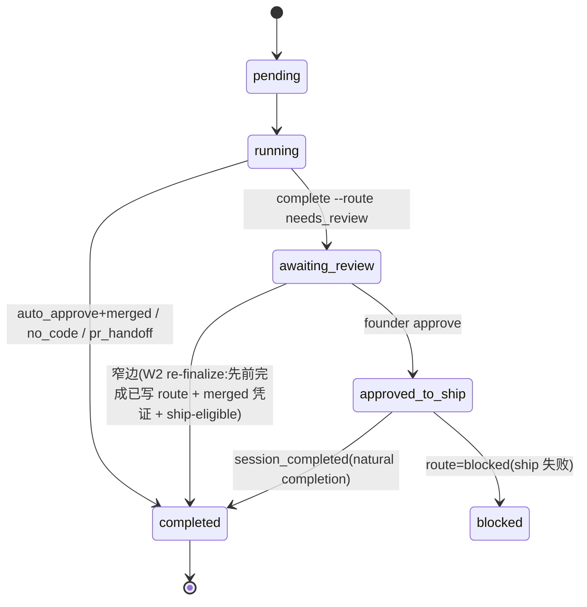

# FLY-108 Session Status 不 Flip — 实施计划
Issue: FLY-108 (https://linear.app/geoforge3d/issue/FLY-108/session-status-不-flip-runner-session-completed-两类-bug-geo-362-empty)
日期: 2026-09-01
基于: research.md(其 W2 表述以本版为准 —— R1 评审证实 W2 契约为 Run-#4-repair only)

**Status**: draft v4(R1 七条 + R2 六条 + R3 四条已全量吸收,待 design_review 门 APPROVED)
**沙箱基线声明**:见 exploration.md 顶部 —— 本 worktree baseline 已含该修复
(PR #155 已 merge);本计划是该修复的可实施设计重构,验收基线引用本仓已有实现与测试。

## 0. 目标与不做什么

**目标**:Runner ship/完工后,`sessions.status` 到达正确终态,解锁 close_runner、
B3 🏁 通知、post-ship cleanup。交付语义诚实声明为 **at-least-once 投递尝试 +
fail-close 标记 + 重启对账**,而非无条件"必达"(见 §5 可靠性边界)。同时
Variant A(空 payload)从"静默卡死"变为"loud 可排查";Variant B(事件从没发)
的**唯一生产者修复是 D1**(Runner 源头发射),W2 只承担一个窄得多的修复面
(见 D2 的精确 scope)。

**显式不做(negative scope)**:
- 不做 PR-merge webhook(Option 3 否决:merge 证据已随 land-status.json 上行)。
- 不无条件放宽 FSM(Option 4 否决:破坏 approve/ship 语义)。
- 不把 stage_changed 升格为通用状态驱动;W2 明确**不覆盖**"从未发过
  session_completed"的 session(负向回归测试钉死,见 Phase 3)。
- 不改 `ExecutionEventEmitter`(edge-worker 事件发射器字节兼容;Blueprint 的
  **prompt 文本**在 scope 内,见 Phase 4 —— 两者是不同的东西)。
- 不新增 DB migration(零 schema 变更)。
- 不为"2xx≠应用成功"补应用级 receipt 机制(诚实收窄目标 + 对账暴露,
  见 §5;补 receipt 另立 issue,不进本设计)。

## 1. 设计决策汇总

| # | 决策 | 一句话 |
| -- | -- | -- |
| D1 | Runner-driven `flywheel-comm complete` | 源头发射,**Variant B(带 PR 流水线)的唯一修复** |
| D2 | Bridge W2 re-finalize(窄面) | **仅修 Run-#4**:先前 session_completed 已写 `decision_route`、landing 后补为 merged 的 session;从未发过事件的 session 明确 out of scope(FLY-324 只覆盖无 PR 的 done-but-running,也兜不住) |
| D3 | FSM 只加窄边 | `awaiting_review→completed` 边入图,merge-proof + ship-eligibility 守卫留 call site |
| D4 | 严格 route guard(HTTP 面) | 空/外来 route → loud warn + skip,绝不静默终态化;`approved_to_ship` 豁免保 natural completion |
| D5 | 双 sink **状态映射不变量一致**(非逐字段镜像) | 两 sink 的 route→status 映射不变量相同;输入信任面**有意不同**(HTTP 严格 guard / Direct 宽松),差异逐条列举并各自测试钉住 |
| D6 | labels-only backfill | Runner 缺 labels → Bridge 从 `getSessionLabels()` 回填;**projectId 不回填,缺失降级空串**(cipher-bridge-e2e 钉住) |

核心流程(Mermaid):

```mermaid
sequenceDiagram
    participant R as Runner (claude CLI in tmux)
    participant C as flywheel-comm complete
    participant B as Bridge /events (event-route.ts)
    participant F as WorkflowFSM
    participant S as StateStore
    R->>C: pipeline 终点: complete --route auto_approve --pr N --merged
    C->>C: collectEvidence(git 统计 + headSha;--merged+--pr 合成 landingStatus)
    C->>B: POST session_completed(4 attempts, 5s timeout, 1s/2s/4s backoff)
    alt 全部失败
        C->>C: fail-close 写 marker ~/.flywheel/state/complete-failed/
        Note over B: Bridge boot reconciler loopback 重放(verify-then-delete)
    end
    B->>B: Decision 4 route guard(空/外来 route → warn+skip, 200+warning)
    B->>B: computeAuthoritativeShipDecision(未获批 merge → park, 不终态化)
    B->>B: status 映射(merged+ship-eligible → completed)
    B->>F: applyTransition(→completed)
    F-->>B: 合法(窄边+call-site 守卫)
    B->>S: upsert status=completed
    B->>B: runPostShipFinalization(🏁/tmux/thread/Done)
```

状态机(变更后):



(上图为 **FLY-108 相关子图**,仅展示本设计涉及的边;`phase_design_complete →
design_done` 等后续 route 的终态边不在图内但由 Phase 2.3 保留。)

## 2. 实施步骤(TDD,每步先测后码)

### Phase 1 — `flywheel-comm complete` 子命令(D1)
文件:`packages/flywheel-comm/src/commands/complete.ts`(新增)、`src/index.ts`(注册)。
1. 测试先行:`src/__tests__/complete.test.ts` —— 断言 `event_type==="session_completed"`、
   route 枚举拒绝、`--merged` 必带 `--pr`、重试与 marker 写入、payload 字段形状
  (见下方字段契约);**parser 级测试**(CLI 解析边界,非直接传数字进 `complete()`)
   覆盖 `--pr` 输入 `abc`/`12junk`/`1.5`/`0`/负数/超 safe-integer → 全部 exit 1。
2. 实现:CLI 校验(fail-closed;`--pr` 在 CLI 解析边界对**原始字符串全串校验**
   `^[1-9]\d*$` 后再安全转换并检查 safe integer —— `parseInt` 会把 `"12junk"`
   截断成 12、`"1.5"` 截断成 1,故不允许先 parse 再检查;不允许 JSON 里出现
   `prNumber:null`) → **env 契约:必需四元组**
  (EXEC_ID/ISSUE_ID/PROJECT_NAME/BRIDGE_URL)+ **INGEST_TOKEN optional**
  (未设则不带 auth 头,由 Bridge 侧策略决定收不收) → `collectEvidence`
  (git diff 统计 + headSha 全 sha;`--merged --pr N` **直接合成**
   `evidence.landingStatus={status:"merged",prNumber:N}` —— 这是 **Runner
   assertion**,不是权威授权;权威闸在 Bridge 侧 ship-eligibility(Phase 2/3)。
   land-status 文件校验仅 `pr_handoff` 路径做 PR 号一致性 fail-close
  (`validateLandStatusPr`),不做通用 land-status 读取;两处行为都写进测试)
   → POST `/events`,4 attempts、5s timeout、1s/2s/4s backoff → 全失败
   fail-close 写 `~/.flywheel/state/complete-failed/<execId>.json`(完整 body)
   + exit 1。
3. **字段契约(与 edge emitter 有意不同,非镜像)**:CLI 只发 Runner 可得字段
  (evidence/decision.route/summary/sessionRole);`ExecutionEventEmitter.emitCompleted`
  (`ExecutionEventEmitter.ts:134-160`)还发 issueTitle/labels/projectId/
   consecutiveFailures/sessionParams。消费端把后者全部当 optional;labels 缺失
   走 D6 回填,projectId 缺失降级空串。CLI 测试显式断言"故意省略"项。
4. `needs_review` 无 `--question-id` 时 loud warn(审批绑定契约,advisory)。
5. CLI 成功判据 = HTTP 2xx(**含** Bridge 的 `200 {ok, warning}` 宽松应答);
   这是已知的"接收≠应用"缝隙,归 §5 风险表,不在 CLI 侧加协议。

### Phase 2 — Bridge session_completed 分支(D4/D5/D6)
文件:`packages/teamlead/src/bridge/event-route.ts`、`packages/teamlead/src/DirectEventSink.ts`。
1. 测试先行:`event-route-session-completed-guard.test.ts`(Decision 4)+
   `event-route-dual-session-completed.integration.test.ts`(**双 session_completed
   经 Bridge HTTP** 的场景矩阵:Scenario A/B/C/D/D2/D3/E)+ DirectEventSink 侧
   在 `DirectEventSink.test.ts` 补 route→status 映射不变量用例
  (undefined/blocked/invalid/merged-gate,in-process 面各自钉)。
2. Decision 4 guard(HTTP 面):`VALID_ROUTES` 集合;`!isPostApproveShip &&
   (!route || 外来)` → warn + `{ok:true, warning}` + 跳过 FSM;`approved_to_ship`
   豁免保 natural completion。
3. status 映射契约 = **在现有完整 mapping 上保持/增量,不是从三条 route 重写**:
   除 needs_review → auto_approve → blocked → undefined(仅 post-approve-ship
   可达)→ completed 的顺序外,**必须保留**后来引入且已 load-bearing 的三条
   route 分支 —— `no_code`(running-only guard → completed,FLY-222)、
   `pr_handoff`(running-only guard → completed,FLY-493)、
   `phase_design_complete`(running-only guard → **design_done**,FLY-793);
   guards 在 `event-route.ts:897-919`、映射在 `:1078-1099`,Direct 面对应
   `DirectEventSink.ts:458-483,578-625`。哨兵分档:no_code / pr_handoff 用
   现有测试锚点;**phase_design_complete 的 HTTP + Direct mapping/guard 用例
   为待新增**(现仓只有 `complete-marker-reconciler.test.ts:143-161` 的 marker
   mapping,两 sink 面无覆盖)。
   `blocked` 恒压过 fallback;**每个 merged→completed 面在 transition 之前
   先过 `computeAuthoritativeShipDecision`**(approval/Codex/QA 未满足 →
   `parkMergeBlock` + loud alert,不 transition 不 finalize)。
4. **双 sink 差异契约(D5)**:Direct sink 对未知/缺失 route **落到 completed**
  (in-process 发射器可信,历史行为保留;含 FLY-208 evidence-gap 标记),HTTP sink
   严格拒绝 —— 这是**有意的输入信任面差异**;两侧一致的是 route→status 映射
   不变量(needs_review→awaiting_review、blocked→blocked、merged 过闸等)。
   两侧 sister 注释互指 + 各自测试钉住自己的输入面行为。
5. Decision 6:CIPHER snapshot 前从 `store.getSessionLabels()` 回填 labels
  (`event-route.ts:1492-1503`);显式 `labels: []` 不回填;projectId 不回填
  (缺失写空串,`event-route.ts:1508-1510,1538` + `cipher-bridge-e2e.test.ts:254-261`
   钉住该降级)。

### Phase 3 — FSM 窄边 + W2 re-finalize(D2/D3)
文件:`packages/core/src/workflow-fsm.ts`、`event-route.ts` stage_changed 分支。
1. 测试先行:FSM 边测试(awaiting_review→completed 合法、running→completed 已有)
   + W2 集成测试:**(a)** 先 seed 一次 `session_completed(needs_review)`(写
   `decision_route` + awaiting_review),再 `stage_changed=completed +
   payload.landing_status.status="merged"` → completed + finalize;**(b)** 无 merge
   凭证 → 不动;**(c)** 负向边界(已存在,保持钉死):running + merged +
   `decision_route` UNSET → **no-op**;**(d)** 四个授权负例(**均为待新增**,
   现有 `event-route.test.ts:1107-1288` 只有正例/无 landing/非 merged/route
   UNSET/幂等):gate-ON 未批准 merge → park 不 transition、无 route + merged
   → no-op、FSM reject → 不 finalize、`transitionOpts` 缺失 → 拒绝 finalize;
   **(e)** 组合钉序测试(待新增):**gate ON + merged + route UNSET →
   HTTP 200 + 无 merge_block + status 不变 + stage metadata 照常更新** ——
   钉死"route 判定先于授权闸、且跳过 W2 不影响同分支其余处理"的顺序;
   **(f)** FLY-324 正例哨兵(已有,保持绿):running + route UNSET + 无 PR/无
   merged landing → done-but-running fallback 仍可达(`event-route.test.ts:858-876`)。
2. `workflow-fsm.ts` `awaiting_review` 列表加 `completed`,注释注明守卫在 call site。
3. `event-route.ts` stage_changed=completed 分支:route 判定**只在 W2 子块内
   前置,不接管整个分支** —— 同分支后方还有 FLY-324 的 no-PR done-but-running
   fallback(`event-route.ts:1928-1973`,合法输入恰是 running + route UNSET +
   无 PR/无 merged landing,回归测试 `event-route.test.ts:858-876`),以及
   分支末尾的公共 `res.json({ok:true})`(`:2374`),都不能被截断。完整顺序:
   仅当 `payload.landing_status.status === "merged"` 进入 **W2 子块** →
   子块内**第一步**检查 `decision_route`(UNSET → **跳过 W2 子块**,继续走
   同级 FLY-324 与公共响应,不 park 不告警)→ route 存在才
   `computeAuthoritativeShipDecision`(不合格 → `parkMergeBlock` + loud alert,
   **跳过 W2 transition**,仍走公共响应)→ 合格才 `applyTransition("completed")`
   + `runPostShipFinalization`(PostShipOpts 与 session_completed 分支同形;
   `transitionOpts` 缺失拒绝 finalize)。
4. 其余 stage 值保持 informational only(NOTE 注释钉住契约)。

### Phase 4 — Runner 协议接线(Variant B 生产者修复的落点,精确到面)
1. **终态发射顺序契约(竞态防线)**:`complete` 必须是 pipeline 里**最后一个
   可能触发 teardown 的同步动作** —— session_completed 的 finalization 会杀
   tmux,它之后的任何步骤都可能不再执行。同理,ship 路径里 merged land-status
   就位后再发 `stage set completed` 会触发 W2 finalization(decision_route 已由
   先前 needs_review completion 写入)而提前杀 tmux。因此 ship 路径的顺序定为:
   **所有 bookkeeping(docs/worktree/Linear)→ land-status 重写为 merged →
   `complete --route auto_approve --pr N --merged`(终态,最后一步)**;
   `stage set completed` 在该路径**移除**(complete 已含终态语义),仅保留在
   无 complete 的 legacy/兜底文案里。
2. `packages/edge-worker/src/Blueprint.ts` **三个 completion 指令面**:
   - ship 路径(约 :1585-1588、:1747-1749):现指令"merged 重写 → `stage set
     completed`" → 改为"merged 重写 → `complete --route auto_approve --pr <N>
     --merged`(最后一步)";
   - 轮询/失败路径(约 :1741-1749):poll MERGED 超窗 → `complete --route blocked`
    (已有,保持);
   - 通用 completion reporting(约 :1839-1843):`stage set completed` 兜底文案
     补充"有 PR 且已 merge 时必须改用 complete"。
3. `.claude/commands/spin.md` 两条路径:auto_approve 块(:412-438,已有
   `complete --route auto_approve --pr --merged` 且已注释"MUST be the LAST sync
   step",保持)+ needs_review 块(:440-455,**缺 `--question-id`** —— 补上,
   与 CLI 的 advisory warn 契约对齐:先取得 gate question id 再发)。
4. **部署依赖(rollout 硬前提)**:Runner 经 `packages/flywheel-comm/dist/index.js`
   调 CLI(`Blueprint.ts:1067-1070`);Blueprint prompt 本体在
   `flywheel-edge-worker` 包的 dist(独立 build,teamlead 运行时直接加载
   `flywheel-edge-worker/dist/Blueprint.js`,`run-infra.ts:50-52`);Phase 3 改的
   `workflow-fsm.ts` 在 `flywheel-core`,同样走独立 dist 且被 teamlead 依赖。
   dist 均**不入库** —— 上线顺序必须是:merge → 生产机 `git pull` → **根目录
   全量 `pnpm build`(推荐,无歧义;若分包,依赖序 flywheel-core →
   flywheel-comm → flywheel-edge-worker → teamlead 四包齐全:漏 core = FSM
   窄边没部署,漏 edge-worker = 新 Runner 拿旧 prompt)** → **部署 preflight:
   `node packages/flywheel-comm/dist/index.js --help | grep -q '^  complete'`
   验证新子命令已注册(注意:`complete --help` 会因 parseArgs 无 help 选项
   而 exit 1,不能用作 preflight)** → Bridge restart(消费端守卫先生效)→
   新 spawn 的 Runner 才拿到新 prompt 与新子命令。只 pull 不 build = 旧 dist 打印
   `Unknown command` 并 exit 1(loud,但**不写 marker** —— marker 只在真正
   进入 complete 且 4 次投递全失败后写)。
5. 断言方式:Blueprint prompt-contract 测试(grep 关键指令文本,与本仓现有
   prompt-contract 测试同风格)钉住三个面;spin.md 无运行时测试,列入 review
   checklist。
6. 澄清:§0 的"不改 edge-worker 发射路径"指 `ExecutionEventEmitter` 类;
   Blueprint prompt 文本是本 Phase 的正当改动面。显示标签沿用现有 stage emoji
   与 🏁 文案,不新增用户可见词汇(一个真相源:status;stage 只是展示)。

### Phase 5 — 验证与验收(可执行命令)
1. 定向跑法(root 无 vitest script,用 package filter,从 monorepo 根执行):
   - `pnpm --filter flywheel-comm test`(complete CLI 套件 + parser 级边界)
   - `pnpm --filter flywheel-teamlead test`(event-route guard / dual integration /
     DirectEventSink / W2 边界 / CIPHER / marker reconciler)
   - `pnpm --filter flywheel-core test`(FSM 边)
   - `pnpm --filter flywheel-edge-worker test`(Blueprint prompt-contract,Phase 4.5)
2. 双 variant 重放验收:
   - A 重放:空 payload session_completed(HTTP)→ 期望 loud warn +
     `200 {ok,warning}` + status 不变(不再静默卡死无痕,也不静默终态化)。
   - B 重放(生产者修复):running + `complete --route auto_approve --pr --merged`
     → completed + finalization(🏁 + close_runner 通过)。
   - W2 重放(Run-#4 修复面):seed needs_review completion → merged
     stage_changed → completed + finalization。
3. 回归哨兵,分两档:
   - **已有(保持绿)**:approved_to_ship + route=undefined → completed
    (natural path);approved_to_ship + route=blocked → blocked(不 finalize);
     running + merged + route UNSET → no-op(`event-route.test.ts:1214-1238`);
     FLY-324 no-PR done-but-running fallback 仍可达(`:858-876`)。
   - **待新增**(Phase 3.1 d/e):gate-ON 未批准 merge → park;FSM reject →
     不 finalize;`transitionOpts` 缺失 → 拒绝 finalize;gate ON + merged +
     route UNSET → HTTP 200 + 无 merge_block + status 不变 + stage metadata
     照常更新(钉 route 前置且不截断同分支);phase_design_complete 两 sink
     mapping/guard 用例。

## 3. 稳定标识(不可变更项)

| 标识 | 值 | 消费者 |
| -- | -- | -- |
| event_type | `"session_completed"` / `"stage_changed"` | 两 sink、events 表、reconciler 重放 |
| route 枚举 | `auto_approve/needs_review/blocked/no_code/pr_handoff/phase_design_complete` | CLI 校验、Decision 4 guard、status 映射 |
| marker 路径 | `~/.flywheel/state/complete-failed/<execId>.json` | complete.ts 写、boot reconciler 读 |
| evidence.headSha | worktree HEAD 全 sha | `sessions.pr_head_sha` → verify-approval |
| `payload.evidence.landingStatus`(camelCase) | session_completed 内的合并凭证 | status 映射、ship-eligibility、🏁 谓词 |
| `payload.landing_status`(snake_case) | stage_changed 内的合并凭证 | W2 re-finalize 守卫 |
| `sessions.decision_route` | 先前 completion 写入的 route | W2 scope 判定(UNSET → no-op) |

(两个 landing 键的大小写差异是**既成事实契约**,分别钉在各自事件面;本设计
不统一它们 —— 统一 = 破坏已入库事件的重放。)

## 4. 迁移与回滚边界(按语境分开,诚实版)

**历史事实(git 可查)**:PR #155(merge commit `699d026d`)实际引入的是
**D1 + D4 + CIPHER + spin.md 文案**(complete.ts/index.ts、event-route.ts 的
guard、三个测试套件);**不含** `workflow-fsm.ts`、`DirectEventSink.ts`、
`Blueprint.ts` —— D3 的 FSM 窄边与 W2 re-finalize 来自其他提交谱系
(FLY-60/FLY-869 等)。因此"PR #155 整 PR revert" 只回它真正引入的文件/行为。

**组合设计的部署与回滚(composite 叙述 —— 本文档把跨多 PR 的机制重构成一份
设计,以下是这份组合的假想 rollout,不是任何单一历史 PR 的 rollback unit)**:
- 零 migration:不加表不加列。老 Runner(不调 complete):带 PR 且曾发过
  needs_review completion 的由 W2 覆盖;纯 running 且从未发事件的**不被自动
  终态化**(fail-closed 设计),由 heartbeat stale patrol 兜底暴露。
- 部署顺序:merge → pull → **全量 build + preflight**(见 Phase 4.4)→ Bridge
  restart(消费端守卫先生效)→ Runner prompt 后开闸;逆序时旧 Bridge 对
  `session_completed` 会照旧走 status mapping/FSM/finalization(**不是**"只
  入库"),行为等于旧语义,无腐蚀但也无新守卫。
- 回滚:以**各机制自己的引入 PR 为 revert 单位**,不宣称按层独立拆 ——
  拆掉 D4 会恢复 invalid-route 静默 completed fallback,单独拆层就是回到
  GEO-362 病灶。

**当前语境(本沙箱 docs-only 设计节点)**:
- 本节点只产出设计文档,不动运行时;回滚 = 回滚文档 commit。
- 当前 HEAD 上 FLY-172/208/222/493/793/869/945 等机制已依赖 complete route、
  FSM 边、marker mapping —— **今天不存在"安全拆掉本设计运行时层"的操作**,
  本文档不提供这种指引。

## 5. 风险与对策

| 风险 | 对策 |
| -- | -- |
| Runner 忘调 complete(B 复发) | 带 PR + 曾 needs_review:W2 兜底;其余:**不自动终态化**(fail-closed),stale patrol 暴露 + 人工恢复。诚实边界:这不是静默自愈 |
| 发射时 Bridge 恰好重启 | fail-close marker + boot reconciler loopback 重放(verify-then-delete,duplicate-nonterminal 隔离 quarantine) |
| **接收≠应用(两请求时序)**:成功路径是"先处理完 session/FSM 再回 2xx"(`event-route.ts:2374`),单请求内不存在"2xx 后崩溃"缝隙。真实缝隙是:请求 1 先 `insertEvent`(`:533-542`)→ 进程在 session mutation/响应前崩溃 → CLI 用**同一 event id** 重试 → 命中 dedup 返回 `200 {duplicate:true}`(`:544-546`)→ CLI 视为成功、**不写 marker** | 已知缝隙,**本设计不补 receipt**。诚实覆盖范围:**marker/reconciler 只保护"CLI 已运行且 4 次投递全失败并成功写 marker"的窗口**;dedup-200/2xx 无 marker,reconciler 见不到(`absent` 即返),暴露面 = Bridge 日志 + stale patrol + 人工。目标语义收窄为 at-least-once attempt + 可对账;补应用级 receipt 另立 issue |
| guard 宽松应答(`200 {ok,warning}`)被 CLI 当成功 | warn 日志点名 "Likely Runner emitter bug";属"接收≠应用"缝隙(2xx 无 marker,reconciler 不覆盖),暴露面同上 |
| `complete` 之前的 W2/finalization 提前杀 tmux(竞态) | Phase 4.1 顺序契约:complete 是最后一个 teardown-triggering 动作;ship 路径移除 `stage set completed` |
| 双 sink 映射漂移 | 映射不变量各自测试钉住 + 两侧 sister 注释互指(**输入信任面差异是契约**,不是漂移) |
| merged 但未获批(自行 merge) | `computeAuthoritativeShipDecision` 前置:park merge_block + loud alert,不 transition 不 finalize |
| 只 pull 不 build 的半上线 | Phase 4.4 部署硬前提:全量 build(含 flywheel-edge-worker,漏它 = Runner 拿旧 prompt)+ preflight 验证 `complete` 子命令存在。旧 dist 撞新 prompt = `Unknown command` exit 1(loud 但**无 marker** —— 不进 complete 就不会写),靠 Runner 报错与 preflight 拦截 |

## 6. 测试证据基线(claim→test 矩阵,本仓已核对)

| Claim | Test 锚点 | 面 |
| -- | -- | -- |
| D1 CLI 契约(route 枚举/重试/marker/字段省略) | `packages/flywheel-comm/src/__tests__/complete.test.ts`(:124-127 断言故意省略项) | CLI |
| `--pr` 原始字符串全串校验(abc/12junk/1.5/0/负/超界) | parser 级测试(**待新增**,现有 :276-285 直接传数字,覆盖不到 CLI 边界) | CLI |
| D4 严格 guard + approved_to_ship 豁免 | `packages/teamlead/src/__tests__/event-route-session-completed-guard.test.ts` | HTTP |
| 双 completion 场景矩阵 A/B/C/D/D2/D3/E | `event-route-dual-session-completed.integration.test.ts`(**HTTP-only**,经 `createBridgeApp`,不实例化 DirectEventSink) | HTTP |
| D5 Direct 面映射不变量(undefined/blocked/invalid/merged-gate) | `DirectEventSink.test.ts`(补充用例;:798-841 现为 phase-role 测试,不复用作 D5 证据) | in-process |
| W2 负向边界(running+merged+route UNSET → no-op) | `event-route.test.ts:1214-1238` | HTTP |
| W2 四授权负例 + gate-ON+route-UNSET 组合钉序 | Phase 3.1 d/e(**待新增**,现有 :1107-1288 无此覆盖) | HTTP |
| FLY-324 no-PR fallback 不被 W2 route 检查截断 | `event-route.test.ts:858-876`(已有,保持绿) | HTTP |
| 后续 route 分支不回归(no_code/pr_handoff) | 现有 FLY-222/493 套件(running-only guards `event-route.ts:897-919` + `DirectEventSink.ts:458-483`) | 双面 |
| `phase_design_complete → design_done` 两 sink mapping/guard | **待新增**(现仓仅 `complete-marker-reconciler.test.ts:143-161` 的 marker mapping) | 双面 |
| D6 labels 回填 + projectId 降级空串 | `cipher-bridge-e2e.test.ts:204-261` | HTTP |
| marker 重放 verify-then-delete / quarantine | `complete-marker-reconciler.test.ts` | boot |
| FSM 边合法性 | `fsm-e2e.test.ts` / `commdb-fsm-reconcile.test.ts` | core |
| Blueprint 三指令面 | prompt-contract 测试(Phase 4.5 新增,`pnpm --filter flywheel-edge-worker test`) | prompt |

验收标准 = §2 Phase 5 的 filter 命令全绿 + 双 variant/W2 重放 + 回归哨兵全过。
本轮评审语境说明:此 worktree 未装测试依赖,上表为静态核对;执行性验收由
implement 节点在装依赖后按 Phase 5 命令跑。
