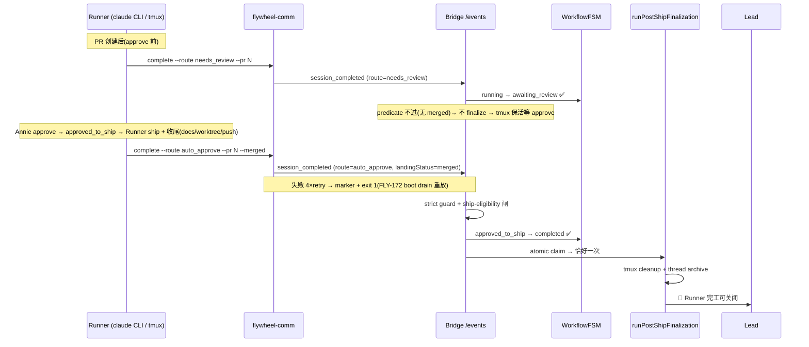

# FLY-108 Session Status 不 Flip — 实施计划

Issue: FLY-108 (https://linear.app/geoforge3d/issue/FLY-108/session-status-不-flip-runner-session-completed-两类-bug-geo-362-empty)
日期: 2026-08-31
基于: research.md

> **交付边界(本设计节点)**:本 plan 产生于 QA slot-3 generalized workflow 的 eng_design 节点重放。
> research.md 已证实修复在当前 HEAD 全量落地(PR #155 + 后续迭代)。因此本 plan 是
> **implementation-ready 设计的完整重建 + as-built 核对表**:若在未修复基线实施,§4 改动清单即施工图;
> 在当前 HEAD 上,代码增量为零,本节点交付物 = 设计文档三件套 + founder HTML。**本节点不写实现代码。**

---

## 1. 问题与目标

Runner ship 完成后 `sessions.status` 不 flip 到 `completed`,阻塞 close_runner / 🏁 通知 / post-ship cleanup(细节见 exploration.md §1)。目标:

1. **Variant B(GEO-363,架构缺口)**:给 Lead-driven Runner 一条可靠的 `session_completed` 发射产线 —— `running → completed` / `running → awaiting_review → … → completed` 全程可达。
2. **Variant A(GEO-362,空 payload + FSM dead-end)**:发射侧发不出空 payload;消费侧对非法 payload fail-loud skip,不再 silent fallback 制造 FSM dead-end。
3. 不破坏 approve/ship 语义,不掩盖上游 bug,不给 Bridge 加 GitHub API 依赖。

**方案选型**(exploration §3):Option 1(Runner 侧 `flywheel-comm complete`)主修 + Bridge strict route guard 辅修;Option 2 仅保留有限安全形态(W2 re-finalize,只重终态化已有完成记录的 session);Option 3/4 排除。

## 2. 设计决策(D1-D6)

| # | 决策 | 依据 |
|---|------|------|
| D1 | `session_completed` 必须在 Runner **全部收尾动作之后**发(spin Step 3 第 7 步) | `runPostShipFinalization` 第一步就 kill tmux;早发 = 杀掉没做完收尾的 Runner,残留 worktree + 未 push docs |
| D2 | `complete` 是 terminal event,**可靠投递、fail-close**:4 attempts × 5s,backoff 1s/2s/4s;全败 → marker `~/.flywheel/state/complete-failed/<execId>.json` + exit 1 | `stage_changed` 丢了无害(informational),终态事件丢了 = bug 原样复现;marker 给 reconcile 留 durable 记录 |
| D3 | Payload 与 `TeamLeadClient.emitCompleted()`(`ExecutionEventEmitter.ts:61-85`)**逐字段对齐**;拿不到的字段显式 omit(靠 Bridge COALESCE / degraded 兜底),不猜值 | 两条产线喂同一个消费契约,避免第三种半兼容 payload |
| D4 | 本 issue 只覆盖 `session_role=main` | `close_runner` 按 issue lookup 无 role filter,QA session 也发会 ambiguous;QA 完成信号另行承接 |
| D5 | Bridge guard **严格等于 route 枚举**,拒绝 evidence-only 通道,删除 `else status="completed"` fallback;唯一豁免 = pre-state `approved_to_ship` 的自然完成(与 DirectEventSink parity) | Variant A 的教训:silent fallback 把 emitter bug 变形成 FSM dead-end;fail-loud 让 bug 可见 |
| D6 | CIPHER snapshot 分支 Bridge 侧 backfill `labels`(`store.getSessionLabels`)/ `projectId`(degraded `""`) | Runner 拿这两个字段要加 Linear 依赖,不值得;Bridge 本来就有 |

**稳定标识与展示**:事件身份 = `event_id`(uuid,幂等锚);session 身份 = `execution_id`;finalization 去重锚 = `event_id: "post-ship-finalization-<execId>"` atomic claim(UNIQUE 落库,三个调用面共用)。展示层(🏁 通知、issue thread 徽章)一律从 `sessions.status` 派生,不另建镜像词表——status 是唯一事实源。

## 3. 时序(目标态)

## 4. 改动清单(implementation-ready;右列 = 本 HEAD as-built 核对)

| # | 改动 | 落点 | as-built |
|---|------|------|----------|
| 4.1 | 新增 `complete` 子命令:route 枚举校验(fail-close)、git 现场取 evidence、headSha、issueIdentifier branch 解析、D2 可靠投递 + marker | `packages/flywheel-comm/src/commands/complete.ts`(新文件)+ `index.ts` usage/switch 接线 | ✅ L30-262,枚举已扩至 6 route |
| 4.2 | spin.md Step 3 追加第 7 步强制 `complete`;needs_review 位点(PR 后 approve 前);「Never exit /spin without a successful complete」硬规则;emit 失败 fail-close 不清 worktree | `.claude/commands/spin.md` | ✅ L412-474,且 self-ship handoff 失败不发成功 completion(L387-402) |
| 4.3 | Bridge strict route guard(D5):非法/空 route → warn + `{ok, warning}` skip;`approved_to_ship` 豁免;FSM 拒绝日志升级 error 并带 pre-state/target/route | `packages/teamlead/src/bridge/event-route.ts` session_completed 分支 | ✅ L865-895(guard)、L1309(error 升级) |
| 4.4 | CIPHER backfill(D6) | `event-route.ts` CIPHER snapshot 分支 | ✅(Decision 6 锚点 L1492) |
| 4.5 | **负面守卫**:`--merged` 必须配 `--pr`;缺 env 明示 exit 1;marker 写失败也 loud;guard 拒绝 evidence-only payload | complete.ts + event-route.ts | ✅ 全部在位 |
| 4.6 | FSM:**不改转移表**(`running→completed` / `running→awaiting_review` / `approved_to_ship→completed` 本就合法) | `packages/core/src/workflow-fsm.ts` | ✅;后续 FLY-60 W2 在带调用点守卫的前提下补了 `awaiting_review→completed`(服务 re-finalize,非本 issue 诉求) |

## 5. 测试计划(现存证据)

| 层 | 断言 | as-built 证据 |
|----|------|--------------|
| 发射侧单测 | payload shape 逐字段 / route 校验 / retry / marker fail-close | `flywheel-comm/src/__tests__/complete.test.ts`(L112 断言 `event_type="session_completed"`) |
| 消费侧单测 | guard:空 route skip、foreign route skip、approved_to_ship 豁免 | `event-route-session-completed-guard.test.ts` |
| 双 sink parity 集成 | HTTP /events 与 DirectEventSink 对 undefined/blocked route 行为一致(Scenario D/E) | `event-route-dual-session-completed.integration.test.ts` |
| sink 锚点 | blocked 不 finalize;undefined→completed 仅限 post-approve-ship | `DirectEventSink.test.ts:798-841` |
| 双发去重 | needs_review + auto_approve 双 completion → finalization 恰好一次(atomic claim) | `post-ship-finalization.ts:478` + 竞争调用面注释 L131 |

## 6. Scope 边界

**Do**:§4 全部;marker 格式定义(重发机制留接口)。
**Don't**:GEO-362 pre-state 之谜(approve 未转 approved_to_ship = FLY-58 territory);QA session role 完成信号(三段式 QA 族);marker 自动重发(→ 后由 FLY-172 boot drain 闭合,见 research §6);PR-merge webhook(Option 3,排除);FSM 无条件放宽(Option 4,排除)。

## 7. Rollout / 风险 / 回滚

- **Rollout**:单 PR;flywheel-comm 是 Runner spawn 时现读的 CLI,merge + 生产 `git pull` 即生效,无需重启 Bridge(event-route 改动需一次 Bridge 重启)。
- **向后兼容**:旧 edge-worker Blueprint 路径的 emitCompleted 不动;guard 对合法 route 行为不变;唯一行为变化 = 非法/空 route 从「silent fallback completed(然后 FSM dead-end)」变为「loud skip」——这是修 bug 本身。
- **回滚边界**:revert PR 即回旧态;marker 目录是加性产物,回滚无需清理。事件为幂等 upsert + atomic claim,重放安全。
- **风险**:R1 Runner 忘调 complete → spin 硬规则 + fail-close;彻底忘 = 回到现状(卡 running),由 stale patrol 兜底,不劣化。R2 提前发(收尾没做完)→ D1 时序合同 + spin 注释钉死。R3 Bridge 不可达 → D2 marker + FLY-172 drain 重放。

## 8. Definition of Done

1. Variant B 场景:docs-only pipeline 结束后 status flip 到 `completed`,close_runner 200,🏁 发出,tmux 被 cleanup(集成测试 + 真机验证)。
2. Variant A 场景:空/foreign route payload → warn 日志 + skip,无 FSM dead-end(guard 单测)。
3. needs_review → approve → ship 全链:双 completion、finalization 恰好一次(dual-session-completed 集成测试)。
4. 现役发射器无法构造空 payload(complete.ts 校验单测)。
5. **as-built 核对(本节点)**:§4 六项全部 ✅;测试五层证据在位;残余缺口(FLY-58 / QA role)显式移交。

## 9. 后续跟踪

- FLY-58:approve 动作同步 teamlead.db 的 pre-state 问题(Variant A 的另一半土壤)
- QA session role 完成信号 + close_runner role 消歧(FLY-859 三段式族已部分承接)
- marker 重发:已由 FLY-172 boot drain 闭合(quarantine + loopback replay),无遗留动作
