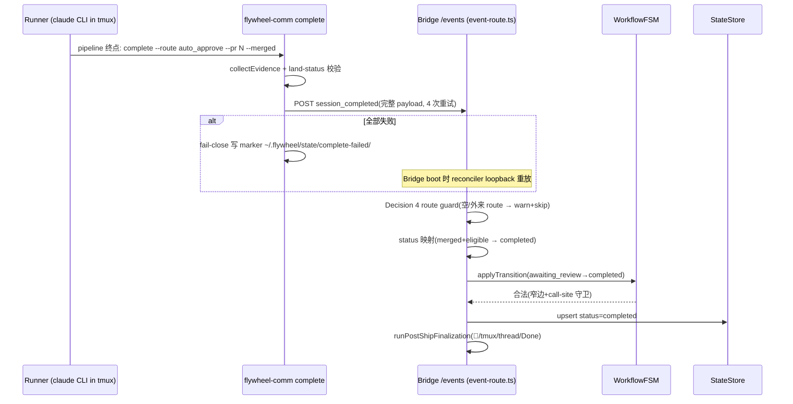
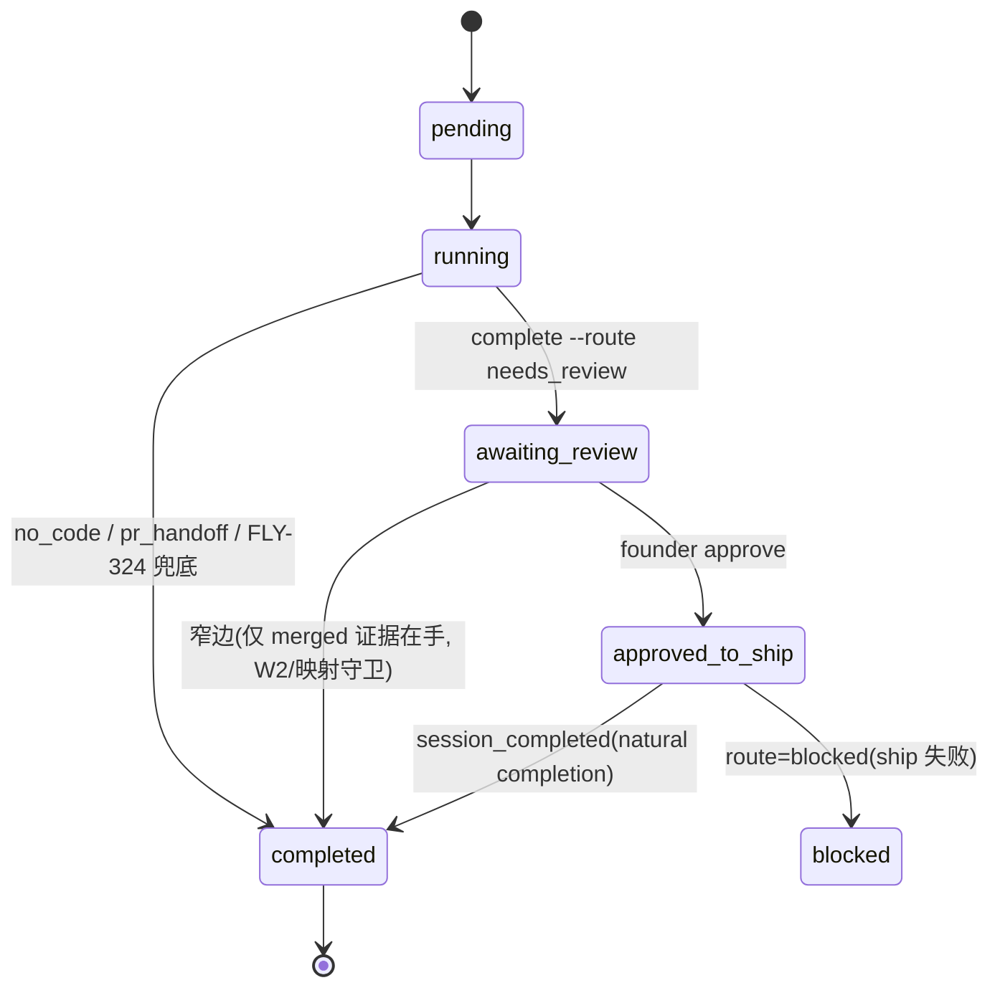

# FLY-108 Session Status 不 Flip — 实施计划
Issue: FLY-108 (https://linear.app/geoforge3d/issue/FLY-108/session-status-不-flip-runner-session-completed-两类-bug-geo-362-empty)
日期: 2026-09-01
基于: research.md

**Status**: draft(待 design_review 门 APPROVED)
**沙箱基线声明**:见 exploration.md 顶部 —— 本 worktree baseline 已含该修复
(PR #155 已 merge);本计划是该修复的可实施设计重构,验收基线引用本仓已有实现与测试。

## 0. 目标与不做什么

**目标**:Runner ship/完工后,`sessions.status` 必达正确终态,解锁 close_runner、
B3 🏁 通知、post-ship cleanup;同时 Variant A(空 payload)从"静默卡死"变为
"loud 可排查",Variant B(事件从没发)从"架构缺口"变为"源头发射 + 证据兜底"。

**显式不做(negative scope)**:
- 不做 PR-merge webhook(Option 3 否决:merge 证据已随 land-status.json 上行)。
- 不无条件放宽 FSM(Option 4 否决:破坏 approve/ship 语义)。
- 不把 stage_changed 升格为通用状态驱动(仅两条窄守卫 fallback)。
- 不改 edge-worker Blueprint 发射路径(字节兼容)。
- 不新增 DB migration(零 schema 变更)。

## 1. 设计决策汇总

| # | 决策 | 一句话 |
| -- | -- | -- |
| D1 | Runner-driven `flywheel-comm complete` | 源头发射,payload 完整,修 A+B |
| D2 | Bridge W2 merged fallback | stage_changed=completed + merged 证据 → 受守卫终态化 |
| D3 | FSM 只加窄边 | `awaiting_review→completed` 边入图,merge-proof 守卫留 call site |
| D4 | 严格 route guard | 空/外来 route → loud warn + skip,绝不静默终态化 |
| D5 | 双 sink 逐字段对齐 | HTTP `/events` 与 DirectEventSink 映射镜像 + 集成测试钉住 |
| D6 | CIPHER backfill | Runner 缺 labels/projectId → Bridge 从 StateStore 回填 |

核心流程(Mermaid):

状态机(变更后):

## 2. 实施步骤(TDD,每步先测后码)

### Phase 1 — `flywheel-comm complete` 子命令(D1)
文件:`packages/flywheel-comm/src/commands/complete.ts`(新增)、`src/index.ts`(注册)。
1. 测试先行:`src/__tests__/complete.test.ts` —— 断言 `event_type==="session_completed"`、
   route 枚举拒绝、`--merged` 必带 `--pr`、payload 字段形状与
   `ExecutionEventEmitter.emitCompleted`(edge-worker :61-85)对齐、重试与 marker 写入。
2. 实现:CLI 校验(fail-closed) → env 五元组(EXEC_ID/ISSUE_ID/PROJECT_NAME/
   BRIDGE_URL/INGEST_TOKEN) → `collectEvidence`(git diff 统计 + headSha + land-status)
   → POST `/events`,4 attempts、5s timeout、1s/2s/4s backoff → 失败 fail-close 写
   `~/.flywheel/state/complete-failed/<execId>.json`(完整 body)。
3. `needs_review` 无 `--question-id` 时 loud warn(审批绑定契约,advisory)。

### Phase 2 — Bridge session_completed 分支(D4/D5/D6)
文件:`packages/teamlead/src/bridge/event-route.ts`、`packages/teamlead/src/DirectEventSink.ts`。
1. 测试先行:`event-route-session-completed-guard.test.ts`(Decision 4)+
   `event-route-dual-session-completed.integration.test.ts` Scenario 矩阵
   (undefined/blocked × HTTP/in-process)。
2. Decision 4 guard:`VALID_ROUTES` 集合;`!isPostApproveShip && (!route || 外来)` →
   warn + `{ok:true, warning}` + 跳过 FSM;`approved_to_ship` 豁免保 natural completion。
3. status 映射按顺序:needs_review → auto_approve → blocked → undefined(仅
   post-approve-ship 可达)→ completed;`blocked` 恒压过 fallback(失败 ship 不 finalize)。
4. DirectEventSink 同步镜像(sister mapping),两侧注释互指。
5. Decision 6:CIPHER snapshot 前从 `store.getSessionLabels()` 回填 labels;
   显式 `labels: []` 不回填。

### Phase 3 — FSM 窄边 + stage_changed merged fallback(D2/D3)
文件:`packages/core/src/workflow-fsm.ts`、`event-route.ts` stage_changed 分支。
1. 测试先行:FSM 边测试(awaiting_review→completed 合法、running→completed 已有)
   + W2 分支集成测试(merged → finalize;无 merge 证据 → 不动;FSM 拒绝 → 不 finalize)。
2. `workflow-fsm.ts` `awaiting_review` 列表加 `completed`,注释注明守卫在 call site。
3. `event-route.ts` stage_changed=completed 分支:`landingStatus.status==="merged"`
   才走 `applyTransition("completed")` + `runPostShipFinalization`(PostShipOpts 与
   session_completed 分支完全同形);`transitionOpts` 缺失拒绝 finalize。
4. 其余 stage 值保持 informational only(NOTE 注释钉住契约)。

### Phase 4 — Runner 协议接线
文件:Runner prompt 注入(Blueprint baseline rules)、`/spin` 命令文档。
1. pipeline 终点硬性要求:ship 后 `complete --route auto_approve --pr N --merged`;
   评审路径 `complete --route needs_review --question-id <gate id>`;失败
   `complete --route blocked`。
2. 显示标签:Discord/日志沿用现有 stage emoji 与 🏁 文案,不新增用户可见词汇
  (一个真相源:status;stage 只是展示)。

### Phase 5 — 验证与验收
1. `pnpm vitest run` 定向:flywheel-comm complete 套件、teamlead event-route/
   DirectEventSink/fsm 套件全绿。
2. 双 variant 重放验收:
   - A 重放:空 payload session_completed → 期望 warn 日志 + status 保持不变
     (不再静默 completed,也不静默卡死无痕)。
   - B 重放:仅 stage_changed=completed + merged landing → 期望 completed +
     finalization 触发(🏁 + close_runner 通过)。
3. 回归哨兵:approved_to_ship + route=undefined → completed(natural path 不破);
   approved_to_ship + route=blocked → blocked(不 finalize)。

## 3. 稳定标识(不可变更项)

| 标识 | 值 | 消费者 |
| -- | -- | -- |
| event_type | `"session_completed"` / `"stage_changed"` | 两 sink、events 表、reconciler 重放 |
| route 枚举 | `auto_approve/needs_review/blocked/...` | CLI 校验、Decision 4 guard、status 映射 |
| marker 路径 | `~/.flywheel/state/complete-failed/<execId>.json` | complete.ts 写、reconciler 读 |
| evidence.headSha | worktree HEAD | `sessions.pr_head_sha` → verify-approval |
| landingStatus.status | `"merged"` / `"ready_to_merge"` | W2 守卫、ship-eligibility、🏁 谓词 |

## 4. 迁移与回滚边界

- **零 migration**:不加表不加列;老 Runner(不调 complete)由 W2/FLY-324 fallback 覆盖。
- **回滚 = 按层独立 revert**:D4/D5(Bridge)revert → 回旧 fallback 行为,状态不腐蚀;
  D1(CLI)对旧 Bridge 只是普通入库事件(insertEvent 幂等),前向兼容;
  D2/D3 revert → stage_changed 退回纯 informational;marker 无消费者时是惰性文件。
- **部署顺序**:Bridge 先(消费端先具备守卫),Runner prompt 后(生产端后开闸);
  逆序也安全(旧 Bridge 对 complete 事件按旧逻辑处理,无害)。

## 5. 风险与对策

| 风险 | 对策 |
| -- | -- |
| Runner 忘调 complete(B 复发) | W2/FLY-324 fallback + heartbeat stale patrol 兜底 |
| 发射时 Bridge 恰好重启 | fail-close marker + boot reconciler loopback 重放(verify-then-delete,歧义 quarantine) |
| 双 sink 映射漂移 | dual-session-completed 集成测试矩阵 + 两侧 sister 注释互指 |
| merged 但未获批(自行 merge) | ship-eligibility 闸:park merge_block + loud alert,不自动 completed |
| 空 payload 从"卡死"变"跳过"后被忽略 | warn 文案点名 "Likely Runner emitter bug";FSM 拒绝日志升级 error 带三元组 |

## 6. 测试证据基线(本仓)

`packages/flywheel-comm/src/__tests__/complete.test.ts` ·
`packages/teamlead/src/__tests__/event-route-session-completed-guard.test.ts` ·
`packages/teamlead/src/__tests__/event-route-dual-session-completed.integration.test.ts` ·
`DirectEventSink.test.ts:798-841` · `fsm-e2e.test.ts` / `commdb-fsm-reconcile.test.ts`。
验收标准 = 上述套件全绿 + §2 Phase 5 的双 variant 重放与回归哨兵断言全过。
