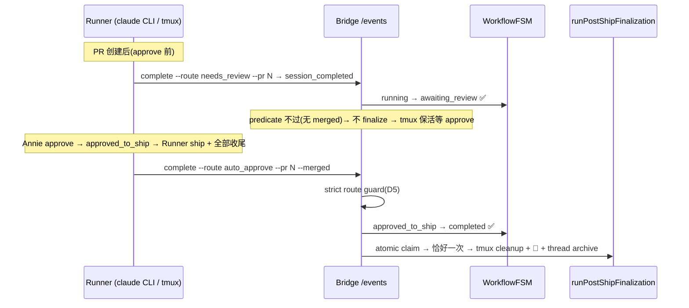

# FLY-108 Session Status 不 Flip — 实施计划

Issue: FLY-108 (https://linear.app/geoforge3d/issue/FLY-108/session-status-不-flip-runner-session-completed-两类-bug-geo-362-empty)
日期: 2026-08-31
基于: research.md

> **交付边界(本设计节点)**:本 plan 产生于 QA slot-3 generalized workflow 的 eng_design 节点重放。
> research.md 已证实修复在**代码快照 `1855f7a1`**(本节点 docs-only 提交会推进分支 HEAD,不触代码;
> 下文「本 HEAD」均指该快照)全量落地(PR #155 + 后续迭代)。因此本 plan 是
> **implementation-ready 设计的完整重建 + as-built 核对表**:若在未修复基线实施,§4 + 规范性附录即施工图;
> 在本 HEAD 上,代码增量为零,本节点交付物 = 设计文档三件套 + founder HTML。**本节点不写实现代码。**

---

## 1. 问题与目标

Runner ship 完成后 `sessions.status` 不 flip 到 `completed`,阻塞 close_runner / 🏁 通知 / post-ship cleanup(细节见 exploration.md §1)。目标:

1. **Variant B(GEO-363,架构缺口)**:给 Lead-driven Runner 一条可靠的 `session_completed` 发射产线 —— `running → completed` / `running → awaiting_review → … → completed` 全程可达。
2. **Variant A(GEO-362,空 payload + FSM dead-end)**:发射侧发不出空 payload;消费侧对非法 payload fail-loud skip,不再 silent fallback 制造 FSM dead-end。
3. 不破坏 approve/ship 语义,不掩盖上游 bug,不给 Bridge 加 GitHub API 依赖。

**方案选型**(exploration §3):Option 1(Runner 侧 `flywheel-comm complete`)主修 + Bridge strict route guard 辅修;Option 2 仅保留有限安全形态(W2 re-finalize + 后续 FLY-324 no-PR live fallback,均只在窄守卫内终态化,不 synthesize payload);Option 3/4 排除。

## 2. 设计决策(D1-D6)

| # | 决策 | 依据 |
|---|------|------|
| D1 | `session_completed` 必须在 Runner **全部收尾动作之后**发(spin Step 3 第 7 步) | finalization 的**第一个破坏性阶段是 tmux cleanup**(`post-ship-finalization.ts:512+`;其前置为 L445-472 disposition 预仲裁 → L474-486 atomic claim → L492-510 shadow hook,均无破坏性)。早发 = Runner 收尾没做完就被 teardown,残留 worktree + 未 push docs |
| D2 | `complete` 是 terminal event,**可靠投递、fail-close**:4 attempts × 5s,backoff 1s/2s/4s;**四次 attempt 复用同一个 event body(同一 event_id)**;全败 → marker `~/.flywheel/state/complete-failed/<execId>.json`(完整 body)+ exit 1 | 在修复前基线上 `stage_changed` 丢了无害(informational;as-built 注:现 HEAD 的 `stage=completed` 投递在 W2/FLY-324 下承载生命周期语义,此对比限定非终态 stage 值),终态事件丢了 = bug 原样复现;稳定 event_id + 完整 body marker = FLY-172 boot drain 可经 loopback `/events` 原样重放(幂等) |
| D3 | Payload 与 edge-worker 发射器**逐字段对齐**:接口 `ExecutionEventEmitter.ts:61-85`,payload 构造在同文件 `emitCompleted()`(~L133-160);拿不到的字段显式 omit(靠 Bridge COALESCE / degraded 兜底),不猜值。**已知分歧**:Blueprint 产线含 `sessionParams`(L157),`complete` 产线不携带,Bridge 可选消费——记录在 §4 字段矩阵 | 两条产线喂同一个消费契约(字段 shape 一致),避免第三种半兼容 payload;**但两个消费 sink 的 route 守卫并不等价**——见 D5 的 sink 范围声明 |
| D4 | 本 issue 的 complete 接线只覆盖 `session_role=main` | `close_runner` 按 issue lookup 无 role filter,QA session 也发会 ambiguous;(as-built 注:后续 FLY-324 已给只报 stage 的 no-PR/QA Runner 补了终态化通道,见 research §5.3) |
| D5 | **HTTP `/events` sink** 的 guard **严格等于 route 枚举**,拒绝 evidence-only 通道,删除 `else status="completed"` fallback;唯一豁免 = pre-state `approved_to_ship` 的自然完成。**sink 范围声明(复审 R1 D1-03)**:in-process `DirectEventSink.ts:626-633` **仍保留**对缺失/未识别 route 的 `else status="completed"` 宽松 fallback,且经 `upsertSession` 直接落库、不过 `applyTransition`;该路径可达(`Blueprint.ts:2064-2098` 无 DecisionLayer 时返回不带 decision 的 success)。缓解:FLY-228 terminal-immunity 挡 no-out-edge 终态、no_code/pr_handoff running-only 守卫、finalization 仍由 merged landing + ship-eligibility 把守——分歧影响 status / close eligibility,不触发 teardown。**设计意图 = 两 sink 守卫等价**;as-built 未达成 → 缺口 G3,§9 follow-up | Variant A 的教训:silent fallback 把 emitter bug 变形成 FSM dead-end;fail-loud 让 bug 可见 |
| D6 | CIPHER snapshot 分支 Bridge 侧 backfill `labels`(`store.getSessionLabels`)/ `projectId`(degraded `""`) | Runner 拿这两个字段要加 Linear 依赖,不值得;Bridge 本来就有 |

**稳定标识与展示**:事件身份 = `event_id`(uuid,四次 retry 复用,幂等锚);session 身份 = `execution_id`;finalization 去重锚 = `event_id: "post-ship-finalization-<execId>"` atomic claim(UNIQUE 落库,DirectEventSink / event-route / merge-ship-gate 三个调用面共用)。展示层(🏁 通知、issue thread 徽章)一律从 `sessions.status` 派生,不另建镜像词表——status 是唯一事实源。

## 3. 时序:两份显式标注的合同

### 3.1 原始 FLY-108 基线合同(v1.23.0 归档 plan 所设计的形态)

### 3.2 当前 as-built 合同(基线之上叠加 FLY-191/869/945 授权绑定链)

生产 Blueprint 指令原文 `Blueprint.ts:1716-1735`;差异点加粗:

1. PR 创建后:**先 `gate approve_to_ship --no-block` 拿 questionId**;
2. `complete --route needs_review --pr N` **`--question-id <questionId>`** —— 绑定 review 请求到唯一 gate question(无 question-id 时 `event-route.ts:1135-1154` 清空 review binding;从 approved_to_ship 重开 review 更是必须新 questionId,否则落 FLY-208 5a evidence-gap 终态);
3. 被唤醒后 ship 前 **必须 `verify-approval --exec-id <execId> --pr-head $(git rev-parse HEAD)`**
   (两参均必填,`index.ts:842-849` fail-close),只认 `"approved": true`(唤醒消息不携带授权;
   approval 绑定 `evidence.headSha` 持久化的 `pr_head_sha`,head 移动即失效);
4. ship + 收尾后 `complete --route auto_approve --pr N --merged`;
5. Bridge 侧:strict guard → **`computeAuthoritativeShipDecision` ship-eligibility 闸(FLY-869 B:approval + Codex + QA)**——merged 但不合格 → **merge_block park 在 awaiting_review,不自动 revert、不 finalize**;合格 → FSM 终态化 → atomic claim → finalization。

> **规范性优先级(复审 R1 D1-01)**:§3.2 是 needs_review 位点的**唯一规范性合同**,**覆盖(supersede)**§4 并入的归档附录里旧的 needs_review 片段(无 gate、无 `--question-id`)以及 `.claude/commands/spin.md:440-456` 的现存旧形态;按本 plan 施工的实施者以 §3.2 为准(as-built 差异见 §4.2 缺口 G1)。

> 证据边界(诚实声明):§5 引用的 HTTP sink 集成测试在关闸(merge-approval / QA-done gates disabled)配置下验 status mapping 与调用次数。FLY-115 v1.24.5 的 QA 回执(`doc/qa/reports/v1.24.5-FLY-108-round6-qa-report.md`)证明的是**当时的历史链**(blocking gate + respond + merge + 完成/终态化)——它早于 FLY-191 question/head binding、FLY-869 ship-eligibility、FLY-945 rebind,**不能**充当当前完整链的回执。**当前全闸完整链(question binding → verify-approval → ship 闸 → finalization)的端到端回执至今缺失**——这是显式记录的 as-built 证据缺口,补齐属 QA 域 follow-up,不在本设计节点内伪造。

## 4. 改动清单(implementation-ready;右列 = 本 HEAD as-built 核对)

> **规范性附录**:`doc/engineer/plan/archive/v1.23.0-FLY-108-session-status-flip.md` §4(CLI signature、payload JSON 全文、issueIdentifier 取值策略、投递参数、spin.md 改文原文、event-route guard 代码)**整体并入本 plan 作为规范性细节**,本节只列骨架 + 与现 HEAD 的 delta。未修复基线的实施者以「本节 + 该附录」为施工图,无需自行重发现契约细节。

| # | 改动 | 落点 | as-built(本 HEAD) |
|---|------|------|----------|
| 4.1 | 新增 `complete` 子命令:`--route`(必填,基线枚举 `{auto_approve, needs_review, blocked}`)`[--pr N] [--merged] [--session-role] [--summary] [--exit-reason] [--base-ref]`;fail-close 校验;git 现场取 evidence;D2 投递 + marker;`index.ts` usage/switch 接线 | `packages/flywheel-comm/src/commands/complete.ts`(新文件)+ `index.ts` | ✅ L30-262(骨架在位);**delta**:枚举已叠加至 6 route(+`no_code`/`pr_handoff`/`phase_design_complete`,各带矛盾旗标拒绝 + running-only 消费约束);+`--question-id`(FLY-191);+`evidence.headSha`(FLY-191);+land-status 一致性 fail-close(FLY-493)。**❌ as-built 缺口 G2(复审 R1 D1-02)**:主路径 `--pr` **无正整数 fail-close**——`index.ts:895` 用 `Number.parseInt` 解析,`--pr abc`→`NaN`、`--pr 12x`→`12`(partial parse)都能过 `complete.ts:107-110`(只查 null/undefined);`auto_approve --merged --pr abc` 会发出 `landingStatus.status="merged"` + `prNumber=NaN`(JSON 序列化为 `null`)的终态事件。严格正整数校验目前只在 `pr_handoff` 分支(L125-145)。→ §9 follow-up |
| 4.2 | spin.md Step 3 追加第 7 步强制 `complete`;needs_review 位点(PR 后 approve 前);「Never exit /spin without a successful complete」硬规则;emit 失败 fail-close 不清 worktree | `.claude/commands/spin.md` | ⚠️ 部分在位:auto_approve 位点 ✅(L412-437,含 D1 时序注释 + fail-close);**delta**:self-ship handoff 失败不发成功 completion(L387-402)。**❌ as-built 缺口 G1(复审 R1 D1-01)**:needs_review 位点(L440-456)仍是 **pre-FLY-191 形态**——没有先 `gate approve_to_ship --no-block`,`complete --route needs_review` 不带 `--question-id`;按此手工 `/spin` 会得到**未绑定 question 的 review session**(`event-route.ts:1135-1154` 清空 binding,`complete.ts:180-198` 只 warn 不 fail-close),后续 `verify-approval` 无法证明 question/head。生产 Blueprint 指令(§3.2)已是新形态;spin.md 接线 → §9 follow-up |
| 4.3 | Bridge strict route guard(D5):非法/空 route → warn + `{ok, warning}` skip;`approved_to_ship` 豁免;FSM 拒绝日志升级 error 并带 pre-state/target/route;删除 `else status="completed"` fallback | `packages/teamlead/src/bridge/event-route.ts` session_completed 分支 | ✅ L865-895(guard)、L1309(error 升级);**delta**:running-only 约束(L903-919)、FLY-208 5a evidence-gap、FLY-869 B ship 闸、FLY-945 Fix C 均为后续叠加。**sink 范围**:此 guard 只在 HTTP `/events` sink;in-process `DirectEventSink.ts:626-633` 仍是宽松 fallback(D5,缺口 G3)|
| 4.4 | CIPHER backfill(D6):`payload.labels` 缺失 → `store.getSessionLabels(execId)` 回填;`projectId` 缺失 → degraded `""` | `event-route.ts` CIPHER snapshot 分支 | ✅(Decision 6 锚点 L1492) |
| 4.5 | **负面守卫**:(a)`--merged` 必须配 `--pr`;(b)缺 env 明示 exit 1;(c)marker 写失败也 loud;(d)HTTP guard 拒绝 evidence-only payload;(e)**规范性合同(复审 R1 D1-02 补强)**:任何出现的 `--pr` 都必须**完整**解析为正整数——拒绝 `NaN`、`0`、负数与 `12x` 这类 partial parse,主路径与 pr_handoff 同款;(f)in-process sink 对空/foreign route 的守卫应与 (d) 等价 | complete.ts + event-route.ts + DirectEventSink.ts | (a)-(d) ✅ 在位;(e) ❌ 主路径缺失(仅 pr_handoff 有,缺口 G2);(f) ❌ 缺失(缺口 G3,见 D5)|
| 4.6 | FSM:**不改转移表**(`running→completed` / `running→awaiting_review` / `approved_to_ship→completed` 本就合法) | `packages/core/src/workflow-fsm.ts` | ✅;**delta**:后续 FLY-60 W2 / FLY-208 5a / FLY-945 / FLY-793 各自补边(守卫都在调用点) |

### 4.7 Payload 字段矩阵(D3 规范化)

| 字段 | 来源 | 必填 | omit 语义(Bridge 侧) |
|------|------|------|----------------------|
| `decision.route` | `--route` | ✅ | 无此字段 = guard skip(仅 approved_to_ship 豁免) |
| `evidence.landingStatus` | `--merged`+`--pr` / pr_handoff `ready_to_merge` | 按 route | 缺失 = 非 merged 路径;finalization predicate 直接 false。**注意**:predicate 只看 `landingStatus.status`,不看 `prNumber`——`prNumber=NaN→null` 不会被 predicate 挡住(缺口 G2 的后果)|
| `evidence.commitCount/filesChangedCount/linesAdded/linesRemoved/diffSummary/changedFilePaths/commitMessages` | git(merge-base..HEAD) | ✅(git 失败则空值/空数组) | 展示 degraded,不影响状态机 |
| `evidence.headSha` | `git rev-parse HEAD`(40 位校验) | 尽力 | 缺失 = verify-approval fail-close(不猜) |
| `issueIdentifier` | branch 名 regex `[A-Z]+-\d+` | 否 | omit → COALESCE 保留 session_started 值 |
| `summary` | `--summary` / HEAD commit subject | 否 | omit → 展示用 fallback |
| `exitReason` | `--exit-reason`,默认 `"completed"` | ✅ | — |
| `sessionRole` | `--session-role`,默认 `"main"` | ✅ | — |
| `reviewQuestionId` | `--question-id` | needs_review 实质必须 | omit → review binding 被清空 / 5a evidence-gap(§3.2) |
| `labels` / `projectId` / `consecutiveFailures` | **不发** | — | Bridge backfill(D6)/ degraded `""` / `?? 0` |
| `sessionParams` | **不发**(Blueprint 产线专属:FLY-123 adapter resume 数据如 Codex threadId,`ExecutionEventEmitter.ts:156-157`;FLY-208 evidence-gap 标记是 Bridge 消费侧写入同名 JSON 列,不走此字段) | — | 可选消费,缺失容忍——已知产线分歧,显式记录 |

## 5. 测试计划(claim → test 矩阵;锚点经二次核对)

| 断言(claim) | 证据(test) |
|--------------|------------|
| 发射侧:payload shape / route 校验 / retry / marker fail-close | `packages/flywheel-comm/src/__tests__/complete.test.ts`(L112 断言 `event_type="session_completed"`) |
| HTTP sink guard:空 route skip、foreign route skip | `event-route-session-completed-guard.test.ts` |
| HTTP sink:`approved_to_ship` pre-state + route=undefined 自然完成豁免 → completed、finalization 恰一次 | `event-route-dual-session-completed.integration.test.ts` Scenario D / D2(复审 R1 D1-04 纠正锚点:guard 单测**不含**此场景)|
| 主路径 `--pr` 正整数 fail-close(`abc` / `12x` / `0` / `-1` 拒绝) | **缺失**(缺口 G2):`complete.test.ts` 只覆盖 pr_handoff 分支的正整数校验;主路径无对应用例 → §9 follow-up |
| HTTP sink status mapping 场景矩阵(undefined/blocked/needs_review/auto_approve×merged) | `event-route-dual-session-completed.integration.test.ts`(**HTTP `/events` sink only**;mock 掉 finalization,证 predicate/FSM 后的调用次数) |
| DirectEventSink 侧 strict-guard parity(空/foreign route → loud skip) | **as-built 行为分歧 + 测试缺口(缺口 G3)**:`DirectEventSink.ts:626-633` 对缺失/未识别 route 仍 `else status="completed"` 且经 `upsertSession` 不过 FSM——不是「缺用例」而是**行为未对齐**(D5);且当前 `DirectEventSink.test.ts` 套件(FLY-191 / terminal-immunity / no-code / phase-role 各族)里没有可指认的 FLY-108 parity 用例(早稿 L798-841 锚点已漂移为 phase-role 测试)。未修复基线实施时应同时对齐行为 + 补用例;在本 HEAD 上列为实现缺口移交(§8.5 / §9) |
| finalization exactly-once(atomic claim 原子性,含重试) | `post-ship-finalization.test.ts:320-459` |
| CIPHER labels backfill(D6) | `cipher-bridge-e2e.test.ts:204+`(「FLY-108: Runner-driven emit backfills labels」) |
| FLY-324 live fallback 守卫(no-PR terminalize / PR 存在必须走 review) | event-route FLY-324 测试族(`isDoneButRunning` + design-review #3 incoming-prNumber skip) |
| marker 重放(loopback、terminal 校验、quarantine) | `complete-marker-reconciler` 测试族(FLY-172) |
| 全闸开启完整链(gate → binding → verify-approval → ship 闸 → finalization) | **缺失**(§3.2 证据边界:FLY-115 回执只证历史链;当前链 E2E 回执待补,QA 域 follow-up) |

## 6. Scope 边界

**Do**:§4 全部;marker 格式定义(重发机制留接口)。
**Don't**:as-built 缺口 G1-G3 的**实现**(spin.md needs_review 接入 gate/question-id、主路径 `--pr` 正整数 fail-close、DirectEventSink strict-guard parity——本节点 docs-only,列 §9 follow-up);GEO-362 pre-state 之谜(approve 未转 approved_to_ship = FLY-58 territory);QA session role 的 close_runner 消歧(三段式 QA 族;no-PR stage-completed 终态化本身已由 FLY-324 承接);marker 自动重发(→ 后由 FLY-172 boot drain 闭合);PR-merge webhook(Option 3,排除);FSM 无条件放宽(Option 4,排除)。

## 7. Rollout / 回滚(两个语境分开)

### 7.1 历史实施语境(原始 PR #155,在未修复基线上)

- **Rollout**:单 PR。`packages/flywheel-comm/dist/` **不入库**,Runner 执行的是 dist——merge 后必须
  **`pnpm build`(或部署脚本的 build 步)** 才能让新 CLI 子命令生效;`git pull` 单独不够。
  event-route/FSM 改动需一次 Bridge 重启。
- **向后兼容**:旧 Blueprint 产线 emitCompleted 不动;guard 对合法 route 行为不变;唯一行为变化 =
  非法/空 route 从「silent fallback completed(然后 FSM dead-end)」变为「loud skip」——这是修 bug 本身。
- **回滚**:revert 该 PR 即回旧态(**仅对当时的依赖纪元有效**;在今天的 HEAD revert 会拆掉
  FLY-172/222/493/793 等后续机制的地基,不可行——回滚窗口随依赖生长关闭)。
- **重放安全边界**:幂等性建立在「同一 event_id + 同一 marker body + 稳定 finalization claim」上;
  任意新造 fresh completion 调用不在此保证内。
- **风险**:R1 Runner 忘调 complete → spin 硬规则 + fail-close;彻底忘 = 回到现状(卡 running),
  stale patrol 兜底,不劣化。R2 提前发 → D1 时序合同 + spin 注释钉死。R3 Bridge 不可达 → D2 marker +
  FLY-172 drain 重放。

### 7.2 本设计节点语境(当前交付)

- 运行时零动作:不 build、不重启 Bridge、不碰生产——交付物是 docs-only 提交 + founder HTML。
- 回滚 = revert docs 提交,无系统影响。

## 8. Definition of Done

1. Variant B 场景:docs-only pipeline 结束后 status flip 到 `completed`,close_runner 200,🏁 发出,tmux 被 cleanup(集成测试 + 真机验证)。
2. Variant A 场景(**范围:`flywheel-comm complete → HTTP /events` 产线**):空/foreign route payload → warn 日志 + skip,无 FSM dead-end(guard 单测)。in-process DirectEventSink 对同类 payload 仍宽松 fallback = 缺口 G3(§8.5),**不在本条已满足范围内**。
3. needs_review → approve → ship 全链:双 completion、finalization 恰好一次(§5 矩阵对应行)。
4. 现役 **CLI 发射器(`flywheel-comm complete`)** 无法构造空 payload(complete.ts 校验单测);Blueprint 无 DecisionLayer 的 fallback 仍可发出不带 decision 的 success(→ DirectEventSink,G3),本条不覆盖。
5. **as-built 核对(本节点)**:§4 六项**骨架**在位,其中 4.1 / 4.2 / 4.3(sink 范围)/ 4.5 带**显式 as-built 缺口 G1-G3**;§5 矩阵中**有测试证据的行**全部在位,
   **显式缺口如实标注**:G1 spin.md needs_review 位点未接 gate/question-id;G2 主路径 `--pr` 无正整数 fail-close(+ 无用例);G3 DirectEventSink 空/foreign route 宽松 fallback(行为分歧 + 无 parity 用例);G4 当前全闸完整链 E2E 回执缺失;
   连同残余缺口(FLY-58 / QA role 消歧)一并显式移交(§9)。**不把缺口写成 ✅**。

## 9. 后续跟踪

- FLY-58:approve 动作同步 teamlead.db 的 pre-state 问题(Variant A 的另一半土壤)
- QA session role 的 close_runner 消歧(FLY-859 三段式族;完成信号本身 FLY-324 已承接)
- marker 重发:已由 FLY-172 boot drain 闭合(quarantine + loopback replay),无遗留动作
- **G1**:`.claude/commands/spin.md:440-456` needs_review 位点接入 `gate approve_to_ship --no-block` → `--question-id` 链(与 Blueprint §3.2 对齐);可考虑让 `complete --route needs_review` 缺 `--question-id` 时 fail-close 而非 warn
- **G2**:`complete.ts` 主路径 `--pr` 正整数 fail-close(复用 pr_handoff 分支的校验;拒绝 NaN/0/负数/partial parse)+ `complete.test.ts` 主路径用例
- **G3**:`DirectEventSink.ts:626-633` 空/foreign route 改为与 HTTP guard 等价的 loud skip(保留 approved_to_ship 自然完成豁免)+ parity 用例

## 10. 设计评审记录

| 会话 | 轮次 | 结果 | 要点 |
|------|------|------|------|
| 首次设计节点(2026-08-31) | R1-R4 | 6→4→1→0,**APPROVED** | FLY-324 无-PR 兜底通道、needs_review 绑 questionId、dist 不入库需 build |
| 重派设计节点(2026-09-01,fresh Codex 会话) | R1 | CHANGES REQUESTED(3 HIGH + 1 LOW) | D1-01 spin.md needs_review 旧形态 → G1;D1-02 `--pr` 无正整数校验 → G2;D1-03 DirectEventSink 宽松 fallback = 行为分歧 → G3、D3/D5 改 sink 范围;D1-04 approved_to_ship 豁免锚点改到 dual integration Scenario D。四条全部核实采纳 |
| 重派设计节点(同一 Codex 会话 resume) | R2 | **APPROVED**(1 LOW 非阻塞:D2-01 DoD §8.2/§8.4 的 producer/sink 范围措辞) | D1-01～D1-04 全部 RESOLVED;D2-01 已折入本版本(§8.2/§8.4 限定为 CLI → HTTP `/events` 产线) |
| 重派设计节点(同一 Codex 会话 resume) | R3 | 确认轮(仅 D2-01 措辞收紧 + §10 本表);最终判定以 `.flywheel/runs/<execId>/codex/design-review.json` 与 founder HTML ⑦ 为准 | — |
