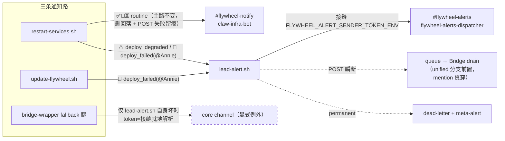

# FLY-1081 三条通知路去 Simba 化 — 实施计划

Issue: FLY-1081 (https://linear.app/geoforge3d/issue/FLY-1081/fix-重启更新wrapper-三条通知路仍写死-simba-迁到-infra-botfly-915-痛点-3927-只迁了一条)
日期: 2026-07-09
基于: exploration.md、research.md

> 设计已过 brainstorm gate（Tadashi 2026-07-09 批 Option C + 硬要求：deploy_failed 必 @Annie；
> 禁双回落 SIMBA_BOT_TOKEN/DISCORD_BOT_TOKEN；fail-loud 不阻断部署且必留痕；grep-zero 精确口径；
> sentinel 防回潮；wrapper 直 curl fallback 留 core + 写清例外理由）。
> Codex design review R1（2026-07-09，xhigh）6 项反馈全部采纳：drain unified 分支前置（R1#1）、
> mention 贯穿 queue round-trip（R1#2）、LeadWatchdog 穷尽 switch（R1#3）、routine POST 失败留痕 +
> helper stdout 纪律（R1#4）、旧测试合同改造 + CI 显式接线 + sentinel 强化（R1#5）、
> queue/dead-letter 文件名加 EVENT_ID 防同秒覆盖 + updater slug 带 marker 语境（R1#6）。
> R2 两项亦采纳：restart 侧删单参 severe_alert wrapper、真实调用点改三参 + 补第 11 个 warning slug（R2#1）；
> updater founder-id 缺失补 stderr WARNING 降级合同 + T4 断言（R2#2）。

## 0. 目标一句话

重启（restart-services.sh）/ 自更新（update-flywheel.sh）/ Bridge wrapper（flywheel-bridge-wrapper.sh fallback 腿）三条通知路的发送身份从 Simba 迁到 infra 身份：⚠️/🚨 改道 `lead-alert.sh`（继承 FLY-927 接缝 + 去重 + 队列 + fail-loud），routine 删静默回落，`SIMBA_BOT_TOKEN` Flywheel 侧 grep-zero。

## 1. Scope / Non-goals

**In**：上图全部；lead-alert.sh 新 kind ×2 + `--mention-user` + queue 文件名防碰撞；LeadAlertNotifier TS union + drain unified 前置 + mention 贯穿；LeadWatchdog 穷尽 switch 补 case；测试 fixture 去 Simba 改名；sentinel 测试；CI 显式接线。
**Out**（research §6.5）：`.env` 里 `DISCORD_BOT_TOKEN` 值的退役（per-lead 默认用途）；Bridge `/api/reports` sender（FLY-929 已迁）；standup sender；#flywheel-alerts 工单 ACK/ARC 行为（FLY-368/871 既有）；TS 侧 `queueAlert()` 文件名形态（同款碰撞属既有面、非本 issue 放大路径，不动）。

## 2. 变更清单（按文件）

### 2.1 `scripts/lead-alert.sh`

1. kind 白名单（:105）加 `deploy_failed`、`deploy_degraded`，注释注明 FLY-1081 + TS-union parity 惯例（照 `bridge_wrapper_fail` 先例）。
2. 新 flag `--mention-user <snowflake>`（默认空 = 现状字节不变）：
   - 校验 `^[0-9]{17,20}$`，非法 → stderr `WARNING: --mention-user '<v>' invalid, ignoring`，按未传处理；
   - CONTENT 生成后前缀 `<@id> `（普通与 tickets 两种 content 形态都加，加在最前 —— Discord 要求真实 ping 的 id 必须同时出现在 content 与 `allowed_mentions.users`）；
   - `BODY_JSON` 的 `allowed_mentions` 由 `{parse: []}` 变 `{users: ["<id>"]}`（仅显式点名放行，其余仍抑制 — 保持 FLY-927 R1#7 原意）；
   - `write_record()` 增可选 `mentionUserId` 字段（queue 与 dead-letter 同构），未传时**不写该键**（旧记录形态字节兼容）。
3. **queue/dead-letter 文件名加 EVENT_ID 防同秒覆盖**（Codex R1#6）：`QUEUE_PATH`（:344）与 `dl_path`（:377）从 `<ts>-<lead>-<kind>.json` 改 `<ts>-<lead>-<kind>-<EVENT_ID前12位>.json`。消费者（drainQueue/运维）只按 `*.json` 扫描、不解析文件名，无兼容问题。

### 2.2 `packages/teamlead/src/LeadAlertNotifier.ts`

1. `ALERT_EVENT_TYPES` 加 `"deploy_failed"`、`"deploy_degraded"`（注释：FLY-1081，shell 侧 lead-alert.sh kind 同步；shell-only kind，Bridge 侧不主动发射）。
2. `AlertPayload` 加可选 `mentionUserId?: string`。
3. **统一 validated-mention helper**（Codex R1#2）：`validMentionUserId(payload)`（`^\d{17,20}$`，复用 ticketOwnerMention 同款正则）。两处消费：
   - `formatContent()`（:1208-1230）：合法 `mentionUserId` → content 前缀 `<@id> `（drain 重投正文真实携带 mention）；
   - `sendDiscord`：`allowed_mentions.users = dedupe([ticketOwnerMention(payload), validMentionUserId(payload)])`；两者皆空 → 各路径现状合同**逐字不变**（unified 无 mention = `{parse: []}`；non-unified legacy 无 mention = 不写 `allowed_mentions` 键，合同锚点 LeadAlertNotifier.test.ts:828-850）。
4. **drainQueue unified 分支前置**（Codex R1#1，:777-790）：`this.unifiedAlert` 存在时**跳过** `resolveLead()/resolveChannel()`，直接用 unified channel + `postAlertWithSendChain`（发送链本就在 unified 分支内重算）；仅 legacy 分支保留 resolveLead → unknown-lead / no-channel dead-letter 语义。否则 `--lead deploy|updater`（无 projects.json 注册项）的瞬断排队记录会被判 unknown-lead 永不重投 —— 恰是部署失败告警最需要恢复投递的场景。

### 2.3 `packages/teamlead/src/LeadWatchdog.ts`（Codex R1#3）

`titleFor()`（:999-1083）/`bodyFor()`（:1103-1168）是对 `AlertEventType` 的无 default 穷尽 switch（tsconfig `noImplicitReturns`）：为 `deploy_failed`/`deploy_degraded` 各补 title/body case（注释沿 `bridge_wrapper_fail`/`notify_digest_failed` 的 shell-only kind 惯例——watchdog 自身永不发射这两 kind，case 仅为穷尽性）。`pnpm -C packages/teamlead typecheck` 纳入 M2/M5 验证。

### 2.4 `scripts/restart-services.sh`

1. 删 :89-90（`SIMBA_BOT_TOKEN`/`NOTIFY_BOT_TOKEN`）与 :100-110 `notify_discord()`。
2. 新增 helper（**stdout 纪律**：helper 全程 stdout 恒空 —— `alert_severe` 会被 :632 `bp_fail_loud` 从 command-substitution 敏感路径调用；诊断一律 stderr；lead-alert.sh 的调用采用 `1>&2`（其自身日志本就走 stderr，stdout 仅 --strict-delivery 用、本处不用），**不得** `>/dev/null 2>&1` 吞 ERROR）：
   - `alert_warning <sig-slug> <title> <body>` → `lead-alert.sh --project flywheel --lead deploy --kind deploy_degraded --severity warning --signature "<slug>-$(date -u +%Y%m%d%H%M)" 1>&2 || true`
   - `alert_severe <sig-slug> <title> <body>` → 同上但 `--kind deploy_failed --severity severe` + `${FLYWHEEL_FOUNDER_USER_ID:+--mention-user "$FLYWHEEL_FOUNDER_USER_ID"}`；`FLYWHEEL_FOUNDER_USER_ID` 未设 → stderr WARNING（留痕）+ 照发不 @。
   - 两者 `|| true` —— **通知失败绝不 block 部署**（FLY-739）。
3. **删除单参 `severe_alert()` wrapper**（Codex R2#1，Option B —— 保留 wrapper 会造成单参/三参合同矛盾，`set -u` 读缺失 `$2/$3` 直接中止部署）：两个现有调用点逐字改三参 —— :1132 → `alert_severe "rollback-port-stuck" "Flywheel deploy failed" "<原文>"`；:1149 → `alert_severe "rollback-leads-failed" "Flywheel deploy failed" "<原文>"`。:632 `bp_fail_loud` 覆盖里的 `notify_discord "🚨…"` 改 `alert_severe "port-fail-loud-${reason}" "$title" "$body"`（meta-alert 腿保留）。
4. 11 个 ⚠️ 直调点（:213,220,613,846,859,910,1151,1226,1235,1268,1276）改 `alert_warning`，slug 一一对应（`plugin-update-failed`/`plugin-update-recheck-failed`/`idle-timeout`/`supervisor-stuck-${lead_id}`/`lead-restart-failed-${lead_id}`/`lead-exited-early-${lead_id}`/`update-rolled-back`/`leads-partial-failed`/`leads-skipped-no-manifest`/`plugin-leads-failed`/`plugin-leads-skipped`）。title 统一短句，原中文全文放 body。
5. 其余 4 个 🚨 直调点（:1107,1116,1154,1175）→ `alert_severe`，slug `deploy-failed-no-rollback`/`rollback-blocked-dirty`/`update-and-rollback-failed`/`deploy-port-stuck`。
6. `notify_routine()` 两处补刀（Codex R1#4）：
   - 回落分支（:137）→ stderr `ERROR: routine notify unconfigured (CLAUDE_INFRA_BOT_TOKEN/FLYWHEEL_NOTIFY_CHANNEL missing) — NOT falling back` + `meta-alert.sh notify_routine_unconfigured …` + `return 0`；
   - **主路 curl 失败**（现仅 `log WARNING`）→ stderr ERROR + `meta-alert.sh routine_notify_failed …` + `return 0`（meta-alert 每 reason 10min debounce，天然防同次部署内多条 routine 刷桌面）。

### 2.5 `scripts/update-flywheel.sh`

1. 删 :39 `NOTIFY_BOT_TOKEN` 与 :40-45 `notify_discord()`（`DISCORD_CORE_CHANNEL` 默认值常量随之清）；`severe_alert()` 改签名 `severe_alert <slug> <body>` → `lead-alert.sh --project flywheel --lead updater --kind deploy_failed --severity severe --signature "<slug>-$(date -u +%Y%m%d%H%M)" ${FLYWHEEL_FOUNDER_USER_ID:+--mention-user …} 1>&2 || true`；与 restart 侧同款降级合同（Codex R2#2）：`FLYWHEEL_FOUNDER_USER_ID` 未设 → stderr WARNING（留痕）+ 照发不 @，stdout 不受影响、rc 仍 0。
2. **调用点 slug 带 marker 语境**（Codex R1#6）：:140 → `marker-not-on-origin-$(basename "$f")`；:157 → `marker-det-threshold-$(basename "$f")`——不同 marker 同分钟不再被 claims 去重互吞（eventId 含 signature）。
3. sourceable 测试模式不变（severe_alert 仍顶层函数可覆写）。

### 2.6 `scripts/flywheel-bridge-wrapper.sh`

`bp_fail_loud` 内 :102-107 fallback 腿（research §2.3 代码形态）：

- token 解析改接缝间接展开（`FLYWHEEL_ALERT_SENDER_TOKEN_ENV` → `${!sender_env:-}`），语义逐字对齐 lead-alert.sh:243-247；
- 解析不到 → stderr ERROR（拒回落声明）+ return（meta-alert 已在函数前段发过；不再有 Discord 腿）；
- 解析到 → 现状直 curl core channel，auth 改 `-K -` stdin config（token 不进 argv，顺手对齐 lead-alert.sh 安全惯例；现状是 argv）；
- stdout 恒空维持（函数处于 `$(bp_launcher_preflight …)` command-substitution 路径，既有 Codex R2 HIGH 约束）；
- 函数头注释写清例外理由：「此腿仅在 lead-alert.sh 缺失/失败 + Bridge down 时运行；落点保留 core channel 是 gate 批准的显式例外 —— 告警管线自身故障时宁可发错频道也不丢 Bridge 死讯」。

### 2.7 grep-zero 落地（research §4 全表执行 + Codex R1#5 强化）

- 3 个测试 shell fixture + 4 个 TS 测试 fixture + claude-lead.sh:53 注释 → 中性名（`TEST_COS_BOT_TOKEN` / `FLYWHEEL_ALERT_SENDER_TOKEN_ENV`+`TEST_SENDER_TOKEN` 按语境）。纯改名，断言语义不变。
- 新增 `scripts/__tests__/simba-grep-zero.test.sh`：
  - `git ls-files scripts packages | xargs grep -l "SIMBA""_BOT_TOKEN"` 非空即 FAIL（拼接模式防自匹配）；
  - `update-flywheel.sh` 与 `flywheel-bridge-wrapper.sh`：**整文件禁** `DISCORD_BOT_TOKEN` literal（零出现）；
  - `restart-services.sh`：`DISCORD_BOT_TOKEN` 出现次数必须恰为 1 且逐字匹配 :891 的合法 per-lead 注入形态 `"DISCORD_BOT_TOKEN=${!bot_token_env}"`——拦住任何等价 fallback 写法回潮，不只 `:-${DISCORD_BOT_TOKEN` 一种。

### 2.8 `.github/workflows/ci.yml`（Codex R1#5 —— CI 是显式清单不是 glob runner）

新增 step「Test — FLY-1081 notify-path migration」显式跑：`restart-notify-routine.test.sh`（改造后）、`restart-services-notify.test.sh`（新）、`update-flywheel-queue.test.sh`（现存但未接线，一并收编）、`simba-grep-zero.test.sh`（新）。`lead-alert-fly927.test.sh` 与 `bridge-wrapper-fail-loud.test.sh` 已在 FLY-927 step 内，不重复。deps（jq/sqlite3/shasum）CI 已装。

## 3. 测试计划（TDD：先写 RED）

| # | 测试 | 断言要点 |
|---|---|---|
| T1 | `lead-alert-fly927.test.sh` 扩 | `--mention-user`：content 以 `<@id> ` 开头 + `allowed_mentions.users=[id]`；非法 id → 忽略；不传 → 与现基线字节一致；queue 记录含/不含 `mentionUserId`；**同秒两条不同 signature → 两个 queue 文件都保留**（文件名含 EVENT_ID） |
| T2 | `restart-services-notify.test.sh` 新 | sed 抽 `alert_warning`/`alert_severe`/`notify_routine` + fake lead-alert.sh/curl/meta-alert：kind/severity/signature 前缀/`--mention-user` 正确；fake 非零退出 → 函数 rc=0；founder env 未设 → 无 `--mention-user` + stderr WARNING + **stdout 恒空**；routine env 缺失 → 零 curl + meta-alert(`notify_routine_unconfigured`) + rc=0；**routine 配置齐全但 fake curl 失败 → stderr ERROR + meta-alert(`routine_notify_failed`) + rc=0**；静态断言：`severe_alert()` 定义已不存在，:1132/:1149 两真实调用点为三参 `alert_severe` 形态（Codex R2#1） |
| T3 | `restart-notify-routine.test.sh` **改造**（现 Case2/3/severe 锁的是「回落 Simba」旧合同，实现后必红） | Case2/3 翻转：env 不齐 → **零 curl** + meta-alert；Case4 静态分类改锚 `alert_warning`/`alert_severe`；severe_alert 逐字断言改为「定义不存在」（wrapper 已删，Codex R2#1） |
| T4 | `update-flywheel-queue.test.sh` 改 | 中和 env 改接缝族；marker-blocked 流仍绿且 fake lead-alert 收到 `--kind deploy_failed --lead updater` + slug 含 marker basename；**founder env 缺失 → 无 `--mention-user` flag + stderr WARNING**（Codex R2#2） |
| T5 | `bridge-wrapper-fail-loud.test.sh` 改 | fallback：接缝可解析 → curl 发生且 auth 走 stdin config 新 token；接缝不可解析 → **零 curl** + stderr ERROR + rc=0 + stdout 恒空；主路 S1-S3 断言不变 |
| T6 | `LeadAlertNotifier.test.ts` 扩 | `mentionUserId` 合并进 `allowed_mentions.users`（与 ticket owner 共存去重）+ **formatContent 前缀 `<@id> `**；**真实 queue→drain round-trip**：手写 shell 形态 queue 记录（`projectName=flywheel, leadId=deploy`，projects 无此 lead）→ unified 模式 drain 后 sent=1、文件删除、deadLettered=0、重投 content 以 `<@id> ` 开头、users 含该 id；byte-compat 双锚：unified 无 mention=`{parse:[]}`、non-unified legacy 无 mention=不写 `allowed_mentions`（:828-850 现合同）；`ALERT_EVENT_TYPES` 含两新 kind |
| T7 | `simba-grep-zero.test.sh` 新 | §2.7 三段断言 |

全仓 `pnpm lint` + `pnpm -C packages/teamlead typecheck` + 上表全部 shell 测试绿（push 前跑）。

## 4. 验收（对 issue 逐条）

1. ✅ 真重启 → 通知由 infra 身份发出（routine=claw-infra-bot@#flywheel-notify；⚠️/🚨=flywheel-alerts-dispatcher@#flywheel-alerts，severe 附 @Annie 真实 ping），**Simba 零发言**（截图为证）。
2. ✅ `grep -rn "SIMBA_BOT_TOKEN" scripts/ packages/` 归零（T7 sentinel 常驻防回潮）。
3. ✅ 接缝解析失败 → 报错 + 拒回落（lead-alert.sh 既有 dead-letter 语义 + T2/T5 单测）。
4. ✅ bridge-wrapper 早期路径：env source 时序已核实（research §1.5）；T5 注入法实证。

## 5. QA / 上线注意（implement 阶段执行者与独立 QA 都要读）

- **真机验收窗**：完整触发一次真重启有生产扰动（Tier-3 类），按惯例**搭下一个 batched restart 窗**做截图验收，不专门为本 issue 重启。QA 由 Tadashi 另派独立 session（gate 里已说）。
- **生效方式**：三个 shell 脚本 = merge 后生产 `git pull` 即生效（下次调用现读）；**LeadAlertNotifier/LeadWatchdog（union + mention 贯穿 + drain 前置）= 要 Bridge 重启**才生效 —— 攒进同一个 batched restart，不单独重启。**shell 先行生效窗口的已知边界**：drain 前置未上线前，若恰有 deploy 告警瞬断排队，会被旧 Bridge 判 unknown-lead 进 dead-letter（有 meta-alert 留痕，不静默）；窗口短、可接受，QA 复核 dead-letter 目录即可。
- **QA 前置核对**：`FLYWHEEL_FOUNDER_USER_ID` / 接缝双 env / `CLAUDE_INFRA_BOT_TOKEN`+`FLYWHEEL_NOTIFY_CHANNEL` 生产已全设（research §1.5 实测），QA 复核未漂移。
- **回滚**：纯发送身份/落点变更，无状态迁移；revert PR 即回滚。claims.db 新 kind 行无需清理。

## 6. 里程碑

1. M1 lead-alert.sh（kind + mention + 文件名 EVENT_ID）+ T1 绿。
2. M2 LeadAlertNotifier + LeadWatchdog（union + mention helper + drain unified 前置 + 穷尽 case）+ T6 绿 + `pnpm -C packages/teamlead typecheck` 绿。
3. M3 restart-services.sh 迁移（helper + routine 补刀）+ T2/T3 绿。
4. M4 update-flywheel.sh + bridge-wrapper + T4/T5 绿。
5. M5 grep-zero 改名 + T7 绿 + CI step 接线 + 全仓 lint/typecheck/shell suite 绿。
6. M6 PR + Codex code review → 独立 QA（真机段搭 batched restart 窗）→ founder gate。
