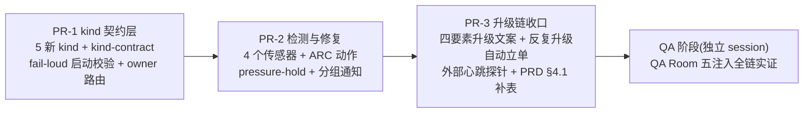

# FLY-1082 fleet 级故障告警 + ARC 真修 — 实施计划

Issue: FLY-1082 (https://linear.app/geoforge3d/issue/FLY-1082/infra-alerts-fleet-级故障oom-tmux-server-死-跨-lead-僵尸无人认领-arc-真修那一环没生效)
日期: 2026-07-09
基于: research.md(接缝已核实)+ exploration.md(brainstorm gate 已过,含外部心跳补充)

---

## 0. 一句话

给告警工单体系补上 5 个 fleet 级 kind(全部有主、fail-loud 校验兜底),给 ARC 补上这些 kind 的**可执行、可逆**修复动作,再用三条互补的腿(wrapper dirty-marker / boot 自检 / Bridge 进程外心跳)保证「Bridge 自己死了」不再静默 —— QA Room 真故障注入拿全链证据收口。

## 1. 交付物总览(3 个 PR + QA 阶段)

统一原则(全 PR 适用):
- **零新 timer**:所有传感器挂 `plugin.ts:6168` `onPollComplete` 顺风车。
- **只做可逆动作**:AutoRepairBot 新动作全部可逆(hold 可撤 / kickstart 幂等 / 通知无副作用);§4.4 五条立刻升级在分发层落死。
- **默认 ON + 每传感器独立 kill switch**(`FLYWHEEL_FLEET_SENSOR_<NAME>=0` 关):default-off 会复刻「enable 窗永远等不来」= 本单要治的病;kill switch 保留逃生口。**唯 fail-loud 启动校验无开关**(代码完整性检查,不是行为)。
- TDD:每 task 先写失败测试;文件行号引用以 research.md §2 为准。

## 2. PR-1 — kind 契约层(白名单 + fail-loud)

### Task 1.1 `bridge/kind-contract.ts`(新文件)
- `KindContract = { owner: "claude" | "codex" | "cross_by_provider" | "founder_direct"; arc: "auto" | "none_escalate" | "human_by_design"; remediationRef?: string }`。
- `KIND_CONTRACTS: Record<AlertEventType, KindContract>` —— Record over union = **编译期穷尽**(漏 kind 编译不过)。
- `validateKindContracts()`:运行期校验每个 kind 满足 (a) `arc=auto` 且有 remediationRef+owner,或 (b) `arc=none_escalate|human_by_design` 且 owner 明确;违约 → **throw(列出缺的 kind),Bridge 拒绝启动**(在 plugin 初始化早期、listen 之前调用)。
- 存量映射(行为零变化):`permission_blocked`/`runner_lead_pending_unhandled` → `human_by_design`;其余 20 个存量 kind 按 ticket-owner-map 现状填表。
- 测试:穷尽性(类型级 + 运行期)/ 人为删一条 → 启动校验 throw 且信息含 kind 名 / 存量 kind 的 owner 解析与 `resolveTicketOwner` 现状一致(防契约表与路由漂移)。

### Task 1.2 新 kind 入白名单(两处 face 同步)
- `LeadAlertNotifier.ts` `ALERT_EVENT_TYPES` 增:`swap_pressure_high` / `tmux_server_lost` / `bridge_abnormal_exit` / `infra_bot_down` / `zombie_session_backlog`(注释各附一段 why,沿用现有风格)。
- `scripts/lead-alert.sh:105` allowlist 同步增(`bridge_abnormal_exit` 是 shell 腿必需;其余为防漂移一并加)。
- **契约测试**治漂移:测试读 shell 脚本该行,断言 TS 联合与 shell allowlist 的交集覆盖全部「shell 腿可发」kind(research §3.3 选契约测试不选生成)。

### Task 1.3 owner 路由扩展(`ticket-owner-map.ts`)
- `infra_bot_down` → 新交叉规则:工单 provider = **死掉的 bot 那侧** → owner = 对侧 bot(复用 `ACCOUNT_AUTH_KINDS` 的 provider 交叉模式)。
- `zombie_session_backlog` → owner Claude bot + AlertChannelHub 侧标记 (b) 型:入队即走 escalate 文案路径(带样本清单),不经 ARC 重试循环(对齐 `runner_lead_pending_unhandled` 的「直接 ESCALATED」先例)。
- 其余 3 kind → 默认 Claude bot(现状 default 分支已覆盖,测试锁定)。

### Task 1.4 工单头 schema
- fleet kind 的 `project` 字段 = `machine`(fleet 级没有单一 project;schema 字段齐全保 N1 可算,research §2.1)。`lead/runner id` 字段:tmux_server_lost 填受影响 Lead 列表摘要,其余填触发组件。

## 3. PR-2 — 检测与修复(传感器 + ARC 动作)

### Task 2.1 `bridge/machine-watermark.ts`(新文件,共享传感器)
- `readSwapUsage()`:`sysctl vm.swapusage` 解析(used/total);注入 seam:`FLYWHEEL_SWAP_SENSOR_CMD` 覆盖命令(QA 假读数)。
- 阈值 + 滞回:`FLYWHEEL_SWAP_PRESSURE_HIGH_PCT`(默认 80)触发 / `FLYWHEEL_SWAP_PRESSURE_LOW_PCT`(默认 65)解除;连续 2 tick 超阈才触发(防抖,对齐 FLY-1048 多帧确认先例)。
- **导出为独立模块** —— FLY-1072 的派活门槛直接消费同一读数(分界:research §2.3)。
- 测试:解析 fixture(真实 sysctl 输出样本)/ 滞回状态机(高→触发一次;震荡不重复;低→解除)。

### Task 2.2 pressure-hold + admission 接线 + ARC 动作
- hold 状态:StateStore 单行(`fleet_pressure_hold`:置位者/ts/水位快照),置撤皆幂等。
- `runner-admission.ts`:新 typed reason `pressure_hold` —— hold 在 → `AdmissionDeferredError`(429 映射沿用;测试:hold 置位拒派、撤销放行、reason 字面量)。
- AutoRepairBot:`AUTO_ATTEMPT_EVENT_TYPES` + `swap_pressure_high` attempt 分支 = 置 hold + 通知各 Lead 降载(mailbox);水位回滞回下界 → reconcile 撤 hold + 工单安静 resolve。T2 语义:5 分钟窗内水位不回落 ≠ 立刻升级(水位是慢变量)—— 该 kind 覆写 escalation policy 的 `timeoutMs`(env,默认 30 分钟),**per-kind policy 覆写**进 `ticket-escalation.ts`(默认表不动,byte-compat)。
- 测试:attempt 幂等(重复工单不重复置 hold)/ 回落自动 resolve / 超窗升级文案带水位曲线摘要。

### Task 2.3 tmux server 探测 + 分组通知
- tick 腿:running tmux-session ≥1 且 `tmux list-sessions` 报「no server running」→ `tmux_server_lost`(server 级判定与单 session 死亡区分,research §2.4)。
- boot 腿:复活对账中,上一世代 running ≥ `FLYWHEEL_TMUX_MASS_LOSS_MIN`(默认 3)且全部 pane 消失 → 同 kind(聚合,不被逐个收尸掩盖;与 tick 腿同 episode 签名去重)。
- ARC 动作(AutoRepairBot 分支):批量收尸复用 crash-reaper 腿(scrollback 取证保留)→ **按 Lead 分组通知**(各自阵亡清单 + resume 指针 `$FLYWHEEL_PROGRESS_PATH` + 当前水位);respawn 不代劳(Lead 驱动铁律)。
- 修不掉:通知投递失败 → 升级;Lead 收到后不响应走 FLY-637-ext 既有梯子(本单不新建梯子)。
- 测试:server-gone 判定(模拟 tmux 错误输出)/ 聚合阈值 / 通知分组正确性(3 Lead 13 runner fixture)/ 与 crash-reaper 并跑不双杀。

### Task 2.4 bridge_abnormal_exit 双腿 + dirty-marker
- Bridge 生命周期:boot 写 `~/.flywheel/state/bridge-running.marker`(PID+ts);SIGTERM clean shutdown 改写 clean(挂现有 shutdown 处理器,`/health` `shuttingDown` 同源)。
- wrapper 腿:`scripts/lib/bridge-port.sh` `bp_launcher_preflight` 增 dirty-marker 检查 → exec 之前 lead-alert.sh 直发 `bridge_abnormal_exit`(severe;分钟级 signature 去重,`flywheel-bridge-wrapper.sh:89-101` 先例);连续 dirty ≥N(复用 starts-in-window 计数)→ 文案升级为 crash-loop @Annie。
- boot 自检腿:复活后的 Bridge 读 marker → dirty 则开**工单**(生命周期版);ACK → boot 对账完成 → 安静 resolve。两腿同 episode 前缀,claims.db 去重不双响。
- 测试:bridge-port.sh 单测(bats/sh 既有测试模式)dirty/clean/首启三态;Bridge 侧 marker 写改删;双腿去重。

### Task 2.5 infra_bot_down 探测 + kickstart
- tick 探针:两 bot 的 lead session/pane 存活(LeadWatchdog 视野)+ `launchctl print` job 兜底;死 → 工单,owner 交叉(Task 1.3)。
- ARC 动作:`launchctl kickstart -k <job>`(幂等可逆);2 次失败(T2 默认)→ @Annie。
- 测试:探针判定 fixture / kickstart 分支 mock / 交叉 owner 断言。

### Task 2.6 zombie 扫描(节流)
- tick 顺风车节流 ~15min:CommDB↔StateStore 对账三形态(research §2.6 口径);积压 ≥`FLYWHEEL_ZOMBIE_BACKLOG_MIN`(默认 3)→ `zombie_session_backlog` 工单(样本清单 ≤10 条 + 总数),(b) 型直升。
- 收割不做(FLY-1066);kind-contract `remediationRef: "FLY-1066"`。
- 测试:三形态 fixture 各一 / 阈值下不开单 / 清单截断 / 同批签名去重(不重复开单)。

## 4. PR-3 — 升级链收口 + 外部心跳 + PRD 补表

### Task 3.1 四要素升级文案
- escalate 消息模板统一为:`kind` · `ARC 试了什么` · `为什么失败` · `Annie 只需拍的那一个决定`(§4.4;AutoRepairBot `needs_human` 的 detail 已是 reason,补前两要素由 Hub 组装)。存量 kind 文案不回归重写,新 fleet kind 全量走新模板;founder 面人话、不带 PRD 号。
- 测试:5 kind 各一条 escalate 渲染快照。

### Task 3.2 反复升级 → 自动立 runbook 单
- escalate 路径钩子:查 StateStore 工单行,同 kind 7 天 `ESCALATED` ≥`FLYWHEEL_RUNBOOK_GAP_THRESHOLD`(默认 3)→ `client.createIssue`(复用 auto-qa-effects.ts:283 构造;FLY team / Flywheel project / label Flywheel)。
- 去重:StateStore 记 per-kind open runbook-issue id,建单前核 issue 仍 open 则跳过;issue 关闭后计数窗重新累计。
- 测试:窗口计数 / 去重 / 标题人话断言。

### Task 3.3 外部心跳探针(交付物,部署归 1071)
- `scripts/bridge-liveness-probe.sh`(确定性代码,非 LLM loop):`curl /health` 每分钟;连续 down ≥`FLYWHEEL_BRIDGE_DOWN_ESCALATE_MIN`(默认 5)分钟 → 用 Codex bot token Discord 直发 @Annie(带最后成功 ts + 建议动作);恢复后单发一条解除。状态文件防重复升级(episode-latch 模式)。
- 附 launchd plist 模板(装进 Codex bot 的 launchd 域)+ runbook 条目(identity.md C6 补一节)。**本单交付脚本+模板+文档;真装 = FLY-1071 的 enable 窗**。
- 测试:探针脚本 sh 单测(down 计数 / latch / 恢复解除)。

### Task 3.4 PRD §4.1/§10.0 CH-1 补表(docs)
- `product/doc/FLY-915-infra-alerts-pipeline/prd.md`:§4.1 与 §10.0 CH-1 白名单表增 5 行(kind/触发/owner/ARC/修不掉),§4.3 补一句外部心跳兜底职责。
- **风险协调**:PR #530(未 merge)改同文件不同节(§4.4/§8.1)——本单 PR 只动 §4.1/§10.0/§4.3 表行,冲突面小;若 #530 先 merge 则 rebase,后 merge 则由其作者 rebase(已知,列进 PR 描述)。

## 5. 配置面汇总(全部 env,可回滚)

| env | 默认 | 作用 |
|---|---|---|
| `FLYWHEEL_FLEET_SENSOR_SWAP` / `_TMUX` / `_BOT` / `_ZOMBIE` | 1 | 各传感器 kill switch(=0 关) |
| `FLYWHEEL_SWAP_PRESSURE_HIGH_PCT` / `_LOW_PCT` | 80 / 65 | 水位阈值 + 滞回 |
| `FLYWHEEL_SWAP_SENSOR_CMD` | —(真 sysctl) | QA 注入 seam |
| `FLYWHEEL_TMUX_MASS_LOSS_MIN` | 3 | boot 聚合判定阈 |
| `FLYWHEEL_ZOMBIE_BACKLOG_MIN` | 3 | 僵尸积压开单阈 |
| `FLYWHEEL_RUNBOOK_GAP_THRESHOLD` | 3(/7 天) | 反复升级自动立单阈 |
| `FLYWHEEL_BRIDGE_DOWN_ESCALATE_MIN` | 5 | 外部心跳升级判据 |
| kind 级 escalation 覆写(swap 30min) | 见 Task 2.2 | per-kind timeoutMs |

## 6. 测试与验收

- **单测/集成**(每 PR 内,TDD):见各 task;运行 `pnpm vitest` 相关包 + `pnpm lint` 全仓(push 前家规)。
- **QA 阶段(独立 QA session,不由实现 runner 自验)**:QA Room(FLY-529 隔离)五注入(research §2.8):假水位 / 杀隔离 tmux server / 杀 QA bridge / 停 QA bot job+心跳探针 / 插孤儿 row。验收 = 测试频道可见每条工单 `NEW→ACK→修复中→已修/已升级` 全链 + 修复副作用实证(hold 置撤 / 分组通知内容 / kickstart / 直发升级),**不接受只有代码合了**。
- **生产 enable 依赖**:bot ACK 环节依赖 FLY-1071(双 bot 真跑起来);owner env 未配时按 FLY-927 既有降级(不 @、不武装 unclaimed fallback),传感器与工单照常工作 —— 即本单落地后即使 1071 未完,**检测+入队+升级链已止血**(不再静默),bot ACK 是 1071 完成后的增量。

## 7. Non-goals / 边界(gate + Tadashi 指引已锁)

- 不做 OOM 根治/并发控制/水位派活门槛本体(FLY-1072;共享 machine-watermark 传感器)。
- 不做僵尸收割(FLY-1066;本单只检测+升级)。
- 不做 bot 部署/enable(FLY-1071/928;心跳探针只交付脚本+模板)。
- 不做 N1/N2 digest 聚合(字段已齐,聚合归 notify 侧);不做 reconcile-QA 修复(FLY-1092);不做重恢复引擎(FLY-271)。
- 「整机全灭」(Bridge+双 bot+launchd 全死)超出本机告警能力,明确不承诺。
- respawn runner 永远 Lead 驱动;bot/Bridge 不碰 runner lifecycle(FLY-175)。

## 8. 风险

| 风险 | 缓解 |
|---|---|
| 新 kind 在 bots 未武装期产生频道噪音 | owner 未配则不 @(现状机制);(b) 型仅 zombie 且有积压阈+节流;观察日(1071)盯量 |
| PRD 文件与 #530 冲突 | 不同节、表行级改动;PR 描述标注 rebase 约定 |
| swap 阈值误报(压缩内存机型差异) | 滞回 + 连续 2 tick;阈值 env 可调;QA 注入 seam 让阈值行为可回归 |
| wrapper/bridge-port.sh 是启动关键路径 | dirty-marker 检查失败必须 fail-open(不阻启动),只影响告警不影响拉起;sh 单测覆盖三态 |
| onPollComplete 变重拖慢 watchdog tick | 传感器全部轻量(单 sysctl / 单 tmux 探针 / 节流对账);超时保护 + 单 tick 预算日志 |
