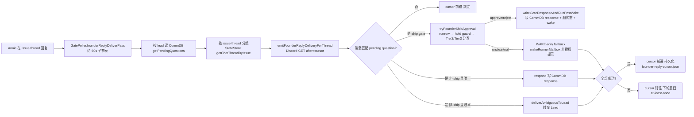

# FLY-1099 founder-reply 摄取死掉 — 探索

Issue: FLY-1099 (https://linear.app/geoforge3d/issue/FLY-1099/fix-founder-reply-摄取discordcommdb死掉-founder-批准静默不绑-gatep1)
日期: 2026-07-09
基于: 无

## 1. 问题陈述

P1 founder-facing 事故（2026-07-09 晚，PT）：Annie 在多个 [FLY-XX] gate thread 里点的批准
（"ship" 等自然语言）**全部没绑到 approve gate** —— runner 侧 verify-approval 持续返回
`{approved:false, reason:gate_not_answered}`。CommDB `messages` 里她最后一条成功入库的
gate 批准停在 **2026-07-09 18:25 UTC**（`{"approved":true}`），之后的批准一条都没写进去。
期间 Bridge log 反复 `[GatePoller] founder-reply deliver pass error: out of memory`。
裸终端 `launchctl kickstart -k` 重启 Bridge（新进程、0 OOM、GatePoller 满速）之后，
摄取**仍然没恢复** —— 她 04:13/04:16 UTC 的 "ship" 依旧没进 CommDB、gate 依旧 0 children。
全程**零告警**。

三个要求（Issue 原文）：

1. **根因**：为什么 OOM 之后不自愈、连全新 Bridge 进程都不写库？
2. **修复**：founder 的自然语言批准重新可靠写进 CommDB gate、绑上 approve gate。
3. **self-heal + 告警**（HL + Tadashi 都要求）：摄取链卡死时必须自检 + 告警，绝不能再让
   founder 批准静默消失（账本诚实性）。

## 2. 摄取链结构（现状）

founder 的 Discord thread 回复到 CommDB gate answer 的完整链路：

关键持久状态（重启后仍在，是"重启不自愈"的候选元凶）：

| 状态 | 位置 | 作用 |
|------|------|------|
| thread cursor | `~/.flywheel/founder-reply-cursor.json` | PROCESSED-THROUGH 语义，只有处理成功才前进 |
| pending gate questions | CommDB `messages`（type=question, 无 response child） | 匹配 founder 消息的候选集 |
| CommDB `sessions.lead_id` | per-project `comm.db` | WAKE-only fallback 的 mailbox 身份来源 |
| session 状态 / pr_head_sha / review_question_id | StateStore `sessions` | A-2 narrow（必须 awaiting_review + 当前 review gate） |
| `codex_review_record.status` | StateStore | founderApprovalHoldGuard 的 codex gate 腿 |
| `auto_qa_record.status` | StateStore | founderApprovalHoldGuard 的 QA 腿 |

## 3. 生产现场证据（只读审计，2026-07-10 04:00-04:45 UTC 实时抓取）

事故发生时实时取证（Bridge pid 8341，21:12 PT 启动的新进程）：

1. **cursor 文件在推进**（mtime 04:30+ UTC 持续更新）→ deliver pass 活着，不是"整个 pass 死了"。
2. **24h attribution 审计分布**（StateStore `session_events`，`founder_ship_attribution`）：
   `held_declined` 39 次、`narrow_zero` 16、`narrow_multi` 15、`tier3_unclear` 8、
   `tier3_runner_failed` 3、**`response_written` 0 次** —— 24 小时内 founder 批准零成功绑定。
3. **FLY-1059（Annie 04:16 的 "ship"）**：audit = `held_declined`。其 exec `0b9caf7c` 的
   `codex_review_record` status=**pending**（23:59 创建，卡 4.5h+）→ hold guard 拒写。
   生产共 **73 条 pending** 的 codex_review_record（跨数天累积）。
4. **僵尸 gate 队头阻塞**：FLY-977/980/1041/1049 四个 exec 的 approve_to_ship question 仍
   pending，但 CommDB `sessions` 行已消失（StateStore 里 session 已 terminal）→ WAKE-only
   fallback 每轮 `no_session_lead`（`founder_ship_reply_wake_skipped` 事件每 ~90s 重复）→
   `allOk=false` → **整条 thread cursor 钉死**。最老的钉死消息 snowflake 时间 =
   **2026-07-08 20:00 UTC**（钉了 32+ 小时）。这些 thread 里后续所有 founder 消息永远不被处理。
5. **Tier-3 分类器 exec 失败**：`tier3_runner_failed`，reason =
   `exec_failed:Command failed: claude -p ...`（stderr 含 "no stdin data received in 3s"）。
   命中包括 Annie 04:28 的明确指令「反正你先帮我去merge了吧…起码把 1050、1070 这条线都先解决了」。
   失败后被折成语义 unclear → WAKE-only → **cursor 照常前进，该消息永久失去绑定机会**。
6. **OOM 窗口**（时间归属修正——见 §7 回归二分）：bridge log 共 224 条
   `founder-reply deliver pass error`（221 空消息 + 2 `memory access out of bounds` +
   1 `out of memory`），伴随 `[StateStore] FLY-639: rebuild FAILED (3/3)` → FATAL 退出 →
   respawn。**这些行属 Jun 28-29 的旧事故段**（log 自 Jun 28 累积）；今晚（Jul 9）Bridge
   段零 OOM。它证明「pass 整体死 + 零告警」这个故障模式历史上真实发生过（watchdog 修复
   的依据），但不是今晚 binding 失败的原因。

## 4. 根因结论（四条腿叠加，非单一故障）

| 腿 | 现象 | 根因 | 为什么重启不自愈 |
|----|------|------|------------------|
| **A** | OOM 窗口摄取全死（**Jun 28-29 历史事故**，非今晚——见 §7） | sql.js WASM 堆崩（FLY-663 同族）→ pass 每 tick 抛错 | 自愈=FATAL 退出+respawn（已有），但期间零告警 |
| **B** | 重启后 ship 仍不绑（主犯） | codex review 进程被 OOM 杀死 → `codex_review_record` 永远 pending → `founderApprovalHoldGuard`（FLY-1041 Chunk 5）拒绝一切 founder text 写入 | hold 状态持久化在 StateStore，新进程照读照 hold；FLY-863 只在 3h 后告警一次，不解卡 |
| **C** | 部分 thread 的 founder 消息完全不被处理 | terminal session 留下的 pending gate（僵尸）→ WAKE-only 永远 `no_session_lead` → at-least-once cursor 钉死 → 队头阻塞 | 僵尸 gate 与丢失的 CommDB session 行都是持久状态；无人 resolve 它们 |
| **D** | 明确批准被折成 unclear 丢失 | `claude -p` 子进程失败（负载/stdin 等待）被当成语义 unclear，不重试且 cursor 前进 | infra 失败与语义 unclear 未区分处理（审计已区分，行为未区分） |

横切缺陷 **E（账本诚实性）**：以上每一腿都只有 console.warn 或 session_events 审计，
**没有任何一条到 #flywheel-alerts** 的告警路径；founder 收到的唯一信号是 ❓ 反应
（她不知道 ❓ 意味着 held）。

## 5. 修复方向（选项探索）

### 方向一：只修告警（最小侵入）

摄取链不动，加 watchdog + 告警。
**否**：founder 批准依然不绑（腿 B/C/D 原样），只是"死得有声音"。不满足 Issue 要求 2。

### 方向二：全链修复（推荐）

按腿对症，五个修复点（详见 research.md / plan.md）：

1. **僵尸 gate 卫生**（腿 C）— pass 层过滤 terminal-session 的 pending gate + 自动 resolve（审计留痕），解开队头阻塞并防复发。
2. **stuck codex-hold 反卡死**（腿 B）— 对 pending 超阈值的 record 做 reconcile（re-review 信号 / 标记 stale），held_declined 升级为 thread 内明文回复。
3. **有界重试 + dead-letter**（腿 C/D 通用）— per-message 失败有界重试，超限落 dead-letter 审计 + 告警 + cursor 前进；绝不无限钉死、绝不静默丢。
4. **摄取 watchdog + 告警**（腿 A/E）— pass 心跳 + cursor 钉死时长检测 → LeadAlertNotifier → #flywheel-alerts（FLY-220 episode-latch 范式，报一次就停）。
5. **分类器加固**（腿 D）— stdin 显式关闭 + exec_failed 判 transient 有界重试。

### 方向三：重构摄取链为事件驱动（Discord Gateway push）

放弃轮询 + cursor，改 Gateway WebSocket 推送。
**否**：范围爆炸（Bridge 现无 Gateway 常驻连接架构），且不解决 hold guard / 僵尸 gate 这些
状态层问题。留给未来架构演进。

## 6. 悬而未决的问题（带进 brainstorm gate）

- Q1: 僵尸 pending gate 直接自动 resolve（写 resolved_at + 审计）还是只跳过不动数据？
- Q2: founder 在 hold 期间的批准，要不要「暂存 + hold 清绿后自动补绑」（新语义，带 TTL）？
- Q3: 五个修复点一个 PR 还是拆分？

## 7. 回归二分 —— 回答 Annie「今早还好好的，下午开始出问题，是不是最近 ship 了什么？」

（Tadashi 指令 531a0145，证据全部来自生产库/日志，非推测。）

### 结论（一段话，人话版）

**是，也不是。直接的行为变化确实来自一个当天 ship 的改动：FLY-1041（PR #520，11:13 merge、
13:09 Bridge 重启生效）——它按设计把「codex review / QA 没绿时 founder 的批准」从『照写不误』
改成『拒绝写入、只回 ❓』。今早「好好的」其实是当时还在裸写批准（正是 FLY-1041 要修的
FLY-910 隐患）。但把这个按设计的保守行为变成灾难的，是三个和它无关的环境条件叠加：
①codex review 记录大量卡在 pending（跨几天累积 73 条，14:27 的全机 swap-OOM 事故杀掉
review 进程后雪上加霜）→ hold 永不解除；②被拒时只有一个 ❓ 表情、没有任何解释和告警 →
你完全不知道发生了什么；③几个更老的慢性病（僵尸 gate 队头阻塞从 7/2 就有、分类器子进程
脆弱）同时显性化。所以准确说：不是「某个改动写错了」，而是「一个正确但保守的新闸门，
撞上了一个本来就在带病运转、当天又被负载压垮的环境，而且闸门关上时不出声」。**

### 证据链（逐条可复核）

| # | 证据 | 出处 |
|---|------|------|
| 1 | `held_declined`（hold guard 拒写审计）**有史以来第一条 = 07-09 20:11:18 UTC（13:11 PT）**，之前 48h+ 零条 | teamlead.db session_events |
| 2 | `founder_ship_attribution` 这个审计事件类型本身（FLY-1041 Chunk 4 引入）首现同为 13:11 PT——部署时刻的天然指纹 | 同上 |
| 3 | PR #520（FLY-1041）**11:13 PT merge**；Bridge **13:09:18 PT 重启**（首个带新代码的进程）；13:11 首拒 —— merge→部署→行为变化三点连线，间隔 2 分钟 | git log origin/main + bridge log wrapper 行 |
| 4 | 今天 Bridge log 段（13:09 起）**零** OOM 签名——Issue 里引用的「founder-reply deliver pass error: out of memory」等行实际位于 log 第 26k-40k 行，属 **Jun 28-29** 的旧事故段（该 346MB log 从 Jun 28 累积至今，整文件 grep 会捞到旧行） | /tmp/flywheel-bridge.log 行号×wrapper 时间戳对照 |
| 5 | 14:27 PT 的 OOM 是**机器级** swap 打满事故（杀 tmux/runner/codex review 进程），Bridge 进程本身今天没有 OOM；它对 binding 的伤害是间接的：review 进程死 → codex_review_record 卡 pending → hold 常驻 | task 记录 + codex_review_record 时间分布 |
| 6 | held_declined 从 13:11 起持续到现在（每小时 2-8 条），而 24h 内 founder 批准成功写入 = **0 条**，最后一条成功 = 18:25 UTC（11:25 PT，恰在 13:09 部署**之前**） | session_events + comm.db messages |
| 7 | 对照组：非-ship 的 founder 回复（respond 路径，不经 hold guard）今天照常入库（founder_reply_delivered 每天 10-23 条）——坏的只有 ship 批准这一支，与 hold guard 的作用面精确吻合 | session_events |
| 8 | 负载假设的定位：并发空前（30+ runner、语音 venue、多路 codex review）没有直接压死 Bridge（无 OOM），但通过 14:27 事故 + review 收敛变慢放大了 pending 堆积；held_declined 在事故前 1 小时（13:11）就已开始——负载是**放大器**，不是点火器 | 时间线先后 |
| 9 | 慢性病独立存在：僵尸 gate 的 `no_session_lead` wake 空转从 **7/2** 就有记录；这与 FLY-1041 无关，只是今天 Annie 高频回复让它显性化 | session_events 首现时间 |

### 对修复方案的含义

回归二分**不改变** plan 的修复面，反而确认了它：FLY-1041 的 fail-closed 语义是对的、应保留
（本 plan 不回滚它）；要修的正是让它安全可运营的三件事——hold 卡死能自愈（stuck codex
record 解卡）、拒绝时明说并暂存批准（held 明文 + deferred approval）、任何一环卡住出声
（watchdog + 告警）。

## 8. 相关 issue

- FLY-1041（founder-approval binding glitch，同族）：本次用到的 attribution 审计、hold guard、
  reply-to-card 都是它建的基建；FLY-1099 是它上游"摄取与状态健康"层的缺口。
- FLY-863：stuck codex-hold 已有 3h 告警（postThread + lead alert），但只告警不解卡。
- FLY-639 / FLY-663：sql.js StateStore 崩坏与 self-heal（FATAL-exit respawn 路径今晚起效）。
- FLY-605：founder-reply 摄取链本体（Part B）。
- FLY-742：stale awaiting_review 卡 cron —— 与僵尸 gate 同一"终态残留卡活人"家族。
