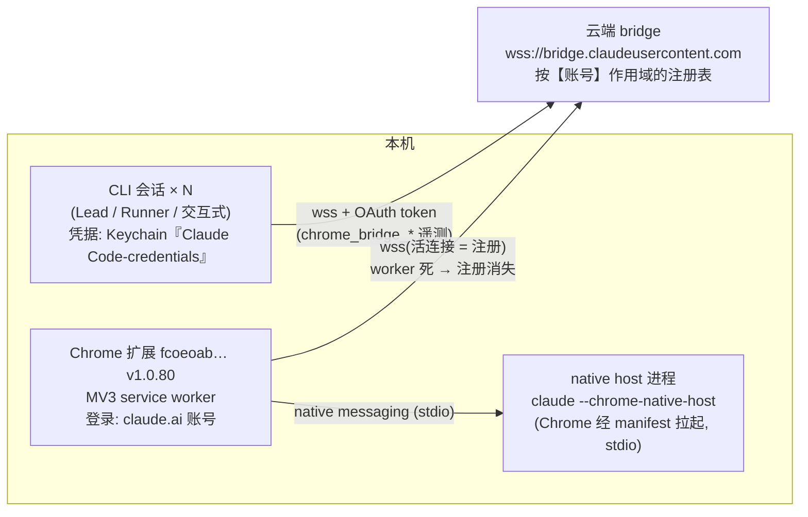

# FLY-1116 Claude-in-Chrome 全机断连 — 探索

Issue: FLY-1116 (https://linear.app/geoforge3d/issue/FLY-1116/fix-claude-in-chrome-全机断连-修复配对-产出-chrome-repair-skillp1阻塞所有-founder)
日期: 2026-07-10
基于: 无

## 1. 问题陈述

2026-07-09 夜，本机所有 agent 会话（Lead + Runner）的 Claude-in-Chrome 全部不可用：

- `tabs_context` → "Browser extension is not connected"
- `list_connected_browsers` → `[]`（0 浏览器）
- `switch_browser` → "No other browsers available"（确认弹窗都发不出去）

影响：QA 无法以 Annie 身份走 founder UI 路径（P1，阻塞所有 founder-path QA）。Annie 直令：必须修好 + 把诊断→修复流程固化成 chrome-repair skill（「以后每一次 Claude Code 坏了，就用类似的方法去修它」）。

## 2. 架构还原（本轮排查的最大成果，全部有实证）

从 CLI 2.1.206 二进制逆向（`rg -a` 字符串提取）+ 本机文件/进程取证 + 官方文档（code.claude.com/docs/en/chrome）交叉验证：

关键机制事实：

1. **CLI↔扩展的主传输是云端 bridge，不是本机 IPC**。`list_connected_browsers` 的语义 = "List all Chrome browsers (extension instances) currently **connected to this account**"（二进制原文）——账号作用域的**活连接**注册表，不是持久设备表。
2. **native host 只是本机侧通道**（isLocal 判定、配对确认等）：lsof 实测它除了与 Chrome 的 stdio 管道外**零 socket**——bridge 连接不经过它。它的存活 ≈ 扩展 worker 持有 native messaging port 的存活（worker 死 → port 关 → host 退出），因此 **native host 进程是 worker 生死的本机可观测指标**。
3. **账号错配有专用故障态**：`chrome_bridge_account_mismatch` 遥测 + 专门报错分支（"the OAuth token Claude Code is using belongs to a different claude.ai account…"）。CLI token 账号 ≠ 扩展 claude.ai 登录账号 ⇒ 该会话永远 0 browsers。
4. **配对记录** `~/.claude.json` `chromeExtension.pairedDeviceId`：本机现存 `fd627eee-…`，而今晚实际注册的 deviceId 是 `7d4ee494-…`（不一致）。实测单浏览器场景下不阻断（tabs_context 照常工作）⇒ 配对记录是路由偏好，非硬门槛；多浏览器时才需要重配（switch_browser 确认流）。
5. CLI 侧的 chrome MCP 注入由启动 flag / `claudeInChromeDefaultEnabled`（本机 = true）+ GrowthBook `tengu_chrome_auto_enable` 控制；本机各会话 MCP 工具都在（能返回 []），**CLI 侧注入层无恙**。

## 3. 铁证时间线（2026-07-09 → 07-10，全部来自进程 lstart / 文件 mtime / API 实测）

| 时间 (PT) | 事件 | 证据 |
|---|---|---|
| 07-07 ~ 07-08 | 扩展 1.0.80 落地各 profile | Extensions 目录 mtime（Jul 7-8）⇒ **排除**「扩展今天更新」嫌疑 |
| 06:11 | Chrome 完整重启（清掉旧 native host 15571/66377），**没修好** | issue 已排除项 |
| 14:27 | 机器 OOM 事故（swap 打满压死 tmux，全 runner 阵亡） | 当晚事故记录 |
| 16:35 / 16:41 | CLI 自动更新 2.1.205→2.1.206；`~/.claude/chrome/chrome-native-host` wrapper 重写 | versions/ 与 wrapper mtime |
| 22:40:20 | Keychain『Claude Code-credentials』被修改（mdat） | `security find-generic-password` 元数据；**在断连窗内** |
| 23:10:57 | Chrome 主进程再次重启（Annie 又试了一次；不止 06:11 那次） | Chrome 主进程 lstart |
| 23:16:40 | **worker 实例 A 出生**：native host 96924 spawn；**同一秒** bridge 注册 connectedAt=23:16:40.925（deviceId 7d4ee494, isLocal:true） | ps lstart + list_connected_browsers 返回值 |
| 23:36-23:37 | 本 runner 实测 list=1、tabs_context 成功（真机往返，建出 tab group） | 本会话工具返回 |
| ~23:39 | worker A 死（96924 消失） | ps 复查 |
| 23:39:41 | **worker 实例 B 出生**：新 native host 45686 spawn；**只观察到 native host 通道；shopping 频道此后持续无注册**（其它账号频道无观察者，bridge 总体状态未知——v5 措辞） | ps lstart + 此后 shopping registry 持续空 |
| 23:52 | 本 runner navigate 失败 "Browser extension is not connected" | 本会话工具返回 |
| 00:0x | Tadashi 在本 pane 跑 /chrome：live 检查 = "No browsers are connected" | Lead 实测 |
| 00:1x-00:2x | list 复测两次均 `[]`；45686 仍活着（worker B 活着；shopping 频道无注册，其它频道未观察） | 本会话实测（旧 token 会话） |
| 00:21 | **Annie 执行 R3**（扩展 OFF→ON + 开侧边栏）：新 native host 51988 生于 00:21:39 | ps lstart |
| 00:27 / 00:38 | list 均 `[]`，tabs_context 报 not connected；51988 仍活 ⇒ 当时判「R3 造出的 worker 从未连 bridge」——经 v5 修正：只证明未连 **shopping 频道**；northwestern 频道彼时无观察者，R3 效果不可归因 | 本会话实测（旧 token 会话）+ ps |
| 00:33:44 | **执行 R2**（Lead GO + Annie 知会后）：osascript 优雅退出 + open -a 重启；native host 92248 在重启后 **1 秒** spawn（00:33:45） | 本会话执行 + ps |
| 00:34-00:42 | R2 后 T+8 分钟 list 持续 `[]`；00:41 自助试探 open claude.ai/chrome 页 90 秒亦无效 ⇒ 当时判「R2 单独也不触发 bridge 注册」——**后经 implement 阶段修正为假阴性**（见 23:40/01:19 行） | 本会话实测（旧 token 会话） |
| — | **理论修正 v3**：这次 host 启动后 1 秒即 spawn，反推 23:16:40 那次（浏览器启动后 6 分钟）"host spawn + bridge 注册同秒"并非启动滞后，而是 **Annie 那一刻打开扩展侧边栏截图核实登录** ⇒ 触发 bridge 连接的是**扩展 UI 手势（开侧边栏）**；R2 重启只是清掉坏 worker 状态的前置。待验证：Annie 补一次 panel-open | 推理 + 待验证 |
| 23:40:10（补录） | Keychain『Claude Code-credentials』被**重建**（cdat=mdat 同秒），机器 CLI 凭据切至 northwestern；此后新会话查 northwestern 频道、23:40 前的旧会话仍查 shopping 频道 | security 元数据 + oauthAccount（implement 回读） |
| 00:53-01:19 | Annie 开侧边栏并保持打开；Lead（旧 token 会话）01:08/01:19 两次 list 仍 [] —— 后证为**假阴性观察**（扩展彼时已注册在 northwestern 频道） | Lead 实测 |
| 01:19-01:26 | **implement 会话（01:19 生，northwestern 凭据）实测 list=1**：connectedAt=**00:33:45**（与 R2 重启同秒！注册一直在 northwestern 频道）；A4 三连全过（tabs_context / navigate example.com / read_page 读回内容）；org-ID 铁证：CLI organizationUuid == claude.ai Account 页 Org ID（864291bc-…） | implement 会话工具返回 + claude.ai Account 页 |

## 4. 分层判定

### L1（最佳解释假说；「活连接/静默弃连」机制本身为源码级实证）：扩展 worker ↔ 云 bridge 的活连接易死、且不保证自愈

- worker A 生→注册立即出现；A 死→注册消失；B 生→native host 在、**shopping 频道 40+ 分钟无注册**（其它账号频道无观察者；worker B 的 bridge 总体状态与具体失败路径未知——v5 措辞）。
- 官方文档明载同款："**Connection drops during long sessions** — The Chrome extension's service worker can go idle during extended sessions, which breaks the connection."（修法 = /chrome → Reconnect extension）
- 环境放大器：load 14-17、49 个 claude 会话、up 11 天、当天 14:27 OOM——MV3 worker 在内存/CPU 压力下频繁被杀，WS keepalive 更易断。
- 结论：**注册是"活连接"而非状态位；worker 一死全机断连；"半死态"（native 通道在、bridge 不在）是源码级机制上存在的状态**——实例 B 是否处于该态不可判（只观察到 shopping 频道为空）。"面板显示已连" 是观察效应（打开面板恰好唤醒 worker）或显示的是 claude.ai 登录态，不代表 Code bridge 在线。

### L2（当晚早段主嫌，待最后一锤）：账号错配窗口

- 本机历史上确实换过 Claude 账号（`~/.claude.json.backup*`：northwestern → xrliannie@gmail → shopping）；Keychain 凭据 22:40 被动过；545 runner 在其会话内读到 xrliannie.b@gmail.com（org "Annie's Flywheel"）。
- 假说：断连窗内机器凭据在 b@ 账号上（扩展在 shopping）⇒ 账号作用域注册表对不上 ⇒ 即使扩展健康也 0 browsers，且 **Chrome 重启无效**（完美解释 06:11 重启失败）。22:40 切回 shopping 后，还需扩展重新注册（23:10 重启 + 23:16 worker 醒）才恢复。
- 验证中：Tadashi 安排 545 runner 复读其账号（若已变 shopping 即实锤）。**无论最终是否当晚主因，这个错配态是结构性陷阱，skill 必查。**

### L3（次要/单浏览器下无害）：配对记录陈旧

pairedDeviceId(fd627eee) ≠ 当前注册 deviceId(7d4ee494)。单浏览器时不阻断；多浏览器时需重配。skill 中作为检查项而非主修复。

### 已排除（本轮实证）

- 扩展未安装/未登录（issue 已核）；扩展今天更新（mtime Jul 7-8）
- native messaging 层损坏（manifest 在位且正确指向 wrapper；host 进程健康拉起）
- Claude Desktop 抢桥（FLY-1039 已禁其 manifest）
- 云 bridge 不可达（curl → Cloudflare 426 = ws 端点正常）
- CLI 侧 bridge 鉴权失败（worker A 窗口内本 runner 成功 list+操作）
- named pipe 占用（官方文档标注为 **Windows-specific**；macOS 传输为云 bridge，49 会话并发≠管道竞争）
- 「扩展唯一连接绑死在 Annie 交互侧」（worker A 窗口内后台 runner 可用，Annie 未在操作）

## 5. 官方修法对照（troubleshooting 原文 → 本机映射）

| 官方 | 本机适用性 |
|---|---|
| /chrome → "Reconnect extension"（worker idle 断连的标准修法） | ✅ 核心步骤；需要一个能操作 TUI 的会话（headless runner 由 Lead 打 pane） |
| Restart Chrome + Claude Code | ✅ 强档位；Chrome 重启会重启 worker（但**不解决账号错配**，06:11 已证） |
| chrome://extensions 禁用→启用扩展（"Browser not responding" 步骤 3） | ✅ 比重启 Chrome 更轻的 worker 重启法 |
| 检查 manifest 文件存在 | ✅ 已核过，进 skill 检查清单 |
| named pipe 冲突 | ❌ Windows-only |

## 6. 修复配方草案（→ research.md 细化 → skill 固化）

分层诊断，从最便宜的层开始，每层有判定标准和失败分支：

1. **CLI 账号层**：读 `~/.claude.json` oauthAccount + Keychain mdat（最近被动过 = 怀疑切换）→ 必须 == 扩展 claude.ai 登录账号
2. **注册层**：任一会话 `list_connected_browsers`；≥1 → 跳 4
3. **worker 层**：`pgrep -f chrome-native-host`（host 在 = worker 活但半死；host 不在 = worker 死）→ Annie/用户动作：chrome://extensions 扩展 OFF→ON（轻）或重启 Chrome（重）→ 回 2
4. **通路层**：navigate 真机 E2E；失败 → /chrome → Reconnect extension → 回 2
5. **配对层**（多浏览器才需要）：switch_browser 确认流重配
6. **验收**：list ≥1 + tabs_context + navigate 一个页面成功

## 7. 未决问题（research 阶段收口）

1. worker B 为何在 shopping 频道无注册（bridge 总体状态未知）：token 失效静默弃连 vs 已连其它账号频道 vs 连接失败不重试？——v5 后保持 UNKNOWN（决定 skill 里"轻档修复"的可靠性）
2. deviceId 是否随每次注册轮换（决定配对记录多快过期）
3. 545 runner 账号复读结果（L2 最后一锤）
4. skill 落点：flywheel-skills repo（全机分发，FLY-216 体系）vs ~/.claude/skills（本机即时生效）——倾向 flywheel-skills（含 CI 门 + 分发），理由进 plan
5. QA 期间保活策略：是否需要 keepalive 心跳（周期 tabs_context）防 worker idle 死

## 8. 交付物

1. **修好**（进行中）：Annie 两步操作（扩展 OFF→ON + 开一次侧边栏）已交 Tadashi 转达；修复后本会话做 list+navigate 真机验收。
2. **chrome-repair skill**：把 §6 配方 + §4 分层判定固化，照方抓药级（每步命令、判定标准、失败分支）。
