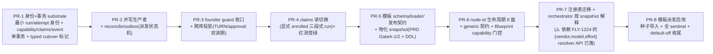

# FLY-1135 低层 DAG 模板引擎 — 实施计划

Issue: FLY-1135 (https://linear.app/geoforge3d/issue/FLY-1135/build-layer-1-per-task-category-dag-templates-fly-1020-prd-eng)
日期: 2026-07-13
基于: research.md
Status: **Codex APPROVED**(design review 4 轮:R1 13→R2 5→R3 3→R4 APPROVED,全采纳无 reject)→ implement

> spec 底座 = FLY-1020 PRD(Codex APPROVED)。本计划在其上叠加 Tadashi 直令的两章重构:
> **第一章 边的契约**(吸收 FLY-1204+FLY-1221 重设计)与**第二章 静态 DAG=配置数据**,
> 并折入业界调研结论(research.md §B)与 Annie 的两条不变量。

---

> **doc 一致性 sentinel(Codex R2#1)**:本 plan 已做术语统一 —— 全文用 **decision
> capability**(不用旧 `edge_token`);§2.1 是 claims 的**唯一规范 schema**;凭证不预绑 edge;
> 种子 eng implement = **codex**(非 claude);编辑生效 = **下一个新 run**(非「即时改在跑的
> run」)。实现期加一个 doc sentinel(**带 scoped 排除,不匹配它自己这段声明**;或用小
> parser/test),拒回潮:旧 edge-token 术语、把「字段值改」写成即时改在跑 run、implement 与
> QA 同 vendor 的种子组合。

## 0. 总验收

1. **第一章**:`REDESIGN-ACCEPTANCE.fly1204-ship-gate.test.ts`(自 origin/fly-1204-split 原样落到
   本线)**变绿** —— 且不许改弱断言(测试文件自带反作弊说明)。
2. **第二章**:一份 YAML + 注册表声明 eng 三段式,**编排行为**(交接/回环/门)**与今天逐字等价**
   (reverse-compat sentinel);**厂商阵容 = 有意的验收差异**(implement claude→codex,FLY-1224
   已 founder 拍板,不算回归);product 短模板 skip qa 可跑;裸 session 出口保留。
3. FLY-1020 PRD §13 的 S1–S16 sentinel 全数成立(其中 §8 的 ship-gate 证据模型按本计划 §2.4
   的 claims 形态落地)。
4. default-off、字节兼容:不启用模板 + 不迁移的旧路径行为一字不变。

## 1. 全局架构决策(业界调研的落地映射)

| 决策 | 来源 |
|------|------|
| 图=数据:清单(YAML)→ 物化 snapshot(不可变,run 钉版本)→ 引擎解释执行 | Airflow 序列化 / n8n draft-published / Restate pinning;PRD §7 |
| 边完成凭证 = **一次性 decision capability 绑(run, node, execution, attempt, predicate-family)**(不预绑 edge — 结果才选边),引擎签发/核销 | Temporal task token / Restate awakeable |
| 声明(claim)六要素:issuer / audience(predicate)/ subject=内容 digest / expiry / **USE-time 服务端核验** / subject 变更即作废+防重放 | GitHub checks+stale-dismiss / SLSA in-toto / JWT |
| staleness **非传递**:只比对声明实际绑定的 subject(目标 head),不做全图污染 | Dagster Unsynced |
| stale → 阻断/通知,重跑走显式有界 kickback,**绝不自动重算** | Dagster 反模式修正;agent 会话非纯函数 |
| 边条件 = 封闭枚举(qa_fail / founder_feedback_kickback / …),无自由表达式 | Airflow trigger rules;PRD 红线 5 |
| **回环 = 第一等构件**:图允许**声明式回头边**(条件 + 显式出环条件 + 轮数上限 + 超限升级动作)——「结构静态、路径动态」;我们站 cycles-first 派(LangGraph),不站 strict-DAG 派(Airflow 类表达不了打回) | Annie 直令 4696188e;LangGraph 带环图 / homerail(PRD §5.5) |
| 人审门:deadline 在引擎 DB(durable)、等待释放资源、答复结构化、超时 fail-closed —— **fail-closed 是我们门节点自己的属性,不继承框架默认**(DR:政策中立/默认 fail-open 的框架比想象多;per-gate 显式声明,ship gate 一律 fail closed) | Prefect / Airflow 3.1 / Temporal / K8s;FLY-159/168 已同向 |
| 节点契约(长跑 AI 会话)= suspendable activity:start policy · cancellation · heartbeat · evidence schema · timeout budget · 兼容包络 —— 落注册表节点类型字段 | DR 增量;Temporal activity 模型 |
| 门判定只认结构化证据,绝不 grep 模型输出文本 | AutoGen 反模式 |
| 图不进模型上下文;每节点只拿自己的角色文本 | Anthropic 官方立场;PRD 红线 6 |

## 2. 第一章 · 边的契约(先行,红测变绿为界)

### 2.1 claims 账本(append-only)—— 规范 claim schema(唯一真相,Codex R2#1/#3)

新表 `workflow_claims`(teamlead.db,StateStore);**列如下即完整规范,其他节引用以此为准**:

| 列 | 语义 | 空值/CHECK(按 issuer_kind) |
|----|------|------|
| id / server_seq / **issued_at** | 追加式;`server_seq` = 服务端单调序号(claim 解析靠它,非时间戳);issued_at 供审计/timeline | 均非空 |
| issue_id / workflow_run_id | 归属(判别旧 workflow 尝试的在途事件,PRD §7) | 非空 |
| node_id / **decision_kind** / **attempt** | 决策身份 `(run_id, node_id, decision_kind, attempt)` —— 门的解析键 | runner_node 非空;policy/challenge 的 node_id/attempt 可空 |
| predicate | 封闭枚举:`qa_passed` / `qa_failed` / `codex_approved` / `founder_approved` / `design_review_approved` / `qa_exempt` / …(audience:predicate 不同不能互换消费) | 非空 |
| **issuer_kind** | `runner_node` / `bridge_policy`(qa_exempt 等) / `founder_challenge` | 非空,决定下面各列约束 |
| issuer_execution_id / issuer_node_id / issuer_vendor / issuer_model | 谁签发(vendor+model 都记;比对用**解析后的 backend/model**,不信自报) | **仅 runner_node 非空** |
| **subject_producer_execution_id** | 被审产物的**生产者**执行(跨厂商第二道 = reviewer ≠ producer 的 vendor) | review 类 predicate 非空 |
| **subject_kind** / subject_digest | **subject_kind 枚举 {`git_head`, `snapshot_digest`}**(qa_exempt = snapshot_digest 绑 run 快照,非 head);**subject 由 core `subject_resolver` 按 decision_kind 服务端派生**(reporter worktree / producer worktree / PR head / 物化 docs head),runner 自报仅比对 | 非空 |
| **expires_at** | 过期时刻;**仅显式永久系统 claim 可空** | 见左 |
| **submission_digest** / client_request_id | 规范化提交摘要 + client id —— consumed-capability 幂等重放的唯一确定性比较键 | runner_node 非空 |
| evidence(json) | 结构化证据引用(报告路径 / verdict event id / 轮次) | — |
| **authority_id** | runner_node → `decision_capability_id`(§2.2);bridge_policy/founder_challenge → server-owned challenge/policy id | 非空(按 kind 取值域) |

**吊销/取代**:claims 表 append-only 不可改行 → 吊销走**独立的 append-only
`workflow_claim_revocation`(claim_id, revoked_at, reason, actor)**;解析时把「被吊销」并入无效
判定。**门的解析算法(R2#3/R3#1,消除歧义)**:先对 `(run_id, node_id, decision_kind)` + 当前
subject 取**最高 attempt/server_seq 的那一条**,**再**要求它未过期、无对应 revocation 行、无冲突、
且为 pass;**绝不在过滤掉无效行后回落到更旧的 attempt**。缺失/过期/吊销/冲突/FAIL → 拒。

**读语义**:门在 **USE time** 查「当前 head 的最新有效 claim」;没有/不匹配/最新为 fail → 拒绝。
`qa_required` 单向门快照对迁移后的 run 不再是判定依据(遗留路径字节不变)。

### 2.2 一次性决策凭证(node-attempt capability;Codex R1#3 重构 —— 不预绑 edge)

**关键修正**:QA 一次激活可能产出 PASS(前进边)或 FAIL(回头边)—— 派发时引擎不知道会走哪条边,
凭证**绑到「节点尝试」而非预选的边**;合法出边由 Bridge 在收到结果后按 snapshot 选择。

新表 `workflow_decision_capability`(与 claims 同库):`token_hash`(**绝不存明文**)· run_id /
node_id / execution_id / attempt · **allowed_predicate_family**(如 qa_verdict / review_verdict)·
manifest_revision + evidence_schema_version · expected_subject_digest(可空)· issued_at /
expires_at / consumed_at · consumed_claim_id · revoked。

**提交事务(单 StateStore 事务)**:验凭证(有效×未过期×未核销×predicate 允许)→ 服务端捕获
subject → 写 claim → 按 snapshot 选合法出边 → 核销凭证 → 追加 run_event(分配 seq)→ loop
计数 → 更新投影。**capability 校验先于任何通用事件落库**(专用 endpoint,防无效提交留下
「像证据的输入」,R1#6)。

- **幂等重放(R2#3 收紧)**:提交持久化规范化 `submission_digest` + client_request_id;
  重放先按 `(decision_capability_id / submission_digest)` 判**同 payload → 返回已建 claim**
  (幂等成功,保住现有 qa-result-failed 恢复契约);**不同 payload、或已过期/已吊销/旧 attempt
  的凭证 → 拒**(与 §2.5 E3 一致,和「过期即 fail-closed」不矛盾)。
- **heartbeat 续期有绝对上限**:续期不得超过节点的 absolute deadline —— 被攻破的活 session
  不能无限续命。
- **原隔离不变量（已被 FLY-1244 正式收窄）**：capability 明文只在 Bridge/父进程内存；一个知道
  B 的 execution/head、能枚举 `~/.flywheel` 的同用户 sibling，仍不能产出或重放 B 的有效决策。
- **为何单用户 fleet 不可达**：FLY-1244 的 macOS 26.3.2 真机证据确认 node `net` 无 peer
  pid/credential；fd 不能穿过已运行的 tmux server；Claude/Codex shell snapshot 会持久化 spawn
  env；同 uid 还能用 `tmux send-keys` / `capture-pane` 主动驱动 B。只要凭证必须送进同 uid runner，
  纯 bearer 就不可能提供原隔离；恢复原目标需要原生 peer-credential broker 或独立 OS principal。
- **收窄后的实际保证（FLY-1244 选项 B）**：enrolled verdict 退役 fleet-wide ingest bearer，改用
  绑定单一 `(run,node,execution,attempt)`、短 TTL、server 只存 hash 的 submission credential；
  Bridge 从真实 worktree 捕获 subject head，caller head 只比对。它保证 stale headless bool 不放行、
  自选 head 无效、被动泄露爆炸半径从全 fleet 压到单 execution+TTL、跨 execution 自报无效；**不
  保证**阻止同用户 snapshot harvest 或 pane 注入，TTL 内同用户可伪造该 execution PASS 是已知接受
  残留。原生 peer-credential/独立 principal follow-up 与 fresh-spawn E2E **共同**构成 READ 上生产
  硬前置；在它们闭合前 `FLYWHEEL_WORKFLOW_CLAIMS_READ` 保持 off。
- CLI/marker 只存不透明 request id/digest，不存凭证或完整 verdict body。治的靶是共享 ingest bearer +
  `--exec-id/--pr-head` 双可伪；不再声称 bearer 本身是同用户隔离。

### 2.3 founder-approval 写边界收口(FLY-1221 范围;Codex R1#8 校正事实)

- **事实校正**:text/reaction/voice 三条路径的 `founderApprovalHoldGuard` **生产接线是真的**
  (plugin.ts 建闭包注入)—— voice-routes.ts:108 / founder-ship-approval-handler.ts:174 的注释是
  **准确的依赖契约文档,不是站岗**;FLY-1221 的真缺口 = `approveExecution` + founder-consent
  router 两个直写分支。做法:**盘点全部生产批准写入点**,hold 检查放在最窄的共享 pre-write
  边界 + 直写例外路径保留纵深防御;沿用 FLY-1099 已有语义(可自清的 codex_pending/qa_not_green
  → defer,merge_block → reject);保留唯一 kill-switch。
- **突变测试摘真实接线**(逐权威路径),不摘注释;覆盖 actions / founder-consent
  off|audit|enforce / text / reaction / voice / deferred replay / 同决策重试 / 应急旁路。
- founder approval 经 **server-owned challenge/claim 路径**收进账本(predicate=
  `founder_approved`,subject=pr head;founder 不持 runner 凭证,R1#4);`verify-approval`
  读侧字节兼容,跨库投影见 §2.4b。

### 2.4 三段式迁移与 cutover 判别(1204/1221 的关单路径;Codex R1#5 —— 红测必须进新分支)

- **cutover 判别符 ≠ 「有没有 claims」**(红测 fixture 无 run/claim,按表存在判别会留在旧路径
  永远红)。判别 = **durable 三段式身份**:`session_role=qa`(∧ `chat_thread_role=qa`)的行
  **停止承认 headless `qa_required=0` 豁免**,一律要求当前 head 的有效 claim;缺证据 →
  fail-closed + 显式 re-QA 恢复路径。字节兼容只给**真·非模板单 session(main)run**。
- **部署时在飞三段式的分类**:fail-closed → 触发 re-QA(不 grandfather、不合成历史 PASS);
  每类(design/implement/qa 在飞)各有测试。
- claim 语义确定化(R1#4;**解析算法与列定义以 §2.1 为唯一规范**,此处不复述以免 drift):
  `qa_exempt` = Bridge 签发的 **run/snapshot 策略 claim**(issuer_kind=bridge_policy,
  subject_kind=snapshot_digest 绑 run 快照、非 head;actor+reason 审计),不是 runner 边 claim。
- fly-1204-split 存量吸收(R1#12 —— hash 清单换成 **path/hunk 集成矩阵**):61593e8a 只取
  QA-head ownership hunks(它同时回退了 4975ee0d 的文件);retry-admission/worktree-occupancy
  取 4975ee0d 的**最终实现**;40405388(head-ownership Codex gate)+ 8c24044f+b3457180
  (evidence-not-marker)整体吸收;0a06fe3e 由账本取代(记录取代关系)。**最终合成树断言**:
  原 58cecc1f 红测逐字节跑 + parked 分支 worktree/retry 测试对合成树全绿。每片 hunk 指定落
  哪个 PR。

### 2.4b 账本原子性 + 派发 outbox + 跨库契约(Codex R1#6/#7)

- **事件事务**:唯一 client/event id;`(run_id, seq)` 在**同一事务**内分配 + 校验 snapshot
  合法转移 + 更新 run/node 投影;`workflow_run_node` 键 = `(run_id, node_id, attempt)`;
  投影可由事件重建(显式 rebuild/reconcile 入口)。
- **派发 outbox 状态机**:`intent_recorded → launch_committed → started`;execution_id 在副作用
  前预留;与既有 launch-claims / session / worktree_ready 证据对账(session_started 本就
  fire-and-forget 可丢);启动对账绝不双派 writer、绝不搁浅 open node。
- **跨库权威契约(R2#4 —— outbox 必须在权威库那一侧)**:TURN 与 founder approval 权威在
  per-project CommDB,teamlead.db 事务无法与之原子。**正解:source event / outbox 行写进
  「与那次权威写同一个 CommDB 事务」**(CommDB commit 与 outbox 入队原子,消掉「CommDB 提交后、
  StateStore 入队前」的半写窗口);再由 projector 用 `(project, source_event_id)` 幂等追加进
  StateStore。**TURN 尤其要留 append-only source 历史**:今天 `grantTurn` 覆盖单行 + 涨 epoch,
  中间转移无法从终态行重建 —— 必须补一条 CommDB 侧的 append-only TURN 源历史,否则「权威 run
  event 历史」会漏掉一次交接。
  **定稿选择(R3#2 —— 不留两条路)**:epic 的 ship 路径**强制**用「CommDB source event/outbox +
  append-only TURN 源历史」;current-state 投影只能作为中间 PR 态、**显式标记不可 ship**,
  PR-4/PR-8 验收硬 gate 在 source outbox 上(不许选便宜的投影降级冒充合规)。**cutover 后最终
  权威**:workflow claims/events 归 teamlead.db,CommDB 仅留作 legacy 兼容源。**双读退出判据
  (具体)**:所有活跃 writer/reader 覆盖协议版本 · durable outbox 零滞后 · 全量 reconcile 成功 ·
  双读 adapter 外无 legacy 在飞 session · rollback 已验证。这些 gate 分派 PR-3/PR-4。每个边界
  crash 测试证明当前权威**与**历史账本都存活。runner 的 TURN 读 / `verify-approval` 只在双读期
  之后切换。新表:`commdb.workflow_source_event`(project, source_event_id, kind, payload, at ——
  与权威写同事务)· `commdb.turn_source_history`(append-only)。

### 2.5 第一章验收 sentinel

| # | 用例 | 期望 |
|---|------|------|
| E1 | 红测 | 变绿(断言原文) |
| E2 | QA 对 H1 PASS 后 head 前进到 H2 | ship gate 拒;kickback 后新 attempt 对 H2 PASS → 放行 |
| E3 | (a) 同 payload 重放 consumed capability;(b) 异 payload / 过期 / 旧 attempt / 冲突;(c) 伪造 subject / 无凭证 | (a) 幂等返回已建 claim;(b)+(c) 全部 fail-closed |
| E4 | 摘任一 founder-approval 写入点 guard | 突变测试红 |
| E5 | 遗留(未迁移)run | ship gate + Auto-QA 路径字节不变 |
| E6 | 同厂商 review claim | 拒(跨厂商不变量) |

## 3. 第二章 · 静态 DAG = 配置数据(PRD Gate A/B,吸收第一章产物)

### 3.1 与 PRD 的差分(其余照 PRD §14 执行)

1. **§8 ship-gate 证据模型的落地形态 = §2.1 claims 账本**:`workflow_qa_required/passed/exempt`
   不再作为三个独立布尔字段落库 —— `required` 由 snapshot 是否含 QA 节点在入口物化;`passed` =
   claims 里当前 head 的 `qa_passed`;`exempt` = 入口写的 `qa_exempt` claim(predicate 化,同一
   账本同一读语义)。PRD 的 S1–S10 语义不变,载体统一。
2. **节点实例字段吸收 FLY-1224**:`{ id, type, vendor?, model?, effort? }`(+`agent_file` 仅
   generic);resolver 走既有 `VENDOR_TO_EXECUTOR` 别名路径,不新写映射;Codex 节点 windowed TUI
   铁律(FLY-398)在注册表 capability/约束里显式承载。**⚠️ FLY-1224 是硬依赖非并行项**
   (Codex R1#13):今天 dispatchModel 无条件锁 claude 后端、effort 对非 Claude 后端无意义 ——
   模板派发(PR-8)必须等 1224 的显式 {vendor,model,effort} resolver API + 测试落地。
3. **跨厂商互审 admission 校验 + 种子模板合法性(Codex R1#2)**:定义**规范 review-family
   枚举 {claude, codex}** + 服务端从**已解析执行 backend/model** 映射(绝不信 manifest/runner
   自报);带 review 语义的节点与其上游作者节点同 family → admission 拒(第一道),claim 层
   第二道见 §2.4。**种子模板的精确阵容**:eng 三段式 = design(claude/fable) ·
   implement(codex/gpt-5.6-sol/xhigh) · qa(claude/opus) —— 即 FLY-1224 的目标态,天然满足
   跨厂商(implement=codex ≠ qa=claude);**「行为逐字等价」限定为编排行为**(交接/回环/门),
   厂商阵容 = 有意的验收差异(1224 已是 founder 拍板)。admission 正测(三份种子全过)+
   同 family 负测必备。product v1 的 review family 同规则。
4. **loop 边 = 一等构件**(Annie 硬要求,直令 4696188e):模板语言原生表达带条件回头边,每条
   回头边必须声明全部四element —— `loop_when`(条件源,封闭枚举 {qa_fail,
   founder_feedback_kickback})· **出环条件**(qa_pass 即前进)· `max_iterations`(必填)·
   **`on_limit` 超限升级动作**(默认 escalate 给 Lead/founder,fail-closed 不静默继续)。
   今天硬编码的 QA-FAIL→fix→re-QA belt/epoch(phase-orchestrator)迁成这条声明式边,守卫逐字
   保留(PRD §6.1);每轮 = 新 attempt = 新 decision capability(§2.2),round ledger 复用 claims 时间线。
   **命名精确化**:允许受控回环后,图形式上是「带声明式回边的有向图」而非严格 DAG ——
   「结构静态、路径动态」(结构+规则事先声明含回环,路径运行时按 verdict 走)写进 loader 文档
   与 v4 给 Annie 的定义卡。模板 #1 的示意 YAML 必须画出回头边。

### 3.1b 存储与运行时状态(Annie v4 反馈 f3788859 新增 —— 回答「点和边存哪」)

**决策:teamlead.db(Bridge 的 better-sqlite3)为权威存储;repo YAML 仅作 core-shipped 种子 +
导入/导出格式**(业界对齐:n8n 文档住库里 draft/published 分离;Airflow serialize 进 metadata DB;
Dify DSL 导入导出)。这修订 PRD §4.1/§9 的「canonical-root YAML 为加载源」:YAML 仍在(种子 +
可 diff 保底),但**运行时真相在 DB** —— 否则 Annie 的 Dashboard 热部署诉求(下)无法满足。

| 表 | 内容 | 写权限 |
|----|------|--------|
| `workflow_template` | template_id, name, project_scope, current_published_revision | Dashboard 统一提交流(founder;loopback+same-origin+confirmToken,同 fleet console 模式);boot 种子导入(system) |
| `workflow_template_revision` | (template_id, revision), **manifest JSON 字节不可变**, schema_version, created_by, created_at | append-only;发布不改本行 |
| `workflow_template_publication` | (template_id, revision) 追加行 —— 发布事件;`current_published_revision` 指针**原子 CAS**(R1#9;发布≠改 revision.status) | 统一提交流(founder) |
| `workflow_run` | run_id, issue_id, (template_id, revision) 钉住 + **物化 snapshot**(PRD §7,含 generic agent.md 内容), current_node_id, status | 引擎(admission 物化;推进时更新 current_node_id) |
| `workflow_run_node` | (run_id, node_id, **attempt**) state / execution_id / started_at / ended_at | 引擎(事件事务内更新投影) |
| `workflow_run_event` | (run_id, seq) append-only:node_dispatched / node_completed / edge_traversed / loop_iteration / gate_opened / claim_written…, node_id/edge_id/execution_id, event_uid, payload, at | 引擎(节点只能经 Bridge「提交下一事件」;非法转移按 snapshot 合法边集合 fail-closed) |
| `workflow_decision_capability`(§2.2) | 一次性决策凭证(token_hash / run/node/execution/attempt / predicate-family / manifest+schema rev / subject? / issued/expires/consumed / consumed_claim_id / revoked) | Bridge 签发/核销 |
| `workflow_node_outputs`(§5-Q2) | (run_id, node_id, **attempt**) 结构化产出 + output_digest;仅当前合法 attempt 事务性提升 | 引擎(经 output 能力,§5-Q2) |
| `workflow_side_effect_ledger`(§2.4b + §5-Q2) | **typed** 副作用状态机 intent_recorded→committed→done + 预留 execution_id;kind ∈ {dispatch, materialize};覆盖派发**与** docs materializer | 引擎 |
| `workflow_category_binding`(§3.1b) | (project, task_category)→template_id + project 默认;模板选择的权威绑定 | 统一提交流(founder) |
| `workflow_claim_revocation`(§2.1) | append-only 吊销/取代记录 | Bridge |
| (CommDB 侧) `workflow_source_event` / `turn_source_history`(§2.4b) | 跨库权威源 + append-only TURN 历史 | 与权威写同事务 |
| `workflow_claims`(§2.1) | 同库同事务域 —— 谁写=持一次性 decision capability 的被派发节点经 Bridge 校验;过期=subject 变更即失效+attempt 换票;门在使用时现查现验 | 见 §2.1/§2.2 |

- **run ledger 形状** = 「每 run 一条主记录 + 每节点/边事件一条明细」;现有 sessions /
  three_stage_turn 是雏形:sessions 行 ≈ 节点执行(保留,run_event 引 execution_id),
  TURN belt 事件迁为 run_event 的一类。Dashboard「跑到哪个点/哪条边」直读这两张表。
- **展示合同(HL dc144bf0 —— schema 必须撑起这些字段)**:每节点
  `state(pending/running/review/done/failed)` + started/ended 时间戳(加
  `workflow_run_node` 每节点快照行供直读;events 仍为权威历史,快照行由引擎随事件更新);
  每条边 handoff 事件 + review 状态(谁审、过没过 —— join claims);终点 ship 闸状态
  (等卡/已批/已 ship)。展示形态 = live 状态叠在模板图上;**运行时视图与 FLY-1211 审批卡
  同一 surface**(run 流到终点 → 卡在原地出现)。
- **编辑→生效三级矩阵(HL,产品分级;与 Q1=A 的 per-run override 正交 —— 那是派发时改单次
  run,这里是改模板本身)**:
  | 级别 | 例 | 确认 | 生效(**全部 = 新 revision;下一个新 admit 的 run 用新值,在跑 run 钉旧版;零重启**) |
  |---|---|---|---|
  | 字段值改 | 节点 model/effort、cron、flag | 1038 统一提交流(待提交→列旧新→确认) | 下一个新 run(不是「即时改在跑的 run」—— 那是 Lead per-run override,另一杆) |
  | 结构改 | 增删节点/改边/挪闸 | 更重确认 + 审计留痕 | 同上 |
  | 授权链改 | 改 review 政策/关某段 review/动 ship 闸 | **founder-only + 必审计 + 绝不静默生效**(FLY-1211「豁免必须显式」北极星) | 同上 |
  权限现状:founder 改全部,其他 read-only(模板编辑面;Lead 的 per-run override 另计)。
- **版本选择的唯一规则(Codex R1#1 消除自相矛盾)**:published revision 在 **workflow-run
  admission 时选择一次** → 应用并校验 per-run override → 物化完整生效 snapshot;此后该 run 的
  **一切**派发/重试/对账只读钉住的 snapshot。**任何模板编辑(含字段值改)= 出新 revision,
  对下一个新 admit 的 run 生效,零进程重启** —— 这就是给 Annie 的「热生效」的精确含义
  (新 run 立即用新值;在跑的 run 不动)。in-flight 想换 → 那是 Lead 的 per-run override
  动作,另一个杆。只有单独命名的 live kill-switch 可以阻止未来派发,且不改写任何在跑图。
  对照今天的痛:env/phase 表 boot 时读,改 = 重启(FLY-1224 kill-switch 同坑)。
- **模板/版本/发布的可执行契约(Codex R1#9)**:manifest 字节不可变;发布 = **append-only
  publication 行 + 原子 CAS `current_published_revision` 指针**(而非改 revision 行的 status);
  DB trigger 禁 UPDATE/DELETE 已发布 manifest 字节与 claims 语义列;种子导入按 content-hash
  幂等,**绝不静默 repoint founder 改过的模板**;并发编辑 stale-edit 409;founder 写面沿用
  loopback+same-origin+confirmToken+audit(fleet console 模式)。完整 DDL + StateStore API
  为一个具名 PR 交付物。
- **manifest 规范语法 + 选择优先级(Codex R1#10)**:实现前置交付一份 normative schema +
  **三份精确种子 manifest**(含 eng 回头边);统一词汇表:决策结果 → claim predicate →
  边条件一张映射表(消 qa_fail/qa_failed 混用);校验清单 = schema_version/unknown-key/
  唯一可达节点边/恰一个起点/合法终点与 gate 节点(内建 gate 节点类型 + 终点 gate manifest
  字段)/只允许声明的环/出边条件互斥完备/loop 四要素必填/能力-模型-厂商相容/非法 skip 拒;
  **选择优先级** = Lead per-run 指定/override → project+task-category 绑定 → project 默认 →
  裸 session;override 后的**已解析 snapshot 再整体复验**(含 skip/豁免/跨厂商)。
- **与 FLY-1038 的边界**:本章交付表结构 + 读写 API(SSOT);Dashboard 的 DAG tab(§5.3
  per-stage 模型编辑、§6 SSOT 硬要求)是它的消费方 —— 1038 build task 直接读写这些表,
  不另造数据层。
- **per-run override(Q1=A 已定)**:Lead 派发时可覆盖 vendor/model/effort/skip,写进该 run
  的 snapshot,不改模板;能力字段结构上不存在于可覆盖面。

**实物示例(v6 原样,Annie 验收的形态 —— 实现时的样例数据合同)**:

现状参照(真实行):comm.db messages(id 305da299…,runner→flywheel-product-lead,07-07)、
teamlead.db codex_review_record(FLY-1185,head 08611dde…,approved,13 轮,author=claude,
reviewer=codex)—— 后者已带「指纹+双厂商」,claims 表即其推广。

`workflow_template`:

| template_id | 名字 | 范围 | 当前发布版本 |
|---|---|---|---|
| tpl_eng_three_stage | 工程三段式 | 全局 | 2 |
| tpl_product_v1 | product v1 | 全局 | 1 |
| tpl_bare | 裸单 session | 全局 | 1 |

`workflow_template_revision`(演 Dashboard 改 implement 力度前后;只增不改)—— ⚠️ **示例阵容
必须已满足跨厂商不变量**(implement=codex ≠ qa=claude;不能用 v6 早稿的 Claude-implement,
那违反 admission。给 Annie 的 v6 卡对应此处需在下一版可视化卡里同步纠正):

| 模板 | 版本 | 谁改的 | 清单节选 |
|---|---|---|---|
| tpl_eng_three_stage | 1 | 出厂种子 | design:{claude,fable} · implement:{codex,gpt-5.6-sol,**effort:high**} · qa:{claude,opus} · qa→implement 回头边{qa_fail/qa_pass/max 3/escalate} |
| tpl_eng_three_stage | 2 | Annie(管理台提交流) | implement.effort:**xhigh**(其余同 v1) |

→ 改 = 多一行(发布另记 publication 行 + CAS 指针);旧行字节不动;在跑 run 钉 v1 跑完;下一个
新 admit 的 run 用 v2。

`workflow_run` + `workflow_run_event`(run_42 示例流水,含回环与终点闸;attempt-keyed):

run_42 | FLY-1234(示例) | tpl_eng_three_stage@1(钉住) | snapshot 已物化 | current=qa | 等批→已批

| # | 事件 | 数据 |
|---|---|---|
| 1-3 | 派发 design(Fable)→ 完成 → 走边 design→implement | node state 流转 + design_complete 声明 |
| 4-5 | implement 完成(head a1b2c3d)→ 走边 → 派发 qa(Opus) | |
| 6 | ✗ QA 声明:不通过 | 绑 a1b2c3d;finding:缺边界用例 |
| 7 | 🔁 回头边 qa→implement 第 1/3 轮 | loop 计数 +1;新 decision capability(新 attempt),旧凭证作废 |
| 8-9 | implement 修完(head→e4f5a6b)→ ✓ QA 通过 | **绑 e4f5a6b**;issuer=qa 节点(claude/opus) |
| 10-11 | 🚪 终点闸开(等批)→ ✓ founder_approved | 绑 e4f5a6b → ship;e4f5a6b 之后再动则 9/11 自动作废 |

> ⚠️ **表清单以 §3.1b 的权威 inventory 为准**(teamlead.db 侧 ≥10 张 + CommDB 侧 source
> event / turn_source_history;v6 slide details 块的 6 表只是给 Annie 的最小示意,非完整 DDL)。
> 完整可执行 DDL 是 PR-5 的具名交付物。

### 3.2 交付顺序(Codex R1#13 重切 —— 身份先行、逐面并写、显式 enrollment)

- **flag 分立**:写路径 / 读路径 / 应急回退三个独立 flag;**enrollment 按 run 显式标记**,
  绝不由「表里有没有数据」推断(R1#5/#13)。
- PR-1..4 = 第一章(红测变绿在 PR-4);PR-5..8 = 第二章;**FLY-1224 是 PR-7/8 的硬前置**。
- 每 PR:Codex code review + 全量测试;PR-4 与 PR-8 各一次真机 E2E。

**验收矩阵(实现必须逐格给测试,R1#13)**:精确重放(同 payload=幂等成功/异 payload=拒)·
过期/吊销/旧 attempt 凭证 · Bridge 重启后 marker replay · 服务端 head 不一致与 PASS/批准后
head 移动 · claim/边/投影各 crash 点 · 派发 intent 各 crash 点 · 旧 workflow 在途事件 ·
在飞三段式部署分类(design/implement/qa 各一)· 遗留单 session 字节兼容 · Auto-QA backfill ·
TURN 双写/对账 · founder response/claim 半写 · 发布并发(CAS/409)· 种子幂等 · malformed/
unknown schema · 全部回环出口与超限 · 双 sink + marker reconciler + finalizer + retry 全路径;
修订后的 claims 断言**逐条映射 S1-S16**。

### 3.3 显式不做(本 epic)

高层编排(FLY-1043)· 花名册(FLY-1141)· 动态清单生成 · node-inject / fork(roadmap:
= 新 revision + run 钉版本 / fork-from-checkpoint)· 任意具名节点类型(PRD 阶段 2)· UI(FLY-1038)。

## 4. 风险

1. **爆炸半径**:第一章动 ship gate 主路径 —— 靠遗留分支字节兼容 + 突变测试 + kill-switch +
   分 PR 灰度(claims 先并行写、后切读)。
2. **1204-split 存量吸收的 rebase 成本**:4255 行,按 §2.4 的取舍逐 commit 摘,不整体 merge。
3. **token 下发通道**:必须 session 私有(不进共享 env / 不进 payload);复用 FLY-245 broker 经验。
4. **doc drift**:PRD §2 行号随 main 演进漂移 —— 实现期以符号/语义定位,不锚行号。

## 5. 收敛状态(随 relay loop 更新)

- ✅ Q1 = A:per-run override Lead 全权(能力永不可覆盖)—— Annie 拍板,进 §3.1b。
- ✅ Q2 = 首批三模板:eng 三段式 / product v1 / 裸单 session —— Annie 拍板;
  **product v1 定义(HL dc144bf0,标注初版;写路径按 Codex R1#11 修正)**:纯 doc 流、
  无 QA/测试段 —— research/brainstorm → produce(PRD/mock/prototype)→ design review
  (跨公司)→ [founder 批 PRD] → 入库;**它的 ship 闸 = founder 批 PRD**(DAG 终点即闸,
  一张卡)。**写路径**:generic 节点保持 no_code(PRD Gate A 契约)—— research/produce 只写
  结构化 `workflow_node_outputs`;**受信的 Bridge materializer** 从已验证产物生成/更新 docs
  分支并**服务端捕获其 head** 作为 review/founder claims 的 subject。**不留**「模板声明
  doc-branch writer」这种能力逃生口(能力永远只在 core registry;若未来确需 runner 直写,
  须新开 core-owned doc-writer profile + 对应 Gate A/S11-S16 修订,MVP 不做)。PM/Designer/
  Prototype 三变体后置(FLY-1090),v1 按 PM/PRD 主线;review 节点发 design_review_approved
  声明(跨厂商不变量同样生效)。
  **output + 物化 materializer 的授权/事务契约(Codex R2#5 —— 不能白给受信 git 写)**:
  ① `workflow_node_outputs` 写入受**绑 (run,node,execution,attempt) + output schema/digest**
  的能力保护(或决策 capability 的一个显式 scoped 操作),防别的 runner 伪造/替换产物;
  ② 按 `(run_id, node_id, attempt)` 存,**只提升当前合法 attempt**(旧 attempt 不能覆盖新的 ——
  改掉 PRD 的 `(run,node)` upsert);③ materializer 校验:schema/size/path allowlist + 规范化
  序列化 + **服务端派生 repo/branch** + 拒 symlink/路径逃逸 + docs 分支 TURN 独占 + 内容寻址
  幂等;④ materializer 走与派发同款 intent/commit/reconcile 状态机(crash 安全);
  ⑤ **product 顺序显式**:accepted Produce output → 一个物化并 push 的 head → 对该 head 的
  Design Review claim → 对**同一 head** 的 Founder claim;任何 rematerialization 作废旧 review、
  起新 attempt。S11-S16 与 fault matrix 补:伪造 output / 旧 attempt output / materializer crash /
  并发 materializer 四类测试。
- ✅ 存储三问(图数据存哪 / run ledger / Dashboard 热部署)—— 设计见 §3.1b,v5 讲给 Annie。
- ✅ HL product 输入(dc144bf0)已折入:展示合同 / 编辑三级矩阵 / product v1。
- ⏳ Annie 对 v5(存储章 + product 模板)的表态 → 收敛后定稿走 design_review。
