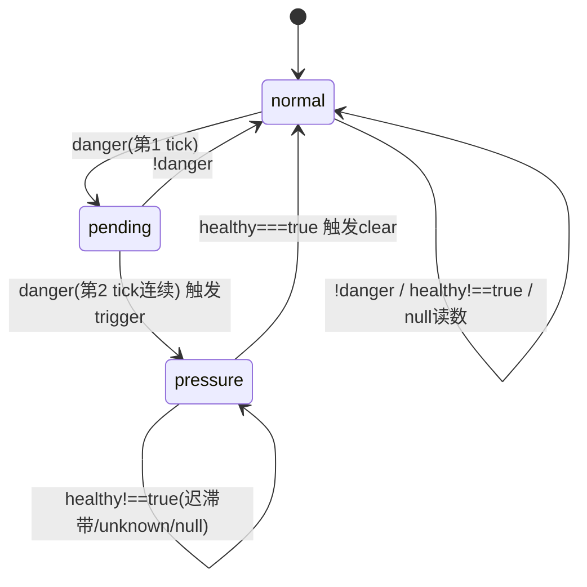

# FLY-1142 swap-sensor 改看真实内存压力 — 实施计划

Issue: FLY-1142 (https://linear.app/geoforge3d/issue/FLY-1142/fix-swap-sensor-改看真实内存压力-freepercent-swapout-delta弃用只涨不缩的-swap-水位-根治)
日期: 2026-07-10
基于: exploration.md, research.md

---

## 0. 决策记录

**brainstorm gate(Tadashi 已批,comm msg 90682b41 @22:27)**:
1. `--bridge-only` **本单一起做**(env-reload 缺口,同族一次做完)。
2. **OR 触发 / AND 解除 / 2-tick 迟滞**。两个新信号都非单调(free% 会回升、swapout-delta 会归零)。**验收场景②(压力解除→hold 自动清)必须真机过、不许假绿。**
3. `SwapPressureMonitor`→`MemoryPressureMonitor` 重命名;durable 行 `set_by="swap-sensor"` **不动**;rename 前 **grep 全仓**确认无残留旧类名。
4. 撤 `.env` stopgap 三行由 **implement/ship** 在 fix 真上线后做;design **绝不碰生产 .env**。

**Codex design review R1(全 6 项已纳入)+ R2(4 项精确性已纳入,本 v3)**:R2 = ①三序列采样时序 + healthy truth table 消歧;②`--bridge-only` 变量初始化 / idle-wait guard(set -u);③swapout 分支 soak 校准 + SWAPOUT_MIN validator 独立;④no-sysctl 用无 override command-selection 单测 + 影响清单纠正(flywheel-restart-guard.py / FLY-915 prd)。

## 1. 目标

fleet 内存传感器从「只涨不缩的 swap 水位」切到「真实内存压力(free% + swapout-delta)」:真危险才置 `pressure-hold`,**在有证据证明健康时**才自动解除;stranded hold(含重启后)只在真实压力**被证明**健康时清掉——解除侧绝不 fail-open。撤 stopgap 拐棍,补 sanctioned 纯 env-reload 重启路径。

## 2. 阈值参数(写死默认值 + 依据 + provisional 校准)

实测基线(本机 48GiB,2026-07-10;含 Codex R1 `vm_stat -c 2 30` 采样):**健康 41–50% free / 正常高负载 21–22% / 真 OOM thrash 崩到个位数**。

| env | 默认 | 校验域 | 语义 / 依据 |
|-----|------|--------|------|
| `FLYWHEEL_MEM_FREE_LOW_PCT` | **8** | 百分比 validator(0<v≤100;0/负/NaN/>100 → default) | freePct < 8 → danger。远低于正常负载(21–22%)不误触发;OOM 个位数被抓 |
| `FLYWHEEL_MEM_FREE_HIGH_PCT` | **15** | 百分比 validator | freePct ≥ 15 且 delta 已证明 ≤ MIN → healthy。7pt 迟滞带;低于正常负载,恢复即可解除 |
| `FLYWHEEL_MEM_SWAPOUT_MIN_PAGES` | **0** | **独立 validator:non-negative finite integer(接受 0 与 >100),不复用百分比 validator** | delta > MIN → danger 维度。**语义 = 相邻两个 watchdog tick(≈30s,plugin.ts:6471/6524)间 Swapouts 增量页数**。调噪值完全可能 >100,不得被百分比校验判回 default |
| (确认迟滞) | **2 tick** | — | danger 连续 2 tick 才 trigger(FLY-1048) |

- **8/15 为 provisional default**。ship gate/验收用受控 soak 校准 **两条 OR 分支**(见 §6-4):记录完整 `{timestamp, freePct, swapoutDelta, danger}`,断言正常代表窗口**既没有连续 free<LOW、也没有连续 swapoutDelta>MIN**,最终无 trigger/hold;若正常峰值下出现连续低量 swapout,先用观测分布调 MIN 再 ship(不硬 ship 0)。
- `FREE_LOW ≥ FREE_HIGH` 误配 → clamp `FREE_LOW = FREE_HIGH`。
- 旧 `FLYWHEEL_SWAP_PRESSURE_HIGH/LOW_PCT` **不再读**。

## 3. 三态 health 状态机(新 `MemoryPressureMonitor`)——解除侧不 fail-open

**核心不变量**:解除 / lift / resolve 只在 `healthy === true`。首样本 / 计数器回退 → `swapoutDelta = null(unknown)`、`healthy = null`;unknown 可依据低 free% 累积 danger,但**永不** clear/lift/resolve。

**Truth table(唯一,消 R2-1 歧义)**——设 delta = 本 tick swapoutDelta:

| 条件 | danger | healthy |
|------|--------|---------|
| delta == null (首样本/回退) | `freePct != null && freePct < LOW` | **null** (无证据) |
| delta != null && freePct >= HIGH && delta <= MIN | false | **true** |
| delta != null && (freePct < LOW \|\| delta > MIN) | **true** | false |
| delta != null && LOW ≤ freePct < HIGH && delta ≤ MIN (迟滞带) | false | false |

- `danger = (freePct != null && freePct < LOW) || (delta != null && delta > MIN)`。
- `healthy = null` 当 `delta == null`;否则 `= (freePct != null && freePct >= HIGH && delta <= MIN)`。
- `null` 读数(parse 失败)→ danger=false、healthy=null、保持状态。
- **resolve/lift/clear 仅 `healthy===true`**;`null`(无证据)与 `false`(有证据但不健康)都不解除,但**测试期望须区分**这两态。



> **无 `consecutiveHealthy` 状态**:recovery = 「第一个能算出 delta 且 `healthy===true` 的样本即 clear/lift」。restart 场景「第二个样本才 lift」是 baseline 机制的自然结果(首样本 delta=unknown),非额外的双-healthy-tick 要求。

## 4. 逐文件改动

### 4.1 `packages/teamlead/src/bridge/machine-watermark.ts`(重写核心)

```ts
export interface MemoryPressure {   // 业务必需字段 non-null
  freePct: number;            // (free+inactive)/Σ七bucket * 100;纯页数比,page-size 免疫
  swapoutsTotal: number;      // vm_stat 累计 Swapouts
  pageSize: number | null;    // 仅诊断;freePct 不依赖它
}
export function parseVmStat(out: string): MemoryPressure | null { ... }
// 七 bucket(free/active/inactive/speculative/throttled/wired/compressor)+ Swapouts 全部 finite & 非负、分母>0,否则整读数 null。
export async function readMemoryPressure(env = process.env): Promise<MemoryPressure | null> { ... }
// FLYWHEEL_SWAP_SENSOR_CMD 覆盖 → vm_stat 替身;否则 execFile("vm_stat")。任何失败 → null。

export function memPressureThresholdsFromEnv(env = process.env): {
  freeLowPct: number; freeHighPct: number; swapoutMinPages: number;
} { ... }
// freeLow/freeHigh 走百分比 validator(0<v≤100 否则 default)+ FREE_LOW≥FREE_HIGH clamp;
// swapoutMinPages 走【独立】validator:Number.isInteger && >=0 && isFinite(接受 0 与 >100),否则 default 0。

export interface MemoryEvaluation {
  event: "none" | "trigger" | "clear";
  freePct: number | null;
  swapoutDelta: number | null;   // null = unknown
  danger: boolean;
  healthy: boolean | null;       // truth table §3
  inPressure: boolean;
}
export class MemoryPressureMonitor {
  private lastSwapoutsTotal: number | null = null;   // monitor 独占 baseline
  private lastEval: MemoryEvaluation | null = null;
  constructor(thresholds, confirmTicks = 2) {}
  get inPressure(): boolean; get episodeStart(): number | null;
  get lastEvaluation(): MemoryEvaluation | null;      // recoveryProbe 用
  tick(p: MemoryPressure | null | undefined, nowMs: number): MemoryEvaluation;
}
```

- **删** `SwapUsage`/`parseVmSwapUsage`/`readSwapUsage`/`swapThresholdsFromEnv`/`SwapPressureMonitor`;rename 前 **grep 全仓**确认零残留再删。
- `FLYWHEEL_SWAP_SENSOR_CMD` seam 保留,注入内容 vm.swapusage → **vm_stat**。

### 4.2 `packages/teamlead/src/bridge/fleet-sensors.ts`

- `swapMonitor`→`memMonitor`;`readSwap`dep→`readPressure`(默认 `readMemoryPressure(env)`);`lastSwapUsage`→`lastPressure`;`lastWatermark` 报 `${freePct.toFixed(1)}% free`。
- `swapTick()`:`const ev = memMonitor.tick(p, now)`,下游全消费 `ev`:
  - `trigger` → alert(文案 memory pressure/free%/active swapout;机器标识符 `swap_pressure_high`/`leadId="swap"`/`set_by="swap-sensor"` 不变)。
  - `clear` → liftSensorHold + resolve。
  - **restart-safety lift**:out-of-pressure 时仅 `ev.healthy===true` 才 lift;`null`/`false` 不 lift。
  - `swapPressureRepair()` watermark 取 `lastPressure.freePct`;文案 memory pressure。
- `recoveryProbe("swap_pressure_high")` = `memMonitor.lastEvaluation?.healthy ?? null`(null/false/true 三态;不再 `!inPressure`)。

### 4.3 `scripts/restart-services.sh`(`--bridge-only` 独立第三分支,含 set -u 变量初始化)

- **arg 解析**(403-409)加 `--bridge-only) BRIDGE_ONLY=true; shift ;;`;顶部 `BRIDGE_ONLY=false`;usage 补一行。
- **所有 mode/impact flags 在 guard 之前初始化默认值**(`PLUGIN_ONLY_RESTART=false`、`restart_bridge=false`、`restart_all_leads=false`、`need_install=false` 等)——否则 `set -u` 下 bridge-only 跳过 438-576 的初始化后,会在 idle-wait guard(**643 行** `[[ "$PLUGIN_ONLY_RESTART" != "true" && "$restart_bridge" == "true" ... ]]`)因 unbound variable 退出。
- **guard(BRIDGE_ONLY=true 时)** 跳过:plugin fork/update、project `.lead/` SHA scan(438-459)、Deployed-SHA gate + classify_changes(465-576)。
- **643 行普通 deploy idle-wait guard 加 `BRIDGE_ONLY != true`**(或移入 normal-deploy 分支);bridge-only 只在自己的独立分支调一次 `wait_for_idle`。
- **Main(所有函数定义完成后)独立第三分支**:`[[ BRIDGE_ONLY ]]` → `--dry-run` **在任何 service/deploy state 副作用前退出** → (optional) wait_for_idle → `stop_bridge` → `start_bridge` → 现有同等强度 health check → exit;**不** build / git rollback / do_restart_all_leads / deploy 通知 / 清 plugin marker / 写任一 deployed-sha;不复用 `deploy_and_verify()`。
- (dry-run 只声称「无 deploy/service state 副作用」;参数前 mktemp、参数后互斥锁等可清理协调副作用不声称为零。)

### 4.4 重命名 / seam 影响面(机器标识符保留,人类文本统一 memory pressure/free%/active swapout)

- `plugin.ts:3012-3016` admission detail;`server-loss.ts:250-267`(+`server-loss.test.ts`)watermark 拼接;`fleet-sensors.ts:186-218` swapPressureRepair 幂等回报 / Lead 降载 / 结果文案。
- **`scripts/qa-fly-1082-fleet-alerts-e2e.mjs:152-155,288-340`**:同一 seam 注入格式 vm.swapusage → **vm_stat**;scar 场景两个相同大累计 Swapouts + 预置旧 durable `swap-sensor` hold(§3/§6 第二样本解除)。
- PRD **`product/doc/FLY-915-infra-alerts-pipeline/prd.md`** 与代码注释(现行为合同)同步。

### 4.5 `~/.flywheel/.env`(**ship 阶段**,非 design/implement)

fix 上线后删三行 stopgap(134-136)+ `restart-services.sh --bridge-only`。design/implement 不碰生产 .env。

## 5. 测试计划(TDD RED→GREEN)

### 5.1 `__tests__/machine-watermark.test.ts`(重写)
- `parseVmStat`:16384-header 样本 → 正确;七 bucket / Swapouts 任一缺失/非有限/负、分母 0 → 整读数 null;page-size 陷阱回归(「误用 4096 会算错」样本)。
- 阈值:freeLow/freeHigh 百分比 validator + clamp + 边界 7.999/8/14.999/15 + 非法 0/负/NaN/>100 回落;**SWAPOUT_MIN 独立 validator:0 与 >100 均合法保留、负/非整数/NaN → default**。
- `MemoryPressureMonitor.tick` 按 §3 truth table:free-low 2-tick 触发;swapout 首样本 delta=null 建 baseline 不 clear/lift;OR 两支路单独;AND 解除(含 delta=unknown → healthy=null 不 clear);迟滞带 healthy=false 不 clear;null 读数 healthy=null;`lastEvaluation` 反映三态;**null vs false 测试期望区分**。

### 5.2 `__tests__/fleet-sensors.test.ts`(更新)
- swapTick trigger/clear;restart-safety lift 三态(首样本 healthy=null 不 lift / 第二静止样本 healthy=true lift / delta>0 不 lift / 首样本低 free 不 resolve / null 不 lift / manual hold 永不 lift);recoveryProbe null/false/true;文案 memory pressure。

### 5.3 no-sysctl 依赖证明(R2-4,不靠 override E2E)
- **无 override command-selection 单测**:mock/spy `execFile`(或 PATH 放记录调用的 vm_stat/sysctl stub),断言 `readMemoryPressure({})`(空 env)**只执行 vm_stat、从不执行 `sysctl vm.swapusage`**——这才证伪根因依赖(override E2E 里旧代码本就不调 sysctl,无法证伪)。
- **production-source grep sentinel**:断言生产源码不再出现 `vm.swapusage` / 旧 `readSwapUsage` 符号(防回流)。

### 5.4 shell / E2E
- `scripts/hooks/test-flywheel-restart-guard.py`(allowlist 测试,allowlist 定义在 `scripts/hooks/flywheel-restart-guard.py`)加 `--bridge-only`(+`--dry-run`)合法命令形态。
- `scripts/test-restart-services.sh`(已存在 62 项)加 hermetic 断言,覆盖**真实顶层执行顺序**:SHA match/mismatch、plugin/project pending、bridge-only 时 Lead 调用=0 / build 调用=0 / 两 SHA 文件不变 / 不发 deploy 通知 / dry-run 副作用前退出 / set -u 下不因 unbound var 退出。
- `server-loss.test.ts` watermark 文案 free%。
- `scripts/qa-fly-1082-fleet-alerts-e2e.mjs` seam→vm_stat + scar(两大 Swapouts + 预置旧 hold 第二样本解除)。

## 6. 验收(真机,implement 阶段;Tadashi「不许假绿」+ Codex R1/R2)

`FLYWHEEL_SWAP_SENSOR_CMD` 注入假 vm_stat。**三条精确序列(R2-1)**:

1. **① trigger 两支路**:(a) **fresh swapout-only** = baseline 样本(delta=unknown,不触发)+ 两个递增 Swapouts 样本(连续 2 danger delta)→ **共 3 样本**置 hold;(a') **free-low** = 首样本即 freePct<8 → 2 样本(2-tick)置 hold。两支路各证一次。
2. **② 同进程 pressure→recovery(立即 clear)**:已有压力样本 baseline;下一样本 freePct≥15 且 Swapouts 与上样本相同 → 当场 delta=0、healthy=true → **立即 clear** + resolve(不需第二恢复样本)。**Tadashi 硬保证,真机不许假绿。**
3. **③ restart/counter-reset stranded hold(第二样本才 lift)**:预置旧 `swap-sensor` hold + fresh monitor;首样本(delta=unknown,healthy=null)**不 lift**;第二个静止样本(delta 可算、healthy=true)才 lift。manual hold 永不 lift。
4. **③′ scar 运行时无 sysctl 依赖**:E2E 输入 healthy free% + 高但**静止**累计 Swapouts → 两 tick 无新 hold(此断言由 E2E 承担);**「不调 sysctl」由 §5.3 无 override 单测承担,不压在 override E2E 上**。
5. **provisional 校准(两支路)**:受控高并发 soak 记录 `{ts,freePct,swapoutDelta,danger}`,断言正常代表窗口无连续 free<LOW **且** 无连续 delta>MIN、无 trigger;注入快速下降证明两 tick 确认来得及。
6. `pnpm -C packages/teamlead test` + 全仓 `pnpm test` + `pnpm lint` 全绿;`bash scripts/test-restart-services.sh` + restart-guard 测试全过。
7. `restart-services.sh --bridge-only --dry-run` 正确;真跑验证 Bridge 原地重启、Lead 未动、两 SHA 文件未变。
8. **Codex xhigh** code review APPROVED。

## 7. 实施顺序(TDD)

1. RED:machine-watermark.test.ts(parseVmStat 收紧 + 阈值双 validator + 三态 monitor truth table)→ 全红。
2. GREEN:machine-watermark.ts。
3. no-sysctl command-selection 单测(mock execFile)+ grep sentinel。
4. RED→GREEN:fleet-sensors.test.ts(evaluation + restart-safety 三态 + recoveryProbe)→ fleet-sensors.ts。
5. 文案/影响面:plugin.ts / server-loss.ts(+test)/ swapPressureRepair / qa-fly-1082 seam / FLY-915 prd。
6. dead-code:grep 全仓旧 Swap* 零残留后删。
7. restart-services.sh `--bridge-only`(变量初始化 + idle-wait guard + 第三分支)+ test-restart-services.sh + flywheel-restart-guard.py 测试。
8. 全仓 test + lint;真机三序列 + 两支路 soak 校准验收;Codex xhigh。
9. (ship 阶段)撤 .env stopgap + `--bridge-only` 重启。

## 8. 风险 / 兼容性 / 回滚

- **兼容性**:机器标识符、schema、ARC wiring、kill switch 全不变 → durable 行 + 工单去重跨重启稳定;stranded 旧疤在**证明健康**后清。
- **解除侧安全(核心)**:三态 health 保证「无证据不解除」——重启恰逢 thrash 时不因首样本瞬时 free% 高而误放开准入。代价:stranded lift 最多多等一个 30s tick。
- **误报**:FREE_LOW=8 保守 + soak 校准两支路(含 swapout 低量持续);阈值全 env、SWAPOUT_MIN 可调噪。
- **kill-switch**:`FLYWHEEL_FLEET_SENSOR_SWAP=0`(不变)。
- **回滚**:`git revert` PR + `--bridge-only` 回旧行为(需恢复 stopgap,回滚说明写明)。

## 9. 影响文件清单

| 文件 | 改动 |
|------|------|
| `packages/teamlead/src/bridge/machine-watermark.ts` | 重写:vm_stat 信号 + 三态 MemoryPressureMonitor + MemoryEvaluation + 双 validator |
| `packages/teamlead/src/bridge/fleet-sensors.ts` | evaluation 消费 + restart-safety 三态 lift + recoveryProbe 三态 + 文案 |
| `packages/teamlead/src/bridge/plugin.ts` | admission detail probe 文案 |
| `packages/teamlead/src/bridge/server-loss.ts` | watermark 拼接文案(free%) |
| `packages/teamlead/src/bridge/__tests__/machine-watermark.test.ts` | 重写 + no-override command-selection 单测 |
| `packages/teamlead/src/bridge/__tests__/fleet-sensors.test.ts` | 更新 |
| `packages/teamlead/src/bridge/__tests__/server-loss.test.ts` | watermark 文案断言 |
| (grep sentinel) | 生产源码不含 `vm.swapusage`/旧 readSwapUsage(测试断言) |
| `scripts/restart-services.sh` | `--bridge-only` 变量初始化 + idle-wait guard + 独立第三分支 |
| `scripts/test-restart-services.sh` | bridge-only hermetic 断言(真实顶层顺序) |
| `scripts/hooks/flywheel-restart-guard.py` + `scripts/hooks/test-flywheel-restart-guard.py` | allowlist 加 `--bridge-only` + 测试 |
| `scripts/qa-fly-1082-fleet-alerts-e2e.mjs` | seam 改 vm_stat + scar 场景 |
| `product/doc/FLY-915-infra-alerts-pipeline/prd.md` | 现行为合同文案同步 |
| `~/.flywheel/.env` | (ship 阶段)撤 stopgap 三行 |
