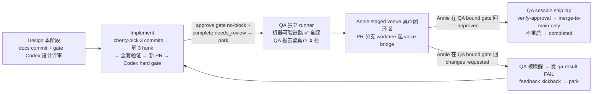

# FLY-1159 /gemini-advanced 语音接线（route A）— 实施计划

Issue: FLY-1159 (https://linear.app/geoforge3d/issue/FLY-1159/voiceb-gemini-advanced-语音接线route-a-delegate-挂-gemini-引擎)
日期: 2026-07-11
基于: research.md

> Brainstorm gate 已批（Tadashi,2026-07-11):理解一致 + 落地路径选 A + QA 能力
> 边界钉死（Gemini Live STT 灌不进合成音 → 真声闭环留 Annie 真机测）。
> 本计划 = implement / QA 两阶段的执行合同。**不重做实现**（handoff 红线),
> 行为合同冻结（exploration §2)。
> Codex design review R1 的 7 条 findings 已全部折入（gate 顺序 / QA 真实入口 /
> provenance 断言 / 文档入 PR / CI 合同 / 验收时点 / #548 fail-closed 关闭);
> R2 修正三段式 handoff 顺序与 ship owner(QA session = ship executor)。

## 0. 总览



**验收时点合同(R1 #6,选 (a)):机器 QA 全绿 → Annie 在 staged venue 做真声
闭环(voice-bridge 从 PR 分支 worktree 起,daemon 独立于 main,无需先 merge)→
founder 明确批准 → merge → completed。** merge 前完成真声验收,与 /gemini
(FLY-1065)的先例一致(Annie-accepted 后才 merge #535)。真声失败 = QA 发 FAIL
唤醒 implement:同一未合并 PR 上修 → 重跑 Codex(新 head)→ 重 QA → 再请真声。

**三段式生命周期合同(R2 #1,与 PhaseOrchestrator/Blueprint 实际实现对齐):**
- Implement 的 `gate approve_to_ship --no-block + complete --route needs_review
  --pr N --question-id Q` 是 **Implement→QA 的 handoff 触发器**,不是最终 ship:
  PhaseOrchestrator 只在收到 runner-bound `awaiting_review`(带真实
  review_question_id)后才 spawn QA(phase-orchestrator.ts:460-476, 897-916)。
  做完即 park。
- **QA session 是本管线的 ship executor**(Blueprint QA prompt 原文):QA PASS
  后由 QA session 发结构化 qa-result → 开**它自己的** final approve gate +
  complete needs_review → 等 founder 对该 bound question 批准 → verify-approval
  → merge。不复用 Implement 的 handoff question 当最终 ship authority。

三段式共享分支 = flywheel-FLY-1159。设计文档(exploration/research/plan/
evidence/progress)在 design 阶段收尾时已 commit 进本分支(R1 #4) —— implement
开跑第一步核对 `git status --porcelain` 干净、上述文件全部 tracked。

## 1. Implement 阶段步骤

### 1.1 前置同步 + 漂移检查(R1 #3)

```
git fetch origin main feat/fly1018-voice-delegate
PRE_PICK_HEAD=$(git rev-parse HEAD)          # 记录基点(rebase 后重新取)
git diff --name-status 6f151690..origin/main -- \
  packages/voice-bridge packages/voice-core packages/gemini-agent pnpm-lock.yaml
```

- 目标面(上述路径)自演练基线 6f151690 后**零变化** → 演练 patch 照抄有效,继续。
- 有任何变化 → **重跑 scratch 演练**(exploration §3.4 同法):重新 cherry-pick、
  重解冲突、重新记录 hunk 与测试基线,更新 evidence/ 后再继续。不得照抄旧 patch。
- 然后 `git rebase origin/main`(本分支只有设计文档 commit,预期干净),rebase 后
  重新取 `PRE_PICK_HEAD=$(git rev-parse HEAD)`。

### 1.2 cherry-pick(research §1 的 3 个 commit,按序)

```
git cherry-pick 0b6862df 285f2ac8 48d83fa1
```

预期:第 1 个停在 3 个冲突 hunk —— 解法照抄 evidence/cherry-pick-resolution.patch
(research §2 逐 hunk:全部两边都保,captions 在前 advanced 在后;cli.ts 两个
import 都留)。第 2、3 个零冲突。

禁止事项:解冲突时不得改动任何非冲突行;不得「顺手」重构。

**移植 provenance 校验(R1 #3,替换旧的错误 diff 断言):**

```
git range-diff c2370b81..48d83fa1 "$PRE_PICK_HEAD"..HEAD   # 三 commit patch 等价性(仅融合区差异)
git diff --name-status "$PRE_PICK_HEAD"..HEAD               # 本次 port 恰好 = research §1 的 8 文件
git diff --name-status origin/main...HEAD                   # 最终 PR scope = 8 文件 + 设计文档
```

### 1.3 验证闸(全过才允许开 PR;R1 #5 钉到真实 CI 合同)

快速闸(迭代用):

| # | 命令 | 通过标准 |
|---|------|----------|
| 1 | pnpm install --frozen-lockfile | 装得上。装不上先分类原因:只有 package manifest 确实要求时才重新 pnpm install 收敛 lock,且 lock diff 限定在本票依赖并人工审;其他原因 = 排障,不许拿重生成 lock 当万能解 |
| 2 | pnpm --filter flywheel-voice-core build && pnpm --filter flywheel-gemini-agent build && pnpm --filter flywheel-voice-bridge build | tsc 零错 |
| 3 | pnpm --filter flywheel-voice-bridge test | 演练基线(main=6f151690)= **336/336**。若 §1.1 检出漂移:先在干净 current-main tree 实跑记录新基线,port head 必须 = 新基线 + 14,实跑证明,不许口头调数 |

最终闸(与 .github/workflows/ci.yml 逐字对齐):

```
pnpm build && pnpm typecheck && pnpm lint && pnpm test:packages:run \
  && bash scripts/gemini-agent-guard.sh
```

(gemini-agent-guard 与「零新增权威面」合同直接相关,必跑。)
push 后:GitHub CI 对 QA 将要 pin 的**同一 head** 必须绿。

TDD 说明:14 个测试随移植同来(assistant-advanced.test.ts),它们就是本实现的
测试合同;无新代码 → 无新测试义务。若 Codex kickback 要求改码,按 RED→GREEN 补测。

### 1.4 开新 PR → Codex hard gate(R1 #1,顺序修正)

1. push 本分支;gh pr create,base = main,title 沿用 #548(带 FLY-1159)。
   PR body 必含:①「## Linear Issue」段(FLY-1159 + URL);② 与 #548 的关系声明
   (同一实现 cherry-pick 到 post-FLY-1160 main + 3 加性 hunk 融合,Codex R1/R2
   记录见 #548 链接);③ 测试计划(§1.3 两级闸 + QA 分栏说明)。
2. **立即** `flywheel-comm stage set pr_created` —— 这是 Bridge 注入 code-review
   instruction 的触发器(codex-instruction.ts:pr_created→"code")。不手工上报
   code_review stage(STAGE_ORDER 里 code_review 在 pr_created 之前,补报 =
   stage regression)。
3. 按 Bridge instruction 跑 /codex-code-review(persistent session;security
   扫描 → xhigh;codex-with-fallback 前台跑)。提法按 research §4:给足 #548
   两轮上下文,重点审融合区(config.ts/cli.ts)与 FLY-1160 共存语义。
4. kickback 循环:修 → 测(§1.3)→ 增量 re-review **审新 head**,直到 APPROVED。
5. APPROVED 后写 `.flywheel/runs/<exec-id>/codex/code-review.json`,schema:
   {executionId, reviewType:"code", status:"APPROVED", reviewedTarget:"<pr-url>",
   reviewedHeadSha:"<git rev-parse HEAD,40-hex>", timestamp, rounds, codexThreadId}。
6. `flywheel-comm await-codex-gate code --exec-id <exec-id>` 必须 exit 0(fail-
   closed 验 reviewedHeadSha === 当前 HEAD,并代报 Bridge)。head 若再变 → 旧
   result 失效,回到第 4 步。
7. **Implement→QA handoff(R2 #1):**gate 过后立即按注入的 APPROVE GATE 块执行
   `gate approve_to_ship --no-block`(捕 questionId)→ `complete --route
   needs_review --pr N --question-id Q` → **park 等 QA**。这是 QA spawn 的必要
   触发器;最终 ship 不归 implement session(见 §3)。

### 1.5 close #548(fail-closed,R1 #7)

前置(全部满足才动 #548):新 PR 存在且 base=main;新 PR head SHA == 本地已验证
SHA;新 PR body 已含 #548 反向链接。然后 `gh pr close 548 --comment`(指向新 PR,
说明 squash-merge 分叉 + 三段式管线对齐是改道原因),关后复查 #548 状态 = closed、
comment 在。任何一步失败 → **保持 #548 open**,报 Lead,不得先关旧审计入口。
QA pin 与 Codex hard gate 只绑新 PR/head。

### 1.6 head 纪律

PR 开出、QA pin 住 head 后不再 push(FLY-921/945)。若必须 push(kickback 修复):
新 head 重跑 §1.4 第 4-6 步(Codex 审新 head + 重写 code-review.json + 重过
await-codex-gate),再重做第 7 步 handoff(**新** gate --no-block + 新一发
complete --route needs_review,review 窗口重置),QA 重出 verdict,让 Bridge
重绑 ship gate。

## 2. QA 阶段(独立 runner;三段式自动 respawn)

### 2.1 报告分栏合同(gate 上钉死,不可含糊)

QA 报告必须两栏:**机器验了啥 ✅ / 等真声验啥 ⏳**。真声闭环未验不算 FAIL,是
声明的能力边界;但 ✅ 栏任何一条不过 = kickback。

### 2.2 机器可验清单 ✅(R1 #2,两层可执行入口)

> 背景:排除合成音后,没有外部 endpoint 能穿过 voice-bridge 触发 delegate_task
> (FLYWHEEL_GEMINI_AUTOSTART 只驱动 GeminiCommand.handle 开会;assistantWiring
> .createConversation override 会整个绕过 real factory)。因此 QA 分两层,各有
> 确切入口、观察点、超时与 teardown:

**层 (a) — 注入面(integration harness,进程内):**
用 967/1065 既有 harness 模式(qa-fly967-round5b-livechain.test.ts 同款进程内
组装)驱动 **real makeRealConversationFactory**,捕获传给 Live backend 的
extraTools:
- **双命令合同(founder 2026-07-11 更正,exploration §2 v2)**:
  - advanced 配置在 → /gemini 的会话 extraTools 恰好 = base 2(lookup_issue、
    board_snapshot)——**字节冻结**,plain 命令永不携带 delegate;
    /gemini-advanced 的会话 = base 2 + delegate_task(共 3 个,名字逐一核);
    两个命令都注册(slash + chat)。
  - advanced 缺席 → 只注册 /gemini,恰好 base 2(字节不变合同的注入面证明)。
  - 注意层级:「6 工具」指 delegate 内部 gemini-agent 的深层封闭 registry,
    不会展开进 Live extraTools(Codex R1 修正)。
- 半配置(有 advanced 段、缺 agent env)→ 断言 daemon 启动 fail-fast,报错含
  修复指引。
成功证据 = harness 输出存档进 QA 报告。

**层 (b) — 深链路面(真跑,进程外可观察):**
从 build 产物直接调用 exported `buildAdvancedDelegateTool(...)`,**不传
_test.runSession**(即真 runSession 路径),speak 用记录桩、sendText 用
TEST_BOT_TOKEN_1 真发测试频道;对 ~/.flywheel/gemini-agent-test 的隔离 scoped
Bridge 半区真跑:
1. handler 调用 → 即时返回 ACK(含任务 id)—— 断言 ACK 文案与口播合同一致。
2. 深任务 fire-and-forget 异步跑 → 以 completion sink + audit 记录为等待对象
   (超时上限 10 分钟,超时 = FAIL 并抓 audit 现场)。
3. 核对 QA R3 四条锚点:带 deptLabel(Ops-Test)建票 / 过 dept 闸 /
   query_status / 记忆落 shared bucket。
4. 完成通知双路径各自独立断言:speak 记录桩收到口播文案(轮换空窗场景下 speak
   桩置空仍必须看到 sendText 真送达 —— Codex R1 修复的回归验证);Discord 测试
   频道真收到完整文字落地。
5. teardown:测试票关闭/标记、venue 状态复原(venue-state.json 的 pid/端口不
   受扰动;半区常驻不拆)。

**环境纪律**:GEMINI_API_KEY 复用现 key、scoped token only(FLYWHEEL_GEMINI_
AGENT_BRIDGE_TOKEN)、deptLabel = Ops-Test、密钥不进 argv/日志(research §5.2)。
QA 前先做半区健康检查(venue-state.json pid 活、端口通),死了按其记录重建。

### 2.3 真声闭环 ⏳(Annie,merge 前;QA session 主持)

前置 = §2.2 机器栏全绿。**Annie 只测 /gemini-advanced**(她原话:「我没有打算
再测 Gemini」;/gemini 由字节冻结断言背书,不请她碰):对 /gemini-advanced 说
一句 → Gemini Live 真转写 → 口头「已受理」→ 异步深跑 → 完成口播 + 频道文字
落地。QA 报告给出 Annie 的 step-by-step 测试指引(先测干净纪律:✅ 栏全绿才
请她上);staged venue 从 PR 分支 worktree 起 voice-bridge。

**真声失败路径(R3 #1,与 PhaseOrchestrator feedback-kickback guard 对齐):**
此时 QA 已发过机器 PASS 并挂在自己的 final gate 上(awaiting_review)——
post-PASS 的裸 FAIL 会被状态机当 stray verdict 丢弃(phase-orchestrator.ts:
996-1021),gate 未回答时的 FAIL 也被拒(1033-1049)。所以失败**必须**走:
Annie 在 QA 的 bound final approve gate 上回 **changes requested**(不是旁路
消息、不是留 gate 不答)→ QA 被该 response 唤醒 → QA 不改码,发 qa-result
--status fail --summary「founder feedback kickback: <真声失败证据>」→ park →
PhaseOrchestrator 唤醒 implement 修复(修 → Codex 审新 head → 重 handoff →
重 QA)。**禁止 QA 在 bound gate 尚无 response 时先发 FAIL。**QA 的 gate 消息
与给 Annie 的指引里要写清这两个回复选项(approved / changes requested)。

## 3. Ship lap(**QA session 执行**,R2 #1;前置 = 机器 ✅ 全绿)

1. QA 机器栏全绿后发结构化 qa-result(真声栏标 ⏳),开**QA 自己的** final
   approve gate(--no-block,捕新 questionId;gate 消息附 Annie 真声测试指引 +
   staged venue 状态)→ complete --route needs_review --pr N --question-id。
2. Annie 在 staged venue 完成真声闭环后,在**这个 bound gate 上**二选一回复:
   **approved** → QA 醒来只认 verify-approval approved:true(绑定 QA 的
   questionId + 当前 pr head),绝不拿含糊消息当批准、绝不自 merge / 自 :cool:
   补点;**changes requested** → 走 §2.3 的 feedback kickback 路径(QA 发 FAIL
   → implement 修)。
3. merge-to-main-only,**不重启生产 Bridge**(Annie 拍的 voice wave 模式;生产
   projects.json 未配 advanced 段,merge 后行为字节不变)。
4. merge 后:landing signal 改写 merged + stage set completed(此刻 founder
   已真声验收过,completed 无未了前置)+ 归档纪律(本文件夹随 PR 已在 main)。

## 4. 明确不做

- 不重做/不重构实现;不碰 /glaw、/eleven、resident brain(FLY-1160 领地)。
- 不配生产 advanced 段、不建生产专属 bot(Tadashi 上线手续,不在本票)。
- 不新开 GEMINI_API_KEY;不动 gemini-agent 包本体(#518 已 merge 冻结)。

## 5. 回滚

merge 后发现问题:advanced 段是纯可选配置,生产未配 = 天然关断;代码级回滚 =
revert 单个 squash commit(全部改动局限 voice-bridge,无迁移/无状态)。
