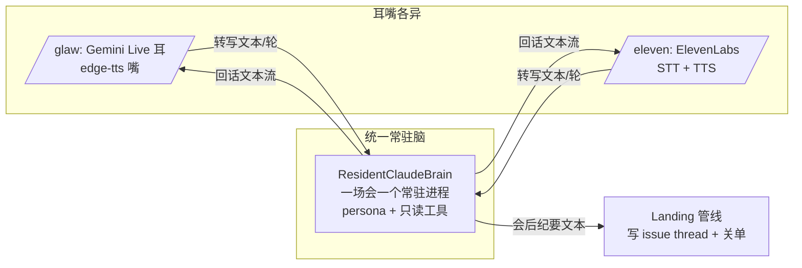

# FLY-1160 常驻 Claude Session 语音大脑 — 探索

Issue: FLY-1160 (https://linear.app/geoforge3d/issue/FLY-1160/voice架构-统一常驻-claude-session-大脑-每场对话一个持久-session仅-glaw-eleven-会后纪要落地)
日期: 2026-07-10
基于: 无

## 0. Scope 澄清（先说清楚，别做错方向）

派发词里 issue 标题写「跨 gem/glaw/eleven」，但 Linear 上标题在创建 2 分钟后已更新为
**「仅 /glaw + /eleven」**（2026-07-11 03:32，晚于派发词的快照）。描述正文仍提三个命令。

本设计按最新标题执行：

- **实现范围 = /glaw（FLY-545）+ /eleven（FLY-1006）**。
- 常驻大脑做成与消费者无关的组件（现有 BrainAdapter 契约的实现 + 生命周期扩展）。
  本次不动 /gemini 的任何行为。
- （gate 后 Lead 补充定性，2026-07-10）：/gemini 与 /gemini-advanced 背后**没有
  Claude 对话脑**——/gemini 纯 Gemini Live；/gemini-advanced 是 Gemini 对话脑 +
  深活异步委派，**不需要**持久对话 session。只有 /glaw、/eleven 是「别的当耳朵嘴
  + Claude 当对话脑」的形态，本架构只针对这两条。

## 1. 病灶取证（每个消费者的病不一样，但一个解）

### /eleven（FLY-1006 分支，未合并）— 纯种「每轮冷启动」

- 架构：ElevenLabs Agents 平台（STT/TTS/turn-taking 全在平台）→ cloudflared 隧道 →
  **shim**（OpenAI 兼容 /v1/chat/completions，engineering/spike/FLY-980-eleven/lib/shim-core.mjs）
  → HeadlessClaudeBrain。
- 病：shim 跑在 **FLY980_RESUME=0**（V8 教训：平台请求默认不带会话 id，resume 会两会话串味）→
  **每轮 fresh `claude -p` 进程 + 全量历史重注入 = 7-10s/轮**（voice-QA 实测，任务台账 #137）。
- 附带缺口：/eleven **没有立项 issue**（ElevenCommand 注释原话「GeminiCommand shape minus the
  kickoff issue」），也没有会后纪要落地。

### /glaw（FLY-545 分支，未合并）— 脑在 Gemini 手里，Gemini 连接层一断脑就没了

- 架构：每个参会 Lead 一条 Gemini Live line（Gemini = 耳 + **会话脑**），claude -p
  （ReadOnlyLeadBrain，--tools "Read,Grep,Glob"）只在 ask_lead 工具调用 + 会后 summary 时冷启动。
- 病（FLY-1158 真机取证，evidence/fly1158-evidence.txt）：Gemini Live 连接
  abort → socket 层 reconnect(resumed=true) 成功，但**会话层 ~7 分钟不恢复**（收音一直好、
  回话死寂、无 cue）；外加 4 次 turn-mouth backpressure。P0 = 连接脆弱 + 重连后会话不续。
- 结论：/glaw 的「回话」当前**寄生在 Gemini Live 的会话状态上**——连接一抖，脑就丢。
  Annie 的架构直令正是把「思考」从 Gemini 手里拿回来：Gemini 降级为纯耳朵。

### /gemini（已合并 main，本次不动）

- Gemini Live 原生（耳+嘴+脑），立项 issue + AssistantLanding 纪要落地都已存在。
- 纪要质量受限于「Gemini 口头 recap」；将来接常驻大脑可升级，但不在本次 scope。

## 2. Annie 直令的具象化（target 架构）

> 「把 gem、Claude(glaw)、Eleven 都改一下，它们背后都要有一个一直常驻的 Claude Session
> 专门负责思考，甚至最后整理会议笔记的也是这个 Claude Session。」

**每场语音对话 = 一个常驻 Claude Session，tied to 立项 issue**：



- **开会**：立项 issue 创建成功 → 立刻起常驻 session（后台暖着），首轮就是热的。
- **每轮**：耳朵产出转写文本 → 写进常驻 session 的 stdin（不再 spawn 进程）→ 流式回文本 → 嘴。
- **会后**：同一个 session 收「整理纪要」终轮 → 产出纪要 markdown → orchestrator 经既有
  Linear 管线写进该场 issue → 关单 → session 回收（进程必死，零孤儿）。

## 3. 常驻机制选型

| 选项 | 机制 | 优 | 劣 |
|------|------|----|----|
| **A. claude CLI 持久 stream-json 子进程** ⭐推荐 | `claude -p --input-format stream-json --output-format stream-json --include-partial-messages`，一场会一个子进程；每轮 = 往 stdin 写一条 user 消息，读流式 text_delta | 官方支持的常驻 headless 形态（本机 CLI 已带该 flag，已验证）；吃订阅、零新依赖；复用现有 stream-json 解析（HeadlessClaudeBrain 的 parseStreamLine 几乎原样）；persona/--append-system-prompt-file/--tools 白名单全部照旧 | 中断语义要 spike 验证（in-band interrupt vs kill+`--resume` 重生）；长会进程内存驻留 |
| B. Claude Agent SDK（@anthropic-ai/claude-agent-sdk） | SDK query() 流式会话 | 类型化 API | 新依赖；repo 全线是 CLI spawn 文化（claude-runner/HeadlessClaudeBrain）；底层同 CLI，没赚到新能力 |
| C. 现状改良：per-turn spawn + --resume 提速 | 保持每轮 spawn，只优化启动 | 改动最小 | **不根治**：进程 spin-up/teardown 生命周期乱正是 FLY-1158 病灶之一；Annie 直令明确「不再每轮 claude -p 冷启动」 |

**推荐 A**。B 记为 fallback（若 spike 发现 CLI 常驻模式有硬伤）。

## 4. 关键设计决策（带推荐）

### D1. session 归属粒度：一场会一个？还是一场会每 Lead 一个？

/glaw 支持多 Lead（每 Lead 一条 line、一个 persona）。「每场对话一个持久 session」直令的
对立面是「每轮一个进程」，不是「每 Lead 一个」。

- **推荐：一场会 × 一个参会 Lead persona = 一个常驻 session**（即 per-line）。
  典型会（1 Lead）= 1 个常驻进程；多 Lead 会 = N_leads 个。纪要由 **host Lead 的 session** 写
  （host = 记录者，PRD R9 既有语义）。/eleven 单 persona = 恒 1 个。
- 备选（一场会恒 1 个 session、多 persona 混一脑）：进程更省，但 persona 混装破坏
  identity.md 注入模型 + ask_lead 语义，multi-lead 会答非所persona。不推荐。

### D2. /eleven 的接入拓扑：脑放哪个进程？

shim 是「会话前置资产」（runbook 手起，不由 voice-bridge 拉起），但常驻脑的生命周期
（随 issue 创建/关闭）由 daemon 掌握。

- **推荐：daemon（voice-bridge）为唯一脑主**。shim 变薄：chat.completions 请求按
  conversation-id 转发到 daemon 本机回环控制口（localhost HTTP，token 门），daemon 内的
  ResidentBrainManager 出文本流。生命周期、watchdog、负载纪律、纪要、issue 全在一个 owner 手里
  （FLY-1148 孤儿进程泄漏的教训：谁 spawn 谁负责收尸——只让一个进程 spawn）。
- 备选（shim 自己持有 ResidentClaudeBrain 实例，library 复用）：零 IPC，但出现两个脑主，
  /eleven 的 issue+纪要还是要 daemon↔shim 联动，复杂度只是换了位置，孤儿风险×2。

### D3. /glaw 的 Gemini 角色收缩：耳朵化

- Gemini Live line 保留：**转写（user transcript）+ VAD/语义端点**（这是它最强的部分，
  也是「/glaw=Gemini耳」的本意）。
- **回话生成不再走 Gemini**：founder utterance 文本 → 常驻 Claude session → 文本流 →
  edge-tts → Lead bot 嘴播。Gemini 自己的 response 流被抑制/丢弃（研究阶段定：文本模态 +
  不触发生成，或丢弃其响应事件——取决于 Live API 是否允许「只转写不生成」的最小配置）。
- 直接收益：Gemini 连接 abort 只影响耳朵（已有 rejoin ~5.6s + FLY-545 F1/F2 的 cue 修复管），
  **脑不再随连接丢**——FLY-1158 P0 的结构性根治。
- ask_lead 工具随之消亡（脑本来就是 Claude，无需再「问 Lead」）；issue_status 等只读工具
  改由常驻 session 的只读工具面直接承担（它有 Read/Grep/Glob + 可控扩展）。

### D4. 纪要：谁生成、谁落地

- **生成 = 常驻 session 自己**（它有全场上下文在会话内，不需要 journal 重注入；journal
  snapshot 仍作为兜底注入材料保留——crash 后重生的 session 可能缺前段上下文）。
- **落地 = orchestrator（daemon）经既有管线**：/glaw 走 ConclusionPipeline（summary +
  worktree + 关单语义already there，只把「summary 生成」从 fresh claude -p 换成常驻 session 终轮）；
  /eleven 新增 kickoff issue（复用 GeminiCommand 的 createIssue 形态）+ 复用 AssistantLanding
  形态落纪要。
- **安全边界不动**：脑保持只读白名单（--tools "Read,Grep,Glob" --strict-mcp-config +
  cwd=projectRoot，FLY-545 D3 gate 裁定的结构性边界）。**写 Linear 的永远是 orchestrator，
  不是脑**——语音驱动的进程物理上没有写工具，「approve/ship/merge」说破天也只是文字。

### D5. 生命周期 + 故障语义（草案，plan 阶段细化）

```
issue 创建成功 ──► warmup(spawn + persona + 会议 preamble)   [assembling 窗口内完成]
      │
      ▼
live: respond(turn) × N ── 每轮 watchdog(brainMs) ──超时──► interrupt / kill+--resume 重生(≤2次/5min)
      │                                                        │ 重生失败 → TIV fail-loud + 降级(会继续,脑答不了)
      ▼
concluding ──► 终轮「整理纪要」──► landing(orchestrator 落 issue + 关单)
      │
      ▼
teardown: SIGTERM→SIGKILL,PID 登记 + 收尸校验(零孤儿,FLY-1148 教训)
```

- **crash 重生**：子进程 exit → 用捕获的 session_id `--resume` 重生（HeadlessClaudeBrain 已证
  该机制），in-flight 轮重发；有界重启（2 次/5min）后 fail-loud 到 TIV，绝不无声 7 分钟。
- **barge-in/中断**：spike 验证 stream-json 常驻模式的 in-band interrupt；不可用则
  kill+--resume（≈当前 per-turn 语义,但只在中断时付这个成本，不是每轮）。
- **并发/资源**：SessionSlot 已限 1 场会/次 → 常驻 session 数 = 参会 Lead 数（典型 1-2）。
  全局硬上限（如 4）+ 超限 fail-loud。空转成本 = 一个 idle node/claude 进程的内存驻留，
  无 API 消耗（不产 token 不计费）；本机近期 load 事故频发 → 上限保守 + 会后必收。

## 5. 与在飞分支的关系（重要：两条未合并分支是消费者）

- FLY-545（/glaw）与 FLY-1006（/eleven）都未合并。**本 issue 的实现无法只落 main**——
  它改的是这两条分支上的接线。策略（plan 阶段定死，先给推荐）：
  **常驻脑组件（voice-core ResidentClaudeBrain + manager）落 main（本 issue 的 PR），
  两个消费者的接线改动分别在 FLY-545 / FLY-1006 分支上继续**（「脑持久化并入本 issue，
  不重复造」——545/1006 不再各自造脑，等本组件合入后 rebase 接线）。
- FLY-545 的 F1/F2/F3（状态/音效/杂音）修复继续在 545，不搬。

## 6. 假设清单（gate 上请 Lead 逐条打勾/纠正）

1. Scope = 仅 /glaw + /eleven 实现；/gemini(-advanced) 只保证架构可接入（Linear 标题为准）。
2. 常驻机制走 claude CLI stream-json 子进程（选项 A），不引 Agent SDK 新依赖。
3. /glaw 多 Lead 会 = 每 Lead 一个常驻 session；纪要 host session 写。
4. daemon 是唯一脑主；/eleven shim 薄化为转发（D2 推荐）。
5. 脑保持只读工具白名单；Linear 写操作永远在 orchestrator。
6. 本 issue 的 PR 落 main（组件 + /eleven 已并入 main 的部分? 否——/eleven 全在分支），
   即:**组件落 main，两消费者接线落各自分支**（§5）。
7. 首轮延迟目标：常驻热轮 ≈ 模型 TTFT + TTS 首包（预期 2-4s vs 现状 7-10s）；
   spike 出实测数后在 plan 固化验收线。

## 7. Open questions（不阻塞探索，research/plan 收口）

- Q1: claude CLI stream-json 常驻模式的 in-band interrupt 是否可用？（spike）
- Q2: Gemini Live 能否配置「只转写不生成」？不能的话丢弃响应流的代价（配额/延迟）？（research）
- Q3: 常驻 session 的 context 增长：超长会（>1h）会话内 token 上限/自动 compact 行为？（research）
- Q4: /eleven 平台请求带 conversation-id 的辨识字段（FLY-1006 research 已验存在）→ daemon 回环口的会话路由键。（research 确认字段名）
