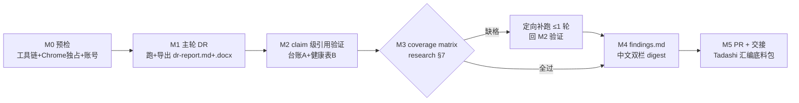

# FLY-1178 语音 Agent 生态 deep research — 实施计划

Issue: FLY-1178 (https://linear.app/geoforge3d/issue/FLY-1178/research-语音-agent-生态-deep-research-实时语音委派-agent-的行业形态记忆传递常驻取舍双视角技术形态)
日期: 2026-07-11
基于: exploration.md;research.md;dr-prompt.md

## 0. 总览

**Research 类 issue，零实现代码**。实现阶段 = 执行一轮真 cited ChatGPT Deep Research
（deep-research skill via claude-in-chrome）→ claim 级引用验证 → coverage matrix 判定
+ 至多 1 轮定向补跑 → 中文双栏 digest（findings.md）→ docs-only PR → 素材经 ask 交
Tadashi 汇编进 HL 四命令底料包。

**TDD 声明**：本 issue 无代码、无可执行产物，TDD 不适用。替代验证纪律 =
① claim 级引用验证（M2 台账，进正文的每条承重论断都有 exact source + 内容核验）；
② coverage matrix（M3，research.md §7 逐格判定）；③ findings 双栏完整性检查
（M4 验收清单）。每步验收写死在各里程碑内。

**设计已定决策**（brainstorm gate APPROVED 2026-07-11 + Codex design review 收敛，
不重开）：1 主跑 + ≤1 定向补跑；英文 prompt 沿 FLY-883 模板（dr-prompt.md 已定稿，
含 gate 加深的 Q5b + Q1 delta 化 + Q3 两轴）；FLY-883 已覆盖地带不重复；双栏由
findings.md 兜底；Runner 不自投 founder。

**命令形态约定**：下文所有 `flywheel-comm <子命令>` 均指以 Runner 提示词注入的
`node <commCliPath>` 开头的完整调用，flags 按各子命令自己的合同传（`ask`/`gate` 必带
`--lead` + `--exec-id`；`progress` 必带 `--exec-id` + `--file`；`stage`/`complete`
不接受 `--lead`）。**不要假设 bare `flywheel-comm` 在 PATH**；具体路径/id 以实现阶段
自己收到的提示词合同为准。

## 1. M0 预检（工具链 + Chrome 独占 + 账号）— 全部过了才许烧 DR

**先跑全链路工具预检（Codex R1 #2：别等 DR 跑完才发现 M5 不可执行）**：

1. **comm CLI**：`node <commCliPath> inbox --exec-id <execId>` 能跑通（顺带收指示）。
2. **GitHub**：`gh auth status` 必须有效（设计阶段 2026-07-11 实测本机默认账号
   token invalid —— 大概率要先修）；`git remote -v` 指向本仓、当前在
   flywheel-FLY-1178 分支。auth 失效 → 先 `flywheel-comm ask` Tadashi 协调恢复；
   无法恢复 → `complete --route blocked --summary "gh_auth_invalid"`，**不进 M1**。
3. **Chrome 独占仲裁**：`flywheel-comm ask` Tadashi：「FLY-1178 准备跑 DR，请确认
   当前无人占用 claude-in-chrome」—— **非阻塞**，ask 后每 ~2 分钟 `check <qid>`
   轮询；等待期间可先做 findings 骨架与验证脚本准备。**未拿到明确「空闲」答复
   不得进 M1**（Chrome 独占是硬纪律，此问例外于「无回复用 best judgment」——
   持续无回复 → 继续等/再 ask，最终等不到 = blocked，不抢跑）。Lead 已明示由他做
   slot 仲裁（潜在竞争者：545/#555 venue 的 Chrome-as-Annie QA）。
4. **浏览器自检**：ToolSearch 加载 claude-in-chrome 工具 →
   `list_connected_browsers`：**恰 1 个** connected browser；确认已登录 ChatGPT 且为
   付费计划（skill 步骤内含 headed 校验，headless = fail loud 停）。
5. 任一预检不满足且会话内解决不了（如需人工 pairing / 人工 gh 登录）→ ask Tadashi
   协调；彻底无解 → `complete --route blocked --summary "preflight_failed: <原因>"`。

**验收**：comm CLI 通 + `gh auth status` 有效 + Tadashi 明确放行 Chrome +
`list_connected_browsers` 恰 1 + ChatGPT 付费登录确认。

## 2. M1 主轮 DR 执行

1. 调 `deep-research` skill（Skill 工具），输入 = dr-prompt.md 代码块内 prompt
   **原文整体**（不改写、不删节）。
2. DR 若追加澄清问题：按 dr-prompt.md「澄清问题预案」回答；预案未覆盖的问题按
   exploration.md scope 边界现场判断（偏向「行业综述、非选型、不需代码」口径）。
3. 运行预算 5-30 分钟（FLY-883 实测 9 分钟）；期间不并行其他 Chrome 操作。
4. 导出走 skill 内建路径（原生 export：Copy contents + Word 引用解析 →
   assemble_report.py），产出 **dr-report.md**（报告原文 + resolved 引用 URL 清单），
   抬头补三行合同（Issue/日期/基于: dr-prompt.md）+ 执行记录（运行时刻、时长、
   citations/searches 数、会话 URL、账号计划）。**保留 .docx 原件**（存
   `evidence/` 子目录）—— assemble 产出的是平面去重 URL 列表，claim→URL 的精确
   对应要靠 .docx hyperlink relationships 恢复（M2 依赖它）。提交前对 .docx 做
   `unzip -t` + 文件大小 sanity + `docProps/core.xml` 元数据检查（确认未损坏、
   无账号/个人元数据泄漏）。
5. **导出层故障（iframe 不渲染 / 剪贴板空 / 菜单点不开）≠ 重跑研究**：研究会话
   已完成时，先在同一 conversation 按 skill 的恢复路径重试（菜单 re-open、坐标
   重读、clipboard sentinel、Export to Markdown fallback、重新绑定 .docx）；只有
   研究会话本身未完成/丢失才重新跑研究（整流程重试 1 次）。**技术性恢复重试不占
   M3 那 1 次内容补跑预算**。仍失败 → ask Tadashi 报告现象，不产出半份报告。

**验收**：dr-report.md 非空 + skill fail-closed 检查全过（sentinel 校验通过）+
来源列表非空 + 执行记录完整 + .docx 原件已归档。

## 3. M2 claim 级引用验证（不许编造 = 硬红线）

> 结构（Codex R1 #1）：**台账以 finding 为主键**，不是以 URL 为主键。skill 产出的
> 平面 URL 列表 ≠ claim→source 映射；精确对应从 .docx hyperlink relationships +
> 报告行文位置恢复。

1. **附录 A（claim 级证据台账）**：对**每一条准备进入 findings.md 的事实性/承重
   finding** 建行：`finding ID → exact 直达 URL(s) → 来源节/标题 → VERIFIED/
   UNVERIFIED → 备注`。逐条人工打开其 exact 来源比对：内容确实支持 = `VERIFIED`；
   定位不到精确来源 / 打不开 / 内容不支持 = `UNVERIFIED`。
2. **进正文规则**：只有 `VERIFIED` 论断能无标注进 findings 正文；`UNVERIFIED`
   一律降级进 §7 未验证清单（或删除），**绝不静默保留**。不逐句核验 DR 原文全文——
   但凡被提升进决策 digest 的证据必须核验。
3. **附录 B（全量 URL 健康表，独立附表）**：对 dr-report.md 全部 resolved URL 跑
   HTTP 检查（curl 跟随重定向，记录终态）：`OK`（2xx/3xx）/ `需人工开`（403/429
   反爬、paywall —— 标注不判死）/ `DEAD`（404/410/持续 5xx、域名不存在）。
4. Q5b 专项：确认 raft.build 种子被引用且转述准确（Agent Inbox / Held Draft /
   perception empathy / action explicitness 四术语不走样 —— 设计阶段已 fetch 核对）。

**验收**：附录 A 覆盖全部将进正文的承重 finding（每问 ≥1 条，全文 ≥5 条只是下限，
实际=正文全量）；附录 B 覆盖 100% resolved URL；无一条 UNVERIFIED/DEAD 支撑的论断
留在正文。

## 4. M3 coverage matrix 判定 + 定向补跑（≤1 轮）

1. 按 research.md §7 的 coverage matrix **逐格**判定（Q5a 与 Q5b 分开判；字数/引用
   数只作辅助信号）。
2. 有格子缺失 → 把**最大证据缺口组合**进**唯一一次**定向补跑 prompt（只带缺口
   问题 + context 摘要 + 已有发现清单「不要重复这些」），新 DR 会话跑（重过 M0.3
   Chrome 独占确认，产物并入 dr-report.md 分节标明第二轮，回 M2 验证）。
3. **至多 1 轮**。补跑后仍缺 → 缺口如实写进 findings §7 未验证清单，不硬凑、不再跑。

**验收**：逐格判定记录（过/缺+补跑/缺+承认）落 progress.md。

## 5. M4 findings.md（进底料包的正文）

按 research.md §6 模板写，中文，≤300 行：

1. §0 一页摘要（≤15 行，联席讨论可只读这节）；
2. §1-5 逐问 findings，每条带 finding ID + 双栏（**技术形态** / **产品体验含义**），
   引用 exact 链接；Q5b 每条加 `→ FLY-1179 设计输入` 标注（多 agent 同房间对话协调
   专单，含 raft.build prior art + 完整 scope，可直接引用；FLY-1168 DAG epic 仅为
   1179 的 consumer —— Lead 更正 441eeed8）；
3. §6 四条线启示映射（/eleven /gemini /gemini-advanced /glaw × 留/深挖/体验/技术）——
   **只给证据与 options，不替联席拍板**；
4. §7 未验证清单；附录 A claim 台账；附录 B URL 健康表。

**验收清单**（全过才算 M4 完）：5 问全覆盖；每条 finding 双栏齐全且 **finding ID 在
附录 A 有 exact verified source**；Q5b 有 FLY-1179 标注；§6 四条线各有 ≥1 条映射；
附录 A/B 齐；无未标注的编造/死链引用。

## 6. M5 PR + 交接

1. 提交全部文档（exploration/research/dr-prompt/dr-report/findings/progress +
   design-review 记录 + evidence/.docx）→ push → **docs-only PR**（英文描述，含
   Linear issue 链接、test plan = 本计划的验证纪律说明）。
2. `node <commCliPath> stage set pr_created` → 按项目纪律走 Codex code review
   （docs PR 预期轻量）。
3. approve gate 按实现阶段提示词注入的完整命令执行：`gate approve_to_ship --lead
   <leadId> --exec-id <execId> --no-block "<PR url>"` 捕获 questionId →
   `complete --route needs_review --pr <NUMBER> --question-id <questionId>` →
   等 wake → `verify-approval --exec-id <execId> --pr-head $(git rev-parse HEAD)`
   只认 "approved": true。
4. **交接 Tadashi**（founder 物料 Lead-only delivery 铁律）：`flywheel-comm ask
   --report` 给 findings.md 路径 + §0 摘要 + 「Q5b = FLY-1179 设计输入」提醒；由
   Tadashi 汇编进 HL 四命令底料包（hosted HTML 归他，Runner 不 publish、不发
   founder）。

**验收**：PR 开出 + review 请求已绑定（questionId 已 complete 上报）+ Tadashi 收到
--report（含 findings 路径）。

## 7. 风险与应对

| 风险 | 应对 |
|------|------|
| gh auth 失效（设计阶段实测 invalid） | M0.2 预检先修/协调；修不好 blocked，绝不 DR 跑完才发现推不上去 |
| Chrome 被占/等不到放行 | M0.3 排队纪律 + Lead 仲裁；最终 blocked 路线，不抢跑 |
| ChatGPT quota 不足 / 掉到 Free | M0.4 预检确认；跑中撞限 → ask Tadashi（他可协调账号），不硬试 |
| 导出层故障 | M1.5：同 conversation 恢复路径优先，不烧研究重跑；技术恢复不占内容补跑预算 |
| DR 半途失败/会话丢失 | 整流程重试 1 次；再败 ask Tadashi。绝不产出半份报告 |
| DR 编造引用 / 引用不支持论断 | M2 claim 级台账：UNVERIFIED 降级 §7，正文零未核验承重论断 |
| 某问/某格覆盖缺失 | M3 coverage matrix + ≤1 轮定向补跑；仍缺如实报，不硬凑 |
| 双栏格式不被 DR 遵守 | findings.md 兜底重排（设计已定 D3） |
| Q4「市场空白」拿不到干净结论 | prompt 已转成邻近案例扫描；按 crowded/adjacent/blank 三档如实给 |

## 8. 交付边界（scope 合同）

- 改动仅限 `engineering/doc/FLY-1178-voice-agent-ecosystem/`；**不碰 packages/、
  不动四条线任何代码与行为**。
- 不重复 FLY-883 已覆盖地带；不替联席讨论拍「线的去留」；不自投 founder 物料。
- progress.md 每里程碑后更新（`node <commCliPath> progress --exec-id <execId>
  --file engineering/doc/FLY-1178-voice-agent-ecosystem/progress.md --phase
  implement --cursor <M>/6 --next "<下一步>"`），断点可续。
