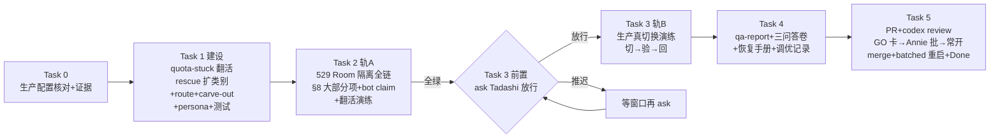

# FLY-1182 Claude 账号 quota 自动切换点火 — 实施计划

Issue: FLY-1182 (https://linear.app/geoforge3d/issue/FLY-1182/enable-claude-账号-quota-自动切换点火-开关配置-fly-696-8-真机-qa-go-卡-常开)
日期: 2026-07-11（初版）· 2026-07-15（Rev 2 —— 交付对象重定向 FLY-1256 daemon）· 2026-07-16（Rev 3 —— 事故驱动增补：脚本面身份核验 + 池子重建前置）
基于: research.md §R + exploration.md §R（Rev 2）；初版基于 research.md §1-§N；Rev 3 基于 evidence/incident-2026-07-16-keychain-drift.md

> **Rev 2（2026-07-15，第二次 design phase）**：FLY-1256 体外 quota-monitor daemon 已
> merge 并 retire 旧 Bridge 切换面 → 本计划整体重写，初版计划（本文件后半，标 SUPERSEDED）
> 只作历史。brainstorm gate 批复（Tadashi）：**决策1=B 分段**（A 段点火已于 2026-07-15
> 23:07 PDT 窗内执行完毕；B 段=模型级识别移植进 daemon，同单继续，**GO 卡在 B 完成后才开**，
> 绝不拆 follow-up issue）+ **Annie 两条硬验收**（受影响清单准确 + 5-10min 复确认）写进
> QA 段；**决策2=关 #562 留档 + 删/重建远端分支后才 push**。

---

## Rev 2 · 全局

**Goal**：① A 段点火（✅ 已完成，Task 0 存证）；② B 段 —— 把 PR #562 已验证的模型级
封顶识别资产移植进 FLY-1256 daemon（detect → switch → revive 一条链），补上 founder
实锤①的盲区；③ 受影响清单 + 复确认（Annie 两条硬验收的产品面）；④ 隔离真机 QA →
PR + Codex code review → founder 窗生产演练（候选部署事务）；⑤ qa-report/三问答卷/
恢复手册按新架构刷新；⑥ GO 卡 → Annie 批准 = 常开；⑦ 收尾。

> **Rev 2.1（Codex design review R1 全 12 项采纳后重写）**。R1 的 8 个 BLOCKER 全部
> 属实：调度时钟、managed-pane 资格、typed model trigger、bench 两层、账号权威、
> AffectedPane/durable outbox、state 迁移与 crash 窗、Task 3 部署与切回事务。
>
> **Rev 2.2（2026-07-16，cross-family design review R2）**：补齐旧生产 config 的
> optional-default 兼容、把移植来源固定到不可变 SHA、明确 per-model TTL、控制环真实的
> cadence-starvation 问题、alert kind 全部枚举面，以及 founder-facing「下一次重试」口径。
>
> **Rev 2.3（2026-07-16，cross-family design review R3）**：给 model switch 的 revive
> epoch 补上有限授权边界，并把 usage blind 下「新检测不 act」与「已打开 epoch 继续
> revive」拆成不冲突的两条合同。
>
> **Rev 3（2026-07-16，第三次 design phase，事故驱动）**：当日 ~10:00–10:17 PDT keychain
> 静默漂移事故取证实锤【账号池凭据文件交叉污染 + 全链零 token→身份核验】（完整证据链
> = evidence/incident-2026-07-16-keychain-drift.md）。brainstorm gate 批复（Tadashi）：
> **A=按面切**（本单拿 bash/脚本面 + 点火流程 = Task 7/8 + R3-G/R3-A；FLY-1252 拿 TS
> daemon 运行时面 = switchAccount 内 switch-verify 身份断言 + 每 tick keychain 身份漂移
> 侦测 + 通知路由表，两边引用契约不重建，取证已喂 1252 runner 9575adef）+
> **B=docs commit 并 push**（head 漂移接受，ship-prep 做 docs-only 增量 re-review，
> FLY-1307 先例）+ **纠正：独立 QA 段至今未跑**（Annie 点破）→ 列入 R3-G 硬前提。

**红线（贯穿）**：绝不弄坏 claude 登录（flywheel-claude-profile verify-before-commit +
回滚 + flock，daemon 复用不改）；不打断在飞 runner；**选择题 pane 绝不自动按键**；
unknown 三态语义 = 不动它但不沉默；**非受管 pane 绝不触发切换**（managed-pane 资格
先于 parser，Task 1.3）。

**For implement runner**：TDD；每 Task 完成跑 flywheel-comm progress；证据落 evidence/
（taskN-*，敏感值 redacted）；负载预检 uptime；消息不用反引号；生产演练前 ask Tadashi。

## Rev 2 · Task 0 — A 段点火（✅ 2026-07-15 23:07 PDT 已完成，存证）

- 主仓 pnpm install + 定向 build teamlead 链（全量 -r build 在 voice-bridge 失败 =
  #555 既有问题，已报 Tadashi）。
- 台账补登记 personal1（setup fail-closed 拒 → claude-accounts.lock 下 jq 原子补条目）。
- FLYWHEEL_QUOTA_RESTART_BIN=/usr/bin/true 延后 Bridge 重启到 unified restart（Tadashi
  批复）→ setup 成功：daemon healthy（pid 10747，errorStreak=0），usage 读到
  （label=personal1 five_h=37 seven_d=8），CUTOVER=1 已写，config
  order=[shopping,school,business,personal,personal1] trigger5hPct=90。
- **账号身份三方分叉活体（2026-07-15 23:20 实测，Task 1.0 的直接证据）**：池
  .active=personal1 / ~/.claude.json oauthAccount=personal / 台账 activeAccount=business
  —— 三个来源三个答案。daemon 现用 Keychain token 查 usage、用 .active 当 label 与
  CAS/bench 键（Codex R1#5 核实），label 可能标错账号。
- [ ] 0.R（implement runner 开工时）：复核 daemon 仍 healthy + unified restart 后
  Bridge cutover 生效（quota-daemon-cutover dormant 断言）→ evidence/task0R。

## Rev 2 · Task 1 — B 段建设（TDD；每小节先失败测试）

- [ ] 1.0 **账号权威 resolver（独立子任务，其余小节的地基 —— Codex R1#5）**：移植
      #562 的 machine-account/identityStale 合同**连同 applyProfile 的 identity-sync
      结果记录**：resolver 汇聚 池 .active + ~/.claude.json oauthAccount + 台账
      + identity-sync 成败记录 → resolved | conflict | untracked 三态；**只有 resolved
      才可 act**，conflict/untracked → fail-closed + 响亮告警（不静默、不猜）。
      daemon 的 runtime snapshot、观察复核、switch executor **共用同一个 resolver**
      （不能一处 .active 一处 identity）。现场三方分叉（Task 0）即首个 conflict 测例。
- [ ] 1.1 **移植 parseModelCap（tri-state）**：从 PR #562 留档 head 的**不可变 SHA
      `0baf6f8a1621f3e2b73e3aee3accd59c93aeff94`**取 `account-heal/model-cap.ts`（开工先
      `git cat-file -e 0baf6f8a1621f3e2b73e3aee3accd59c93aeff94^{commit}` +
      `git show 0baf6f8a1621f3e2b73e3aee3accd59c93aeff94:packages/teamlead/src/account-heal/model-cap.ts`
      验对象与路径都在；缺失则先 fetch `refs/pull/562/head`，绝不依赖可删/可移动 branch）；
      **测试按职责拆分适配 #603**（旧测试文件混有
      store/derive/executor 回归，不机械整拷 —— R1#12）。语义不变：capped|clear|unknown、
      字符预算归一化、通用句式 reached your <MODEL> limit + 必带 switch models with
      /model 判别、排除账号级/Context limit、spinner/窄终端/stale-scrollback 反例回归。
- [ ] 1.2 **daemon 本地控制环拆时钟（R1#1）**：nextUsageDueAt / nextPaneScanDueAt /
      confirmDueAt 三个独立 deadline，主循环 wake = 最早者。**真实缺陷是 cadence
      starvation**：现代码虽在每个 tick 的 usage 早退前已跑 revive，但 CLI 的唯一 wake
      用 `max(interval, backoff)`，429 可把下一次本地扫描推迟到 30min；blind/401 不额外
      backoff，confirm 则是新能力。改为 usage backoff 只推进 nextUsageDueAt，pane scan /
      revive / confirm 的 deadline 独立照常唤醒。**当前新发现的**模型 cap 在 usage API
      blind/401/候选验证不可完成时只持久化 detection + 告警，不切换；因没有 matching
      committed switch，所以**该 detection 不新开 epoch、也不因它注键**，等 usage/
      candidate 验证恢复后再 act。反之，先前 committed switch 已打开的合法 epoch 在
      usage backoff/blind 中仍按自己的 deadline revive（保留 FLY-1256 既有语义）。默认
      `paneScanSeconds=60`、`confirmDelayMinutes=7`（5-10 窗内，config 可调 +
      QA 秒级旋钮）。**旧配置兼容是硬闸**：两键在 parser 中 optional-with-default；今天
      生产字节形态（仅旧八键）在新 binary 下必须仍 `monitorOnly=false`。同步更新
      `setup-quota-monitor.sh`：新写配置显式带默认值，schema/re-run 对缺失新键按默认兼容，
      不因升级静默变 monitor-only。测试：base/accelerated 时序、429 下 nextUsageDueAt
      延后但 60s pane tick 仍发生（mutation-verified，不只断言 revive 被调用）、**已有
      open epoch 在 backoffUntilMs 未到时仍实际调用 revive**、blind 下新 model detection
      不开 epoch/不发键、restart 恢复 deadlines、confirm 恰落 5-10min、旧生产 JSON
      reverse-compat、setup 旧配置重跑。
- [ ] 1.3 **managed-pane 资格（R1#2，误触面的结构性关闭）**：parser 之前先证明「受管
      Claude TUI pane」：list-panes 携带 session/window 名 + pane_current_command（或
      等价受管身份）+ 高置信 live-TUI anchors；**负测锁死**：shell cat model-cap fixture /
      打开本计划或 qa-report / Discord alert echo / 非 Claude pane → 全部不触发。
      合成注入走**显式 QA-only injection seam**（env 门控 + 生产默认关死），不依赖
      「任何 shell 都能触发」的语义。
- [ ] 1.4 **typed model trigger + 归并规则（R1#3 + R2#1：模型触发是集合不是单数）**：
      SwitchInput 扩展为 discriminated model scope 携带 **models[]（排序、去重、非空的
      canonical 集合）**（不是动态字符串、不是单 model 字段 —— #562 远端资产只带单
      optional model，实现时须升级）。账号 scope 继续携带真实 `resetAt`；model scope
      **不复用单一 scalar resetAt**，而由 executor 在持锁事务内按 outgoing account 的
      每个 model 既有 `modelCaps[model]` 分别计算 BASE→翻倍→MAX，得到同 key 集合的
      `benchUntilByModel` 并一次提交（不同 model 可有不同到期）。commitSwitch 增加
      model-only 提交（**不写** account 级 quotaExhaustedUntil）。**三方合并而非整拷**：保留 #603 的
      preferredOrder、候选 usage 验证、typed reason codes。派生语义全链用同一集合：
      ① 候选 eligibility = 对集合内**任一** model benched 即排除；② outgoing 账号在
      **同一台账事务**里 bench 集合内**全部** models；③ 全 bench/no-target 的最早重试
      按完整集合计算并写明口径；④ signature / pending / detection 记录 / 告警一律用
      canonical 排序表示；⑤ 同 snapshot 有账号级触发 → **整个 model 集合被丢弃**、
      走账号级。多 pane/多 model 同刻 capped → 聚合一次、一次 CAS switch（确定性，
      不由遍历顺序随机）。测试：account+model 同屏 / 同 model 多 pane / 两个不同
      model 合成一集合 / 重复 pane 去重 / canonical 顺序确定性。
- [ ] 1.4b **模型级 revive 合同（R3#2 —— Rev 2.1 重写时曾遗失，恢复为显式合同）**：
      ① model-cap **检测**独立于 reviveEpoch、先于任何 epoch 存在（1.2/1.3 的扫描）；
      ② 与该检测**匹配的 committed switch** 打开 epoch 后：受管 pane 的当前结构化扫描
      结果为 model-capped（严格 capped）→ 有资格 continue+Enter revive（沿用既有
      per-pane-instance ≤3 次）。**model-scope epoch 的有限授权边界** =
      `max(benchUntilByModel) + REVIVE_GRACE_MS`；必须是 finite 且 `expiresAt > openedAt`，
      否则 fail-closed 为**不开 epoch**（绝不写 NaN/null、不产生无界按键授权）。到点关闭
      epoch；单测锁定该精确关闭时刻与 restart round-trip。③ unknown_in_flight **绝不**
      发键 + warning；
      quota_choice 在**任何** epoch 下绝不发键；账号级 revive 字节兼容不回归；
      ④ 重构后的 classifier/revive **消费 scanQuotaPanes 的同一批结果**（不重扫，
      对齐 1.8）；⑤ 单测：epoch/generation 授权、model cap 可救、unknown 不动、
      choice 不动、≤3 次上限、账号级回归。
- [ ] 1.5 **bench 两层过滤 + 早退（R1#4；口径对齐 1.4 的 models[] 集合）**：panorama
      pre-validation 增加 model_benched_until —— 对触发集合内任一 model benched 的候选
      **不做** freshness refresh / usage 请求；executor selectNextAccount 保留最后防线
      过滤（抵抗 pre-validation 后的并发变化）。全 bench → 在任何网络请求前产出
      quota_no_target 告警。**下一次重试时间聚合公式（R3#4；不是 quota 恢复承诺）**：单候选可重试时刻 = 该候选对
      集合内各 model 活跃 bench 到期的 **max**（要全支持才可用）；池最早可用 = 各候选
      max 值的 **min**；malformed fail-closed bench 计为 unknown/无穷；无任何候选有
      有限重试点 → 报 unknown（不报误导性时间戳）。所有告警/GO 卡只写「next retry / 再验证」，
      **绝不写 quota 解禁/恢复**；weekly model cap 可能超过 MAX 4h，4h 后仅允许重新验证，
      不是恢复断言。测试：两账号 × 两 model 交叉 bench + 两 model 不同 doubling stage。
      malformed modelCaps → fail-closed（当 benched 处理 + warning），
      缺字段 = 无 bench（向后兼容）。bench 语义沿 #562：BASE 30min → 同窗重封顶翻倍 →
      MAX 4h，永不永久停用。
- [ ] 1.6 **AffectedPane 合同 + durable detection/confirm 账本（R1#6+#7）**：
      a. AffectedPane：socket+paneId+panePid 为实例身份；session/window 名（含 Linear
      identifier 窗名）仅展示用；
      b. **switch 前**持久化 detection/affected intent（带 observed generation），
      switch 后按 generation+result finalize —— crash 在 switch 已提交/通知未发之间
      也能重启恢复；投递保证 = **at-least-once + 稳定事件键 + 尽力去重**（不宣称
      exactly-once，见 1.6e）；
      c. state 文件 **v1→v2 显式迁移**（quota-monitor-state 现严格拒未知 key —— 直接
      加字段会把线上 state 判 corrupt）：版本升级 + 迁移测试 + 0600 原子写 + 回滚行为
      + crash-point 测试；unknown 连续计数按 pane instance key 有界、可清理、重启恢复。
      d. 复确认帖 = **新 root informational alert kind**（generation-based signature，
      不做 thread reply —— lead-alert.sh 无 message-id 合同，新增 thread 传输超出本单）；
      恢复态五分类：recovered / still_capped_or_choice / unknown_in_flight /
      capture_failed / pane_disappeared —— 只有 recovered 计入 N/M 的 N；capture 失败
      绝不算恢复。body 超长按 Discord 2000 字符预算截断 + 附完整清单落 evidence 文件。
      e. **投递收据状态机（R2#2 + R3#1，具体合同）**：lead-alert.sh 是
      claim-before-deliver（先写 SQLite claim 再投递），bare duplicate **不证明**已投递
      （FLY-913 注释自认）；且现有 queue 写是裸 redirect（非 temp+fsync+rename），
      queued 本身还不是 crash-一致的回执。合同（向后兼容，共享四列 alert_claims 表
      **不动** —— Bridge claimer 与 shell 都按四列位置插）：
      - 新建**伴生 delivery 表**（keyed by event id）：有界状态机 claimed/leased →
        sent | queued；lease 对无回执 stale claim 的接管规则、duplicate-带回执时的
        返回语义、active lease 的重试、dead-letter、config 失败分支逐一写明；
      - queued 回执只在 0600 temp 写 + fsync + rename 成功后记录；
      - daemon outbox 只在 delivery 表证实 sent / durably queued 才清；
      - 保证级别全文统一为 **at-least-once + 稳定事件键 + 尽力去重**：POST 成功但回执
        未持久化即 crash 的重放**可能产生重复帖**，必须收敛（同键重复可辨识），
        绝不为避免重复而冒静默丢失。
- [ ] 1.7 **alert kinds 全枚举面同步 + 通知落点决策（R1#9）**：新增 kinds（model cap
      switched 变体 / persistent-unknown warning / quota_choice 点名 / confirmation）
      逐个定 severity、signature、informational/ticket、升级对象，至少同步这六组 surface：
      ① `lead-alert.sh` allowlist + shell informational set；② `LeadAlertNotifier.ts` 的
      `ALERT_EVENT_TYPES` + `INFORMATIONAL_KINDS`；③ `KIND_CONTRACTS`；④
      `AlertChannelHub.ts` 的 `FLEET_RECOVERY_KINDS` / `LEAD_KINDS`（必须明确归类，避免
      ticket 永不 auto-resolve）；⑤ `ticket-owner-map.ts` 与 contract owner 一致；⑥
      kind-contract/parity tests，**包括目前只等于 `{account_switched}` 的 exact-set 断言**。
      加 queue replay + informational/ticket lifecycle 测试；确认无 DB enum/dashboard 手写面，
      pane live-region 继续由 `ALERT_EVENT_TYPES` 派生。
      **通知落点如实归一**：daemon 的告警走 lead-alert 统一 #flywheel-alerts；issue 原文
      「通知落 #flywheel-notify」的 digest 是旧 Bridge 能力，daemon 不拥有 → GO 卡与
      qa-report **明示落点变化**请 Annie 知情（若她要 notify digest → 记 follow-up，
      不在本单造第二条通知管线）。
- [ ] 1.8 **单次 scanQuotaPanes snapshot（R1#11）**：detection / affected list / revive /
      confirm 共用同一批 captures（不双扫）；pane 数量上限 + 每 pane 超时 + 部分失败
      语义；在代表性 fleet 规模（~40 panes）实测 wall time / CPU，数据进 evidence 才可
      把性能风险标可忽略。
- [ ] 1.9 测试全绿：以上各节单测 + 既有 FLY-1256 套件零回归 + reverse-compat（daemon
      不跑/CUTOVER 未设 = 逐字现状）+ teamlead 全套（packages/teamlead/ 内跑）+ config
      drift + setup shell tests + lint + typecheck。

## Rev 2 · Task 2 — 隔离真机 QA（529 Room / scratch 全隔离；选择题捕获前置）

- [ ] 2.1 **选择题真实形态捕获（提前 —— R1#10）**：真机复现 weekly 封顶付费选择题（或
      从 FLY-1038 当事留档找逐字文本）→ fixture 入库。**两阶段**：捕获成功 → 回 Task
      1 内 TDD 实现 quota_choice 分类（检测+点名+零按键）并重跑全套；捕获不到 →
      quota_choice 不编译不上线，GO 卡如实写明。
- [ ] 2.2 扩展 qa-fly-1256-quota-daemon-e2e.sh（或并列 qa-fly-1182-model-cap-e2e）：
      模型级 cap fixture（Track C 逐字 pane，经 QA-only injection seam 或隔离 socket 的
      受管形态 pane）→ 真 daemon 检测 → 真切号（scratch keychain + 真 profile 脚本）→
      revive → 告警含受影响清单 → 复确认帖（confirm 窗秒级旋钮）。
- [ ] 2.3 反例组：spinner 活体不误切 / unknown 不动不沉默 / 529 不误切 / **非受管 pane
      cat fixture 不误切** / bench 中候选被跳过（且零网络请求）/ 全 bench →
      quota_no_target 带「下一次重试（非 quota 恢复承诺）」时间 / account+model 同屏账号级主导 / 账号级路径零回归
      （原 e2e 剧本重跑）/ resolver conflict → fail-closed 告警。
- [ ] 2.4 选择题 pane（条件于 2.1 捕获成功 —— R3#2）：检测 + 点名 + **零 send-keys**
      断言；2.1 捕获不到 → 本项记 N/A（quota_choice 未编译），不做不可能断言。
- [ ] 2.5 crash-point：① switch 已提交/confirm 未发之间 kill daemon → 重启后清单与
      复确认恢复（at-least-once + 稳定事件键，重复可辨识收敛）；② **alert claim 已写/
      投递未发之间 kill** → 重放后告警真的落 Discord，不被 duplicate 吞掉；③ **POST
      已成功/回执未持久化之间 kill**（R3#1 第二歧义窗）→ 重放可能出重复帖但必须收敛、
      outbox 最终清。state v1→v2 迁移正反例。
- [ ] 2.6 生产零污染硬闸沿用（隔离旋钮集中断言，任一缺失拒跑）。
- [ ] 2.7 model-cap revive 的 continue 真实性：捕获到真实 model-cap TUI 恢复行为则验之；
      捕获不到 → GO 卡表述为「检测+切换已真机验证；卡死 pane 自动续跑待首次自然事故
      观察确认」（不拿 shell fixture 冒充证明 —— R1#10）。

## Rev 2 · Task 3 — PR + Codex code review（隔离 QA 后、生产演练前 —— R1#8 重排）

- [ ] 3.1 分支处置（push 前，Tadashi 已批）：先确认
      `0baf6f8a1621f3e2b73e3aee3accd59c93aeff94` object 与 model-cap 路径
      本地可读；gh pr close 562 --comment（被 FLY-1256 架构性取代 + **旧资产不可变留档
      head=`0baf6f8a1621f3e2b73e3aee3accd59c93aeff94`** + evidence 将保存在 replacement
      branch、随其 PR 进 main —— 时序措辞
      如实，R1#12）→ git push origin :flywheel-FLY-1182 → git push -u origin
      flywheel-FLY-1182。
- [ ] 3.2 PR 开出 → Codex code review（xhigh，循环到 APPROVED）→ auto-QA/独立 QA。
      **SHA 绑定纪律（R2#4）**：记录 Codex-approved commit SHA；Task 4 的 candidate
      必须从该 SHA 的 clean checkout 构建（SHA + 构建产物 hash 进 evidence）；演练后
      任何代码/config/runtime 资产变更 = candidate 证据作废 → 修 + 重跑受影响隔离 QA
      + 生产演练 + Codex 增量 re-review 新 head。

## Rev 2 · Task 4 — 生产演练（founder 窗；候选部署事务 + CAS 切回 —— R1#8）

- [ ] 4.1 前置对账（R2#3：conflict 状态下「机器 token 真值」必须有不猜的权威）：
      resolver 报 conflict 时（如现存三方分叉），canonical profile 的确立只有两条路：
      ① 在 claude-accounts.lock 下把 **live Keychain 凭据 hash 与池内每个 captured
      profile 凭据 hash 比对，恰一匹配**才认（零或多匹配 = 维持 conflict，drill 挡住）；
      或 ② operator（Tadashi/Annie）显式指定 canonical profile + **全新认证 claude
      进程**（生产 config dir）验证通过。确立后才执行 **staged/compensated
      reconciliation transaction**（Keychain 写与文件台账写不可能单原子 —— 分阶段 +
      显式停止态 + 审计行）：经既有 verify-before-commit profile 路径对齐 .active /
      display identity / 台账 / generation 决策 / 审计。不再手工 jq。
- [ ] 4.2 **候选部署事务**（生产 daemon 跑的是主仓 main binary，不含 B 段 —— 必须显式
      换入候选）：Tadashi 窗内 bootout 正式 daemon → 以 worktree 构建的 candidate
      binary + **生产 paths** 启动唯一 candidate（candidate 必须构建自 Task 3.2 记录的
      Codex-approved SHA 的 clean checkout；验 pid/入口路径/dist hash 与 SHA 对应关系
      进 evidence —— R2#4）；启动前用**当前生产旧八键 config**跑新 parser 的
      monitorOnly=false 硬断言 → 演练 → bootout candidate → 恢复正式 launchd（验回 pid/路径）。
      不脏改主仓 dist。
- [ ] 4.3 「enabled 状态真触发一次」：经 QA-only injection seam 起受管形态牺牲 pane
      显示真实模型级 cap → candidate daemon 真检测 → 真切号（池内，freshness/verify/
      回滚全保护）→ 验证 **① 受影响清单准确**（牺牲 pane 被点名、在飞 runner 不在清单）
      **② 5-10 分钟复确认帖真的来**（恢复态如实）。
- [ ] 4.4 **分阶段切回协议（R3#3：跨 Keychain+多文件不可能单原子 —— staged +
      compensated + durable journal，与 4.1 同一模型）**：备份基线（.active/台账/state
      hash）→ **durable drill/restore journal**（每阶段前后写 stage marker，restart/
      resume 规则与每个失败点的显式残留态逐一写明）→ 真实事故并发守卫（切回前复查
      usage 无真封顶在飞）→ 经既有 verify-before-commit profile 路径还原（Keychain →
      .active → display identity）→ store/state 对账（台账/modelCaps/pending/confirm）
      —— **per-file 原子**（temp+fsync+rename），阶段间 crash 由 journal 恢复。
      **generation 规则**：canonical active 变更的 reconciliation → generation bump
      **恰一次** + 旧 generation 的 pending/detection/confirm intents 作废或解决；
      真 no-op 不 bump。crash-point 测试：profile 已还原/store 未写 + store 已写/state
      未写。终验（全新 claude 生产 config dir 真认证 + fleet PID 集合不减 + argv 零
      凭据 + 三方一致）。注意刚切走账号已被 model bench + minSwitchInterval —— 切回走
      restore 事务而非再触发一次 switch。
- [ ] 4.5 观察期条目（交 Tadashi，GO 卡写明）：常开后首次**自然**封顶的清单+复确认+
      revive 真实表现回执。

## Rev 2 · Task 5 — 文档刷新（GO 卡素材）

- [ ] 5.1 qa-report.md 增补 Rev 2 章：A 段实录 + Task 2/4 证据 + 三实锤 ↔ 修复映射表
      （①模型级=B 段 / ②账号级+身份失真=FLY-1256+Task 1.0 / ③weekly 检测=FLY-1256、
      选择题=检测+点名不按键）。
- [ ] 5.2 三问答卷新架构版（recovery-runbook.md 刷新；**revive 声明按 Task 2.7 实得
      证据条件化 —— R2#5**）：① detect=体外 daemon 直读 OAuth usage API（5h/7d）+
      受管 pane 扫模型级；② 切换=daemon 经 flywheel-claude-profile Keychain swap
      （flock/CAS/verify/回滚）；③ 卡住旧 runner —— 有真实 model-cap TUI 恢复证据时
      写「daemon 切换后自动 revive（≤3 次，失败升级点名），D2 已取代」；无证据时写
      「检测+切换已验；自动续跑待首次自然事故观察确认」。选择题 pane 一律仍人工（付费安全）。
- [ ] 5.3 GO 卡文案（founder 面人话）：打开了什么、三实锤各自下场、两硬验收证据链接、
      诚实边界（选择题不自动按、通知落点=统一 alerts 频道、**revive 声明与 5.2 同一
      条件化口径**、观察期条目）。

## Rev 2 · Task 6 — GO 卡 / 收尾

- [ ] 6.1 docs 定稿 → head 冻结 → **final check @ frozen head（R2#4）**：即使 Task 5
      之后的 delta 只是文档，也跑 final CI + Codex final check（增量确认 frozen head 与
      approved/drilled SHA 的差异仅为文档），GO 卡绑定该 frozen SHA → GO 卡：gate
      approve_to_ship --no-block + complete --route needs_review 绑 questionId → 等
      Annie；**verify-approval 通过才 ship**（:cool: 流，绝不自 merge）。
- [ ] 6.2 merge 后：landing signal merged → stage set completed → FLY-1182 Done →
      thread archive；生产 daemon 升级到 merged main binary（正式 launchd 重启一次，
      验 healthy）→ 常开。

## Rev 3 · 2026-07-16 事故驱动增补（脚本面身份核验 + 池子重建前置）

> 触发事件与完整证据链见 evidence/incident-2026-07-16-keychain-drift.md。一句话：
> 池子 5 槽实测【school/personal1 槽装的是 personal 的 token（/api/oauth/profile 直证
> 同 uuid f2caedf8）+ 其余 3 槽 401 死快照】→ 自愈引擎当下实际切换能力 = 0；污染机制 =
> flywheel-claude-profile 的 capture_back 按 .active 标签捕获当前 keychain 凭据、全链
> 无一处核验 token 真实身份（脚本 :373 自认「opaque token 无法解码身份」——前提错误，
> /api/oauth/profile 一行 GET 即可解码）。
>
> **Scope 边界（Tadashi gate 拍板）**：本节只做 bash/脚本面 + 点火流程。TS daemon
> 运行时面（switchAccount 内 switch-verify 身份断言、每 tick keychain 身份漂移侦测、
> 通知路由 per-kind 表）归 **FLY-1252**，其 plan 引用本节 7.1/7.2 的脚本契约；本单
> 不重建。Rev 2 Task 1.0 的账号权威 resolver 仍然成立，但它聚合的是**标签**
> （.active / oauthAccount.json / 台账）——本节补的是标签之下的 **token 实证身份**层，
> 两者互补不重复。

> **Rev 3.1（2026-07-16，Codex design review R1 全 6 项采纳）**：身份锚拆独立资产 +
> 自举收权（R1#1）、use 流程逐项 truth table + 写序前置（R1#2）、bypass 双层
> founder-only 合同（R1#3）、probe 精确契约 + daemon 故障分类 exit code（R1#4）、
> Task 8 重建事务化（auth flags / generation / 写序 / crash-resume，R1#5）、audit
> 可测试安全合同（R1#6）。
>
> **Rev 3.2（2026-07-16，Codex design review R2 全 5 项采纳）**：freeze 改带正向 ACK
> 的 quiescence barrier（R2#1）、Task 8 复用 Rev 2 Task 4.4 durable journal 模型 +
> 固定 targetGeneration（R2#2）、新增只读 verify 子命令 + freshness 证据定义
> （R2#3）、1252 消费面列为解冻/演练前置 + assertion-B 机器可消费 drift 信号
> （R2#4）、anchor 迁移模式与真空槽区分 + 完整规范 email + 文件/审计失败合同
> （R2#5）。
>
> **Rev 3.3（2026-07-16，Codex design review R3 全 5 项采纳）**：freeze ACK 改
> graceful-SIGTERM+KeepAlive 重生 + 锁 drain（删 kickstart -k 与不可证明的无重启
> 分支，R3#1）、rebuild journal 工具 = 新 Task 7.7 的 frozen-SHA 前 TDD 交付
> （R3#2）、finalActive 证明 + 终态写序补 display identity + 终验清单（R3#3）、
> 断言 B 四行真值表 + drift marker 严格 schema（R3#4）、mapping evidence canonical
> authority file 合同统一三入口（R3#5）。
>
> **Rev 3.4（2026-07-16，Codex design review R4 全 4 项采纳）**：终态 commit 与
> enabled restore 合并为一个**短时 offline cutover 窗**（monitor-only daemon 在
> accounts lock 之外写 state 的 last-writer-wins 反例 + restore 提前切换竞态，
> R4#1+#2）、abort-restore 语义收权（config preimage bytes 快照 + CAS;首笔
> authority mutation 后 forward-only,终态枚举,R4#3）、step 3 收口禁用 raw use
> （journaled commit 子命令 / 重做终登录,R4#4）、--evidence 参数语义统一（R4#4）。
>
> **Rev 3.5（2026-07-16，Codex design review R5 全 3 项采纳）**：early abort 终态改
> `aborted_monitor_only`——**绝不恢复事故期的 enabled preimage**（它正是指向坏池的
> 配置,R5#1）、forward-only latch 提前到首次浏览器登录之前（`slots_rebuilding`
> 不可逆 stage + 每槽 pending|verified;recovery_required 改可 resume 非终态,
> R5#2）、删除 commit cut-in fallback（统一强制重做 finalActive 终登录+capture+
> verify,R5#3）。
>
> **Rev 3.6（2026-07-16，Codex design review R6 唯一项采纳）**：monitor-only restore
> 态改名 `awaiting_1252`（可恢复,非终态）+ 新 `promote-enabled` 受审转移——1252
> 后到位时有合法执行入口升到 restored_enabled,不靠人工重跑（R6#1）。
>
> **Rev 3.7（2026-07-16，Codex design review R7 唯一项采纳）**：promote-enabled 补
> write-ahead 中间态 `promoting_enabled`（记录 target/enabled 双 hash）——post-write
> 失败合同改为「收敛、不遗留运行中的 enabled daemon」,resume 按 config 实际 hash
> 三分流（自身半完成 vs 外部 drift 可区分）,新增四个 post-write crash/回滚失败
> 测点（R7#1）。
>
> **Rev 3.8（2026-07-16，Codex design review R8+R9 各唯一项采纳）**：R8 —— resume/
> 失败合同改为 (stage, 实际 config hash, daemon 运行态) 联合真值表,任何 config
> mutation 前先 bootout+确认退出;不可恢复类失败不再承诺 order:[]（config 原样保留
> +记实际 hash）;pre-write 失败按 bootout 前/后拆分;测试断言分「可恢复/不可恢复/
> 拒绝」三类。R9 —— promoting_enabled 进 stage enum;删 blanket pre-write 回退句;
> **步 5 直达路径删除,enabled 写入唯一入口 = promote-enabled 内核**（步 4 commit
> 一律先落 awaiting_1252,1252 就绪即刻调内核）,加「1252 首次 commit 即就绪」的
> enabled-rename / bootstrap-before-terminal 崩溃测点。

- [ ] 7 **Task 7 · flywheel-claude-profile 身份核验（bash 面，TDD）**
  - [ ] 7.0 **identity anchor 资产（R1#1）**：每槽新增
        `<name>/identity-anchor.json` = { accountUuid, email, anchoredAt, anchoredBy,
        confirmedBy } —— **最小、绝不静默重锚**的身份锚，是一切断言的比较基准。
        与 `oauthAccount.json`（FLY-865 完整 display metadata，`sync_identity` 消费，
        含 accountUuid/emailAddress/organizationUuid/organizationName 四必填字段）
        **分离**：anchor 管「这个槽名应该是谁」，oauthAccount 管「显示身份怎么写回
        ~/.claude.json」。**期望映射 = canonical authority file（R2#5 + R3#5）**：
        内容——business=xrliannie.b@gmail.com · personal=xrliannie@gmail.com ·
        personal1=xrliannie.1@gmail.com · school=xiaorongli2011@u.northwestern.edu ·
        shopping=xrliannie.shopping@gmail.com（完整规范地址,strict equality）。
        **合同（脚本可解析,三入口统一）**：Annie 在 Task 8 步 2 确认后安装为
        `${FLYWHEEL_CLAUDE_PROFILES_DIR}/identity-map.json` —— strict schema
        { version, artifactId, confirmedAt, labels: {<label>: <email>} }，**恰好五个
        label 各一次**、未知 key/多余 label 拒；owner-only 0600、lstat 拒 symlink/非
        regular、temp+fsync+rename 原子写;其 content SHA256 + artifactId 同时记入
        rebuild journal 与 audit,evidence/ 留 Annie 确认原件副本。bootstrap（capture
        真空槽）、`anchor --migrate`、`anchor --replace` **三条路径统一读这一个
        canonical file**（--evidence <绝对路径> 仅作显式覆写,同一套完整性检查）;
        文件缺失/校验失败 = fail-closed。
        **anchor 文件合同（R2#5）**：strict keys schema（未知 key 拒）、
        0600（可收紧 0400）、owner-only、lstat 拒 symlink/非 regular、temp+fsync+rename
        原子写;anchoredBy/confirmedBy 与 audit actor 同格——**可伪造 provenance
        线索,非身份权威**。
        **三种槽状态显式区分（R2#5）**：
        ① 真·新槽（credential/oauthAccount/anchor 三者全不存在）→ 允许 bootstrap，
        双条件：probe(keychain token).uuid == 当前 ~/.claude.json.oauthAccount.accountUuid
        （display 与 token 同源证明）**且** probe email == 映射 artifact 中该 label 的
        email（防「登着 personal 却 capture school」把错误身份合法化）。满足后 anchor
        写 probe 结果、oauthAccount.json 从 ~/.claude.json.oauthAccount 完整复制（四
        字段齐，sync_identity 不破）；
        ② legacy 槽迁移（有 credential/oauthAccount、无 anchor —— 现有五槽的一次性
        形态）→ 仅 `anchor <name> --migrate` 一次性模式可建 anchor（默认读 canonical
        identity-map;`--evidence <绝对路径>` 仅显式覆写,同一套完整性检查——与
        bootstrap/replace 同一解析合同,加参数解析测试）,双条件同 ①;普通 `capture`
        遇「有凭据无 anchor」一律 exit 87（**anchor 丢失/被删不得让老槽静默退回
        bootstrap**）；
        ③ 已有 anchor 的槽 mismatch / 所谓「过期」一律不得自动重锚：替换 = 显式
        `anchor <name> --replace` + 重复 ① 双条件 + FLYWHEEL_PROFILE_REANCHOR_CONFIRM=
        <name> + audit 留旧/新 anchor 全文与确认引用（确认引用 = 可伪造线索，非权威）。
        Task 8 验收由「probe==槽名」改为「**probe uuid/email == 该 label 已确认 anchor**」。
  - [ ] 7.1 **identity_probe helper（精确契约，R1#4）**：
        GET `${FLYWHEEL_PROFILE_IDENTITY_ENDPOINT:-https://api.anthropic.com/api/oauth/profile}`，
        header = `Authorization: Bearer <token>` + `anthropic-beta: oauth-2025-04-20`
        （daemon usage 探针同款合同，quota-usage-api.ts:75-103）。**token 绝不进 argv**：
        curl 用 `--config -` 从 stdin 传 header（沿 security -i 同一纪律）；调用外部
        进程前先校验 access token 为**单行安全字符集**（拒空白/控制字符/引号）。
        `curl --max-time 10`（覆盖 response body）；响应严格 schema：取
        `.account.uuid` + `.account.email`，任一缺失/非字符串 = malformed。
        测试注入 seam：`FLYWHEEL_PROFILE_IDENTITY_ENDPOINT` + `FLYWHEEL_PROFILE_CURL_BIN`
        （fake curl stub，与现有 fake security stub 同模式）。
        失败分类（exit code 契约，供 daemon seam 消费，跨单契约见 7.6）：
        **86 = identity_mismatch**（账号特定）· **87 = identity_untracked**（无 anchor，
        账号特定）· **88 = identity_probe_unavailable**（网络/超时/非2xx/malformed，
        环境性）。任何日志/错误输出不得含 token 或完整 profile response。
  - [ ] 7.2 **接线点 + 写序 truth table（R1#2）**。`use <target>` 精确顺序（全程持
        accounts lock）：
        1. freshness guard（既有，probe-refresh 非 active target，成功会**改写 target
           池文件**——同 family 轮转、身份不变，是身份安全的既有变更；失败 fail-closed
           不变）；
        2. **重新读取** refresh 后的 target 池文件 token；
        3. **断言 C**：probe(target token) == target anchor → 不符 = **exit 86/87/88，
           零后续变更**（今天「pool:personal 装着 shopping 被写进 keychain」在此关闭）；
        4. **断言 B（完整四行真值表,R3#4）**：probe(keychain token) vs .active 槽
           anchor —— 四种结果的行为逐行锁死（**显式取代 Rev 3 初稿「所有 mismatch
           零写入」的总则**;a/c = 非零退出 + 零变更,B 的非 match 三态 = 跳过
           capture_back 继续,由测试锁死）:
           | B 结果 | capture_back | 后续 kc_write | exit | marker reason |
           |---|---|---|---|---|
           | match | 执行 | 执行 | 0 | 无 |
           | mismatch | **跳过** | 执行（写 C 已验证的 target = 修复漂移） | 0 | mismatch |
           | untracked（.active 槽无 anchor） | **跳过** | 执行 | 0 | untracked（expectedUuid=null） |
           | unavailable（B 探针网络失败） | **跳过**（不捕获未验证身份） | 执行 | 0 | unavailable（observedEmailRedacted=null） |
           整单拒绝会让漂移态永远无法切出（死锁）,故非 match 三态都放行已验证 target
           的写入;**B 的 unavailable ≠ C 的环境性 stop-all**（C 在第 3 步已用可用的
           probe 通过,B 的失败只影响 capture_back 这一步）。今天「错误凭据被捕进错误
           槽位」的污染路径在此关闭。
           **B 路信号 = 机器可消费的稳定 marker（R2#4 + R3#4 schema）**：stderr 固定
           **严格单行 JSON** `FLYWHEEL_ACTIVE_IDENTITY_DRIFT {"version":1,"reason":
           "mismatch|untracked|unavailable","label":"...","expectedUuid":"...|null",
           "observedEmailRedacted":"...|null"}` + audit 行——人工路径 = 响亮 stderr;
           daemon 路径的 durable/founder-visible 告警 = FLY-1252 消费此 marker 路由
           identity-drift 告警（现状 seam 只把 Warning: 行转 console.warn 不产生告警,
           claude-profile-cli.ts:124-137——该消费改动归 1252,契约见 7.6;本单交付
           marker 稳定性测试含三个非 match 分支 + 1252 parser contract tests）。
        5. capture_back（断言 B 通过才执行）→ kc_write（security -i）→
           verify-before-commit 读回（字节不变保留）→ .active/sync_identity。
        `capture <name>` 独立入口：落盘前断言 probe(keychain token) == <name> anchor
        （空槽走 7.0 自举双条件）；不符 = exit 86，零变更。
        TS 侧 switch-verify 断言归 FLY-1252，脚本内不重复。
  - [ ] 7.3 **audit log（可测试安全合同，R1#6）**：`~/.flywheel/claude-profile-audit.log`。
        创建：umask 077、O_APPEND、拒 symlink/非 regular file/非 owner（lstat 检查后才
        append）；每记录 = **单行** sanitized JSON（字段内换行/控制字符转义，防注入），
        单次 write 一整行（并发 append 原子性）。**exit 记录并进既有单一 EXIT trap**
        （脚本 :651-658 已有全局 trap——扩展它而不是再挂一个，保留原 exit code、先写
        exit 行再释放锁；覆盖 `set -e` 中断与 signal 路径）。行内容：ts / cmd / 槽名 /
        probe 摘要（email 或 mismatch/untracked/unavailable/bypass_requested/
        bypass_denied）/ 调用者线索（FLYWHEEL_AUDIT_ACTOR 或 ppid comm，**标注为可伪造
        线索非身份权威**）/ exit code。永不含 token / 完整 response。今天「08:43 的
        use personal 执行者不可考」的结构缺口在此关闭。
        **失败语义两分（R2#5）**：① mutating 命令在 **entry audit 无法安全 append**
        （已存在文件 mode 过宽 = 拒绝并要求收紧、symlink/非 regular、append 失败）时
        **mutation 前 fail-closed**（宽 mode 的已存在文件不因 umask 而豁免——显式
        lstat mode 检查）；② **EXIT trap 内的 audit 失败 = best-effort**：绝不阻断
        lock release、绝不改变原 exit code。两类语义分别有测试。
  - [ ] 7.4 **fail-closed 语义 + bypass 双层 founder-only（R1#3）**：网络不可用 =
        exit 88 拒操作（切号本需网络）。逃生口 `FLYWHEEL_PROFILE_IDENTITY_BYPASS=1`
        **沿用 freshness bypass 的既有双层合同**（claude-profile-cli.ts:91-122 child-env
        scrub + 脚本 :303-316 delegated-lock 拒绝同模式）：
        ① bash 仅在**非 delegated / 人工路径**接受 bypass，delegated（daemon 持锁委托）
        路径下 bypass 被拒绝并 audit `bypass_denied`；
        ② TS seam `makeClaudeProfileSwitchDeps` **显式从 child env 删除**该变量（这个
        小 TS 加固属于脚本调用面配套，**在本单**，不属于 FLY-1252 的 runtime 重建）。
        audit 记录 bypass 请求/是否被拒/操作者线索/最终 exit。**这是刻意的行为收紧**
        （之前能切、现在可能拒切），与「绝不弄坏 claude 登录」红线同向；reverse-compat
        例外显式声明（FLY-217 哨兵 retarget 先例），人工路径 bypass=1 = 旧行为。
  - [ ] 7.5 测试：fake curl + fake security 双 stub；7.2 truth table 全分支（C 的
        86/87/88 三态 × 零变更断言、B 的跳过-继续语义、capture 空槽自举双条件、
        自举单条件不满足拒绝、--replace 重锚含 env 确认）；bypass 四象限（人工×设/不设、
        delegated×设/不设——delegated+设 = 拒 + audit）；父环境污染下 daemon 路径仍
        fail-closed；audit 行格式/0600/symlink 拒/set -e abort/signal 路径 exit 行；
        ps 采样 token 不进 argv；网络失败 exit 88。daemon 侧 makeClaudeProfileSwitchDeps
        调用路径回归（env scrub + teamlead 既有 claude-profile 契约测试同步）。
  - [ ] 7.6 **跨单契约（→ FLY-1252，写清不留猜）**：
        **脚本输出面（本单交付 + 稳定性测试）**：exit 86（候选特定,mismatch）/ 87
        （候选特定,untracked）/ 88（环境性,probe 不可用）/ 其余非零 = 既有
        apply_failed 语义;stderr 稳定 marker `FLYWHEEL_ACTIVE_IDENTITY_DRIFT {json}`
        （7.2 断言 B 路,exit 0）。
        **1252 侧消费合同**：① switch-executor 候选循环把 86/87 映射为「持久化标记该
        候选不可用（profileVerifyFailed=true 或显式新字段）+ 继续尝试下一候选」，88
        映射为「环境性 stop-all + 告警」（现状任何非零都 stop-all，
        switch-executor.ts:280-303）;② seam 消费 drift marker → identity-drift 告警
        路由;③ post-write switch-verify 身份断言;④ 每 tick 漂移侦测;⑤ 通知路由表。
        **部署时序硬约束（R2#4）**：上述 ①②③④⑤ 属「解冻 enabled config / 真切换
        drill 之前」的前置依赖（绑 1252 的 reviewed SHA/evidence,见 Task 8 步 5 与
        R3-G #3）——否则 daemon 仍把 86/87 当 generic apply_failed 停整个候选循环,
        drill 也覆盖不了 R3-A 宣称的三重断言。1252 plan 引用此节。
  - [ ] 7.7 **rebuild 维护命令（R3#2 —— Task 8 的执行工具,frozen SHA 前 TDD 交付,
        生产窗绝不现场 shell/jq,呼应 Rev 2 Task 4.1「不再手工 jq」）**：新增 reviewed
        维护命令（`flywheel-claude-profile rebuild` 子命令或独立 script,实现定,
        进同一 code review / frozen SHA）,承载 Task 8 步 1/4 的全部机械动作：
        - **journal 合同**：固定路径 `~/.flywheel/claude-pool-rebuild.journal.json`、
          owner-only 0600、lstat 拒 symlink、temp+fsync+rename;exclusive owner
          （pid+start-time 记录,同 pidfile 纪律）;write-ahead **stage enum**
          （frozen→mapped→**slots_rebuilding**（不可逆 latch,见下）→slots_rebuilt→
          display_synced→store_committed→state_aligned → **awaiting_1252**
          （monitor-only restore 完成、等 1252 就绪,**可恢复非终态**,R6#1）→
          **promoting_enabled**（write-ahead,R7#1/R9#1）→ 终态之一：
          **restored_enabled / aborted_monitor_only**;
          `recovery_required` = **可重新 claim/resume 的旁路非终态 recovery stage**,
          不是终态,R5#2）;记录 preGeneration / targetGeneration / finalActive /
          **每槽 pending|verified 记录**（status/resume 能报「下一槽是谁」,1/5 与
          0/5 不再同貌,R5#2）/ **config preimage 快照**（安全路径 owner-only 0600 +
          完整 bytes + SHA256,hash 本身还原不了 bytes）+ target hash / identity-map
          artifactId+SHA256;所有 config 写入前先 CAS「当前 config hash == journal
          记录的期望 hash」;
          **forward-only latch 时点（R5#2）**：`slots_rebuilding` 由 7.7 在操作者
          **第一次浏览器登录之前**原子写入（首笔 authority mutation = 第一次登录改
          keychain/display,发生在任何 journal 槽记录之前——latch 必须先行）;写入后
          无论完成几槽都 forward-only;
        - **子命令语义**：`status`（只读,报当前 stage/每槽 pending|verified + 校验
          各资源与 journal 一致性）/ `resume`（从 stage marker 幂等续跑,固定
          targetGeneration;也是 recovery_required 的唯一出路）/ `commit`（终态
          offline 事务,见 Task 8 步 4;**前置 = keychain 已是 finalActive**,无
          cut-in 分支,R5#3）/ **`promote-enabled`**（R6#1 + R7#1 —— awaiting_1252
          → **promoting_enabled**（write-ahead 中间态）→ restored_enabled 的唯一
          受审转移,1252 后到位时的合法执行入口,不靠人工重跑步 5）：
          · **pre-write**：重新 claim journal → 核对 5/5 verified + final verifier
            复跑 + 1252 reviewed SHA/evidence → bootout monitor-only daemon + 确认
            graceful exit/run-marker 清理 → **原子写 stage=promoting_enabled（同时
            记录 target hash 与 enabled hash 两值）** → CAS 当前 config hash ==
            target（order:[]）。pre-write 阶段从未写 enabled bytes;失败处置按
            bootout 前/后分段（见下,R8#1）,无 blanket 回退;
          · **write+bootstrap**：原子写 enabled preimage → bootstrap 唯一 daemon →
            验 PID/实际 config hash/完整首 tick 健康 → **全过才**原子写
            restored_enabled;
          · **post-write 失败/崩溃**（bootstrap/PID/config/health 任一失败——此时
            enabled bytes 已落盘;合同 =「失败后收敛、不遗留运行中的 enabled
            daemon」,而非不可能的「bootstrap 失败从未写 enabled」）：**先 bootout +
            确认 PID 退出/run-marker 清理**（config mutation 前 daemon 必须已停,
            守 R4 offline 写入合同）→ CAS「当前 == enabled hash」→ 回写 target
            bytes（order:[]）→ bootstrap monitor-only → 成功回 awaiting_1252;
            回滚 CAS/config 写/monitor-only bootstrap 任一失败 → 进
            recovery_required、job 保持 booted out、**config 原样保留并记录实际
            hash**（CAS 的意义就是拒绝覆盖未知 bytes,此路径**不承诺** order:[]）,
            响亮报告,绝不伪称安全运行;
          · **promoting_enabled 的 resume/失败合同 = (journal stage, 实际 config
            hash, daemon 运行态) 联合真值表（R8#1）**：进入 promoting_enabled 或其
            recovery 的**第一步永远是确保 job 已 bootout + 旧 PID/run-marker 清理**,
            之后才允许任何 config mutation。target hash → bootstrap/确认
            monitor-only → 回 awaiting_1252;enabled hash → CAS 回写 target →
            bootstrap/确认 monitor-only → 回 awaiting_1252（或重走完整 promotion）;
            其他 hash → 不覆盖、job 保持停止、记录实际 hash、进 recovery_required;
          · **pre-write 失败按 bootout 前/后拆分（R8#1）**：bootout 前失败 = 原地回
            awaiting_1252（monitor 未受扰动）;bootout 后（stage 写/CAS）失败 =
            必须先恢复 monitor-only 才回 awaiting_1252,恢复失败 →
            recovery_required（monitor 已离线,不能笼统「回 awaiting」）/
          `abort-restore`（**仅允许在 slots_rebuilding latch
          之前**的 stage,且终态 = **aborted_monitor_only**：live config 保持
          journal target order:[],daemon 只以 monitor-only 重启;**enabled preimage
          绝不在 abort 路径恢复**——它正是事故期指向「2 错身份 + 3 死」池子的自动
          切换配置,恢复它等于绕过 7.6/R3-G 的 1252+重建硬门;仅当 preimage 经
          hash/schema 证明本身就是 monitor-only 时才允许字节恢复。enabled 形态的
          唯一入口 = 完成 5/5 重建 + final verifier + 1252 precheck 的
          restored_enabled 正道（**唯一路径 = promote-enabled 内核**,步 5 也调它,
          R9#1）,R5#1。latch 之后 =
          forward-only：失败保持 monitor-only + 进 recovery_required,只能 resume
          收敛,R4#3+R5#2）;
          **promote-enabled 测试（R6#1 + R7#1 + R8#1,断言分两类）**：
          可恢复类（断言 order:[] + monitor-only daemon 运行 + awaiting_1252）——
          happy-path（1252 缺席完成 monitor-only restore → 1252 就绪后 promote 成功）
          · enabled rename 后 kill+resume · **bootstrap 后/终态 journal 写前
          kill+resume（含调用顺序断言：bootout/旧 PID 退出 → 才 config rollback,
          证明没有活着的 enabled daemon 观察到 target rename）** · bootout 后
          stage-write/CAS 失败 → monitor-restore 分支;
          不可恢复类（断言 job stopped + recovery_required + **config 原样保留 +
          实际 hash 已记录**,不要求 order:[]）——rollback CAS 失败 · config 回写
          失败 · monitor-only bootstrap 失败;
          拒绝类（不进入 write）——CAS drift 拒绝 · verifier 失败拒绝 · 5/5 未完成
          拒绝;
          **首次解冻同源类（R9#1,1252 在初次 commit 时已就绪的步 5 路径）**——
          enabled-rename 后 crash · bootstrap 后/终态 journal 写前 crash,断言同样
          先有 promoting_enabled WAL 并走联合恢复。
          全部分支断言**不遗留运行中的 enabled daemon**;
        - **锁纪律**：store/.active/state 写全部持 accounts lock（与既有 mkdir-lock
          协议同款）;display 同步按既有 accounts-lock → claude-json-lock 顺序;
          **终态事务的并发边界（R4#1）**：monitor-only daemon 在 accounts lock
          **之外**写 state（recovery/outbox/pane-scan/confirmation/普通 poll,
          quota-monitor-runtime.ts:197-230,278-312,318-325）,temp+rename 只防 torn
          write 不防 stale last-writer-wins → `commit` 必须在**短时 offline cutover
          窗**内执行（见 Task 8 步 4/5）,accounts lock 单独不够;
        - **crash-point 测试（至少六点）**：latch 已写/首槽登录后 capture 前 ·
          首槽已 capture/其余未动 · pool 已写/active 未写 · active 已写/store 未写 ·
          store 已写/state 未写 · config restore 前后——每点 kill 后 `resume` 收敛
          到一致终态、generation 恰为 targetGeneration;**并发反例测试（R4#1）**：
          daemon 持旧 state 延迟写回 vs commit 事务——断言 outbox 与
          targetGeneration 不丢;**每 stage 的 abort 测试**（latch 前 →
          aborted_monitor_only 且 live config 仍 order:[];latch 后 → 拒绝 +
          recovery_required 路径;**enabled preimage + 未重建池 → abort 后仍
          order:[] 反例**,R5#1）;
        - **终态 verifier**（供 Task 8 步 4 收尾调用,见步 4 终验清单）。

- [ ] 8 **Task 8 · 池子重建（事务化 runbook，点火/演练前置，Annie 在场，R1#5 + R2#1-4）**
  **前置顺序（固定）**：Task 7 TDD 完成 → 隔离 QA + 三段式独立 QA PASS → code review
  → frozen candidate SHA → 才进本 Task（用 reviewed 过的脚本重建，不用未审版本）。
  0. **verify 子命令（Task 7 交付,本 Task 的验证工具,R2#3）**：新增只读
     `flywheel-claude-profile verify <name> --source keychain|pool` —— 对指定来源
     token 跑 identity_probe,只输出 redacted match verdict（match / mismatch /
     untracked / unavailable + email 打码）,零变更、不碰 freshness guard。现有
     `status` 只打印 .active（脚本 :534-553）,**不能**当身份验证用。
  1. **冻结切换面 = 带正向 ACK 的 quiescence barrier（R2#1 + R3#1;保留检测/告警,
     不用 bootout）**：`order: []` 只在**下一次 tick**生效——tick 开头读 config
     （quota-monitor-runtime.ts:186-195）,写文件那一刻可能有个已读旧 config 的 tick
     正在跑。**唯一 ACK 流程（7.7 rebuild 命令承载）**：原子快照 + 原子写 `order: []`
     （temp+rename,记录 preimage/target hash）→ 对旧 daemon 发 **graceful SIGTERM**
     （daemon 只置 stopping、让在飞 tick 完整返回后退出,quota-monitor-cli.ts:268-307
     ——**绝不用 launchctl kickstart -k**,它会在 mutation critical section 强杀）→
     等旧 PID 正常退出（= 在飞 mutation 已收尾）→ 等 launchd KeepAlive 拉起新 PID →
     重读 config hash + order 仍为 monitor-only → acquire+release accounts lock 一次
     作最终 drain。**拿到全链 ACK 前不得开始任何登录/capture**;「lastSwitchAt 稳定 +
     无新 pending」不构成 quiescence 证据（pendingDetection 在 monitor-only 下也可
     合法存在;lastPollAt 在 tick 开头就赋值,也不证明 tick 完整）。恢复（步 5）=
     **offline cutover**（daemon 先停、KeepAlive 先摘,才许写 enabled bytes——写序
     见步 5,R4#2）。
  2. **期望映射表确认**：Annie 逐行确认 label→email 五行表（7.0 完整地址）→ 签署为
     evidence/ 带 id 的 JSON artifact。
  3. **逐槽重建（带 anchor 断言,legacy 迁移模式,finalActive 固定,R3#3）**：
     **journal prepare 时先固定 finalActive** 并按「finalActive 最后登录」排定逐槽
     顺序。每槽：浏览器登录账号 X → 核对 ~/.claude.json oauthAccount 显示身份 == X →
     现有五槽走 `anchor X --migrate`（7.0 ②,读 canonical identity-map）建 anchor →
     `flywheel-claude-profile capture X` → `verify X --source pool` 核对。最后一槽 =
     finalActive（其 fresh login 就把 keychain 留在终态;若中途顺序被打乱,**唯一
     收口 = 重做一次 finalActive 的浏览器登录 + capture + verify**——`commit` 无
     cut-in 分支（其前置就是 keychain 已 match,R5#3）,也**绝不在本步调 raw use**
     （它会在 journal 事务之前直接改 .active/display,破坏「步 4 机械动作全部由
     7.7 承载」的合同,R4#4）;由测试锁死「keychain ≠ finalActive 时 commit 拒绝」）。**freshness 证据定义（R2#3）**：刚完成的浏览器/
     claude 真登录 + probe 2xx 即为该槽 freshness 证据（新 OAuth family 刚铸,不需要
     也**不允许**对它跑 verifyPoolCredential——freshness guard 拒 refresh active
     family 的红线不变,:146-170;guard 只在后续 daemon 切换时对非 active 候选照旧
     生效）。5/5 槽 `verify --source pool` == match（against anchor）才算完成。
  4. **台账 reconciliation（durable journal,可重入,R2#2 + R3#3;由 7.7 rebuild
     命令执行**——journal 合同/stage enum/crash-point 见 7.7）：**resume 永远写固定
     targetGeneration,绝不 current+1**。state 阶段显式处理（不寄望 loader 自动失效
     ——loadQuotaMonitorState 会保留 observedGeneration+1==storeGeneration 的
     pendingDetection 与同代 confirmation,quota-monitor-state.ts:638-655）：journal
     步骤内显式 clear/resolve `pendingDetection` / `reviveEpoch` / `confirmation`、
     对齐 `observedGeneration`,保留 alert outbox。store 写内容：
     activeAccount=finalActive、generation=targetGeneration、清 authExpired/
     refreshTokenInvalid/profileVerifyFailed 三类 auth flags（前提 = 步 3 该槽重登录
     + verify match——否则 selectNextAccount 仍永久排除该槽）、identityStale=false、
     **只清已过期的 quotaExhaustedUntil**（仍在有效期的 weekly/model bench 保留,
     不伪造配额恢复）。
     **终态事务在短时 offline cutover 窗内执行（R4#1;7.7 `commit` 承载）**：长的
     逐槽重建阶段保留 monitor-only daemon 的检测/告警;到本步 commit 时——
     `launchctl bootout` 摘除 daemon job（阻止 KeepAlive 重生）→ 确认旧 PID 优雅
     退出 + run marker 清理 → **重新读取最新 state/outbox**（daemon 停止后不再有
     锁外 state 写者）→ 执行下方事务 → 完成后按步 5 决定重启形态（monitor-only 或
     enabled）。offline 窗 = 分钟级、显式有界,监控真空可接受且与步 5 restore 合并
     为同一窗。
     **写序固定（R3#3,对齐 Rev 2 Task 4.4 与 resolveMachineAccount 的全一致要求,
     machine-account.ts:78-132）**：commit 前 `verify finalActive --source keychain`
     == match → `.active` → **display identity**（finalActive 槽完整四字段
     oauthAccount.json 写回 ~/.claude.json,按既有 accounts-lock → claude-json-lock
     顺序）→ journal-marked store/state 事务 → commit 后再跑一次 keychain verify。
     **终验清单（7.7 verifier 输出,全过才算步 4 完成）**：
     `verify --source keychain` == finalActive · display identity == finalActive 槽
     oauthAccount.json · resolveMachineAccount() == resolved(finalActive) ·
     store.generation == targetGeneration · state.observedGeneration ==
     targetGeneration。
  5. **解冻 = 统一走 promote-enabled 内核（R4#2 + R9#1）+ 受控切换演练——前置依赖
     （R2#4）**：步 4 `commit` 完成后 journal **一律先落 awaiting_1252**（daemon 仍
     停止,同一 offline 窗内）。随后二选一,**没有绕过 promoting_enabled WAL 的
     「直达」裸写序**：
     **生产冻结参数必须同事务恢复（2026-07-16 Lead gate 补充）**：当前
     `~/.flywheel/quota-monitor.json` 的 `trigger5hPct=100` 是污染池期间的临时冻结，
     `promote-enabled` 的 final verifier 必须先验证 5/5 槽与 1252 前置，再把目标配置
     中该值恢复为正常常开值 `90`；任何失败都维持 monitor-only + `100`，不得单独提前
     恢复阈值。
     · FLY-1252 消费面已部署（7.6 ①-⑤,绑其 reviewed SHA/evidence）→ **立即调用
       同一个 `promote-enabled` 内核**（write-ahead promoting_enabled → CAS →
       enabled bytes → bootstrap → 验 PID/config hash/首 tick 健康 →
       restored_enabled;含 R7/R8 全套失败/恢复合同——首个自然解冻路径与晚到
       promotion 因此共享同一套崩溃证据）;
     · 未部署 → bootstrap monitor-only 形态、journal 停在 awaiting_1252,待 1252
       就绪后走 `promote-enabled` 升级,不做 enabled drill。
     **绝不在 daemon 活着时写 enabled bytes**（R4#2 竞态;promote 内核结构性保证）。
     演练验收 = 切前/切后各一次 `verify --source keychain`,前 == 旧槽 anchor、后 ==
     新槽 anchor → 归入 Task 4 生产演练验收面。
  > 本 runbook 定稿后并入 recovery-runbook.md 运维节（Task 5 文档刷新时）。

- **R3-G · GO 卡判据（对 Task 6.1 的增补，判据以本节为准）**：
  1. **独立 QA 段完成且 PASS**（纠正：三段式 QA 段至今未跑——Annie 2026-07-16 点破；
     这是 drill/GO 前的硬前提，不是可选项）；
  2. 池子经 Task 8 事务化重建（5/5 槽 probe uuid/email == Annie 已确认的 identity
     anchor;auth flags 清零 + generation 单调 +1;证据落 evidence/）；
  3. FLY-1252 消费面全部在线（7.6 ①-⑤：86/87 持久化标记候选 + 继续 / 88 stop-all、
     drift marker 消费路由、post-write switch-verify、每 tick 漂移侦测、通知路由表——
     绑 1252 reviewed SHA/evidence 验收其在线，不在本单实现;未在线 = 不做 enabled
     drill，GO 卡不开）；
  4. 一次带身份断言的受控真机切换演练 PASS（Task 8 步 5 / Task 4 合并执行）；
  5. **通知可见性判据**：account_switched 与切换失败类事件必须落到 Annie 真实会看的
     位置（今日事实：全部 6 条告警均成功投递 #flywheel-alerts，但 account_switched 是
     informational 不 @、quota_no_target 同日去重只发首条、#flywheel-notify 在
     CUTOVER 后是死路 → Annie 体感=零通知）。实现 = FLY-1252 通知路由表;本单只验收。
  6. 原 Task 6.1 frozen-head / final-check / verify-approval 流程不变。

- **R3-A · Annie 三问答卷口径更新**（Task 5.2 刷新 recovery-runbook.md 时并入）：
  ① detect：体外 daemon 每 10–20min 直读 OAuth usage API（5h/7d）+ 受管 pane 扫模型级；
  **新增诚实条款**：测的是「keychain 里 token 的真实账号」——标签曾会撒谎（7-16 事故），
  修复后所有标签断言均以 /api/oauth/profile 实证为准；
  ② 切换：daemon → flywheel-claude-profile Keychain swap（flock/CAS/verify/回滚）
  **+ 三重身份断言**（capture_back / use / 1252 的 switch-verify）；
  ③ 卡住旧 runner：沿 Rev 2 Task 5.2 的条件化口径不变。

- **R3 · 风险**：
  - /api/oauth/profile 是 oauth beta 契约（与 usage 探针同源）→ 端点变更 = probe 失败 =
    fail-closed 拒切（往安全方向失败）+ 告警;bypass env 应急。
  - 陈旧 claude session 的 OAuth 写回是持续污染源（本次 10:14:52/10:53:10 两次 keychain
    重写的最佳解释）：脚本面挡「写进池子」（7.2b），1252 漂移侦测挡「keychain 漂了没人
    知道」，fleet Lead 重启窗（Tadashi 调度）治本源;三层缺一不可。
  - held PR #615 head 漂移：本 Rev 3 docs push 已获 gate 批准（docs-only 增量
    re-review，FLY-1307 先例），R4 绑定掉、ship-prep 重绑。

- **Rev 3 · 交付物清单**：
  - [ ] Task 7：identity anchor 资产 + canonical identity-map（7.0）+ identity_probe
        精确契约（7.1）+ truth table 接线含 B 四行表/marker schema（7.2）+ audit 安全
        合同（7.3）+ bypass 双层 founder-only 含 TS seam env-scrub（7.4）+ 测试全绿
        （7.5）+ 1252 跨单契约文字（7.6）+ rebuild 维护命令含 journal/crash-point
        测试/终态 verifier（7.7）
  - [ ] Task 8：事务化池子重建执行（Annie 在场,frozen reviewed SHA 之后）+ 期望映射
        表确认 + 5/5 anchor 证据 + 台账 reconciliation（auth flags/generation/写序）
  - [ ] R3-G 并入 GO 卡文案（Task 5.3/6.1）;R3-A 并入三问答卷（Task 5.2）
  - [x] evidence/incident-2026-07-16-keychain-drift.md（本 design phase 产出）

## Rev 2 · 风险与开放项

- 选择题 fixture 捕获不到 → quota_choice 不上线 + GO 卡如实（fail-closed）。
- pane 扫描负载：不再声称可忽略 —— Task 1.8 单次 snapshot + 上限/超时 + 实测数据定论。
- model cap 没有可证明的真实 reset；账号 `weeklyResetAt` 也未证明与 model pool 同源，
  因而本单不拿它冒充 model reset。MAX 4h 后是有限再验证，可能在多日 cap 期间造成周期性
  Keychain switch；GO 卡列为已知 tradeoff，观察期量化后再决定是否需独立抑制策略。
- 生产演练真切号与 claude-in-chrome 失明面（FLY-1215）：演练放安静窗 + ask Tadashi +
  CAS 切回；与常开后真实切换行为一致，属产品设计内。
- unified restart 先于 B 段 → Bridge cutover 先生效，与 B 段无耦合（daemon 独立进程）。
- state v2 迁移与 crash 窗是本单最重的正确性面（R1#7）—— Task 2.5 专项覆盖。

## Rev 2 · 交付物清单

- [ ] Task 1：resolver + model-cap 移植 + 时钟拆分 + managed-pane 资格 + typed trigger/
      归并 + bench 两层 + AffectedPane/durable 账本 + kinds 全枚举面同步 + snapshot 扫描 +
      全套测试
- [ ] Task 2：隔离 e2e 正反例 + 选择题捕获（或如实降级）+ crash-point + 迁移测试
- [ ] Task 3：关 #562 + 分支重建 + PR + Codex code review APPROVED
- [ ] Task 4：候选部署事务生产演练，两硬验收证据 + CAS 切回
- [ ] Task 5：qa-report Rev 2 + 三问答卷 + GO 卡文案
- [ ] Task 6：GO 卡 → verify-approval → merge → Done + daemon 升级正式 binary 常开

---

> ⬇️ 以下为初版计划（2026-07-11，针对旧 Bridge 引擎）—— **SUPERSEDED by Rev 2**，
> 保留作历史与证据索引。其 Task 1（quota-stuck 翻活）已在 PR #562 实现并三层 QA 验证，
> 该管线随 FLY-1256 cutover 退役；资产移植见 research.md §R.4。

> **For agentic workers（三段式 Implement phase runner）**：本计划 = **建设 + 运维 QA
> 混合单**。scope 更新后含一块中等体量代码（Task 1 quota-stuck 翻活），其余为 QA 执行 +
> evidence。按 Task 顺序执行、证据落 `engineering/doc/FLY-1182-quota-switch-ignition/
> evidence/`（随分支 commit）。每完成一个 Task 用 flywheel-comm progress 更新。
> QA 发现本单 scope 外的缺陷 → 记 follow-up issue 报 Tadashi。

**Goal**：生产已点亮的账号自愈引擎 → ① 补 FLY-696 §8 M1 真机 QA（1-13、16）+ **#14
bot 交叉互救真路径**；② 建成并验证 **Codex InfraBot 逐个翻活 quota-stuck session**
（交付 6，D2 已撤销）；③ qa-report（三问答卷 + 恢复手册 + 策略调优记录）；④ GO 卡 →
Annie 批准 = 常开；⑤ 收尾（merge + batched Bridge 重启 + Done + archive）。

**Approach**（brainstorm gate 已批 + scope 更新已确认）：先建设后验证。三轨 QA ——
轨A 529 Room 隔离全链吃掉高频扰动项 + 新能力演练；轨B 生产短窗真切换演练（轨A 全绿后、
Tadashi ask 放行后）；轨C 观察期交 Tadashi。红线贯穿：**绝不弄坏现有 claude 登录**
（verify-before-commit + 回滚 + freshness 闸 + flock，QA 验真生效）；**不打断在飞
runner**（隔离 + 安静窗口 + D1 语义；翻活演练只动 QA 自己起的牺牲 session）。

---

## 全局纪律

- **负载预检**：每个大 Task 前 `uptime`；load1 > 逻辑核数 → 暂停再查。
- **消息不用反引号**（zsh 命令替换会吞 token）—— 标 code 用「」。
- 所有测试帖标「(可删)」；失败不重试刷屏。
- 529 Room 用房前先与 Tadashi 确认没被其他 QA 占用；生产 Bridge 重启只发生在 Task 5
  ship 段（batched，Tadashi 调度）。
- 证据文件命名 `task<N>-<item>.txt/png`，敏感值（token/凭据）**绝不落盘**，只留
  redacted 形态（sha256 前 8 位、长度、ps 采样命令行形态）。
- TDD：Task 1 全部改动先写失败测试再实现（flywheel-tdd 纪律）。

## Task 0 · 生产配置核对 + 留证据（只读，交付 1「配置」）

按 FLY-929 enable-runbook 步2 逐项核对（**核对不改**——已全部写好）：

- [ ] 0.1 `~/.flywheel/.env`：`FLYWHEEL_ACCOUNT_SELF_HEAL=1`、`FLYWHEEL_CLAUDE_PROFILE_BIN`
      指向存在且可执行的脚本、`FLYWHEEL_AUTO_REPAIR=1`、`FLYWHEEL_NOTIFY_CHANNEL`、
      `FLYWHEEL_NOTIFY_DIGEST_EXPECT=1`、`CLAUDE_INFRA_BOT_TOKEN`（redact）、
      `FLYWHEEL_INFRA_BOT_USER_ID`、`FLYWHEEL_UNIFIED_ALERT_CHANNEL_ID` → evidence。
- [ ] 0.2 活 Bridge 进程 env（`ps eww <pid>` 过滤 FLYWHEEL_*，redact token）→ 证明装配
      条件（plugin.ts:5988/6015）在**当前实例**满足 → evidence。
- [ ] 0.3 池健康：`flywheel-claude-profile list/status`（读 Keychain 只读）+
      `~/.flywheel/claude-accounts.json` + pending 文件为空 → evidence。**顺带跑
      freshness 探测**（确认池内各账号凭据非 stale；stale → 记录 + ask Tadashi 调度
      Annie 重 capture，轨B 暂缓，Task 1/轨A 不受影响）。
- [ ] 0.4 **bot-claim 通知接线审计**（research §5.5 疑点）：读 plugin.ts enqueue/post
      路径，回答「成功切换的 pending 窗口内 Codex bot 有没有被任何帖点名」→ 结论进
      evidence（若确认 PRD CMP-1 叙事与接线有偏差 → qa-report 如实上报 + follow-up）。
- [ ] 0.5 progress 更新。

## Task 1 · 建设 — Codex InfraBot 翻活 quota-stuck session（交付 6，TDD）

**设计基线**（research §8；全部 flag-gated 于 `FLYWHEEL_ACCOUNT_SELF_HEAL`，off = 逐字
dormant。**scope 更新（lead-instruction flag-removal，落地 35cba579）：不设独立
`FLYWHEEL_QUOTA_STUCK_RESCUE` flag** —— 翻活与切换共用同一 self-heal enable 路径，
merge + Bridge 重启即生效，GO 卡即批准点；安全契约/CAS/守卫全不动）：

- [ ] 1.1 **quota 事故绑定账本（Codex R1#2 —— 守卫的数据来源，先建）**：现状 alert
      行不持久化 accountLimit metadata（`StateStore.ts` alert_threads 无该列），Lead
      usage_limit 的 eventId 只是 pane hash（runner 侧 eventId 才带 generation）⇒
      「observedGeneration < 当前 generation」既无数据源又过宽（会误救陈年 unresolved
      alert）。改为 **durable incident binding**（扩 alert_threads 或独立
      quota-rescue ledger,择改动小者）：持久化 provider / sourceAlertId /
      observedAccount / observedGeneration / 成功切换后的 switchedGeneration;翻活
      准入 = alert 与**本次成功切换精确相邻**（`switchedGeneration ===
      observedGeneration + 1`）且仍 unresolved 且 live 复核仍 quota-stuck。绝不从
      全局当前 generation 或 Lead pane hash 猜。
- [ ] 1.2 **rescue 原语 kind-aware 化 + 部分失败可恢复（Codex R1#3）**：改动面明确
      含 `rescue.ts` + `rescue-runtime.ts` + `plugin.ts`：
      - rescue kind（login / quota_stuck）贯穿 guard / **revalidate** / audit /
        reason —— runner revalidation 现只认 login_expired 文案,quota 目标要有自己
        的 live 复核判据（pane 仍显示 usage cap）;复核采不到 → fail-closed 不动手;
      - lead kickstart 后要求**正向证明**不再 quota-stuck（重启后 pane 无 cap 文案）
        才 resolve;
      - runner close+successor **不是原子**（terminate→close→start,start 失败后旧
        session 已关、二次调用会被 status 非 running 拒掉）→ 引入 durable/idempotent
        operation state 或 existing-successor lookup,使「已关旧、未起新」能只重试
        start 腿且绝不双开;
      - plugin.ts 现把 terminate trigger / last_error / close reason 写死 login
        rescue（:6130-6158 一带）→ per-kind 化（新 reason `quota_stuck_rescue`）。
- [ ] 1.3 **rescue-route 扩类别（Codex R1#5;gating 按 flag-removal 指令改）**
      （`bridge/rescue-route.ts` + plugin.ts 装配）：bot 调用面接受 quota_stuck
      kind;**gating = 随 self-heal 装配**（无独立 flag —— self-heal off ⇒ 无
      runtime ⇒ 共用 409 self_heal_disabled,quota kind 不 ACK / 不 audit / 不
      动作）;server 端交叉语义（Claude 侧 quota-stuck 只有
      `actorBackend:"codex"` 能调）。**显式 trust assumption 写进
      qa-report**：actorBackend 来自 body,HTTP 层只校验共享 TEAMLEAD_API_TOKEN ——
      本单接受（同机受管 agent）;per-bot credential 绑定 = follow-up。
- [ ] 1.4 **无独立 flag（lead-instruction flag-removal,取代原「flag 全落地」）**：
      不进 registry、不加 drift 条目;**用户可见文案随 self-heal** —— 成功 digest
      （`infra-notify.ts`）与 switch detail（`account-switch-repair.ts`）只在
      self-heal on 时发出,恒写「由 Codex InfraBot 逐个恢复,失败才升级」
      （FLY-929 的「等 reset（v1 不搬）」行随本单被取代;registry 的
      account_self_heal 描述同步注明也门禁翻活）。
- [ ] 1.5 **founder-only-authority 增 R3b carve-out**（`packages/teamlead/
      lead-rules-base/founder-only-authority.md`）：quota-stuck 翻活豁免，结构护栏
      同 R3（仅 1.1 账本绑定的未决 confirmed alert、换号成功后的事故窗口内、证据
      先行、每目标 1 retry then @Annie）。依据注明 = Annie 直令（FLY-1182）。
- [ ] 1.6 **Codex InfraBot persona 扩展 —— 含 409 后续状态机（Codex R2#2，生产最
      常见时序）**（`.lead/codex-infra-bot-lead/identity.md`「救」一节）：
      - assignment 后去 claim,`/api/account-switch` 返回 **409
        already_claimed_or_missing / 超时**（默认 20s deadline 下 watchdog 抢先是
        常态）→ **不当失败**：bounded 等待/读 1.1 账本,看到与该 sourceAlertId +
        observedGeneration **相邻的成功切换**才进入逐目标 rescue;账本看不到 →
        证据帖后停手,不盲救。
      - claim 赢了 → 切换 → 读账本 → 逐目标 rescue（同一状态机收敛）。
      - 逐个判断（nudge 若 Task 2.9 实测有效 / runner close+redispatch / lead
        kickstart）→ 证据帖 → 救不动 @Annie。
      - 同步 `~/.claude/agents/` 机器态落点（镜像 FLY-1071 Task 1 双落点法）。
- [ ] 1.7 **测试**：准入矩阵（账本绑定命中可救 / 相邻性不满足拒 / 陈年 unresolved 拒 /
      live 复核失败拒 / login 零回归）、route 门禁（无 token 503 / actorBackend 同
      provider 拒 / quota flag off 时 quota kind 全 dormant）、**部分失败四类**
      （terminate 成功 close 失败 / close 成功 start 失败 / start 成功响应丢失 /
      二次调用幂等）、sweep 幂等（同 alert 不重复救）、reverse-compat sentinel
      （单 flag:self-heal off = 切换+翻活全 dormant 逐字现状;login R3 完全不
      回归 —— 按 flag-removal 指令,单独关翻活的杠杆不存在）。
- [ ] 1.8 全仓 lint + teamlead 套件（从 packages/teamlead/ 内跑）绿 → progress 更新。

## Task 2 · 轨A — 529 Room 隔离全链

**隔离面（一次搭好）**：

- [ ] 2.0 搭隔离环境：scratch keychain（`security create-keychain` + dummy service
      「FLY1182 QA dummy」）；隔离池/状态/pending/lock/claude-json（
      `FLYWHEEL_CLAUDE_PROFILES_DIR` / `FLYWHEEL_CLAUDE_ACCOUNTS_PATH` /
      `FLYWHEEL_ACCOUNT_PENDING_PATH` / `FLYWHEEL_CLAUDE_ACCOUNTS_LOCK` /
      `FLYWHEEL_CLAUDE_JSON` 全指 scratch，池内 3 个 fake 账号）；freshness QA 桩
      （`FLYWHEEL_CLAUDE_FRESHNESS_BIN`，仅隔离环境）；529 Room 隔离频道（alerts +
      notify）；模块驱动跑 **dist** 真函数（先例 qa-fly-1082 / qa-fly-863 .mjs），
      pane 输入优先真 tmux pane 显示 fixture（`fixtures/lead-panes/*.txt`）。
      **生产零污染硬闸（Codex R1#7，fail-closed）**：脚本任何隔离旋钮未设都会回落
      真路径/真 Keychain service —— harness 在任何破坏动作前**集中解析并断言**全部
      resolved path / keychain / service 均属本次 temp root,任一缺失、落到 $HOME、
      或等于默认 service 名 → 拒跑;测试前后对真 Keychain item 只存 hash+长度并证明
      **不变**,真 accounts/pending/`.active`/live-runner 清单前后零变化证据落盘。
- [ ] 2.1 **#1 链路**：`usage-limit-real.txt`（5h=100%）→ 检测→enqueue→watchdog→
      scratch Keychain 真变（security 读回）→ `FLYWHEEL_CLAUDE_JSON` 显示身份变。
- [ ] 2.2 **#3 通知+不误 resolve**：切换成功 → 隔离 alerts 频道 🔧、隔离 notify 频道
      🟡 digest、原告警线程仍 open。
- [ ] 2.3 **#4 529 不误切**：FLY-218 的 529 fixture → 零 pending、零切换、零 Keychain 变动。
- [ ] 2.4 **#5 双触发幂等 —— 三种竞态逐项（Codex R1#7，按 FLY-696 §8 #5 原合同）**：
      (a) 两 Lead 同 cap；(b) Lead+Runner 同 cap；(c) **bot claim 与 watchdog 跨
      deadline 同场竞争** —— 三场各自断言 pending upsert 单记录、恰好一次 committed
      switch、generation 只 +1。(c) 加**第二幕 watchdog-wins 场景**（Codex R2#2，
      生产默认时序的确定性重演）：bot 晚到 → route 409 → 账本证明 watchdog 已切 →
      **bot 仍按 1.6 状态机逐目标 rescue**；与 2.9 的 bot-wins 场景成对，两场都断言
      **每目标 rescue exactly once**。
- [ ] 2.5 **#6 runner-only cap**：只 runner pane 注入 → 仍切（runner 身份进 alert）。
- [ ] 2.6 **#7 fail-closed**：a) 持锁不放 → 超时 needs_human、状态不变；b) 注错的
      security 桩 → verify 失败 → 回滚快照 + needs_human。
- [ ] 2.7 **#8 argv 无泄密**：切换期间 `ps` 采样循环 → 凭据字符串零出现。
- [ ] 2.8 **#9/#10/#11**：ambiguous fixture → needs_human；weekly fixture + 不同
      weeklyResetAt → 挑最近 reset、both → weekly 主导；全废 → needs_human + 最早
      reset、绝不 re-login。
- [ ] 2.9 **#14 bot 交叉互救真路径**（scope ②）+ **交付 6 翻活演练**（一场戏两幕）：
      隔离房里起 1-2 个牺牲 session（QA 自己的 test lead/runner）→ 注入 cap（含
      runner quota alert 行 + 1.1 账本绑定）→ 写加长 deadlineAt 的 pending →
      **由真 Codex InfraBot session 端到端执行**（mention→claim→POST
      /api/account-switch→切换→读账本→逐个调 rescue-route quota_stuck —— Codex
      R1#5：QA driver 伪造 body 字段不算数）：runner 牺牲 session 被
      close+resumed-successor、lead 牺牲 session 被 kickstart、证据帖落隔离频道；
      server 拒 actorBackend 同 provider 的负测同场跑。**同场实测「注入恢复」**：
      quota-stuck 的活 claude session 换 Keychain 后 retry 能否拿到新凭据 → 结论
      写进恢复手册 + bot 判断树。
- [ ] 2.10 **#12 codex 轮转事件**：`flywheel-comm account-rotation-notify` 打隔离
      slot Bridge → 隔离 alerts 频道 account_rotation 文案。
- [ ] 2.11 **#13 重启恢复**：写 pending → 重启 slot Bridge → 下个 tick 兜底执行。
- [ ] 2.12 **#16 byte-compat**：slot Bridge 不设 `FLYWHEEL_ACCOUNT_SELF_HEAL` →
      usage_limit 走 needs_human + 原文案；quota_stuck route/sweep 随之全 dormant
      （单 flag,flag-removal 指令后无独立翻活开关）。
- [ ] 2.13 逐项 evidence + progress 更新。**轨A 全绿是轨B 硬前置。**

## Task 3 · 轨B — 生产真切换短窗演练（§8 #1 真 Keychain/真 claude、#2、#3 真通知）

**前置（brainstorm gate 四条件，缺一不动手）**：

- [ ] 3.0 (a) 轨A 全绿；(b) `uptime` 安静 + 无 QA hot-deploy 窗冲突；(c) **flywheel-comm
      ask Tadashi 放行**（等 check 回复放行才动；推迟则等窗口重新 ask）；(d) Tadashi
      知会 Annie（他做，非本 runner）。
- [ ] 3.1 基线：Keychain 当前 item 与池内 `business/.credentials.json` **精确一致**核对
      （不一致 = 池 stale → 停，报 Tadashi）；accounts.json 备份进 evidence；
      `~/.claude.json` oauthAccount 快照（redact）；在飞 runner 清单（演练后对照零伤亡）；
      **基线 incident 集合（Codex R3#1 —— 第四道回滚守卫的比对基准）**：记录当前
      active `usage_limit` alert-thread/event-id 集合 + pending keys 全集。
- [ ] 3.2 注入：模块驱动（dist pending-store + mkdir-lock，**持共享 flock 写**）一条
      pending：`{sourceAlertId:"fly1182-drill-<ts>", observedAccount:"business",
      observedGeneration:<当前值>, scope:"5h", resetAt:<now+5min>, deadlineAt:<now>}`。
      记录注入时刻的基线 generation（下面回滚协议的 CAS 期望值）。
      （生产轨B 走 watchdog 执行路径即可 —— bot-claim 真路径已在 2.9 全链验过；若
      Tadashi 放行时点 Codex bot 在值且愿意演真 claim，可把 deadlineAt 放宽 5min 让
      bot 抢，两条路径任一执行都算 PASS，记录**谁**执行。）
- [ ] 3.3 观察（≤60s）：accounts.json activeAccount 变 next、generation+1、business 标
      exhausted(+5min)；Keychain item = next 凭据 + `~/.claude.json` 显示身份变
      （FLY-865）；**新 claude 读新账号**（一次性 claude 进程 /status → evidence）；
      **#flywheel-alerts 🔧 + #flywheel-notify 🟡 digest**（真频道、Claude Infra Bot
      身份）→ 消息链接进 evidence；pending 被 resolve；rescue sweep 日志 0 误伤。
- [ ] 3.4 **分阶段 CAS 保护的复原协议（Codex R1#1 —— 「切回」不是一条命令,是事务）**。
      核心事实：`flywheel-claude-profile use` 只恢复 Keychain + `.active` + 显示身份,
      **不会**恢复 `claude-accounts.json` 的 activeAccount/cooldown/generation（store
      权威字段由 Node executor 写）——只跑 use 会留下 Keychain=business /
      store=next 的三方不一致。按当时所处阶段走：
      - **(a) 60s 内未见执行**（超时中止）：持 pending flock **按 key 精确删除本
        drill pending** —— 否则 watchdog 稍后仍会把它切出去;确认删除后按 (c) 终验。
      - **(b) 切换已发生**：由**单一 Node driver** 在 `withMkdirLock` callback 内
        执行全事务（Codex R2#1）—— 恢复 profile **必须**经
        `makeClaudeProfileSwitchDeps(...).applyProfile("business")`（它设
        `FLYWHEEL_CLAUDE_LOCK_DELEGATED` 委托锁,子 CLI 凭 holder pid+$PPID+存活
        三条件跳过再拿锁）,**禁止在持锁下裸调 CLI**（会自锁等超时）。CAS 校验
        「drill 赢了切换」需三条同时成立：generation === 基线+1、activeAccount ===
        next、且 **business.quotaExhaustedUntil === drillResetAt**（drill 专属
        marker —— 光看 generation/target 无法区分真实封顶从同一基线先提交的情形;
        轨B 时点 1.1 账本尚未部署,不能依赖它证来源）;任一不符 → **禁止覆盖**,
        现场升级 Tadashi。**第四道守卫（Codex R3#1 —— 三条件拒不掉「drill 先赢、
        真实 cap 后 no-op」的交错）**：真实 usage_limit alert 若已从同一基线捕获,
        drill 先提交后真实 pending 会 noop_already_switched 并被 resolve,三条件
        全过但 business 实际已封顶 —— 好在原 usage_limit alert 线程**不会**因
        account switch 自动 resolve,是可用的安全信号 → restore 前比对 3.1 基线
        集合,**窗口内存在任何新增非 drill 的 active usage_limit incident（并复核
        无非 drill pending）→ 禁止切回 business**：保留 next 为生产 active、快照、
        交 Tadashi 判断。四道全过 → applyProfile("business")（verify-before-commit
        保护 Keychain/`.active`/显示身份）→ 同锁内**原子改写 store**：
        activeAccount=business、只清与 drillResetAt **精确相等**的 cooldown、
        **generation=基线+2**（store 合同 = 每次 committed switch 单调 bump,切回
        也是一次 switch,不许停在基线+1 也不许回拨）。
      - **(b) 前置测试**（Task 1.7 顺带,轨B 依赖）：子 CLI 经委托锁不二次拿锁;
        真实 pending 先赢时 rollback 被 CAS 拒;**真实 cap 从基线捕获、drill 先
        commit、真实 pending 后 no-op/resolve → rollback 被第四道守卫拒**（Codex
        R3#1 竞态）;正常切回后 generation 恰为基线+2。
      - **(c) 六项一致性终验**（复原后必跑,缺一不算完）：① Keychain item =
        business 凭据 ② `.active` = business ③ accounts store activeAccount =
        business 且无 drill 残留 cooldown ④ pending 文件无本 drill key ⑤
        `~/.claude.json` 显示身份 = business ⑥ 在飞 runner 对照 3.1 清单零伤亡。
      - **失败停止点（各自独立,禁止笼统重试）**：「切换发生但通知缺失」→ 不影响
        复原,先复原再把通知缺失记 finding;「restore profile 失败」（use business
        非零）→ 停,不碰 store,保留现场报 Tadashi（池内凭据文件是恢复源）;「store
        改写失败」→ Keychain 已回 business 时**只**剩 store 不一致,快照 + 报
        Tadashi 手工对齐,绝不循环重写。
- [ ] 3.5 **#2 登录不坏终验**：复原后一次性 claude → 认证正常、身份=business。
- [ ] 3.6 全程 evidence（时间线 + (c) 六项证据）+ progress 更新。

## Task 4 · qa-report + 机制答卷 + 恢复手册 + 调优记录

- [ ] 4.1 `qa-report.md`：§8 M1（1-13、16）+ #14 + 交付 6 演练逐项 verdict+evidence；
      如实披露「引擎 Jul 11 06:06 已点亮、至今零切换、本 QA 为补验」；**Task 0.4 接线
      审计写成 finding —— 按实测条件化书写,不预设结论**（Codex R1#6：enqueue path
      在 AlertChannelHub 对 account_switch **有** @-bot assignment;post-result path
      的 mention 只在 needs_human。按当前 HEAD 应报「成功 enqueue 有点名,但 20s
      claim 窗对 LLM bot 过紧」—— Tadashi 拿去对 PRD;deadline/接线改动 = follow-up
      不进本单）；**actor trust assumption**（1.3）一并写明；轨C 观察项清单（首次
      自然封顶看什么：🔧+digest+新 spawn 账号+bot 翻活+证据帖）。
- [ ] 4.2 **Annie 三问答卷**（research §6 底稿，人话、无黑话、无上游票号）写进
      qa-report 显眼章节 —— ③ 按新事实写：bot 自动翻活 + 判断树 + 退化行为。
- [ ] 4.3 `recovery-runbook.md`：quota-stuck session 恢复手册 —— (a) 自动路径：bot
      翻活的判断树 + 观察哪里（证据帖/频道）；(b) bot 挂了的手动路径：等 reset（哪里
      看精确回血时间）/ Lead close+redispatch / 手动 flywheel-claude-profile
      status/use 的使用边界；(c) FLY-871 login 救援与 quota 翻活的区别。
- [ ] 4.4 **策略调优记录**（scope ③，只记录不实现）：5h 封顶时也优先切「reset 最近且
      有余量」（Annie 提议；现行为 = 5h 挑任一已恢复、weekly 才挑最近 reset）→ 写进
      qa-report「后续调优」节 + 建 follow-up issue 挂 Tadashi。**follow-up 清单一并
      记**：(a) 选号策略调优（本条）；(b) Bridge auto-sweep 翻活 hardening（bot 挂了
      的可靠性兜底，re-gate 裁定不进本单）；(c) bot-claim deadline/通知接线改动
      （按 Task 0.4 finding）；(d) per-bot credential 绑定（route 从认证上下文推导
      actor 身份,替代 body 自报 —— Codex R1#5 trust assumption 的结构性解）。
- [ ] 4.5 progress 更新。

## Task 5 · PR + review + GO 卡 + 收尾（全 runner 自主）

- [ ] 5.1 PR（Task 1 代码 + 本文件夹全部 docs + evidence）；全仓 lint 先行；PR body 带
      Linear issue 链接。
- [ ] 5.2 `stage set pr_created` → Codex code review（xhigh）→ 修到 APPROVED；
      auto-QA（FLY-579）如触发则配合。
- [ ] 5.3 **GO 卡**（approve gate，绑 frozen head，人话）：①现状如实（引擎已随 Jul 11
      06:06 重启点亮、至今零切换、QA 已补验全绿）②三问答卷摘要（含新翻活能力一句话）
      ③批准 = 常开确认 + 翻活随 merge+重启直接生效 + 观察期开始 ④回滚一句话
      （切换本体:删 self-heal env + 重启即回原状;翻活缺陷:revert PR —— 无独立
      开关,Annie 已接受该权衡）。流程按协议：gate approve_to_ship --no-block → complete --route
      needs_review --question-id 绑定 → 等唤醒 → verify-approval 通过才 ship。
- [ ] 5.4 批准后：`:cool:` ship → merge 确认 → landing signal 改写 merged →（无 env
      追加步 —— flag-removal 指令后翻活随代码走）→ **batched 生产 Bridge 重启交
      Tadashi 调度**（新代码生效必需；与其他待 ship PR 攒一次）→ 重启后核对：进程
      env 带 self-heal flag + 新 dist 含翻活代码 + bot persona 双落点新版 →
      `stage set completed`；
      Linear FLY-1182 → Done；观察期项 + follow-up 清单交 Tadashi（ask --report DONE）。

## 回滚 / 失败路径

- **QA FAIL（引擎缺陷）**：不开 GO 卡。ask Tadashi：缺陷票 + 建议回滚（从 `.env` 移除
  `FLYWHEEL_ACCOUNT_SELF_HEAL` → 下次 Bridge 重启回 byte-compat 原状——flag 是 boot
  读，热关不了；紧急则 Tadashi 调度精准重启，遵循 FLY-239）。
- **翻活能力缺陷但切换本体 OK**：按 flag-removal 指令无独立开关 —— 单独关翻活的
  杠杆不存在,缺陷时只能 **revert 本 PR + 重启**（切换本体随 revert 一并回到
  FLY-929 形态）。该权衡 Annie 已接受;qa-report 如实写明。
- **轨B 被长期推迟**：轨A + Task 1 证据先行进 PR，轨B 作为 GO 卡前置在同单内等窗口
  —— **不许 phase-split**，GO 卡必须等轨B 完成。
- **池凭据 stale（freshness 拒切）**：非 QA FAIL —— fail-closed 是设计行为；记录 + 报
  Tadashi 安排 Annie 重 capture 后续跑。

## 验收标准（对照 issue 交付 1-5 + scope 更新 6）

1. 配置：Task 0 evidence 齐（env + 活进程 + 池 + 装配判据 + 接线审计）。
2. 真机 QA：§8 M1 全 PASS + #14 bot 真路径 PASS（轨A+轨B 合并覆盖），红线零违背
   （登录不坏、在飞 runner 零伤亡、529 不误切）。
3. 机制答卷：qa-report 内三问人话版，事实与代码一致（QA 阶段独立核对）。
4. GO 卡：approve gate 开给 Annie（如实披露已点亮 + 新能力）→ verify-approval 通过。
5. 收尾：PR merged + batched 重启后两 flag 生效核对 + FLY-1182 Done + 移交观察项。
6. 翻活：交付 6 代码 + 测试 + 隔离演练 PASS（牺牲 session 被真翻活）+ persona/carve-out
   落地 + 恢复手册含判断树。
