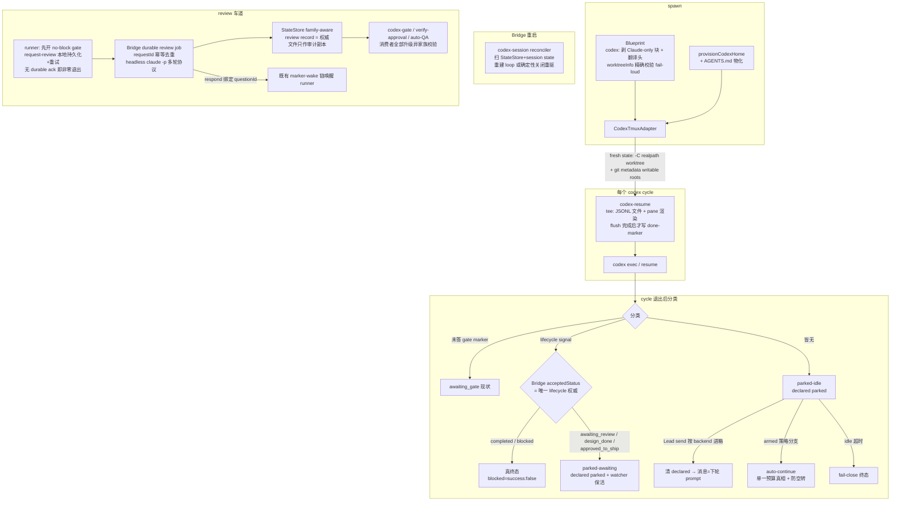

# FLY-1188 Codex Runner 一等公民 — 实施计划

Issue: FLY-1188 (https://linear.app/geoforge3d/issue/FLY-1188/codex-runner-一等公民-独立-promptagentsmd-连续轮次-loop-可视-tui-sandbox-scope)
日期: 2026-07-11
基于: exploration.md, research.md

> Codex design review R1 反馈(10 项)已全部吸收:completion 改为路由感知的 lifecycle signal(不再一刀切终态)、parked 状态接 declared-state/watchdog 合同、新增 Bridge 重启 reconciler、auto-continue 用真 arming 分支+单一预算真相、review 走 request↔gate 显式绑定协议、FLY-827 权威落 StateStore family-aware record(文件只作审计副本)、reviewer 子进程协议细化、执行语义判别改 runnerBackend、JSONL flush 完成点、PR 依赖表修正。

## 0. Scope 合同

**In**:五个硬伤 — ①codex 味 prompt/AGENTS.md ②连续轮次 loop + Lead 可唤醒 ③cmux 可视进度 ④sandbox 可写 worktree ⑤作者感知异家族 review(codex 写→Claude 审)。
**Out**:A/B split(HL PRD 前置件)、T-2 真交互 TUI(future)、codex review 车道迁原生 `codex exec review`(follow-up)、legacy EdgeWorker agentSession 路径(FLY-493 先例:只做 TeamLead dispatcher 路径)。
**硬约束**(brainstorm gate 已批):不新增 feature flag;claude 路径 byte-compat(codex-tmux 本就是 label opt-in);T-1=可见实时进度≠完整交互 TUI;/goal 已真机实证不可用于 exec 模式(research §3),adapter 承担续跑 dispatcher。

**执行语义判别(全计划统一,R1 #8)**:所有「这是 codex runner」的执行分支一律以 **resolved executor backend(`runnerBackend === "codex-tmux"` / adapter type)** 为判别;`ctx.vendor` 只用于 mailbox transport 身份(identity-less/rollback 路径下 vendor 可为空而 backend 仍是 codex-tmux)。Blueprint 现有三处 gate 块的 `ctx.vendor === "codex"` 判别一并迁移到 runnerBackend(行为仅在「backend=codex 而 vendor 缺失」的病态组合上变化——那正是要修的漏),补 `runnerBackend=codex-tmux, vendor=undefined` 的 reverse-compat 测试。

## 1. 总体架构(目标态)

## 2. PR 拆分与顺序(R1 #10 修正)

| PR | 内容 | 依赖 | 量级 |
|----|------|------|------|
| **PR-1** | executor-identity 判别统一 + sandbox scope + send 按 backend 路由 | 无 | 小-中 |
| **PR-2** | AGENTS.md 契约 + Blueprint codex 味组装(**不含** loop 行为条款) | PR-1(判别) | 中 |
| **PR-3** | codex-resume tee/flush 重构 + pane 渲染 | 无(与 PR-2 并行) | 小 |
| **PR-4** | 连续轮次 lifecycle(route-aware signal、parked 状态、watchdog 合同、crash recovery、auto-continue)+ 契约 loop 条款补写 | PR-1/2/3 | 大 |
| **PR-5** | request-review 协议 + Claude reviewer + family-aware review 权威链 | PR-1(判别/路由)、PR-4(wake/parked) | 大 |

过渡态合同(每 PR 自带 partial-deploy reverse-compat sentinel):PR-2 落地后、PR-4 之前,codex runner 的运行合同**不写**「退出会被自动 resume」——契约文件的 loop 条款在 PR-4 同窗补写(避免合同先行于机制);PR-5 的 reminder/recovery 路径(不是 send-as-success fallback,那已删除)依赖 PR-1 路由 + PR-4 消费,故 PR-5 必须最后。每个 PR 独立过 Codex code review + CI;真机 QA 点见各节;全程 TDD。

## 3. PR-1 — 判别统一 + sandbox + send 修箱

### 3.1 executor-identity 判别(改 `packages/edge-worker/src/Blueprint.ts`)

- `BlueprintContext.runnerBackend` **已存在**(Blueprint.ts:166/293)——本 PR 是把执行语义分支统一到消费它,不是加字段;Blueprint 内三处 gate 块与后续所有 codex 分支改判 `runnerBackend === "codex-tmux"`(vendor 继续只喂 transport)。
- 测试:`runnerBackend=codex-tmux, vendor=undefined` 出 codex gate 块;claude 路径输出 byte 快照不变。

### 3.2 sandbox(改 `packages/claude-runner/src/CodexTmuxAdapter.ts` + `Blueprint.ts`)

1. `runCycle` fresh-state:`cwd = realpathSync(ctx.cwd)`(FLY-793);`writableRoots` 增补 `realpath(cwd)` + 新私有 helper `resolveGitWritableDirs(cwd)`(`git -C <cwd> rev-parse --path-format=absolute --git-dir --git-common-dir`,经 `this.execFileFn`,不 import edge-worker;结果 realpath 去重)。git 解析失败 → **抛错终止 spawn**(不能 commit 的 runner 是残废,fail-loud)。
2. Blueprint codex 防御(R1 #8 收紧):TeamLead 路径的 codex spawn **必须**有 `worktreeInfo` 且 `realpath(cwd) === realpath(worktreeInfo.worktreePath)`,否则抛错(错 sibling 也拦);不再只比对 projectRoot。
3. 沿用 `-c sandbox_workspace_write.writable_roots` 既有形态(不引入 `--add-dir`);「沙箱参数仅 fresh cycle 生效(resume 继承)」写进合同测试。

### 3.3 send 按 backend 路由(改 `packages/flywheel-comm`)

1. CommDB `sessions` 加 `vendor` 列(幂等 ADD COLUMN);`registerSession` 加可选 vendor:CodexTmuxAdapter 传 `"codex"`,TmuxAdapter 传 `"claude-code"`(缺省 NULL=legacy)。
2. `send.ts`:读 session.vendor → `wakeRunnerMailbox({ ..., backend })`;NULL 回落 env 现状(byte-compat)。消息仍是 wake=hint、无权威。

### 3.4 测试与验证

- 单测:state 构造(mock rev-parse)、git 失败抛错、worktreeInfo 校验矩阵(缺/错 sibling/realpath 不一致)、send vendor 路由(镜像 respond-codex-wake.test.ts)、迁移幂等、3.1 判别矩阵。
- 合同:claude spawn argv/prompt 逐字快照。
- 真机 QA:codex runner 真 worktree `git add/commit` 成功;`send` 后 codex-teams inbox 出现消息(消费在 PR-4)。
- 命令:`pnpm --filter claude-runner --filter flywheel-comm --filter edge-worker test`,`pnpm lint`。

## 4. PR-2 — 独立 prompt / AGENTS.md

### 4.1 codex 行为契约文件(新 `agents/codex/runner-contract.md`)

flywheel-shipped、英文、单一来源。内容(codex 世界观改写):
- 身份与执行模型:「你是 codex exec 进程;每次退出=暂停点;不要试图长驻等待」。**本 PR 阶段不写**「退出会被自动 resume/park」条款(机制在 PR-4,合同不先行);PR-4 同窗补写 loop 条款。
- 三段式纪律 / pipeline stages / doc-flow 指针(与 generic-executor 同规矩)。
- comm 协议:gate 一律 `--no-block`、ask/check、report 走 `ask --report`、merge 前 verify-approval、完成必须 `flywheel-comm complete`。
- 环境翻译规则(固定条款):Skill/slash/Superpowers → 同 shape 手动执行;SendMessage/Claude-in-Chrome/`/compact` → 不适用,列替代或上报缺口;与 repo/全局 AGENTS.md 冲突以本契约+动态 prompt 为准(FLY-123 §5.5)。

### 4.2 物化与组装

1. `provisionCodexHome` 写 `$CODEX_HOME/AGENTS.md`(0600,头注版本+源路径;源缺失 fail-loud)。CODEX_HOME 重定向天然挤出全局 superpowers 注入(research §2 实证,省 ~15k tokens/cycle)。
2. Blueprint codex 分支(判别=runnerBackend):剥/替换 audit 清单的 Claude-only 块(SendMessage 禁令→「你没有 SendMessage;report 一律 ask --report」;`/compact`/Claude-in-Chrome 措辞;PIPELINE PREAMBLE 的 onboard skill → 手动同 shape);role 文件照读,前置固定「ENVIRONMENT TRANSLATION」头。claude 分支逐字不动。
3. 防漂移:契约锚点合同测试(三段式/gate --no-block/complete/verify-approval)+ claude systemPrompt byte 快照 + codex systemPrompt 禁词 grep-zero(`SendMessage tool`/`Claude-in-Chrome`/`/compact`)。

### 4.3 测试与验证

- 单测:AGENTS.md 写入(含 fail-loud);双路快照。
- 真机 QA:codex runner 首条 agent_message 不再自述 superpowers;turn-0 不再尝试 Skill 工具。
- 命令:`pnpm --filter claude-runner --filter edge-worker test`,`pnpm lint`。

## 5. PR-3 — pane 实时渲染(T-1)+ flush 完成点

### 5.1 改动(仅 `packages/flywheel-comm/src/commands/codex-resume.ts`)

1. **管道重构(R1 #9,先于渲染)**:child stdout 改为单一 byte 流 tee — 原字节全量写 JSONL 文件(字节不动)+ 同一流喂增量 line decoder 做渲染;**等 child stdout end + 文件流 finish 后**才原子写 done-marker(temp+rename)。杜绝「marker 先于 flush」既有小竞态(PR-4 的 anti-spin 统计与 threadId 解析都依赖文件完整)。
2. 渲染(fail-open,不影响文件侧):`turn.started/completed` 横幅(mode/threadId 短形式/耗时);`command_execution` → `▶ <command 截断>`(completed 附 exit_code);`file_change` → `✎ <path> (<kind>)`;`agent_message` → `💬 <截断>`;坏行/未知类型跳过渲染。
3. **T-1 合同 = 可见实时进度,不是交互 TUI**(founder 打字走 Discord/Lead);T-2 记 future,不许当回归报。

### 5.2 测试与验证

- 单测:真探针 fixture 行渲染;chunk 边界拆行/无尾换行/大输出 backpressure/坏 JSON;JSONL 文件与输入字节一致;done-marker 晚于文件 finish(顺序断言)。
- 真机 QA:`tmux capture-pane` 见 `▶`/`✎` 进度行。
- 命令:`pnpm --filter flywheel-comm test`,`pnpm lint`。

## 6. PR-4 — 连续轮次 lifecycle

### 6.1 completion lifecycle signal(R1 #1 + R2 #1/#2 重写;改 `complete.ts` + Bridge `/events` 响应)

**原则:signal 只表达 completion intent,绝不复制 FSM。lifecycle 权威 = Bridge/StateStore 落库结果**(event-route 的 session_completed 分支才知道 needs_review 在当前 session status/questionId 下落到 awaiting_review 还是 evidence-gap completed、merged-but-unapproved 要不要 merge-block park —— adapter 不做第四份 FSM 副本)。

机制(显式状态机,R2 #2 + R4 #1/#2):
1. **signal = 完整不可变 event envelope + 可变 ack 字段(R4 #2)**:`complete.ts` 首次 POST **前**原子写(temp+rename)`~/.flywheel/state/completion-signals/<execId>.json`——`envelope` 存**逐字节完整**的 session_completed 请求体(eventId、route、pr、landing/evidence、session role、exit reason、summary、issueId、reviewQuestionId 等 complete.ts:147-208 实发全字段;**不含** auth secret,Bearer 由发送方运行时加),`ack` 存可变 `{ deliveryState: "pending"|"delivered"|"fail_close_marker", acceptedStatus?, ts }`。此后 `complete.ts` 与 adapter 的一切(重)投递**都发这份 envelope 原文**——pre-POST 崩溃的重放与无崩溃请求逐字节一致,不从瘦身字段重构(否则丢 reviewQuestionId/landing 证据会改变 review 绑定与 merge 路由)。route 合法集 = complete.ts 现有集合(**无** phase_implement_complete,R2 #5)。
2. **Bridge 侧原子 completion-application 边界(R3 #1 + R4 #1)**:现状 `insertEvent` 独立提交先于 dispatch(event-route.ts:514-528,StateStore.ts:1841-1858),`applyTransition` 又单独持久化(applyTransition.ts:51-64)——存在「ledger 有行、outcome 永缺」的两个崩溃窗。session_completed 的处理改为**单个 StateStore 事务**:completion event claim + 权威 lifecycle 变更 + `applied(acceptedStatus)` outcome 三者同事务提交,非权威副作用(Discord 通知等)在提交后执行;若该路由确实无法单事务化,退而持久化 `received/applying/applied` 三态 + lease,**outcome 缺失的 duplicate 必须重驱原 ledger payload 的应用**(绝不返回成功、绝不 inert)。`/events` 响应体增加 `acceptedStatus`(additive,byte-compat),duplicate 请求返回已存 outcome;**不得以「event 已在 ledger」推断成功**。注入崩溃测试三类:event-insert→FSM 缝、FSM→outcome 缝、以及 same-status accepted 路径(如 awaiting_review 窗口重置)。
3. `complete.ts` 不再只看 HTTP ok:**必须**确认响应体 FSM-accepted(现有 `/events` 对 invalid route 返回 200 {ok,warning} — reconciler 已知此坑,complete-marker-reconciler.ts:24-29)→ ack 更新为 `{ deliveryState: "delivered", acceptedStatus }`。
4. 重试耗尽 → ack 更新为 `fail_close_marker` 并保留既有全量 fail-close marker(reconciler 补投协议不变;marker 与 envelope 同源);reconciler 成功 replay 后把 ack 升级为 delivered+acceptedStatus。
5. **pending 的实时自愈(R3 #1,不等重启)**:adapter 在 parked(pending)每个等待 tick 周期性重投 signal.envelope **原文**(同 eventId 幂等,duplicate 返回 outcome 或重驱应用)→ 拿到 acceptedStatus 就地更新 ack 并按 §6.1 映射转移。**命名测试**:① Bridge 与 adapter 全程健康,首个 accepted 响应丢 + complete.ts 未标 delivered → 无重启收敛;② crash-before-first-POST(needs_review 带 questionId + 带 landing-evidence 的 route 各一)→ 重放的 ledger payload 与 accepted 结果同无崩溃请求完全一致。

adapter 的 **acceptedStatus → 行为**映射(小而闭合的落库状态集,共享纯函数 `mapAcceptedStatusToAdapterWait()`,与 event-route/DirectEventSink/complete-marker-reconciler 同源使用,防漂移):

| acceptedStatus | adapter 行为 |
|---|---|
| `completed` | 真终态 success |
| `blocked` / `failed` | 真终态 **success:false**(R2 #1:blocked 不得因 codex exit 0 报 success) |
| `awaiting_review` | **parked-awaiting-review**:窗口+watcher 保活,等 approval/feedback wake(既有 sendRunnerWake 链)→ resume;绝不关 watcher、绝不写 CommDB completed |
| `design_done`(phase_design_complete) | **parked-phase**(三段式 keep-alive,FLY-887):保活等 turn/wake |
| `approved_to_ship` 等其余非终态 | parked-awaiting(同上保活) |
| deliveryState=pending/fail_close_marker(无 acceptedStatus) | 不判 success;parked-awaiting 等 reconciler 补投后的状态;idle 超时 fail-close 收尾 |

### 6.2 分类矩阵 + parked 状态 + 消费幂等(R1 #1/#2 + R2 #2;改 `CodexTmuxAdapter.execute`)

cycle 退出(exit 0)后:未答 gate marker → awaiting_gate(现状);lifecycle signal → §6.1 映射;皆无 → **parked-idle**。

**消费幂等(R2 #2)**:adapter 在 codex session state 原子记录 `lastHandledEventId + handledStatus`;重入分类时读到同 eventId 的 signal → 只恢复既有等待形态,不重复状态转移(回归测试:旧 needs_review signal 残留 + approval wake resume 后不得再次 park 回等审)。新 complete 产生新 eventId 覆盖语义。真终态时清理 signal 文件(terminal 后残留属 §6.3 crash-window 测试类)。

parked-*(idle/awaiting-review/phase)公共合同:
- **declared-state 接线(R1 #2)**:进入 parked 时写既有 CommDB `runner_declared_states = parked`(reason 区分 idle/awaiting_review/phase/autocontinue_stalled — quiet-classifier 现成解释信号,watchdog/HeartbeatService 据此抑制 idle/stuck 告警);外部 `send` 已会清它(send.ts:36-43);adapter 自发 resume(auto-continue/gate 应答/wake)前显式清、再 park 时重写。pane death/orphan reaping 语义不变(集成测试证明:park 期间零 `runner_idle_detected`/`session_stuck`,pane 死仍触发)。
- Lead 消息投递 → 清 declared → 合并未消费消息 `nextPrompt = "LEAD MESSAGE(S): ..."` → resume cycle(消息无权威,ship 仍 verify-approval)。
- idle 超时(沿用 `ctx.waitingTimeoutMs`):清 declared + fail-close 终态(`failureReason="parked expired without completion evidence"`),绝不静默 success。
- 心跳照打;exit≠0 立即终态失败(现状)。

### 6.3 Bridge 重启恢复(R1 #3;新 `packages/teamlead/src/bridge/codex-session-reconciler.ts`)

- 现状:adapter 的 gate/park 循环是 Bridge 内存 promise;`session.json`(CodexTmuxAdapter.persistSessionState)只写不读 → Bridge 重启即断链。PR-4 把 parked 生命周期拉长到 49h,必须闭环。
- 启动 reconciler:扫 StateStore 活跃 codex-tmux session × `~/.flywheel/state/codex-sessions/<execId>/session.json` + gate markers + completion signal + declared state,逐一校验(execution 归属、tmux window 活性、cwd/threadId 一致)后 **二选一**:①重建等价循环(重挂 CodexMailboxWatcher + 进入与崩溃前一致的 awaiting_gate/parked 状态 — 复用 adapter 抽出的可重入等待循环);②校验不过 → 确定性关闭(kill window + 现有 execution/retry 协议重驱),**绝不** heartbeat-re-adopt 装死。
- 所有新 marker/signal:temp+rename 原子写、schemaVersion 校验、损坏 quarantine(.corrupt 后重建,FLY-349 checkpoint 先例)。
- **启动顺序钉死**(R2 #5,防恢复器与 heartbeat re-adopt 抢 session):complete-marker drain / StateStore 初始化 → codex-session + review-job reconcile → 恢复 watcher → 才启 Heartbeat/IdleWatchdog/AutoContinueArmer 与接收新 dispatch。
- crash-window 测试五类:写前崩 / 写后未 POST(signal 停在 pending)/ POST 成功未改 delivery / review 子进程中途 Bridge 重启(PR-5 复用)/ terminal 后残留清理。

### 6.4 auto-continue(R1 #4;改 autocontinue 三件套 + adapter)

- arming 决策真分支:`decideArmingAction` 按 backend 分派 — claude-tmux 维持 pane 观察 + send-keys `/loop`(现状);**codex-tmux 不做 pane capture**,条件=(session running ∧ 无 pending blocking gate ∧ runner state 可恢复)→ 原子写 armed-marker。
- armed-marker schema 升级(现状仅 timestamp):`{ schemaVersion, strategy: "claude-loop"|"codex-adapter", goalPath, armedAt, budget: { maxTurns, maxWallClockMs, noProgressLimit } }`;**预算单一真相 = armer 现有默认(40 turns / 180min / 2 no-progress)**,adapter 不再自带 24 常数;schema/路径放共享低层(flywheel-comm 或经 `AdapterExecutionContext` 传入),不让 claude-runner 反向依赖 teamlead。
- adapter 在每次进入 parked-idle 时动态读 armed-marker;armed 且无待消费消息 → 续跑 cycle(prompt=重读 goalPath 契约、证据+complete 收尾、阻塞开 gate);turns/wall-clock 计数持久化在 codex session state(跨重启保上限)。
- 防空转:每续跑 cycle 结束解析该 cycle JSONL(PR-3 后文件完整有保证),连续 `noProgressLimit` 轮零 command_execution/file_change → 停续 + `runner_autocontinue_stalled` 事件(payload 同 gate_timed_out 形态)→ 回 parked-idle(declared reason=autocontinue_stalled)。gate 优先:续跑中开 gate → awaiting_gate 自然接管。
- 契约文件(PR-2)同窗补写 loop 条款(park/resume/complete 语义)。

### 6.5 测试与验证

- 单测:route→行为映射全枚举(含 fail_close_marker);declared-state 写/清时序;分类矩阵;anti-spin;armed-marker schema/预算;计数持久化;reconciler 校验矩阵(通过重建/不过关闭)。
- 集成:mock 传输+真 tmux 两轮对话(turn-0 → parked → send → turn-1 → complete no_code → 终态);needs_review park→approval wake→resume;Bridge 重启中途恢复 parked 会话。
- 真机 QA(529 Room/沙箱 slot):真 codex runner 全链两轮 + needs_review 等审形态 + 重启恢复 + auto-continue 防空转停。
- 命令:`pnpm --filter claude-runner --filter flywheel-comm --filter teamlead test`,`pnpm lint`。

## 7. PR-5 — 作者感知 review 路由 + Claude reviewer

### 7.1 request↔gate 显式绑定协议(R1 #5 重写)

- 新 `flywheel-comm request-review`(或等价子命令):runner 侧流程(预焙进 codex 契约/Blueprint 流程块,确定性,不依赖运行中指令投递)——
  1. `stage set design_review --plan 
`(或 pr_created,照旧,byte-compat 事件);
  2. **先**开 `gate review_design|review_code --no-block` 拿 `questionId`;
  3. `request-review`:**先本地原子持久化** `{requestId, questionId, reviewType, round, targetPath|headSha}`(temp+rename,复用 complete/qa-result 的 fail-close 形态)→ POST Bridge → bounded retry → 耗尽则留 fail-close marker(启动/周期 reconciler 可重放)且 **CLI 非零退出**(runner 由此知道该 gate 未登记,不得当已登记退出等待;R2 #3);拿到 Bridge 的 durable-accepted ack(响应体确认 job 落库,非裸 2xx)才算成功;
  4. 结束本轮(退出 → adapter awaiting_gate,现成机制)。
- Bridge:以 requestId **幂等去重**持久化 review job(pending/running/done/failed,StateStore 表);**author family / round 从 StateStore 派生,payload 只作待校验输入**(R2 #3)。**可信 head SHA 来源(R3 #2)**:`pr_created` 时刻 `pr_head_sha` 通常缺席(event-route.ts:246-250),故 code-review job 的 head 由 Bridge **服务器侧**从持久化的可信 `worktree_path` 无 shell 派生(`execFile git rev-parse HEAD`,FLY-245 rev-parse-only 先例),**冻结**进 job 与权威 record;verdict 接受前复查 worktree/PR head——head 已移动 → job fail-close,要求新 request/新轮。绝不回落 payload。串行 per-execId、全局并发 2,重启可重驱(接 §6.3 reconciler 与启动顺序);完成后**只 respond 绑定的 questionId**(既有 marker-wake 链唤醒)。每轮修复后 runner 发**新 request**——R2+ 有确定性触发器,不再依赖 stage_changed。
- gate 缺失/questionId 不匹配/question 已答已过期 → job=failed + alert Lead,**fail-close**;无任何「send 摘要当成功」降级。
- **codex-skip 在新车道的语义(R2 #4 + R3 #3 修正)**:request handler 首先读可信 session snapshot——`codex_skip` 生效时**不建 Claude job**,写 durable skipped audit record(+审计副本文件),直接 respond 绑定 questionId 唤醒 runner(带 SKIPPED 语义,合同同 legacy skip.json 的放行意义)。**skip snapshot 是 execution 启动时冻结的**(runs-route.ts:610-615,mid-run 不刷新;retry 建新 execution 时才重取 label,actions.ts:778-813)——因此 reviewer failure 后启用 skip 的**唯一恢复路径 = Lead 加 label 后 cancel/retry 进新 execution**(对齐既有治理,不承诺同 execution 内换 requestId 可达);同 execution 内只有「同 requestId 重试 job」一条恢复线。**命名测试**:codex_skip=false 起跑 → 加 label → 同 execution 新 requestId 仍不 skip(断言);retry 新 execution 后 request 解析为 skipped。另补 design/code 两类 skip round-trip + legacy Claude skip byte-compat 测试。
- stage=design_review/pr_created 的既有 `handleCodexAutoTrigger`:author=claude(或 NULL)→ 现状逐字不动;author=codex-tmux → **不**直接触发 reviewer,由 request-review 事件驱动(容错:stage 后 N 分钟无 request/无 fail-close marker → send 链发提醒——**reminder 性质**,不回答 gate、不替代登记)。
- 入站可靠性测试:gate 已开→POST 前崩 / POST 落 job→ack 丢(重发 requestId 幂等)/ 重复 replay / question 已答或过期。

### 7.2 Claude reviewer 子进程(R1 #7 细化;新 `packages/teamlead/src/bridge/claude-review-runner.ts`)

- 每轮完整 argv(fresh 与 reround 同构):`claude -p <prompt> --session-id <uuid>|--resume <uuid> --output-format json --model claude-opus-4-8`;**每轮都带 prompt**(R1=完整契约:项目背景+目标(design=plan 路径自读;code=PR 号自己 `gh pr diff`)+输出合同;R2+=新 headSha+上轮 findings+「只审 delta/复核 fixes」);**stdin 主动关闭**(classifier 先例的坑);固定 cwd/env/maxBuffer;30min 超时;可持有 child handle 的 spawn wrapper,timeout/Bridge shutdown 杀净子进程。
- 输出合同:结构化 verdict JSON(APPROVED/CHANGES_REQUESTED + findings[] + reviewedHeadSha)。解析不到合法 verdict/拒审形态 → job=**failed**(非 verdict):门保持 fail-close + alert Lead;恢复后同 requestId 重试,或走既有 `codex-skip` 治理路径显式豁免 — **绝不**隐式降级同家族通过、**绝不**把 reviewer_unavailable 当等价 review 回复。

### 7.3 family-aware review 权威链(R1 #6 重写;改 StateStore + codex-gate + verify-approval + auto-qa-coordinator)

- **权威 = StateStore record,不是 worktree 文件**(现状链:await-codex-gate 发 `codex_review_result` → Bridge 落 head-bound `codex_review_record` → codex-gate.ts/verify-approval.ts SQL 查询、auto-QA 消费)。原位扩展 `codex_review_record`:加 `author_family`/`reviewer_family`/`request_id` 列(幂等迁移,NULL=legacy;`verdict_event_id` **已存在**,StateStore.ts:1687-1705,复用不新增 — R2 #5)。
- 写入方:claude 作者路径照旧(runner await-codex-gate → 事件 → Bridge 落 record,family 由 Bridge 按 session.adapter_type 补);codex 作者路径由 **Bridge 在 review job 完成时**校验(reviewer 进程结果 × 当前 session author/head)后落 record;worktree `review/*.json` 只作审计副本(作者可写目录,不作权威)。
- 消费者升级(全部):`isCodexGateSatisfied`(codex-gate.ts)/`verify-approval` SQL/AutoQaCoordinator hold-release/restart reconcile — 校验条件升级为「record 存在 ∧ verdict=APPROVED ∧ reviewed_head 匹配 ∧ reviewer_family ≠ author_family」。legacy 解释规则:record 无 family 时,仅当 `session.adapter_type ∈ {NULL, claude-tmux}` 解释为 reviewer=codex 有效;**codex 作者遇缺 family 一律 fail-close**。kill-switch `FLYWHEEL_CODEX_HARD_GATE` 语义原样(既有 flag)。

### 7.4 测试与验证

- 单测:路由按 adapter_type 分叉(claude 路径快照);request↔gate 绑定(乱序/缺 gate/mismatch fail-close);reviewer argv/stdin/超时/杀净;job 状态机重启重驱;record 迁移幂等;消费者升级矩阵(家族同/异、sha 错配、legacy NULL 双侧解释)。
- 集成:fake `claude` 可执行(吐固定 verdict)全链 round-trip(R1→findings→修→R2 新 request→APPROVED→record→gate 放行)。
- 真机 QA:codex 作者真跑一轮 Claude design review(真 claude -p);merge 门 fail-close 反例(同家族/缺 family 证据被拒)。
- 命令:`pnpm --filter teamlead --filter flywheel-comm test`,`pnpm lint`。

## 8. 风险与对策

| 风险 | 对策 |
|---|---|
| Blueprint/判别迁移误伤 claude 路径 | 双路 byte 快照 + reverse-compat sentinel(每 PR);判别迁移单独测试矩阵 |
| lifecycle 判定与 Bridge FSM 漂移 | 权威=Bridge acceptedStatus(FSM 落库结果),adapter 不复制 FSM;共享纯函数映射 + 全枚举单测;pending/fail_close 永不 success |
| completion signal 重放/双读 | deliveryState 显式状态机(pending→delivered/fail_close)+ lastHandledEventId 消费幂等 + 旧 signal 回归测试 |
| request-review 入站丢失永久挂起 | runner 侧持久化+bounded retry+fail-close marker 可重放;无 durable ack 非零退出;Bridge requestId 幂等 |
| parked 假活占资源/假告警 | declared-state 接 quiet-classifier 合同 + idle 硬超时 fail-close + pane-death 语义不变 |
| Bridge 重启断链 | §6.3 reconciler(重建或确定性重驱)+ 五类 crash-window 测试 + 原子写/quarantine |
| auto-continue 空转烧 quota | 单一预算真相(armer 默认)+ 持久化计数 + 停续上报 + gate 优先 |
| Claude reviewer 撞 AUP/超时 | job=failed fail-close + Lead alert + 同 requestId 重试/显式 skip 治理;绝不同家族降级 |
| Bridge 内长 review 进程 | 30min 超时 + 并发 2 + execId 串行 + child handle 杀净 |
| 新 marker/signal 崩溃窗口 | temp+rename + schemaVersion + quarantine;reconciler 消费 |
| 契约文本漂移 | 单一来源 + 锚点合同测试 + 禁词 grep-zero |

## 9. 里程碑与总验收

1. M1(PR-1):codex runner 真 worktree commit/push;send 投递对箱;判别统一。
2. M2(PR-2+3):cmux 可见实时进度;AGENTS.md 生效、prompt 无禁词;JSONL flush 顺序断言过。
3. M3(PR-4):真机两轮对话全链 + needs_review 等审 + Bridge 重启恢复 + 防空转;watchdog 零假告警。
4. M4(PR-5):codex 作者真跑 Claude design review 一轮;异家族门 fail-close 反例验过。
5. **总验收(对齐由来)**:用本套能力重派 /eleven(FLY-1006) 式 QA 任务,runner 全生命周期(audit→多轮→review→PR)无人肉 shepherd。

## 10. Future(记录,不实现)

- T-2:runner 真交互 TUI(remote-control daemon + resume --remote);彼时原生 /goal 才可用。
- codex review 车道迁原生 `codex exec review --base/--commit`(0.144.1 已有)。
- gemini 家族 reviewer 策略表扩展;A/B split(HL PRD)。
