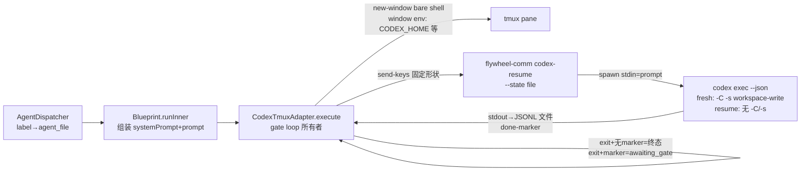

# FLY-1188 Codex Runner 一等公民 — 调研

Issue: FLY-1188 (https://linear.app/geoforge3d/issue/FLY-1188/codex-runner-一等公民-独立-promptagentsmd-连续轮次-loop-可视-tui-sandbox-scope)
日期: 2026-07-11
基于: exploration.md

> 结论先行:五个硬伤全部定位到具体 file:line,且每个都有现成机制可复用(per-runner CODEX_HOME、respond 的 marker-aware 唤醒、FLY-818 goal 契约、getGitMetadataDirectories、Bridge 的 headless claude -p 先例)。两个关键外部事实用真机实测钉死:**① `/goal` 在 exec 模式不是机制(探针实证,adapter 必须自己当续跑 dispatcher);② JSONL 事件词汇表足够做 pane 实时渲染**。

## 1. codex-tmux 执行链现状图

关键文件:`packages/claude-runner/src/CodexTmuxAdapter.ts`(execute/runCycle/injectAtIdlePrompt/buildWindowEnvArgs)、`packages/flywheel-comm/src/commands/codex-resume.ts`(buildCodexCycleArgv/spawn)、`packages/claude-runner/src/codex-home.ts`(per-runner CODEX_HOME provisioning)、`packages/edge-worker/src/Blueprint.ts`(prompt 组装)。

## 2. Scope 1 — prompt / AGENTS.md

**指令三层(Spike-δ 实证 + 本次探针再证)**:`$CODEX_HOME/AGENTS.md`(每 codex 进程必读)+ repo 目录树 AGENTS.md + exec 动态 prompt。本次 /goal 探针里 codex 第一句自述「我会用 superpowers:using-superpowers 约束执行流程」——**全局 AGENTS.md 层的 superpowers 注入真实到达了每个 codex 进程**,反证 CODEX_HOME/AGENTS.md 注入面 100% 生效(同时也说明现在这层被无关内容占着)。

**现状组装与交付**(audit 详情):
- `Blueprint.runInner`(Blueprint.ts ~L689-1728):`systemPrompt` = `## Agent Role`(readAgentFile,40KB 截断,L1995)+ `## Baseline Rules`(全部 flywheel-comm 协议块);`prompt` = 任务行(L965-978)。
- vendor 特化仅三处 gate 块(`ctx.vendor === "codex"` → `--no-block` + END-TURN 措辞,L1440/1534/1553)+ adapter 层 PONYTAIL_RULESET(CodexTmuxAdapter.ts:414)。`approve_to_ship` 块(L1487-1532)无 vendor 分支(本就是非阻塞流,codex 可用)。
- Claude 交付:`--append-system-prompt-file` + positional prompt(TmuxAdapter.ts:717-775);codex 交付:systemPrompt 折进任务文本走 stdin(CodexTmuxAdapter.ts:407-421 → codex-resume.ts:235/279,fresh cycle 才带 system 层,resume 只带回复)。
- **运行时零 AGENTS.md 生成**;`scripts/setup-new-project.sh:144` 只做一次性项目脚手架;Lead 侧「demo-era AGENTS.md approach is retired」(codex-lead-tui-home.sh:17)是 persona 场景的裁决,不约束 runner 行为契约场景。

**Claude-only 内容清单(codex 收到但无法执行/误导)**:generic-executor.md 的 Superpowers RPC(Skill 工具)、qa-executor.md 的 Claude-in-Chrome、`SendMessage` 禁令(Blueprint.ts:1378)、`/compact`(L1045/1109)、`/codex-code-review` slash 措辞(L1481)、Designer 块的 skill 清单(L987-997)。

**per-runner CODEX_HOME 已就绪**:`provisionCodexHome`(codex-home.ts)为每个 runner 建隔离 home(auth.json + config.toml,GH_TOKEN 走 config.toml env policy)→ AGENTS.md 物化点现成,零仓库污染。风险:全局 `~/.codex/AGENTS.md` 与 per-runner home 的关系 — CODEX_HOME 被覆盖后 codex 只读 `$CODEX_HOME/AGENTS.md`,不再读 `~/.codex/AGENTS.md`(home 重定向),所以我们的契约不会跟 superpowers 全局注入叠加(反而更干净、省 ~15k tokens/cycle,FLY-123 QA 实测项)。

## 3. Scope 2 — 连续轮次 loop

**三重根因**(audit 钉死):
1. 终态误判:`executionMarkers.length === 0 → break; // terminal success`(CodexTmuxAdapter.ts:460-466)。
2. `send` 错箱:`send.ts:58-64` 调 `wakeRunnerMailbox` 不带 `backend` → `AgentTeamTransportFactory.fromEnv()` = claude-code 箱;codex 的 `CodexMailboxWatcher` 读 `~/.flywheel/codex-teams/...`(CodexAdapter.ts:109-113)。对照:`respond` 是 marker-aware 的(`backend: marker.vendor`,respond.ts:186/251;Bridge 侧 runner-wake.ts:151-172 同),**gate/ask 应答唤醒已真通**,有测试(respond-codex-wake.test.ts)。
3. awaiting_gate 环只把 wake 当「再查 answered gate」提示(CodexTmuxAdapter.ts:485-491),普通消息不进 prompt。

**完成证据缺口**:`complete.ts` 只 POST Bridge `/events`(session_completed),fail-close 才写 marker(complete.ts:249-260,`~/.flywheel/state/completion-markers/<execId>.json` 方向)— adapter 本地无法观察「runner 已声明完成」。需要新增 always-write 的本地 completion sentinel(成功/失败都写,含 route),adapter 以它为真终态。

**可复用件**:
- FLY-818 目标契约:`autocontinue-goal.ts` 的 `buildGoalContract` 是确定性纯函数(6 要素,FLY-512 对齐);arming 决策/持久 armed-marker 在 `autocontinue-armer.ts`/`autocontinue-state.ts`。当前 `CLAUDE_LOOP_ADAPTERS = {"claude-tmux"}`(autocontinue-goal.ts:48),注释「codex has its own /goal (out of v1 scope)」。Claude 的 arming 动作 = send-keys 一次 `/loop <goal-path>`(autocontinue-armer.ts:247-312);codex 的等价动作应是 adapter 在 cycle 边界注入续跑 cycle(见 §3 实测)。
- park/wake 语义先例:declare-state(FLY-626)与 FLY-887 phase park。

> ⚠️ **2026-07-11 结论修正(implement 阶段,Annie 质疑触发)**:下面这条「/goal 不是机制」的结论**测错了模式** —— 探针跑的是 `codex exec`(headless),而官方文档(OpenAI cookbook)明确 Goals 主要为 **interactive TUI** 设计、从 0.128.0 起就有。implement 阶段在**真 TUI 模式**下真机复测(0.144.1,tmux 起真 `codex` TUI,gpt-5.6-sol):**/goal 在 TUI 下是完整机制** —— ① `Goal active` 后 dispatcher **跨轮自动续跑**(强制「每轮只建一个文件」的 3 文件目标真实跑了 4 个独立轮:建 1→轮止→自动续→核对+建 2→建 3→**独立验收轮**做逐文件 `od` 字节校验后才 `Goal achieved`,全程零人工输入);② `/goal`(status)给出 lifecycle 状态 + Time/Tokens 预算记账(38.1K);③ `/goal pause` 真停(20s 零新文件,状态栏 `Goal paused`)、`/goal resume` 真续、`/goal clear` 可用;④ 完成判定 **evidence-based**(字节校验先于宣告)。证据:探针 scrollback 存档(9 个独立轮次)。**含义**:exec-cycle 架构下(§3 原结论)/goal 仍不可用——它只活在常驻 TUI thread 里;要吃到原生 Goals,runner 形态必须是常驻 TUI(驱动方式=Spike-δ 否决的 send-keys 或 T-2 remote-control 的取舍另议)。M4 方向由 Lead+Annie 依此定夺。

**真机实测 ①(原 design 阶段,仅对 exec 模式成立)— `/goal` 在 exec 模式不是机制**:
- codex-cli **0.144.1**,`codex features list` → `goals stable true`(已启用)。
- 探针:`echo '/goal Create a file...verified by...' | codex-with-fallback exec --json -s workspace-write -C <scratch> -`。
- 结果:JSONL 事件仅 `thread.started / turn.started / item.*(agent_message|command_execution|file_change) / turn.completed`,**零 goal 事件**;恰好一个 turn 后进程退出;`/goal` 文本被当普通任务文字执行(文件照建,任务照做)。
- 结论:goals dispatcher(事件驱动续跑、防空转、证据完成)活在**交互式客户端**(TUI/app 有常驻 dispatcher);`codex exec` 一进程一 turn,退出后无人续。**exec-cycle 架构下,续跑 dispatcher 必须由 adapter 承担**;设计上镜像 /goal 的语义(FLY-512 §1.5:安全边界续跑、无实质进展抑制、证据驱动完成、预算≠完成),但完成证据用 Flywheel 系统级的 complete sentinel(比 /goal 的 prompt 级自觉更硬,与 FLY-512 Part2-④ 的既有优势一致)。将来若 runner 迁 T-2(remote-control 常驻 thread),原生 /goal 才有可用形态 — 记 future。

## 4. Scope 3 — 可视 TUI

**pane 现状**:bare shell + 注入命令行;codex stdout(JSONL)全量进文件(codex-resume.ts:242-269),stderr inherit 到 pane 但 exec 模式几乎无内容 → Annie 见空 shell。

**真机实测 ② — JSONL 事件词汇表(渲染器可行性)**:探针实测事件流含 `item.started/item.completed`,item 类型 `agent_message`(全文)、`command_execution`(command + aggregated_output + exit_code + status)、`file_change`(path + kind + status),加 `turn.started/turn.completed/thread.started`。**足够渲染「在干什么」的人话进度流**(当前命令/改动文件/阶段消息),渲染点就在 codex-resume(它已拥有 stdout 管道)— 边写 JSONL 文件边解析渲染到自身 stdout(=pane),cycle 边界打横幅。零新进程、零新依赖。

**T-2(Lead TUI 机制)为什么不是 v1**:Lead 形态 = 共享 `codex remote-control` daemon + sidecar WS 驱动 + `codex resume --remote` pane 观察端(codex-lead-tui-runtime.ts,FLY-259 PR-D)。搬到 runner 的结构性冲突:① daemon 按 CODEX_HOME 起,per-runner 隔离 home(FLY-123 WS-A,防并发账号态互踩)⇒ 每 runner 一 daemon,生命周期管理量级陡增;② 丢进程级 codex-with-fallback 429 轮换(FLY-123 已记这是 exec 形态核心优势;Lead 用专号不轮换,runner 用共享池必须轮换);③ adapter 全量重写(exec-cycle → WS turn 驱动);④ standalone codex 硬依赖。Spike-δ 否决的是 send-keys 驱 TUI(Option B),不含 remote-control,但上述四条独立成立。**T-1 = 可见实时进度 ≠ 完整交互 TUI;T-2 = future**(若将来要 founder 可驾驶 runner 再立单)。

## 5. Scope 4 — sandbox scope

**cwd 与 worktree 布局**:`Blueprint.ts:705` `let cwd = projectRoot`(无 worktree manager 时的 fallback = 主仓,/eleven 现场的「-C .../flywheel」形态);正常路径 `cwd = worktreeInfo.worktreePath`(L784-793)。worktree 是主仓 **sibling**(WorktreeManager.ts:142-152,`path.join(path.dirname(mainRepoPath), name)`),其 git 元数据在 `<主仓>/.git/worktrees/<name>/`,对象库在 `<主仓>/.git/`。

**沙箱构造**:fresh cycle `writableRoots = [~/.flywheel, gateMarkerDir, dirname(commDbPath)]`(CodexTmuxAdapter.ts:646-653)→ `-c sandbox_workspace_write.writable_roots=[...]`(codex-resume.ts:180-184);`-C <cwd>` 使 cwd 隐式可写。**两个被挡面**:① fallback cwd=主仓时 worktree 完全不可写;② 即便 -C=worktree,`git add/commit/checkout`(progress ledger 的 path-limited commit!)要写主仓 `.git/worktrees/<name>` + `.git/objects`,在一切 writable root 之外。resume 无 -C/-s,沙箱参数从 session 继承(Spike-δ/QA 实证)→ **一切修正必须落在 fresh cycle**。

**现成解法没接线**:`GitService.getGitMetadataDirectories()`(GitService.ts:57-90,解析 `--git-dir` + `--git-common-dir`,注释原文「linked worktree metadata paths … must be writable by sandboxes」)已被 EdgeWorker 旧路径用于 allowedDirectories(EdgeWorker.ts:2480-2486/5566-5573);codex-tmux 链(Blueprint+CodexTmuxAdapter+codex-resume)从未调用。Lead 侧同款旋钮先例:`buildFullAccessArgv` 把 canonical 项目根钉进 `sandbox_workspace_write.writable_roots`(codex-lead-runtime.ts:348-363)+ realpath 校验(resolveFullAccessProjectRoot:435-491)。FLY-793 教训:worktree 路径必须 canonicalize(macOS /tmp symlink)。

另注:codex 0.144.1 有 `--add-dir <DIR>`(「Additional directories that should be writable alongside the primary workspace」)— 与 `-c sandbox_workspace_write.writable_roots` 等效的一等 flag,实现时二选一(倾向沿用既有 `-c` 形态,少一条新 argv 路径)。

## 6. Scope 5 — 作者感知审查路由

**触发链**:`event-route.ts:1699-1702`(stage=design_review/pr_created)→ `handleCodexAutoTrigger`(event-route.ts:212-320):codex-skip label → 写 `<worktree>/.flywheel/runs/<execId>/codex/skip.json`;否则经 CommDB 给 runner 发指令,文本硬编码 `Run: /codex-design-review <plan>` / `/codex-code-review`(codex-instruction.ts:21-73);runner 写 `.flywheel/runs/<execId>/codex/{design-review,code-review}.json`(code 含 reviewedHeadSha)后 `await-codex-gate design|code` 阻塞;code review 另受 FLY-827 硬 merge 门(codex-gate.ts,kill-switch `FLYWHEEL_CODEX_HARD_GATE`)。

**三个事实**:
1. reviewer 无条件 Codex,零选择逻辑;`adapter_type`(作者 backend)已持久化(event-route.ts:646/677/706)但只被 auto-QA 的 transport 选择消费(auto-qa-coordinator.ts:152),review 路由从不读。
2. `/codex-*-review` 是 **用户全局 Claude slash command**(`~/.claude/commands/codex-{code,design}-review.md`,非仓内文件),驱动 `codex-companion.mjs`(R1 fresh + `--resume-last` 多轮)— 执行前提是 runner 为 Claude Code 进程。**codex 作者今天整条 review 车道不存在**。
3. Claude-as-verdict 先例:`claude -p <prompt> --model <m> --output-format json` via execFile(approval-signal/subscription-claude-classifier-runner.ts:6、image-approval-source.ts:5)— Bridge 进程内 spawn headless Claude 出结构化裁定的骨架已在生产。gemini/peer-review 全是手动全局命令,无 Bridge 接线。

**执行位形核实**:codex runner 在 Seatbelt 沙箱内(keychain 被挡,FLY-209 实证 gh 场景)→ 沙箱内起 `claude -p`(auth 依赖 keychain/OAuth)不可行,R-B(token 注入)需要给沙箱进程塞 Anthropic 高权 token(面扩大 + 有效期形态未验)→ **R-A(Bridge 驱动 reviewer)是唯一不需要新 spike 的路**。Bridge 侧 spawn 长任务(review xhigh 分钟级)需要超时/并发管控 — 与既有 FounderConsentEvaluator/classifier 子进程同类管理。

**真机实测 ③(顺带,记录不入本单 scope)**:codex 0.144.1 新增 `codex exec review [--uncommitted|--base <branch>|--commit <sha>]` 官方 review 子命令 — codex review 车道将来可从 slash-command/companion 迁到原生子命令,与本单无关,记 follow-up 线索。

**Claude reviewer CLI 能力面(真机)**:`claude -p/--print`、`--resume <sessionId>`、`--session-id`、`--output-format json` 齐全 — codex-companion 的 fresh+resume 多轮形态可 1:1 镜像。

## 7. 真机核实汇总

| 事实 | 方法 | 结果 |
|---|---|---|
| codex 版本 | codex --version | 0.144.1 |
| goals feature | codex features list | stable + enabled |
| /goal 在 exec 模式 | 真 auth 探针(--json 事件流) | **非机制**:零 goal 事件,一进程一 turn,文本被当普通 prompt |
| JSONL 事件词汇 | 同上探针 | thread/turn.started/completed + item.*(agent_message/command_execution/file_change)— 够渲染 |
| CODEX_HOME/AGENTS.md 层注入 | 探针 agent_message 自述 superpowers | 每 codex 进程真实生效 |
| --add-dir | codex --help | 存在(writable roots 的一等 flag 等价物) |
| codex exec review | codex exec review --help | 存在(--uncommitted/--base/--commit) |
| claude headless 多轮 | claude --help | -p / --resume / --session-id / --output-format json 齐全 |

## 8. 给 plan 的裁决输入

1. AGENTS.md 落 `$CODEX_HOME/AGENTS.md`(P-A):注入面实证生效、home 已隔离、还顺带把 superpowers 全局层挤出去(省 ~15k tokens/cycle)。
2. loop:adapter 当 dispatcher(实测钉死 /goal 不可用于 exec);终态=complete sentinel(新增 always-write);parked-idle + backend-routed send;auto-continue 镜像 /goal 语义、复用 FLY-818 契约文件。
3. TUI:T-1 渲染器落 codex-resume(事件词汇实证够用);plan 写明 T-1=可见进度≠交互 TUI、T-2 future。
4. sandbox:fresh cycle 接 `getGitMetadataDirectories()` + realpath worktree;fail-loud 校验。
5. review:R-A Bridge 驱动 headless claude reviewer;家族中立 verdict 文件 + await-review-gate;FLY-827 门升级异家族校验;claude 作者→codex 路径逐字不动。
6. 全程**不新增 feature flag**(Lead 确认:codex-tmux 本就是 label opt-in,claude 路径天然 byte-compat)。
