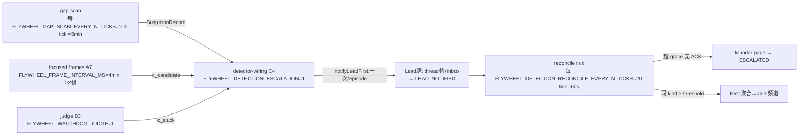

# FLY-1189 QA·FLY-1048 PR-C 529 Room 真机 N-to-N E2E — 调研

Issue: FLY-1189 (https://linear.app/geoforge3d/issue/FLY-1189/qa-fly-1048-pr-c-529-room-真机-n-to-n-e2e统一升级流-bi-4-抑制)
日期: 2026-07-11
基于: exploration.md(同文件夹;brainstorm gate 已 APPROVED,含 S1 安全硬要求)

> 全部结论直接读 origin/flywheel-FLY-1048-pr-c(98c2108c)与本仓 main 的代码/脚本得出,标注文件锚点。

## 1. 被测行为的可观测面(证据锚点从哪来)

| 行为 | 观测面 | 锚点 |
|---|---|---|
| episode 生命周期 | slot StateStore `detection_escalations` 行(status/lead_notified_at_ms/lead_ack_at_ms/founder_paged_at_ms/attempts) | `StateStore.ts`(PR-C C1);slot 的 teamlead.db 可 sqlite 直读 |
| Lead 腿 thread 帖 | 该 issue [FLY-XX] chat thread 里的安静帖(无 mention) | `detection-escalation.ts` C2 → `emitIssueThreadInfraNotification`;Discord API GET 读回 |
| Lead 腿 inbox | `lead_events` 表 eventType detection_escalation(GUARDRAIL 重投)+ 真 test Lead pane 上渲染出的事件文本 | C2 leg 2;两 LeadRuntime formatEnvelope 有显式分支 |
| founder page | 同 thread 里 @founder 消息;`founder_page_ledger` 行;episode → ESCALATED | `detection-escalation-sinks.ts` createFounderPager;mention 校验 = GET 消息 mentions[].id == DISCORD_OWNER_USER_ID(FLY-605 判例) |
| fleet 聚合 | 单条 detection_fleet_aggregate 走 915 alert 通道(= 529 Room 的 #test-flywheel-alerts) | createFleetSink;≥ FLYWHEEL_DETECTION_FLEET_THRESHOLD(默认 4)同 kind → 不页 founder |
| Lead ACK | POST /:executionId/detection-ack(auth 同 stuck-disposition:leadId 必填 + session 存在 + matchesLead owner/scope) body {leadId, kind, episode_fingerprint, disposition} | `stuck-remanage-routes.ts:387`(PR-C 分支) |
| 新旧互斥 | 统一流活跃行存在时旧 stuck-runner-detector 不再 emit(no-double-fire);case-c 的旧 disposition 双向镜像 | C4a,`CASE_C_KIND = "detection_stuck_confirmed"` |
| CLEARING/TTL/ESCALATED | close-runner 等清理入口 → CLEARING 全 kind 静音;TTL 超时回 NEW;ESCALATED 永不 re-alert | `detection-reconcile-tick.ts`(DEFAULT_CLEARING_TTL_MS=2h) |
| 恢复自动 RESOLVE | recoveryProbe 消费现有 liveness(D5)→ terminal/进展 target 全 episode 收口 | resolveRecoveredDetectionTargets |

**范围诚实(设计时已知,写进验收口径)**:
- founder page 只对 **runner-keyed** episode:`createSessionTargetResolver` 对 lead-keyed target 返回 null → onUndeliverable("no_target")(`detection-escalation-sinks.ts`)。Lead 侧 pane_error_stalled 仍走 PR-A LeadAlertNotifier 告警面(PR-A qa-report §7 已有真机证据)。
- FN4 = 仅「今天存在的投递证据」对账(attempts 耗尽/delivered 超龄),574 draft-intent 是显式 follow-up(plan C4 原文)。
- 漏②(lead_ask_unanswered)判据在 gap-scan 读 CommDB pending questions(含 checkpoint IS NULL 非阻塞 ask)。

## 2. 触发链与计时全景(QA 要拨哪些旋钮)

检测→通知的完整链(全部挂在 GatePoller tick,默认 ~3s/tick,零新 timer):

| 旋钮 | 默认 | QA 主矩阵取值 | 作用 |
|---|---|---|---|
| FLYWHEEL_GAP_SCAN_EVERY_N_TICKS | 100(≈5min) | 5(≈15s) | 漏①/漏②/consumed-ack 发现时延 |
| FLYWHEEL_GAP_ASK_UNANSWERED_MS | 30min | 60_000 | 漏② 超龄阈值 |
| FLYWHEEL_GAP_UNCONSUMED_MS | 30min | 60_000 | consumed-ack + FN4 超龄 |
| FLYWHEEL_FRAME_INTERVAL_MS / _CAPTURES_PER_TICK | 4min / 2 | 30_000 / 4 | case-c 判定时延(≥2 帧) |
| FLYWHEEL_DETECTION_RECONCILE_EVERY_N_TICKS | 20(≈60s) | 默认即可 | grace 检查频率 |
| FLYWHEEL_DETECTION_LEAD_GRACE_MS | 1_800_000(30min) | 180_000(3min);**S-30 场景用默认真等** | Lead→founder 升级门 |
| FLYWHEEL_DETECTION_FLEET_THRESHOLD | 4 | 主矩阵默认(2 episode 不触);fleet 场景设 2 | 聚合边界 |
| FLYWHEEL_CLEARING_TTL_MS | 2h | 120_000 | BI-4 TTL 回弹 |
| per-project detection.lead_grace_ms | 无 | 一条场景验 override 生效 | `.flywheel/config.yaml`(detection-config-source.ts:canonical projectRoot,runner 不能自调) |

5 个注册 bool flag 全开:FLYWHEEL_DETECTION_GAP_SCAN / FLYWHEEL_PANE_MULTIFRAME / FLYWHEEL_STUCK_ERRORSIG / FLYWHEEL_WATCHDOG_JUDGE / FLYWHEEL_DETECTION_ESCALATION。**全部在 Bridge fork 时读或 tick 内读——统一在 test-deploy 前导出**(529 gotcha #4)。

## 3. 529 Room 现状与缺口

### 3.1 已有(直接复用)
- 4 slot(bot/频道/端口独立)+ alerts 镜像(#test-flywheel-alerts 1519421055805165842 + FLYWHEEL_ALERT_QUEUE_DIR/_DEADLETTER_DIR/FLYWHEEL_CLAIMS_DB 全 SLOT_DIR)——fleet 聚合与 Lead 侧告警的隔离出口现成。
- `test-deploy.sh`:隔离 Bridge(SLOT_DIR 的 teamlead.db/comm/discord-state)+ 真 test Lead(claude-lead.sh 进 tmux)+ `TEST_REPLY_BY_ISSUE=1` 开 chat threads + TEST_API_TOKEN auth;FLYWHEEL_PROJECTS 双写(env + SLOT_DIR/flywheel-projects.json)。
- 真 runner 注入(memory FLY-631 四坑全有解):POST /api/runs/start 带 Bearer;BRIDGE_DEPT_SCOPE_REJECT 语义;沙箱 issue FLY-202/124/136 常备,FLY-145 带 Product-Test label。
- smoke 判例:`qa-fly-529-alert-smoke.sh`(生产目录零新增 portable snapshot)、`qa-fly-529-roundtable-smoke.sh`(多 bot 进 thread)。FLY-572 QA 已实证 2 个真 test Claude Lead 同房共存(slot1 host + slot2 member)。

### 3.2 缺口(implement 阶段交付)

**缺口 A — 单 Bridge 多 Lead**:`test-deploy.sh:894` jq builder 固定生成 `leads:[单个]` 且 `match.labels:["*"]`。N-to-N 需要一个 Bridge 的 FLYWHEEL_PROJECTS 带 ≥2 Lead(不同 match.labels dept 标签、不同 chatChannel、不同 botTokenEnv),并起第 2 个真 test Lead 进程接第 2 频道。加性 flag(如 `--extra-lead <slotId>`),未设 = jq builder 输出逐字不变(529 惯例 + reverse-compat 断言)。副产品:owner 路由用 label 匹配 → 注入 issue 需带对应 `*-Test` label(Product-Test 已有 FLY-145;第二个 dept 的测试 issue/label 需在 implement 时核实或建)。

**缺口 B — 故障注入器(带 S1 安全锁,Tadashi gate 硬要求)**:
- 注入四式:SIGSTOP 真 runner claude 进程(case-c 冻结)/ 移走测试 runner worktree(真 ENOENT 循环,FLY-910 同源)/ 沙箱 issue 指令驱动真 park 不上报(漏①)/ 真 ask 无人答(漏②)。
- **S1 安全锁(必须实现,fail-loud)**:信号/移目录前三重锚定校验目标属于本 QA 测试集合——execId ∈ 本次注入返回集 + tmux session 名属 slot 命名空间 + worktree 路径在 slot sandbox 前缀下;任一不过 → 拒发并报错,绝不降级执行。**绝不触碰生产 runner/worktree**。跑前跑后生产 runner PID 集合对账(ps 快照 diff)进证据。
- 阴性对照两只:真干活 runner(FP 组)+ 真 park 且已上报 Lead 的 runner(R1 静默)。

**缺口 C — 场景驱动/断言脚本**:按场景表(见 plan)驱动 + 采证:sqlite 读 slot teamlead.db、Discord API GET 读回消息与 mentions、Lead pane capture、生产零污染 snapshot(复用 alert-smoke 的 portable file-set snapshot 手法)。

## 4. 关键机制确认(避免 QA 阶段踩坑)

1. **founder page 依赖 chat thread**:`getFounderPaged`/`getChatThreadByIssue` → 无 thread 不页(留 LEAD_NOTIFIED 重试 + onUndeliverable)。⇒ 部署必须 `TEST_REPLY_BY_ISSUE=1`,且 runner 起来后确认 chat_threads 行存在再注故障。dual-thread canonical-key bug 已修(FLY-270),用 identifier 注入即可。
2. **@founder 的 user id**:`config.discordOwnerUserId` ← env DISCORD_OWNER_USER_ID,test Bridge env 须显式带上(roundtable QA 教训:不会自动继承)。Tadashi 已拍:用真 id,真 @ 即证据,他去知会 Annie。
3. **owner Lead 解析**:`resolveLeadForIssue(projects, projectName, labels)` + `parseSessionLabels(session)`——labels 来自 session 行。⇒ 注入 /api/runs/start 时必须带 labels(或 issue 上真有 label 且 PreHydrator 带入);implement 时先核 session labels 的真实来源再定注入参数。
4. **episode fingerprint 稳定性**:gap 类 = sha256(kind|targetKey) 前 16 hex(重启不漂,防重页);case-c = pane fingerprint。⇒ 同一故障反复 reconcile 不新建 episode——BI-4 断言的根基。
5. **judge 真开的确定性**:B3 合同——高置信机械 C(A1 表内错误串命中/重复签名+空 prompt)不进 judge、judge 无权降级;ENOENT 循环与错误后冻结走这条路。SIGSTOP 纯静默冻结可能进 judge(codex 真调)→ verdict c_stuck 或 suspicious(fail-suspicious 走 A5,不进统一流 founder 腿)。⇒ **case-c 主断言场景用 ENOENT/错误签名式注入保确定;SIGSTOP 场景的判定路径作观察记录**(两式都保留:SIGSTOP 是最真实的死锁形态)。
6. **CommDB 隔离**:gap-scan 读各 project CommDB;slot 部署已把 comm 根落 SLOT_DIR(FLYWHEEL_COMM_DIR 家族,FLY-695 判例:绝不泄生产 comm.db)。implement 核对 slot env 已含此隔离。
7. **雷区——宿主生产 Bridge 同机跑**:19 个生产 runner 在飞(gate 时点)。除 S1 锁外,QA 全程不部署/不重启生产 Bridge,不碰生产 claims/queue/comm/state;这与 PR-A §7 同一纪律,但本次还多真 test Bridge——**只动 slot 端口上的进程**。
8. **房态自核**:开跑前核 529 Room 无活 runner/无他人 slot Bridge(lsof 端口 + tmux ls)——Tadashi 拍了「房归你」但要求自核(今晚教训)。

## 5. 先例配方引用(QA 阶段直接抄)

- 秒级计时 + 真 wall-clock:FLY-695(`scripts/qa-fly-695-lead-pending-escalation-e2e.mjs`)。
- 真 Discord 证据 = POST 后 API GET 读回(含 mentions 断言):FLY-605/612。
- 生产零污染 portable snapshot:`qa-fly-529-alert-smoke.sh`。
- 2 真 Lead 同房:FLY-572 QA(slot1+slot2,Belle-style)。
- 真 runner 注入四坑:memory reference_qa_529_runner_injection_gotchas(TEST_REPLY_BY_ISSUE/401 Bearer/dept-scope/env-at-fork)。
- QA 不信 runner 自报,验 ground truth:memory reference_qa_verify_runner_lifecycle_ground_truth。

## 6. 开放项(进 plan 的显式任务,不留悬念)

1. 第二 dept 的 `*-Test` label 沙箱 issue 是否现成(Ops-Test?)——implement 第一步核,缺则建(Linear 建 label/issue 属测试资产,非生产变更)。
2. session labels 在 /api/runs/start 注入路径上的确切字段名——implement 读 handler 定。
3. SIGSTOP 冻结在 heartbeat/FLY-172 orphan-reconcile 下的旁路行为(可能并发出 monitoring-lost advisory)——QA 观察记录,不作断言目标。
4. 两个真 test Lead 的 LeadWatchdog 会扫它们的 pane——测试期 Lead pane 自身健康(避免测试 Lead 自己触发 pane 告警混淆证据):529 已有判例(alert 镜像隔离),观察即可。
