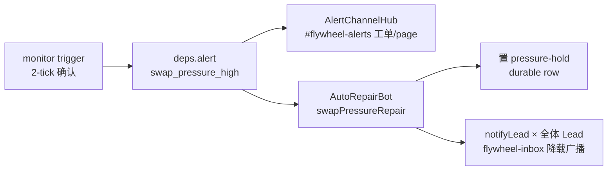

# FLY-1193 OOM pressure-hold 告警瞬时 spike 误触发 — 探索

Issue: FLY-1193 (https://linear.app/geoforge3d/issue/FLY-1193/stabilitynoise-oom-pressure-hold-告警在瞬时-spike-上误触发-pagere-deliver-需)
日期: 2026-07-12
基于: 无(上游参考 engineering/doc/FLY-1142-swap-sensor-real-pressure/)

---

## 1. 现象回顾(issue 原文 + 本次审计补证)

2026-07-11 晚(FLY-1189 N-to-N campaign,机器繁忙,runner 23→25):

- OOM pressure-hold 告警触发 2 条,经 flywheel-inbox 轰炸 ~20+ 次;
- 每条都是**自解的 transient spike**:告警报 free 19.2%/19.6%,Cass 秒级复查已回 37%、swapout rate=0、load 在掉;
- free% 在 ~19%↔37% 之间每 ~30s 震荡,每起一个新 runner 瞬时蹭一下低位、几秒又弹回。

**本次审计补证(2026-07-12)**:病还在活跃 —— `~/.flywheel/teamlead.db` 的 `alert_threads` 表里最新一条 `swap_pressure_high` 工单 **opened 09:04:31、resolved 09:05:01**,episode 全生命周期 30 秒(恰好一个 watchdog tick),又一次「触发即自愈」的 spike page。

## 2. 审计事实(部分修正 issue 的机制描述)

逐条核对了生产代码与生产配置,三个关键事实:

### 事实 A:真实触发分支是 swapout-delta,不是 free% 低于阈值

- 生产 env(`~/.flywheel/.env`)只有 FLY-1142 **已不再读取**的旧键(`FLYWHEEL_SWAP_PRESSURE_*`),新键 `FLYWHEEL_MEM_*` 全部未设 → 生产跑**默认阈值**:`FREE_LOW=8` / `FREE_HIGH=15` / `SWAPOUT_MIN=0`(`machine-watermark.ts:135-136`,部署 dist 已核对一致)。
- 告警报的 free 19.2%/19.6% **高于 LOW=8**,free% 分支不可能触发。
- danger 判定是 OR:`freePct < 8` **或** `swapoutDelta > 0`(MIN=0)。**繁忙机器上 30s 窗口内哪怕 1 页 swapout 都算 danger tick**;起新 runner 的瞬时内存分配正好造成短暂 swapout 脉冲,连续两个 tick 有几页 swapout → 2-tick 确认被穿透 → trigger → page。
- issue 说「瞬时蹭一下 19% 阈值」是从告警文案(`当前 free 19.2%`)反推的表象;19% 不是任何阈值,真正的扳机是 swapout 脉冲。

**设计影响**:debounce 若照 issue 字面只看「free% 持续低于阈值 N 秒」,**根本拦不住这次误报**(free 分支从头到尾没触发)。debounce 必须作用于「pressure episode(OR 两分支)持续 ≥ N 秒」。

### 事实 B:MIN=0 是未经繁忙机器校准的 provisional 值,FLY-1142 计划自己就要求先校准再 ship

FLY-1142 plan §2 原文:「若正常峰值下出现连续低量 swapout,先用观测分布调 MIN 再 ship(不硬 ship 0)」。但当时的 soak 校准(`evidence-soak-calibration.txt`,2026-07-11 00:36 起)是在**安静机器**上跑的 —— 全程 `swapoutDelta=0`,0 个 danger 样本,繁忙分布从未被观测。7-11 晚的繁忙窗口就是缺失的那份校准数据:正常繁忙负载**本来就有**瞬时低量 swapout,MIN=0 把它们全判成 danger。

### 事实 C:hold 置位在 alert 管道下游 —— 「hold 保留 + page debounce」必须先解耦

现状链路(`fleet-sensors.ts` + `AutoRepairBot.ts` + `plugin.ts:6364`):

**hold 是 alert 的下游动作**。直接给 alert 加 debounce = hold 也被 debounce,违背 issue 明确要求(「hold-throttle 在 spike 上触发是对的 —— 保留」)。所以改法必然包含一次解耦:trigger 时置 hold(静默),page(告警工单 + Lead 降载广播)才走 debounce。

### 边界确认(不属于本单)

- **FLY-1139**:acked 后仍持续投递 7+ 次的 re-deliver 放大 —— 投递机制本身的病,本单不碰;本单把「告警产生次数」压下来,1139 把「单条告警的重复投递」修掉,两者合起来消掉整个轰炸。
- **FLY-1183**:alert-dispatcher `bridge_abnormal_exit` 误报 —— 同族但不同代码路径。
- **FLY-517**:多机/容量 —— 根治繁忙本身,本单只治噪音。
- 并发检查:git 上无其他 in-flight 分支碰 `fleet-sensors.ts` / `machine-watermark.ts`。

## 3. 问题定义

> 繁忙机器上,自恢复的瞬时内存脉冲(几秒~30s)不该惊扰人(page 工单 + @Lead inbox 广播);只有**持续**的真实压力才值得 page。保护动作(pressure-hold 暂停派发)是零打扰的内部状态,应当在 spike 上照旧立即生效、自愈后静默解除。

拆成两个正交的失真:

1. **动作失真**:page(人面)与 hold(机器面)绑在同一个触发点 —— 该分开:hold 即时、page 慢热。
2. **判定失真**:MIN=0 让「danger」的定义在繁忙机器上失真(正常代谢性 swapout 被判成 thrash 前兆)。

## 4. 方案选项

### 方案 A(推荐):sensor 内解耦 + episode 持续时长 debounce

- `MemoryPressureMonitor` 状态机**不动**(2-tick trigger / 三态 health / PROVEN-health 解除,FLY-1142 的 restart-safety 全保留)。
- `FleetSensors.swapTick`:
  - `trigger` → **直接置 hold**(`store.setFleetPressureHold`,幂等)—— 不再等 alert→repair 绕一圈,spike 保护反而比现在**更早**;**不发任何人面消息**。
  - episode 存活期间每 tick 检查:`now - episodeStart ≥ N 秒` 且尚未 page → 发 alert(page),eventId 沿用 `swap-pressure:${episodeStart}`(dedup 语义不变)。
  - `clear`(N 秒内自愈)→ 静默 lift hold,零打扰(没 page 过就没有工单要 resolve)。
  - `clear`(已 page)→ lift + resolve 工单,与现状一致。
- `swapPressureRepair`(AutoRepairBot 路径)保留,职责变为:确保 hold + **补发 Lead 降载广播**(广播跟着 page 走,即已 debounce;per-episode 广播闩防 T2 retry 重复广播)。
- 新 env:`FLYWHEEL_MEM_PAGE_DEBOUNCE_SEC`,默认 **120**(4 个 tick;从 trigger 起算,加上 trigger 自带的 2-tick 确认,等效「首个 danger 采样起 ~3 分钟持续压力才 page」)。`0` = 关 debounce,回退旧行为(逃生口)。
- 重启语义:episodeStart 在内存,重启丢失 → fresh monitor 重新 2-tick 确认 + 重新计 N —— 真压力跨重启最坏晚 60s+N 才 page,可接受;durable hold 行为(FLY-1142「只在 PROVEN 健康时 lift」)不碰。

### 方案 B:alert 管道通用 debounce 层(否)

在 AlertChannelHub/alert sink 加 pending 队列 + 延迟发。更「通用」,但:pending 告警要持久化、restart 竞态、resolve 竞态全要新做;且 hold 置位依赖 alert 管道,还是得先做方案 A 的解耦才行 —— 等于 A 的工作量再加一层过度工程。FLY-1183 同族病根在 dispatcher 判定,不在缺通用延迟层。

### 方案 C:只调 MIN 不做 debounce(否,不完整)

把 SWAPOUT_MIN 从 0 提到繁忙机器噪声水位之上,误报大概率消失。但:① 违背 issue 明确要求的 debounce 修法;② 只调 MIN 是把「瞬时 vs 持续」的区分寄托在阈值猜得准 —— 下次繁忙形态变了(更多 runner、别的负载)又穿透;debounce 是结构性的时间维度区分,阈值只是灵敏度。

### 附带建议(随方案 A 一起,Tadashi 拍板)

**MIN 重校准**:FLY-1142 plan 本来就要求用观测分布调 MIN 再 ship,只是 soak 跑在安静机器上漏了。建议 implement 阶段在繁忙窗口补一次 soak(或直接用 7-11 晚 + 7-12 晨的 episode 数据),把 MIN 提到正常繁忙 swapout 脉冲之上(量级预期几十~几百页/tick,以实测为准)。这与 debounce 正交:debounce 治「page 的时机」,MIN 治「danger 的定义」。两个都上,防御纵深;只上 debounce 也能过验收(episode 30s 即 clear 的实证)。

## 5. 验收对齐(issue 原文)

| issue 验收 | 方案 A 的落点 |
|---|---|
| 繁忙机器 free% 瞬时 dip、N 秒内自恢复 → 不 page、不 re-deliver | episode < N 秒 → 无 alert、无工单、无 Lead 广播;仅静默 hold 置/撤 |
| 持续 ≥ N 秒低 free% 才告警 | episode ≥ N 秒 → page 一次(claims + active-ticket dedup 不变) |
| throttle-hold 行为不受影响 | hold 在 trigger 即置(比现状更早),PROVEN-health 自动解除逻辑逐字不动 |

## 6. 待 Lead 确认的点

1. 方案 A 的解耦形状(hold 移到 sensor 直置、广播跟 page 走)是否认可;
2. debounce 语义按「episode(OR 两分支)持续 ≥ N 秒」而非 issue 字面的「free% 持续低」(事实 A:字面版拦不住实际误报);
3. N 默认 120s 是否合适;
4. MIN 重校准是否并入本单(推荐并入,implement 阶段用繁忙窗口实测定值)。
