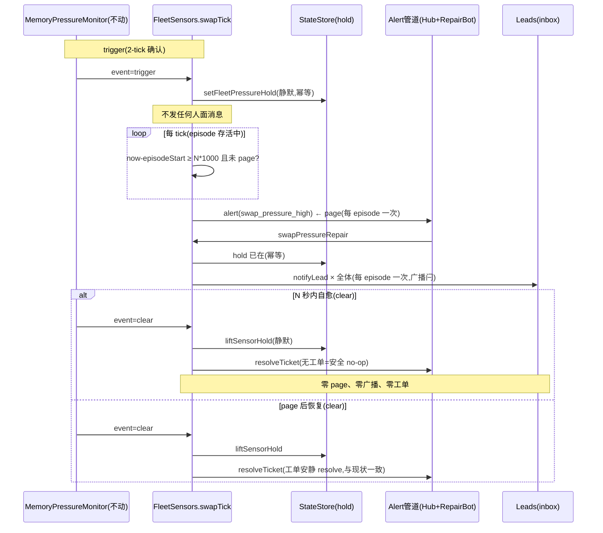

# FLY-1193 OOM 告警 debounce — 调研

Issue: FLY-1193 (https://linear.app/geoforge3d/issue/FLY-1193/stabilitynoise-oom-pressure-hold-告警在瞬时-spike-上误触发-pagere-deliver-需)
日期: 2026-07-12
基于: exploration.md

---

## 1. 现状架构盘点(逐文件、逐行核对)

### 1.1 节拍

- watchdog tick = **30s**(`plugin.ts:6844` 的 `pollIntervalMs: 30_000`);`FleetSensors.tick()` 挂在 `LeadWatchdog.onPollComplete`(`plugin.ts:6903`),零独立 timer(FLY-169 规范)。

### 1.2 检测层:`machine-watermark.ts`(FLY-1142,**本单不动**)

- `MemoryPressureMonitor.tick()`:2-tick danger 确认 → `trigger`;`healthy===true`(free% ≥ HIGH **且** delta ≤ MIN 且 delta 可算)→ `clear`;三态 health,unknown 永不解除 —— **restart-safety 硬约束,逐字保留**(Tadashi gate 确认)。
- `danger = freePct < LOW || (delta != null && delta > MIN)`(OR 两分支)。
- 阈值:`memPressureThresholdsFromEnv` — 生产未设 env,默认 LOW=8 / HIGH=15 / **MIN=0**。
- `episodeStartedAt` = trigger 时刻,in-memory(重启丢,by design)。

### 1.3 动作层:`fleet-sensors.ts` `swapTick()`(**本单主改动面**)

现状(`fleet-sensors.ts:135-176`):

| monitor 事件 | 现状动作 |
|---|---|
| `trigger` | 立即 `deps.alert(swap_pressure_high)`,eventId=`swap-pressure:${episodeStart}` |
| `clear` | `liftSensorHold()` + `resolveTicket(correlationKey)` |
| 非 pressure 且 `healthy===true` | `liftSensorHold()`(重启后 stranded hold 的 PROVEN-health 解除,FLY-1142 Codex R1 HIGH-1) |

### 1.4 告警管道(alert 之后发生什么)

```
deps.alert = routedAlertSink.alert (plugin.ts:6578)
  → AlertChannelHub:#flywheel-alerts 开 🎫 工单 thread(severity=severe)
  → AutoRepairBot.attempt(swap_pressure_high) (AutoRepairBot.ts:182)
      → fleetRepair.swapPressure = FleetSensors.swapPressureRepair (plugin.ts:6364-6367)
          → store.setFleetPressureHold({setBy:"swap-sensor"})   ← hold 在这里才置!
          → notifyLead × 全体 Lead(CommDB inbox 降载广播)      ← inbox 惊扰源
```

**关键耦合**:hold 置位与 Lead 广播都在 alert 下游。`swapPressureRepair` 现状:`placed===false`(hold 已存在)时**提前返回、不广播**(`fleet-sensors.ts:201-207`)。

### 1.5 hold 消费端(语义必须不变)

- `StateStore.setFleetPressureHold/getFleetPressureHold/clearFleetPressureHold`(`StateStore.ts:4988-5021`),durable 行,`set_by="swap-sensor"`。
- runner 派发准入:`config.runnerAdmission.setPressureHoldProbe`(`plugin.ts:3157-3163`)—— 只读 store,不关心谁置的、何时置的 → **hold 提前到 trigger 时置,消费端零感知**。
- `liftSensorHold` 只清 `set_by==="swap-sensor"` 的行(手动 hold 永不误清)。

### 1.6 dedup / resolve / recovery 既有语义

- eventId=`swap-pressure:${episodeStart}` → claims.db 永久 dedup + Hub active-ticket 按 correlation key 线程复用。**debounce 后 page 时 episodeStart 早已固定,eventId 语义不变**。
- `hub.resolve(ck)` 对不存在的工单是安全 no-op(`AlertChannelHub.ts:678-679` `if (!active) return`)→ **clear 路径无条件 resolveTicket 可保留**(还顺便覆盖跨部署边界的旧工单)。
- `recoveryProbe("swap_pressure_high")` 读 `memMonitor.lastEvaluation.healthy`(三态)—— 工单只在 page 后才存在,probe 语义不变。
- AutoRepairBot T2 reconcile retry 会用 MINIMAL payload 重调 repair(无 metadata)—— `swapPressureRepair` 本来就不读 metadata,兼容。

### 1.7 触发事实(生产数据)

- 7-11 晚 2 条告警:free 19.2%/19.6% > LOW=8 → **swapout-delta 分支触发**(MIN=0,繁忙机器 30s 窗口 ≥1 页 swapout 即 danger)。
- 7-12 09:04:31 → 09:05:01:episode 30 秒即自愈(`alert_threads` 表)。
- FLY-1142 soak(`evidence-soak-calibration.txt`,7-11 00:36 起,安静机器):全程 delta=0、0 danger 样本 —— **繁忙 swapout 分布从未被观测**,MIN=0 的「先校准再 ship」前提在繁忙场景缺失。

## 2. 方案 A 细化(gate 已批)

### 2.1 新时序



### 2.2 FleetSensors 新增 episode 状态(全部 in-memory)

| 字段 | 语义 | 生命周期 |
|---|---|---|
| `episodePagedAt: number \| null` | 本 episode 是否已 page(防重复 page) | trigger 置 null,page 时置 now,clear 置 null |
| `episodeBroadcastDone: boolean` | 本 episode 是否已广播降载(防 T2 retry 重复广播) | trigger 置 false,广播后置 true,clear 置 false |

**为什么 in-memory 够**:重启丢失 → fresh monitor 重新 2-tick 确认 + 重新计 N。真压力跨重启最坏 60s+N 后再 page 一次(新 episodeStart → 新 eventId → Hub 按 correlation key 复用既有 ACTIVE 工单线程,claims 是新身份 —— 与现状重启行为同构);瞬时 spike 跨重启则什么都不发生。durable hold 行为(PROVEN-health 才 lift)在 1.2/1.3 已覆盖,不碰。

### 2.3 `swapPressureRepair` 重构

职责从「置 hold + 广播」变为「确保 hold + 补广播(带闩)」:

- hold:`setFleetPressureHold` 照调(幂等;正常路径下 sensor 已在 trigger 时置好,返回 false);
- 广播:`!episodeBroadcastDone` → notifyLead 全体 + 置 true;否则返回幂等文案。**广播决策不再依赖 `placed` 布尔**(现状 bug 面:sensor 先置 hold 后,repair 的 `!placed` 提前返回会吞掉广播)。
- 返回文案更新:区分「hold 已由 sensor 置于 <时刻>,本次补发降载广播」/「幂等重入」。

### 2.4 新 env:`FLYWHEEL_MEM_PAGE_DEBOUNCE_SEC`

- 默认 **120**(= trigger 后 4 个 tick;算上 trigger 自带 2-tick 确认,等效「首个 danger 采样起 ~3 分钟持续压力」才 page)。
- validator:finite 非负数;负 / NaN / 非数 → default 120。**0 = 关 debounce**(trigger tick 上 elapsed=0 ≥ 0 立即 page,精确回退旧行为 —— 逃生口 + reverse-compat 测试锚点)。
- page 条件:`inPressure && episodePagedAt==null && now - episodeStart >= N*1000`,在每个 tick 的 swapTick 尾部检查(trigger tick 本身 elapsed=0,N>0 时不 page)。

### 2.5 告警文案更新(page 语义变了)

body 从「连续 2 tick 确认」改为如实描述:压力已持续 ≥ elapsed 秒(episodeStart 起算)、当前 free% / swapout-delta、hold 已于 trigger 时置位(不是「将置」)。人话、无黑话(founder 面文案规范)。

### 2.6 MIN 重校准(gate 批准并入)

- **正交性**:danger 判定(`delta > MIN`)与 healthy 判定(`delta ≤ MIN`)共用 MIN —— 调大 MIN 同时让 danger 更难触发、healthy 更易证明 → 两侧一致地把「代谢性 swapout」归为正常。方向自洽,无单侧风险。
- **定值方法(implement 阶段)**:复用 FLY-1142 的 soak 工具(`evidence-soak-script.mjs`,读 `FLYWHEEL_SWAP_SENSOR_CMD` 注入缝或真 vm_stat)在**繁忙窗口**(当前生产常态 20+ runner)跑 ≥ 2h,记录 `{freePct, swapoutDelta}` 分布;MIN 取繁忙噪声天花板 × 安全余量(预期量级几十~几百页/tick,以实测为准)。**改代码默认值**(所有未来部署受益),env 覆盖保留。数据与定值依据入 PR。
- **不做合成压力**:在生产 host 上人为制造内存压力有真 OOM 风险(7-09 事故先例);观测有机繁忙窗口即可,soak 本身只读 vm_stat 零侵入。
- **风险披露**:若繁忙分布显示常态 swapout 天花板过高(接近真 thrash 水位),则 MIN 无法安全调大 —— 此时只上 debounce(单独已可过验收:实证 episode 30s 即 clear),MIN 维持 0 并在 PR 里记录分布数据留给 FLY-517 多机根治。

## 3. 边界与不变量清单

| 不变量 | 保证方式 |
|---|---|
| `MemoryPressureMonitor` 状态机逐字不动 | 本单零修改该文件的状态机逻辑(仅可能改 MIN 默认值常量);`machine-watermark.test.ts` 既有用例必须全绿 |
| hold 消费端(runner admission)零感知 | 只读 store,置位时机提前不改变行接口 |
| 手动 hold 永不误清 | `liftSensorHold` 的 `set_by` 检查不动 |
| eventId / claims / Hub 线程复用语义不变 | eventId 公式不变,page 只是推迟 |
| N=0 逐字回退旧行为 | reverse-compat 测试锚点 |
| FLY-1139(re-deliver 放大)不碰 | 投递机制零改动;本单只减少告警产生数 |
| FLY-1183 / FLY-517 不碰 | 不同代码路径 |

## 4. 测试策略

### 4.1 单测(`fleet-sensors.test.ts` 扩展 + `machine-watermark.test.ts` 不动全绿)

1. **spike < N**:trigger → hold 立即置、**零 alert**;clear → hold lift、resolveTicket 调用(no-op 安全)、全程零 alert。
2. **持续 ≥ N**:trigger → hold、无 alert;推进 tick 到 elapsed ≥ N → alert 恰好一次(eventId=episodeStart);后续 tick 不重复 page。
3. **N=0**:trigger tick 立即 alert(旧行为逐字复现)。
4. **page 后 clear**:lift + resolve(现状语义)。
5. **广播闩**:page 后 repair → notifyLead 全体一次;同 episode 重入 repair(模拟 T2 retry)→ 不重播;新 episode → 重新广播。
6. **sensor 已置 hold 时 repair 仍广播**(现状 `!placed` 提前返回吞广播的反例锚点)。
7. **重启中途**:带 durable hold 行的 fresh FleetSensors → 再 trigger 幂等、debounce 重计、page 一次。
8. **env validator**:默认/0/负/NaN/非数。

### 4.2 真机 E2E(implement 阶段,复用 FLY-1142 注入缝)

`FLYWHEEL_SWAP_SENSOR_CMD` 喂假 vm_stat 序列(零真实内存压力,安全):
- 序列 ①(spike):2 tick danger → 恢复 → 断言无 Discord 工单、无 Lead inbox 消息、hold 曾置又清(store 查询);
- 序列 ②(持续):danger 持续 > N → 断言恰好 1 工单 + 1 轮广播,恢复后工单安静 resolve;
- 序列 ③(N=0 对照):trigger 即 page。
繁忙窗口 soak(§2.6)同步收 MIN 校准数据。

## 5. 悬而未决 → 已决

| 问题 | 决定(gate) |
|---|---|
| debounce 按 free% 字面还是 episode | episode(OR 两分支)—— 字面版拦不住实际误报 |
| N 默认 | 120s |
| MIN 重校准归属 | 并入本单,implement 用繁忙实测定值 |
| hold 置位时机 | trigger 时 sensor 直置(更早、静默) |
| 1142 状态机 | 硬约束:逐字不动 |
