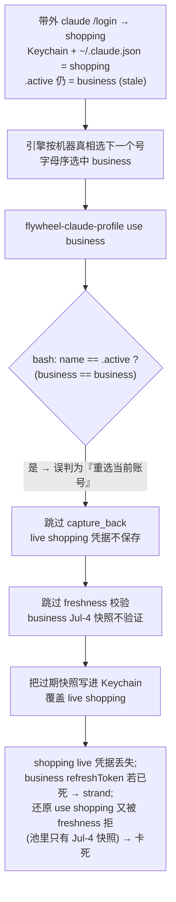

# FLY-1201 账号切换 stale .active 覆盖 live 凭据 — 探索

Issue: FLY-1201 (https://linear.app/geoforge3d/issue/FLY-1201/bug-account-switch-引擎带外登录留下-stale-active-时切号会覆盖-live-凭据跳过-capture-back)
日期: 2026-07-19
基于: 无(上游素材 = FLY-1182 Track D 只读审计 q 3ad746fe + `engineering/doc/FLY-1182-quota-switch-ignition/qa-report.md` §9-10)

## 1. 问题一句话

`flywheel-claude-profile use <name>` 的 `name == active` 判断**只信 pool 台账 `.active` 文件**;当 founder 在引擎外用 `claude /login` 换过号(`.active` 没人更新 → stale)时,这个判断把「切到别的账号」误认成「重选当前账号」,于是**跳过 capture_back(live 凭据不保存)+ 跳过 freshness 校验(陈旧快照不验证)**,直接把过期快照写进 Keychain,覆盖并丢失正在飞的 live 登录 —— 撞「切换绝不弄坏登录」红线。

## 2. 触发态与故障链(2026-07-12 实查态)

触发态:founder 带外 `claude /login` 切到 shopping → 机器真相(Keychain token + `~/.claude.json` oauthAccount)= shopping,但 `pool/.active` 仍 = business(带外登录不经过 pool 引擎)。

## 3. 代码定位(main @ e59a02389,worktree 实读)

两处短路都在 `packages/claude-runner/bin/flywheel-claude-profile`,都以 `.active` 为唯一依据:

| 短路 | 位置 | 现行为 |
|---|---|---|
| freshness 跳过 | `prepare_profile_locked` (~L1714):`if [[ "$name" != "$active" ]]` 才跑 `freshness_check` | `name == active` → 目标池内快照不做 probe-refresh 验证 |
| capture_back 跳过 | `commit_profile_locked` (~L1770):`if [[ -n "$active" && "$active" != "$name" ]]` 才跑 capture_back | `name == active` → 当前 Keychain live 凭据不回存池 |

其中 `$active` 来自 `get_active()` = 读 `$POOL_DIR/.active` 一个文件,与机器真相零对账。

**还有第二条更隐蔽的丢数据缝**(同根因,issue 文本未列但审计中必然存在):`.active` stale 且切换目标 ≠ stale 值时(如 `.active`=business、机器=shopping、`use school`),capture_back 会拿 **business 的 anchor** 去断言当前 Keychain token(实为 shopping)→ mismatch → FLY-1182 assertion B 按设计「emit drift 标记 + 跳过 capture、切换继续」→ live shopping 凭据同样**静默不保存**(shopping 槽还是旧快照,之后切回 shopping 会被 freshness 拒 → 该账号 strand 到人工重登录)。assertion B 的「不把未验证 token 写进槽」本身是对的;错在它拿 **stale 的 `.active`** 当「当前账号是谁」的答案,导致找错了该断言的槽。

## 4. 为什么现有兜底没接住(逐层)

1. **bash 层**:`name == active` 分支的注释自述「re-selecting the current active (name == active) skips the probe (it re-writes the same account)」—— 假设 `.active` 就是机器现状。带外登录打破该假设,判断失真。
2. **TS 引擎层(时间线关键)**:issue 建单(07-12)时,执行器以 identity 干净解析出机器账号、ambiguity fail-close 不触发,故障链可走到底。建单**之后**,FLY-1182 落地(#618/#624 07-16 加固、#615 07-18 merge)引入 `machine-account.ts` 三见证权威(`.active` marker / 台账 ledger / `~/.claude.json` identity 三者必须一致才 `resolved`),并接线进 `makeClaudeProfileSwitchDeps` → 本触发态(marker≠identity)现在会在**执行器层** fail-closed(`machine_account_conflict`,severe alert,human_by_design)。**即:引擎自动路径今天不再 clobber —— 但也不自愈**:stale `.active` 永远 stale,quota cap 被丢弃、runner 卡住,等人工介入。
3. **人工介入的死循环**:alert 之后,founder / Infra Bot 修这个态的自然动作恰恰是 `flywheel-claude-profile use <某账号>` —— 而这条命令本身就是踩雷命令(§2 的故障链走 bash 直连,不经过 TS 权威)。**兜底把人引向雷区**。

## 5. 受影响调用面

| 调用方 | 走 TS 权威? | 当前风险 |
|---|---|---|
| Bridge/daemon 自动切换(switch-executor → applyProfile) | ✅ 有(conflict fail-close) | 不 clobber,但 strand(cap 丢弃 + 不自愈) |
| founder / Infra Bot / runbook 手动 `use` / `next` | ❌ 无 | **clobber + 静默丢 capture 全额暴露**(根因所在) |
| QA/演练脚本(qa-fly-1182-isolated-switch-drill.sh 等) | ❌ 无 | 同上(隔离 pool 下风险受限) |
| `capture` 命令 | n/a | 安全:capture 已强制「Keychain identity == 目标槽 anchor」 |

## 6. 要做(issue 钦定的根因修方向)

`use` 的 `name==active` 短路**不能只信 `.active`**:先用机器真相(`~/.claude.json` identity)核对 `.active` 是否等于机器现状;分歧(stale)时必须**先 capture_back 机器现状 + 对账 `.active`**,再走切换/freshness,绝不跳过。

## 7. 方案选项

### 方案 A(推荐):bash 层 reconcile-first —— 进 `use`/`next` 后、切换前对账 `.active`

在 `use_profile` / `next_profile` 拿到锁、journal 对账(`reconcile_after_acquire`)之后,增加一步 **stale-marker 对账**:

1. **零成本检测**(两个本地文件读,无网络):`read_display_identity()`(`~/.claude.json` oauthAccount uuid+email)对比 `.active` 槽的 `identity-anchor.json`。一致 → 零行为变化,照旧走。
2. **分歧(stale)→ 修复后再切**:
   - 按 display identity 在池内 anchor 里找**恰好一个**匹配槽 = 机器真账号 true_active;
   - 用 identity probe 验证当前 Keychain token 确属 true_active(复用 `identity_assert_value`,不把未验证 token 写进任何槽 —— 保持 assertion B 的红线);
   - `capture_back` live 凭据进 true_active 槽(复用现有函数,自带 identity_verify_payload 防线);
   - 原子改写 `.active` → true_active(复用 `write_active_from_reconcile`)+ `active_sync_store force` 同步台账;
   - 以修正后的 active 继续正常切换流:目标 ≠ true_active → freshness 照跑(business 的 Jul-4 死快照会被 exit 30 拒掉,Keychain/.active 不动);目标 == true_active(还原场景)→ 短路此时才是真的「重选当前账号」,且池内快照刚被 capture 成 live 字节 → 重写无害。
3. **修不动就不切(fail-closed,新 exit code)**:display identity 不可读 / active 槽 anchor 无效 / 0 或 >1 槽匹配 / Keychain token 与 display identity 不一致 —— 全部拒绝切换、Keychain/`.active` 不动、发 stable stderr 标记 + audit。绝不猜。
4. **TS 适配**:`claude-profile-cli.ts` 把新 exit code 映射成新 typed error;`switch-executor` 按 environmental fail-close 处理(比照 `FreshnessUnavailableError`:不 flag 目标账号、不轮转候选)。

优点:根因层(唯一裸信 `.active` 的地方)一次修死;`use`/`next` 共享同一 prepare/commit 路径,一处对账两命令全覆盖;顺带把 §3 第二条静默丢 capture 缝也治掉;修好后「人工修复命令」从踩雷命令变成安全 + 自愈命令(任何一次 `use` 都会先把 stale 台账对齐)。健康路径零行为变化(检测只是两个本地读)。

### 方案 B(否):只 guard `name==active` 那一个分支

在短路分支里加 display-identity 核对,分歧才展开。**不够**:目标 ≠ stale-active 时的静默丢 capture(§3 第二缝)原样保留;且修复逻辑仍要找 true_active、capture、对账 —— 代码量与 A 相当,覆盖面却窄一截。

### 方案 C(否,超范围):TS 权威层自愈(conflict → 自动 reconcile 后放行)

改 `machine-account.ts` / `switch-executor`,让 conflict-但-identity-干净态自动对账放行。这是引擎便利性增强,不是根因(bash 直连路径依然裸奔);动 CAS/三见证语义 blast radius 大,且 FLY-1182 刚刚在 Codex R5-R8 把这套语义收敛过。**本单不做**;A 落地后,引擎 conflict alert 的人工/Bot 修复动作(跑一次 `use`)天然完成对账,自愈闭环已经通,是否再让引擎自动跑留给后续单。

## 8. 关键设计约束(从现有代码继承,不可破)

- **红线**:「切换绝不弄坏 claude 登录」—— 一切 fail-closed 路径必须 Keychain/`.active` 双不动。
- **绝不把未验证 token 写进池槽**(FLY-1182 assertion B)。对账中的 capture_back 必须先 probe 断言。
- **ACTIVE 账号永不 pool-refresh**(freshness 注释:live session 拥有 token family,pool 端 refresh 会撬走 family)。对账修正 active 之后,该不变量以 true_active 为准。
- **byte-compat**:三见证一致(健康态)时行为逐字节不变;delegated(引擎)路径的 bypass 禁令(`FLYWHEEL_PROFILE_IDENTITY_BYPASS` 在 delegated 模式被拒)照旧覆盖新对账步骤。
- exit code 空间已占用:30-39、44、86-88、130/143 —— 新码需避让。

## 9. 悬而未决(带进 research)

1. 新 exit code 取值与语义拆分(一个码还是「不可对账 / 对账动作失败」两个码);CLI 映射 + switch-executor reasonCode 的确切接法。
2. `.active` 缺失(空池新机)与 display identity 缺失(从未登录)的边界行为——现状是什么、要不要保持。
3. 对账过程的崩溃安全:capture → `.active` 写 → store sync 三步中途崩,重跑是否幂等收敛(初判是,需逐步论证)。
4. `next_profile` 的候选循环里 active 值的传递(循环外读一次,对账后要更新循环用值)。
5. audit log / `FLYWHEEL_APPLY_REPORT_FILE` identityChecks 要不要长新 checkpoint(初判不长,保 CLI 解析白名单 byte-compat,用 stderr 标记 + audit_append 承载)。
6. 测试矩阵:hermetic harness(stub security/curl/scratch pool + scratch `~/.claude.json`)已就位,需列全场景(incident 复现 = 修前红、修后绿的突变对照)。
