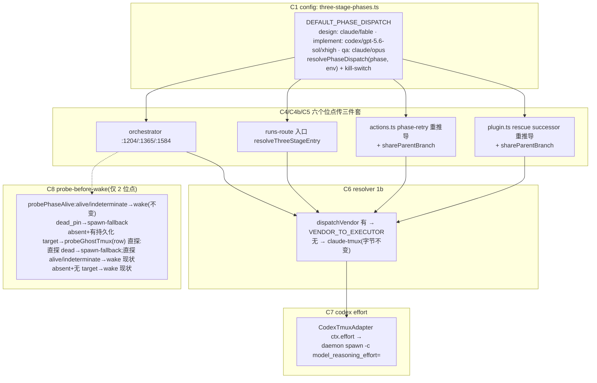

# FLY-1224 三段式 per-phase vendor — 实施计划

Issue: FLY-1224 (https://linear.app/geoforge3d/issue/FLY-1224/build-三段式-per-phase-vendor-designfable-implementcodex-gpt-56-solxhigh)
日期: 2026-07-13
基于: research.md

## 0. 状态

- Brainstorm gate:**Lead(Tadashi)已批准**,含 ⑤ probe-before-wake 纳入(三条硬约束:真探针证据入 plan / 突变测试摘 probe 必红 / 只碰 2 个 wake 位点)与附加项(founder 直令:restart-services.sh idle-wait 默认去掉,独立 commit)。
- Codex design review **4 轮 APPROVED**:R1 CHANGES REQUESTED(7 项全采纳:第 6 条 rescue lane + phase retry 丢共享分支身份、absent 非 fail-closed、pending 显示撒谎、restart 测试假绿、runbook 失准、跨包验证/类型、观测边界);R2 CHANGES REQUESTED(4 项:wake 位点就地 probeGhostTmux 直探、两处编译性问题、sessionRole 跟 durable 判别 + FLY-840 标签欠账顺带解决、kill-switch 时序);R3 CHANGES REQUESTED(2 项:terminate 不是可 retry 终态 → runbook 收紧到 failed/blocked/rejected、mermaid 图同步);R4 APPROVED。**R4 后追加**:Annie 直令(交叉审对称性)经 Lead 下达 → 新增 C10/T13 + research §9 → R5 CHANGES REQUESTED(4 项:review 状态机全三态+换轮循环、codex_review_job 表名+锚点端到端断言、claude 无章遗留豁免 grandfather 定案、effort 接线到 coordinator 层+审稿失败运维行)→ R6 **APPROVED**(共 6 轮)。反馈档:本文件夹 design-review-round{1..6}.md(自 /tmp 存档)。

## 1. 目标 / 非目标

**目标**
1. 三段式默认 per-phase vendor:design=(claude, claude-fable-5)、implement=(codex, gpt-5.6-sol, xhigh)、qa=(claude, claude-opus-4-8)。
2. **6 个** phase 供给位点统一携带 `{model, vendor, effort}`:orchestrator×3、runs-route 入口、actions.ts phase-retry、**FLY-871 rescue successor(R1 #1 抓出的第 6 条 lane)**;resolver layer 1b 接受显式 vendor(经既有 `VENDOR_TO_EXECUTOR`)。
3. phase 行的 retry / rescue 补齐共享分支身份(`shareParentBranch: true`,phase-row-scoped;R1 #1)——否则 implement 段 retry 会以非 phase 形态重建分支,quota 恢复路径不安全。
4. effort 打通 codex 通路(daemon spawn `-c model_reasoning_effort=`;R1 已实测本机 codex CLI 接受该 argv 且 gpt-5.6-sol/xhigh 在册)。
5. probe-before-wake:2 个 wake 位点 wake 前真探活;**dead 判定分级**(R1 #2 + R2 #1):dead_pin 无条件落 spawn-fallback;absent 且行有持久化 tmux_session → **就地用 deps 现成的 `probeGhostTmux(row)` 直探该 target**(ghostGuard 不保证探到本行:重查可能 throw→放行、且只探最新 3 行)——直探 dead_pin/absent 才落 spawn-fallback(fallback 内既有 ghostGuard 照跑,防其它污染行),直探 alive/indeterminate → 维持 wake/reconcile 现状;absent 且无持久化 target → 维持现状 wake 路径(fail-closed)。
6. 展示诚实(R1 #3 扩面):active 行(runner_model=gpt-5.6-sol)与 **pending/fallback 行**(计划模型)都显示 GPT —— fallback 从 `resolvePhaseDispatch(role).model`(含 kill-switch)推导,legacy tier 只作最后未知兜底。
7. **交叉审对称性(Annie 直令 2026-07-13 18:08Z,经 Tadashi;research §9)**:「作者厂商 ≠ 审稿厂商」双向定死 —— Claude 写 → Codex 审(现状);Codex 写 → **Claude 审**(Opus + effort xhigh);gate 层硬拒同厂商自审;审计可回查。FLY-1188 §7.1-7.3 已结构性满足大半(本票验证+测试),两个真缺口必修:Blueprint 给 codex 作者补 **code-review lane 指引**(否则 implement=codex 的 FLY-827 code gate 挂空、pipeline 卡死)+ claude 审稿加 `--effort xhigh`。
8. 附加(独立 commit):restart-services.sh idle-wait 默认跳过,`--wait-idle`/env 恢复;**hermetic 行为级测试**(R1 #4:dry-run 早退,文案断言是假绿)+ 运维文案/护栏 hook 同步。

**非目标**
- 不暴露 vendor/effort 到 `/api/runs/start` HTTP body(phase 表是唯一 vendor 来源)。
- 不做 per-project phase 表配置(归 1204+1221 三段式大修)。
- 不动 auto-QA(FLY-579/752)、不动 label 层、不建 liveness 框架(dispatcher 级原子占位/探活归 FLY-1220)。
- 不给 codex phase 加 park/常驻轮询(FLY-1188 后续 milestone;本票 spawn-fallback 补位)。
- FLY-840 只做 phase-row-scoped 的 shareParentBranch/sessionRole 传播(R2 #3 确认:这一传播顺带让 phase retry 的 cmux 窗口标签变为 phase 名 —— 有意修正,测试锁定;非 phase retry 不动)。

## 2. 全景



## 3. 变更清单(file-by-file)

### C1 `packages/config/src/three-stage-phases.ts` — phase dispatch 表

```ts
import type { RoleEffort } from "./types.js"; // R1 #6:复用既有 effort 枚举

/** 三段式 phase 只允许 transported vendor(要收 park/wake mailbox、走 gate);
 *  no-transport(antigravity/kimi)在类型层就进不了表。 */
export type PhaseDispatchVendor = "claude" | "codex";

export interface PhaseDispatchSpec {
	vendor: PhaseDispatchVendor;
	/** 传给 runner CLI/thread 的 model id(claude 段沿用 MODEL_TIERS 规范 id)。 */
	model: string;
	/** reasoning effort;absent = 账户/后端默认。 */
	effort?: RoleEffort;
}

/** Annie 直令(2026-07-13):design=Fable / implement=Codex gpt-5.6-sol(xhigh) / qa=Opus。
 *  拼写 ground truth = host ~/.codex/config.toml(research §3)。 */
export const DEFAULT_PHASE_DISPATCH: Readonly<Record<ThreeStagePhase, PhaseDispatchSpec>> = {
	design:    { vendor: "claude", model: MODEL_TIERS.heavy.id },
	implement: { vendor: "codex",  model: "gpt-5.6-sol", effort: "xhigh" },
	qa:        { vendor: "claude", model: MODEL_TIERS.medium.id },
};

/** implement 段 codex 的运维 kill-switch:FLYWHEEL_THREE_STAGE_CODEX_IMPLEMENT=0
 *  → implement 回落 legacy (claude, heavy) 行(codex 账号额度打光时的逃生口;
 *  命名沿 FLYWHEEL_THREE_STAGE_QA_RESPAWN 惯例)。env 注入参数化,默认 process.env。
 *  生效条件见 §7 runbook:改 ~/.flywheel/.env 后必须 restart-services.sh --bridge-only。 */
export function resolvePhaseDispatch(
	phase: ThreeStagePhase,
	env: Record<string, string | undefined> = process.env,
): PhaseDispatchSpec {
	if (phase === "implement" && env.FLYWHEEL_THREE_STAGE_CODEX_IMPLEMENT === "0") {
		return { vendor: "claude", model: MODEL_TIERS.heavy.id };
	}
	return DEFAULT_PHASE_DISPATCH[phase];
}
```

- `resolvePhaseModel(phase)` 改为 `resolvePhaseDispatch(phase).model`(签名/导出不变;implement 返回值变为 gpt-5.6-sol —— 所有调用方在 C4-C5 同 PR 换成 resolvePhaseDispatch,无跨 PR 半态)。
- `DEFAULT_PHASE_TIER` **保留、值不变**,职责重注释为「最后未知兜底的显示 tier」;phase 显示 fallback 主链改走 dispatch 表(见 C2)。
- `phaseMessageTag(role, runnerModel)` fallback 改为:`modelDisplayName(runnerModel) ?? modelDisplayName(resolvePhaseDispatch(role).model, DEFAULT_PHASE_TIER[role])`(R1 #3 + R2 #2:pending/无 runner_model 的行按**计划派发模型**显示,kill-switch 感知;legacy tier 经 `modelDisplayName` 的公开 fallbackTier 参数兜底 —— `SHORT_CODE_DISPLAY_NAME` 是 model-tiers.ts 私有实现,不跨文件引用)。
- 文件头 per-phase 模型表注释更新为新三行 + kill-switch 说明。
- index.ts 导出 `DEFAULT_PHASE_DISPATCH` / `resolvePhaseDispatch` / `PhaseDispatchSpec` / `PhaseDispatchVendor`,并**补导出 `RoleEffort`**(R2 #2:types.ts:565 现存但未从 index 再导出,teamlead 侧新 import 会编译失败)。

### C2 显示诚实(⑥ + R1 #3)

- `packages/config/src/model-tiers.ts`:`modelDisplayName(model, fallbackTier)` 在 F/O/S/H 短码识别**之前**加 GPT 家族识别(`gpt-5.6*` → "GPT-5.6";`gpt-*` → "GPT")。`modelShortCode` 不动。claude 各输入输出字节不变。
- `packages/teamlead/src/bridge/issue-display-refresher.ts` **两处**(:287-300、:719-733):pending/planned 模型推导从 `DEFAULT_PHASE_TIER[role]` 改为 `resolvePhaseDispatch(role)`(runner_model 存在时 runner_model 优先,与现状一致);→ pending implement 显示 GPT-5.6(kill-switch=0 时显示 Fable,同表同真相)。

### C3 `packages/teamlead/src/bridge/retry-dispatcher.ts` — 请求类型

`StartRequest` 与 `RetryRequest` 各加两个可选字段(紧邻现有 `dispatchModel`):

```ts
/** FLY-1224: per-phase vendor(phase 表输出;Bridge 内部,不上 HTTP body)。
 *  仅 transported vendor —— no-transport 后端不能进 phase 派发。 */
dispatchVendor?: "claude" | "codex";
/** FLY-1224: per-phase reasoning effort(phase 表输出)。 */
dispatchEffort?: RoleEffort;
```

`PhaseOrchestratorDeps.startDispatcher.start` 的内联请求类型(phase-orchestrator.ts:217-235)同步加这两个可选字段。

### C4 派发位点(orchestrator×3 + runs-route 入口)传三件套

- `phase-orchestrator.ts:1204 / :1365 / :1584`:`resolvePhaseModel(x)` → `const d = resolvePhaseDispatch(x)`,请求加 `dispatchModel: d.model, dispatchVendor: d.vendor, ...(d.effort && { dispatchEffort: d.effort })`。
- `three-stage-policy.ts:166 resolveThreeStageEntry`:返回值并列 `dispatchVendor` / `dispatchEffort`;`runs-route.ts:598` 原样透传到 start 请求(:724 对象)。
- `runs-route.ts:777` 的 `dispatch_model` 持久化不动 —— phase 行的 vendor/effort 永远表驱动重推导,**不新增 StateStore 列**。

### C4b `plugin.ts` rescue successor(:6718 起)— 第 6 条 lane(R1 #1)

`startSuccessor` 对 **phase 行**(判据:`isThreeStagePhaseRole(s.chat_thread_role)`,与 actions.ts 同一个 durable 判别)从表重推导并补共享分支身份:

```ts
const phaseRole = isThreeStagePhaseRole(s.chat_thread_role) ? s.chat_thread_role : undefined;
const phaseDispatch = phaseRole ? resolvePhaseDispatch(phaseRole) : undefined;
const res = await startDispatcher.start({
	...,
	// R2 #3:sessionRole 同样跟 durable 判别走 —— 老/污染行可能 chat_thread_role=implement
	// 而 session_role=main,只推导 vendor 不纠 role 会以非 phase 身份起 codex。
	sessionRole: phaseRole ?? (s.session_role ?? undefined),
	dispatchModel: phaseDispatch ? phaseDispatch.model : (s.dispatch_model ?? undefined),
	dispatchVendor: phaseDispatch?.vendor,
	dispatchEffort: phaseDispatch?.effort,
	ignoreRunnerLabelSelection: phaseRole ? true : undefined,
	shareParentBranch: phaseRole ? true : undefined,
});
```

背景:orchestrator 直发的 implement/qa phase 行通常**没有**持久化 dispatch_model;现状 rescue 只转发 `s.dispatch_model`,phase 行 rescue 会回落 claude-tmux 且丢共享分支。非 phase 行:全部 undefined,字节兼容。

### C5 `actions.ts:885` — phase-row retry 重推导 + 共享分支(R1 #1)

```ts
const phaseDispatch = phaseRole ? resolvePhaseDispatch(phaseRole) : undefined;
...
dispatchModel: phaseDispatch ? phaseDispatch.model : (session.dispatch_model ?? undefined),
dispatchVendor: phaseDispatch?.vendor,
dispatchEffort: phaseDispatch?.effort,
// FLY-1224(R1 #1):phase 行 retry 补共享分支身份 —— 否则 retry 出的 implement 以
// 非 phase 形态跑(chat_thread_role 落 main、重建独立分支而非分支 B),codex retry
// / kill-switch 恢复路径不安全。FLY-840 的顾虑是"全量传播改变 retry 分支行为";
// phase-row-scoped 传播恰恰是 phase 行本该有的正确行为(FLY-887 R2 同型)。
// RetryRequest/RetryDispatcher 已支持该字段(run-dispatcher.ts:446),仅 actions 未传。
shareParentBranch: phaseRole ? true : undefined,
// R2 #3:sessionRole 同跟 durable 判别(chat_thread_role=implement 而 session_role
// 漂成 main 的行,retry 必须以 phase 身份起)。
sessionRole: phaseRole ?? sessionRole,
```

非 phase 行:vendor/effort/shareParentBranch 均 undefined、sessionRole 原样(字节兼容)。

**有意的行为扩展(R2 #3,测试锁定)**:shareParentBranch 一传,`runnerDisplayName(req.sessionRole, req.shareParentBranch)`(run-dispatcher.ts:440)会让 phase 行 retry 的 cmux 窗口标签从 `claude` 变为 `implement`/`design`/`qa` —— 这是**修正**而非回归(FLY-840 当年记的正是这个欠账),T4 断言该窗口名;actions.ts:854-859 与 run-dispatcher.ts:87-94 两处「retry 不传 shareParentBranch」的过时注释同 PR 更新。

### C6 `run-dispatcher.ts` + `role-adapter-resolver.ts` — resolver 1b 拆硬编码

- `buildRunnerSpawnFields` 位置参数在 `requireMailboxTransport`(第 7 位)后追加 `dispatchVendor?` / `dispatchEffort?`(第 8/9 位;start :727 / retry :409 两处调用补传)。
- `ResolveRoleAdapterArgs` 加 `dispatchVendor?: "claude" | "codex"`、`dispatchEffort?: RoleEffort`。
- layer 1b(:192):

```ts
if (!backend && args.role === "runner" && args.dispatchModel) {
	// FLY-1224: phase 表可显式指定 vendor;经既有 VENDOR_TO_EXECUTOR 映射,
	// 绝不新写一套(drift 风险)。不带 vendor = FLY-728 现状:claude-tmux。
	backend = args.dispatchVendor
		? VENDOR_TO_EXECUTOR[args.dispatchVendor]  // claude|codex 必有值(类型收窄)
		: "claude-tmux";
	model = args.dispatchModel;
}
```

- effort 优先级(:241):`const effort = args.dispatchEffort ?? args.projectRoles?.[args.role]?.effort;`(dispatch 层 > project roles;FLY-671「effort 独立于 backend 解析」姿态保留)。
- 4b(FLY-751 runner 默认小上下文模型)只对 `backend === "claude-tmux"` 生效 —— codex 分支天然绕过,不动。

### C7 effort → codex daemon

- `packages/core/src/adapter-types.ts:150`:effort 注释更新(claude `--effort` + codex `-c model_reasoning_effort=`)。
- `CodexTmuxAdapter.execute`(:351 runtimeFactory 调用):`...(ctx.effort ? { effort: ctx.effort } : {})`。
- `codex-daemon-goal-runtime.ts`:`CodexDaemonGoalRuntimeOptions` 加 `effort?: string`,传给 `spawnCodexDaemon`(daemon 级 config override;app-server 的 thread/start 无 effort 字段,daemon `-c` 是既有已验证机制;**R1 已实测**:本机 codex CLI 接受 `-c 'model_reasoning_effort="xhigh"'` 独立 argv,TOML 引号解析正确,daemon 轮转重启时 argv 重放)。
- `codex-daemon-runtime.ts`:新纯函数

```ts
const DAEMON_EFFORTS = new Set(["low", "medium", "high", "xhigh", "max"]);
export function buildDaemonEffortArgs(effort?: string): string[] {
	if (!effort) return [];
	if (!DAEMON_EFFORTS.has(effort)) {
		console.warn(`[codex-daemon] unsupported effort "${effort}" — ignoring (daemon uses CODEX_HOME config default)`);
		return [];
	}
	return ["-c", `model_reasoning_effort="${effort}"`];
}
```

  spawn argv(:425 `...buildDaemonSandboxArgs(opts)` 旁)追加 `...buildDaemonEffortArgs(opts.effort)`。无 effort → 零 argv(字节兼容;CODEX_HOME seed 的 config 默认生效)。

### C8 probe-before-wake(仅 2 个 wake 位点;Lead 硬约束 3 + R1 #2 分级)

`phase-orchestrator.ts`,两个位点(fix-wake :1289 `if (impl)`、handoff-wake :1504 `if (target)`)同一决策函数:

```
liveness = await deps.effects.probePhaseAlive(row)
alive          → 照旧 wake(worktree 断言/grantTurn/wake 参数逐字节不变)
indeterminate  → 照旧 wake(fail-closed 交 reconcile,不动 maybe-alive)
dead_pin       → 落既有 spawn-fallback(确证的 remain-on-exit 尸体)
absent         → 行有持久化 StateStore tmux_session ?
                   就地 direct = await deps.effects.probeGhostTmux(row)   ← R2 #1
                   direct dead_pin/absent → 落 spawn-fallback
                   direct alive/indeterminate → 维持现状 wake/reconcile 路径
                 : 维持现状 wake 路径(R1 #2:getTmuxTargetFromCommDb 把 CommDB
                   读错误也折叠成 undefined→absent —— 无持久化 target 时 absent
                   不可证伪,授权 spawn 可能在 CommDB 锁/损坏窗口里造双写)
dead 路径不执行 assertPhaseWorktreeReady、不 grantTurn、不 wake(spawn-fallback
的 TURN 由 dispatcher pre-launch seam 授,与现状一致)。
```

R2 #1 注:不能把「absent+有 target」直接交给 spawn-fallback 里的 ghostGuard 兜底 ——
`ghostGuard` 重查 `listPhaseSessionRows`(:746-756,查询 throw 时**放行 spawn**)且只探
最新 3 条带 tmux_session 的行,不保证探到本行;所以在 wake 位点**就地**用 deps 现成的
`probeGhostTmux(row)`(:287,直探本行持久化 target,绕过 CommDB 注册查询)裁决。落入
spawn-fallback 后其内的 ghostGuard 照跑(防其它污染行),职责不重叠。

**真探针证据(Lead 硬约束 1,已核)**:`probePhaseAlive`(plugin.ts:6107)→ `getTmuxTargetFromCommDb`(查 CommDB 注册行拿 tmux target;注意其 JSDoc 明示折叠 gone/error → undefined)→ `probeRunnerProcessLiveness`(tmux-lookup.ts:371)= **`tmux list-panes -F '#{pane_dead}'`** 读 tmux 服务器 pane 进程状态,四态;全链路零 StateStore/CommDB status 字段参与。codex 语义:tmux target 是 founder TUI(随 daemon 死;terminal 时 adapter killWindow → absent),且 codex 会话在 CommDB/StateStore 注册时持久化 tmux_session(T6 一并断言),所以 codex 常态死亡 = absent + 有持久化 target + 直探 absent → 走 spawn(stall 修复对常态成立);无 target 的边角保持 fail-closed。

不加新 deps(`probePhaseAlive` 已在 effects :252,`probeGhostTmux` 已在 effects :287)、不建框架;`getTmuxTargetFromCommDb` 本体**不改**(改它 = 越出两位点 scope,discriminated-lookup 方案作为备选记录,未获 scope 批准不做)。

### C10 交叉审对称性(Annie 直令;research §9 审计为准)

**规则(设计定死,双向)**:review 授权的唯一判据是 `crossFamilyReviewSatisfied`(author_family ≠ reviewer_family;`skipped` 为治理级旁路不受限)——
- Claude 作者 → Codex 审(legacy lane,现状字节不变);
- Codex 作者 → **Claude 审**(FLY-1188 §7.1 request-review lane:Bridge 起 claude 子进程,`claude-review-runner` 默认 `claude-opus-4-8` = Annie 指定的 Opus;reviewerFamily/authorFamily 全服务端推导盖章);
- 同厂商自审 = gate 层硬拒(双保险,均已存在):request lane 入口拒 claude 作者(coordinator :205);`crossFamilyReviewSatisfied` 在 `isCodexCodeReviewApproved` + `verify-approval` 双侧拒**盖了章的同家族**记录;
- **无家族章记录的精确语义(R5 #3)**:codex 作者 + 无章 approved 记录 → fail-closed 拒(不变);claude 作者 + 无章 approved 记录 → **接受**(review-family.ts:43-60 的 pre-FLY-1188 遗留豁免:历史上只可能来自 claude 写→codex 审 lane)。本票决策:**该豁免 grandfather 保留**(追溯收紧需迁移全部 legacy 行,超出本票;所有 FLY-1188 后的生产写点均服务端双章,豁免只覆盖历史行,窄且封闭),在此显式记录为已接受的窄例外;
- design 侧同规则(request-review lane 本身分 design/code 同机制)——本票只实现 implement 侧翻面所需缺口,双向规则在 three-stage-phases.ts 文件头 + 本文档定死,未来 design 段换 codex 作者时 design review 自动翻 claude,无需再议;
- **审计锚点等价物(铁律)**:legacy lane = `codex_thread_id`;claude lane = `record.request_id` → **`codex_review_job` 表**(单数;StateStore :1830 建表、:4298 查询)对应行的 `reviewer_session_uuid`(可 resume 的 claude 审稿会话)+ `findings_json` + `frozen_head_sha`。凭据链完整、可回查,非自由文本;`await-codex-gate` 的 result-json 校验不硬编码「必须 codex thread」(codexThreadId 本就是可选字段,await-codex-gate.ts:278-280),无需改门。

**本票实际代码改动(两处缺口)**:
1. `Blueprint.ts` approve-gate 的 isCodexRunner 分支(:1650 起)加 **code-review lane 指引**,镜像 :1317-1327 design lane 措辞,且写全 **三态终局 + 换轮循环**(R5 #1,coordinator 的真实状态机):
   - 发起:`gate review_code --no-block` 拿 questionId → `node <commCli> request-review --type code --question-id <id>`(code 类型服务端冻结 head,不带 --plan)→ `check <questionId>` 轮询;
   - `APPROVED` 或治理级 `SKIPPED`(codex-skip 路径写 head 绑定的 skipped 记录并以 SKIPPED 作答,coordinator :307-365)→ 可进 approve_to_ship 步骤;
   - `CHANGES_REQUESTED` → 已答的 question 不可复用:按 findings 修、push 新 head,**重开新 `gate review_code --no-block` + 新 `request-review`** 再轮询(新 job 递增 round 并 resume 同一 claude 审稿会话 uuid);
   - 注册失败 / 审稿失败 → fail-closed:报告 Lead,不得绕行,不得进 approve 步骤。
   没有这条指引,codex implement 的 FLY-827 code gate 无人发起 → crossFamilyReviewSatisfied fail-closed → founder gate 永拒 → pipeline 卡死(event-route :273-282 对 codex 作者跳过 legacy trigger,是刻意设计,不动)。
2. `claude-review-runner.ts` invocation 加 `--effort`(紧邻 :100 的 `--model`);effort 默认的**归属层单一**(R5 #4):runner 层定义 `DEFAULT_REVIEW_EFFORT: RoleEffort = "xhigh"`,coordinator deps 加 `reviewerEffort?: RoleEffort` 作 override seam 并在每轮真实 invocation 里转发(coordinator 层测试断言,不止 argv 单测)。`claude` CLI 对 `--effort` 的接受已本机核过(R5 复核确认),实现时仍以 T13 集成测锁定。

### C11 Codex 产出的审查策略(Annie 18:24Z 直令;1225 冒烟回填点)

> 来源:Annie 18:24-18:25Z 直令(经 Tadashi [caaf4da7]);design runner(00ddfc18)turn=not-yours 无法自行 commit,
> 由 implement runner(e8c0e865)随其首 commit 原样落入本 plan(Lead [40cb13d4] 指示)。
> 本节是**设计思考**,不是接线;标 ⚙ 的为可选最小接线项,是否进本票由 Lead 定。
>
> **过渡期 note(Lead 拍板 = 形态 A 直接上线,无过渡期)**:不需要「codex 审 codex(fresh session)」过渡形态 ——
> FLY-1188 的 Claude-reviewer lane(coordinator + claude-review-runner,默认即 Opus)**已在生产**,A 只差
> Blueprint 指引 + reviewer `--effort` 两行(本票 C10);而过渡形态 B 反而是净新接线(松
> `crossFamilyReviewSatisfied` + 新造 fresh-session 证据语义 + 改双侧门),更贵且与终态方向相反。

#### ① 审稿人拿什么上下文(审 intent,不只审 diff)

现状(实测 `review-request-coordinator.ts` buildPrompt):
- code review = 冻结 head + 「diff 对 merge-base + **全量读 touched files** + actively explore the repository, do not rely on any diff alone」;
- design review = plan 路径全文;
- round≥2 自动带上一轮 findings(resume 同一审稿会话,聚焦「修没修对 + 修出什么新问题」)。

缺口:code review prompt **没显式指路** plan/验收标准 —— 审稿人有全仓探索权但没被告知设计契约在哪。
⚙ 建议:code review 的 target 段加一行,指向 `engineering/doc/<issue>-*/plan.md` + issue 验收标准,明确要求「对照 plan 承诺审实现偏差」。一行 prompt 字符串改动,风险极低。

#### ② 按作者厂商调审查侧重 — Codex 代码的特征性失误面

对 codex 作者的 review prompt 附加以下探查点(与 Claude 作者侧重不同;来自本仓历次 codex 实战:FLY-494 flag 冲突、FLY-1188 多轮 review 记录):
1. **prompt 字面顺从**:实现严格贴指令字面,漏隐含不变量(字节兼容哨兵、既有 fixture 逐字节契约);
2. **错误路径静默**:happy path 完整,catch 后静默继续 / 失败不 fail-loud(与本仓「no silent swallowing」铁律相撞);
3. **注释-行为漂移**:注释声称 fail-closed / byte-compat,代码实为相反;
4. **跨文件契约自造变体**:类型收窄、env 命名、表名单复数等在新文件里造第二套拼写(本票 R5 就抓过 codex_review_job 单复数);
5. **测试 mutation-resistance 弱**:断言偏 happy-path,把实现的 bug 一起断言进去(绿测为错误行为背书 —— FLY-1204 bug class 的测试形态)。

(对照:Claude 作者的特征面更偏过度抽象 / 顺手重构越 scope / 兼容层写太厚 —— 现有 codex review 已在探这些。)

#### ③ fresh-session 独立性 = 不变量(显式约束)

**审查 session 绝不能是写码 session 的续聊。** 两条现役 lane 天然满足,理由写死:
- legacy lane(Claude 作者 → Codex 审):审稿是新起的 codex 会话/线程,与作者 claude session 不同厂商不同进程,结构上不可能续聊;
- request lane(Codex 作者 → Claude 审,FLY-1188 §7.1/7.2):`reviewer_session_uuid` 是**专用审稿会话**,只跨本 review 的轮次 resume 自己,与作者 codex thread 零续聊关系;author_family 由服务端从 sessions.adapter_type 推导,作者无法伪装。
- 若未来任何「同厂商但 fresh session」过渡形态被采纳:fresh 必须有**服务端派生的证据**(审稿 thread id ≠ 作者 thread id,由 Bridge 起的会话而非作者自报),不得是无凭据自由文本 —— 现状 gate(`crossFamilyReviewSatisfied`)对 codex/codex 一律拒,不存在「fresh 即放行」通道;开这个通道 = 新接线 + 松门。

#### ④ QA=Opus 的兜底定位(过渡期)

三段式 QA 段(Opus,异厂商)对 codex 实现是**独立行为级检查**:跑测试、真机验证、qa-result 结构化裁决 —— 它验「东西对不对」,不验「代码质量/安全」。证据类型与 review 门不同(qa_result 事件 vs codex_review_record 行),**两门各自独立、互不替代**(Annie 原话:补充不是替代)。过渡期意义:无论 review 侧形态如何,QA=Opus 保证至少一个异厂商 agent 真跑过这个变更。

#### ⑤ 1225 冒烟回填点

首单真 codex 代码过审后回填:审稿实际抓到的问题类别、②清单命中率、review 轮数 vs claude 作者票的均值、①的 plan 指路是否改变发现质量。

### C9 `scripts/restart-services.sh` — idle-wait 默认去掉(独立 commit;founder 直令;R1 #4 扩面)

- `FORCE=false`(:405)→ 新变量 `WAIT_IDLE=false`;`--wait-idle` 或 env `FLYWHEEL_RESTART_WAIT_IDLE=1` → true;`--force` **保留为接受的 flag**(向后兼容;与 `--wait-idle` 同给时 force 赢并 log 提示)。
- 两个 gate 位点(:673 全量、:1346 bridge-only)条件改为 `"$WAIT_IDLE" == "true"`。
- `wait_for_idle` 函数、self-ship 稳定窗、MAX_WAIT_SECONDS 不动。
- **文案同步**(R1 #4):usage header(:5-6)、dry-run 叙述(:1342)、`scripts/hooks/flywheel-restart-guard.py:109-119` 的 DENY_REASON 指引(现文案「--force 跳过 idle-wait」将失准)+ 该 hook 的既有测试。
- **测试改用行为级**(R1 #4:两个 dry-run 都在 gate 前早退,dry-run 文案断言是假绿):扩展既有 hermetic 套件 `scripts/test-restart-services.sh` —— busy `/health` shim 下:默认全量与 bridge-only 均**不调** `wait_for_idle`;`--wait-idle` 与 env=1 会调;`--force --wait-idle` 不调;既有 bridge-only busy 测试改为显式 `--wait-idle` 入场。

## 4. 不变式与兼容合同

| 合同 | 保证方式 |
|------|----------|
| 不传 vendor 的一切旧路径字节不变 | vendor/effort 全可选;resolver 1b 无 vendor 分支保留原文;reverse-compat 哨兵测试(旧 fixture 全量输出比对);非 phase 行的 retry/rescue 参数逐字节不变 |
| zero-Sonnet 不变式 | 现有测试改读 `DEFAULT_PHASE_DISPATCH`,断言每段 model 不含 sonnet |
| phase 表是唯一 vendor 来源 | vendor 不进 HTTP body;runs-route body 校验面零改动;phase 行 vendor/effort 永远表驱动重推导(无新列) |
| VENDOR_TO_EXECUTOR 单一映射 | resolver 1b 直查现表;无新映射结构 |
| no-transport 进不了 phase 派发 | `PhaseDispatchVendor = "claude" \| "codex"` 类型收窄(编译期) |
| FLY-398 windowed 铁律 | CodexTmuxAdapter 内建 founder TUI 窗口,本票零改动 |
| cross-family review(双向定死,Annie 直令) | 唯一判据 `crossFamilyReviewSatisfied`(author≠reviewer,双侧 enforce);Codex 写→Claude 审(Opus + effort xhigh,C10);Claude 写→Codex 审(现状);同厂商自审 gate 层硬拒(T13 突变锁);审计锚点:codex_thread_id(legacy)/ request_id→reviewer_session_uuid+findings_json(claude lane) |
| kill-switch | `FLYWHEEL_THREE_STAGE_CODEX_IMPLEMENT=0` → implement 回落 (claude, heavy);激活流程见 §7 |
| phase 行 retry/rescue 保 phase 身份 | chat_thread_role 判别 + 表驱动重推导 + shareParentBranch/ignoreRunnerLabelSelection phase-scoped 传播 |

## 5. 测试矩阵

| # | 测试 | 红线(突变验证) |
|---|------|----------------|
| T1 | resolver:`{dispatchVendor:"codex", dispatchModel:"gpt-5.6-sol", dispatchEffort:"xhigh"}` → `{backend:"codex-tmux", transport:"codex", vendor:"codex", model, effort}` | **突变 α**:摘掉 1b vendor 透传 → 红 |
| T2 | resolver 哨兵:无 vendor 全量既有 fixture 输出逐字节不变(dispatchModel-only → claude-tmux、4b 默认模型注入) | 兼容回归 |
| T3 | orchestrator 三位点 + runs-route 入口:mock startDispatcher 断言 implement 携带 codex 三件套,design/qa 携带 claude | 摘 C4 传参 → 红 |
| T4 | actions.ts phase-retry:implement 行 retry 重推导 codex 三件套 + `shareParentBranch:true` + `ignoreRunnerLabelSelection:true` + `sessionRole=phaseRole`(含 chat_thread_role=implement/session_role=main 的漂移行);断言 retry 出的 cmux 窗口名为 phase 名(runnerDisplayName 行为扩展,有意);非 phase 行全 undefined、sessionRole 原样 | retry lane 掉队防线 + R2 #3 |
| T4b | rescue successor:running implement 行、`dispatch_model=null` → codex 三件套 + shareParentBranch + ignoreRunnerLabelSelection + sessionRole=phaseRole;progress-resume successor 同断言;非 phase rescue 参数逐字节不变 | R1 #1 第 6 lane |
| T5 | `buildDaemonEffortArgs`:xhigh → `-c model_reasoning_effort="xhigh"`;非法值 warn+忽略;absent → `[]`;CodexTmuxAdapter 集成:ctx.effort 到达 spawn argv | 摘 C7 → 红 |
| T6 | **突变 β(Lead 硬约束 2)**:dead codex implement(probePhaseAlive stub 返 dead_pin;及 absent+持久化 tmux_session+probeGhostTmux 直探 dead)的 QA-FAIL → 断言不调 wakePhaseRunner、不 assertPhaseWorktreeReady、不 grantTurn,走 spawn(fixExecId=新 exec);摘 C8 probe → wake 被调 + fixExecId=尸体 exec → 红 | 突变 β 主体 |
| T6b | **负控(R1 #2 + R2 #1)**:absent + 无持久化 tmux_session → 维持 wake 路径;absent + 持久化 target + probeGhostTmux 直探 **alive** → 照旧 wake、不 spawn;直探 **indeterminate** → 维持现状路径 | fail-closed 边界 |
| T7 | probe=alive → wake 路径与现有 fixture 逐参数不变;probe=indeterminate → 现状 wake | claude 字节兼容 |
| T8 | handoff-wake 位点同 T6/T6b/T7 形态 | 第二位点 |
| T9 | 显示:`phaseMessageTag("implement","gpt-5.6-sol")` = `[实现·GPT-5.6] `;`phaseMessageTag("implement")`(无 runner_model)默认 = `[实现·GPT-5.6] `、kill-switch=0 = `[实现·Fable] `;issue-display-refresher **两处** pending implement 同断言(默认 GPT-5.6 / kill-switch Fable);claude 全值不变 | R1 #3 |
| T10 | kill-switch:env=0 → `resolvePhaseDispatch("implement")` = claude/heavy;未设 → codex 行 | 逃生口 |
| T11 | config 现有 three-stage-phases.test.ts 更新:implement 期望 gpt-5.6-sol;zero-Sonnet 不变式读新表 | |
| T12 | restart-services **行为级**(扩展 `scripts/test-restart-services.sh` hermetic 套件,busy /health shim):默认全量与 bridge-only 不调 wait_for_idle;`--wait-idle`/env=1 会调;`--force --wait-idle` 不调;restart-guard hook 文案测试同步 | R1 #4 |
| T13 | **交叉审对称(C10)**:① Blueprint 快照测试:codex-tmux implement 的 system prompt 含 code-review lane 指引的**全三态 + 换轮循环**(APPROVED 进 / SKIPPED 进 / CHANGES_REQUESTED → 修+push+新 gate+新 request / 失败 fail-closed),claude 分支字节不变;② effort 双层测试:claude-review-runner argv 含 `--effort xhigh` + `--model claude-opus-4-8`;**coordinator 层**断言每轮真实 invocation 收到 xhigh + reviewerEffort override 生效;③ **硬拒突变测试(双向)**:codex 作者 + reviewer_family="codex" 与 claude 作者 + reviewer_family="claude" 两个方向的盖章同家族 approved 记录 → `isCodexCodeReviewApproved`=false 且 `verify-approval` 拒(两条路都测);codex 作者 + 无章记录 → 拒;claude 作者 + 无章记录 → 接受(grandfather 豁免哨兵);把 `crossFamilyReviewSatisfied` 家族比对摘掉 → 必红;④ **审计锚点端到端**:approved record 的 request_id 解析到 `codex_review_job` 表中 review_type="code" 的行,断言 `job.execution_id == record.execution_id`、`job.frozen_head_sha == record.target_pr_head_sha`、`job.status/verdict == done/APPROVED`、`job.reviewer_session_uuid ==` 传给 claude invocation 的 uuid、`findings_json` 存在且可解析(空数组合法) | Annie 直令 + R5 |

**验证顺序(R1 #6)**:`pnpm build`(拓扑序,flywheel-config 经 dist 消费,先 build 防 stale)→ `pnpm typecheck` → `pnpm test` → `pnpm lint` → `bash scripts/test-restart-services.sh` → restart-guard 测试。全绿为 PR 前提。

## 6. Commit 划分

1. `feat(FLY-1224): per-phase vendor for three-stage pipeline` — C1-C7、C10 + T1-T5、T9-T11、T13(表 + 6 位点 + resolver + codex effort + 显示 + kill-switch + 交叉审对称缺口)。
2. `fix(FLY-1224): probe-before-wake at the two phase wake sites` — C8 + T6-T8。
3. `chore(restart-services): default-skip idle wait (founder directive)` — C9 + T12。

单 PR 承载(archive docs 随主 PR)。**commit 1+2 是一个部署/回退单元**(R1 #5):只 revert C8 而 codex implement 仍是默认 = 明知恢复确定性 QA-FAIL stall,禁止;要退 vendor 先退 commit 1(或 kill-switch)。commit 3 独立可退。

## 7. 部署与回退(R1 #5 runbook)

- **生效**:merge 后需 Bridge 重启(teamlead/edge-worker/claude-runner dist 均在 Bridge 进程内)。攒批重启(memory 规则)。
- **kill-switch 激活流程(按在飞状态分叉;R2 #4)**。前提:env 只在进程启动时 source,改 `~/.flywheel/.env` 不影响已运行 Bridge;且 C9 之后重启默认**不等 idle**,Bridge shutdown 的 dispatcher drain 有 ~20s 硬顶超时后强退 —— 先重启再处理在飞 phase 的顺序是错的。
  - **codex phase 已进可 retry 终态(`failed`/`blocked`/`rejected`,额度打光通常落 failed)**:`~/.flywheel/.env` 加 `FLYWHEEL_THREE_STAGE_CODEX_IMPLEMENT=0` → `bash scripts/restart-services.sh --bridge-only` → 对该 phase 行走 **retry action**(founder-gated;`ACTION_DEFINITIONS` 只准从 failed/blocked/rejected retry —— workflow-fsm.ts:208-212 / actions.ts:671-677;C5 已保 phase 身份,retry 出 claude implement,分支 B 连续)。
  - **codex phase 仍在跑**:让它自己跑完或失败,或直接 `restart-services.sh --bridge-only --wait-idle`(注意 `--wait-idle` 等的是**全部** active session,不只这个 phase)→ 重启装载开关 → 若落入 failed/blocked/rejected 再 retry。**不要用 terminate 当恢复手段**(R3 #1:terminate 落 `terminated`,不在 retry 可入态;FLY-1050 的 post-terminate respawn 只覆盖 QA 段)——「强切在飞 implement」若真成需求,是另立的 lifecycle 票,本票不隐含支持。
- **回退层级**:① implement 回 claude:kill-switch(上面流程);② 整个三段式回单 session:既有 `pipeline.three_stage` / `no-three-stage` label;③ 代码回退:commit 1+2 整体 revert(见 §6),commit 3 独立。
- **真机验收**:另立冒烟单 —— 派一单三段式,验 design/qa=claude-tmux(Fable/Opus)、implement=codex-tmux+gpt-5.6-sol+cmux 真窗口、QA-FAIL→Implement-fix(codex)→复验环、turn belt/handoff/QA verdict 全程;观察喂 1204+1221 大修。

## 8. 风险

| 风险 | 缓解 |
|------|------|
| codex 账号额度打光 → implement 段瘫 | kill-switch(§7 流程)+ codex-home 轮转 shim(FLY-123)先行兜底;在飞 session 无自动回落,恢复靠 phase-retry(C5 已修安全) |
| codex implement 每 fix 轮新 session(无 park 上下文) | transitional contract 固有;QA findings 已在分支;FLY-1188 后续 milestone 加常驻轮询后 probe 自动改判 alive、wake 路径零改动生效 |
| `-c model_reasoning_effort` quoting | R1 已本机实测通过;T5 锁 argv 字符串 |
| probe 误判 | dead_pin=确证尸体;absent 分级(§C8);indeterminate 走现状;四态探针已在 crash-reaper/heartbeat 生产验证(FLY-720) |
| gpt-5.6-sol 模型名更名 | 表集中一处 + host config 同源;更名 = 一行 diff |
| claude 审稿进程起不来/额度打光 → code gate 关死 | fail-closed 是设计意图:恢复走既有 request 重试路径或治理级 codex-skip(founder 授权),**绝不回落同家族 codex 自审**(R5 #4);gate 关死对 founder 可见(codex-hold 升级链 FLY-863) |

## 9. 已接受的限制(R1 #7,显式记录不装完备)

- **token-usage 观测盲区**:`packages/token-usage` 扫 Claude Code JSONL、内置 pricing 全 Claude —— codex implement 段的用量/成本**不会**出现在 token 日报(或以未知模型记零)。接受为本票限制;follow-up(codex 用量并入日报)由 Lead 决定是否立单,owner 建议挂 token-usage 维护线。
- **FLY-840 状态更新(R2 #3 纠正)**:phase 行 retry 传播 shareParentBranch 后,`runnerDisplayName` 使 retry 的 cmux 窗口标签自动变为 phase 名 —— FLY-840 记的标签欠账随本票**顺带解决**(有意,T4 锁定);actions.ts:854-859 / run-dispatcher.ts:87-94 的过时注释同 PR 更新。非 phase retry 标签不变。
- **modelShortCode 对 GPT 返回 undefined**:F/O/S/H 是 Claude 短码合同,三段式 thread 标题走 🎨/🔨/🧪 badge 不受影响;非三段式 GPT 会话无短码,属既有合同。
