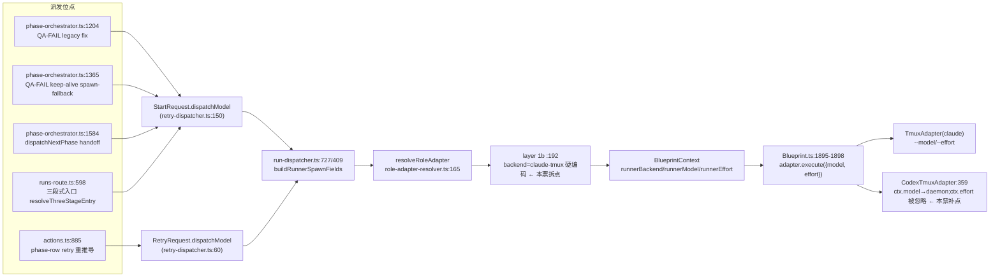

# FLY-1224 三段式 per-phase vendor — 调研

Issue: FLY-1224 (https://linear.app/geoforge3d/issue/FLY-1224/build-三段式-per-phase-vendor-designfable-implementcodex-gpt-56-solxhigh)
日期: 2026-07-13
基于: exploration.md

本文回答 exploration 方案落地所需的全部代码事实,含 Lead 批准 ⑤ 时附的硬约束 1(probePhaseAlive 真探针证据)。所有行号为本分支(main @ 852447f1)实测。

## 1. 派发链路全图(model 今天怎么流,vendor/effort 要走同一条管)



关键事实:
- **orchestrator 直调 `startDispatcher.start`,不过 HTTP**(runs-route.ts:542 注释明示),所以 `normalizeDispatchModel` 白名单不拦 phase 派发;runs-route 入口位点在 body 校验之后内部改写(:598,今天 resolvePhaseModel 已是这么绕的)——vendor/effort 同理,**不需要动 HTTP surface**。
- `StartRequest` / `RetryRequest` 均已有可选 `dispatchModel`;新增 `dispatchVendor` / `dispatchEffort` 是同型追加。
- `buildRunnerSpawnFields` 是两条路(start :727 / retry :409)的共同汇合点,位置参数第 6 位是 dispatchModel —— vendor/effort 顺位追加即可,两条路一次覆盖。
- phase 派发已带 `ignoreRunnerLabelSelection: true`(FLY-887 R2),label 层不参与 —— 所以 resolver 里 dispatch 层就是 phase 派发的第一有效层。

## 2. resolver layer 1b 现状与拆法

`role-adapter-resolver.ts:187-195`:

```ts
// 1b. FLY-728 Part C: ... All 728 tiers are Claude models → claude-tmux.
if (!backend && args.role === "runner" && args.dispatchModel) {
    backend = "claude-tmux";
    model = args.dispatchModel;
}
```

拆法:同一 guard 下,`args.dispatchVendor` 存在 → `VENDOR_TO_EXECUTOR[args.dispatchVendor]`(:57 现表,claude/codex/antigravity/kimi);不存在 → 原样 `claude-tmux`(**字节兼容分支保留原文**)。effort:`args.dispatchEffort` 优先于 `projectRoles[role].effort`(:241,FLY-671 独立解析处)。

类型:`RunnerVendorType`(runner-label.ts:28)是 label 层全集(含 gemini/cursor 无 executor 项);dispatch 参数类型收窄为 **transported vendor**(`"claude" | "codex"`)—— 三段式 phase 必须能收 park/wake mailbox + 走 gate,no-transport(antigravity/kimi)进 phase 表应当在类型层就编译不过(这正是 FLY-887 R2 在 runs-route:601 注释里点名要防的组合)。

## 3. FLY-1188 已交付件逐项核验(本票零新建,只消费)

| 件 | 证据 |
|----|------|
| windowed TUI founder 窗口 | CodexTmuxAdapter.ts:368-404 `openWindow`:`ensureRunnerTuiWindow` 用 **raw codex binary**(带 TTY;rotation shim 会让 `codex resume --remote` 拒渲染,QA 已踩过并修)开 cmux 窗口,`onTmuxWindowCreated` 照常回调 → FLY-398 合规、验收「cmux 有真窗口」内建 |
| model 通路 | CodexTmuxAdapter.ts:359 `...(ctx.model ? { model: ctx.model } : {})` → codex-daemon-goal-runtime.ts:355 → codex-daemon-client.ts:348 `thread/start` 的 `model` 参数 |
| Blueprint 三段式 codex 变体 | Blueprint.ts:736 `isCodexRunner` 按 **runnerBackend**(非 transport vendor)判;design/implement/qa phase 措辞全有 codex 分支(:1199-1218 keep-alive 尾声、:1122-1143 QA FAIL/kickback、:1659 approve-gate RESIDENT 轮询) — **codex phase 不 park、END TURN**(transitional contract, Codex M2 review HIGH-1) |
| cross-family review | review-family.ts `crossFamilyReviewSatisfied`:codex 作者(adapter_type=codex-tmux → family=codex)必须 reviewer_family≠author_family 才过;接入 StateStore.isCodexCodeReviewApproved + flywheel-comm verify-approval 双侧;codex 作者的 review 走 `gate review_design/review_code --no-block` + `request-review` + `check` 轮询 lane(Blueprint:1319-1327) |
| CommDB vendor 路由 | run-dispatcher.ts:282 `preRegistrationVendor` + CodexTmuxAdapter:948 registerSession(vendor="codex") → `flywheel-comm send`/`wakeRunnerMailbox` 按 vendor 选 codex mailbox |
| codex worktree 守卫 | Blueprint.ts:861-895:codex-tmux runner 必须有 worktree 且 cwd==worktree(phase 共享分支 B worktree 满足) |

**拼写 ground truth**:host `~/.codex/config.toml` 实测 `model = "gpt-5.6-sol"`、`model_reasoning_effort = "xhigh"`。per-runner CODEX_HOME 由 `provisionCodexHome`(codex-home.ts:355 起)从 host config **verbatim seed** —— 即今天 codex runner 已隐式跑 gpt-5.6-sol+xhigh;本票显式传 model(thread/start)+ effort(spawn `-c`),phase 行为不再随 host config 漂移。显式值与 seed 值同源同拼写,无冲突。

## 4. 缺口 A(probe-before-wake)— 硬约束 1 证据:probePhaseAlive 是真探针,不是 status 替身

调用链(全部实测):

1. `plugin.ts:6107 probePhaseAlive` → `getTmuxTargetFromCommDb(execId, project)`(tmux-lookup.ts,查 **CommDB sessions 注册行**拿 tmux_window target;查不到 → "absent")→ `probeRunnerProcessLiveness(target.tmuxWindow)`。
2. `probeRunnerProcessLiveness`(tmux-lookup.ts:371-401,FLY-720):执行 **`tmux list-panes -t <win> -F '#{pane_dead}'`** ——
   - `alive` = ≥1 个 pane 的 `pane_dead=0`(真活进程);
   - `dead_pin` = 窗口在但**每个 pane 都是 remain-on-exit 尸体**(`pane_dead=1`);
   - `absent` = tmux 证明窗口/会话/服务器不存在;
   - `indeterminate` = timeout/ENOENT 等,fail-closed。
3. **它读的是 tmux 服务器的 pane 进程状态,全链路不含任何 StateStore/CommDB status 字段** —— 不是「用一个替身查另一个替身」。

codex 语义核对:codex session 的 tmux target 是 founder TUI 窗口(`codex resume --remote` 进程)。TUI 进程随 daemon 死(socket 关闭 → TUI 退出 → pane_dead=1/窗口被 adapter finally `killWindow` 清掉 → absent);daemon 活着窗口挂了的窗口内自愈由 adapter 自己处理(:441 restart-reopen)。且 QA-FAIL 时刻 codex implement 的 goal 必已终结(QA 段只在 implement complete 之后存在),不存在「probe 误判死、实际 daemon 还在写分支」的双写窗口。

stall 复现链(缺口 A 成立的证据):`getAlivePhaseSession`(plugin.ts:6258-6270)只查 `status ∈ {running, awaiting_review, approved_to_ship, design_done}`;codex implement `complete --route needs_review` 后 status=awaiting_review、进程死;`runFailFlowKeepAlive`(phase-orchestrator.ts:1289-1316)选中它 → `assertPhaseWorktreeReady` 查的是共享 worktree(存在、clean、HEAD==QA 推的头,全过)→ `wakePhaseRunner`(plugin.ts:6190)→ `wakeRunnerMailbox`(wake.ts)是 **mailbox JSON 文件写,必然 ok:true** → :1329 `patchIntent({fixExecId})` → onQaResult resume 条件 `!existing.fixExecId` 永久短路 → 不可重放 stall。

修点(只 2 个 wake 位点,遵硬约束 3):
- fix-wake:phase-orchestrator.ts:1289 `if (impl)` 内、`assertPhaseWorktreeReady` 前,`await this.deps.effects.probePhaseAlive(impl)`:`alive`→照旧;`dead_pin`/`absent`→落到 :1345 起的既有 spawn-fallback(它自然带上本票的 codex backend);`indeterminate`→维持现状路径(照旧尝试 wake,交 reconcile 兜底 —— 与「fail-closed 不动 maybe-alive」既有姿态一致)。
- handoff-wake:phase-orchestrator.ts:1504 `if (target)` 内同型 probe:dead → 落到 :1552 的既有 ghostGuard+spawn。
- **不建 liveness 框架**:probePhaseAlive 已在 deps(:252),零新依赖;dispatcher 级原子占位/探活归 FLY-1220。

## 5. 缺口 B(effort → codex)落点

- `adapter-types.ts:150`:`effort` 注释 "Only the claude-tmux runner consumes it" —— 更新注释,codex 加入消费方。
- Blueprint.ts:1898 已把 `ctx.runnerEffort` 放进 `adapter.execute({effort})` —— **上游零改动**。
- CodexTmuxAdapter:今天忽略 `ctx.effort`;把它带进 `runtimeFactory(opts)`(新 `effort?` 选项)→ `spawnCodexDaemon` argv 加 `-c model_reasoning_effort=<effort>`(codex-daemon-runtime.ts:414-426 spawn 处;与 :94 `buildDaemonSandboxArgs` 同机制,提纯函数 `buildDaemonModelArgs`/并入现有 builder 皆可,单测锁 argv 字符串)。值域校验:effort 只从 phase 表来(受控枚举),但 argv 构造处仍按 `low|medium|high|xhigh|max` 白名单防呆(边界校验非负担)。

## 6. 展示层(⑥,Lead 定性「必须修」)

- `modelShortCode`(model-tiers.ts:104)对 gpt-5.6-sol 返回 undefined —— 合同如此(F/O/S/H 是 Claude 短码),**不动**。
- 撒谎点在 `phaseMessageTag`(three-stage-phases.ts:162-170):`modelDisplayName(runnerModel, DEFAULT_PHASE_TIER[role])` 对 gpt-5.6-sol 走 fallbackTier → 显示 "Fable"。修法:`modelDisplayName`(model-tiers.ts:128)在查 F/O/S/H 前加 GPT 家族识别:`gpt-5.6*`/`gpt-*` → "GPT-5.6"/"GPT"(精确到已知家族,未知仍走 fallback)→ implement 段显示 `[实现·GPT-5.6]`。同函数被 FLY-892 phase header 复用,一处修两处对。
- 三段式 thread 标题走 🎨/🔨/🧪 badge(FLY-892),不含模型码,不受影响。

## 7. 附加项(founder 直令):restart-services.sh idle-wait 默认去掉

现状:`FORCE=false`(:405),`--force` 置 true(:411);两个 gate 位点 —— 全量重启 :673、bridge-only :1346;`wait_for_idle`(:623)最长 MAX_WAIT_SECONDS 轮询。
改法(独立 commit):默认值翻转为 skip(等价 `--force` 常开);保留恢复通道 —— 新 flag `--wait-idle` 或 env `FLYWHEEL_RESTART_WAIT_IDLE=1` 置回等待;`--force` 保留为 no-op 向后兼容(现有调用方/文档不破)。`wait_for_idle` 函数本体、self-ship 稳定窗逻辑不动(走 `--wait-idle` 时原样生效)。dry-run 提示文案同步。

## 8. 测试面(plan 里成条目)

1. **resolver 单测**:`{dispatchVendor:"codex", dispatchModel:"gpt-5.6-sol", dispatchEffort:"xhigh"}` → `{backend:"codex-tmux", transport:"codex", vendor:"codex", model, effort}`;无 vendor → 现状(哨兵:旧 fixture 输出逐字节不变)。
2. **突变测试 α(issue 硬约束)**:resolver 把 vendor 透传摘掉 → 上述测试红;orchestrator 派发集成测断言 3+1 位点 StartRequest 携带 `{vendor:"codex", model:"gpt-5.6-sol", effort:"xhigh"}`(implement)/claude(design、qa)→ 摘传参也红。
3. **突变测试 β(Lead 硬约束 2)**:模拟 dead codex implement(probe 返 absent/dead_pin)的 QA-FAIL → 断言走 spawn-fallback 且 `fixExecId=新 exec`;把 probe 摘掉 → 测试观察到 wake-path 被走(fixExecId=旧 dead exec)→ 红。alive 路径:probe 返 alive → wake,与现有 fixture 逐字节同参。
4. **retry 重推导**:phase-row retry 断言 `dispatchVendor/dispatchEffort` 从表重推导(implement→codex/xhigh);非 phase row → undefined(字节兼容)。
5. **codex argv 单测**:effort → `-c model_reasoning_effort=xhigh` 出现在 daemon spawn argv;无 effort → 无该 argv(字节兼容)。
6. **显示单测**:`phaseMessageTag("implement", "gpt-5.6-sol")` → `[实现·GPT-5.6] `;claude 各值不变。
7. **zero-Sonnet 不变式**(现有测试)继续绿;phase 表新形状下不变式改读新表。
8. **restart-services**:bash 侧以 dry-run 断言两个 gate 位点默认 skip、`--wait-idle`/env 恢复等待(仓里已有同款 script test 形态,如 test-pm-executor-contract.sh 的 CI 挂法)。

## 9(新增). 交叉审对称性审计(Annie 直令 2026-07-13 18:08Z,经 Tadashi 转达)

要求:「作者厂商 ≠ 审稿厂商」双向定死;Codex 写 → Claude 审(Opus/最高档,effort 对齐 xhigh);gate 层硬拒同厂商自审;审计可回查。逐条与代码事实对照:

**已由 FLY-1188 §7.1-7.3 结构性满足(本票只验证+测试,不重建)**:

| Annie 要求 | 现有机制(实测行号) |
|-----------|--------------------|
| Codex 写 → Claude 审 | `review-request-coordinator.ts`:非 claude 作者的 request-review 由 Bridge 起 **claude 子进程审稿**(claude-review-runner.ts,`DEFAULT_MODEL = "claude-opus-4-8"` :74 —— 正是 Opus);`reviewerFamily: "claude"` 服务端盖章(:740);author_family 从 sessions.adapter_type 服务端推导(不信 runner 自报) |
| 复用 (execution_id, target_pr_head_sha) 绑定 | 同一 `codex_review_record` 表、同一 `recordCodexReviewApproved` 写点(StateStore :4139-4245),claude lane 的 verdict 写 `verdictEventId: review-job:<request_id>`、`reviewedTarget: "claude-review:code"`(coordinator :732-742)—— FLY-827 严格度/校验路径零改动 |
| 同厂商自审硬拒(gate 层) | 双保险:① claude 作者被 request-review lane **入口硬拒**(coordinator :205 "would BE a same-family review",走 legacy claude→codex lane);② `crossFamilyReviewSatisfied`(review-family.ts)在 `StateStore.isCodexCodeReviewApproved` + `flywheel-comm verify-approval` **双侧**校验:盖章同家族一律拒;codex 作者 + 无家族章记录拒;**唯一例外**:claude 作者 + 无章 approved 记录接受(review-family.ts:43-60 的 pre-FLY-1188 遗留豁免——历史行只可能来自 claude→codex lane;FLY-1188 后全部生产写点服务端双章,豁免窄且封闭,本票 grandfather 保留并测试锁定) |
| 审计可回查(铁律) | legacy lane 锚点 = codex_thread_id;claude lane 锚点 = `request_id` → **`codex_review_job` 表**(单数;StateStore :1830 建表 / :4298 查询;接口 :788-825)对应行持 `reviewer_session_uuid`(可 resume 的 claude 审稿会话 uuid)+ `findings_json` + `frozen_head_sha` —— 链条:record.request_id → job(execution_id/frozen_head_sha 与 record 双向咬合),凭据齐全,非自由文本 |
| design 侧双向 | request-review lane 本身分 `--type design|code`,同一 coordinator/family 机制 —— design 段若换 codex 作者,design review 自动翻 claude(机制已双向;规则文档化即可) |
| event-route 不给 codex 作者跑 legacy codex review | event-route.ts:273-282:codex-tmux 作者 legacy trigger 直接 skip("review is request-driven") |

**审计抓到的两个真缺口(必须进本票)**:

1. **Blueprint 没给 codex 作者 code-review lane 指引**:全文件只有 design lane 的 request-review 指引(Blueprint.ts:1317-1327,docFlow 块内);approve-gate 段(:1650 起)对 codex-tmux runner 零 code-review 指令,event-route 又跳过 legacy trigger —— implement=codex 默认后,codex implement 的 FLY-827 code gate 会**无人发起审查而挂空**(founder gate 因 crossFamilyReviewSatisfied fail-closed 拒 ship,pipeline 卡死在 review)。修法:approve-gate 的 isCodexRunner 分支加 code lane 指引(gate review_code --no-block → request-review --type code --question-id <id> → check 轮询),镜像 :1324 的 design 措辞。
2. **claude 审稿无 effort 参数**:claude-review-runner 只传 `--model`(:100-101);Annie 要求 effort 对齐 xhigh。修法:invocation 加 `--effort`(FLY-671 的 claude CLI 旗),review 默认 xhigh;`claude -p` 对 --effort 的支持在 implement 段实测一次。

## 10. 风险与已知边界

- **codex implement 一轮 fix 一个新 session**(spawn-fallback,无 park 上下文复用)——transitional contract 的固有代价,QA findings 已在分支上、新 session 读得到;等 FLY-1188 后续 milestone 给 codex 加常驻轮询 park 后,probe 自然改判 alive、wake 路径自动生效,本票代码无需再动。
- **codex implement 的 design_review/brainstorm gate**:phase implement 不跑 brainstorm gate(phase prompt 无该 checkpoint,设计已由 design 段完成)—— 与 claude implement 段一致,无新面。
- **QA=Opus(claude)是 ship executor**:approve→verify-approval→:cool: 全在 claude 侧,codex 的「RESIDENT 轮询 verify-approval」路径在三段式里不承担 ship(implement 的 complete --route needs_review 只是把 PR 挂上;QA PASS 后由 QA 段重开 gate 并执行 ship)。
- **OOM/负载**:implement 段从 claude 进程换成 codex daemon+TUI 窗口,内存面相当(一 runner 一进程组),无新增常驻。
