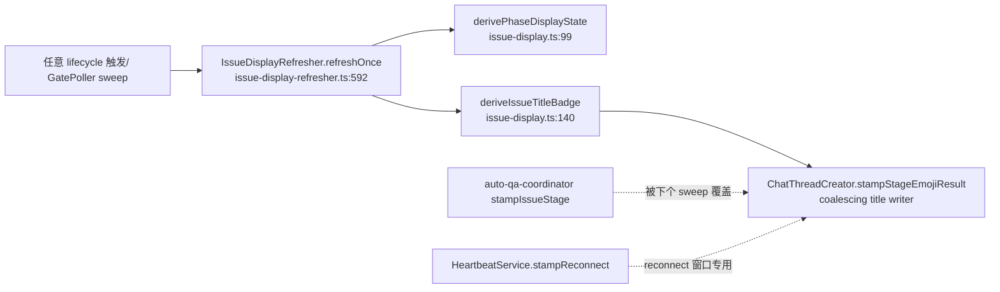

# FLY-1225 thread 状态前缀错标「✅完成」 — 调研

Issue: FLY-1225 (https://linear.app/geoforge3d/issue/FLY-1225/fix-thread-状态前缀错标完成-awaiting-reviewgate-open-被显示成已完成codex-三段式冒烟单)
日期: 2026-07-13
基于: exploration.md

## 1. 权威链（谁最终决定标题）



- refresher 默认开（`plugin.ts:3314` `FLYWHEEL_ISSUE_DISPLAY_REFRESH !== "0"`）。
- sweep layer-2（`runSweep`, issue-display-refresher.ts:519）对**非 terminal** issue
  轮转无条件 refresh —— `awaiting_review` 非 terminal，所以任何旁路 stamp
  （如 coordinator 的 ⏳待批, auto-qa-coordinator.ts:1279）都会在下个轮转被
  推导结果改写。**修推导 = 修唯一权威**；这解释了 FLY-560 族早前「stamp 修好
  又复发」——stamp 修了，推导权威没修。

## 2. 病灶函数逐行

`derivePhaseDisplayState`（issue-display.ts:99-114）：

| 输入 | display state | 备注 |
|---|---|---|
| `completed` / `merged` | done | `PHASE_DONE_STATUSES`，真 terminal |
| `failed`/`terminated`/`blocked`/`rejected` | blocked | |
| park 探针 = `parked`（任意存活 status） | done | **「这段活交接完」≠「issue 完成」** |
| boundary（`design_done`/`awaiting_review`/`approved_to_ship`）+ park=`unknown` | done | 非 keep-alive 项目也中 |
| boundary + park=`not_parked` | active | FLY-543 wake-rework |
| 其他有 session | active | |

`deriveIssueTitleBadge`（issue-display.ts:157-162）all-done 分支：

```ts
const allExistingDone = [...phaseStates.values()].every((s) => s === "done");
if (allExistingDone && phaseStates.get(lastPhase) === "done") {
    return { kind: "completed" };   // ← 只看 display-state，不看 raw status
}
```

gate-open 标准形态（本单 FLY-1225 自己走三段式就会经过；R3 精修：founder
gate 真正开着时 QA 行在 `awaiting_review`——QA 是 ship-gate 持有者，见 §3；
`running`+parked 是 verdict 后、gate complete 前的 pre-gate 间隙形态，二者
在 display 层同样全 done）：

| phase | status | park | display state |
|---|---|---|---|
| design | `design_done` | parked | done |
| implement | `awaiting_review`（needs_review 交接后一直 park 到 finalization） | parked | done |
| qa | `awaiting_review`（PASS 后自己开 approve gate；pre-gate 间隙则为 `running`） | parked | done |

→ all done → `{kind:"completed"}` → 标题 ✅完成。**gate 正开着。**

## 3. status 词汇表核对（谁能进 `awaiting_review` / `approved_to_ship`）

> **R1 修正**（Codex design review Round 1 证实，本节初稿把 gate 持有者写成了
> implement——已按代码改写）：

- **QA 才是三段式的 ship-gate 持有者和 ship 执行者**（FLY-859，
  phase-orchestrator.ts:936-942 注释原文：QA PASS 后 "the QA runner itself
  proceeds through the standard APPROVE GATE flow (it is the pipeline's
  ship-gate holder and ship executor)"；:970-981 显式处理 QA 在
  `awaiting_review`）。所以 `awaiting_review` 会出现在**两个 role** 上：
  - implement：`complete --route needs_review` 交接后 park 在
    `awaiting_review`（DirectEventSink.ts:497/508），**一直停到 ship 后
    finalization 才转 completed**（post-ship-finalization.ts 的
    FINALIZE_DONE 源状态含 awaiting_review）；
  - qa：PASS 后自己开 approve gate → `awaiting_review`（gate open 等 Annie）
    → founder 批准 → `approved_to_ship` → ship → merged landing → `completed`。
- design 走 `phase_design_complete` → `design_done`（DirectEventSink.ts:475-479）。
- `merged` landing 在 sink 侧最终落 `completed`（DirectEventSink.ts:458-531）。
- **未获批的 merge**（FLY-869）：merged landing 但 ship 不 eligible → 行被
  park 回 `awaiting_review` + `merge_block` 标记（DirectEventSink.ts:426-455）
  ——即「行上有 merged 事实但 status 仍是 awaiting_review」是**可达**的。

`getLatestPhaseSessionsForIssue`（StateStore.ts:3169）**每个 role 只取最新一行**
（design/implement/qa 各一）——rework 产生的新 implement session 会顶掉旧行。

## 4. Tadashi 补充用例：「已 merged 但某 phase 还 park 在 awaiting_review」短窗

**该窗口可达且必然发生**（R1 修正——初稿的「不可达」论证建立在
「只有 implement 进 awaiting_review」这个错误前提上）：QA ship 完成后
QA 行 → `completed`，而 **implement 行仍 park 在 `awaiting_review`**，直到
`finalizeThreeStagePhases`（post-ship-finalization.ts:190-217）把它转成
completed。在这个窗口里「看到 awaiting_review 就显示 ⏳待批」会把已发货的
单标成待批——Tadashi 的担忧成立，不能靠 status 相斥性推掉。

**解法：用正向的 issue 级发货事实，而不是「没有 gate status」这种负向推断。**
代码里已有现成的持久事实：`post_ship_finalization_claim` 事件。语义要说准
（Codex R2 #3）：claim insert 本身（post-ship-finalization.ts:299-320，stable
event_id + UNIQUE 去重）不做 merge/eligibility 校验——校验在它的**调用方**：
标准路径由「landingStatus=merged + ship-eligible」谓词把关后才进
`runPostShipFinalization`；external-merge 的 completed 恢复路径则用自己的
head-bound trusted-approval 校验（不走 `computeShipDecision`）。所以 claim
的准确含义是「**一条经过校验的 post-ship finalization 流程已被认领**」——
作为「issue 已发货」的显示层事实足够强。查询通道已有：
`store.countEventsByIssueAndType(issueId, "post_ship_finalization_claim")`
（StateStore.ts:3117，phase-orchestrator.ts:359 已在用）。推导层新增
`shipFinalizationClaimed` 布尔输入：

- claim 存在 → ✅完成（即使 stale 行还没被 finalization 转完）——短窗诚实；
- claim 不存在 → gate status 判定（🚀/⏳）；全 terminal 才 ✅；否则**不给 ✅**。

这同时天然覆盖 merge_block（未获批 merge：不 ship-eligible → 永远没有 claim
→ 行 park 在 awaiting_review → ⏳待批，绝不 ✅——正确：这单确实还没过 founder）
和「未被记录的 merge」（Bridge 没收到 landing → 无 claim → 照记录显示等待态；
治本属 merge-evidence 对账一族，不在显示层伪造）。

维持初稿排掉的错误强化：「任一 phase status=`completed` → ✅ 优先」不能加——
QA 行在 gate 开着时不可能 completed，但**非 keep-alive 项目**其他形态下
completed 行与 gate 共存可构造；✅ 只认 claim 或全行 terminal。

## 4.5 第二个默认开启的标题写入者：HeartbeatService reconnect-clear（R1 新发现）

`RegistryHeartbeatNotifier.stampReconnect(session, "clear")`
（HeartbeatService.ts:1775-1790）在 reconnect 结束时按**单个 session** 恢复
badge：`session.status === "completed"` → 直接写 ✅完成 到共享 issue thread。
一个已 completed 的 phase session（如非 keep-alive QA）reconnect-clear 时，
会在 implement 还 gated 的 issue 标题上盖 ✅——与 unified refresher 无先后
保证（sweep 只是最终一致，不是防写入）。修法：unified refresher 可用时
（holder `.current` 已设），clear 模式不再按 session 恢复 badge，改为
enqueue issue 级 refresh（推导权威出真值）；`enter` 模式的 ⚠️重连中 直写
保留（refresher 的 `isReconnecting` guard 本来就为它让路）。escape hatch
（`FLYWHEEL_ISSUE_DISPLAY_REFRESH=0` → holder 空）保留现行为字节兼容。

## 5. 词汇表复用核对（零新 glyph）

- ⏳待批 = `STAGE_EMOJI.approve`/`STAGE_WORD.approve`（stage-utils.ts:78/120，
  FLY-795 语义「awaiting founder ship approval」）——QA 已过、等 Annie，语义精确。
- 🚀ship = `STAGE_EMOJI.ship`/`STAGE_WORD.ship`——已批、ship 中/待执行。
- issue 建议的「👀待审」不采用：👀 已被 design_review/code_review 占用
  （FLY-560 v2 Annie 锁定的「一个 review glyph + 不同词」），新增词会破坏
  splitStatusEmoji 的 EMOJI_TO_WORDS 剥离契约、还要动 Discord rename 词表。
- badge 走 `{kind:"stage", stage:"approve"|"ship"}` 复用现有
  `stampStageEmojiResult` 渲染路径，strip/restamp 契约（ALL_STATUS_EMOJI /
  EMOJI_TO_WORDS）零改动。

## 6. 单 session 分支防御 clamp 的边界

`deriveIssueTitleBadge` 空-map 分支返回 runner **自报** `session_stage`。
clamp 只治「✅撒谎」：status ∈ {`awaiting_review`,`approved_to_ship`} 且自报
stage=`completed` 时改渲染 `approve`/`ship`。不碰其他自报 stage（📬PR已开 等
等待态不算撒谎，见 exploration §6 已记录的相邻毛病）。refresher 里现有
`isQaHeld` 覆盖（issue-display-refresher.ts:657-663）在 clamp 之后仍生效
（其条件是 `badge.kind === "stage"`，clamp 不改 kind）——QA 在跑仍显示 🧪QA，
「founder 状态必须 QA-gated」裁定不破。

## 7. 现有测试形态（要动哪些 pinned 行为）

- **`issue-display-refresher.test.ts:342-373` 把本 bug 钉成了预期行为**：
  用例名「qa PASS (qa at awaiting_review + parked, holding the ship gate) →
  QA✅」，喂的正是 gate-open 活体形态（design_done+parked /
  awaiting_review+parked ×2），断言标题 `stage:"completed"`。**必须有意识地
  改写**成断言 `stage:"approve"`（header 三行 ✅ 保留——那层语义没错）。
- `issue-display.test.ts:164`「all existing phases done AND qa exists+done →
  completed」——喂 display-state map 不带 status；签名改造后按新输入重写。
- `stage-utils-badge.test.ts` / `stage-status-emoji.test.ts`：词表未动，应零改。
- 回归测试必须覆盖 FLY-1224 冒烟的活体形态（gate open：design_done+parked /
  implement awaiting_review+parked / qa awaiting_review+parked）+ post-merge
  claim 窗口 + merge_block。
- reconnect-clear 回归（§4.5）：completed QA 行 + implement awaiting_review +
  reconnect clear → 只 enqueue refresher，绝不按 session 写 completed badge。

## 8. 影响面清单

| 面 | 改不改 | 理由 |
|---|---|---|
| `deriveIssueTitleBadge`（face A 聚合） | **改** | 主病灶 |
| refresher 调用点 + `computeSessionsFingerprint` | **改** | 新输入（raw status + ship claim）；claim 是推导输入 → 必须进 reconcile fingerprint，否则 claim-only 变化躲过 sweep layer-1 |
| `HeartbeatService.stampReconnect` clear 模式 | **改** | 第二个默认开启的 ✅ 写入者（§4.5）——refresher 可用时改 enqueue |
| `derivePhaseDisplayState` | 不改 | per-phase「交接完=done」语义本身成立 |
| faces B/C（header/状态行 glyph） | 不改 | 标题⏳待批+三行✅ 自洽：活干完了等你批 |
| coordinator stamp / legacy escape-hatch path | 不改 | 非权威（exploration §2/§6）；escape hatch 字节兼容 |
| stage-utils 词表 | 不改 | 复用 approve/ship |
