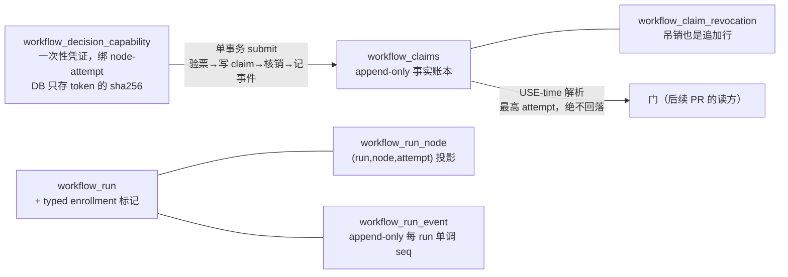

# FLY-1232 PR-1 身份+事务 substrate — 探索

Issue: FLY-1232 (https://linear.app/geoforge3d/issue/FLY-1232/build-dag-模板引擎-pr-1身份事务-substrateclaims-账本-6-表-一次性-decision-capability)
日期: 2026-07-13
基于: 无（上游 spec = flywheel-FLY-1135 分支 engineering/doc/FLY-1135-layer1-dag-templates/plan.md，Codex 4 轮 APPROVED）

## 1. 问题定义

FLY-1135（低层 DAG 模板引擎）的伞单 plan §3.2 定义了 8 个链式交付段；Annie 拍板合并为
**4 张子单 / 4 个 PR**：**A=①②（本单）**、B=③④⑤（执法层）、C=⑥（泛化）、D=⑦⑧
（注册表迁移+启用，等 FLY-1224）。本单 = 子单 A，覆盖两段（Lead 覆盖令 b64cea04，2026-07-13）：

- **段①（身份+事务 substrate）**：在 teamlead.db 里落 workflow claims 账本的最小表族与提交原语，
  零生产接线；
- **段②（并行写入，伞单 ② 全量）**：三段式 orchestrator 对 run / run_node / run_event 的
  双写/追加写入路径（②a）+ 派发 outbox/reconcile 状态机（②b，独立模块结构）——仅在 WRITE flag
  显式开启时影子写入，不改任何现有读路径。

全程 default-off、字节兼容。

为什么子单 A 先行、且不依赖 FLY-1224：

- 后续子单 B/C/D（执法层：founder guard 收口 + 跨库投影 + 读切换 + 模板 schema / node-id 泛化 /
  注册表迁移+启用）全部建立在「决策身份 = (run_id, node_id, decision_kind, attempt)」和
  「单事务提交」之上；地基不先钉死，上层每一张 PR 都要自带临时身份约定，返工必然。
- FLY-1224 只影响派发期的 {vendor, model, effort} resolver（PR-7/8 的硬前置）；账本结构本身
  厂商无关，与 1224 正交。

一句话交付物：**段① = 6 表 DDL + append-only triggers + 一次性 decision capability（只存 hash）+
单事务 submit（E3 幂等重放/fail-closed）+ §2.1 解析算法（不回落旧 attempt）+ E6 跨厂商 claim 层门 +
typed enrollment + 3 个 default-off flag + doc sentinel；段② = orchestrator 生命周期影子双写 +
派发 outbox/reconcile 状态机（全部 WRITE flag 门控）。**

## 2. 概念模型（伞单 plan §2.1/§2.2 的落地对象）

- **凭证不预绑 edge**：QA 一次激活可能 PASS（前进边）也可能 FAIL（回头边），凭证绑「节点尝试」，
  结果才选边（伞单 Codex R1#3 的核心修正）。
- **账本 append-only**：更正靠追加（revocation 行、新 attempt），行永不改写 —— 门的判定永远可以
  从真实记录重建。
- **enrollment 是显式类型化标记**：某 run 的门读不读 claims 账本，是 admission 时写下的 per-run
  事实（claims_read_enrolled 列），绝不由「表里有没有数据」或全局 flag 推断（伞单 R1#5/#13）。

## 3. 关键决策（brainstorm gate 已与 Tadashi 确认，2026-07-13）

### 3.1 起步方式：cherry-pick 现成分支，照常全检

auto-chain 的 implement 段在停手令前已按 TDD 完成 PR-1 全量实现，成果保存在分支
fly-1135-pr1-substrate @ 3a993f3d5（32+3 测试绿、tsc+biome 干净；伞单评论 07731c34 明确指示
cherry-pick 起步）。**选择：cherry-pick 起步，然后走完整 Codex code review + 独立 QA** ——
起步快 ≠ 免检。备选「重做一轮 TDD」被否：产物已按同一份 APPROVED spec 写成，重做只产生噪音 diff。

### 3.2 sentinel 的文件系统依赖 → PR-1 连带伞单设计文档（gate 批准点 1）

审计发现：doc sentinel 测试（fly1135-doc-sentinel.test.ts）**运行时从文件系统读**
engineering/doc/FLY-1135-layer1-dag-templates/ 下的 exploration/research/plan 三文档，而该目录
只在设计分支 flywheel-FLY-1135 上、不在 main。只 cherry-pick 代码 commit，sentinel 在本分支直接
ENOENT 红。

- **选择：PR-1 连带伞单设计文档最终态（flywheel-FLY-1135 @ 9ed7ea69e）一起合入 main。**
  这同时符合本仓「docs 随主 PR 走」的铁律，且伞单不做单体实现、这批文档否则没有落 main 的载体。
- 备选「把 sentinel 改成目录缺失时 skip」被否：sentinel green 而守卫对象不存在 = 拿标签冒充事实，
  正是本仓明令的 bug class；绝不弱化。

### 3.3 E6 跨厂商门的契约形态（gate 批准点 2）

参考实现的 claim 层 E6 门是 issuerVendor 与 subjectProducerVendor 的**裸字符串比较**；而 main 上
已有 FLY-1188 的 family 概念（packages/config/src/review-family.ts 的 adapterTypeToFamily /
crossFamilyReviewSatisfied）。PR-1 没有生产调用方，两个口径不会在本 PR 内相撞。

- **选择：保持裸比较，但在 API 契约（jsdoc + plan）写死 —— 调用方必须传服务端解析后的
  family 标识（经 adapterTypeToFamily 一类映射，绝不信 runner 自报），与 FLY-1188 对齐；
  真正的服务端解析接线在 PR-2+（并写生产者）落地。**
- 备选「PR-1 内嵌 family 映射」被否：映射的输入（sessions.adapter_type / 已解析 backend）在
  提交路径上属于 Bridge 侧调用方的知识，substrate 层拿不到会话上下文；提前内嵌反而制造假接口。

### 3.4 Annie 拓扑统一约束的留位（gate 批准点 3）

Annie 硬约束（伞单评论 fa370a99）：review = 一等节点/边义务，拓扑与作者厂商无关。PR-1 的结构性
留位：claims/capability 全部厂商无关；review 类 claim 强制记 subject producer + 跨厂商门；
表结构不含任何「三段式」「模板 #1」拓扑假设。**plan.md 的正式修订（模板 #1 定义）不在本单 scope**
—— 归第一张触及模板 #1 定义的实现子单。

### 3.5 scope 覆盖令：A = ①+②，全局 4 单（Lead b64cea04 + 两轮 ask 裁定，2026-07-13）

brainstorm gate 批复后 Lead 发覆盖令统一口径：本单从「仅段①」扩为「子单 A = 段①+段②」，全局按
4 单推进（A=①②、B=③④⑤、C=⑥、D=⑦⑧）。两条边界经非阻塞 ask 裁定：

- **②b（派发 outbox/reconcile 状态机）在 A 内**（ask a530fe31 答复：伞单 ② 全量按字面全取，
  不再从 ② 里往外抠零件制造模糊）；plan 仍把它写成独立模块——万一 review 阶段发现该挪，一句话的事。
- **本地 claim 并行写（QA/codex verdict 生产者）归 B —— Lead 终裁**（ask c33d61d2 答复：
  没有 capability 机制就写 claim 行，等于第一批 claim 就是无授权的替身声明，恰是整套设计要
  消灭的东西；A 的影子三表 + outbox 观察价值已足够）。
- 跨库投影（CommDB source event / TURN 源历史）归 B，双方确认无异议。

## 4. 边界（本单明确不做）

- 不接线任何生产**读**路径（claims 读切换 + 红测变绿 = 子单 B）；段② 的写入仅 WRITE flag
  门控影子写。
- 本地 claim 并行写（verdict 生产者）归子单 B —— Lead 已终裁（见 §3.5）。
- 不做跨库 source event / TURN 源历史（子单 B）。
- 不做模板 schema / loader / 发布契约（子单 B/D）。
- 不做 capability 明文的下发通道（伞单 §2.2 broker 议题）—— 本单 DB 层只存 hash，明文只在
  签发调用返回值里出现一次；通道属子单 B+。
- 不动 verify-approval / codex_review_record / qa_required 等任何现有门。

## 5. 风险与对策（预览，详见 plan §5）

| 风险 | 对策 |
|------|------|
| cherry-pick 落到新 base 有 drift | merge-base 852447f16 与 main HEAD 5d0e6f579 仅差 2 个 docs/lint commit，零文件重叠（已核）；冲突则按块手工落 |
| StateStore.ts 巨文件未来冲突 | 新代码全部追加在类尾 + 独立 workflow-claims.ts 词汇模块，接触面最小 |
| 本单文档自身带入退休词汇 | 三文档写作时主动规避 sentinel 词表；实现期 sentinel 测试扫全部三个 src 树兜底 |
