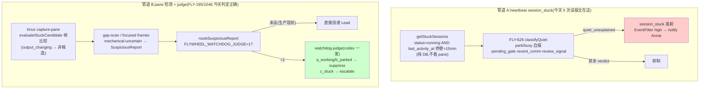

# FLY-1234 watchdog stuck 误报审计 — 探索

Issue: FLY-1234 (https://linear.app/geoforge3d/issue/FLY-1234/bug-watchdog-的-pane-judge-判定层在场却没挡住-5-次-stuck-误报-审计今天-5-个真实案例定位漏拦点)
日期: 2026-07-13
基于: 无

## 1. 问题

Annie（2026-07-13 22:21Z）：她记得 watchdog 设计过「要看 pane 面板、且要看两次」再告警，但今天 5 次 `session_stuck` 告警全是误报 —— Lead 逐个 pane 核实，runner 全部在真干活（codex 审查等待 / 大测试套件 / xhigh 长思考）。判定层在场却没拦住。要求真机审计这 5 个案例，定位漏拦点，别按猜的修。

## 2. 审计铁证（真机，非推测）

数据源：`/tmp/flywheel-bridge.log`（生产 Bridge，PID 44152，dist=180b7222 今天 10:21 部署）+ `~/.flywheel/teamlead.db`（`lead_events` / `session_events` 表）+ 生产 `~/.flywheel/.env` + 源码（本分支 checkout，与生产 dist 同源）。

### 2.1 全天 session_stuck 发射清单（lead_events 表，UTC）

| # | 时间 | execution_id | issue | event_id 前缀 | Lead 核实的真实状态 |
|---|------|--------------|-------|----------------|---------------------|
| 0 | 15:34:40 | 91a5b794 | FLY-1038 | `heartbeat-` | （Annie 5 案例窗口之外，同型） |
| 1 | 18:11:35 | 00ddfc18 | FLY-1224 design | `heartbeat-` | Codex design review R2 等待（driver 进程活） |
| 2 | 18:26:35 | cc21f3f5 | FLY-1185 implement | `heartbeat-` | 在干活（Annie 记为 ~21:01 的「cc21f3f5/097a5dcf 相关」案例；21:01±10min Bridge **无任何** session_stuck 发射，18:26 这条是唯一 cc21f3f5 记录 —— 她看到的 21 点消息应为 Discord 侧延迟送达/quota 恢复后的补投，Bridge 侧真实发射时刻在 18:26） |
| 3 | 19:01:35 | e8c0e865 | FLY-1224 implement | `heartbeat-` | 写 C10，xhigh 长思考回合 |
| 4 | 19:11:35 | 097a5dcf | FLY-1185 qa | `heartbeat-` | 追 codex-gate 源码（活跃 bash 调用） |
| 5 | 22:01:35 | 2ed82858 | FLY-1224 qa | `heartbeat-` | 跑 restart-guard 测试 + 写 dist E2E 脚本 |

时间戳全落 `:01:35` / `:11:35` / `:26:35` / `:34:40` —— `HeartbeatService.checkStuck` 周期扫描（`config.stuckCheckIntervalMs`），与 Annie 观察到的 10 分钟粒度一致。

### 2.2 三个决定性事实

**事实 A —— 5/5 全走「心跳静默」机械路径，与 pane 无关。**
每条告警的 `event_id` 前缀都是 `heartbeat-`（HeartbeatService 发射签名）。这条路径的判定是纯 SQL：

```sql
-- StateStore.getStuckSessions (StateStore.ts:3250)
SELECT * FROM sessions WHERE status = 'running' AND last_activity_at < datetime('now', '-15 minutes')
```

阈值 `TEAMLEAD_STUCK_THRESHOLD` 默认 15 分钟（config.ts:37，生产未覆盖）。`last_activity_at` 只被 Bridge 收到的 runner 事件（`/events` ingest：stage_changed / progress / session lifecycle / comm 消息，event-route.ts 多处 `last_activity_at: now`）刷新 —— **runner 的工具调用、pane 输出、子进程活动都不产生事件**。一个 runner 埋头单回合（xhigh 长思考、等 codex 审查、跑大测试套件）>15 分钟不发事件，就进入 stuck 集合。

**事实 B —— 发射前的抑制链没有任何 pane/进程证据环节。**
`HeartbeatService.checkStuck`（HeartbeatService.ts:867-923）在 wake 前只过四道闸：
1. `isMonitorSuppressed`（monitoring-lost / 重连中）
2. `alreadyNotifiedStuck`（episode 去重）
3. `isStuckWakeSuppressed` → FLY-626 `classifyQuiet`（quiet-classifier.ts:67）：`self_parked` / `self_long_task`（runner 自报）、`pending_gate`、`recent_comm`（30min 窗）、`review_signal`、`done_but_running`
4. 都不中 → `quiet_unexplained` → **直接发 session_stuck**

今天 log 里 FLY-626 对**其他** session 大量生效（`suppressed session_stuck for 7256cf24 (pending_gate)`、`65ad1e4f (recent_comm)` 等几十条）—— 抑制层本身在工作。但这 5 个 runner 都是「埋头干活不说话」形态：没自报 busy、不在 gate、30 分钟没发 comm 消息 → 五个信号全空 → 放行告警。**这条链从头到尾没有 capture-pane、没有帧比较、没有进程活性探针、不经过 watchdog-judge。**

**事实 C —— watchdog-judge 全天 0 次调用；它挂在另一条管道上，而且没通电。**
- `grep -c "watchdog-judge" /tmp/flywheel-bridge.log` → **0**。`session_events` 表今天没有任何 `watchdog_judge_suppressed` / `watchdog_judge_confirmed_stuck` 行。
- judge（FLY-1048 PR-B）的唯一接入点是 `routeSuspiciousReport`（plugin.ts:4807 `deliverSuspicious`）—— 只服务 **detection-suspicious 管道**（gap-scan focused frames / RunnerIdleWatchdog 的 mechanical-uncertain 报告）。`session_stuck` 的发射代码路径完全不经过它。
- 而且 `judgeEnabled = () => process.env.FLYWHEEL_WATCHDOG_JUDGE === "1"`（plugin.ts:4810），生产 `~/.flywheel/.env` 只设了 `FLYWHEEL_STUCK_ERRORSIG=1` 和 `FLYWHEEL_DETECTION_GAP_SCAN=1`，**`FLYWHEEL_WATCHDOG_JUDGE` 未设** —— 即使 suspicious 管道产生报告，也是绕过 judge 直接投递。issue 背景里「env 开关均已设」核实的是前两个 flag；judge 自己的第三个 flag 从未翻开。

### 2.3 对照组：看 pane 的那层今天判对了

- `[StuckDetector] cc21f3f5 not a candidate: output_changing`（log:25714）—— FLY-195 pane 检测层对案例 2 的同一 runner 抓帧比较后正确判定「输出在变，不是候选」。
- gap-scan（FLY-1048 A6/A7）今天对 097a5dcf / e8c0e865 / cc21f3f5 只记了 `gap2_ask_unanswered` / `delivery_unconsumed` 观察级怀疑，focused-frames 复核后**没有**升级任何一个为 suspicious 交付（今天唯一一条 `detection_suspicious` 是 08:06 的 91a5b794，在 5 案例窗口外）。

**结论：Annie 记忆中的「看 pane、看两次」逻辑真实存在且判定正确 —— 但它守的是 `runner_stuck_escalation`/suspicious 管道；今天扰民的 5 条告警走的是它旁边那条不看 pane 的 `session_stuck` 心跳管道。**

**独立互证（Lead 转来 FLY-1224 implement runner 的源码级结论，与本审计双向印证）**：session_stuck 链设计上全链零 pane capture —— HeartbeatService 自己的注释原话「The heartbeat path has no pane」（HeartbeatService.ts:937 附近，episode fingerprint 用哨兵值 'stuck' 正因为无 pane 可指纹）；「看 pane+看两次」的原始出处是 FLY-92 RunnerIdleWatchdog（`runner_idle_detected` 事件，plugin.ts:7327 `waitingThresholdCycles=2`，当年 Annie 拍的「看两次」）—— 与 FLY-195 StuckDetector、FLY-1048 stuck-candidate/judge 一样，都不在 session_stuck 链上。两份独立审计（本 runner 走 log/DB 铁证，1224 runner 走源码走读）结论一致。

## 3. 两条管道结构图



## 4. 漏拦点结论（回答 issue 的三个「要查」）

1. **走的哪条路径？** 5/5 机械快路径（heartbeat 心跳静默）直接判「清晰 stuck」发射 —— 没进 judge（judge 全天 0 调用），也不是 judge 误判/被 suppress（`watchdog-judge-suppressed` 事件 0 条）。
2. **frame 比较的窗口语义是否把静止当 clear-stuck？** 否 —— 恰相反。管道 B 的帧比较语义是「帧相同才累积 stuck 时钟」，且今天它对同批 runner 判的是 `output_changing`（非候选）。问题不在帧语义，在于**发射告警的管道 A 根本没有帧这个概念**：它把「15 分钟没给 Bridge 发事件」当成了 stuck 的充分条件，而埋头干活（长思考/等审查/跑测试）恰好就是「不发事件」的合法形态。
3. **结构性漏拦点（三个，按根治优先级）：**
   - 漏① `session_stuck`（管道 A）在告警前缺一道「pane/进程证据」确认层 —— FLY-1048 建好的 suspicious→judge 基建没有接到这条管道上。
   - 漏② `FLYWHEEL_WATCHDOG_JUDGE` 生产未开 —— 即使管道 B 产生报告，judge 也是死的。
   - 漏③ runner 侧 `flywheel-comm declare-state busy`（FLY-626 专为「codex review / 大 build 合法静默」设计，60min 默认/4h 上限）**存在但没人用** —— 5 个 runner 没有一个在长静默操作前自报 busy（`runner_declared_states` 表全天空）。

## 5. 修复方向选项

### 方案 A（推荐主体）：管道合流 —— heartbeat 静默降级为「候选」，pane/进程证据 + judge 做确认层

`checkStuck` 里 `quiet_unexplained` 不再直接发射，改为进入确认层：
1. **进程活性**：复用 #576 刚落的 `probeRunnerProcessLiveness`（tmux-lookup.ts:371，四态 alive/dead_pin/absent/indeterminate，读 `#{pane_dead}`）+（增量）pane 子进程存在判定 —— `dead_pin`/`absent` → 维持告警（真死）；`alive` → 进入第 2 步。
2. **帧证据**：capture-pane 两帧（间隔一个 tick 或复用 RunnerIdleWatchdog 已有 episode 帧）—— 帧在变 → 抑制（真干活）；帧静止 → 第 3 步。
3. **judge 裁决**：静止帧 + 活进程 = 正是 judge 设计要吃的「mechanical-uncertain」形态 → 构造 SuspiciousReport 走**已有的** `routeSuspiciousReport`（喂 frames + stage/FSM/comm 上下文）。`a_working`/`b_parked` → suppress（留 TTL 重估）；`c_stuck`/`suspicious`/judge 失败 → fail-closed 照发告警（保住「真 stuck 不漏报」）。
- 同时翻开 `FLYWHEEL_WATCHDOG_JUDGE=1`（漏②），并强化 judge prompt 认识「codex 审查等待 / 测试套件运行 / 长思考」三形态（issue 修复方向 c）。
- 全程 env-gate `FLYWHEEL_STUCK_PANE_CONFIRM` —— **默认 ON、`=0` 才禁用**（Lead gate 裁决，按 Annie 铁律「做了默认启用，built-but-gated-off = 做了跟没做一样」，FLY-1224 kill-switch 同款形态）；reverse-compat sentinel 测「env=0 时逐字节回退旧行为」。fail-closed 设计（真死照发、judge 失败照发）兜住误伤风险。

### 方案 B（辅助，低成本高杠杆）：把 declare-state busy 用起来

在 Runner 提示词/skill 层（codex review 调用点、跑大测试套件前）注入「长静默操作前 `flywheel-comm declare-state busy --expect 60m`」纪律。零 Bridge 改动、立即可用；但依赖 runner 自觉，是降噪辅助不是根治（新场景永远会漏报 busy）。

### 方案 C（不推荐单独做）：阈值放宽 / xhigh 特判

15min→45min 或按 model 特判 —— 治标：埋头 2 小时的 xhigh 回合照样误报，真 stuck 的发现延迟却变长；per-model 特判引入丑陋耦合。只在 A 落地前作为临时缓解可选。

**推荐组合：A（结构根治）+ B（纪律辅助）；C 不做。**

## 6. 开放问题 → BRAINSTORM GATE 裁决（Tadashi，2026-07-13）

1. **确认层位置** → 批「内联 checkStuck + 注入式依赖」。A-③ 借道现成 `routeSuspiciousReport` 已实现「收敛到共用现实核查」的一半；suspicion 注册表彻底合流留给后续 issue（不在修误报的 PR 里做管道大手术）。
2. **judge 通电** → 批「随本单一起翻，套独立 env 可回退」。judge prompt 强化三形态（审查等待/测试运行/长思考）**用今天 5 个案例当 few-shot 素材**。
3. **验收口径** → 批，按 issue 原文。方案 B（declare-state busy 纪律）写进报告作建议即可，runner 契约传播 Lead 另行处理，**不进本 PR**。
4. **修正（gate 唯一更正项）**：`FLYWHEEL_STUCK_PANE_CONFIRM` 默认 ON、`=0` 才禁用（见 §5 方案 A）；sentinel 改测「env=0 逐字节回退」。
5. 案例 4 时间戳以本审计的 18:26:35 为准（Lead 确认其原记录 ~21:01 有误）。
