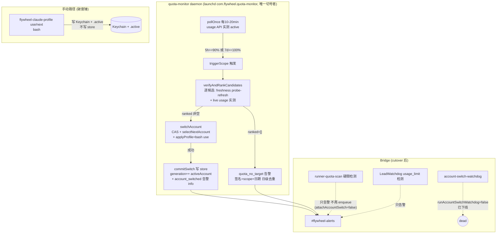

# FLY-1252 自动切号 robust 化 — 探索

Issue: FLY-1252 (https://linear.app/geoforge3d/issue/FLY-1252/infra-claude-accountsjson-配额状态过期不可信-切号器切到已耗尽账号拖垮-lead)
日期: 2026-07-16
基于: 无（Lead 重定向指令 + 2026-07-16 晨间事故日志为输入；旧 PR #618 设计文档为复用输入）

## 0. Scope 重定向说明

本 issue 原 scope（claude-accounts.json 状态可信化）已由旧三段产出 PR #618（Codex design review 5 轮 APPROVED，实现完成后被关闭重开）。Lead（Tadashi）2026-07-16 重定向新 scope：**让自动切号足够好，founder 永不用手动切**，四条：

1. **① 用满就切**：gauge-100 或真硬限都要触发切到可用号（Lead 观察：今晨两者都没造成切换）。
2. **② 选号顺序**：Annie 要「优先切 reset 时间更早的号」——核实 switch-executor 现状是否如此。
3. **③ 切号发通知**：切了要发 Annie 看得见的 Discord 通知（她没收到过）。
4. **④ 手动/daemon 状态一致**：手动 CLI 切号后 daemon 的 claude-accounts.json 还写着旧 activeAccount。
5. **⑤ 身份核验（2026-07-16 追加，Lead 直令 [f478f0bb]）**：FLY-1182 锤死当日第二起事故元凶 = 池凭据交叉污染；切换全路径升级为 email↔账号名身份核验 + 标签漂移侦测（见 §2b、plan §3.6）。

约束：旧 PR #618 的「状态文件治真」（daemon 实测写回 store + 手动路径 quota guard）是本单地基，当现成设计输入复用；手动 CLI 保留为纯应急破窗锤。

## 1. 现状架构（审计结论，2026-07-16 实测）

生产开关实况：`FLYWHEEL_QUOTA_DAEMON_CUTOVER=1`（`~/.flywheel/.env`）——切号执行面已全部收敛到独立 daemon：

关键模块（`packages/teamlead/src/account-heal/`）：
- `quota-monitor.ts::pollOnce` — 触发判定（`trigger5hPct=90` / weekly 100）、cooldown（15min）、候选验证、切换、告警。
- `quota-monitor.ts::verifyAndRankCandidates` — 对 order 里每个非 active 候选：pool 目录成员 → store 条目 → auth 可用 → store cooldown 未过期则跳过 → freshness probe-refresh（10s 超时，fail-closed=stale）→ live usage 实测 → 双窗 <100% 才 qualified；**排序 = 7d resetsAt 最早优先，平手按 config order**。
- `switch-executor.ts::switchAccount` — 单锁临界区：readActiveProfile 对账 → 双 CAS（activeAccount 名 + generation）→ selectNextAccount（preferredOrder ∩ store 标记双过滤）→ applyProfile（bash `use`，freshness 硬闸）→ commitSwitch（源账号写 quotaExhaustedUntil=resetAt、generation++、activeAccount）。
- `account-store.ts::selectNextAccount` — preferredOrder 缺席的 legacy 分支：weekly scope 按 store weeklyResetAt 最早（生产里几乎全 null）；**5h scope 按字母序**。
- `flywheel-claude-profile`（bash）— `use`：freshness 闸 + capture-back 旧号 + Keychain 写 + `.active` + display identity；**从不写 claude-accounts.json**。`next`：**纯字母序轮换，零配额检查**。
- 告警链：`sendQuotaMonitorAlert` → `scripts/lead-alert.sh` → claims.db 去重 → Discord POST 到 `FLYWHEEL_UNIFIED_ALERT_CHANNEL_ID`（#flywheel-alerts）。失败才落 queue/deadletter。**本地 daemon 日志不记 outcome、不记告警、不记 panorama——每 poll 只有一行 gauge。**

## 2. 2026-07-16 晨间事故——完整实证时间线（UTC）

证据源：daemon 日志（/tmp/flywheel-quota-monitor.log）、claims.db（~/.flywheel/alerts/claims.db）、quota-monitor-state.json、claude-accounts.json、pool 目录 mtime。

| 时刻 (UTC) | 事件 | 证据 |
|---|---|---|
| 06:05-06:06 | daemon 重启，quota_monitor_down ×2（state 保守恢复） | claims ×2 + 日志起点 |
| 08:16 | personal1 five_h=98 → **切换成功 personal1→business** | claims `account_switched` 08:16:43；store 里 personal1 cooldown 至 09:30 |
| 11:56 | business five_h=93 → **切换成功 business→school** | claims `account_switched` 11:56:55；store 里 business cooldown 至 14:30；state lastSwitchAt=11:56:49 |
| 12:06 | school five_h=95 ≥90 触发，但距上次切换 10min < 15min → **cooldown 静默返回** | 日志 gauge 行 + 代码路径 |
| **12:16:58** | school 97% 触发 → verifyAndRankCandidates **全候选被拒** → `quota_no_target` 🚨发到 #flywheel-alerts | claims `quota_no_target` 12:16:58 + alert-queue `.rate-202607161216` 标记 |
| 12:37→14:27 | school five_h=100 连续 12 个 poll，每次触发、每次候选验证、**每次结果都被日级去重签名 `quota-no-target-5h-2026-07-16` 吃掉 → 完全静默** | 日志 12 行 gauge=100 + claims 无新行 + state lastSwitchAt 不变 |
| ~12:30-14:30 (05:30-07:30 PDT) | Tadashi Lead + 另一 session 撞硬限停摆；**claims.db 全天零 usage_limit/rate_limit claim** —— pane 侧检测连告警都没发 | claims.db 全表查询 |
| 14:37 | school 5h 窗口自然重置（five_h=4）→「自愈」 | 日志 |
| 15:43 | Annie/Tadashi 手动 `use personal` → Keychain+.active 变 personal；**store.activeAccount 至今仍是 school、generation 仍是 3** | .active mtime + claude-accounts.json 现值 |

修正 Lead 两个原始假设（都往更糟方向）：
- 「隔夜 3 次切换连 switch 事件都没 log」→ 实际 daemon **切换成功且发了 account_switched 告警（claims 实证 ×2）**，只是发到 #flywheel-alerts（Annie 无视线）且本地日志零记录。问题是**送达面 + 可观测性**，不是没发。
- 「daemon 零切换尝试」→ 实际 12:16 起**每个 poll 都尝试了**，是候选验证全军覆没 + 告警去重静默。问题是**候选验证鲁棒性 + 告警 episode 语义**，不是不触发。

## 2b. 2026-07-16 第二起活体事故——静默切号 + 三方不一致（~10:00-10:17 PDT / 17:00-17:17 UTC）

设计进行中（本文档 Codex R8 review 期间）发生第二起事故。信息源 = Lead 直令转述（[4777fd79]/[f478f0bb]，FLY-1182 诊断 runner 取证）；证据文件 `engineering/doc/FLY-1182-*/incident-20260716-pool-contamination.md` 截稿时待落地（开放项 V-2，落地后核对）：

- ~10:00-10:17 PDT 机器被**静默切到 shopping**；founder 零通知。
- **store / 监控 / 实际三方不一致**：监控标签与 Keychain 实际身份对不上——监控在给错的账号记账。
- **元凶（FLY-1182 实锤）**：账号池凭据文件**交叉污染**——pool:personal 槽里装的是 **shopping 的 token**。`capture_back` 按 `.active` 标签写回池槽、全程零身份核验（`flywheel-claude-profile:545-570` + 调用点 `:792-795`）→ 标签一旦错位，污染**自我固化**并随后续切换扩散。
- **一个 GET 就能拿真实身份**：`/api/oauth/profile` 返回 token 的 email/uuid——现有 freshness 硬闸只走 `oauth/token`（证明 token 活着，不证明是谁的），应升级为**身份核验**。
- **「为何零通知」三案例实锤（③ 动机补充）**：(a) `account_switched` 列 INFORMATIONAL 且调用链不带 mention——即使送达也不 @ 人；(b) 同日签名去重把重复事件静默（与 §2 晨间事故同机制）；(c) FLY-929 digest 通知路径在 CUTOVER 后是死路。→ per-kind 路由表方向（plan §3.5）被独立验证正确。

对设计的影响：新增 **P7 身份核验与漂移侦测**（plan §3.6）——六核验点（候选验证/active 漂移/预写闸/切后断言/capture_back 守卫/capture_profile 守卫）+ `identity-set`/`identity-audit` 引导修复工具；①-④ 的修复面不变。

## 3. 四条问题的根因判定

### ① 用满不切 —— 两个独立根因

**①A daemon 侧（主根因）：候选验证全拒后系统躺平。**
12:16 起每个 poll：触发 ✓ → 全候选被拒 → quota_no_target（仅第一次可见）→ 无重试升级、无 episode 变化重报、无本地日志。候选被拒的具体原因已不可恢复（panorama 只存在于 Discord 原文，claims 不存 body，POST 成功不落 queue；Tadashi 与我都无该频道 fetch 权限），但可收窄为有界集合：
- business = store cooldown（至 14:30，正确行为）；
- personal / shopping / personal1 ∈ { freshness probe-refresh 失败(stale)、pool 凭据缺失、usage API 错误 }——**排除 cooldown**（store 里三者无未过期标记）、排除 not_in_pool/not_in_store（目录与 store 都有）。
- 旁证：shopping 的 pool 凭据 mtime=7 月 4 日（12 天未刷新，family 大概率已死）→ 长期 freshness_stale；personal1 的凭据在 14:27（最后一个 100% poll）被成功刷新过 → freshness 路径当时至少间歇可用，但当 poll 仍未产生切换。
- **结构缺陷（与具体拒因无关，全部要修）**：(a) 验证失败=confirmed-exhausted 与 infra-error 不区分，一律躺平；(b) quota_no_target 签名按天去重，阻塞持续 2h 也只响一次（还响在 Annie 睡觉时）；(c) poll outcome / panorama 零本地日志，事后不可诊断（本次事故的直接教训）。

对 Lead bug② 两个假设的证据性回答：(a) cooldown 太长挡住 re-switch？——minSwitchInterval=15min，只挡住了 12:06 一个 poll（距 11:56 切换 10min），12:16 起全部通过 cooldown 检查（quota_no_target claim 即证明流程走到了候选验证）；(b) selectNextAccount 又选回 school → noop？——不可能，`verifyAndRankCandidates` 与 `selectNextAccount` 都显式排除 active 账号（`name === snapshot.activeName continue` / `a.name !== input.currentName`），且 noop_already_switched 只由 CAS（activeAccount 名/generation 不匹配）产生。真因即上述候选验证坍塌 + 日级去重静默。

**①B 硬限 pane 侧：cutover 把检测和执行断开了 + 检测本身也没响。**
`FLYWHEEL_QUOTA_DAEMON_CUTOVER=1` 下 `attachAccountSwitch=false`、`runAccountSwitchWatchdog=false`：LeadWatchdog / runner-quota-scan 检测到硬限最多只告警，**没有任何路径能触发切号**（代码注释明示这是 cutover 的刻意设计）。且今晨连 usage_limit 告警都没发（claims 零记录）——Lead pane 真硬限没被 classify 命中，具体是措辞不匹配（如「5-hour limit reached」不含 "usage limit"）还是 FLY-218 transient 抑制误伤，需要真 pane 采样验证（design 开放项，不阻塞方案）。
daemon 的 usage-API 轮询本身能看到 100%（今晨看到了），所以硬限的**主修复面在 ①A**；pane 信号的价值是把 10-20min 的轮询盲窗缩短——设计方向是把它作为 daemon 的**唤醒信号**（触发立即 poll），而不是恢复第二条切号执行路径（保持单执行者不变式）。

### ② 选号顺序 —— 排序机制存在，但资格线与排序维度有真缺陷（bug①）

- daemon 主路径（verifyAndRankCandidates）：排序**已经是「7d reset 最早优先」**（`resetMs` 升序，平手按 config order）——与 Annie「优先切 reset 时间更早的号」方向一致（= FLY-696 的「maximize quota：周五先用周一 reset 的」规则）。**机制存在**（呼应 Annie「本来就做了」），但：
- **bug①（Lead 诊断线索 + 日志实证）：资格线只排除 ≥100%，排序只看 weekly reset、不看 5h 余量 → 会选中快满的号。** 昨晚 11:56 UTC（05:06 PDT 后一轮）business→school 切换选中的 school，12:06 首个 active gauge 已是 five_h=95 —— 即选号时刻 school 已 ~93-95%。一个 ≥trigger5hPct(90) 的候选当选后几乎立即再触发（school 20 分钟后到 100%），叠加候选验证坍塌（①A）就变成 2h 停摆。11:56 时 personal 是否 qualified 无法事后区分（panorama 不可恢复）：若 qualified 则是排序缺陷实锤（school 靠更早 weekly reset 压过健康的 personal）；若 personal 当时已 unverifiable 则 school 是「唯一可选」——**两种情况修法相同**（资格分档 + 验证鲁棒化，见 §4），不依赖区分。
- 不一致 1：legacy `selectNextAccount` 无 preferredOrder 时，5h scope 按**字母序**（cutover 下此分支基本不可达，但它是语义孤儿）。
- 不一致 2：手动 `next` 纯字母序、零配额观念（Lead 已定位为破窗锤，可接受，但拒绝消息应指路「哪个号现在有量」——旧 PR #618 的 G1 已设计了这一块，复用）。
- 修法方向：候选资格**分档**——tier0 = 5h < trigger5hPct 且 7d < 100（切过去不会立刻再触发），tier1 = 5h ∈ [trigger5hPct, 100)（仅 tier0 为空时兜底，按 5h 余量最大优先）；各档内保持 earliest-7d-reset 排序。

### ③ 通知 —— 发了，但发到 Annie 没视线的地方；且 episode 语义缺失

- account_switched（info 级）×2 与 quota_no_target（severe）×1 **全部成功送达** #flywheel-alerts（claims + 零 queue spill 实证）。Annie 不看这个频道 → 「没收到」的真相（Tadashi 已确认此判定）。
- lead-alert.sh 支持 `--mention-user` 但 quota-monitor 调用链没传 → 即使她进频道也不会被 ping。
- quota_no_target 日级去重 = 阻塞持续也只响一次；恢复（切换成功/窗口重置）无收尾通知 → Annie 视角是黑箱。
- Lead 提到的 account-switch-watchdog 通知机制在 cutover 下整体下线（①B 同源），不是送达失败。

### ④ 手动/daemon 状态不一致 —— use_profile 从不写 store

bash `use_profile` 写 Keychain + `.active` + display identity，**不碰 claude-accounts.json**（activeAccount 不更新、generation 不 bump）。daemon 运行不受影响（它以 `.active` 为 active 权威，switchAccount 里还有 realActive 对账），但 store 作为状态文件对一切读者撒谎（今天实况：Keychain=personal 已 3 小时，store 仍写 school）。这正是原始 issue「status LIES」的手动路径残留——旧 PR #618 的 G2「store 变真」只覆盖了观察字段回写，activeAccount 的手动路径同步是本单要补的。

## 4. 方案方向（brainstorm 结论，供 research/plan 展开）

**总原则：单执行者不变式不动（daemon 是唯一自动切号者），修四个面：触发→验证→执行的鲁棒性、状态治真、送达面、可观测性。旧 PR #618 的 G2/G3（观察回写 + generation CAS + guard CLI + 锁租约）整体复用为地基。**

1. **①A 候选验证分级降落（核心新设计）**：verifyAndRankCandidates 把候选结局分三类——`confirmed_usable`（实测 <100%）/ `confirmed_exhausted`（实测 ≥100%）/ `unverifiable`（freshness 失败、凭据缺失、usage API 错误）。ranked 为空时：若存在 unverifiable 候选 → 按「store 标记可用 + 观察数据最新」挑一个做**受控降落切换尝试**（applyProfile 自带 freshness 硬闸兜底，写坏 Keychain 的风险仍被旧红线挡住），并升级告警为「降落模式切换」；若全部 confirmed_exhausted → 维持 no_target 但给出 earliestReset 等待建议。政策风险点（信 store 降落 vs 纯 fail-closed）在 gate 里请 Lead 拍板。
2. **①A 告警 episode 语义**：quota_no_target 从「日级签名」改为「episode 语义」——进入阻塞报一次（@Annie mention），阻塞持续每 N 分钟升级重报（签名带 episode 段），**恢复时发收尾**（切换成功/窗口重置）。复用 FLY-220 episode-latch 的成熟形态。
3. **①B pane 硬限 = daemon 唤醒信号**：Bridge 检测到 usage_limit/runner cap 时 touch 一个 wake 文件或发 SIGUSR（daemon 已有 wakeWaiter 机制），daemon 立即 poll；不恢复 Bridge 侧第二执行路径。pane classify 对硬限措辞的适配 = 真 pane 采样后的小修（开放项）。
4. **② 排序**：主路径保持 7d-reset-最早优先（与 Annie 规则一致，gate 确认）；铲掉 legacy 5h 字母序分支的语义孤儿问题（统一走同一排序函数）；`next` 保留破窗锤但输出全景建议（复用 #618 G1 拒绝消息设计）。
5. **③ 送达面**：切号/阻塞/恢复三类事件加 founder 可见路由——方案候选：(a) lead-alert 加 `--mention-user Annie` + 保持 #flywheel-alerts；(b) 关键事件（no_target 阻塞、降落切换）额外投递 core channel / founder thread。选型在 plan 里定（倾向 a+b 混合：info 级只 mention，severe 级双投）。
6. **④ 状态治真**：手动 `use` 成功后在 bash 锁内调 caller-holds-lock 的 node helper 同步 store（activeAccount + generation++ + 观察字段），复用 #618 的 store 写并发纪律（generation CAS / last-observed-wins / corrupt store 不覆写）;失败不阻塞切换本身（Keychain 权威），但响亮告警。
7. **可观测性（本次事故的直接教训）**：pollOnce 每次非 observed outcome 都写结构化日志行（outcome + panorama 摘要 + 告警投递结果）；日志挪出 /tmp 到 ~/.flywheel/logs 带轮转。

## 5. 开放问题（brainstorm gate 向 Lead 确认）

1. **降落政策**：全候选 unverifiable 时允许「信 store + freshness 硬闸」的降落切换，还是维持 fail-closed 只升级告警？（我推荐降落——freshness 硬闸已挡住写坏 Keychain 的真风险，躺平 2h 的代价今晨已经付过一次。）
2. **② 排序确认**：7d-reset-最早优先 = Annie 的「优先切 reset 更早的号」？
3. **③ 送达面选型**：mention + 双投的组合是否符合 Annie 的通知习惯（她的视线在 core channel / issue thread）。
4. **分支拓扑**：本地 flywheel-FLY-1252 从 main 新开，但 remote 同名分支还挂着 OPEN 的旧 PR #618（含已 APPROVED 的旧实现）。push 设计文档时：(a) merge 旧分支保留其 commits 再叠加（PR #618 变成新方向的载体）；(b) 关闭 #618 + force-push 重开；(c) 我换新分支名。需要 Lead 定。
