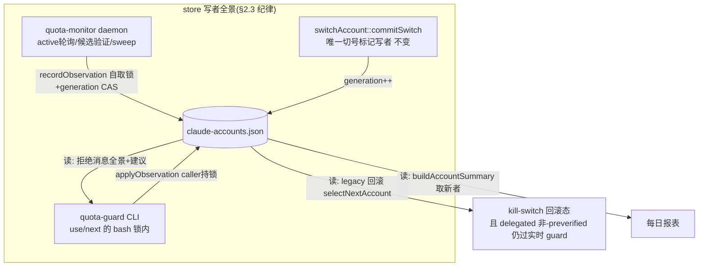

# FLY-1252 claude-accounts.json 配额状态可信化 — 实施计划

Issue: FLY-1252 (https://linear.app/geoforge3d/issue/FLY-1252/infra-claude-accountsjson-配额状态过期不可信-切号器切到已耗尽账号拖垮-lead)
日期: 2026-07-16
基于: exploration.md, research.md

**Status**: **final** — Codex design review 5 轮 APPROVED(R1 8 项 + R2 6 项 + R3 3 项 + R4 2 项全采纳;R5 两条 non-blocking 提醒已折入)
**方案**: C(Lead brainstorm gate 批准)= daemon 观察回写 store + 手动 use/next 切前实测硬闸
**版本号**: ship 时取空号(FLY-494 惯例)
**执行方式**: 本分支 implement phase 接手,TDD(RED→GREEN→REFACTOR)

## 0. 总览

事故根因链:claude-accounts.json 是假的 → 手动切号信了它 → 切到 weekly 耗尽的 business → 双 Lead 哑火 30 分钟。FLY-1256 已把**自动**切号路径改成「切前逐候选实测,不信 store」;本单把剩下的修完:

1. **store 变真**(G2/G3):daemon 每次实测(active 轮询 / 候选验证 / 候选扫描)把观察结果回写 claude-accounts.json —— exhausted 标记带真实 reset、健康清 null、带观察时间戳与双窗口 pct;写入带 generation CAS,绝不覆盖更新的切号标记。
2. **手动路径硬闸**(G1,事故主路径):`flywheel-claude-profile use/next` 在 freshness 验证后对目标实测配额,任一窗口 ≥100% 硬拒(exit 32),拒绝消息用 store 观察数据告诉人「哪个号现在有量」;实测不能(网络/API 挂)手动模式 fail-closed(exit 33);紧急 bypass env 响亮(stderr 警告 + `quota_guard_bypassed` 告警)。
3. **legacy 回滚路径顺带闭环**(Codex R1#7):撤 CUTOVER 后的 Bridge 切号(delegated 但**非** daemon)同样过实时 quota guard —— 修复方向②在回滚态也成立。
4. **daily summary 真实受益**(Codex R1#4):`buildAccountSummary` 的余额展示按「ledger 快照 vs store 观察谁更新用谁」取源并标注来源+age —— G2 承诺的这个消费者不再靠假设。

Lead 四钉子落位:① bypass 响亮 → §4.4/§5;② 拒绝消息可行动 → §4.5;③ 写并发纪律 → §2.3;④ kill-switch 回滚回归 → §6 T-9 + §7 验收 4。



## 1. 文件清单

### 新增

| 文件 | 职责 |
|---|---|
| `packages/teamlead/src/account-heal/quota-guard-cli.ts` | guard CLI(纯入口 + 注入 deps,镜像 freshness-cli)。子命令 `check --name <t> --pool <dir> [--store <path>]`。exit 0=有量 / 32=耗尽 / 33=无法判定(含自身错误、dist 缺失由 launcher 兜)。**caller 持锁约定**(freshness helper 同款,自己绝不取锁)。`observedAt` 在 usage response 成功返回后取时(不是网络请求前),避免并发 daemon 写让更新鲜的 guard 事实被误判旧。stderr 人类可读,**token 永不落任何输出** |
| `packages/teamlead/bin/flywheel-claude-quota-guard` | bash thin launcher → `node dist/account-heal/quota-guard-cli.js`(镜像 `flywheel-claude-freshness`;dist 缺失 exit 33)。**登记 `packages/teamlead/package.json` 的 `bin`/`files`** |
| `scripts/qa-fly-1252-quota-state-e2e.sh` | 可运行断言 e2e(§6 T-10/T-11):mock usage API + scratch pool/store/lock,事故复现 + daemon 回写一致性 + 回滚组合链 |

### 修改

| 文件 | 改动 |
|---|---|
| `packages/teamlead/src/account-heal/account-store.ts` | ① `AccountEntry` 加 optional `lastObservedAt?: string` / `observedFiveHPct?: number` / `observedSevenDPct?: number`;② 纯函数 `applyObservation(entry, obs)`(§2.1,唯一语义实现);③ IO 函数 `recordObservationInStore(storePath, name, obs, opts)`(§2.2:**不取锁**、typed result、**永不 throw**、corrupt store 绝不覆写);④ `readStoreStrict(path)` 内部辅助(区分「文件缺失」「JSON 损坏」与「正常」,现有 `readStore` fail-soft 语义**零改动**);⑤ **`selectNextAccount`:`preferredOrder` present 时的 quota 权威 = 实测 + 时效闸**(Codex R2#1 方案 B + R3#1 TOCTOU 修正):`SelectInput` 加 `verifiedAt?: string`;preferredOrder present 且 verifiedAt present → 忽略 `lastObservedAt <= verifiedAt` 或无时间戳的旧 cooldown 标记,但 **`lastObservedAt > verifiedAt` 的未过期 exhausted 标记仍排除该候选**(验证之后写入的更晚事实赢);preferredOrder present 而 verifiedAt absent → 保守沿用全部未过期标记(旧行为);**malformed 时间保守闸**(Codex R5 note-2):`verifiedAt` 或 `lastObservedAt` 任一不可解析 → 视同「无法证明标记比验证旧」,照常 honor 未过期标记(NaN 比较绝不静默放行);`isAuthUnusable` 过滤两种情况都保留;**absent-preferredOrder 分支字节不变**(legacy 回滚路径继续吃 store 标记,byte-compat 哨兵) |
| `packages/teamlead/src/account-heal/quota-monitor.ts` | ① `QuotaMonitorDeps` 加 `recordObservation: (name, obs, expectedGeneration) => Promise<RecordObservationResult>`(实现方取锁);三调用点:a) active 实测成功且 `commitSuccessfulObservation` 返回 true 后(传当次快照 generation;`refreshNewActive` 同路径);b) `verifyAndRankCandidates` 每次候选 fetch ok 后立即(传快照 generation);c) `sweepCandidates` 每次 fetch ok 后。结果非 `updated` → `deps.log` 结构化一行;**任何投影失败不得中断 poll 主流程**。② **`verifyAndRankCandidates` 移除 `isQuotaUsable` 预过滤**(Codex R2#1 方案 B):切号时刻对**全部** pool∩store∩auth-usable 候选实测,资格纯由 live 数据判定(cooldown 中的候选也被实测——未到期误标由此可达可清,quota_no_target 不再可能被误标造成);`sweepCandidates` 的预过滤**保留**(例行扫描不为已知耗尽账号烧 usage 桶,标记自带到期);③ `switchAccount` 调用传 `verifiedAt` = 本轮候选验证起始时刻(R3#1 TOCTOU 闸)。触发/冷却/revive/state 逻辑零改动 |
| `packages/teamlead/src/account-heal/quota-monitor-runtime.ts` | ① 接线 `recordObservation`:`withAccountsLock(() => recordObservationInStore(...))`,内建 try/catch(异常折成 `write_failed`);② 进程内投影失败 streak(不持久化):连续 ≥3 次 `write_failed`/`invalid_store` → `quota_monitor_down` 告警(签名 `quota-monitor-store-projection-<day>`,日去重),成功即清零;③ `switchAccount` deps 改为 `makeClaudeProfileSwitchDeps({ binPath: claudeProfileBinPath(), quotaPreverified: true })`(既有 binPath 保留——Codex R2#5) |
| `packages/teamlead/src/account-heal/switch-executor.ts` | ① 新 `TargetQuotaExhaustedError`(镜像 TargetStaleError):候选被 guard exit 32 拒 → **重新 readStore(guard 已在同一把锁下写入真实 exhausted 标记)** → 以磁盘新状态继续候选循环(此路径只在 legacy/无 preferredOrder 下发生,selectNextAccount 的 store 标记过滤天然跳过它,不会复选死循环);② `no_account.reasonCode` 增枚举值 `"target_quota_exhausted"`;③ `SwitchInput` 加 `verifiedAt?: string`(透传 selectNextAccount,daemon 传候选验证扫描的起始时刻);④ **`SwitchDeps` 加 required `renewLock: (lockPath: string) => boolean`**(Codex R4#1:`switchAccount` 把自己解析出的实际 lockPath 传入——自定义 storePath/lockPath 与现有 integration 测试注入面因此不破;factory 默认接 `renewMkdirLock`,测试 fake 显式返回 true),候选循环每轮迭代前调用;**false/throw → typed `failed.reasonCode: "lock_lease_lost"`,自租约丢失起不再 apply 任何后续候选、不再写任何共享状态**(Codex R4#2:保证是「丢失后零 apply/零 Keychain 写」,此前已尝试过的候选不在追溯范围)。commitSwitch/CAS/generation 语义零改动 |
| `packages/teamlead/src/account-heal/mkdir-lock.ts` | ① 每次 acquire 创建唯一 `holder.<pid>.<token>` marker;`renewMkdirLock` 只 touch 已登记的 token+inode,非本进程/缺失/replacement → false。② stale 判定对有效 pid 只信 liveness(dead 才拆),age 仅用于无/损坏 pid/marker。③ stale-break/release 只 unlink 精确 marker + `rmdir`,绝不递归删除共享路径;确定性交错测试在 inspection/release 临界点安装 replacement,验证新锁存活。legacy `holder` 只读兼容。 |
| `packages/teamlead/src/account-heal/claude-profile-cli.ts` | **`ClaudeProfileCliDeps` 加 optional `quotaPreverified?: boolean`**(Codex R2#5:工厂形状与既有必填 `binPath`、`execFile/withLock/onWarn` 注入面全部保留):① 现有 delegated env 注入不变;② `quotaPreverified: true` → 子进程 env 加 `FLYWHEEL_CLAUDE_QUOTA_PREVERIFIED=1`;false/缺省(legacy repair 等)→ **确保该 env 被剥除**;③ **同时剥除 `FLYWHEEL_CLAUDE_QUOTA_BYPASS`**(镜像既有 freshness bypass 剥除,自动路径永不吃人的逃生 env);④ use exit 32 → `TargetQuotaExhaustedError`,exit 33 在 delegated 模式不会发生(§4.3 fail-open 设计),仍防御性映射为 apply_failed |
| `packages/claude-runner/bin/flywheel-claude-profile` | §4 全部:`DELEGATED_LOCK_ACCEPTED` 内部标志(只在 acquire_lock 三重校验通过时置 1,guard/bypass 判定**只读该标志,绝不读原始 env**);`quota_guard()`;三 helper 单锁核心重构(use/next 共用,§4.2);bypass 响亮(§4.4);拒绝消息(§4.5);next 候选循环(§4.6);bash 锁与 Node 同一唯一 marker/dead-PID/non-recursive fencing;`renew_lock` 只 `touch -c` 自己 token marker,失败 → Keychain 写前硬停;delegated 子进程不碰父 marker。bypass 告警只在内存保留 alert env allowlist,不再把全量 exported secrets 快照到临时文件。 |
| `packages/teamlead/src/account-heal/account-ledger.ts` | `buildAccountSummary`(Codex R2#4 修正合同):每账号余额取源 = ledger `balance.observedAt` vs store `lastObservedAt` **谁新用谁**;summary line 模型加 `balanceSource: "ledger" \| "observed" \| null`;**胜出的那份快照同时供给 pct + reset + age(绝不混源**——含现在无条件取 store `weeklyResetAt` 的那处);formatter 兼容策略 = **条件标注**:仅 `observed` 胜出时渲染 `observed <age> ago` 注记,ledger 胜出或无 store 观察 → 输出与现状逐字一致(T-13 哨兵因此可同时成立);invalid timestamp/单侧缺失按「可解析者胜」;cap event/auth 段不动 |
| `scripts/lead-alert.sh` | kind 白名单 + `quota_guard_bypassed` |
| `packages/teamlead/src/LeadAlertNotifier.ts` | `ALERT_EVENT_TYPES` + `quota_guard_bypassed`(**不进** `INFORMATIONAL_KINDS`)(Codex R1#5 路径更正:该文件在 `src/` 根,非 `src/bridge/`) |
| `packages/teamlead/src/LeadWatchdog.ts` | `titleFor()`/`bodyFor()` 两个无-default exhaustive switch 补 `quota_guard_bypassed` case(仓库 `noImplicitReturns=true`,不补直接编译失败——Codex R1#5) |
| `packages/teamlead/src/bridge/kind-contract.ts` | `KIND_CONTRACTS.quota_guard_bypassed = {owner: "claude", arc: "human_by_design"}`(FLY-1256 非 informational kind 同形) |
| `packages/teamlead/src/bridge/__tests__/kind-contract.test.ts` | drift 守卫同步 |

### 不改(显式)

`freshness.ts`/`freshness-cli.ts` 本体 · `quota-usage-api.ts` · `quota-monitor-state.ts`/`quota-revive-scan.ts`/`quota-monitor-config.ts` · `account-summary-cli.ts`(只改其依赖的 buildAccountSummary)· statusline 缓存 · runner-quota-detector 检测链 · Bridge CUTOVER 接线(`quota-daemon-cutover.ts`)· `account-switch-repair.ts`(它经 deps 构造器自动获得非-preverified 行为,自身零改动)。

## 2. 核心契约

### 2.1 `applyObservation` 语义(唯一实现,三写点共用)

- `quotaExhaustedUntil` = `sevenDPct >= 100` ? `sevenDResetAt` : `fiveHPct >= 100` ? `fiveHResetAt` : `null`(weekly 支配,与 commitSwitch 的 operativeResetAt 一致)。
- 该窗口 resetsAt 不可解析或 `<= observedAt` → 该窗口视为未耗尽;双窗口 pct≥100 但 resetsAt 全无效 → 保守不标(依赖下轮观察)。
- `weeklyResetAt = sevenDResetAt`(可解析时;否则保留旧值)。
- `lastObservedAt/observedFiveHPct/observedSevenDPct` 全量覆盖。
- 纯函数;不碰 `authExpired` 家族、`name`。

### 2.2 `recordObservationInStore(storePath, name, obs, opts)` (IO,不取锁,永不 throw)

typed result:`"updated" | "stale_generation" | "older_observation" | "missing_account" | "invalid_store" | "write_failed"`。

1. **strict 读**:文件缺失或 JSON 损坏/形状非法 → `invalid_store`,**绝不写**(readStore 的 fail-soft empty-store 语义只服务既有读者;观察投影绝不能拿 empty store 覆写一个损坏文件——Codex R1#3)。
2. **generation CAS**(`opts.expectedGeneration` 提供时,daemon 路径必传):磁盘 generation ≠ expected → `stale_generation` 丢弃 —— 防「锁段间隙插入的切号刚写的 cooldown 被切号前旧观察清掉」(commitSwitch 不写 lastObservedAt,纯 last-observed-wins 防不住此序——Codex R1#3)。guard CLI 路径(bash 持锁全程,切号不可能插入)不传 expectedGeneration。
3. **last-observed-wins**:entry.lastObservedAt 存在且 > obs.observedAt → `older_observation` 丢弃。
4. find by name;缺席 → `missing_account`(池成员资格不归观察管)。
5. applyObservation → 原子 writeStore;IO 异常捕获 → `write_failed`。
6. **generation 与 activeAccount 绝不触碰**(测试断言写前后恒等)。

### 2.3 store 写并发纪律(钉子③)

| 写者 | 写什么 | 锁形态 | 一致性闸 |
|---|---|---|---|
| `switchAccount::commitSwitch` | 切号标记 + generation++ + activeAccount | 自取(现状) | CAS(observedAccount+generation,现状) |
| daemon `recordObservation` | 观察字段 + exhausted 标记/清除(**唯一自动观察写者**) | `withAccountsLock` 自取 | generation CAS + last-observed-wins |
| guard CLI(use/next bash 锁内) | 同 daemon(仅被探测账号) | **caller(bash)持锁,自己不取**(取则死锁,FLY-852 镜像;freshness helper 同约定) | bash 锁独占期内无切号可插入 + last-observed-wins |

锁序:全部单锁(`claude-accounts.lock`),无嵌套新锁。锁内网络预算:手动单目标 = freshness(10s 超时)+ quota(10s 超时)≈ 最坏 20s;legacy delegated 候选循环最坏叠加见 §10 R-8。

### 2.4 锁租约合同(Codex R2#3 + R3#2/#3 硬保证)

实现期 code review 追加了更强 fencing:旧的 `holder` 共享路径 + check-then-rm/rename 仍有 TOCTOU,可能让旧 holder/并发 waiter 删除 replacement。最终合同采用**唯一 marker 文件名 + dead-PID stale 证明 + 非递归释放**。Keychain 正确性优先于强抢一个活着但卡住的进程:只要 holder pid 仍活着,age 再老也绝不 steal;PID/marker 缺失时 age 才是损坏兜底。两条长临界区仍保留续租与 commit 前硬闸,用于及早发现 ownership 丢失与记录活性。

1. **续租**:Node `renewMkdirLock(lockPath)` / bash `renew_lock()` 都只触碰自己唯一的 `holder.<pid>.<token>` marker inode/path(不再 tmp+rename 共享 `holder`);marker/token/inode 任一不匹配即 false,绝不在 replacement 目录创建/覆盖 marker。续租点:Node `switchAccount` 每候选迭代前(经注入的 `deps.renewLock`);bash `next` 每候选 prepare 前后 + winner commit 前;bash `use` commit 前一次(统一合同);delegated 子进程不碰父租约。
2. **续租失败 = 硬停**:Node → typed `failed.reasonCode:"lock_lease_lost"`,**自失败点起不再 apply 任何后续候选、不再写任何共享状态**(此前迭代已发生的 apply 尝试不在追溯范围——R4#2 语义精确化);bash → 任何 Keychain 写之前 `fail`。租约丢了就绝不再写共享状态。`renewLock` 签名带 `lockPath`(switchAccount 传入自己解析的实际路径,保住自定义路径与测试注入面——R4#1)。
3. **释放 ownership-fenced**(R3#3):Node finally 与 bash trap 只 unlink 自己唯一 marker,再用 `rmdir` 删除空目录;禁止 `rm -rf`。replacement 已建立时 marker 路径不同且目录非空,旧 holder 既删不到它也 `rmdir` 不掉它。
4. **stale-break**:只有 dead PID 才可立即拆 marker;无/损坏 PID 或无 marker 时才按 120s age 兜底。拆除同样只 unlink 当次观察到的 marker + `rmdir`;并发 replacement/ambiguous marker 一律 fail-closed。live-but-hung holder 需终止对应进程恢复,不可用并发 Keychain 写换可用性。

fake-clock 并发测试(T-14):holder 存活且续租、age 逼近阈值 → Node/bash waiter 均不得 steal;holder 释放后 waiter 进入;holder 死亡 → 照常 steal;续租 false/throw → lock_lease_lost 且**失败点后零后续 apply/零 Keychain 写**;holder 被替换后 → 续租拒绝覆盖、旧 holder 清理不删新锁;manual-next 长场景(多个 20s fake 候选 + 30s identity 等待)全程锁不被夺。

### 2.5 guard CLI exit-code 契约

| exit | 含义 | 手动模式 bash 行为 | delegated 非-preverified(legacy)行为 |
|---|---|---|---|
| 0 | 双窗口 <100%(观察已落 store) | 继续切号 | 继续切号 |
| 32 | 任一窗口 ≥100%(exhausted 标记已落 store;stderr 全景 §4.5) | `fail_code 32`,不切 | `fail_code 32` → Node 侧 `TargetQuotaExhaustedError` → 重读 store 继续候选循环 |
| 33 | 无法判定(token 缺失/过期、网络、429、401、payload 异常、store 读写异常、helper/dist 缺失) | `fail_code 33` fail-closed,提示 bypass env | **warn + 放行**(fail-open;理由 §4.3) |

## 3. daemon 侧行为(变更后)

- 每次 active 实测成功且 CAS 复核(commitSuccessfulObservation)通过 → `recordObservation(active, obs, snapshotGeneration)`(statusline 缓存照旧)。
- **切号时刻不信 store 的陈旧标记,但尊重比验证更晚的事实**(Codex R2#1 方案 B + R3#1):`verifyAndRankCandidates` 对全部 pool∩store∩auth-usable 候选实测(**cooldown 标记不再预过滤**),资格纯由 live 数据判定;每个实测 ok 的候选落观察(传快照 generation)——实测 <100% 顺带清掉陈旧标记;`switchAccount` 收到 `verifiedAt` = 本轮候选验证的起始时刻,`selectNextAccount`(preferredOrder present)只忽略 `lastObservedAt <= verifiedAt` 或无时间戳的旧标记,**`lastObservedAt > verifiedAt` 的未过期 exhausted 标记仍排除候选**(验证之后手动 guard/他方写入的更晚事实赢——TOCTOU 闸)。两层合起来的保证:**旧投影失败(write_failed)不影响选中 live-verified 候选,更晚的真实 exhausted 事实又绝不被 preferredOrder 碾过**(T-4 三组显式测试:record updated / record write_failed / newer-exhausted-mark)。
- accelerated 档 sweep 每 ~60min 给闲置候选落观察(现状 fetch 后丢弃)。base 档闲置账号长期无观察 → store 如实保留旧 lastObservedAt(消息按 age 诚实展示)。
- 投影结果非 updated → 结构化 log 一行;连续 ≥3 次 write_failed/invalid_store → `quota_monitor_down`(签名区分 store-projection,日去重);**任何投影问题不 crash、不影响轮询/触发/切号**(Codex R1#3:polling 存活性优先)。
- stale_snapshot(CAS 复核失败)→ 不落观察(与现状丢弃一致)。

## 4. 手动/委托路径行为(变更后)

### 4.1 delegated 信任模型(Codex R1#1 根治)

- `acquire_lock()` 现有三重校验(env pid == 活 holder pid == `$PPID`)通过时置**内部标志 `DELEGATED_LOCK_ACCEPTED=1`**(shell 局部变量,非导出);校验不成立走正常取锁,标志保持 0。
- quota guard / bypass 判定**只读 `DELEGATED_LOCK_ACCEPTED`,绝不读原始 `FLYWHEEL_CLAUDE_LOCK_DELEGATED`** —— 锁空闲时伪造 env 的进程会正常拿锁但标志为 0,照常过 guard(T-7 四组对照:伪 env 无锁 / holder 不匹配 / 非父 holder / 真 delegated)。
- `FLYWHEEL_CLAUDE_QUOTA_PREVERIFIED=1` **仅在 `DELEGATED_LOCK_ACCEPTED=1` 时才被读取**(该 env 只能由真锁持有者注入 = 我们自己的 Node 代码,伪造者过不了三重校验)。

### 4.2 单锁核心重构:`switch_profile_locked <name>`(Codex R1#2)

把 `use_profile` 的锁后段抽成**三个非导出 helper**(Codex R2#6:prepare/commit 边界必须可命名、不可被 env/参数伪造的开关替代),guard 函数循环安全化(返回码而非 `fail_code` 直接退出;顶层入口负责把非零码转成进程退出):

```
prepare_profile_locked <name>:           # 前置: caller 已持账号锁;恰好一次 freshness + 一次 quota
  freshness_check <name> <active>        # 返回 0/30/31(不退出)
  quota_check <name>                     # 返回 0/32/33(不退出;内部处理 preverified/bypass 分支)

commit_profile_locked <name>:            # 只做提交;绝不重跑任何 guard
  再读 pool credential(freshness 可能已轮转写回)
  capture_back / kc_write / verify-before-commit / .active / sync_identity   # 现状逻辑原样搬移

switch_profile_locked <name> = prepare_profile_locked + commit_profile_locked
```

- `use`:`require_pool_entry → acquire_lock → switch_profile_locked <name>`;guard 非零 → 映射 `fail_code`(32/33 语义 §2.5)。`next`:每候选调 `prepare_profile_locked`,胜出者调一次 `commit_profile_locked`(§4.6)。锁恰好取一次;每候选恰好 freshness 一次、quota 一次;**commit 只用刚写回的 pooled credential,绝无第二次预检/轮转**(refresh-token family 不重复旋转;T-7/T-8 断言 commit helper 恰好一次、失败候选从不进 commit)。
- 行为字节面:非 guard 分支(freshness 30/31、verify-before-commit、rollback、identity)与现状逐字一致 —— 重构是搬移不是改写(T-7 以现有 claude-profile 测试全绿为哨兵)。

### 4.3 quota_check 分支(preverified / legacy / 手动)

1. `DELEGATED_LOCK_ACCEPTED=1` 且 `FLYWHEEL_CLAUDE_QUOTA_PREVERIFIED=1`(= FLY-1256 daemon:它在 verifyAndRankCandidates 刚实测过该目标)→ **跳过**(重复实测浪费 usage 桶 5 次/5min/token + 拖长锁内时长)。
2. `DELEGATED_LOCK_ACCEPTED=1` 且无 preverified(= **legacy Bridge 回滚路径**,同样经 makeClaudeProfileSwitchDeps 注锁但从不做候选实测——Codex R1#7)→ **实时 guard 照跑**:32 → fail_code 32(Node 捕获为 TargetQuotaExhaustedError,重读 store 续循环);33 → **stderr warn + 放行**。fail-open 理由:回滚路径是 daemon 死掉后的安全网,usage API 不可用时把它整个锁死比「按 store 标记基线过滤 + 放行」更危险;手动路径有人有 bypass,自动回滚路径没有人在场。
3. 非 delegated(手动)→ 实时 guard:32/33 均硬停(§2.5);bypass 见 §4.4。
4. helper bin 解析:`default_quota_guard_bin()` 镜像 `default_freshness_bin()` 相对推导(claude-runner/bin → teamlead/bin),env `FLYWHEEL_CLAUDE_QUOTA_GUARD_BIN` 覆盖;缺失 = exit 33 语义。

### 4.4 bypass(钉子①,Codex R1#6 运行时契约补全)

`FLYWHEEL_CLAUDE_QUOTA_BYPASS=1` 且 `DELEGATED_LOCK_ACCEPTED=0`(自动路径两层免疫:deps 构造器剥 env + delegated 分支根本不读它):

1. stderr 醒目警告(镜像 FRESHNESS_BYPASS 措辞纪律);
2. 尽力发 `quota_guard_bypassed`(severity warning):
   - **alert bin 解析**:`FLYWHEEL_LEAD_ALERT_BIN` env → 否则脚本相对推导 `<repo>/scripts/lead-alert.sh`(profile bin 位于 `packages/claude-runner/bin/`,推导 `../../../scripts/lead-alert.sh`);
   - **alert env 加载**:子 shell 内 `set -a; source ~/.flywheel/.env`(存在时)再 exec alert bin —— 变量不泄回父进程(镜像 quota-monitor-wrapper 的 env 姿态;进程已设值优先,source 不覆盖已导出值的语义在子 shell 中以「先快照后恢复」保证,与 wrapper 同款);
   - 调用(Codex R2#2:`--title`/`--body` 是 lead-alert.sh 必填,缺则 config_error 连 claim 都进不去):`--lead quota-monitor --project flywheel --kind quota_guard_bypassed --severity warning --title "Claude quota guard BYPASSED manually" --body "target=<name>; at=<ISO时刻>; pid=<pid>; manual emergency bypass of quota verification (FLYWHEEL_CLAUDE_QUOTA_BYPASS=1) — target quota NOT verified" --signature quota-guard-bypass-<target>-<epoch秒>-<pid> --strict-delivery`(body 只含账号名/时刻/pid,**零 token 零路径凭证**;pid 保证同秒两次 bypass 两个 claim——Codex R1#6);
   - 结果映射:stdout `sent`/`queued_transient` = ok(stderr 一行确认);`config_error`/`dead_lettered`/`duplicate` 及其他 → stderr WARN 注明告警未达(**不阻塞切号** —— 紧急通道优先,但绝不静默:醒目警告永远在);测试断言两必填参数非空 + strict stdout 归类。
3. 然后跳过 quota 检查继续切号。

### 4.5 硬拒消息(钉子②,Codex R1#8b 修正)

exit 32 时 guard CLI 读 `--store` 全池数据,stderr 输出:

- 目标双窗口实测 + reset 时间;
- 全池逐账号:`5h%/7d% + observed <age> ago + exhausted-until/unknown`;无观察数据 → `(no observation data)`;
- **Suggestion 资格** = `!isAuthUnusable && isQuotaUsable(now)` && 观察数据双窗口 <100%(复用 store 既有判定,不推荐 cooldown/auth 坏号);多个合格取 lastObservedAt 最新;age > 24h 前缀 `(stale)`;措辞 `last observed with quota <age> ago; the command will re-verify`(建议是线索不是保证);**无合格且足够新鲜者 → 不给确定性建议**,打印 earliest reset;
- 末行 bypass env 提示(注明会告警);
- 语义修正(Codex R1#8a):拒绝时 **Keychain/.active 未动,但目标的 pool token 可能已被 freshness 安全轮转写回**(rotation 本身无害且必须保留——测试断言轮转后的 token 存续可用)。

### 4.6 `next`

`acquire_lock` 一次 → round-robin 顺序对每个候选在锁内调 `prepare_profile_locked`(恰好一次 freshness + 一次 quota;**每候选前后 `renew_lock` 续租**,失败 → 任何 Keychain 写之前硬停——§2.4):quota 32 → stderr 记 `skipping <name>: quota exhausted` 试下一个;freshness 30/31 → 整体硬停(auth 问题要人管,现状语义);quota 33 → 整体硬停(手动模式 fail-closed);首个通过者 → **commit 前再续租一次**,调一次 `commit_profile_locked`(绝不重跑 guard);全部被拒 → 汇总硬停(§4.5 全景)。行为变更(原先盲选下一个)PR 描述显式注明。

## 5. 告警 kind:`quota_guard_bypassed`(五处同步,Codex R1#5 修正)

① `scripts/lead-alert.sh` 白名单;② `packages/teamlead/src/LeadAlertNotifier.ts::ALERT_EVENT_TYPES`(非 informational);③ `packages/teamlead/src/LeadWatchdog.ts::titleFor/bodyFor` 两个 exhaustive switch 补 case;④ `kind-contract.ts::KIND_CONTRACTS`(owner claude / arc human_by_design);⑤ drift 测试同步。T-12 含全仓 typecheck(exhaustive switch 缺 case = 编译期红)。

## 6. 测试矩阵(TDD,先 RED)

| # | 层 | 断言 |
|---|---|---|
| T-1 | store 单测 | `applyObservation` 全分支(weekly 支配/仅 5h/双满/清除/resetsAt 不可解析/在过去/weeklyResetAt 保留旧值/观察字段全量覆盖/不碰 auth 家族) |
| T-2 | store 单测 | `recordObservationInStore` 六种 typed result 各自路径;**corrupt JSON 文件绝不被覆写**(写前后文件字节一致);generation CAS 丢弃;last-observed-wins;missing_account no-op;**generation/activeAccount 写前后恒等**;IO 异常 → write_failed 不 throw |
| T-3 | store 单测 | **byte-compat 哨兵**:无新字段旧 store → readStore/isQuotaUsable/earliestReset/writeStore 现有测试零改动全绿;`selectNextAccount` **absent-preferredOrder 分支字节不变**(现有测试全绿);present-preferredOrder 新语义:旧 cooldown(lastObservedAt <= verifiedAt/无时间戳)不否决列表内候选、更晚 exhausted 标记否决、isAuthUnusable 照过滤;**invalid verifiedAt / invalid lastObservedAt 两例 → 保守 honor 标记**(R5 note-2) |
| T-4 | monitor 单测 | 三调用点触发(spy);**cooldown 候选也被实测**(带未过期 exhausted 标记 + 实测 <100% → 观察清标 + 该候选进 ranked 并被 selectNextAccount 选中);**同场景 record 返回 write_failed → 候选照样被选中**(投影失败不影响切号,Codex R2#1);**TOCTOU 反例**(Codex R3#1):t0 候选实测 healthy → t1 更晚 exhausted 观察写入(lastObservedAt > verifiedAt,generation 不变)→ 该候选**绝不进 applyProfile**;**反事实序**:CAS 提交后、record 前插入切号(generation++)→ stale_generation 丢弃、切号 cooldown 存活;candidate fetch 后插入切号 → 同;stale_snapshot 不落观察;fetch error 不落观察;投影 write_failed 连续 3 次 → quota_monitor_down 一条(日去重)且 poll 主流程继续;sweep 预过滤保留哨兵(cooldown 候选不被 sweep 实测) |
| T-5 | monitor 单测 | 现有 pollOnce 全部测试零改动通过(daemon 逻辑本体未动哨兵) |
| T-6 | guard CLI 单测 | exit 0/32/33 全分支(token 缺失/过期、各 error class、store invalid/entry 缺失);32 落标记、0 落健康观察;延迟 fetch 中途插入 daemon 观察 → guard 以 response-complete 时间胜出;拒绝消息:全景/建议资格过滤(cooldown 与 authExpired 账号绝不被建议)/stale 前缀/无合格者不给建议/age 展示/bypass 提示;**token 不泄漏**(stdout+stderr grep 哨兵) |
| T-7 | bash 集成(claude-profile 既有测试席,fake bins) | **delegated 信任四组对照**(伪 env 无锁/holder 不匹配/非父 holder → guard 照跑;真 delegated+preverified → skip);32 → 失败 + Keychain/.active 未动 + **pool 轮转后的 token 存续**;33 → 手动硬停;bypass → 跳过 + fake lead-alert 收到一次(**--title/--body 非空** + 签名含 pid)+ stderr 警告;bypass 在 delegated 分支不可达;helper 缺失 → 33;**锁深度=1、每候选 freshness/quota 恰一次、commit helper 恰一次、失败候选从不进 commit、无第二次轮转**(fake bin 调用计数);现有 claude-profile 测试全绿(重构=搬移哨兵) |
| T-8 | bash 集成 | next:首位 32 → 跳到次位成功(总共一次锁、每候选一次 freshness);全拒 → 汇总硬停;freshness 30 → 硬停不跳;quota 33 → 硬停;**每候选 prepare 前后 + winner commit 前均续租**(fake 观察 holder at 变化);续租失败 → Keychain 写零调用硬停 |
| T-9 | **回滚组合回归(钉子④,Codex R1#7)** | 真组合链:`FLYWHEEL_QUOTA_DAEMON_CUTOVER` 未设 → `resolveQuotaDaemonBridgeMode` legacy → `AccountSwitchRepair.executeSwitch`(真 switchAccount + fake applyProfile 记录)喂 daemon 形态 store → **exhausted 标记账号从未进 applyProfile**、健康账号被选中;第二幕:候选实际耗尽但 store 无标记(daemon 死掉后变旧)→ delegated 非-preverified guard exit 32 → TargetQuotaExhaustedError → 重读 store → 循环落到下一候选;`selectNextAccount` weekly 排序用观察刷新的 weeklyResetAt |
| T-10 | e2e(qa-fly-1252 脚本) | 事故复现幕:mock 目标 7d=100% → `use` exit 32 + 消息含合格建议 + scratch Keychain/.active 未动;bypass 幕:切成功 + 告警落隔离 queue(从**不预置 alert env 的干净 shell** 起步,验证 .env 子 shell 加载——Codex R1#6);同秒两次 bypass → 两个不同 claim |
| T-11 | e2e | daemon 一致性幕:mock 多账号用量 → 数轮 poll(active+sweep)后 scratch store 与 mock 逐账号一致;回滚幕(T-9 进程级重放) |
| T-12 | kind 同步 | kind-contract drift + shell parity + **全仓 typecheck**(LeadWatchdog exhaustive switch)+ 非 informational 渲染 |
| T-13 | summary 单测 | `buildAccountSummary` 来源优先级(比较 ledger `balance.observedAt` vs store `lastObservedAt`):store 新 → `balanceSource:"observed"` + pct/reset/age 整套取 store(**不混源**)+ formatter 渲染 `observed <age> ago` 注记;ledger 新 → `balanceSource:"ledger"` 且输出与现状逐字一致;无 store 观察 → 现状零变化(哨兵);invalid timestamp/单侧缺失 → 可解析者胜 |
| T-14 | 锁租约(mkdir-lock + bash 双面) | `renewMkdirLock`/`renew_lock`:本进程持有 → at 刷新;非本进程/无 holder → false;**fake-clock 并发**:holder 存活且续租、age 逼近 120s → Node waiter 与 bash `lock_is_stale` 均不 steal;holder 释放后 waiter 进入;holder 死亡 → 照常 steal;**R3#3 四组反例**:续租 false/throw → `lock_lease_lost` 且**自失败点起零后续 applyProfile/零 Keychain 写**(含「第 N 候选续租失败,第 N/N+1 候选不被 apply」的中途场景——R4#2);holder 被替换后续租拒绝覆盖新 holder;旧 holder 的 finally/trap 清理不删新 holder 的锁(Node+bash 双面);switchAccount 每轮续租经注入 `deps.renewLock(lockPath)`(spy 断言收到解析后的实际 lockPath,自定义路径注入面不回归——R4#1);**manual-next 长场景**(多个 20s fake 候选 + 30s identity 等待)全程锁不被 Node/bash waiter 夺走 |
| T-15 | deps 工厂单测 | `makeClaudeProfileSwitchDeps`:`{binPath, quotaPreverified:true}` → 子进程 env 含 PREVERIFIED=1 且 QUOTA_BYPASS 被剥;`{binPath}`(legacy)→ PREVERIFIED 被剥;自定义 execFile/withLock 注入面不回归 |

全仓 `pnpm lint` + 全测绿 = merge 前置。

## 7. 验收标准(真机)

1. **事故复现被堵**:某账号 weekly ≥100% 时 `use <该账号>` 被 exit 32 硬拒,消息给出可照抄的合格建议(或明确无建议+earliest reset);`.active`/Keychain 未动。
2. **store 变真**:生产 daemon 数个 poll 周期后 `claude-accounts.json` 观察字段与实测一致;耗尽账号带真实 reset;「全 null 假文件」消失。
3. **bypass 响亮**:真机用一次 bypass → stderr 警告 + `#flywheel-alerts` 收到一条 `quota_guard_bypassed`。
4. **回滚安全(钉子④)**:QA 隔离环境重放 T-9 组合链(不动生产 CUTOVER):legacy 执行面不再把 exhausted 账号交给 applyProfile;store 变旧时 delegated guard 兜底跳过。
5. **summary 真实**:`flywheel-account-summary` 输出展示 store 新鲜观察(来源+age 标注),与实测一致。
6. daemon 自身零回归:告警节奏/切号行为/state 文件与部署前一致(观察一个周期)。

## 8. 里程碑(implement phase 按序,TDD)

- **M1 store 层**:字段 + applyObservation + recordObservationInStore(typed result/CAS/corrupt 保护)+ T-1/T-2/T-3。
- **M2 daemon 回写与选号权威**:deps.recordObservation + 三调用点 + verifyAndRankCandidates 预过滤移除 + selectNextAccount preferredOrder 语义 + runtime 接线(streak 告警)+ T-4/T-5 + T-3 selector 分支。
- **M3 guard CLI**:quota-guard-cli.ts + bin + package.json 登记 + T-6。
- **M4 switch 执行链与锁续租**:TargetQuotaExhaustedError + `renewMkdirLock` + 候选循环续租 + claude-profile-cli(ClaudeProfileCliDeps.quotaPreverified/env 剥除/32 映射)+ runtime 传 preverified + T-9 前半(组合链)+ T-14/T-15。
- **M5 bash 重构与接线**:DELEGATED_LOCK_ACCEPTED + switch_profile_locked + quota_check 三分支 + bypass + next + T-7/T-8。
- **M6 告警 kind**:五处同步 + T-12。
- **M7 summary 读模型**:account-ledger 取源逻辑 + T-13。
- **M8 e2e 与收尾**:qa-fly-1252 脚本(T-10/T-11)+ 全仓 lint/typecheck/全测 + PR(描述注明 next 行为变更、bypass env、legacy delegated fail-open 语义)→ Codex code review → 独立 QA。

## 9. 部署与运维

- **零重启生效面**:guard CLI + bash 切号器 + summary CLI = merge + 生产 `git pull` + `pnpm build` 后新调用即生效。
- **daemon 生效**:重启 `com.flywheel.quota-monitor` 拿新 dist(单 daemon,不碰 Bridge/Lead;state 由既有恢复语义兜底)。
- **回滚**:daemon 退旧 dist 即停回写(观察字段留存无害,读者全 optional 容错);bash/CLI git revert 即回无闸形态。无 schema 迁移。新 env 均为可选覆盖/逃生口:`FLYWHEEL_CLAUDE_QUOTA_GUARD_BIN` / `FLYWHEEL_CLAUDE_QUOTA_BYPASS` / `FLYWHEEL_LEAD_ALERT_BIN` / `FLYWHEEL_CLAUDE_QUOTA_PREVERIFIED`(仅内部注入)。
- **观测**:daemon 日志每 poll 双窗口 pct(现状)+ 投影结果行;store 文件即观察快照;bypass 有告警审计。

## 10. 风险登记

| # | 风险 | 处置 |
|---|---|---|
| R-1 | usage API 全挂 → 手动切号需 bypass | fail-closed 设计意图;bypass 响亮可审计;daemon quota_monitor_down 先叫人;legacy 自动路径 fail-open 不受困(§4.3) |
| R-2 | 观察误标 | 只信 shape 校验 200 + resetsAt 卫生 + 下轮清除 + 标记自带到期 + generation CAS |
| R-3 | 手动锁内 +10s | 预算 20s « 120s stale-break |
| R-4 | usage API 桶 | 手动 use +1 次/目标桶;legacy delegated 每候选 +1(仅回滚态);可忽略 |
| R-6 | next 行为变更 | PR 注明 |
| R-7 | legacy delegated quota 33 fail-open | 显式取舍:回滚安全网可用性 > 单次确定性;store 标记提供基线过滤;文档+测试固化语义 |
| R-8 | 长临界区与 check-then-delete TOCTOU 可让活锁被误拆、并发 Keychain/store 写 | **唯一 marker + dead-PID 证明 + unlink/rmdir fencing**闭合 replacement 删除窗;双面续租/commit 硬闸继续提供 ownership 丢失早停。代价是 live-but-hung holder 不再按 age 强拆,需终止进程恢复;这是 Keychain 正确性优先的显式取舍。T-14 确定性交错覆盖。 |
