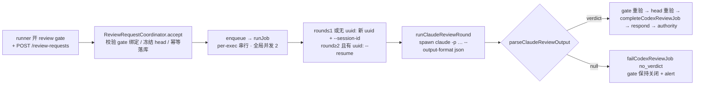

# FLY-1254 跨厂商审查 no_verdict 查因 + 修 — 调研

Issue: FLY-1254 (https://linear.app/geoforge3d/issue/FLY-1254/fix-跨厂商审查-no-verdict-查因-修审稿人跑完但结论解析不出)
日期: 2026-07-14
基于: exploration.md

## 1. 代码路径地图(现状)

审查 lane 两个文件,均在 `packages/teamlead/src/bridge/`:



关键位置(行号为本分支 HEAD `d3f410494`):

| 位置 | 内容 |
|---|---|
| claude-review-runner.ts:101-120 | `buildClaudeReviewArgv` — round 1 `--session-id`,reround `--resume`;`--output-format json`;默认 model `claude-opus-4-8`、effort `xhigh`(FLY-1224) |
| claude-review-runner.ts:147-152 | spawner:`stdio: ["pipe","pipe","ignore"]` — **stderr 被丢弃** |
| claude-review-runner.ts:88 | `DEFAULT_TIMEOUT_MS = 30 * 60_000`(§7.2 每轮 30min) |
| claude-review-runner.ts:208-274 | `parseClaudeReviewOutput` — 信封严校验(R12-R14)→ `extractJsonObject` → verdict 校验 |
| claude-review-runner.ts:277-284 | `extractJsonObject` — **根因所在**(见 §2) |
| claude-review-runner.ts:354-366 | parse null → `{kind:"failed", reason:"no_verdict", raw: stdout.slice(0,4000)}` — raw 只在内存 |
| review-request-coordinator.ts:374-378 | `round = countCodexReviewJobs(exec,type)+1`;`priorUuid = latestCodexReviewerSessionUuid(exec,type)` |
| review-request-coordinator.ts:593-599 | round≤1 或无 uuid → 新 `randomUUID()` + `setCodexReviewJobReviewerSession`,`resume=false`;否则 `resume=true` |
| review-request-coordinator.ts:625-631 | outcome failed → `failCodexReviewJob(requestId, outcome.reason)` — **outcome.raw 被丢弃**,alert 文案无原文 |
| review-request-coordinator.ts:754-790 | `buildPrompt` — reround 从 `latestDoneCodexReviewJob` 注入 prior findings(**只查 done**) |
| plugin.ts:6032-6055 | coordinator 构造:未传 `reviewerTimeoutMs/Model/Effort/alertLead`(全默认;告警仅 console,alertLead 接线已标注 FLY-927 follow-up) |
| StateStore.ts:4567-4575 | `failCodexReviewJob(requestId, reason)` — 只写 `failure_reason`,无 raw 通道 |

## 2. 根因取证实录

### 2.1 生产 DB(`~/.flywheel/teamlead.db`)

```sql
SELECT request_id, issue_id, round, status, failure_reason, reviewer_session_uuid, created_at, updated_at
FROM codex_review_job ORDER BY created_at DESC;
```

FLY-1225 事故两行(时间 UTC):

```
5650646f… | FLY-1225 | round 2 | failed | no_verdict               | a4c3f2b5-9439-488b-949a-85134a1c5e4a | 16:07:03 → 16:12:49
6a55414c… | FLY-1225 | round 1 | failed | gate_answered_externally | a4c3f2b5-9439-488b-949a-85134a1c5e4a | 16:05:24 → 16:11:29
```

同 uuid = R2 真的 `--resume` 了 R1 的 session。R2 全程约 80 秒(R1 约 6 分钟)。

全表统计(lane 自 FLY-1188 #568 上线):8 job = 2 done + 6 failed(3 nonzero_exit / 1 no_verdict / 1 gate_missing / 1 gate_answered_externally)。真跑到解析这步的审稿轮里 1/5 命中 no_verdict。

### 2.2 审稿人 transcript

`~/.claude/projects/-Users-xiaorongli-Dev-flywheel-FLY-1225/a4c3f2b5-….jsonl`(155 行):

- idx 129(16:11:27,R1 终稿):约 1800 字 prose 总结 + 末尾合法 verdict JSON。prose **不含**大括号。
- idx 136(16:11:31,R2 prompt):coordinator 注入的 reround prompt,含 "Your previous findings were:\n[]"(R1 是 failed,`latestDoneCodexReviewJob` 查不到 → 空数组)。
- idx 139-151(R2 执行):thinking + 2 次 Bash(重验 diff/HEAD)+ 终稿。R2 终稿明说"The commit is byte-identical to round 1"——**会话记忆完整保留**。
- idx 151(16:12:48,R2 终稿,1500 字):prose 里含 `{p,m}` → `{p,fc,m}` 与 `{s,c}` 内联片段,末尾一行:

```json
{"verdict": "APPROVED", "findings": [], "reviewedHeadSha": "5f4c1165055fe901c43965af2109ec0df5b05635"}
```

### 2.3 生产解析器确定性重放

将 R1/R2 终稿原文包成 success 信封(`{"type":"result","subtype":"success","is_error":false,"result":<text>}`),调用真实 `parseClaudeReviewOutput`:

```
R1: parsed=APPROVED
R2: parsed=NULL (no_verdict)
R2 first-brace context: "{p,m}` → `{p,fc,m}`) — causes a harmless one-time re-enqueue"
```

机制:`extractJsonObject` 取 `body.indexOf("{")`(落在 prose 的 `{p,m}`)到 `body.lastIndexOf("}")`(verdict JSON 末尾)的切片 → 非法 JSON → `JSON.parse` 抛 → null。

**结论:审稿人输出的 verdict 合约完整,提取层对"prose 含大括号"零容忍。确定性 bug,非概率。**

### 2.4 同族隐患(提取层)

1. fence 分支 `/```(?:json)?\s*([\s\S]*?)```/` 取**第一个** fence:prose 若先引一段 fenced 代码,提取范围被锁进错误的 fence。
2. prose 含**不配对**的 `{`(如讨论"`{` 字符"):首 `{` 到末 `}` 的切片同样必然非法。
3. prose 在 verdict JSON **之后**再出现任何 `}`:切片尾部带垃圾,同样炸。

## 3. 修法设计:verdict 锚定的宽容提取

替换 `extractJsonObject` 为两步候选扫描(命名建议 `extractVerdictObject`);`parseClaudeReviewOutput` 的信封分支按下文"信封判定先加固"段收紧(只严不松),后置 verdict/findings/sha 校验逐字不动:

**第 1 步 — 顶层平衡扫描**:对(去信封后的)全文做一遍 string-aware 扫描(跟踪 JSON 字符串态与转义,配对大括号深度),收集所有**顶层**平衡 `{…}` 片段;逐个 `JSON.parse`;过滤出"对象且 `verdict` 字段为合法枚举(大小写不敏感 APPROVED/CHANGES_REQUESTED)"的候选;**取最后一个**。每字节至多属于一个顶层片段 → 总成本 O(n)。本事故场景(`{p,m}` 等 prose 片段解析失败、末尾 verdict 对象解析成功)在这一步即修复。

**第 2 步 — verdict 关键字锚定回落**(仅第 1 步无命中时):定位文本中 `"verdict"` 的出现位(定量上限,如前 32 处),对每处向前回溯到最近的 `{`,从那里做 string-aware 平衡解析,过滤同上,取最后一个。覆盖"prose 有不配对 `{` 把顶层片段撑爆"与"verdict 对象被包在更大结构里"的长尾。

**信封判定先加固(Codex design review R1 #1)**:现行信封分支只在 `result` 为字符串时才做 success 校验;`result` 为对象/数组的错误信封会漏过分类,pass 2 会从嵌套里捡走 verdict——宽容提取落地前必须先堵。规则:整个 stdout 若 parse 出对象——精确 success 信封(result 为字符串)→ 解包继续;带任一信封判别键(type/subtype/is_error/api_error_status/result)但非精确 success → 直接 null;顶层裸 verdict 对象 → 照常;其他整体 JSON(verdict 仅在嵌套层)→ null,不向内递归。宽容提取只作用于 prose+JSON 混排的 assistant 文本(真实事故形态)。

**语义保持**:
- 两步都无候选 → 返回 null → `no_verdict` fail-close 不变(真失约仍然失败)。
- 错误信封在提取前就被拒(R12-R14 语义保留并按上段加固)——错误信封里即使有 verdict 形状(含嵌套)也到不了提取层。
- APPROVED 权威绑定不在解析层:coordinator 仍要求 reviewer 回显的 `reviewedHeadSha` 逐字等于 server 冻结 head(R12 HIGH-6),"取最后一个"最多影响挑哪个候选,伪造/误批的防线不依赖提取策略。
- fence 特判整体删除:平衡扫描天然覆盖 fenced 与非 fenced(fence 标记不含大括号,不干扰扫描),顺带修掉 §2.4-1。既有"fenced verdict"测试样本必须在新实现下继续通过。
- 兼容基线:现有 parser/runner 测试样本(bare/fenced/CHANGES_REQUESTED round-trip/错误信封/refusal)的安全类与行为类断言不许削弱;仅两处**有意替换**——reround prompt 的 prior-findings 断言(§4.2 有意改变该行为)与 SpawnResult stub 补 stderr 字段(机械更新)。

**prompt 辅助措辞**(一行,防御纵深非依赖):contract 末句 "No prose outside the JSON." 后追加明确 "Your very last line must be the JSON object itself."——降低 prose 追尾概率,不作为正确性依赖。

## 4. 交付 2:resume 差距修补(前提已修正)

### 4.1 现状确认

resume 链完整存在:accept 时 `priorUuid = latestCodexReviewerSessionUuid`(StateStore.ts:4689-4707,按 created_at 取最近非空,**不限 status**)→ 落进新 job 行 → runJob 对 round≥2 且有 uuid 走 `--resume`。事故实证其工作正常(§2.1/§2.2)。Issue 原文"每轮新起 headless 会话"不成立,Lead 已确认按证据修正 scope。

### 4.2 差距 A:reround prompt 注入误导性 prior findings

`buildPrompt`(coordinator:777-789)reround 分支从 `latestDoneCodexReviewJob` 注入 findings。R1 若 failed(哪怕 verdict 曾产出,`failCodexReviewJob` 不存 findings),注入变成 "Your previous findings were: []" —— 直接对审稿人撒谎(它明明有过完整判断)。事故 R2 prompt 逐字命中此形态(§2.2 idx 136)。

修:**resume 轮不注入 prior findings**——session 本身携带完整记忆(R2 自己就复述了 R1 内容),注入是冗余且在失败轮场景下有害。改为 reround-with-resume prompt 只含 contract + target + "you reviewed this work before in this session; focus on the delta since your prior review and anything new"。仅当 round>1 且 resume=false(链断、fresh 重建,见差距 C)时,才保留 findings 注入作上下文重建,且改为从 `latestDoneCodexReviewJob` 取不到时**明说没有可靠的先前记录**(如 "(no reliable record of prior findings — treat as a fresh full review)")而非伪造空数组。

### 4.3 差距 B:失败观测缺口

- spawner `stdio` 第 3 位 `ignore` → stderr 全丢。真机实测坏 `--resume` 的诊断文案**只在 stderr**(见 §4.4),quota 类失败的可辨识文案也在进程输出里。改为 `pipe` + 有界收集(如 16KB 上限,只留尾部)。
- `runClaudeReviewRound` 失败 outcome 的 `raw` 改取 stdout **尾部** 4000(no_verdict 的关键证据——verdict 行——在末尾;现行取头 4000 会恰好丢掉它)与新增 stderr 尾部一路带回;coordinator 失败分支目前只 `failCodexReviewJob(requestId, reason)`,raw 丢弃。改:`codex_review_job` 表加一列 `failure_raw TEXT`(PRAGMA 查列缺才加,非预期迁移错误响亮失败),`failCodexReviewJob` 加可选第三参落库(截断 4000,stdout 尾 + stderr 尾拼接标注);生命周期 = 最近一次尝试的失败证据(claim 清 / fail 覆写 / complete 清);alert 文案追加消毒后的单行摘要(≤300 字符)。
- 价值即时可验:本次取证若有此列,一条 SQL 即可定案,无需 transcript 考古;FLY-1244/1251 的 quota 失败也一眼可辨("hit your session/weekly limit")。

### 4.4 差距 C:resume session 丢失 = 永久失败循环

真机实测(2026-07-14,claude CLI 本机版本):

```
$ claude -p "say ok" --resume 00000000-0000-0000-0000-000000000000 --output-format json
exit=1  stdout=(空)  stderr="No conversation found with session ID: 00000000-…"
```

秒败、不耗 token、诊断文案在 stderr。现状下该轮 fail-close 为 `nonzero_exit`,同 requestId 重试 → runJob 仍取同 uuid → 同样失败,**无限循环**,唯一出路是 codex-skip 或重派 session(事故里 FLY-1225 就是靠新 execution 才在 20:15 拿到 APPROVED)。session 文件真实可能消失:`~/.claude/projects` 清理、机器重装、CLAUDE_CONFIG_DIR 变更、跨机迁移。

修(pattern-gated 单次回落,在 coordinator.runJob 内):resume 轮 outcome 为 `nonzero_exit` **且** stderr/stdout 匹配 session-not-found pattern(锚定 "No conversation found with session ID",大小写不敏感、允许前后缀)时——同一 job 内生成新 uuid、`setCodexReviewJobReviewerSession` 持久化(后续轮自然接到新链)、以 resume=false + fresh 全量 contract prompt(即 §4.2 的 fresh 分支)**重跑一次**;第二次仍失败则照旧 fail-close。非 pattern 的 nonzero_exit(quota、崩溃等)**不回落**——fresh 重试在 quota 下同样会失败,只是烧一次启动;保持 fail-close + alert。回落上限的精确表述:**每次 runJob 调用至多一次**(非 durable job 终生一次,不加持久化列;新 uuid 持久化后崩溃 → boot redrive 重跑时如再命中 pattern 可再回落一次,每轮收敛);第二次 spawn 前先重验 stopped/gate/head(在生成新 uuid 之前)。30min 超时对两次尝试各自独立生效(见 §5 语义,liveness bound 针对单个子进程)。

## 5. 交付 3:30 分钟每轮上限

实测:R1 fresh ≈ 6 分钟(16:05→16:11),重试 fresh(job 40893322)≈ 9.5 分钟(20:15:11→20:24:52),R2 resume ≈ 80 秒。全部在 xhigh + opus-4-8 + 本仓规模下。

| 语义 | 本单(claude-review-runner `DEFAULT_TIMEOUT_MS`) | FLY-1253/defect#7(flywheel-land) |
|---|---|---|
| 计时对象 | 一个**活跃工作中**的审稿子进程 | 等待外部事件(review 结果落地) |
| 超时含义 | 子进程挂死/失控 → 树杀 + fail-close,正确 | 把"还在等"误判成"坏了",错杀等待,应 park+retry |
| 结论 | **保留 30min 默认**(3-5 倍实测余量) | 另单处理,与本单无关 |

小改:plugin.ts 构造 coordinator 时接线 env 覆盖(如 `FLYWHEEL_CLAUDE_REVIEW_TIMEOUT_MS`),只接受有限安全整数且落在 [60_000, 2_147_483_647](下限防误配秒杀;上限=Node 定时器 32 位域,超过会被折成 1ms),否则警告一行回默认;透传给既有 `reviewerTimeoutMs` seam(coordinator→runner 通路已存在,纯接线)。不改默认值。

## 6. 相邻证据(定性,不入 scope)

- `nonzero_exit` 三连(FLY-1244 R2 3 秒败、FLY-1244 新 exec R1 6 分钟败、FLY-1251 R1 3 秒败,均 13:29-14:57 PT quota 窗口):transcript 尾部分别是 "You've hit your weekly limit · resets Jul 15…" 与 "You've hit your session limit · resets 4pm…"。fail-close 正确;§4.3 落库后此类失败可直接从 DB 辨识。
- `alertLead` 未接线:plugin.ts:6026-6028 注释已声明是 FLY-927 alert funnel 的 follow-up(MetaAlertReason 闭合 union),本单不动。

## 7. 既有测试盘点(实现时的兼容基线)

`claude-review-runner.test.ts` 20 例:argv 构造(session-id/resume/effort)、信封解包+sha 小写、bare/fenced verdict、CHANGES_REQUESTED round-trip、错误信封拒收(R12/R13/R14 三组)、refusal/malformed → null、runner 各失败路径(timeout/spawn_error/nonzero_exit/no_verdict/stdout_overflow)、env wash、真子进程三例(stdin 关闭/树杀/缺 binary)。
`review-request-coordinator.test.ts`:gate 绑定/幂等/skip/head 冻结/outbox 等(实现时不许回归)。

新增测试面(细目见 plan.md):事故 R2 原文回归 fixture(必须解析出 APPROVED + 正确 sha)、R1 对照、对抗提取用例(不配对大括号/多候选取后/fence 前置干扰/错误信封仍拒)、reround prompt 三形态、session-not-found 单次回落(pattern 命中/不命中/二次失败)、stderr 有界捕获、failure_raw 落库与迁移幂等、env timeout 接线。
