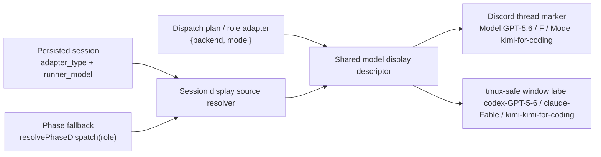

# FLY-1255 厂商无关的标题与窗口模型显示 — 探索
Issue: FLY-1255 (https://linear.app/geoforge3d/issue/FLY-1255/fix-标题窗口模型名显示解除-anthropic-绑死-厂商无关渲染codexkimi-后端也要显示)
日期: 2026-07-14
基于: 无

## Problem

FLY-728/755 已把模型短码放到 Discord issue thread 标题前部，例如
`🔨实现中 [F] [FLY-755] …`。这条老路径只接受 Claude 的 F/O/S/H：
`modelShortCode()` 对 GPT、Kimi 和其他厂商模型返回 `undefined`，因此模型
marker 被权威清空。与此同时，三段式 cmux/tmux window 只显示阶段名
`design/implement/qa`，不显示 dispatch 已经选定的模型。

FLY-1224 已经把三段式 dispatch 定义成完整的 `{ vendor, model, effort }`，并让
message 级 `phaseMessageTag()` 正确显示 GPT-5.6；但标题/窗口仍在读取旧的
Anthropic-only 表示。这造成同一个 Codex implement run 在消息里诚实显示
`[实现·GPT-5.6]`，在 thread 标题里没有模型，在 cmux 里也只看到
`implement`。

## Goal

把“这次 dispatch 实际选择了什么模型”变成标题和窗口的同一份显示事实：

- Discord issue thread：Codex run 显示 `GPT-5.6`，Kimi run 显示其模型名；
- tmux/cmux window：阶段/runner 名后带同一模型身份的 tmux-safe 形式；
- Claude 现有 F/O/S/H 标题 marker 不变，避免无关 UX churn；
- phase session 尚未写入 `runner_model` 时，使用 kill-switch-aware
  `resolvePhaseDispatch()` 的 planned `{ vendor, model }`；
- 不从 Claude/Codex/Kimi CLI 画面、进程参数或 vendor 私有 runtime 反推模型。

## Success Examples

| 场景 | Discord thread title | tmux/cmux window name（sanitize 后） |
|---|---|---|
| Codex implement，`gpt-5.6-sol` | `🔨实现 [Model GPT-5.6] [FLY-1255] …` | `FLY-1255-implement-codex-GPT-5-6-…` |
| Codex design 开关开启 | `🎨设计 [Model GPT-5.6] [FLY-1255] …` | `FLY-1255-design-codex-GPT-5-6-…` |
| Kimi，`kimi-for-coding` | `… [Model kimi-for-coding] [FLY-XXXX] …` | `FLY-XXXX-runner-kimi-kimi-for-coding-…` |
| Claude Fable | `… [F] [FLY-XXXX] …` | `FLY-XXXX-runner-claude-Fable-…` |
| phase pending/no runtime row | 取该 phase 当前 planned dispatch | 取 spawn 时已解析的 dispatch |

窗口名受现有 `sanitizeTmuxName()` 约束，点号会变成连字符；Discord 标题保留
人类可读的 `GPT-5.6`。两者来自同一 display descriptor，不是两套模型映射。

## Assumptions

1. Annie 批准的模型分配不变：Design=Codex GPT-5.6 xhigh（开关）、
   Implement=Codex GPT-5.6 xhigh、QA=Claude Opus。
2. `runnerBackend + runnerModel` 是 role-adapter resolution 的最终 dispatch
   结果；对已经启动的 session，`adapter_type + runner_model` 是显示事实。
   若旧/部分 session 缺 `adapter_type`，只能从已知 model family 做有界推导，不能
   借 reviewer 用的 legacy default 生成 `claude-<非 Claude model>`。
3. `dispatch_model` 只代表 difficulty sorter/retry input，不能替代最终
   `runner_model`；仅在实际值缺失且没有 phase table 可用时做有界 fallback。
4. message 级 `phaseMessageTag()` 已正确，不在本票重构。
5. 本票是 display-only：不改 dispatch 优先级、vendor transport、数据库 schema、
   review/ship gate 或 phase lifecycle。

## Options

### Option A — Shared display descriptor from resolved dispatch（推荐）

新增纯函数，把 `{ vendor/backend family, model }` 转为：

- `threadMarker`：Discord marker 内的人类可读值；
- `windowLabel`：从 executor family + 同一模型值派生的 tmux-safe 短段。

已知 Claude family 继续输出 F/O/S/H marker；GPT 使用现有
`modelDisplayName()` 得到 `GPT-5.6`；其他厂商保留经过长度/字符约束的模型 id。
session 侧再有一个 source resolver，优先 actual resolved model，缺失时按 phase
回退 planned dispatch。window 在 spawn 前直接使用已经解析好的
`runnerBackend + runnerModel`。

优点：来源诚实、两张 UI 共用规则、Kimi/未来 backend 不依赖 Anthropic 表、无
runtime sniffing。代价：需把 thread marker 类型从四字母 union 泛化，并更新所有
authoritative stamp caller。

### Option B — Extend `modelShortCode()`

给 GPT/Kimi 继续分配单字母短码，再沿用现有路径。

优点：改动最少。缺点：仍是 Claude tier vocabulary 的延伸，模型名不可见；Kimi/
未来 vendor 要持续加枚举；window 仍没有统一数据源。不满足目标。

### Option C — Render inside each adapter

Claude/Codex/Kimi adapter 各自从 CLI/runtime 状态写 window，thread stamper 另做
映射。

优点：adapter 最了解自己的 CLI。缺点：同一模型出现多套映射与 fallback；pending
phase 没有 runtime 可读；Kimi/下一厂商继续复制。与已批准的 dispatch-plan 真相源
相反。

## Decision

选择 Option A。Lead 在 brainstorm gate `084f3e78-e1b2-40b3-b15f-bd5674af3e65`
明确批准：display-only、共享 title/window renderer、输入 resolved dispatch
`{backend, model}`、runtime 缺行回落 kill-switch-aware phase plan、Claude 输出兼容。

## Design Boundary

## Non-goals

- 不改变 `phaseMessageTag()` 或 pinned phase header 的文案；
- 不给 Kimi/no-transport backend 增加 mailbox/auto-ship；
- 不增加 `runner_vendor`/`model_display_name` 数据库列；
- 不放宽 `/api/runs/start` model whitelist；
- 不重命名旧 thread；它们在下一次正常 refresh 时自然收敛；
- Design phase 不写 implementation code、不建 PR、不 ship。

## Risks to Resolve in Plan

1. 泛化 marker 不能误剥人工方括号标题，也不能失去 set/null/absent tri-state：
   Claude 继续 `[F/O/S/H]`，非 Claude 使用 Lead 在 correction gate
   `df42d371-8056-475e-a35a-a0916c4f4c0f` 批准的人类可读
   `[Model <safe-model>]` namespace。
2. Discord 100-char 与 tmux 50-char 预算必须把模型段计入，长模型 id 要确定性截断。
3. reconnect、auto-QA、DirectEventSink、legacy HTTP event path 都会盖标题，不能只修
   happy path。
4. `runnerName` 当前在非三段式固定为 `claude`；当 resolved dispatch 存在时必须改
   成固定 managed prefix `runner-` + 真实 executor/model label，避免产生
   `claude-kimi-*` 这种新的显示谎言，也让 cmux pin reaper 能继续用窄 allowlist
   fail-close。模型缺失/legacy context 才保留旧 `claude` fallback；shell gate 与
   reverse sentinels 必须和 producer 同一提交更新。
5. phase planned fallback 必须读 `resolvePhaseDispatch(role)`，不可复制默认表，否则
   Design/Implement kill-switch 会显示错。
6. 增加模型段会挤压 50-char window 中的 issue title；identifier 与完整 GPT-5.6
   identity 优先，测试必须覆盖 realistic Kimi 与 32-char label cap；最坏 cap 可让
   trailing issue title 归零，需明确记录而不是宣称兼容。
