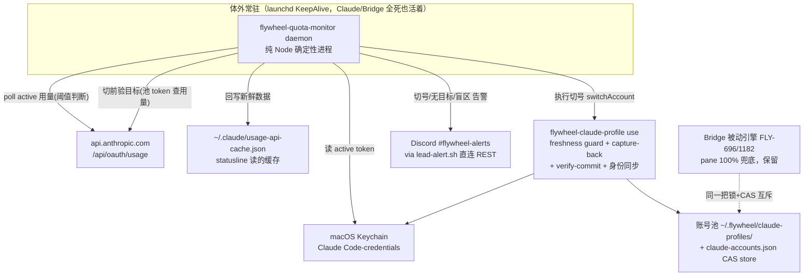

# FLY-1256 外部配额监控 + 自动切号器 — 探索

Issue: FLY-1256 (https://linear.app/geoforge3d/issue/FLY-1256/build-外部配额监控-自动切号器跑在-claude-体外-p1今天事故实证)
日期: 2026-07-14
基于: 无

## 1. 问题定义（2026-07-14 两个事故实证）

**事故 ①：statusline 配额滞后。** 终端 statusline 显示的 5h 用量在 20 分钟内从 54% 跳到 79%，且始终滞后于 Annie 在 Anthropic 端看到的真实值。fleet 满负荷时 5h 窗口烧得极快（本次 ≈25%/20min），滞后的显示让人对「还剩多少」产生系统性误判——等看到危险水位时已经来不及主动切号。

**事故 ②：切号器不能是 Claude 自己。** Lead（Claude session）执行切号后，机器 Keychain 指向了一个没有配额的账号；Lead 自身的 access token 到期刷新时从 Keychain 读到的就是这个断粮账号 → Lead 当场失能（哑 30 分钟），靠人工救回。推论是结构性的：**Claude 断粮时，一切 Claude agent 都无法自救**——切号器必须活在 Claude 体外。

## 2. 现状审计（要点，细节见 research.md）

- **切号机械已经存在且在体外**（Node/bash，不烧 Claude 额度）：FLY-696 全家桶（`packages/teamlead/src/account-heal/`）+ `flywheel-claude-profile` bash 脚本（Keychain 换号、capture-back、freshness guard、verify-before-commit、FLY-865 身份同步、跨语言 mkdir 锁 + CAS）。FLY-1182 正在给这套 Bridge 内引擎点火（In Progress，PR #562）。
- **但这套引擎是「被动式」且托管在 Bridge 进程内**：检测源 = 30s 刮 Claude pane 的 statusline 文本，pane 显示 100% 封顶才触发；Bridge 重启 / wedge / QA 窗口期间整条链停摆。
- **三大缺口**（审计确认，一个都没有现成实现）：
  1. **没有实时配额源**——现有检测全部依赖滞后的 pane 文本；
  2. **切前从不验目标账号配额**——只验 auth freshness（FLY-871），可能切进另一堵墙（`feedback_account_switch_verify_target_quota` 正是此坑）；
  3. **founder 顺序无处表达**——现为字母序 + weekly-reset 启发式（`account-store.ts:78`），「shopping→school→…」在代码里不存在对应配置。
- **实时配额源已真机验证存在**：`GET https://api.anthropic.com/api/oauth/usage`（OAuth Bearer，Keychain token，header `anthropic-beta: oauth-2025-04-20`）返回 `five_hour`/`seven_day` 的 `utilization` + `resets_at`，2026-07-14 本机探测成功（10%/22%）。

## 3. 方案选项与决策

### D-A：切号器跑在哪？

| 选项 | 评估 |
|---|---|
| A1 纯 Node 确定性 daemon（launchd KeepAlive，独立进程） | ✅ **选定**。阈值判断不需要 LLM；确定性、可单测、可注入 mock；不依赖任何 AI 账号存活——这正是本单要治的病 |
| A2 常驻 Codex agent 做监控 | ✗ LLM 在阈值回路里 = 不确定 + 烧 Codex 额度 + Codex 账号自己也会限流/过期（`reference_companion_codex_lead_auth_expiry`）。Codex 只作为 implement 阶段的作者（按批复单模型分配） |
| A3 扩展 Bridge 引擎 | ✗ 违反「体外」前提：Bridge 重启频繁、进程重、且它是被喂养系统的一部分 |

### D-B：与 FLY-1182（Bridge 被动引擎）的关系？

**选定：共存，daemon 为主动层，Bridge 引擎保留为被动兜底，不退役。** 两者复用同一把 mkdir 锁 + 同一个 `claude-accounts.json` CAS store：谁先切谁赢，另一方 `noop_already_switched`，结构上不可能打架。Bridge 代码近零改动（仅告警 kind 白名单加行）。退役被动层只加风险不加值。

### D-C：daemon 怎么选目标账号？

**选定：founder 显式顺序配置（新增）+ 切前双验。** 候选按配置顺序遍历：freshness probe-refresh（**仅限非 active 账号**，FLY-871 既有机制，安全）→ 用其池 token 查 usage API → 5h/7d 都低于目标水位才选中。任何候选都不合格 → 不切 + Discord 告警（附全账号配额全景）。

### D-D：凭证安全边界？

- daemon **自身绝不落盘 / 绝不打印 token**；token 只在内存中用于 usage API 调用。
- Keychain 与池的一切写操作**全部委托既有 `flywheel-claude-profile`**（`security -i` 无 argv 范式、verify-before-commit、capture-back）。池文件 `~/.flywheel/claude-profiles/<name>/.credentials.json`（0600）是**既有**落盘形态，本单不新增任何落盘。
- **红线：绝不刷新 ACTIVE 账号的 token**（外部刷新会轮转 refresh-token family，strand 全部活 session——正是事故②的机理，也是 FLY-871 的既有红线）。

### D-E：statusline 滞后要不要顺手修？

**要（低成本高回报）。** 滞后根因 = statusline 脚本自身的 10 分钟缓存 + 后台异步刷新（过期后首帧仍显示旧值）+ 只在 Claude 渲染时才跑 + usage API ~5 次/token 的 429 预算逼出的保守缓存（详见 research.md §2）。daemon 每次 poll 把新鲜响应原样写回 `~/.claude/usage-api-cache.json` → statusline 读到的缓存永远新鲜，**零额外 API 调用**，statusline 脚本一行不用改。

## 4. 目标架构

## 5. Scope 边界

**In**：daemon（监控 + 阈值切号 + 目标验证 + 通知）、founder 顺序配置、statusline 缓存回写、`selectNextAccount` 顺序扩展（byte-compat）、告警 kind 注册、launchd 安装物料、实时配额源调研报告（research.md）、「Claude 全员假死时独立切号」QA 支持面。

**Out**：Codex 账号轮转（已有 per-runner fallback）；被动引擎退役（明确不做）；卡 quota 旧 runner 的自动恢复（FLY-1182 D2 已定 v1 不搬）；active token 过期且无活 session 时的「监控盲区」自动解除（v1 = 告警 + 文档化边界，见 research.md §5）；多机 fleet 协同（单机 v1）。

## 6. 决策记录

Lead（Tadashi）2026-07-14 brainstorm gate APPROVED：A=保留 Bridge 被动引擎为兜底；B=纯 Node 确定性 daemon（非常驻 Codex agent）。设计要点确认保留：usage API 实时源、绝不刷新 ACTIVE token 红线、切前验目标配额（probe 仅限非 active）、新鲜数据回写 statusline 缓存、founder 显式顺序配置（当前 = shopping→school→…，写成可配）。
