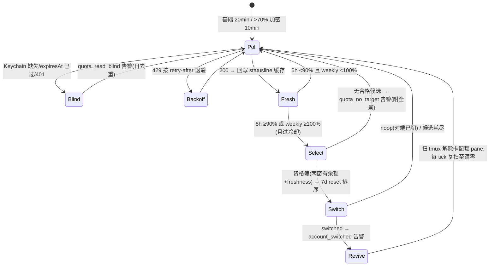

# FLY-1256 外部配额监控 + 自动切号器 — 实施计划

Issue: FLY-1256 (https://linear.app/geoforge3d/issue/FLY-1256/build-外部配额监控-自动切号器跑在-claude-体外-p1今天事故实证)
日期: 2026-07-14
基于: exploration.md, research.md

**Status**: draft（待 Codex design review）
**Implement 执行体**: Codex gpt-5.6-sol xhigh（founder 批复单，勿改）· TDD（RED→GREEN→REFACTOR）
**版本号**: ship 时取空号（FLY-494 惯例）
**Founder 输入**: 三轮拍板全部折入（exploration §6 决策记录 1-6），第三轮为终版——本 plan 即定稿依据。

## 0. 总览

新建体外常驻 daemon `flywheel-quota-monitor`（launchd KeepAlive、纯 Node 确定性进程）。设计哲学（Annie 定调）：**配额用到接近 100% 不浪费；贴墙跑，撞墙自动爬起**。

- **监控**：基础每 20min 查当前号真实用量（OAuth usage endpoint，实测限额 5 次/5min/token）；当前号 5h >70% → 加密到 10min 并开始 ~60min 级候选扫描；闲置号平时零查询。每次 200 响应回写 statusline 缓存（治滞后）。
- **触发**：当前号 **5h 已用 ≥ 90%**（运行时可调）→ 切号。weekly 永不当阈值触发器（保证每号钱花完）；weekly **实际封顶（≥100%）** 视为事实性死号仍触发（边界解读，见 §9 风险）。
- **选号**：资格 = 候选两窗「有余额」（<100%）+ freshness 可用；排序 = 7d reset 最早优先（先到期先用）；founder 固定顺序平手裁决。回流 = 开（结构性内建：被换下的号 cooldown 到期自动回池）。
- **执行**：复用 `switchAccount()` + `flywheel-claude-profile use`（锁+CAS+freshness guard+capture-back+verify-commit+身份同步）。
- **恢复**（核心组件）：切号成功后扫 tmux panes，高置信签名识别卡配额对话框的 pane → send-keys 解除+续跑，每 tick 复扫至清零。
- **通知**：`lead-alert.sh` 直连 Discord（Bridge down 也能发）。
- **退役**：Bridge 被动切号管线（FLY-696 触发链 + FLY-1182 点火）按 Annie 拍板退役；共享库与封顶告警保留（research §6）。



## 1. 组件与文件清单

### 新增（全部在主仓）

| 文件 | 职责 |
|---|---|
| `packages/teamlead/src/account-heal/quota-usage-api.ts` | usage API 客户端。`fetchAccountUsage(accessToken, opts)` → `{ok: UsageSnapshot} \| {error: "unauthorized"\|"rate_limited"\|"network"\|"malformed", retryAfterMs?}`。`opts = {baseUrl(默认 https://api.anthropic.com), timeoutMs(默认10s), fetchFn(注入)}`。解析顶层 `five_hour`/`seven_day` 的 `utilization`+`resets_at`；数字缺失/非法 → `malformed`（fail-closed）。**accessToken 只进 Authorization 头，日志/错误对象绝不携带** |
| `packages/teamlead/src/account-heal/quota-monitor-config.ts` | 运行时配置契约（Annie：不许硬编码）。`loadQuotaMonitorConfig(path)`，路径默认 `~/.flywheel/quota-monitor.json`（env `FLYWHEEL_QUOTA_MONITOR_CONFIG` 覆盖）。**每 tick 重读**（改值 ≤1 周期生效，零重启）；schema 校验失败 → `{mode:"monitor-only", configError}`（fail-safe：监控+缓存回写照跑，切号禁用）；文件缺失同 monitor-only。写侧要求（文档化给 dashboard/Bridge）：原子写 tmp+rename。schema 见 §2 |
| `packages/teamlead/src/account-heal/quota-monitor.ts` | 核心编排 `pollOnce(deps): Promise<PollOutcome>`。**全部 IO 注入**（`readKeychainCredential`/`readActiveName`/`readStore`/`verifyPoolCredential`/`readPoolCredential`/`fetchUsage`/`switchAccount`/`emitAlert`/`writeStatuslineCache`/`writeState`/`reviveScan`/`now`）→ 纯逻辑可单测。含分级轮询节奏、触发判断、候选扫描节流、选号（资格+排序+平手）、minSwitchInterval 闸、blind/退避状态 |
| `packages/teamlead/src/account-heal/quota-revive-scan.ts` | **切号后恢复扫描**（核心组件）。`reviveScan(deps)`：`tmux list-panes -a` → `capture-pane -p` → 高置信签名分类（`quota_stuck` / `login_expired` / `other`）→ 仅对 `quota_stuck` 发解除按键序列（**契约来自真机 fixture，见 §6 M3**）+ 有界重试（每 pane ≤3 次）；`login_expired` 只计数入告警不动手（edge case b）；`other` 一律不碰。tmux 命令与签名正则全部注入可测；签名模式移植自 `detection-classifier.ts:65` Layer1 + FLY-193 live-region 方法论（锚定底部渲染区防 scrollback 残留误判） |
| `packages/teamlead/src/account-heal/quota-monitor-cli.ts` | 进程入口：singleton pidfile（`~/.flywheel/quota-monitor.pid`：活 pid → exit 0；stale → 接管）、setTimeout 链主循环（间隔由当前档位决定）、SIGTERM/SIGINT 优雅退出、真实 deps 装配、结构化 stderr 日志（**永不打印 token/凭证 JSON**） |
| `packages/teamlead/bin/flywheel-quota-monitor` | bash thin launcher → `node dist/account-heal/quota-monitor-cli.js`（镜像 `flywheel-claude-freshness` :1-24；dist 缺失 → exit 31 响亮报错） |
| `scripts/flywheel-quota-monitor-wrapper.sh` | launchd wrapper：source `~/.flywheel/.env`（进程环境优先，镜像 `token-usage-daily.sh:26,38`）→ exec bin。token 绝不进 plist |
| `scripts/com.flywheel.quota-monitor.plist.template` | label `com.flywheel.quota-monitor`，`KeepAlive=true`+`ThrottleInterval=30`+`RunAtLoad=true`，日志 `/tmp/flywheel-quota-monitor.log`，`__HOME__` token 化（镜像 cmux-watcher 模板） |
| `scripts/setup-quota-monitor.sh` | 幂等安装：渲染 plist → 写默认配置（若无；**order 留空 = monitor-only，真实顺序 enable 窗口 founder 确认后填**）→ `launchctl bootstrap gui/$(id -u)` → 探活。重跑 diff 空 |
| `scripts/qa-fly-1256-quota-daemon-e2e.sh` | 隔离 e2e 骨架：本地 mock usage API（node 单文件，env 剧本控制 utilization 序列）+ scratch keychain service/pool/store/lock/缓存 + 隔离 tmux server（`tmux -L`）+ 真 daemon 进程。断言：缓存更新、触发、候选验证调用序、scratch Keychain 被换、恢复扫描解除注入的假卡 pane、告警落 queue/隔离频道。**全程零 claude 进程**（ps 断言） |

### 修改（byte-compat 扩展，默认路径字节不变）

| 文件 | 改动 |
|---|---|
| `packages/teamlead/src/account-heal/account-store.ts` | `SelectInput` 加可选 `preferredOrder?: string[]`：present 时候选 = 既有 usability 过滤（authExpired/cooldown/currentName 全保留）后**只保留列表内账号、按列表下标排序**；absent 时行为字节不变（既有测试零改动全绿为哨兵） |
| `packages/teamlead/src/account-heal/switch-executor.ts` | `SwitchInput` 加可选 `preferredOrder?: string[]` 透传给 `selectNextAccount`（:178 候选环）。absent 行为不变 |
| `scripts/lead-alert.sh` | kind 白名单（:115 case）加 4 项：`account_switched`/`quota_no_target`/`quota_read_blind`/`account_switch_failed` |
| `LeadAlertNotifier.ts`（`ALERT_EVENT_TYPES` union） | 同步加同 4 项（TS-union parity，FLY-1081/1082 同款） |
| `packages/teamlead/src/__tests__/kind-contract.test.ts` | 双面 drift 守卫同步 |

### 退役（Bridge 被动切号管线，Annie 拍板；边界 = research §6）

| 位置 | 改动 |
|---|---|
| `packages/teamlead/src/bridge/AutoRepairBot.ts:148/256-257` | 摘除 accountSwitch 路由（`canAttempt`/`enqueue` 的自动切号分支）——封顶**告警**路径保留 |
| `account-switch-watchdog.ts` + `plugin.ts:8002` 挂接点 | 摘除 poll-piggyback 执行 tick；`pending-store` 的自动切号用途随之失效（文件与类型保留，防级联误删） |
| 测试 | 相关自动切号路径测试改为「已退役」哨兵断言（确保管线不复活）；共享库测试（switch-executor/account-store/claude-profile/freshness/mkdir-lock）**零改动全绿** |
| FLY-1182 | 停止点火；issue 处置（关闭/重定向）由 Lead 定，PR 描述注明 |

**不改**：`flywheel-claude-profile`、`freshness.ts`/`freshness-cli.ts`、statusline 脚本、pane 封顶告警链（LeadWatchdog/runner-quota-scan 检测→告警）。

## 2. 运行时配置契约 `~/.flywheel/quota-monitor.json`（Annie：不许硬编码）

```json
{
  "trigger5hPct": 90,
  "basePollMinutes": 20,
  "acceleratePct": 70,
  "acceleratedPollMinutes": 10,
  "candidateSweepMinutes": 60,
  "minSwitchIntervalMinutes": 15,
  "order": ["shopping", "school"],
  "writeStatuslineCache": true
}
```

- **语义**：`trigger5hPct` 切号触发线（只作用于 5h）；`acceleratePct` 加密轮询与候选扫描的启动水位；`order` = founder 平手裁决顺序（列表外账号永不被自动选中；**完整顺序 enable 窗口 Annie 确认后填**，模板默认两项已知前缀）。资格线不存在（第三轮拍板：有余额就行 = 硬编码 <100% 语义，不是可调水位）。
- **契约**（research §8）：daemon 每 tick 重读 + 校验（数值范围、order 过 profile 名白名单正则）；失败 → monitor-only + 日去重告警，不 crash-loop。写者（founder/dashboard 经 Bridge/setup 脚本）必须原子写。**dashboard 对接 = Bridge 侧读写此文件的 API，Tadashi 与 HL 协调，不在本单**——本单交付 schema+语义文档（本节 + research §8 即合同）。
- Env：`FLYWHEEL_QUOTA_MONITOR_CONFIG` / `FLYWHEEL_QUOTA_API_BASE`（QA mock）/ `FLYWHEEL_QUOTA_STATUSLINE_CACHE`（默认 `~/.claude/usage-api-cache.json`）/ `FLYWHEEL_QUOTA_TMUX_SOCKET`（恢复扫描的 tmux `-L`，QA 隔离用）；Keychain/池/store/锁复用既有 `FLYWHEEL_CLAUDE_*`（research §7）。

## 3. daemon 核心逻辑（`pollOnce` 规格）

1. **读凭证（只读）**：`security find-generic-password -w`。缺失 → `quota_read_blind`（日去重）→ 返回。`expiresAt <= now` → 同 blind（红线 R1 绝不 refresh active）。
2. **查当前号**：`fetchAccountUsage`。429 → 按 `retryAfterMs` 退避（缺失时 60s 起指数、上限 30min）；401 → blind；malformed/network → log 下轮。
3. **回写缓存**（200 且开启）：原样 JSON 原子写 → statusline 立即新鲜。
4. **档位与候选扫描**：5h ≤`acceleratePct` → 下轮 `basePollMinutes`，候选零查询；>`acceleratePct` → 下轮 `acceleratedPollMinutes`，且每 `candidateSweepMinutes` 扫一遍候选全景（**只用池内未过期 accessToken；过期跳过标 unknown，绝不为例行扫描 probe-refresh**——token 轮转只发生在切号时刻；全景数据仅作预热/告警展示，切号时刻按需验证才是权威）。
5. **触发判断**：`five_hour.utilization >= trigger5hPct` → scope `5h`；`seven_day.utilization >= 100` → scope `weekly`（事实性封顶，见 §9 R-1 解读）；双满足 → `both`。未触发 → 返回。触发但距上次切号 < `minSwitchIntervalMinutes` → log 返回。`monitor-only` → `quota_no_target` 告警（body 注明 switching disabled 原因）→ 返回。
6. **选号（切号时刻按需验证，权威）**：对 `order` 中每个非 active 候选（store `isAuthUnusable`/cooldown 未到者先跳过省调用）：
   a. `verifyPoolCredential`（freshness.ts:150，probe-refresh 仅限非 active，轮转写回池）→ stale/error → 记入全景跳过；
   b. 重读池文件新 accessToken → `fetchAccountUsage`（打在候选自己的桶）；
   c. **资格 = `five_hour < 100 && seven_day < 100`**（有余额就行）→ 合格者携 `seven_day.resets_at` 入列。
   合格列表按 `seven_day.resets_at` 升序（最早优先）、精确时刻相同时按 `order` 下标裁决 → `rankedQualified`。空 → `quota_no_target`（severity severe，签名=scope+日期，body=全景：各候选 util%/跳过原因）→ 返回。
7. **执行**：`switchAccount({scope, observedAccount, observedGeneration, resetAt: 触发窗口的 resets_at（both 取 weekly，镜像既有 weekly-dominant）, now, preferredOrder: rankedQualified}, makeClaudeProfileSwitchDeps({binPath: claudeProfileBinPath()}))`。
   - `switched` → `account_switched` 告警（**签名 = `<from>-<to>-<generation>`，每次必响不做日去重**；body：from→to、双方两窗 util、7d reset、触发 scope）→ `lastSwitchAt=now` → 立即对新 active 补一次 poll 刷缓存 → **触发恢复扫描（§4）**。
   - `noop_already_switched` → log（手动 CLI 并发，同锁+CAS 安全）。
   - `no_account` / `TargetStale` 耗尽 → `account_switch_failed`（severe，日去重签名）；`FreshnessUnavailable` → 环境性 fail-closed，同告警且不再试。
8. **状态落盘** `~/.flywheel/quota-monitor-state.json`（0600 原子写）：`{lastPollAt, lastSwitchAt, backoffUntilMs, tier, lastUtil, reviveOutstanding}` —— **无任何 token 字段**（schema 测试断言）。

## 4. 切号后恢复扫描（`reviveScan` 规格，核心组件）

- **时机**：切号 `switched` 后立即一轮；此后每个 poll tick 复扫（本地 tmux 零 API 成本），直到无 `quota_stuck` pane（`reviveOutstanding=false`）。
- **识别**：`tmux -L $SOCKET list-panes -a -F '#{pane_id}'` → 逐 pane `capture-pane -p -t <id>` → 分类器（纯函数，注入正则）：
  - `quota_stuck`：卡配额对话框高置信签名（**以 M3 真机 fixture 为准**；候选锚点来自 `detection-classifier.ts:65` usage_limit 表 + 底部 live-region 锚定，FLY-193 方法论）；
  - `login_expired`：登录过期形态 → **只计数入告警，不动手**（edge case b，FLY-1049 疆域）；
  - 其余（resume-menu / compact / 正常工作 / 无法分类）→ 一律不碰（FLY-313 误按教训为红线测试）。
- **动作**：仅对 `quota_stuck` 发 fixture 定死的按键序列（`send-keys`），每 pane 至多 3 次尝试，尝试后复查分类；结果（救活 n / 待重试 m / login_expired k）并入 `account_switched` 或独立 `quota_no_target`-级告警 body。
- **安全**：分类器 + 按键序列全部 fixture-驱动测试；无 fixture 的形态一律归「不碰」。QA 剧本含「非配额 pane 永不被触碰」的对抗用例。

## 5. 安全红线（全部为测试断言项）

1. **R1**：daemon 对 active 账号只读，**永不 refresh**（事故②机理）。测试：active 401/过期时断言 refresh 端点零调用。
2. **R2**：daemon 零 token 落盘/零 token 日志（state/日志/告警 body schema 断言 + `grep -i token` 哨兵）。
3. **R3**：一切 Keychain/池写委托 `switchAccount → flywheel-claude-profile use`；daemon 不含任何 `security add-generic-password`。
4. **R4**：`preferredOrder` absent → `selectNextAccount`/`switchAccount` 行为字节不变（既有测试零改动 + byte-compat 哨兵）。
5. **R5**：monitor-only 缺省安全——order 未填永不切号。
6. **R6**：恢复扫描只碰高置信 `quota_stuck` pane；其他形态零按键（对抗测试）。
7. **R7**：例行候选扫描绝不 probe-refresh（token 轮转仅切号时刻）。

## 6. 里程碑（Codex implement 按序，TDD）

- **M1 库层**：quota-usage-api + config 契约 + account-store/switch-executor `preferredOrder` 扩展 + 全部单测（先 RED）。
- **M2 daemon**：quota-monitor(pollOnce 分级轮询/触发/选号) + cli + bin launcher + state 文件 + 单测/集成测（macOS-gated scratch keychain，镜像 `claude-profile-cli.integration.test.ts`）。
- **M3 恢复扫描**：**第一步 = 真机抓「卡配额对话框」pane fixture**（committed fixture，FLY-193 惯例；抓不到就用受控真机复现一次）→ 按 fixture 定分类签名 + 解除按键契约 → quota-revive-scan + 对抗测试（R6）。
- **M4 通知**：4 kind 三处同步 + lead-alert 调用封装（`--signature`/`--strict-delivery`）+ kind-contract 测试。
- **M5 Bridge 退役**：摘 AutoRepairBot accountSwitch 路由 + watchdog tick；退役哨兵测试；共享库测试零改动全绿；PR 描述注明 FLY-1182 处置交 Lead。
- **M6 部署物料**：wrapper + plist 模板 + setup 脚本（幂等）+ e2e 骨架脚本。
- **M7 收尾**：全仓 lint + 全测 + PR（含 docs + progress.md）→ Codex code review → 独立 QA。

## 7. 测试矩阵

| 层 | 内容 |
|---|---|
| 单测（CI Linux 可跑，IO 全 mock） | usage-api 全分支 + token 不泄漏；config（缺失/坏 JSON/越界/monitor-only 降级/重读生效）；pollOnce 全分支（分级轮询档位切换/blind/退避/触发含 weekly-100 边界/冷却/候选按需验证/资格 <100 语义/排序+平手/CAS noop/候选耗尽/FreshnessUnavailable 短路/R7）；revive-scan 分类器 fixture 全形态 + R6 对抗；store/executor preferredOrder + byte-compat 哨兵；state 无 token schema；kind-contract 双面；退役哨兵 |
| 集成（macOS-gated） | 真 `security` scratch keychain：cli 起停、pidfile singleton、真 bash use 委托链 |
| e2e 骨架 | `qa-fly-1256-quota-daemon-e2e.sh`：mock API 剧本「active 5h 92% → 触发 → 候选验证 → 切号 → 假卡 pane 被救活 → 新 active 3%」全链断言 |
| 真机 QA（QA 阶段 = Claude Opus） | ① **「Claude 全员假死」核心场景**（隔离全套 + 零 claude 进程 + ps 证明）含恢复扫描真 tmux 段；② 未触发不切（对照）；③ 候选全无余额 → 只告警；④ 与手动 CLI 并发 CAS noop；⑤ statusline 缓存回写真机对照；⑥ 退役后 Bridge 不再自动切（哨兵行为验证）；⑦ enable 窗口真池 rehearsal（founder-gated） |

## 8. 上线与运维

- **默认不上线**：merge 只交付代码物料；启用 = enable 窗口跑 `setup-quota-monitor.sh` + Annie 确认 order 与配置表（founder-gated）。回滚 = `launchctl bootout` + 删 plist（daemon 无持久副作用）。
- Bridge 退役部分随正常 Bridge 重启生效（攒批次，`feedback_coordinate_bridge_restarts`）。
- 观测：`/tmp/flywheel-quota-monitor.log` 每 poll 一行 util；state 文件即健康快照；daemon 停摆本身由 launchd KeepAlive 自愈。

## 9. 风险与开放项

| # | 风险/边界 | 处置 |
|---|---|---|
| R-1 | **weekly ≥100% 仍触发**是对「weekly 永不当触发器」的边界解读（否则慢烧型 weekly 先尽 → 全 fleet 卡死且 5h 触发器永不发火）。已向 Lead 标注；若 Lead 裁定连封顶也不触发，删 §3.5 的 weekly 分支即可（单点改动） | 待 Lead 过目，默认按本解读实现 |
| R-2 | 90% 触发 + 10-20min 轮询可能两次 poll 间冲过 100% | Annie 哲学明示可接受；恢复扫描兜底；`acceleratedPollMinutes` 可调 |
| R-3 | 资格「<100% 就行」可能选中 5h 已 9x% 的候选 → 短期再触发 | 字面执行拍板（不过度设计）；`minSwitchIntervalMinutes` 冷却 + CAS 兜 churn；排序偏向 7d reset 早者天然分散 |
| R-4 | usage API 非公开面，契约可变 | fail-closed + `FLYWHEEL_QUOTA_API_BASE` 可注入；退役后无被动引擎兜底 → daemon 停摆告警 + launchd KeepAlive 为最后防线 |
| R-5 | 恢复扫描按键契约未知 | M3 fixture-first 硬前置，无 fixture 不写 send-keys |
| R-6 | edge case b（切号后偶发 re-login） | v1 只告警立界（exploration D-I）；复现 fixture 留根因调查 |
| R-7 | 封号顾虑（Annie 首要） | 分级轮询 + 候选扫描节流 + R7 禁例行 refresh + 429 恭敬退避——全部实测预算内且运行时可再调低 |
