# FLY-1256 外部配额监控 + 自动切号器 — 实施计划

Issue: FLY-1256 (https://linear.app/geoforge3d/issue/FLY-1256/build-外部配额监控-自动切号器跑在-claude-体外-p1今天事故实证)
日期: 2026-07-14
基于: exploration.md, research.md

**Status**: draft（待 Codex design review）
**Implement 执行体**: Codex gpt-5.6-sol xhigh（founder 批复单，勿改）· TDD（RED→GREEN→REFACTOR）
**版本号**: ship 时取空号（FLY-494 惯例）

## 0. 总览

新建体外常驻 daemon `flywheel-quota-monitor`（launchd KeepAlive、纯 Node 确定性进程）：用 OAuth usage API 实时监控 active 账号配额 → 阈值触发时按 founder 顺序选目标、**切前验目标账号真实配额** → 复用既有 `switchAccount()`+`flywheel-claude-profile` 执行切号 → `lead-alert.sh` 直连 Discord 通知；每次 poll 顺手把新鲜数据回写 statusline 缓存（治滞后）。Bridge 被动引擎（FLY-696/1182）保留为兜底，同锁同 CAS 天然互斥（research.md §6），Bridge 代码除告警 kind 注册外零改动。

```mermaid
stateDiagram-v2
    [*] --> Poll: 每 pollSeconds(默认300s, ±10% jitter)
    Poll --> Blind: Keychain 缺失/expiresAt 已过/401
    Blind --> Poll: 告警 quota_read_blind(日去重) 后等下轮
    Poll --> Backoff: 429
    Backoff --> Poll: 指数退避(上限30min)
    Poll --> Fresh: 200
    Fresh --> Poll: 回写 statusline 缓存; 未过阈值
    Fresh --> Select: 5h/7d 过阈值 且 距上次切号>minSwitchInterval
    Select --> Poll: 无合格目标 → 告警 quota_no_target(附全景)
    Select --> Switch: 候选通过 freshness+配额双验
    Switch --> Poll: switched → 告警 account_switched / noop → log / no_account → 下一候选
```



## 1. 组件与文件清单

### 新增（全部在主仓）

| 文件 | 职责 |
|---|---|
| `packages/teamlead/src/account-heal/quota-usage-api.ts` | usage API 客户端。`fetchAccountUsage(accessToken, opts)` → `{ok: UsageSnapshot} \| {error: "unauthorized"\|"rate_limited"\|"network"\|"malformed", retryAfterMs?}`。`opts = {baseUrl(默认 https://api.anthropic.com), timeoutMs(默认10s), fetchFn(注入)}`。解析顶层 `five_hour`/`seven_day` 的 `utilization`+`resets_at`；数字缺失/非法 → `malformed`（fail-closed，不猜）。**accessToken 只进 Authorization 头，任何日志/错误对象绝不携带** |
| `packages/teamlead/src/account-heal/quota-monitor-config.ts` | 配置 schema + `loadQuotaMonitorConfig(path)`。路径默认 `~/.flywheel/quota-monitor.json`（env `FLYWHEEL_QUOTA_MONITOR_CONFIG` 可覆盖）。文件缺失 → `{mode:"monitor-only"}`；解析/校验失败 → `{mode:"monitor-only", configError:string}`（fail-safe：监控与缓存回写照跑，切号禁用）。每 tick 重读（founder 改配置即时生效，无需重启） |
| `packages/teamlead/src/account-heal/quota-monitor.ts` | 核心编排 `pollOnce(deps): Promise<PollOutcome>`。**全部 IO 注入**（`readKeychainCredential`/`readActiveName`/`readStore`/`verifyPoolCredential`/`readPoolCredential`/`fetchUsage`/`switchAccount`/`emitAlert`/`writeStatuslineCache`/`writeState`/`now`）→ 纯逻辑可单测。含阈值判断、blind 判定、退避状态、候选双验环、minSwitchInterval 闸 |
| `packages/teamlead/src/account-heal/quota-monitor-cli.ts` | 进程入口：singleton pidfile（`~/.flywheel/quota-monitor.pid`：活 pid 存在 → exit 0 已在跑；stale → 接管）、setTimeout 链主循环、SIGTERM/SIGINT 优雅退出（当前 tick 跑完）、真实 deps 装配、结构化 stderr 日志（**永不打印 token/凭证 JSON**，只打百分比与账号名） |
| `packages/teamlead/bin/flywheel-quota-monitor` | bash thin launcher → `node dist/account-heal/quota-monitor-cli.js`（镜像 `flywheel-claude-freshness` :1-24 模式，dist 缺失 → exit 31 响亮报错） |
| `scripts/flywheel-quota-monitor-wrapper.sh` | launchd wrapper：source `~/.flywheel/.env`（进程环境优先，.env 只填未设项，镜像 `token-usage-daily.sh:26,38`）→ exec bin。token 绝不进 plist |
| `scripts/com.flywheel.quota-monitor.plist.template` | label `com.flywheel.quota-monitor`，`KeepAlive=true` + `ThrottleInterval=30` + `RunAtLoad=true`，日志 `/tmp/flywheel-quota-monitor.log`，`__HOME__` token 化（镜像 cmux-watcher 模板） |
| `scripts/setup-quota-monitor.sh` | 幂等安装：渲染 plist → 写默认配置（若无；order 留空 = monitor-only，**真实 order 由 founder 在 enable 窗口填**）→ `launchctl bootstrap gui/$(id -u)` → 探活（pidfile + 日志首行）。重跑 diff 空 |
| `scripts/qa-fly-1256-quota-daemon-e2e.sh` | 隔离 e2e 骨架（QA 阶段的地基）：起本地 mock usage API（node 单文件，可按 env 剧本返回 utilization 序列）→ scratch keychain service + scratch pool/store/lock/缓存路径 → 起真 daemon 进程 → 断言：缓存文件更新、阈值触发、目标验证调用序、scratch Keychain 被换、告警落 queue/隔离频道。**全程零 claude 进程**（脚本内 ps 断言） |

### 修改（byte-compat 扩展，默认路径字节不变）

| 文件 | 改动 |
|---|---|
| `packages/teamlead/src/account-heal/account-store.ts` | `SelectInput` 加可选 `preferredOrder?: string[]`。present 时：候选 = 既有 usability 过滤（`isAuthUnusable`/`isQuotaUsable`/`!currentName` 全保留）后，**只保留列表内账号、按列表下标排序**，取第一个；absent 时走既有分支，行为字节不变（既有测试零改动全绿为哨兵） |
| `packages/teamlead/src/account-heal/switch-executor.ts` | `SwitchInput` 加可选 `preferredOrder?: string[]`，透传给 `selectNextAccount` 两处调用（:178 候选环内）。absent 行为不变 |
| `scripts/lead-alert.sh` | kind 白名单（:115 case）加 4 项：`account_switched`/`quota_no_target`/`quota_read_blind`/`account_switch_failed` |
| `packages/teamlead/src/…/LeadAlertNotifier.ts`（`ALERT_EVENT_TYPES` union） | 同步加同 4 项（TS-union parity 惯例，FLY-1081/1082 同款） |
| `packages/teamlead/src/__tests__/kind-contract.test.ts` | 双面 drift 守卫同步 |

**不改**：`flywheel-claude-profile`、`freshness.ts`/`freshness-cli.ts`、Bridge `plugin.ts`/`AutoRepairBot`/watchdog、statusline 脚本——全部零改动。

## 2. 配置契约 `~/.flywheel/quota-monitor.json`

```json
{
  "pollSeconds": 300,
  "threshold5h": 90,
  "threshold7d": 90,
  "targetMax5h": 70,
  "targetMax7d": 85,
  "minSwitchIntervalSeconds": 900,
  "order": ["shopping", "school"],
  "writeStatuslineCache": true
}
```

- `order` = founder 定义的切换优先顺序（issue：当前 shopping→school→…；**完整顺序在 enable 窗口由 Annie 确认后写入**，模板默认空数组 = monitor-only）。列表外账号永不被 daemon 选中。
- 校验：数值范围（pollSeconds≥60、阈值 1-100、targetMax<threshold）、order 元素过 profile 名白名单正则（同 bash `require_valid_name`）。startup + 每 tick：order 中不在池/store 的名字 → 跳过 + 一次性（日去重）告警提示配置漂移。
- Env：`FLYWHEEL_QUOTA_MONITOR_CONFIG`（配置路径）、`FLYWHEEL_QUOTA_API_BASE`（QA mock）、`FLYWHEEL_QUOTA_STATUSLINE_CACHE`（缓存路径，默认 `~/.claude/usage-api-cache.json`）；Keychain/池/store/锁复用既有 `FLYWHEEL_CLAUDE_*` env（research.md §7）。

## 3. daemon 核心逻辑（`pollOnce` 规格）

1. **读凭证（只读）**：`security find-generic-password -s $SERVICE -a $ACCT -w`（env 同 profile 脚本）。缺失 → 告警 `quota_read_blind`（severity warning，签名=日期，日去重）→ 返回。解析 `claudeAiOauth`；`expiresAt <= now` → 同上 blind（红线 R1：**绝不 refresh active**）。
2. **查用量**：`fetchAccountUsage(accessToken)`。429 → 退避翻倍（起 60s，上限 30min，尊重 retryAfterMs）；401 → blind 告警；malformed/network → log + 下轮。
3. **回写缓存**（`writeStatuslineCache=true` 且 200）：原样 JSON 原子写（tmp+rename）`FLYWHEEL_QUOTA_STATUSLINE_CACHE` → statusline 立即变准（research.md §2）。
4. **阈值判断**：`five_hour.utilization >= threshold5h` → scope `5h`；`seven_day >= threshold7d` → scope `weekly`；双过 → `both`。未过 → 返回。过了但 `now - lastSwitchAt < minSwitchIntervalSeconds` → log 返回（防 flap）。`mode=monitor-only` → 告警 `quota_no_target`（body 注明「switching disabled: 无配置/配置错」）→ 返回。
5. **目标双验环**（按 `order`，跳过 active）：
   a. store 里该账号 `isAuthUnusable` 或 cooldown 未到 → 跳过（省 API 调用）；
   b. `verifyPoolCredential({name, activeName, poolDir})`（freshness.ts:150，probe-refresh **仅限非 active**，轮转凭证自动写回池）→ stale/error → 跳过（记入全景）；
   c. 重读池文件取新 accessToken → `fetchAccountUsage` → `five_hour < targetMax5h && seven_day < targetMax7d` → 选中，break；不合格 → 记入全景，下一候选。
   全部不合格 → 告警 `quota_no_target`（severity severe，签名=scope+日期，body=各候选全景：util%/跳过原因）→ 返回。
6. **执行切号**：`switchAccount({scope, observedAccount: active, observedGeneration: store.generation, resetAt: 过阈窗口的 resets_at（both 取 weekly，镜像既有 weekly-dominant 语义）, now, preferredOrder: [选中候选]}, makeClaudeProfileSwitchDeps({binPath: claudeProfileBinPath()}))`。
   - `switched` → 告警 `account_switched`（severity warning，**签名 = `<from>-<to>-<generation>` 唯一值**——每次切号必响，不做日去重；body：from→to、双方 5h/7d util、reset 时刻、触发 scope）→ `lastSwitchAt=now` → 立即对新 active 补一次 poll 刷缓存。
   - `noop_already_switched` → log（对端已切，research.md §6）。
   - `no_account`/`failed(TargetStale)` → 回到第 5 步下一候选（外层以 order 长度为界）；终局失败 → 告警 `account_switch_failed`（severity severe，签名=日期）。
   - `failed(FreshnessUnavailable)` → 环境性 fail-closed：告警 `account_switch_failed` + 不再试后续候选（每个都会同样失败）。
7. **状态落盘** `~/.flywheel/quota-monitor-state.json`（0600，原子写）：`{lastPollAt, lastSwitchAt, backoffUntilMs, lastUtil:{fiveH,sevenD}, blind}` —— **无任何 token 字段**（测试断言）。

告警调用形态（system identity，FLY-1081 deploy/updater 同款）：
`lead-alert.sh --lead quota-monitor --project flywheel --kind <k> --severity <s> --title <t> --body <b> --signature <sig> --strict-delivery`；`sent|duplicate|queued_transient` 均视为成功（Bridge down 时 queue 兜底即达标），`dead_lettered|config_error` → stderr 响亮记录。

## 4. 安全红线（全部为测试断言项）

1. **R1**：daemon 对 active 账号只读 Keychain accessToken，**永不 refresh**（事故②/FLY-871 机理）。代码里不 import refresh 路径到 active 分支；测试：mock 下 active 401/过期时断言 refresh 端点零调用。
2. **R2**：daemon 自身零 token 落盘/零 token 日志。state 文件/日志/告警 body 的 schema 测试 + `grep -i token` 哨兵断言。
3. **R3**：一切 Keychain/池写委托 `switchAccount→flywheel-claude-profile use`（`security -i` 无 argv、verify-before-commit、capture-back、身份同步、`FLYWHEEL_CLAUDE_FRESHNESS_BYPASS` 洗刷全部免费继承）。daemon 不含任何 `security add-generic-password` 调用。
4. **R4**：`preferredOrder` absent 时 `selectNextAccount`/`switchAccount` 行为字节不变（既有测试零改动 + 显式 byte-compat 哨兵测试）。
5. **R5**：monitor-only 缺省安全——没有 founder 填好的 order，daemon 永不切号。

## 5. 测试矩阵

| 层 | 内容 |
|---|---|
| 单测（vitest，CI Linux 可跑，IO 全 mock） | quota-usage-api（200/401/429/超时/malformed/token 不泄漏进错误对象）；config（缺失/坏 JSON/越界/monitor-only 降级）；pollOnce 全分支（blind/退避/阈值/minSwitchInterval/双验环 skip 逻辑/CAS noop/候选耗尽/FreshnessUnavailable 短路）；account-store preferredOrder（排序/过滤保留/空列表/未知名）+ byte-compat 哨兵；switch-executor preferredOrder 透传 + byte-compat；state 文件无 token schema；kind-contract 双面 |
| 集成（macOS-gated，CI skip，本机跑） | 真 `security` + scratch keychain service：cli 进程起停、pidfile singleton、真 bash use 委托链（镜像 `claude-profile-cli.integration.test.ts` 既有模式） |
| e2e 骨架 | `qa-fly-1256-quota-daemon-e2e.sh`（§1）：mock API 剧本「active 92% → 切号 → 新 active 5%」全链断言 |
| 真机 QA（QA 阶段 = Claude Opus，本单交付支持面） | ① **「Claude 全员假死」核心场景**：隔离环境（scratch 全套 + mock API + 529 Room 频道），不起任何 claude 进程，daemon 独立完成 检测→双验→切号→通知，ps 证明全程零 claude 参与；② 阈值不过不切（对照）；③ 目标全不合格 → 只告警不切；④ 与 Bridge 引擎并发 CAS noop（复用 FLY-1182 §8 隔离手法）；⑤ statusline 缓存回写后终端显示变新（真机对照 Annie 端）；⑥ enable 窗口真池 rehearsal（founder-gated，镜像 FLY-1182 GO 卡纪律） |

## 6. 里程碑（Codex implement 按序，各自可独立 PR 或合一）

- **M1 库层**：quota-usage-api + config + account-store/switch-executor 扩展 + 全部单测（先 RED）。
- **M2 daemon**：quota-monitor(pollOnce) + cli + bin launcher + state 文件 + 单测/集成测。
- **M3 通知**：4 kind 三处同步 + 调用封装 + kind-contract 测试。
- **M4 部署物料**：wrapper + plist 模板 + setup 脚本（幂等）+ e2e 骨架脚本。
- **M5 收尾**：全仓 lint + 全测 + PR（含本 doc 三件套与 progress.md）→ Codex code review → 独立 QA。

## 7. 上线与运维

- **默认不上线**：merge 只交付代码与物料；daemon 安装 = enable 窗口显式跑 `setup-quota-monitor.sh` + founder 确认 order 写入配置（founder-gated，不可逆动作纪律）。与 FLY-1182 GO 卡时序无依赖（research.md §6 证明任意先后均安全），但建议同窗做，一次讲清两层关系。
- **观测**：日志 `/tmp/flywheel-quota-monitor.log`；state 文件即健康快照；每次 poll 一行 `util 5h=x% 7d=y%`。
- **回滚**：`launchctl bootout gui/$(id -u)/com.flywheel.quota-monitor` + 删 plist——daemon 无持久副作用（切号本身经既有可回滚机制）。

## 8. 风险与开放项

| 风险 | 缓解 |
|---|---|
| usage API 为非公开 OAuth 面，契约可能变 | 客户端 fail-closed（malformed 不动作只 log）；`FLYWHEEL_QUOTA_API_BASE` 可注入 = 契约漂移时 QA 可先行验证；被动引擎兜底仍在 |
| 429 预算经验值不精确 | 默认 300s 保守 + 退避 + 缓存回写反而让 statusline 停止自行调用（净调用量下降） |
| 目标验证的 probe-refresh 会轮转池凭证 | 既有 FLY-871 机制（写回+验证），且仅在阈值触发的切号时刻发生，频率极低 |
| order 配置漂移（池/store 增删账号） | 每 tick 校验 + 日去重告警；名字不匹配只跳过永不猜 |
| daemon 与 statusline 缓存双写 | 双方均 tmp+rename 原子写，last-writer-wins，两边都是新鲜 200 响应，无害 |
| 开放项：7d 过阈值切号收益有限时（所有账号 7d 都高） | `quota_no_target` 全景告警把决策交给 founder（v1 不自作聪明）|
