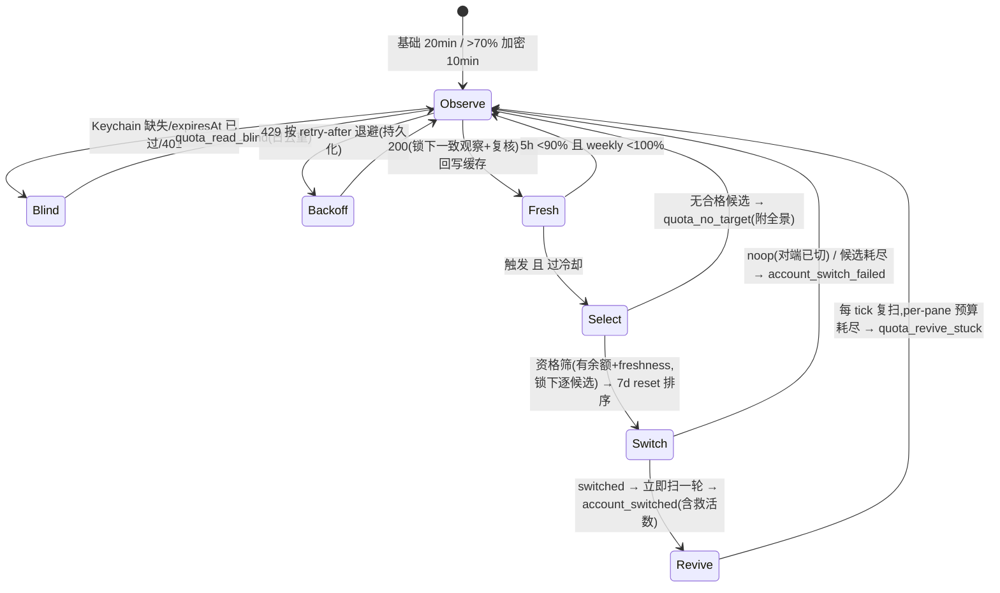

# FLY-1256 外部配额监控 + 自动切号器 — 实施计划

Issue: FLY-1256 (https://linear.app/geoforge3d/issue/FLY-1256/build-外部配额监控-自动切号器跑在-claude-体外-p1今天事故实证)
日期: 2026-07-14
基于: exploration.md, research.md

**Status**: codex-approved（Codex design review 5 轮：R1 14 + R2 7 + R3 4 + R4 3 全部采纳 → R5 APPROVED）· 等 founder v4 终版确认后生效（Lead 更正令 5b912c3f）
**Implement 执行体**: Codex gpt-5.6-sol xhigh（founder 批复单，勿改）· TDD（RED→GREEN→REFACTOR）
**版本号**: ship 时取空号（FLY-494 惯例）
**Founder 输入**: 三轮拍板全部折入（exploration §6），第三轮为终版。

## 0. 总览

新建体外常驻 daemon `flywheel-quota-monitor`（launchd KeepAlive、纯 Node 确定性进程）。设计哲学（Annie 定调）：**配额用到接近 100% 不浪费；贴墙跑，撞墙自动爬起**。

- **监控**：基础每 20min 查当前号真实用量（OAuth usage endpoint，实测限额 5 次/5min/token）；当前号 5h >70% → 加密到 10min 并开始 ~60min 级候选扫描；闲置号平时零查询。每次 200 响应回写 statusline 缓存。
- **触发**：当前号 **5h 已用 ≥ 90%**（运行时可调）。weekly 永不当阈值触发器；weekly **实际封顶（≥100%）** 为事实性死号仍触发（§9 R-1）。
- **选号**：资格 = 候选两窗「有余额」（<100%）+ freshness 可用；排序 = 7d reset 最早优先；founder 固定顺序平手裁决。回流 = 开（结构性内建）。
- **执行**：复用 `switchAccount()` + `flywheel-claude-profile use`。
- **恢复**（核心组件）：切号后扫 tmux panes，高置信签名识别卡配额对话框 → send-keys 解除+续跑，每 tick 复扫（per-pane 有界预算，持久化）。
- **通知**：`lead-alert.sh` 直连 Discord（Bridge down 也能发）。
- **退役**：Bridge 被动切号管线全部三个执行面退役（enqueue / watchdog tick / HTTP route），**退役生效经 env 门控排序在 daemon 健康验证之后**（§8 切换纪律），不留自动切号真空。



## 1. 组件与文件清单

### 新增（全部在主仓）

| 文件 | 职责 |
|---|---|
| `packages/teamlead/src/account-heal/quota-usage-api.ts` | usage API 客户端。`fetchAccountUsage(accessToken, opts)` → `{ok: {raw: ValidatedPayload, fiveH: {pct, resetsAt}, sevenD: {pct, resetsAt}}} \| {error: "unauthorized"\|"rate_limited"\|"network"\|"malformed", retryAfterMs?}`。请求头含 `anthropic-beta: oauth-2025-04-20` + `Accept: application/json`；`opts = {baseUrl, timeoutMs(默认10s), fetchFn}`；**abort 计时覆盖到 `response.json()` 读体完成**；`Retry-After` 解析秒数与 HTTP-date 两形态并 clamp 到 [60s, 30min]。`raw` = 通过 shape 校验的原始 payload（供缓存原样回写）。**accessToken 只进 Authorization 头，日志/错误对象绝不携带** |
| `packages/teamlead/src/account-heal/quota-monitor-config.ts` | 运行时配置契约。`loadQuotaMonitorConfig(path)`，默认 `~/.flywheel/quota-monitor.json`（env `FLYWHEEL_QUOTA_MONITOR_CONFIG`）。每 tick 重读。**校验含跨字段不变量**：`0 ≤ acceleratePct < trigger5hPct ≤ 100`；各间隔为正且 `acceleratedPollMinutes ≤ basePollMinutes`；`order` 元素唯一且过 bash `require_valid_name` 同款正则（无前导点/无 `..`/字符白名单）；数值有界。**`order: []` 合法 = monitor-only**（非校验失败）。文件缺失/校验失败 → monitor-only + 日去重告警，**监控节奏回落到编译期默认常量**（founder 可调值不硬编码指配置文件里的值；文件不可用时的兜底节奏是代码常量，行为可预期） |
| `packages/teamlead/src/account-heal/quota-monitor.ts` | 核心编排 `pollOnce(deps)`。IO 全注入（新增 `withAccountsLock`——与 `mkdir-lock.ts`/bash 同一把账号锁的注入 seam）。**锁下一致性观察**（§3.1）+ 触发/缓存写前复核 + 候选锁下验证（§3.6）+ 分级节奏 + 冷却闸 + 持久化调度状态（§3.8） |
| `packages/teamlead/src/account-heal/quota-monitor-state.ts` | **版本化持久状态**：`{version: 1, lastPollAt, lastSuccessfulUsageAt, errorStreak, backoffUntilMs, tier, lastCandidateSweepAt, lastSwitchAt, observedGeneration, reviveEpoch: {open, sourceAccount, generation, openedAt, expiresAt, panes: {[paneInstanceKey]: {attempts, lastAttemptAt}}} \| null}`（R2 blocker 4：**开放式切号 epoch** 是 send-keys 的唯一授权来源——`expiresAt` = **触发 scope 的 operative resetAt**（与传给 switchAccount 的 resetAt 同源：scope 5h → 5h resetsAt；weekly/both → weekly resetsAt）+ 30min 宽限（R3 高 2：weekly 封顶时源账号在 5h reset 后仍不可用，迟到 pane 会持续撞 weekly 墙直到周 reset）；**paneInstanceKey = tmux socket + pane_id + pane_pid**，pane-id 复用天然失配旧记录）。0600 原子写；启动读取+校验，损坏 → 保守初值（新冷却 + **epoch 置 null**）+ 告警；store generation 超前 → 同样新冷却 + epoch 置 null（不重建，保守不发键）。**无任何 token 字段**。路径 env `FLYWHEEL_QUOTA_STATE_PATH` 可覆盖 |
| `packages/teamlead/src/account-heal/quota-revive-scan.ts` | 切号后恢复扫描（§4）。分类器纯函数 + tmux 命令注入；per-pane episode 预算持久化于 state；`login_expired` 只计数；其他形态零接触 |
| `packages/teamlead/src/account-heal/quota-monitor-cli.ts` | 进程入口：**原子 singleton**（pidfile 以 `open(...,"wx")` 抢占；校验既有文件为常规文件+本 uid 所有+记录的进程启动时间匹配才判「活」；只删自己拥有的 pidfile；路径 env 可覆盖）、setTimeout 链主循环（间隔由档位+state 决定，**重启后尊重持久化的 backoffUntilMs/lastSwitchAt/lastCandidateSweepAt**）、SIGTERM/SIGINT 优雅退出、结构化 stderr 日志（永不打印 token）。**自体健康**：`errorStreak` 超阈（连续 ~6 次 usage 失败）→ `quota_monitor_down` 告警（日去重）；wrapper 侧对快速 crash-loop（launchd ThrottleInterval 内反复退出）与 dist 缺失同样 fail-loud 到同 kind（镜像 FLY-927 bridge-wrapper fail-loud 模式） |
| `packages/teamlead/bin/flywheel-quota-monitor` | bash thin launcher → `node dist/account-heal/quota-monitor-cli.js`（镜像 `flywheel-claude-freshness`；dist 缺失 exit 31 + wrapper 告警）。**登记进 `packages/teamlead/package.json` 的 `bin`/`files`** |
| `scripts/flywheel-quota-monitor-wrapper.sh` | launchd wrapper（R2 高 5 修正）：① **env 优先级**——source `~/.flywheel/.env` 前快照所有 `FLYWHEEL_QUOTA_*`/`FLYWHEEL_CLAUDE_*` 已设值、source 后恢复（进程环境优先，QA 隔离 env 不被生产 .env 顶掉）；② dist 缺失 → **exec 前**告警 `quota_monitor_down` 并退出；③ **durable 运行标记模式**（FLY-927 同款，exec 后 shell 已不存在无法观察退出）：exec 前写 start marker，cli 优雅退出时删除；**下次启动**见残留 marker → 计入窗口内 streak，超阈 → `quota_monitor_down` crash-loop 告警；④ 然后 `exec` bin（launchd 保有直接 PID/信号所有权） |
| `scripts/com.flywheel.quota-monitor.plist.template` | label `com.flywheel.quota-monitor`，KeepAlive+ThrottleInterval 30+RunAtLoad，日志 `/tmp/flywheel-quota-monitor.log`，`__HOME__` token 化 |
| `scripts/setup-quota-monitor.sh` | **install 与 enable 分离**。默认（install）：渲染 plist → 若无配置则写 **`order: []`**（monitor-only 是唯一生成默认）→ bootstrap（**幂等处理已装 label**：已 bootstrap → bootout 后重 bootstrap 或明确打印 already-installed，绝不把 bootstrap 失败当成功）→ 探活 = **pidfile 活 + state 文件在一个 poll 周期内出现新鲜更新**。`--enable`：校验 founder 批准的非空 order（每项都必须可切换，见 §3.6 候选全集）→ 打印解析后的完整配置请操作者确认 → 写入 order。部分/非法清单拒绝启用 |
| `scripts/qa-fly-1256-quota-daemon-e2e.sh` | **可运行断言脚本**（非骨架）：本地 mock usage API（env 剧本）+ scratch keychain/pool/store/lock/缓存/state/pidfile + 隔离 tmux server（`tmux -L`，env `FLYWHEEL_QUOTA_TMUX_SOCKET`）+ 真 daemon 进程。断言链：缓存更新 → 触发 → 候选锁下验证调用序 → scratch Keychain 被换 → 注入的假卡 pane 被救活 → 告警落隔离通道；**全程零 claude 进程（ps 断言）**；exit 非零即失败 |

### 修改（byte-compat 扩展，默认路径字节不变）

| 文件 | 改动 |
|---|---|
| `account-store.ts` | ① `SelectInput.preferredOrder?: string[]`（present：既有 usability 过滤后只保留列表内账号、按下标排序；absent：字节不变，既有测试零改动为哨兵）② **导出**既有 usability 判定（`isAuthUnusable` 等）供 daemon 复用，杜绝私有逻辑复制 |
| `switch-executor.ts` | `SwitchInput.preferredOrder?: string[]` 透传 `selectNextAccount`；typed 原因码放在**正确的结果变体上**（R2 blocker 6）：`no_account` 加 `reasonCode: "no_eligible_account" \| "target_stale_exhausted"`（现行为：TargetStale 标记后 re-select，耗尽落 no_account）；`failed` 加 `reasonCode: "freshness_unavailable" \| "apply_failed"`。daemon 不解析文本。既有调用方对新可选字段零感知（byte-compat） |
| **告警 kind 四处同步**（R2 blocker 2 修正：不是三处） | ① `scripts/lead-alert.sh` kind 白名单加 **6** 项：`account_switched` / `quota_no_target` / `quota_read_blind` / `account_switch_failed` / `quota_revive_stuck` / `quota_monitor_down`；② `LeadAlertNotifier.ts::ALERT_EVENT_TYPES` union 同步 6 项；③ `packages/teamlead/src/bridge/kind-contract.ts` 加 6 个 `KIND_CONTRACTS` 条目——**按真实契约形态 `{owner, arc, remediationRef?}` 落地**（不虚构 severity/copy 字段；如需扩展 schema 属独立决策，本单不做）；④ `packages/teamlead/src/bridge/__tests__/kind-contract.test.ts` drift 守卫同步 |
| **`account_switched` 端到端无票据机制**（R2 blocker 2 / R3 blocker 1 / R4 blocker 2 落位修正） | 渲染抑制不够——queue 重放路径上 `LeadAlertNotifier.drainQueue()` 把重放成功的 unified root 交给 `plugin.ts → AlertChannelHub.attachThreadForDelivered()` 开 thread + 种 NEW ticket。**typed 非票据注册表 `INFORMATIONAL_KINDS: ReadonlySet<AlertEventType>` 定义在 `LeadAlertNotifier.ts`（`ALERT_EVENT_TYPES` 旁）**——kind-contract.ts 本就从 notifier import 运行时值，contract/plugin 顺同方向引用**无依赖环**（R4 blocker 2）；**shell 侧 = lead-alert.sh 内小型镜像清单 + parity 测试**（解析 shell 脚本断言与 TS 集合精确相等，沿用既有 allowlist 双面模式）——lead-alert.sh 绝不依赖编译后 Node dist（Bridge-independent 前提）。三个消费点：① lead-alert.sh 直发渲染抑制票头（读镜像清单）；② LeadAlertNotifier queue-drain 重放渲染抑制票头；③ plugin.ts Hub 挂接路由——informational kind 的 delivered root **不交给** attachThreadForDelivered。测试：TS 成员 + shell↔TS parity + 两渲染路径 + Hub 旁路（queue 重放后无票头、无 thread、无 active ticket 行、无 AutoRepairBot dispatch）。本单注册表只含 `account_switched` |
| **6 个新 kind 的精确契约值**（R3 blocker 1 / R4 blocker 1 修正） | 全部 `{owner: "claude", arc: "human_by_design"}`（**owner 用既有 `KindOwner` 类——union 只有 claude/codex/cross_by_provider/founder_direct，"quota-monitor" 不合法也不该合法：`--lead quota-monitor` 只是 lead-alert.sh 的发射者身份，票据所有权归 claude 类由 `ticket-owner-map.ts` 现有解析承接**；无 remediationRef；不用 arc:"auto"）。措辞更正（R4 blocker 1）：`human_by_design` **不阻止** Hub 对已挂接告警调 `attempt()`（得到 needs_human）——**零 dispatch 保证只来自 informational Hub 旁路**，仅覆盖 `account_switched`。`account_switched` 的契约条目照常存在但**在 INFORMATIONAL_KINDS 下休眠**（文档化，不做 typed Exclude 复杂化） |
| **五个非 informational kind 的票据语义如实定界**（R4 高 3） | `quota_no_target`/`quota_read_blind`/`account_switch_failed`/`quota_revive_stuck`/`quota_monitor_down` 在本单的交付语义 = **Bridge-independent alert root**：直发成功走 lead-alert.sh 票样式头但**不进 Hub 生命周期**；queue 重放挂接为 legacy 行（无 ownerRef/ticketStatus enrichment）。**不承诺 durable ticket 生命周期**——这满足运维需要（统一频道响亮告警 + claims 去重；`quota_monitor_down` 的作用是把人喊来，不需要票据工作流）。若未来要 owner-assigned durable ticket（直发 handoff + drain enrichment），立独立 follow-up，不折进本单 |

告警调用契约：`lead-alert.sh --lead quota-monitor --project flywheel --kind <k> --severity <s> --title <t> --body <b> --signature <sig> --strict-delivery`；结果映射：`sent`/`queued_transient` = 成功；`duplicate` = 已有同签名 claim（**不证明曾送达**，仅防重复）；`dead_lettered`/`config_error` = fail-loud 记入日志与 state.errorStreak。启用窗口 preflight：确认 `FLYWHEEL_UNIFIED_ALERT_CHANNEL_ID` + `FLYWHEEL_ALERT_SENDER_TOKEN_ENV` 可用（发一条 info 级探活）。

### 退役（Bridge 被动切号管线，全部三个执行面；research §6）

| 位置 | 改动 |
|---|---|
| **双模式接线（R2 blocker 3：flag 语义逐执行面写死；「摘除」与「未设字节兼容」不能并存 → 全部改为运行时门控双模式）** | env `FLYWHEEL_QUOTA_DAEMON_CUTOVER` **未设（legacy 模式）**：`accountSwitchRepair` 实例照常构造，AutoRepairBot enqueue、HTTP route 执行、watchdog tick、runnerQuotaScan 对 repair 的依赖——全部现行 wiring 字节原样。**设 1（cutover 模式）**：① AutoRepairBot 不接 enqueue（封顶只走告警）；② `POST /api/account-switch` 返回**带认证检查的稳定 `410 retired`**（拍板：410，不采用 unbound——unbound 现状产生 `409 needs_human` 非稳定退役语义）；③ watchdog tick 跳过；④ 既有 durable pending 记录在 pending 锁下 quarantine（永不可认领执行）；⑤ runner 配额检测独立构造（不依赖 repair adapter，告警保留） |
| `KIND_CONTRACTS.usage_limit` | **两阶段迁移**（R2 blocker 3 决议）：本 PR **不改**该条目（legacy 模式下语义仍真实，byte-compat）；退役固化（flag 清理 follow-up）时再更新 arc/文案为「被动告警，切号归 daemon」 |
| 测试 | **两模式都测**：legacy 模式字节兼容哨兵（三面行为与现状一致）+ cutover 模式退役断言（enqueue 不发生 / route 410 / watchdog 跳过 / pending 不可认领 / 告警仍出） |
| flag 生命周期 | 切换窗口（§8）翻转；稳定后 flag 清理 + usage_limit 契约阶段二 列 follow-up（FLY-1136 纪律） |
| FLY-1182 | 停止点火；issue 处置由 Lead 定，PR 描述注明 |

**不改**：`flywheel-claude-profile`、`freshness.ts`/`freshness-cli.ts`（daemon 侧适配其现有返回形态，见 §3.6——不动 helper 本体）、statusline 脚本、pane 封顶告警检测链。

## 2. 运行时配置契约 `~/.flywheel/quota-monitor.json`（Annie：不许硬编码）

```json
{
  "trigger5hPct": 90,
  "basePollMinutes": 20,
  "acceleratePct": 70,
  "acceleratedPollMinutes": 10,
  "candidateSweepMinutes": 60,
  "minSwitchIntervalMinutes": 15,
  "order": [],
  "writeStatuslineCache": true
}
```

- `order` 生成默认 = **空数组（monitor-only）**，唯一默认；founder 批准的完整顺序经 `setup-quota-monitor.sh --enable` 写入（§1）。资格线不是配置（第三轮拍板「有余额就行」= <100% 语义）。
- 校验与不变量见 §1 config 行；写者（founder/dashboard 经 Bridge/setup）必须原子写。dashboard 对接 = Bridge 侧读写此文件的 API，Tadashi 与 HL 协调，不在本单（research §8 为合同）。
- Env：`FLYWHEEL_QUOTA_MONITOR_CONFIG` / `FLYWHEEL_QUOTA_API_BASE` / `FLYWHEEL_QUOTA_STATUSLINE_CACHE` / `FLYWHEEL_QUOTA_TMUX_SOCKET` / `FLYWHEEL_QUOTA_STATE_PATH` / `FLYWHEEL_QUOTA_PIDFILE`；Keychain/池/store/锁复用既有 `FLYWHEEL_CLAUDE_*`。

## 3. daemon 核心逻辑（`pollOnce` 规格）

1. **锁下一致性观察**（R1 blocker 1 根治）：`withAccountsLock`（与 switchAccount/bash 同一把 `claude-accounts.lock`，短临界区）内原子取 `{activeName(.active), storeGeneration, keychainCredential}` 快照后立即放锁。凭证缺失 → `quota_read_blind`（日去重）返回；`expiresAt <= now` → 同 blind（R1 红线：绝不 refresh active）。
2. **查当前号**（锁外，网络调用不持锁）：`fetchAccountUsage(快照.accessToken)`。429 → `backoffUntilMs = now + retryAfterMs`（持久化）；401 → blind；malformed/network → `errorStreak++`（持久化；超阈 → `quota_monitor_down`）。
3. **写前复核 + 锁内提交**（R1 blocker 1 / R2 blocker 1）：200 后**重取锁**速读 `.active` + generation——已变（手动切号并发）→ **丢弃本次观察**（不写缓存、不触发）log 返回；未变 → **持锁完成**缓存原子写（`raw` 原样 tmp+rename）与 state 更新（含 observedGeneration）后放锁——复核与提交是一个锁内原子段，锁只覆盖快速本地写，告警/网络/切号全在锁外。interleaving 测试点：手动 A→B 恰好插在「复核通过之后、rename 之前」（锁应使其不可能）。
4. **档位与候选扫描**：5h ≤ acceleratePct → 下轮 basePollMinutes，候选零查询；> acceleratePct → 下轮 acceleratedPollMinutes，且距 `lastCandidateSweepAt` ≥ candidateSweepMinutes 时扫候选全景（**只用池内未过期 accessToken，过期跳过标 unknown；绝不例行 probe-refresh**——R7）。全景仅预热/告警展示。
5. **触发判断**：`fiveH.pct >= trigger5hPct` → scope `5h`；`sevenD.pct >= 100` → scope `weekly`（事实性封顶，§9 R-1）；双满足 → `both`。未触发返回。触发但 `now - lastSwitchAt < minSwitchIntervalMinutes`（state 持久值，重启不失忆）→ log 返回。monitor-only → `quota_no_target`（body 注明原因）返回。
6. **选号（切号时刻按需验证，权威）**：**候选全集 = config.order ∩ 池目录 ∩ store.accounts**（R1 blocker 11；任一缺席 → 全景标 `not_in_pool`/`not_in_store`，`--enable` 时即拒绝这种 order）。对全集中每个非 active 候选（store 导出的 usability 判定先筛 authExpired/cooldown 省调用）：
   a. **锁下 freshness**：取账号锁 → 速读 `.active` 复核候选未变 active（变了 → 跳过该候选）→ `verifyPoolCredential`（probe-refresh 仅限非 active，轮转写回池）→ 读回新 accessToken → 放锁。`{fresh:"stale"}` → 记 reason 跳过（**helper 现有返回形态不区分账号性/环境性失败——R1 blocker 2：daemon 预验阶段不做全局短路，所有失败一律按候选跳过记原因**；环境性故障的兜底在 switchAccount 内部的 typed `FreshnessUnavailableError` 路径，那里有 exit 31 精确信号）。
   b. 锁外 `fetchAccountUsage(候选 token)`（打候选自己的桶）。
   c. **资格 = `fiveH.pct < 100 && sevenD.pct < 100`** → 携 `sevenD.resetsAt` 入列。
   合格列表按 resetsAt 升序、同刻按 order 下标 → `rankedQualified`。空 → `quota_no_target`（severe，签名=scope+日期，body=全景含每候选跳过原因）返回。
   > 双 refresh 说明（R1 blocker 2 决议，R2 高 6 修正措辞）：daemon 预验 refresh 后，`use` 的 freshness_guard 会对选中者**再做一次真实的 OAuth 轮转**（helper 每次调用都刷新并写回新 refresh token，**不是幂等**）——接受为纵深防御：仅切号时刻、每次一个账号、每次轮转后原子写回池，第二次轮转基于第一次写回的新 token 因此安全。**新增测试：连续两次 verifyPoolCredential 轮转 + 读回均成功，且第二次绝不复用第一次已作废的 refresh token**。
7. **执行**：`switchAccount({scope, observedAccount: 快照.activeName, observedGeneration: 快照.storeGeneration, resetAt: 触发窗口 resetsAt（both 取 weekly）, now, preferredOrder: rankedQualified}, makeClaudeProfileSwitchDeps(...))`。
   - `switched` →（R2 blocker 4 顺序修正）**第一步原子持久化** `lastSwitchAt` + `observedGeneration` + **开放 reviveEpoch**（sourceAccount/generation/openedAt/expiresAt）——崩溃也不丢冷却与恢复所有权；**第二步**立即跑一轮恢复扫描（§4，逐次持久化 attempts）；**第三步**发 `account_switched`（签名 `<from>-<to>-<generation>` 每次必响；body：from→to、双方两窗 util、7d reset、触发 scope、**本轮救活 n / 待续 m / 需重登 k**）；**第四步**对新 active 补一次 poll 刷缓存。
   - `noop_already_switched` → log。
   - `no_account` / typed `target_stale_exhausted` → `account_switch_failed`（severe，日去重）；typed `freshness_unavailable` → 同告警且本 tick 不再重试（环境性）。
8. **持久状态**：见 §1 quota-monitor-state.ts。启动时读取校验；损坏 → 保守初值（backoff 清零但 `lastSwitchAt = now` 起一轮新冷却）+ 告警；**store generation 超前于 state.observedGeneration**（daemon 停机期间发生过切号）→ 同样起新冷却（R1 高 8 保守语义）。

## 4. 切号后恢复扫描（`reviveScan` 规格，核心组件）

- **授权与持续**（R2 blocker 4）：**send-keys 的唯一授权 = state 中开放且未过期的 reviveEpoch**（切号 `switched` 时原子开放，`expiresAt` = 触发 scope 的 operative resetAt + 30min 宽限——scope 5h → 5h reset，weekly/both → weekly reset（R3 高 2）；到期/monitor-only/无 epoch → 分类照跑、**零按键**）。切号后立即一轮（在 `account_switched` 组稿之前——R1 高 7）；epoch 存续期内**每个 poll tick 复扫**（本地 tmux 零 API 成本）——迟到出现的配额对话框在 epoch 窗口内同样被逮到（R1 高 6）；epoch 过期后自动关闭（置 null 持久化）。
- **识别**：`tmux -L $SOCKET list-panes -a -F '#{pane_id} #{pane_pid}'` → `capture-pane -p` → 分类器（fixture 驱动正则，锚定底部 live-region，FLY-193 方法论）：`quota_stuck` / `login_expired` / `other`。
- **动作**：仅 `quota_stuck` 且 epoch 活 → 发 fixture 定死的按键序列；**per-pane 预算 3 次持久化于 state**，键 = **paneInstanceKey（socket+pane_id+pane_pid）**——pane-id 复用（旧 id 新 pane）产生新 key，旧 attempts 不误继承，新 pane 若也是 `quota_stuck` 则按新 episode 处理（R2 blocker 4 测试点）；pane 消失/恢复即清记录；两次尝试间隔 ≥1 个 tick（给 TUI 反应时间）；发键后下 tick 复查分类。
- **预算耗尽/需重登**：`quota_stuck` 3 次未解 → `quota_revive_stuck` 告警（warning，签名=paneInstanceKey+epoch openedAt，去重）；`login_expired` → 计数入告警 body，不动手（edge case b，FLY-1049 疆域）。
- **安全**：`other`（resume-menu/compact/正常/无法分类）零接触（FLY-313 红线，对抗测试）；无活 epoch 永不发键（monitor-only 天然零按键——R2 blocker 4）。

## 5. 安全红线（全部为测试断言项）

1. **R1**：active 账号只读，永不 refresh（测试：active 401/过期时 refresh 端点零调用）。
2. **R2**：daemon 零 token 落盘/零 token 日志（state/日志/告警 schema 断言 + `grep -i token` 哨兵）。
3. **R3**：一切 Keychain/池写委托既有机制——`switchAccount → use` 与 `verifyPoolCredential`（后者是 FLY-871 既有池写路径，daemon 只在锁下调用它）；daemon 不含任何 `security add-generic-password`。
4. **R4**：`preferredOrder` absent → 行为字节不变（既有测试零改动 + byte-compat 哨兵）。
5. **R5**：monitor-only 缺省安全——order 空永不切号；install 不等于 enable。
6. **R6**：恢复扫描只碰高置信 `quota_stuck`；其他形态零按键（对抗测试）。
7. **R7**：例行候选扫描绝不 probe-refresh。
8. **R8**（R3 高 3 精确化）：一切对 `.active`/store/池凭证的读改判定在账号锁下取一致快照；**usage endpoint 调用与告警发送绝不持账号锁**；**唯一刻意例外 = 有界的非 active freshness refresh**（`verifyPoolCredential` 的 active 复核 + OAuth 轮转 + 池写必须在锁内序列化——与既有 `switchAccount → use → freshness_guard` 持锁刷新行为一致；其 10s 超时 < 锁 120s stale-break 阈，锁测试覆盖此例外）；「切号前放锁」= daemon 外层复核锁在调 `switchAccount` 前释放（switchAccount 内部自取同一把锁）；写缓存/触发前复核快照未失效（interleaving 测试：手动 A→B 切插在每个边界含锁内段不可达性）。

## 6. 里程碑（Codex implement 按序，TDD）

- **M1 库层**：quota-usage-api + config（含不变量）+ state 模块 + account-store/switch-executor 扩展（preferredOrder + typed reason_code + usability 导出）+ 全部单测（先 RED）。
- **M2 daemon**：pollOnce（锁下观察/复核/分级/触发/选号/冷却/持久调度）+ cli（原子 singleton + 重启恢复语义）+ bin/package.json 登记 + 单测/集成测（macOS-gated scratch keychain）。
- **M3 恢复扫描**：**第一步 = 真机抓「卡配额对话框」pane fixture**（committed；抓不到就受控真机复现一次）→ 分类签名 + 解除按键契约 → quota-revive-scan + 对抗测试（R6）+ episode 持久化测试（重启/迟到对话框/pane-id 复用）。**M3 fixture 套件 = 退役门控翻转（§8）的硬前置**。
- **M4 通知**：6 kind **四处**同步（lead-alert.sh whitelist + LeadAlertNotifier.ts ALERT_EVENT_TYPES + kind-contract.ts KIND_CONTRACTS(owner="claude") + bridge/__tests__/kind-contract.test.ts）+ INFORMATIONAL_KINDS 注册表（**定义于 LeadAlertNotifier.ts**）及三消费点（lead-alert.sh 镜像清单渲染 + notifier 重放渲染 + plugin Hub 旁路）+ shell↔TS parity 测试 + strict-delivery 结果映射封装。
- **M5 Bridge 退役**：三个执行面双模式接线（enqueue/watchdog/HTTP route 410）+ pending 隔离 + runnerQuotaScan 解耦 + `FLYWHEEL_QUOTA_DAEMON_CUTOVER` 门控 + 两侧字节兼容/退役哨兵测试。**本 PR 不改 `KIND_CONTRACTS.usage_limit`**（两阶段迁移阶段一）；**flag 清理 + usage_limit 契约阶段二的 follow-up issue 必须在 CUTOVER 翻转前立案**（防临时兼容态意外永久化，R3 中 4）。
- **M6 部署物料**：wrapper（fail-loud）+ plist 模板 + setup（install/--enable 分离、幂等、探活=新鲜 state）+ e2e 可运行断言脚本。
- **M7 收尾**：全仓 lint + 全测 + PR → Codex code review → 独立 QA。

## 7. 测试矩阵

| 层 | 内容 |
|---|---|
| 单测（CI Linux，IO 全 mock） | usage-api（全分支/beta 头/超时覆盖读体/Retry-After 两形态+clamp/token 不泄漏）；config（缺失/坏 JSON/越界/**跨字段不变量**/monitor-only 降级+缺省节奏常量/重读生效/order 空合法）；state（版本化/损坏重置/generation 超前→新冷却）；pollOnce 全分支含 **R8 interleaving**（手动 A→B 切在观察后/复核前/**复核后-rename 前（锁内应不可达）**/候选验证中每个边界）、分级档位、weekly-100 边界、冷却重启持久、候选全集 ∩ 语义、资格 <100、排序+平手、CAS noop、候选耗尽、typed reason 处理、R7；revive（fixture 全形态/R6 对抗/episode 预算持久/迟到对话框/重启/pane-id 复用且新 pane 亦 quota_stuck/发键间隔/**epoch 门控：无 epoch·过期 epoch·monitor-only 均零按键**）；preferredOrder + byte-compat 哨兵；kind-contract 双面（6 条目齐 = 编译即证）；退役哨兵 + CUTOVER 两侧字节兼容 |
| 集成（macOS-gated） | 真 `security` scratch keychain：cli 起停、原子 pidfile（并发起两个进程恰一个活）、真 bash use 委托链 |
| e2e | `qa-fly-1256-quota-daemon-e2e.sh` 可运行断言（§1）：剧本「active 5h 92% → 触发 → 锁下候选验证 → 切号 → 假卡 pane 救活 → 新 active 3% → 告警落隔离通道」，exit 非零即失败 |
| 真机 QA（QA 阶段 = Claude Opus） | ① 「Claude 全员假死」核心场景（隔离全套 + 零 claude 进程 ps 证明）含真 tmux 恢复段；② 未触发不切；③ 候选全无余额只告警；④ 与手动 CLI 并发 CAS noop；⑤ statusline 缓存回写真机对照；⑥ CUTOVER 翻转后 Bridge 三面不再执行（哨兵行为验证）+ 未翻转字节兼容对照；⑦ enable 窗口真池 rehearsal（founder-gated） |

## 8. 上线与运维（有序切换，不留真空——R1 blocker 5）

1. **merge**：交付全部代码物料；daemon 不装不跑；`FLYWHEEL_QUOTA_DAEMON_CUTOVER` 未设 → Bridge 旧 wiring 字节原样（随批次重启也不改行为）。
2. **切换窗口（founder-gated，一次做完）**：`setup-quota-monitor.sh` install（monitor-only）→ 观察 ≥1 个基础周期：state 新鲜、缓存回写、告警通道 preflight 通过、M3 fixture 套件绿 → Annie 确认完整 order → `--enable` → 验证一次真池 rehearsal（受控）→ **daemon 健康证明后**才设 `FLYWHEEL_QUOTA_DAEMON_CUTOVER=1` + 重启 Bridge（退役生效）。
3. **回滚**：daemon 侧 `launchctl bootout` + 删 plist 即停；**回滚不撤销已发生的副作用**——Keychain 已切的账号、已轮转的池凭证、store generation/cooldown、config/state/缓存文件、alert claims/queue 记录都留存（如实列举，R1 中 14）；Bridge 侧退回 = 撤 `CUTOVER` env + 重启（旧 wiring 复活，作为应急回退路径保留到 flag 清理 follow-up 为止）。
4. **观测**：`/tmp/flywheel-quota-monitor.log` 每 poll 一行 util；state 文件即健康快照；KeepAlive 自愈 + wrapper fail-loud + `quota_monitor_down` 三层兜底。

## 9. 风险与开放项

| # | 风险/边界 | 处置 |
|---|---|---|
| R-1 | **weekly ≥100% 仍触发**是对「weekly 永不当触发器」的边界解读（否则慢烧型 weekly 先尽 → fleet 卡死且 5h 触发器永不发火）。Codex R1 复核认可该解读 | 已向 Lead 标注；默认按此实现，反对则删 §3.5 weekly 分支（单点） |
| R-2 | 90% 触发 + 10-20min 轮询可能两次 poll 间冲过 100% | Annie 哲学明示可接受；恢复扫描兜底；间隔运行时可调 |
| R-3 | 资格「<100%」可能选中 5h 已 9x% 的候选 → 短期再触发 | 字面执行拍板；冷却 + CAS 兜 churn；7d reset 排序天然分散 |
| R-4 | usage API 非公开面，契约可变 | fail-closed + `FLYWHEEL_QUOTA_API_BASE` 注入；退役后无被动兜底 → `quota_monitor_down` + KeepAlive + wrapper fail-loud 三层 |
| R-5 | 恢复扫描按键契约未知 | M3 fixture-first 硬前置（且为 CUTOVER 翻转硬前置） |
| R-6 | edge case b（切号后偶发 re-login） | v1 只告警立界；复现 fixture 留根因调查 |
| R-7 | 封号顾虑（Annie 首要） | 分级轮询 + 候选节流 + R7 + 429 恭敬退避；statusline 脚本自身刷新仍会跑（20min 轮询 > 其 10min 缓存年龄——research §2 已修正表述），合计预算仍远低于实测限额 |
| R-8 | `FLYWHEEL_QUOTA_DAEMON_CUTOVER` 是新增 flag | 生命周期明确：切换窗口翻转 → 稳定运行后 flag 清理 follow-up issue（FLY-1136 纪律），PR 描述注明 |
