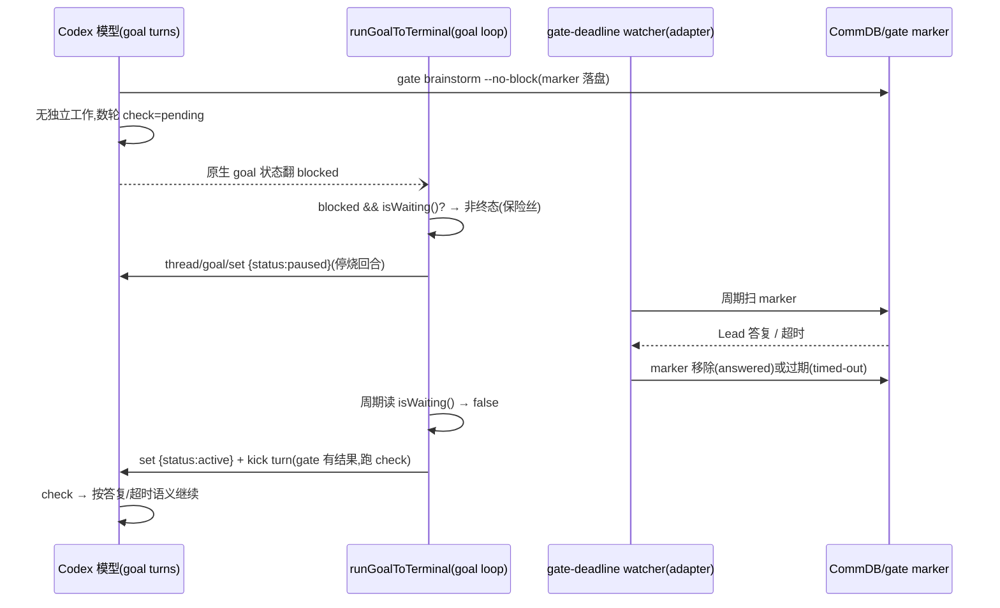

# FLY-1257 Codex 常驻运行时 + retry 路径四缺陷 — 实施计划

Issue: FLY-1257 (https://linear.app/geoforge3d/issue/FLY-1257/fix-codex-常驻运行时-retry-路径四缺陷打磨等门自杀-retry-不发带-takeover-缺-startpoint)
日期: 2026-07-14
基于: research.md

## 目标

修复 2026-07-14 实战暴露的 4 个运行时/生命周期缺陷,各自带以实战场景为 fixture
的回归测试。全部在本分支(three-stage 共享 branch B)实现,单 PR。

- ① Codex 等门自杀 → runtime 托管等待(原生 goal pause/resume,烧回合→不烧回合,
  耐心=gate deadline 48h 对齐 Claude)
- ② retry 不发 three_stage TURN 带 → dispatch() 镜像 FLY-887 seam(原子转移)
- ③ retry takeover 缺 ctx.startPoint → phase retry 恢复 startPoint=branch B tip
- ④ blocked 吞审查门 → 时间序判定(终态后创建的 gate = 生命迹象,永不 Z1)

模型分工(dispatch 锁定):Implement=Codex gpt-5.6-sol xhigh · QA=Claude Opus。

## Mermaid — ①修后的等门生命周期



## M0 — paused RPC 行为 probe(实施第一步,~半天)

**产出**:`engineering/doc/FLY-1257-codex-runtime-retry-defects/qa/m0-paused-probe.md`
+ 一次性 probe 脚本(风格照抄 FLY-1188 `v1-goal-probe.mjs`:spawn 真
`codex app-server` → ws 连接 → thread/start → goal/set → 观察)。

**验证四问**(research.md R1.2):

1. goal 活跃中途 RPC `thread/goal/set {threadId, status:"paused"}` 是否停住
   auto-continue(判据:pause 后 ≥60s 无新 turn/notification 动作)。
2. `{status:"active"}` 是否自动续跑;若不自动,`turn/start` kick 是否续上。
3. 只发 `{threadId, status}` 是否保留原 objective(`thread/goal/get` 对照)。
4. paused 下杀 daemon → 重启 → `thread/resume` 后 goal 状态是否仍 paused。

**判定**:1+2 PASS(pause 真停 + active/kick 真续)→ M1 主线。
1 FAIL(RPC pause 停不住)→ 降级线:goal loop 拦截 blocked 后**不 pause、
不 kick、静默持有**(dispatcher 到达 blocked 终态本来就停止续跑——blocked 即
不再烧回合;loop 只是不把它上报为终态,等 isWaiting() 翻 false 再 set active +
kick)。降级线其余接线完全一致,probe 结论写进本节。
3 FAIL → runtime 缓存 objective,set 时重发。4 FAIL → 重启恢复路径在 resume 后
补一次 set paused(loop 入口已有状态检查,见 M1-c)。

## M1 — 缺陷①:runtime 托管等门(claude-runner + flywheel-comm)

### M1-a `codex-daemon-client.ts` — goal loop 保险丝 + 等待态

`runGoalToTerminal` 改动(全部在既有 input 上加可选项,Claude 路径零接触):

1. input 新增可选 `gateWait?: { pause(): Promise<void>; resume(): Promise<void>; }`
   由 caller(goal runtime)注入;连同已有 `isWaiting` 构成完整等门协议。
   未注入 → 行为 byte-compat(blocked 照旧终态)。
2. 终态判定处(notification 分支 + poll fallback 分支两处):
   `status === "blocked" && input.isWaiting?.() && gateWait` → **不 RESOLVE**,
   进入等待态:`await gateWait.pause()`(失败仅 log,继续等待——pause 失败的
   最坏结果是模型继续烧回合,不影响正确性),此后每 `pollIntervalMs` 读一次
   `isWaiting()`;翻 false → `await gateWait.resume()` + `turn/start` kick
   (文案:「你等待的 gate 已有结果(答复或超时)。立即对你手头的 questionId 跑
   flywheel-comm check,按结果继续或按 fail-open/fail-close 行事。」)→ 回到
   正常循环。等待期间预算走已有 MED-7 waiting ceiling(isWaiting()=true 时
   remainingBudget 已自动用 waitingTimeoutMs)。
3. 循环入口(含重启 resume 后):`thread/goal/get` 读到 `paused` 且
   `!isWaiting()` → 立即 resume+kick(覆盖「等门期间 daemon 重启/答复落在重启
   窗口」两种时序)。读到 `paused` 且 `isWaiting()` → 直接进等待态。
4. `blocked && !isWaiting()` → 照旧终态(真 blocked,byte-compat)。

### M1-b `CodexDaemonClient` — 新 RPC 方法

`setGoalStatus(threadId, status: "paused" | "active"): Promise<void>` —
`thread/goal/set {threadId, status}`(M0 若证 objective 不保留,则带缓存的
objective 重发)。

### M1-c `codex-daemon-goal-runtime.ts` + `CodexTmuxAdapter.ts` — 接线

- runtime `runGoal` 把 `gateWait` 组装进 `runGoalFn` input:pause/resume 即调
  当前 session client 的 `setGoalStatus`(session 随重启轮换,闭包取
  `this.session`)。
- adapter 侧无需新通道:`isWaiting()` 已注入;watcher 已在 marker answered /
  timed-out 时移除或过期 marker → `isWaiting()` 自然翻 false → loop 自行
  resume。**watcher 不改。**
- kill-switch:`FLYWHEEL_CODEX_GATE_WAIT=0` → adapter 不注入 `gateWait`
  (回到今天的 blocked=终态)。默认 ON。flag 注册进 feature-flags registry。

### M1-d `flywheel-comm complete` — CLI guard(第二条自杀路径)

`complete --route blocked` 时:读 `listGateMarkersForExecution(exec)`,存在
**未答且未过 deadline** 的 mandatory marker → 拒绝(exit 非零,stderr 提示
「你有未答的 <checkpoint> gate(question <id>),runtime 正在为你等待;等 check
出结果再走对应路径」)。已答 / 已过期 / 无 marker → 放行。逃生口:
`--force-blocked`(供人工运维,提示写明)。

### M1-e 提示词/契约文字(轻触)

- `codex-runner-contract.md`:等待章节加一句——只剩等门无独立工作时,如实停下
  即可(runtime 托管等待并在有结果时唤醒);**绝不因等门宣告 goal blocked 或跑
  complete --route blocked**(CLI 会拒绝)。
- Blueprint codex gate 注入文本(brainstorm/review/question/generic 四处
  isCodexRunner 分支):各加一行同义提示。不动 Claude 分支(byte-compat 测试
  锁住)。

### M1 测试

- `codex-daemon-client` 单测:blocked+isWaiting → pause 被调、不终态;
  isWaiting 翻 false → resume+kick、循环继续到 complete;blocked+!isWaiting →
  照旧终态;未注入 gateWait → byte-compat;pause 抛错 → 继续等待不炸;
  重启入口 paused 恢复两时序。
- `codex-daemon-goal-runtime` 单测:gateWait 跨重启仍指向新 session。
- `complete` 单测:M1-d 四象限。
- fixture(实战场景①):模拟「design 完成 → gate pending → 模型翻 blocked →
  15 分钟后 Lead 答复」时间线,断言会话最终 completed 而非 blocked。

## M2 — 缺陷②:retry TURN seam(run-dispatcher.ts)

`RetryDispatcher.dispatch()`,`preRegisterCommDb` 之后、ctx 构建之前,镜像
start() 的 FLY-887 seam(`run-dispatcher.ts:995-1016` 原样搬,含注释更新):

```ts
if (req.shareParentBranch === true && isThreeStagePhaseRole(role) &&
    threeStageKeepAliveEnabled()) {
  try {
    const db = new CommDB(defaultGetCommDbPath(req.projectName));
    try { db.grantTurn(req.issueId, newExecutionId, role, Date.now()); }
    finally { db.close(); }
  } catch (err) {
    this.inflight.delete(key);
    this.cleanupPreRegistration(newExecutionId, req.projectName);
    throw new Error(`pre-launch TURN grant failed for ${role} phase retry on ${req.issueId}: ...`);
  }
}
```

- `grantTurn` 的 `ON CONFLICT epoch+1` = 原子转移,旧 holder 的迟到 wake 由
  epoch 识别(FLY-887 既有语义)。失败 fail-closed,清理路径与 dispatch() 既有
  失败路径对称。
- 后续 `lifecycleLaunchGuard.commitLaunch` 拒绝时留下的「已 grant 但未启动」
  turn 行:与 start() 同语义,由 FLY-921 turn-belt reconcile 兜底(不新增处理)。

### M2 测试(扩 `run-dispatcher-fly887-turn-seam.test.ts`)

phase-row retry(shareParentBranch=true, role=implement/qa/design)→ dispatch 后
`getTurn(issueId)` = newExecutionId 且 epoch 递增(预置旧 holder 断言转移);
grant 抛错 → dispatch 抛 + inflight/pre-registration 清理;非 phase retry
(shareParentBranch undefined)→ 零 grantTurn 调用(byte-compat);
keep-alive=0 → 零调用。fixture:实战②(design retry 后 runner turn 自检
应得 yours)。

## M3 — 缺陷③:retry 恢复 startPoint(run-infra.ts + run-dispatcher.ts)

### M3-a 注入的推导函数(run-infra.ts,与 FLY-795 resumeComputer 同族)

`phaseRetryStartPoint(issueId, role, projectName): string | null`:

1. `worktreeKey = resolveWorktreeKey(issueId, {sessionRole: role, shareParentBranch: true})`
2. branch 名走 WorktreeManager 同一推导(FLY-795 `branchName` deps 同款,
   严禁手写字符串模板——防 drift)
3. `git -C <projectRoot> rev-parse --verify <branch>^{commit}` → tip SHA;
   branch 不存在/任何 git 错误 → null(fail-open 到现状 create 路径)。
   rev-parse-only(FLY-245 的 git 面纪律:不跑 status/其他 porcelain)。

### M3-b dispatch() 消费

phase-row retry(与 M2 同判定)时调用推导函数,非 null → `ctx.startPoint = tip`。
非 phase retry 不调用(byte-compat)。RetryRequest **不加字段**(Bridge 内部
推导,HTTP 边界零变化)。

### M3 效果(两条路径同修)

- takeover 路径(worktree 仍注册):clean + head==tip → 接管成功(今天恒 fail
  `expected=?`);dirty → 照旧拒(fail-close 语义不变,保护未提交工作)。
- recreate 路径(worktree 被删):`git worktree add -B <branch> <tip>` = 重置到
  自身 tip = **无损重建**(今天缺省 origin/main 会把 branch B 重置回 main,
  静默丢弃已提交的 phase 工作——research.md R3 副发现,一并堵住)。

### M3 测试

真 git 仓库 fixture(扩 `Blueprint.fly887-worktree-takeover.test.ts` +
dispatcher 测试):注册 worktree + clean + head==tip 的 phase retry → takeover
成功、复用 worktree;dirty → 拒;branch 不存在 → startPoint 为 null → create
走 origin/main;worktree 被删 + branch B 领先 main 两个 commit → retry 后
worktree head == branch tip(工作不丢)。fixture:实战③(1244 场景:registered
共享 worktree 上 retry implement)。

## M4 — 缺陷④:时间序判定(StateStore + zombie-gate-hygiene + gate-poller)

### M4-a StateStore:`sessions.terminal_at` 列

- 幂等迁移:`ALTER TABLE sessions ADD COLUMN terminal_at TEXT`(既有 try/catch
  模式)。
- 盖戳:在 lifecycle_revision 已统一递增的同一批状态写入点(upsert /
  persistTransition / forceStatus):新状态 ∈
  `ZOMBIE_IRREVERSIBLE_TERMINAL_STATUSES` 且旧状态 ∉ → `terminal_at =
  datetime('now')`(SQL 端生成,绝不 JS wall-clock——与 CommDB `created_at`
  同为 SQLite 服务端 UTC 字符串,字典序可比;Lead brainstorm 批复的时钟纪律);
  新状态 ∉ 终态集(revive)→ 清 NULL。已在终态集内的重复写入不重复盖戳。
- `getSession` 返回该列。

### M4-b hygiene 谓词(zombie-gate-hygiene.ts)

- `ZombieCandidateQuestion` 加 `created_at: string`;gate-poller 候选映射透传
  (`getPendingQuestions` 行已含)。
- Z1 判定,在 terminal 判定之后、intent 写入之前插入:

```
session 存在且 terminal:
  terminal_at 非空且 q.created_at >= terminal_at → 生命迹象,跳过(不退,不写 intent)
  terminal_at 为空(pre-migration 存量行)       → 保守跳过 Z1(fail-open 不退)
  q.created_at < terminal_at                     → 真僵尸,照今天的三相流程退
session 不存在(StateStore 无行)                → 照今天行为退(无从比较,维持现状)
```

  同秒 tie(SQLite 1s 分辨率)按 `>=` 判生命迹象——误放过一个真僵尸的代价是
  下轮再扫,误退一个活门的代价是会话永死,取保守侧。
- Z2 / kill-switch / 三相审计 / dangling-intent reconcile 全部不动。

### M4 测试(扩 `zombie-scan.test.ts`)

blocked 会话 + terminal_at 之后创建的 review_code gate → 多轮 hygiene pass 均
跳过(gate 存活到 request-review 绑定/审完);terminal_at 之前创建的 gate →
照退(FLY-1099 能力不回退,断言 outcome=resolved);terminal_at NULL 存量行 →
跳过;session 缺失 → 照退;StateStore 侧断言 terminal_at 只在首次进终态时盖、
revive 清空。fixture:实战④(1244 时序:blocked → teardown 删 CommDB 行 →
新开 gate → hygiene tick)。

## 交付顺序与提交切分

M0(probe,结论回填本文档)→ M1 → M2 → M3 → M4,各自独立 commit +
测试同 commit;全套跑 `pnpm lint` + 受影响包测试 + 全仓 suite。四项互相独立,
任何一项 review 期间可单独摘除不连坐。

## 风险与回滚

| 项 | 风险 | 缓解/回滚 |
|---|---|---|
| M1 | paused RPC 行为与 TUI 不一致 | M0 先行验证;降级线(静默持有不 pause)已设计;kill-switch `FLYWHEEL_CODEX_GATE_WAIT=0` 一键回旧行为 |
| M1-d | guard 误拦真 blocked | 只拦「未答且未过 deadline 的 mandatory marker」;`--force-blocked` 逃生口 |
| M2 | 与 orchestrator wake 路径的 grant 竞争 | epoch 单调 + Bridge 单进程内串行 dispatch;与 start() 完全同语义,不引入新竞态面 |
| M3 | branch 推导 drift | 严禁手写模板,复用 FLY-795 同一 deps;null 即回落现状 |
| M4 | 时钟/格式差异误判 | 两侧均 SQLite 服务端 UTC DATETIME 字符串;NULL fail-open;tie 取保守侧 |
| M4 | Z1 清扫力度下降 | 只对「终态后创建」的 gate 收手;真僵尸(生前遗留)判定不变 |

## 验收标准

1. 四个实战 fixture 场景在测试中复现修前失败、修后通过。
2. Claude runner 路径 byte-compat(既有 identity/prompt/takeover/turn-seam
   测试全绿,无断言改动除新增)。
3. M0 probe 结论落盘本文件夹 qa/。
4. Codex design review APPROVED;实现后 Codex code review + 独立 QA(Claude
   Opus,真机重放四场景)。
