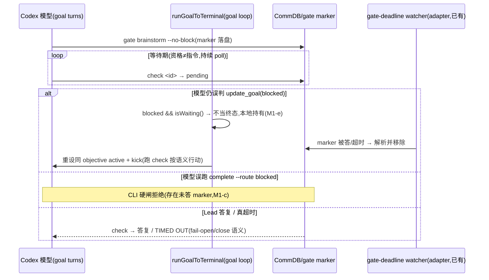

# FLY-1257 Codex 常驻运行时 + retry 路径四缺陷 — 实施计划

Issue: FLY-1257 (https://linear.app/geoforge3d/issue/FLY-1257/fix-codex-常驻运行时-retry-路径四缺陷打磨等门自杀-retry-不发带-takeover-缺-startpoint)
日期: 2026-07-14
基于: research.md

## 目标

修复 2026-07-14 实战暴露的 4 个运行时/生命周期缺陷,各自带以实战场景为 fixture
的回归测试。全部在本分支(three-stage 共享 branch B)实现,单 PR。

> **缺陷①根因更正已并入**(Lead Linear comment 2026-07-14,FLY-1255 一手取证):
> 「连续 3 回合」= Codex 平台对 update_goal(blocked) 的准入门槛(允许≠应该);
> 事故 = runner 误判 + 缺陷④放大。①主修 = 等门纪律写死进提示词/契约 + CLI 硬闸
> + goal-loop 非暂停拦截;「便宜睡眠」(原生 paused RPC)为**可整体摘除的优化项**。

- ① Codex 等门自杀 → M1:等门纪律(资格≠指令 / 持续 poll / 仅真
  timeout·error·reject 才 fail-close)+ complete 硬闸 + goal-loop blocked 拦截
- ② retry 不发 three_stage TURN 带 → M2:dispatch() 镜像 FLY-887 seam(原子转移)
- ③ retry takeover 缺 ctx.startPoint → M3:phase retry 恢复 startPoint=branch B tip
  (三态推导,indeterminate fail-close)
- ④ blocked 吞审查门 → M4:时间序判定(终态后创建的 gate = 生命迹象,永不 Z1)
- 优化项 M-opt(排最后,可摘除):原生 goal paused RPC(省去等待期半开 turn 的
  残余消耗)

模型分工(dispatch 锁定):Implement=Codex gpt-5.6-sol xhigh · QA=Claude Opus。

## Mermaid — ①修后的等门行为



## M1 — 缺陷①主修:等门纪律 + CLI 硬闸 + goal-loop 拦截

### M1-a Blueprint codex 等门指引(edge-worker)— 单一共享文案块,五个位点

等门铁律做成**一个共享构造函数**(如 `codexGateWaitLawLines()`,与既有
`formatGateQuestion` 同级的共享 helper),内容三条(措辞一次定稿,五处引用,
杜绝四份手抄漂移)。**每份 prompt 只渲染一次**(Codex R2 #6):五个位点都
*请求*注入,但经 push-once sentinel 去重——多 checkpoint 同时启用时铁律块恰好
出现一次(组合断言锁定),单独启用任一位点时也必然出现。

- **资格≠指令**:Codex 平台在同一 blocker 持续数个 turn 后会*允许*你把 goal 标
  blocked——「允许」不是「应该」。**gate/review pending 永远不是 blocked。**
- resident 持续 poll,节奏放缓(unhurried;两次 check 之间做独立工作或直接下一轮
  再查)。
- 仅三种情况走 fail-close/blocked 路径:check 明确返回 **timeout 且语义为
  fail-close**、gate/review 被明确 **reject**、或命令本身持续 **error**。
  等待本身永远不满足任何一条;fail-open 的 timeout 必须继续干活,不得 blocked。

注入位点 **5 处** `isCodexRunner` 分支(Codex R1 #2 点名的第 5 处):
brainstorm(`Blueprint.ts:1627-1636`)、review_code(`:1684-1696`)、
question(`:1755-1761`)、generic(`:1774-1781`)、**approve_to_ship 的
resident poll ternary(`:1715-1716`)**。Claude 分支一字不动。

### M1-b codex-runner-contract.md(claude-runner)

「Identity & Execution Model」等待段 + 「Comm Protocol」gate 段写入同款三条铁律,
显式点名:**绝不因等门 update_goal(blocked),绝不因等门跑 complete --route
blocked(CLI 会拒绝)**。以 FLY-1255 的正确行为为参照措辞。

### M1-c flywheel-comm complete — CLI 硬闸(Codex R1 #1 修形)

`complete --route blocked` 时执行 guard:

- **新 strict 枚举 seam**(Codex R2 #1):现有 `listGateMarkersForExecution`
  是刻意容错的(静默跳过不可读/损坏文件)——**不能全局改严格**,否则回归
  CodexTmuxAdapter 的 isWaiting/watcher 容错扫描。在 gate-marker.ts 加独立
  strict 入口(如 `listGateMarkersForExecutionStrict(dir, execId)` 或第三参
  `{strict:true}`,默认行为字节不变):目录 ENOENT = 空(无门,放行);
  任一文件 read/parse/permission 失败 = **unknown → 拒绝**。guard 走 strict
  入口,目录来自 `defaultGateMarkerDir(process.env)`(真实两参调用形态)。
- 存在**任何未答**(`!answeredAt`)checkpoint marker → 拒绝(exit 非零,
  stderr:「你有未答的 <checkpoint> gate(question <id>);等门不是 blocked——
  继续 poll check;该门被答复/被 watcher 超时解析后此路自然放行」)。
- **不做 wall-clock deadline 判断**:deadline 到点的解析权威是 gate-deadline
  watcher(FLY-159)——它把 CommDB question 置 timeout 并**移除 marker**,guard
  随之自然放行;fail-open 的超时解析后模型按提示词继续干活(不是 blocked),
  fail-close 的超时解析后再走本路径畅通无阻。guard 自身只看「未答 marker 是否
  存在」。
- **无 runner 可见的绕过 flag**(原 `--force-blocked` 取消——resident runner
  自己就能敲,硬闸即失效)。运维紧急放行 = 解析那扇门本身(`flywheel-comm
  respond` 答复,或等 watcher 超时解析)。**损坏 marker 的运维修复路径要单独
  文档**(Codex R2 #1:respond/watcher 都跳过损坏内容,修不了它)——运维手工
  移除/隔离该 marker 文件(guard 的拒绝 stderr 指明文件路径),移除后放行。
- 其他 route 一律不受影响(byte-compat)。

### M1-d(原 M1-e)goal-loop blocked 拦截 — 非暂停持有(Codex R1 #2 拆自 M-opt)

模型直接 update_goal(blocked) 的出口需要 runtime 硬兜,且**不依赖 paused RPC /
probe**(blocked 终态下 dispatcher 本就不再续跑 = 不烧回合,本地持有零成本):

- `runGoalToTerminal`:notification 与 getGoal poll 两路观察统一走**一个
  blocked/waiting 分类器**;`status==="blocked" && input.isWaiting?.()` →
  **不 RESOLVE**,进入本地持有:每 `pollIntervalMs` 重读 `isWaiting()`(预算
  照走已有 MED-7 waiting ceiling);翻 false(watcher 已解析 marker)→ 重激活
  + kick(「gate 已有结果,跑 check 按语义行动」)→ 回正常循环。
  `blocked && !isWaiting()` → 照旧终态。
- **重激活 = `thread/goal/set {status:"active", objective, tokenBudget}`**:
  objective **与 tokenBudget 都用 runtime 缓存值原样重发**(初始 goal/set 就是
  两者都发;「省略字段保留原值」的语义未验证,不依赖——Codex R2 #2)。
- **重启 preflight(主修必做,不在 M-opt——Codex R2 #2)**:goal-runtime 在
  transport death 后会 resume 同一 thread 重跑 `runGoalToTerminal`,而它现在
  开场就 setGoal(active)+startTurn——daemon 死在持有期时,恢复路径会把 blocked
  goal 直接复活并 kick,绕过分类器。M1-d 必须在 setGoal/startTurn **之前**
  `thread/goal/get` preflight:读到 blocked + objective 与缓存一致 +
  `isWaiting()` → 直接进持有态(不 setGoal 不 kick);blocked + `!isWaiting()`
  → 合法终态,照常 RESOLVE;其余状态照原流程。M-opt 只是在同一 preflight 上
  扩展 paused 分支。
- kill-switch `FLYWHEEL_CODEX_GATE_WAIT=0` → 拦截+preflight 整段关闭(blocked
  照旧终态),默认 ON,注册进 feature-flags registry。
- 与 M-opt 的关系:M-opt 只是在本地持有期间**额外**把 goal 置 paused(清掉
  半开 turn 的残余消耗);拦截/持有/preflight/重激活的骨架在 M1-d,M-opt 摘除
  不影响。

### M1 测试

- Blueprint prompt 断言(扩 `Blueprint.fly1188-codex-prompt.test.ts` /
  identity 测试):**5 处** codex 位点(brainstorm/review_code/question/generic/
  approve_to_ship)都含铁律关键句、出自共享构造(断言同一子串);Claude 分支
  byte-compat。
- `complete` guard 单测:未答 marker → 拒;已答 → 放;watcher 已解析移除 → 放;
  **fail-open 超时解析后 → 放**(且语义上模型不该走到这,文案断言);marker
  损坏/目录不可读 → 拒(fail-close,stderr 含文件路径);目录 ENOENT → 放;
  strict 与容错两套契约都测(adapter 的既有容错扫描 byte-compat)。
- goal-loop 拦截单测:blocked+isWaiting → 不终态、持有;isWaiting 翻 false →
  重发 objective+tokenBudget + kick、循环继续到 complete;blocked+!isWaiting →
  照旧终态;kill-switch=0 → 照旧终态;notification 与 poll 两路进同一分类器
  (乱序/重复通知不重复 kick);**runtime 轮转测试:daemon 死在持有期 →
  resume 后 preflight 进持有态,marker 未解析期间零 setGoal 零 kick**。
- fixture(实战①):「design 完成 → gate pending → 模型 update_goal(blocked)
  → 15 分钟后 Lead 答复」时间线,断言会话最终 completed 而非 blocked;以及
  「模型改跑 complete --route blocked」被 CLI 闸拒绝。

## M2 — 缺陷②:retry TURN seam(run-dispatcher.ts)

### M2-a 共享 pre-launch 失败清理 helper(Codex R1 #3)

新 **`protected`** 方法 `abortPreLaunch(key, executionId, projectName)`
(Codex R2 #3:dispatch() 在 RetryDispatcher、start() 在 RunDispatcher 子类,
private 子类不可见,按字面实现编译不过;protected 或模块级 helper 二选一,
默认 protected)。best-effort,逐项 try/catch:`inflight.delete(key)` +
`cleanupPreRegistration(...)` +
**`lifecycleLaunchGuard?.onSpawnFailed(executionId)`**(现 start() 的 TURN seam
失败路径漏了这一项,durable starting claim 会悬挂——一并修,start()/dispatch()
两处同用此 helper)。

### M2-b dispatch() 的 TURN seam

`RetryDispatcher.dispatch()`,`preRegisterCommDb` 之后、ctx 构建之前(**且在
M3 startPoint 推导之后**——git 探针失败必须发生在 grant 之前,绝不把 TURN 转移
给一个永远不会启动的 exec,Codex R1 #3):

```ts
if (req.shareParentBranch === true && isThreeStagePhaseRole(role) &&
    threeStageKeepAliveEnabled()) {
  try {
    const db = new CommDB(defaultGetCommDbPath(req.projectName));
    try { db.grantTurn(req.issueId, newExecutionId, role, Date.now()); }
    finally { db.close(); }
  } catch (err) {
    this.abortPreLaunch(key, newExecutionId, req.projectName);
    throw new Error(`pre-launch TURN grant failed for ${role} phase retry on ${req.issueId}: ...`);
  }
}
```

`grantTurn` 的 `ON CONFLICT epoch+1` = 原子转移(FLY-887 既有语义)。
`lifecycleLaunchGuard.commitLaunch` 拒绝时留下的已 grant turn 行:与 start()
同语义,由 FLY-921 turn-belt reconcile 兜底。

### M2 测试(扩 `run-dispatcher-fly887-turn-seam.test.ts`)

phase-row retry → dispatch 后 `getTurn(issueId)` = newExecutionId 且 epoch 递增
(预置旧 holder,断言转移);grant 抛错 → dispatch 抛 + inflight/pre-registration
清理 + **launch claim 经 onSpawnFailed 关闭**(start() 侧同断言补上);非 phase
retry → 零 grantTurn 调用(byte-compat);keep-alive=0 → 零调用。
fixture:实战②(design retry 后 runner turn 自检应得 yours)。

## M3 — 缺陷③:retry 恢复 startPoint(run-infra.ts + run-dispatcher.ts)

### M3-a 判定与推导(Codex R1 #4 修形:独立判定 + 三态结果)

- **isPhaseRetry 判定独立于 keep-alive flag**:`req.shareParentBranch === true &&
  isThreeStagePhaseRole(role)`。keep-alive=0 时 Blueprint 走 removeIfExists+create,
  create 缺 startPoint 照样把 branch B 重置回 origin/main——正是要堵的数据丢失口,
  所以推导对**每一个** phase retry 都执行,不挂 keep-alive。
- 注入推导函数(run-infra.ts,与 FLY-795 resumeComputer 同族)
  `phaseRetryStartPoint(issueId, role, projectName)`,返回**三态**:

```
{ kind: "found", sha }          — rev-parse 成功
{ kind: "missing" }             — 分支确认不存在(rev-parse 明确的 unknown revision)
{ kind: "indeterminate", err }  — 其他任何 git/IO/权限错误
```

  branch 名推导:`resolveWorktreeKey(issueId, {sessionRole: role,
  shareParentBranch: true})` → `WorktreeManager.expectedWorktree(...)` 的 branch
  (严禁手写字符串模板)。读 tip(Codex R2 #4 修形):`git -C <projectRoot>
  rev-parse --verify --quiet "refs/heads/<branch>^{commit}"` ——
  **refs/heads/ 全限定**(防同名 tag 顶替 branch B)+ **--quiet 的机器可读
  退出契约**(不匹配 stderr 文案——跨 git 版本/locale 脆):`--verify --quiet`
  对不存在的 ref 静默 exit 1 = **missing**;exit 0 + stdout SHA = **found**;
  其余任何 spawn/exit 形态(如 exit 128 非 repo、权限、IO)= **indeterminate**。
  rev-parse-only(FLY-245 git 面纪律)。

### M3-b dispatch() 消费(fail-close 语义)

- `found` → `ctx.startPoint = sha`。
- `missing` → 不设 startPoint(合法 fresh 场景:design 首跑即死没建过分支;
  create 落 origin/main 是正确行为)。
- `indeterminate` → **fail-close:abortPreLaunch + throw**(不 grant TURN、不进
  Blueprint、不碰 worktree——瞬时 git 故障绝不能转化为 origin/main 毁分支)。
- 非 phase retry 不调用(byte-compat)。`RetryRequest` 不加字段(Bridge 内部
  推导,HTTP 边界零变化)。执行顺序:推导 → M2 grantTurn → ctx → blueprint.run。

### M3 效果(两条路径同修)

- takeover 路径(worktree 仍注册):clean + head==tip → 接管成功(今天恒 fail
  `expected=?`);dirty → 照旧拒(fail-close 保护未提交工作)。
- recreate 路径(worktree 被删,含 keep-alive=0):`git worktree add -B <branch>
  <tip>` = 重置到自身 tip = 无损重建(今天缺省 origin/main 会静默丢弃已提交的
  phase 工作——research.md R3 副发现,一并堵住)。

### M3 测试

真 git 仓库 fixture(扩 `Blueprint.fly887-worktree-takeover.test.ts` +
dispatcher 测试):注册 worktree + clean + head==tip 的 phase retry → takeover
成功;dirty → 拒;分支确认不存在(真 repo 里 --verify --quiet exit 1)→ 不设
startPoint 走 create(origin/main);**同名 tag 哨兵:存在 tag <branch> 而无
branch → 判 missing 而非 found**(refs/heads 限定生效);**keep-alive=0 +
branch B 领先 main 两个 commit + worktree 被删 → retry 后 worktree head ==
branch tip(工作不丢)**;**git 探针 fatal 错误(如 projectRoot 不可读)→
dispatch 抛、Blueprint 从未启动、TURN 未转移**。fixture:实战③(1244 场景:
registered 共享 worktree 上 retry implement)。

## M4 — 缺陷④:时间序判定(StateStore + zombie-gate-hygiene + gate-poller)

### M4-a StateStore:`sessions.terminal_at` 列

- 幂等迁移:`ALTER TABLE sessions ADD COLUMN terminal_at TEXT`(既有 try/catch
  模式)。
- 盖戳:在 lifecycle_revision 已统一递增的同一批状态写入点(**upsertSession /
  persistTransition / forceStatus 三处都要**):新状态 ∈
  `ZOMBIE_IRREVERSIBLE_TERMINAL_STATUSES` 且旧状态 ∉ → `terminal_at =
  datetime('now')`(**SQL 端生成,绝不 JS wall-clock**——与 CommDB
  `messages.created_at` 同为 SQLite 服务端 UTC 字符串,字典序可比;Lead
  brainstorm 批复的时钟纪律);终态→另一终态的改写**不重复盖戳**(保留首次
  时刻);新状态 ∉ 终态集(revive)→ 清 NULL。
- `getSession` 返回该列。

### M4-b hygiene 谓词(zombie-gate-hygiene.ts + gate-poller.ts)

- `ZombieCandidateQuestion` 加 **`created_at?: string | null`**(Codex R2 #5:
  CommDB schema 未声明 NOT NULL,类型面必须能表达缺失);hygiene store face 的
  session 形状加 **`terminal_at?: string | null`**。**gate-poller 候选映射处
  透传**(`gate-poller.ts:3216-3220` 的 `pending.map` 现在只搬 id/from_agent/
  checkpoint——漏透传就是静默失效,专门加 GatePoller 层测试盯住,Codex R1 #5)。
- 比较纪律:两侧先按 canonical SQLite UTC 格式(`YYYY-MM-DD HH:MM:SS`)校验,
  校验通过后**裸字符串字典序比较**——绝不经 JS Date 解析(时区/格式歧义不得
  进入时钟纪律);任一侧校验不过 → 按下表 fail-open 跳过。
- Z1 判定,在 terminal 判定之后、intent 写入之前插入:

```
session 存在且 terminal:
  q.created_at 缺失(null)或格式校验不过        → fail-open 跳过(不退)
  terminal_at 为空/格式校验不过(pre-migration) → 保守跳过 Z1(fail-open 不退)
  q.created_at >= terminal_at(裸字符串字典序)  → 生命迹象,跳过(不退,不写 intent)
  q.created_at < terminal_at                     → 真僵尸,照今天的三相流程退
session 不存在(StateStore 无行)                → 照今天行为退(无从比较,维持现状)
```

- **同秒 tie 的永久保守语义(Codex R1 #5 更正)**:两侧时间戳都不可变且 1s
  分辨率,`created_at === terminal_at` 的 gate 在**每一轮** pass 都被跳过——
  这是永久的保守歧义,不是「下轮再清」。接受并文档化+测试锁定:误放过的代价是
  一扇同秒僵尸门长期悬挂(可由运维手工解析),误退的代价是活门永死。
- Z2 / kill-switch / 三相审计 / dangling-intent reconcile 全部不动。

### M4 测试(Codex R1 #5 更正靶位)

- **`zombie-gate-watchdog.test.ts`**(runZombieGateHygiene 的真实测试文件;
  zombie-scan.test.ts 是另一套进程扫描,不动):Z1 时序矩阵——终态后创建 →
  多轮 pass 均跳过;终态前创建 → 照退(outcome=resolved,FLY-1099 不回退);
  terminal_at NULL → 跳过;created_at NULL 与格式损坏 → **分别**跳过用例;
  同秒 tie → 每轮都跳过(锁定永久保守语义);session 缺失 → 照退。
- **GatePoller 层透传测试**:候选映射真的携带 created_at(直接 unit-test
  hygiene 抓不到漏映射)。
- **StateStore 测试**:upsertSession / persistTransition / forceStatus 三处——
  首次进终态盖戳、终态→终态不改写、revive 清空。
- fixture:实战④(1244 时序:blocked → teardown 删 CommDB 行 → 新开 gate →
  hygiene tick)。

## M-opt — 优化项:原生 goal paused RPC(可整体摘除)

**定位**(缩窄后):M1-d 的本地持有已经不烧回合;M-opt 仅额外把持有期间的 goal
置 `paused`(清掉半开 turn/引擎侧的残余消耗、给 TUI 观察者明确状态)。纯优化,
review/实现风险大时整体摘到 follow-up issue,不连坐主修。

### M-opt-0 paused RPC 行为 probe(前置,~半天)

产出 `qa/m0-paused-probe.md` + 一次性 probe 脚本(风格照抄 FLY-1188
`v1-goal-probe.mjs`)。验证:RPC pause 真停 / active(带 objective 重发)真续 /
paused 随 thread 持久化。

### M-opt-1 实现(probe PASS 后;Codex R1 #6 的重启态机规格)

- `CodexDaemonClient.setGoalStatus(threadId, status, objective)`。
- **重启 preflight**:`runGoalToTerminal` 目前是 setGoal → startTurn → 进 poll
  循环;M-opt 必须在 setGoal/startTurn **之前**先 `thread/goal/get` 读 resumed
  goal——读到 `paused` 且 `isWaiting()` → 直接进 M1-d 的持有态(不 setGoal 不
  kick);`paused` 且 `!isWaiting()` → 重激活(active+objective)后走正常流程。
  objective 所有权:恒用 runtime 缓存的本 execution objective(paused 期间
  也不信 thread 侧回读值)。
- 持有态进入时调 `setGoalStatus(paused)`(失败仅 log,持有照常——paused 只是
  优化);M1-d 的重激活路径改为经 `setGoalStatus(active, objective)`。
- notification/poll 统一分类器复用 M1-d 的(不新增第二套判定)。
- 复用 M1-d 的 kill-switch(`FLYWHEEL_CODEX_GATE_WAIT=0` 时整段不存在)。

### M-opt 测试

M1-d 既有用例全部保持通过(paused 只是叠加);新增:持有进入 → pause 被调;
pause 抛错 → 持有照常;重启 preflight 两时序(paused+waiting → 持有;
paused+resolved → 重激活)。

## 交付顺序与提交切分

M1 → M2 → M3 → M4(主修,各自 commit + 测试同 commit;M2/M3 在 dispatch()
内的执行顺序 = M3 推导 → M2 grant)→ M-opt-0 probe → M-opt-1(可摘除)。
全套 `pnpm lint` + 受影响包测试 + 全仓 suite。

## 风险与回滚

| 项 | 风险 | 缓解/回滚 |
|---|---|---|
| M1-a/b | 提示词是软约束,模型仍可能误判 | M1-c CLI 闸兜 complete 出口;M1-d goal-loop 拦截兜 update_goal 出口;FLY-1255 已证纪律可被遵守 |
| M1-c | guard 误拦真 blocked | 只看「未答 marker 存在」;watcher 解析(含超时)后自然放行;无 runner 可见绕过,运维放行=解析门本身 |
| M1-d | 拦截把真死锁养成长等 | 上限=watcher 的 marker deadline(默认 48h fail-close 解析)+ MED-7 waiting ceiling;kill-switch 一键回旧行为 |
| M2 | 与 orchestrator wake 路径的 grant 竞争 | epoch 单调 + Bridge 单进程内串行 dispatch;与 start() 完全同语义 |
| M3 | branch 推导 drift / 瞬时 git 故障毁分支 | 复用 FLY-795 同族推导;三态结果,indeterminate fail-close(不落 origin/main) |
| M4 | 时钟/格式差异误判 | 两侧均 SQLite 服务端 UTC DATETIME;NULL/缺失 fail-open;同秒 tie 永久保守跳过(文档+测试锁定) |
| M4 | Z1 清扫力度下降 | 只对「终态后创建」的 gate 收手;真僵尸(生前遗留)判定不变 |
| M-opt | paused RPC 行为与 TUI 不一致 / 重启态机复杂 | M-opt-0 先 probe;重启 preflight 已规格化;整体可摘除,M1-d 骨架不受影响 |

## 验收标准

1. 四个实战 fixture 场景在测试中复现修前失败、修后通过。
2. Claude runner 路径 byte-compat(既有 identity/prompt/takeover/turn-seam
   测试全绿,无断言改动除新增)。
3. M-opt 若实施:probe 结论落盘 qa/;若摘除:在 PR 描述记录 follow-up issue。
4. Codex design review APPROVED;实现后 Codex code review + 独立 QA(Claude
   Opus,真机重放四场景)。
