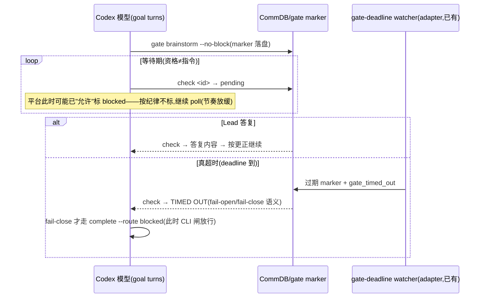

# FLY-1257 Codex 常驻运行时 + retry 路径四缺陷 — 实施计划

Issue: FLY-1257 (https://linear.app/geoforge3d/issue/FLY-1257/fix-codex-常驻运行时-retry-路径四缺陷打磨等门自杀-retry-不发带-takeover-缺-startpoint)
日期: 2026-07-14
基于: research.md

## 目标

修复 2026-07-14 实战暴露的 4 个运行时/生命周期缺陷,各自带以实战场景为 fixture
的回归测试。全部在本分支(three-stage 共享 branch B)实现,单 PR。

> **缺陷①根因更正已并入**(Lead Linear comment 2026-07-14,FLY-1255 一手取证):
> 「连续 3 回合」= Codex 平台对 update_goal(blocked) 的准入门槛(允许≠应该);
> 事故 = runner 误判 + 缺陷④放大。①主修 = 等门纪律写死进提示词/契约 + CLI 硬闸;
> 「便宜睡眠」降级为**可整体摘除的优化项**(M-opt)。

- ① Codex 等门自杀 → M1:等门纪律(资格≠指令 / 持续 poll / 仅真
  timeout·error·reject 才 fail-close)+ complete 硬闸
- ② retry 不发 three_stage TURN 带 → M2:dispatch() 镜像 FLY-887 seam(原子转移)
- ③ retry takeover 缺 ctx.startPoint → M3:phase retry 恢复 startPoint=branch B tip
- ④ blocked 吞审查门 → M4:时间序判定(终态后创建的 gate = 生命迹象,永不 Z1)
- 优化项 M-opt(排最后,可摘除):便宜睡眠(原生 goal pause/resume,省回合)

模型分工(dispatch 锁定):Implement=Codex gpt-5.6-sol xhigh · QA=Claude Opus。

## Mermaid — ①修后的等门行为(主修态)



## M1 — 缺陷①主修:等门纪律 + CLI 硬闸

### M1-a Blueprint codex 等门指引(edge-worker)

四处 `isCodexRunner` 分支(`Blueprint.ts:1627-1636` brainstorm、`1684-1696`
review_code、`1755-1761` question、`1774-1781` generic)各加一段等门铁律
(措辞四处一致,便于断言):

- **资格≠指令**:Codex 平台在同一 blocker 持续数个 turn 后会*允许*你把 goal 标
  blocked——「允许」不是「应该」。**gate/review pending 永远不是 blocked。**
- resident 持续 poll,节奏放缓(unhurried;两次 check 之间做独立工作或直接下一轮
  再查,不需要每轮都查)。
- 仅三种情况走 fail-close/blocked 路径:check 明确返回 **timeout**(且语义为
  fail-close)、gate/review 被明确 **reject**、或命令本身持续 **error**。
  等待本身永远不满足其中任何一条。

Claude 分支一字不动(既有 byte-compat 断言锁住)。

### M1-b codex-runner-contract.md(claude-runner)

「Identity & Execution Model」等待段 + 「Comm Protocol」gate 段写入同款三条铁律,
并显式点名:**绝不因等门 update_goal(blocked),绝不因等门跑 complete --route
blocked(CLI 会拒绝)**。以 FLY-1255 的正确行为为参照措辞。

### M1-c flywheel-comm complete — CLI 硬闸

`complete --route blocked` 时:读 `listGateMarkersForExecution(execId)`,存在
**未答且未过 deadline** 的 mandatory marker → 拒绝(exit 非零,stderr:「你有
未答的 <checkpoint> gate(question <id>),尚未超时;等门不是 blocked——继续
poll check,仅在真 timeout/reject/error 时再走此路径」)。已答 / 已过 deadline /
无 marker → 放行。逃生口 `--force-blocked`(人工运维用,提示写明)。

同一条纪律从软提示变成硬约束——堵住误判的第二条出口(goal 面的
update_goal(blocked) 由 M1-a/b 纪律 + M-opt 保险丝(若做)覆盖;CLI 面由本闸
覆盖)。

### M1 测试

- Blueprint prompt 断言(扩 `Blueprint.fly1188-codex-prompt.test.ts` /
  identity 测试):四处 codex 分支含铁律关键句;Claude 分支 byte-compat。
- `complete` 单测四象限:未答未过期 marker → 拒;已答 → 放;已过期 → 放;
  `--force-blocked` → 放。
- fixture(实战①):marker 未答未过期时 `complete --route blocked` 被拒的
  端到端 CLI 行为(今天三张 design 的死法从此走不通)。

## M2 — 缺陷②:retry TURN seam(run-dispatcher.ts)

`RetryDispatcher.dispatch()`,`preRegisterCommDb` 之后、ctx 构建之前,镜像
start() 的 FLY-887 seam(`run-dispatcher.ts:995-1016` 原样搬,注释指到本 issue):

```ts
if (req.shareParentBranch === true && isThreeStagePhaseRole(role) &&
    threeStageKeepAliveEnabled()) {
  try {
    const db = new CommDB(defaultGetCommDbPath(req.projectName));
    try { db.grantTurn(req.issueId, newExecutionId, role, Date.now()); }
    finally { db.close(); }
  } catch (err) {
    this.inflight.delete(key);
    this.cleanupPreRegistration(newExecutionId, req.projectName);
    throw new Error(`pre-launch TURN grant failed for ${role} phase retry on ${req.issueId}: ...`);
  }
}
```

- `grantTurn` 的 `ON CONFLICT epoch+1` = 原子转移,旧 holder 的迟到 wake 由
  epoch 识别(FLY-887 既有语义)。失败 fail-closed,清理与 dispatch() 既有失败
  路径对称。
- 后续 `lifecycleLaunchGuard.commitLaunch` 拒绝时留下的「已 grant 但未启动」
  turn 行:与 start() 同语义,由 FLY-921 turn-belt reconcile 兜底(不新增处理)。

### M2 测试(扩 `run-dispatcher-fly887-turn-seam.test.ts`)

phase-row retry(shareParentBranch=true, role=implement/qa/design)→ dispatch 后
`getTurn(issueId)` = newExecutionId 且 epoch 递增(预置旧 holder,断言转移);
grant 抛错 → dispatch 抛 + inflight/pre-registration 清理;非 phase retry
(shareParentBranch undefined)→ 零 grantTurn 调用(byte-compat);
keep-alive=0 → 零调用。fixture:实战②(design retry 后 runner turn 自检应得
yours)。

## M3 — 缺陷③:retry 恢复 startPoint(run-infra.ts + run-dispatcher.ts)

### M3-a 注入的推导函数(run-infra.ts,与 FLY-795 resumeComputer 同族)

`phaseRetryStartPoint(issueId, role, projectName): string | null`:

1. `worktreeKey = resolveWorktreeKey(issueId, {sessionRole: role, shareParentBranch: true})`
2. branch 名走 WorktreeManager 同一推导(FLY-795 `branchName` deps 同款,
   严禁手写字符串模板——防 drift)
3. `git -C <projectRoot> rev-parse --verify <branch>^{commit}` → tip SHA;
   branch 不存在/任何 git 错误 → null(fail-open 到现状 create 路径)。
   rev-parse-only(FLY-245 的 git 面纪律:不跑 status/其他 porcelain)。

### M3-b dispatch() 消费

phase-row retry(与 M2 同判定)时调用推导函数,非 null → `ctx.startPoint = tip`。
非 phase retry 不调用(byte-compat)。`RetryRequest` **不加字段**(Bridge 内部
推导,HTTP 边界零变化)。

### M3 效果(两条路径同修)

- takeover 路径(worktree 仍注册):clean + head==tip → 接管成功(今天恒 fail
  `expected=?`);dirty → 照旧拒(fail-close 语义不变,保护未提交工作)。
- recreate 路径(worktree 被删):`git worktree add -B <branch> <tip>` = 重置到
  自身 tip = **无损重建**(今天缺省 origin/main 会把 branch B 重置回 main,静默
  丢弃已提交的 phase 工作——research.md R3 副发现,一并堵住)。

### M3 测试

真 git 仓库 fixture(扩 `Blueprint.fly887-worktree-takeover.test.ts` +
dispatcher 测试):注册 worktree + clean + head==tip 的 phase retry → takeover
成功、复用 worktree;dirty → 拒;branch 不存在 → startPoint null → create 走
origin/main;worktree 被删 + branch B 领先 main 两个 commit → retry 后 worktree
head == branch tip(工作不丢)。fixture:实战③(1244 场景:registered 共享
worktree 上 retry implement)。

## M4 — 缺陷④:时间序判定(StateStore + zombie-gate-hygiene + gate-poller)

### M4-a StateStore:`sessions.terminal_at` 列

- 幂等迁移:`ALTER TABLE sessions ADD COLUMN terminal_at TEXT`(既有 try/catch
  模式)。
- 盖戳:在 lifecycle_revision 已统一递增的同一批状态写入点(upsert /
  persistTransition / forceStatus):新状态 ∈
  `ZOMBIE_IRREVERSIBLE_TERMINAL_STATUSES` 且旧状态 ∉ → `terminal_at =
  datetime('now')`(**SQL 端生成,绝不 JS wall-clock**——与 CommDB
  `messages.created_at` 同为 SQLite 服务端 UTC 字符串,字典序可比;Lead
  brainstorm 批复的时钟纪律);新状态 ∉ 终态集(revive)→ 清 NULL。已在终态集
  内的重复写入不重复盖戳。
- `getSession` 返回该列。

### M4-b hygiene 谓词(zombie-gate-hygiene.ts)

- `ZombieCandidateQuestion` 加 `created_at: string`;gate-poller 候选映射透传
  (`getPendingQuestions` 行已含该列)。
- Z1 判定,在 terminal 判定之后、intent 写入之前插入:

```
session 存在且 terminal:
  terminal_at 非空且 q.created_at >= terminal_at → 生命迹象,跳过(不退,不写 intent)
  terminal_at 为空(pre-migration 存量行)       → 保守跳过 Z1(fail-open 不退)
  q.created_at < terminal_at                     → 真僵尸,照今天的三相流程退
session 不存在(StateStore 无行)                → 照今天行为退(无从比较,维持现状)
```

  同秒 tie(SQLite 1s 分辨率)按 `>=` 判生命迹象——误放过一个真僵尸的代价是
  下轮再扫,误退一个活门的代价是会话永死,取保守侧。
- Z2 / kill-switch / 三相审计 / dangling-intent reconcile 全部不动。

### M4 测试(扩 `zombie-scan.test.ts`)

blocked 会话 + terminal_at 之后创建的 review_code gate → 多轮 hygiene pass 均
跳过(gate 存活到 request-review 绑定/审完);terminal_at 之前创建的 gate →
照退(FLY-1099 能力不回退,断言 outcome=resolved);terminal_at NULL 存量行 →
跳过;session 缺失 → 照退;StateStore 侧断言 terminal_at 只在首次进终态时盖、
revive 清空。fixture:实战④(1244 时序:blocked → teardown 删 CommDB 行 →
新开 gate → hygiene tick)。

## M-opt — 优化项:便宜睡眠(原生 goal pause/resume;可整体摘除)

**定位**:降低等门期间持续 poll 的回合/token 消耗;同时构成第二道保险丝(goal
翻 blocked 且门未答 → 不当终态)。不是止血必需;排在 M1-M4 之后;review/实现
风险大时整体摘到 follow-up issue,不连坐主修。

### M-opt-0 paused RPC 行为 probe(前置,~半天)

产出 `qa/m0-paused-probe.md` + 一次性 probe 脚本(风格照抄 FLY-1188
`v1-goal-probe.mjs`:spawn 真 `codex app-server` → ws → thread/start →
goal/set → 观察)。验证四问(research.md R1.2):pause 真停 / active(或 kick)
真续 / 只发 status 是否保 objective / paused 随 thread 持久化。
probe FAIL 的降级线:goal loop 拦截 blocked 后不 pause、静默持有(blocked 态
dispatcher 本就不续跑=不烧回合),等 isWaiting() 翻 false 再 set active + kick。

### M-opt-1 实现(probe PASS 后)

- `CodexDaemonClient.setGoalStatus(threadId, "paused"|"active")` —
  `thread/goal/set {threadId, status}`(必要时带缓存 objective 重发)。
- `runGoalToTerminal` input 加可选 `gateWait?: {pause(), resume()}`:终态判定处
  (notification + poll fallback 两处)`blocked && isWaiting?.() && gateWait` →
  不 RESOLVE,`pause()` 后每 pollIntervalMs 读 `isWaiting()`;翻 false →
  `resume()` + kick turn(「gate 已有结果,跑 check 按语义行动」)→ 回正常循环。
  循环入口读到 paused:`!isWaiting()` → 立即 resume+kick(覆盖重启窗口时序);
  `isWaiting()` → 进等待态。`blocked && !isWaiting()` → 照旧终态。未注入
  gateWait → byte-compat。等待预算走已有 MED-7 waiting ceiling。
- runtime/adapter 接线:`runGoal` 组装 gateWait(闭包取 `this.session` 的
  client,跨账号轮转自然跟随);adapter 不加新通道(watcher 已有的 marker
  answered/过期清理会让 isWaiting() 自然翻 false)。
- kill-switch `FLYWHEEL_CODEX_GATE_WAIT=0` → 不注入 gateWait(回主修态行为)。
  默认 ON,注册进 feature-flags registry。

### M-opt 测试

`codex-daemon-client` 单测:blocked+isWaiting → pause 被调、不终态;isWaiting
翻 false → resume+kick、循环继续到 complete;blocked+!isWaiting → 照旧终态;
未注入 gateWait → byte-compat;pause 抛错 → 继续等待不炸(pause 失败最坏 =
模型继续烧回合,不影响正确性);重启入口 paused 两时序。
`codex-daemon-goal-runtime` 单测:gateWait 跨重启指向新 session。

## 交付顺序与提交切分

M1 → M2 → M3 → M4(主修,互相独立,各自 commit + 测试同 commit)→
M-opt-0 probe → M-opt-1(可摘除)。全套 `pnpm lint` + 受影响包测试 + 全仓 suite。

## 风险与回滚

| 项 | 风险 | 缓解/回滚 |
|---|---|---|
| M1-a/b | 提示词是软约束,模型仍可能误判 | M1-c CLI 硬闸兜 complete 出口;M-opt 保险丝(若做)兜 goal 出口;FLY-1255 已证纪律可被遵守 |
| M1-c | 硬闸误拦真 blocked | 只拦「未答且未过 deadline 的 mandatory marker」;`--force-blocked` 逃生口 |
| M2 | 与 orchestrator wake 路径的 grant 竞争 | epoch 单调 + Bridge 单进程内串行 dispatch;与 start() 完全同语义,不引入新竞态面 |
| M3 | branch 推导 drift | 严禁手写模板,复用 FLY-795 同一 deps;null 即回落现状 |
| M4 | 时钟/格式差异误判 | 两侧均 SQLite 服务端 UTC DATETIME 字符串;NULL fail-open;tie 取保守侧 |
| M4 | Z1 清扫力度下降 | 只对「终态后创建」的 gate 收手;真僵尸(生前遗留)判定不变 |
| M-opt | paused RPC 行为与 TUI 不一致 | M-opt-0 先行 probe;降级线(静默持有)已设计;kill-switch 一键回主修态;整体可摘除 |

## 验收标准

1. 四个实战 fixture 场景在测试中复现修前失败、修后通过(①以 CLI 闸 + prompt
   断言呈现)。
2. Claude runner 路径 byte-compat(既有 identity/prompt/takeover/turn-seam
   测试全绿,无断言改动除新增)。
3. M-opt 若实施:probe 结论落盘 qa/;若摘除:在 PR 描述记录 follow-up issue。
4. Codex design review APPROVED;实现后 Codex code review + 独立 QA(Claude
   Opus,真机重放四场景)。
