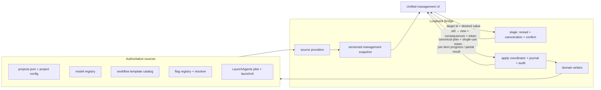

# FLY-1262 统一管理台 — 探索
Issue: FLY-1262 (https://linear.app/geoforge3d/issue/FLY-1262/build-flywheel-统一管理台fly-1038-prd-落地-ssot-自动发现-统一提交流落盘6-硬约束为核心验收)
日期: 2026-07-14
基于: 无

## Context

FLY-1262 把 FLY-1038 已收敛的交互原型落成生产管理台。这里有两份不同层级的基准，不能混用：

- `product/doc/FLY-1038-unified-management-dashboard/prototype/dashboard.html` 是**形态基准**；两主页、实例分组、三级模型级联、DAG/cron tab、Feature Flags、底部待提交栏和旧值→新值确认都按它验。
- 真实 `projects.json`、各 project `.flywheel/config.yaml`、feature-flag registry/resolver、workflow template catalog、`~/Library/LaunchAgents/*.plist` 与 `launchctl` 才是**数据基准**；原型里的 `PROJECTS`、`VENDORS`、`FLAG_GROUPS` 等静态数组不得进入生产回路。

本单的成败不以“页面看起来像原型”为准，而以 PRD §6 四条硬约束为准：前端只读一个干净的后端聚合层；回路里没有 LM/agent 手工汇总；新增 cron/Lead/flag 无前端改动就出现；统一提交真的写回对应真源。

## Product Inputs

### Required shape

1. 两主页：实例、Feature Flags。
2. 实例按 project 分组，搜索可过滤；`sub` 留在 `tidal-echo`，`department=infra` 的 bot 进入派生的 Infra 组。
3. 模型选择统一为 provider/company → model → effort，选项来自真实 registry。
4. DAG tab 显示角色卡和 agent 文件 GitHub 链接；真实 workflow stage 可改模型。
5. cron tab 显示 launchd 真源、星期七选多选、星期×多时间、派生标签、enable/disable；声明了模型绑定的任务可改模型。
6. 全部 flag 集中展示、中文说明、统一 toggle 视觉和适用的 per-project override。
7. 所有变更进入同一个贴底待提交栏，同一个 modal 逐条列旧值→新值；放弃后重新回到当前真值。

### Reserved extensions

- FLY-1256 已把外部配额监控运行时参数真源定为 `~/.flywheel/quota-monitor.json`；本单只预留一个 section/provider 接缝，不重复其 schema 或业务逻辑。
- FLY-1259 已把 `designBackend` 定为 per-dispatch、进入三段式时锁定在 run/session 的参数；本单预留同一 section + unified submit 接法，不提前发明持久默认值。

## Verified Current Reality

### Existing management substrate is reusable

FLY-709 已交付 localhost Fleet Console，不应再造第二套 admin 服务：

- `packages/teamlead/src/bridge/fleet-console.ts` 已聚合 Lead、flag、runner default，并复用 durable batch journal、confirm token 与 audit。
- `packages/teamlead/src/bridge/plugin.ts` 已提供 loopback-only、same-origin 的 `GET /api/fleet/snapshot`，以及 Lead/flag/runner 的 stage/apply 路由。
- `packages/teamlead/src/bridge/fleet-console-html.ts` 已有统一 client draft 和底部 apply flow，但写入仍由浏览器分别 fan-out 到多个 domain route。
- `packages/config/src/runner-config-writer.ts` 已有 comment-preserving YAML、schema validation、file lock、expected SHA/CAS 与同目录原子替换。
- `packages/config/src/feature-flags/registry.ts` + `resolve.ts` 已是 flag 名单、中文说明、scope/read timing/toggleability/effective state 的真源。
- `scripts/flywheel-fleet.sh` 已能安全处理同 backend Lead model/effort 变更，带 journal、恢复和精确重启；它明确拒绝 backend diff，不能把“人工 cutover note”伪装成生产写回。

2026-07-14 对 live Bridge 的只读 snapshot 实测：

| 项 | 当前值 | 结论 |
|---|---:|---|
| Leads | 16 | topology/Lead 已能自动聚合 |
| Feature flags | 91 | registry 已覆盖，但 write policy 分 direct/conversational/readonly |
| Project runner defaults | 6 | config source 已接入 |
| Cron models | 0 | 现有 console 没有通用 launchd discovery，是本单主要缺口 |

### Prototype runtime finding

按 Product Lead 要求实际启动了 `prototype/serve.mjs`，但脚本把 `FILE` 写死到已删除的 `/private/tmp/.../fly1038-dashboard.html`，在 8139 请求返回 500。随后用只读静态服务直接托管同目录 `dashboard.html`，HTTP 200、72,833 bytes，运行资源包含两主页、三个实例 tab 和底部 savebar。

当前 design runner 没有浏览器自动化通道，因此本阶段不声称完成视觉逐屏验收；QA 阶段必须用 Claude-in-Chrome 真机对照原型。启动脚本漂移本身也再次证明：生产管理台不能依赖临时路径或手工搬运数据。

### Model choices are currently scattered

- `packages/config/src/model-tiers.ts` 只完整登记 Claude 的 F/O/S/H tier 与 1M alias。
- `packages/config/src/three-stage-phases.ts` 另有 Codex `gpt-5.6-sol` + `xhigh`。
- `packages/teamlead/src/bridge/fleet-capabilities.ts` 又维护 Lead 专用的 Claude/Codex options。
- `packages/config/src/types.ts` 登记 runner backend，但 backend 名单不等于 model registry。

所以“前端从真实 registry 取三级级联”目前没有一个足够完整的真源。必须先把 provider/model/effort/capability 收敛到 `packages/config`，再让 runtime validation 和 UI 同时消费；不能只新建一个 dashboard 专用 options 数组。

### DAG catalog dependency has already started landing

FLY-1135 明确定义：workflow template、revision、publication 住 `teamlead.db`，Dashboard 直接读写同一 SSOT，不另造数据层。开放 PR #593 已实现：

- append-only `workflow_template_revision`；
- publication CAS；
- `{vendor, model, effort}` manifest validation；
- project/category binding 与 materialized run snapshot；
- loopback read-only template API；
- StateStore 内部 create/publish 方法。

PR #593 当前 CI 绿色但尚未进入本分支的 main。FLY-1262 的 DAG 写回应扩展这套 catalog：从已发布 manifest 复制、改节点、写新 revision、CAS publish；在跑 run 继续钉旧 snapshot。不能临时在 project config 再造 `phase_overrides`，否则会产生两套 DAG 真源。

project config 的 `agents` 仍有独立用途：自动发现角色卡、agent 文件路径、department 与 match；它不是 workflow template 的替代存储。

### Cron discovery must be label-agnostic

对 `~/Library/LaunchAgents/*.plist` 的只读审计证明：

- 真实 job label 不只 `com.flywheel.*`。
- `com.xiaorongli.weee-weekly` 的 `ProgramArguments` 指向 `personal-assistant` project root，星期三 09:00；按 label prefix 扫描必漏，按可执行路径归属能正确发现。
- 机器上还有 Adobe、CleanMyMac 等非 Flywheel job，不能把所有有 calendar 的 plist 都无差别放进 project。

推荐归属算法：遍历所有带 `StartCalendarInterval` 的 plist，收集 `Program` 与 **全部** `ProgramArguments` 中的绝对路径候选，再以 registered project roots 做最长、最具体的路径前缀匹配；匹配者归 project，未匹配者进入带诊断的 Unassigned/Unmanaged 区，不静默丢弃，也不擅自允许写回。不能只看 argv[0]：多数真实任务以 `/bin/bash` 为 argv[0]，project 脚本在 argv[1]。

## Problem Decomposition

本单实际包含五个相互独立但必须由一个提交协议收口的问题：

1. **Read model**：自动发现 topology/Lead/role/DAG/flag/cron，并生成 secret-free、带 provenance/revision/capability 的 snapshot。
2. **Capability registry**：让 UI 只展示 runtime 真支持的 provider/model/effort 组合，未知 legacy 当前值可展示但不能新选。
3. **Domain writers**：分别安全写 projects/config、workflow catalog、flag config/env、plist + launchctl。
4. **Unified transaction UX**：浏览器提交一个 change set；服务端重新读真源、canonicalize、确认、执行、审计并报告 partial success。
5. **Presentation**：用原型形态呈现真实 DTO，不在浏览器侧重建业务规则。

## Options

### Option A — Evolve Fleet Console into a provider-based management layer (recommended)

保留当前 loopback security、audit、journal 与 route mount，把 `FleetConsole` 演进为多个 source/writer provider 的 facade。`GET /api/fleet/snapshot` 升级为 versioned aggregate DTO；新增统一 `changes/stage|apply`，旧 domain route 暂留兼容，但新 UI 不再调用。

优点：复用已验证的安全/恢复机制；最小化第二套 admin substrate；数据和写回都能逐 provider 扩展；FLY-1256/1259 可按同一 section contract 接入。

代价：现有 flat DTO 与 891 行单文件 UI 要拆职责；统一 apply 必须诚实处理跨 DB/file/process 的非原子性。

### Option B — Build a separate management service

另起 server/API/UI，重新实现 topology load、loopback auth、confirm token、audit、journaling、Lead restart 和 config writers。

优点：概念上干净，可以一次设计新 API。

缺点：重复高风险基础设施；两个 localhost admin surface 会漂移；旧 Fleet Console 继续存在，SSOT 反而更分裂。拒绝。

### Option C — Frontend reads/writes each source directly

浏览器分别请求 projects/config/flags/launchd/DAG，或像现有 P5 一样在客户端 fan-out 各 stage/apply route。

优点：短期代码少。

缺点：直接违反 PRD §6 的“干净后端 SSOT”；浏览器必须知道路径、归属、能力和提交顺序；无法做一次可信 preflight；新增 domain 会要求改前端。拒绝。

## Recommended Architecture

### Snapshot contract

每个可展示/可写值都必须带：

- stable target id；
- current value；
- source kind 与安全的 source hint；
- source revision（file SHA、DB revision/digest 或 registry version）；
- writable capability + disabled reason；
- consequence（hot、new-run、restart-bridge、restart-lead、reload-launchd、governance-readonly）；
- load error/warning（错误是数据，不能静默 default）。

前端只按 DTO 渲染，不推断“这个 flag 能否写”“这个 model 是否兼容”“这个 cron 属于谁”。新增 Lead/flag/cron 时，只要真源 provider 能读到，snapshot 自然多一项，UI 无需改代码。

### Unified submit contract

浏览器只提交 `{targetId, desiredValue, observedRevision}`。服务端 stage：

1. 获取全局 management lock；
2. 从真源重新 resolve 每个 target；
3. 拒绝 unknown、duplicate、incompatible、readonly 与 stale target；
4. 生成 canonical plan，逐项写 old/new/consequence/source revision；
5. 全量 preflight 后写 `staged` audit，audit 失败则不发 token；
6. 返回绑定 canonical digest、origin、TTL 的 single-use confirm token。

apply 再锁下重验全部 revision，任何 preflight drift 都在首个写入前 409。跨 `projects.json`、YAML、SQLite、`.env`、plist 与 process restart 不可能诚实承诺全局 ACID；设计选择：

- file/DB writer 内部保持原子与 CAS；
- 统一 plan 先全量 preflight，再按固定顺序执行；
- 能补偿的 writer 保存 exact before image 并 rollback；
- process/runtime side effect 无法完全撤销时，不伪称“全部回滚”；
- durable journal 记录每项 `applied/no-op/rejected/rolled-back/partial/manual`，UI 明示 partial success。

“放弃”不需要 server mutation：清空 client draft 后重新 fetch snapshot，恢复到**此刻**真值，而不是旧缓存。

## Open Question Decisions

### 1. SSOT aggregate shape

**决定：一个 Bridge aggregate API。** Source providers 直接读真实底层；aggregate 是只读投影，不成为新的持久副本。它保留 provenance/revision，避免“聚合层自己变成另一份会腐坏的数据”。

### 2. Write boundary and safety confirmation

**决定：一个 modal，按后果分组；高风险项在同一 modal 增加强确认，不另造第二条提交流。**

| Policy | UI / confirmation | Write behavior |
|---|---|---|
| hot / new-run | 标准旧→新确认 | 直接走对应 writer |
| Bridge/Lead restart、launchd reload、受管 backend cutover | 红色后果组 + 必须勾选 acknowledgement | durable detached apply + progress |
| dedicated safety action | 只有 registry 声明 dedicated writer 才可提交 | 不允许 generic env toggle 代替 |
| governance gate / dormant / unsupported | disabled toggle + 中文原因 | server 同样 fail-close 拒绝 |

Feature Flags 的“统一 toggle”解释为统一视觉与状态语义，不等于把所有治理门变成网页可写。per-project override 只在 resolver 真支持 project scope 时开放；对全局、无 project context 的 flag 显示“不适用”，不能存一个 runtime 永远不读的假 override。

### 3. Cron → launchd write mechanism

**决定：原 plist 为 SSOT，`plutil` 解析/渲染/校验，同目录原子替换，再用 `launchctl` 应用并验证。**

- UI 可编辑范围是纯 weekly Cartesian schedule：至少一天、至少一个时间，`days × times` 映射为多个 `StartCalendarInterval` dict。
- launchd `Weekday` 规范化为 ISO 1..7；Sunday 的 0/7 都读成 7。
- 含 Month/Day/Second、缺 Hour/Minute、或不是完整 Cartesian product 的高级 schedule 照常展示但 schedule 只读，避免 destructive normalization。
- apply 前拒绝 symlink、非 regular file、非本 uid、LaunchAgents 目录外路径和 SHA drift。
- 生成 same-dir temp，`plutil -lint` 后保留 mode/owner 原子 rename。
- enable/disable 读取 `launchctl print-disabled gui/$uid`，loaded state 读取 `launchctl print gui/$uid/$label`；写入使用 `enable|disable`、`bootout|bootstrap`，不把“plist 存在”误判成“正在调度”。
- 任一步失败时恢复 exact plist bytes 与可恢复的 prior runtime state，并把无法恢复的 runtime 差异写入 partial result。

### 4. DAG write source

**决定：直接扩展 FLY-1135/PR #593 workflow template catalog。** 修改 stage model = 新 revision + publication CAS；新 run 读新 revision，在跑 run 保持旧 snapshot。project config 只供角色/agent metadata，不另建 dashboard-only override。

### 5. Lead cross-provider switch

当前 `fleet-capabilities.ts` 和 `flywheel-fleet.sh` 明确把 backend switch 标为 FLY-264 manual cutover。生产 UI 若让 company 下拉看起来可提交、最后只给一条说明，会违反本单“统一提交流真正落盘”。

**Lead 已拍板：v1 fail-closed 只读。** Lead card 仍显示当前 provider/company，但跨厂商控件灰掉、不可进入 draft，也不把 manual cutover note 算成一项提交。FLY-1262 不实现 managed transition adapter；未来有真正后端 feature/writer 后，只需由 server capability 放开，UI 不改业务规则。Lead 同 backend 的 model/effort 写回继续沿用现有 writer。

## Auto-discovery Acceptance

以下不是“有测试就算”，而是设计必须提供的反例证据：

1. fixture 新增一个 projects.json Lead，生产 UI 源码零改动，snapshot 和页面多一张卡。
2. 注入一个 registry FlagView，生产 UI 源码零改动，Flags 页多一项且保留中文说明/capability。
3. 新增任意 label 的 weekly plist，program path 位于 registered project root，snapshot 自动归组；fixture 必含 `com.xiaorongli.weee-weekly`。
4. 新增未匹配 project 的 calendar plist，不丢失，进入 Unassigned 且默认不可写。
5. 静态 sentinel 禁止 production UI 出现真实 project/Lead/cron/flag 名单或 `PROJECTS`/`VENDORS` 一类手工数据结构。
6. browser network 证据：初始页面只需一个 aggregate snapshot；统一提交只调用一对 changes stage/apply，不做 domain fan-out。

## Risks and Pushback

| Risk | Response |
|---|---|
| 把“聚合”误做成复制数据表 | aggregate 只投影，DTO 必带 provenance/revision；不做可编辑缓存 |
| model registry 只为 UI 服务 | runtime validators/defaults 同时改为消费 registry；加 drift sentinel |
| PR #593 尚未 merge | DAG task 设明确 dependency gate；其他 source/provider 可先做，不复制 API |
| 所有 plist 都显示造成噪声 | registered-root 匹配自动归组，unassigned 单独折叠；绝不按 label 丢数据 |
| cron parser 重写高级 schedule | 只编辑可逆的 weekly Cartesian 子集，其余 read-only |
| 跨 domain “事务”撒谎 | 全量 preflight + domain 原子 + compensation + durable partial result |
| flag 统一 toggle 被理解为所有治理门可写 | 统一视觉，server capability 决定写权限；治理门持续双层 fail-close |
| Lead backend 切换扩大范围 | v1 全部跨厂商只读 fail-closed；不实现 managed transition，不把 manual note 当写回 |
| 原型视觉未在 design runner 对屏 | QA 用 Claude-in-Chrome 逐屏；本设计提供 selector/shape 与真数据验收矩阵 |

## Brainstorm Gate Status

- 第一轮 question `c483268a-2dd8-45ff-9ee0-f1977bbd5bfc` 已消费；Lead 的回复是确认是否已转达，并非设计批准。
- 当前权威 question：`07fade7a-1095-4a76-bb87-ac4d935b560d`。
- 当前状态：**批准**。
- Lead 唯一 scope 裁定：v1 的 Lead 跨厂商切换 fail-closed 只读，不把 managed cutover adapter 纳入本单；其余修订版方向全部认可。
- 修订版已吸收 PR #593 的事实：DAG 直接消费同一 workflow catalog DB/API，不另建 project-config override；旧 question 的任何回复都不能替代当前 gate。
