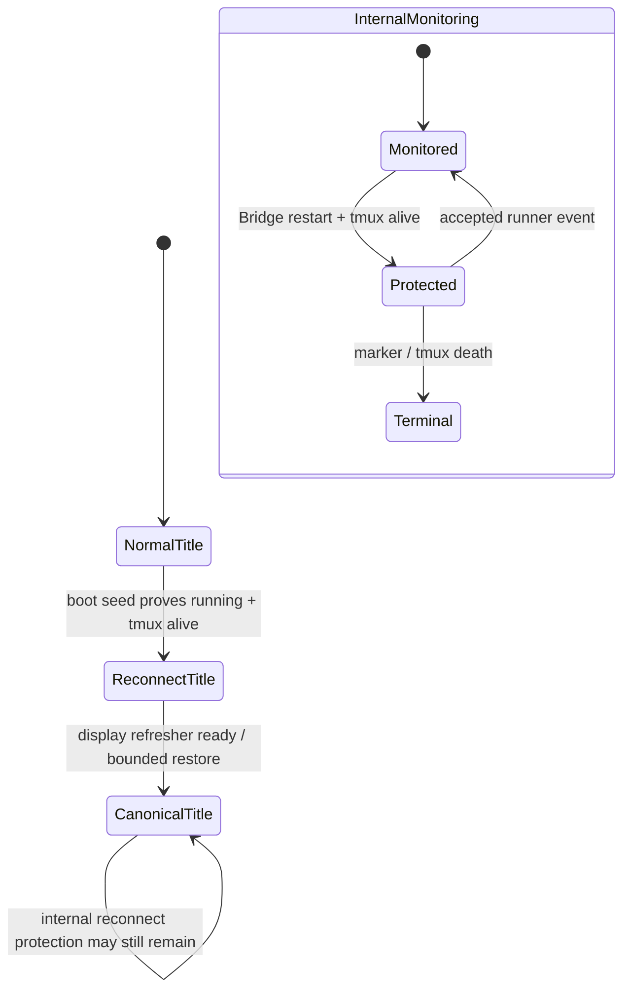

# FLY-1264 重连标题自动恢复 — 探索
Issue: FLY-1264 (https://linear.app/geoforge3d/issue/FLY-1264/fix-bridge-重启后-thread-标题卡在重连中不恢复-重连完成未改回阶段前缀今日复发-3-次founder-直视)
日期: 2026-07-14
基于: 无

## Problem

Bridge-only 重启后，`HeartbeatService.seedReconnecting()` 会把重启前仍为
`running`、且 tmux 仍存活的 runner 重新纳入保护，并把 issue thread 标题改成
`⚠️重连中`。问题在于：Bridge 已恢复、runner 也仍存活后，标题没有一条必然执行的
恢复路径。它只能等待后续 `stage_changed`、终态 marker 或 tmux 死亡；如果 runner
正停在同一个阶段、gate 或 park 状态，就可能很久没有这些事件，标题因此永久卡住。

这不是“恢复时不知道旧标题是什么”。正确前缀已经可以由 StateStore 中的当前
`status`、`session_stage`、三段式 phase rows 通过 FLY-907 的统一显示刷新器推导。
缺的是：重连显示结束时，主动触发一次 canonical render。

## User impact

- Annie 直视的 thread 标题在 Bridge 恢复后仍显示故障态，和真实运行阶段矛盾。
- Lead 需要人工 PATCH 标题；今日同一 thread 已重复处理多次。
- 重启越频繁，错误标题越常出现；重复重启还会重新写入同一个错误显示态。
- FLY-1225 修的是 awaiting-review 映射错误，本单若混入状态映射改动会扩大风险并模糊验收。

## Evidence

### Production timeline

生产 `teamlead.db` 与 `/private/tmp/flywheel-bridge.log` 对 FLY-1253 给出一致时间线：

| UTC 时间 | 事实 |
|---|---|
| 23:08:42 | `session_monitoring_reestablished`；标题/通知进入 `⚠️重连中` |
| 23:09:27 | 下一次 `stage_changed=brainstorm`，相隔约 45 秒 |
| 23:28:42 | 再次 `session_monitoring_reestablished` |
| 23:46:09 | 下一次 `stage_changed=design_review`，相隔约 17 分钟 |
| 00:20:38 | implement phase 再次进入重连显示 |
| 00:39:10 | 下一次 stage event，相隔约 18 分钟 |
| 00:50:43 | 再次进入重连显示 |
| 00:53:18 | Annie 在 thread 询问“为什么又变成重连中了呢？” |
| 01:04:12 | Lead 回复已人工恢复，并确认当日复发 3 次 |

关键反例是 00:50:43：Bridge 已完成 boot re-adopt，但之后没有新的 stage event；
现有实现没有任何东西能清掉标题。这个反例不依赖 Discord 客户端是否 ready，也不依赖
恢复前标题是否持久化。

### Code path

1. `HeartbeatService.seedReconnecting()` 在 boot 时遍历 pre-existing `running`
   sessions，经 marker-first + tmux liveness 后调用 `enterReconnecting()`。
2. `enterReconnecting()` 更新 fallback heartbeat、加入 `reconnecting` set，并通过
   `RegistryHeartbeatNotifier.onSessionMonitoringReestablished()` fire-and-forget 写入
   `⚠️重连中`。
3. `clearReconnecting()` 同时承担两个职责：
   - 结束内部 fallback-monitoring 保护；
   - 调用 `clearReconnectStamp()` 恢复标题。
4. event route 只在 accepted + persisted `stage_changed` 调用
   `clearReconnecting()`；终态/death 由 reconcile 路径清理。
5. FLY-907 `IssueDisplayRefresher` 明确用 `isReconnecting()` 阻止 Face A 写回，
   因此它的周期 sweep 也不会修复这个标题；只要内部保护态存在，Face A 永远 defer。

### Candidate hypothesis verdicts

| 候选 | 结论 | 证据 |
|---|---|---|
| 重连完成路径没有触发 title 恢复 | **成立，主因** | boot seed 只 enter；clear 只在后续 runner event/terminal/death |
| 写回发生在 Discord 客户端 ready 前被吞 | **不是主因** | 标题写入走 Discord REST；boot log 中 Bridge 已 listening，且活跃 thread 未出现对应 403/404；真正缺的是 clear trigger |
| 缺少重启前标题持久化 | **否决** | FLY-907 已从 StateStore current state 推导 canonical phase badge；旧标题可能已陈旧，不应回放 |

## Requirements

### Functional

1. bridge-only 重启期间，活跃 issue thread 可以短暂显示 `⚠️重连中`。
2. Bridge 的显示刷新能力就绪后，不等待新的 `stage_changed`，主动恢复 canonical 前缀。
3. 从 `⚠️重连中` 到 `🎨设计` / `🔨实现` / `🧪QA` 等正确前缀不超过 60 秒。
4. 三段式必须按 issue 的当前 phase 聚合结果恢复；不能按单个 session 的细粒度
   `session_stage` 错写成另一个前缀。
5. 单 runner issue 继续按现有 FLY-907 stage/status mapping 恢复。
6. 重复 Bridge 重启每次都能重新 enter → restore，不能依赖上一进程的内存。
7. 恢复失败或 429 时必须可重试；不能靠下一个 stage event 才有第二次机会。
8. thread 在重启窗口内被 archive 时，写回失败应静默、可重试、不 crash、不刷屏。

### Safety invariants

- 内部 `reconnecting` 保护态仍只在真实 accepted runner event、terminal marker 或 tmux
  death 时退出；显示恢复不能提前恢复 stuck/orphan/idle 检测。
- marker-first、tmux liveness、fallback heartbeat、kill-switch 行为保持不变。
- 只复用 FLY-907 canonical derivation，不新增第二套 phase/status mapping。
- 不改 FLY-1225 的 awaiting-review / completed 映射。
- 不持久化或回放完整旧标题，保留现有“只替换前缀、保留人工编辑 base title”的契约。

## Assumptions

- 本单处理的是活跃、可写的 issue thread；Discord 长时间不可用不可能由本地代码提供
  绝对 60 秒保证，但短暂 429/网络错误必须进入既有重试/对账机制。
- FLY-907 unified refresher 在生产默认开启；关闭 escape hatch 时保持 legacy
  byte-compat，不额外发明一套新渲染器。
- `⚠️重连中` 是短暂的重启可见信号，不再等同于内部 fallback-monitoring set 的完整寿命。

## Options

### A. Separate display marker from internal protection — selected

把一个过载的 `reconnecting` 状态拆成两个语义：

- `monitoring reconnecting`：内部保护态，继续由 `HeartbeatService` 持有，直到真实事件证明
  runner channel 恢复或 runner 终止/死亡。
- `reconnect title active`：短暂显示态，只负责让 Annie 看见 Bridge 正在恢复；Bridge 的
  canonical display refresher 就绪后结束，并主动触发 FLY-907 title render。

优点：直接满足 founder-facing 验收；不削弱 FLY-623 防误报；复用 FLY-907；无需新持久化。
代价：`ReconnectController` / FLY-907 guard 需要区分“内部还在保护”和“标题仍应显示
重连中”。

### B. Clear on heartbeat or next runner event — rejected

改动最小，但旧 Bridge 的 TmuxAdapter poll loop 已随进程死亡；parked/gated runner
可能没有任何新 heartbeat 或 stage event。它正是本次生产反例，仍会卡住。

### C. Persist and replay the pre-restart title — rejected

可以机械恢复旧字符串，但旧字符串可能已经和最新 phase/status 不一致，也会复制错误的
手工或历史前缀。它绕过 FLY-907 的单一状态推导路径，增加持久化 schema、迁移和并发
覆盖问题，且没有解决恢复触发缺失。

## Selected design boundaries

### Display lifecycle

1. boot seed 仍按现状判断 runner 是否进入内部保护态，并发出一次 `⚠️重连中` stamp。
2. 为该 episode 记录独立、进程内的 title-active 状态；重复 stay cycle 不重复写标题。
3. Bridge 的 FLY-907 refresher wiring 完成后，结束 boot-seeded sessions 的 title-active
   状态并 enqueue canonical issue refresh；同 issue 多个 session 必须去重。
4. FLY-907 Face A guard 改查 title-active，而不是查整个 internal reconnecting set。
5. canonical refresh 从当前 StateStore 重新推导 badge，并通过同一个 coalescing title writer
   写入；成功/noop 才视为恢复完成，失败/deferred 保留可重试证据。
6. 真实 runner event 到来时，现有 `clearReconnecting()` 仍同时清掉剩余 title-active 状态，
   保持早到事件和 terminal/death 路径幂等。

### Retry and archived thread

- 继续复用 `ChatThreadCreator` 的 GET → PATCH、coalesce-to-latest、429 Retry-After。
- 恢复必须进入 FLY-907 result/fingerprint 机制；failed/deferred 不能写入成功 fingerprint，
  后续 reconcile 可再试，而不是等下一 stage。
- archived thread 只把 Discord `400 / code=50083` 视作 quiet deferred：不抛到
  boot/runtime，也不在每个 tick 重复告警；一旦 thread 被 unarchive，后续对账可恢复。
  404 Unknown Channel 与其他 400/403 仍按真实失败保留可见性，避免吞掉失效 mapping 或权限问题。
- 不自动 unarchive：那是 thread lifecycle 权限与产品行为，超出本单。

## Test strategy

- Unit：display state 与 internal reconnecting state 独立；display settle 不改变
  `isReconnecting()`，idle/stuck suppression 继续成立。
- Unit：boot seed 后没有 `stage_changed`，FLY-907 仍恢复正确 phase badge。
- Unit：design / implement / QA 三种 phase 至少用表驱动覆盖；单 runner mapping 保持。
- Unit：重复 restart episode 可以再次 stamp 并再次恢复，stay cycle 不重复 stamp。
- Unit：429/failed 不记录成功，下一 reconcile 成功；archived 400 静默、不 crash、不刷屏。
- Source/assembly：boot ordering 为 seed enter → refresher wiring → title settle + canonical refresh。
- Real-machine QA：运行中的三段式 runner 做 bridge-only restart，观察标题短暂
  `⚠️重连中`，60 秒内回到正确 phase；不人工 PATCH；验证期间无 false stuck/orphan/idle。

## Non-goals

- 不重建 Bridge 重启前已死亡的 TmuxAdapter completion watcher。
- 不把 fallback monitoring 伪装成完整的 runner event channel 恢复。
- 不修改 stage vocabulary、phase aggregation 或 FLY-1225 mapping。
- 不修复历史 archived/deleted thread mappings，也不主动 unarchive thread。
- 不改通知正文、Lead 文案或其他 Discord 标题功能。

## Decision

Lead 在 brainstorm gate `7d517c31-8ed0-473c-95e1-546708cfc8d1` 明确批准方案 A，
并追加 archived-during-restart case：写回失败必须静默可重试，不 crash、不刷屏。
