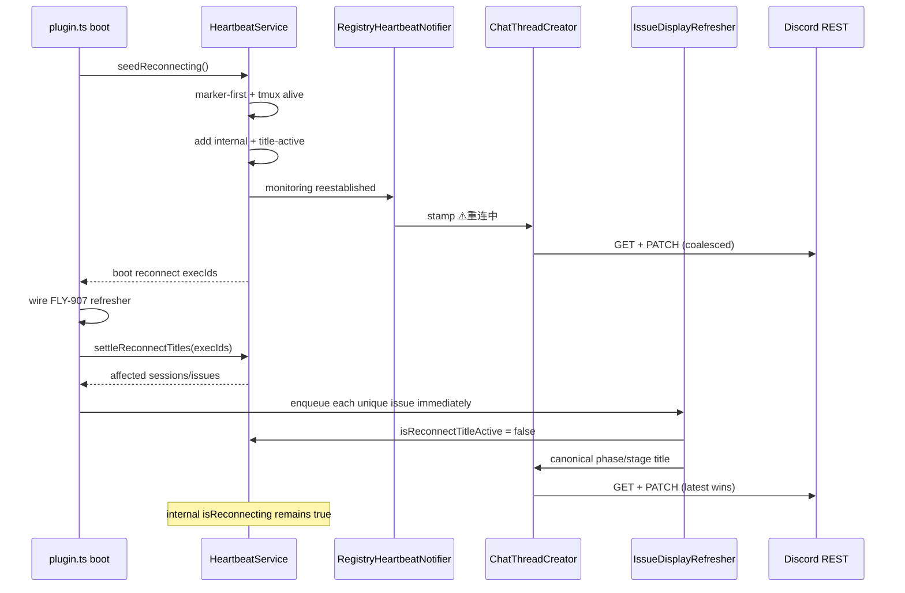

# FLY-1264 重连标题自动恢复 — 调研
Issue: FLY-1264 (https://linear.app/geoforge3d/issue/FLY-1264/fix-bridge-重启后-thread-标题卡在重连中不恢复-重连完成未改回阶段前缀今日复发-3-次founder-直视)
日期: 2026-07-14
基于: exploration.md

## Research question

如何在不改变 FLY-623 内部监控保护语义、不复制 FLY-907 状态映射的前提下，让
boot re-adopt 写出的 `⚠️重连中` 在 Bridge 显示层就绪后必然恢复为当前 canonical
phase/stage 前缀，并对 429、短暂失败与 archive case 保持可重试、低噪声？

## Sources inspected

- 生产 StateStore：`~/.flywheel/teamlead.db`
  - `sessions`
  - `session_events`
  - `lead_events`
  - `chat_threads`
- 生产 Bridge log：`/private/tmp/flywheel-bridge.log`
- FLY-1253 真实 Discord thread（只读 GET 当前标题与最近消息）
- 当前代码：
  - `packages/teamlead/src/HeartbeatService.ts`
  - `packages/teamlead/src/bridge/plugin.ts`
  - `packages/teamlead/src/bridge/event-route.ts`
  - `packages/teamlead/src/bridge/issue-display-refresher.ts`
  - `packages/teamlead/src/bridge/issue-display.ts`
  - `packages/teamlead/src/bridge/ChatThreadCreator.ts`
  - `packages/teamlead/src/bridge/stage-utils.ts`
- 回归测试：
  - `HeartbeatService.monitor-loss.test.ts`
  - `event-route.stage-emoji.test.ts`
  - `issue-display-refresher.test.ts`
  - `ChatThreadCreator.test.ts`
- 历史设计：
  - `doc/engineer/plan/inprogress/v1.61.0-FLY-623-restart-heartbeat-readopt.md`
  - `engineering/doc/FLY-907-thread-display-refresh/{exploration,research,plan}.md`

## Finding 1 — Root cause is a state-lifetime coupling

FLY-623 用一个 `HeartbeatService.reconnecting: Set<string>` 同时代表：

1. runner 的旧 in-process poll loop 已随 Bridge 死亡，Bridge 只能用 tmux liveness
   作为 fallback heartbeat；
2. founder-facing 标题应该显示 `⚠️重连中`。

这两个状态的正确寿命不同：

- 内部保护态可能持续到下一个真实 runner event，parked/gated runner 可持续数小时；
- 标题只是 Bridge 重启过程信号，产品验收要求 60 秒内回到当前工作阶段。

FLY-623 当时的 plan 明确规定标题随内部 set 一起清除，并明确禁止 heartbeat 清除。
这在“等待 event channel 证明”语义下自洽，但和本单 founder-facing 验收冲突。
FLY-1264 应修正显示层寿命，不应推翻 FLY-623 的监控保护。

## Finding 2 — Boot ordering provides a natural settle point

当前 `plugin.ts` 的相关 boot 顺序：

1. Bridge HTTP server 已 listening；
2. 构造 `HeartbeatService`，发布 `reconnectHolder.current`；
3. drain completion markers；
4. done-but-running / CommDB reconcile；
5. `await heartbeatService.seedReconnecting()`；
6. 继续构造 watchdog、GatePoller、alerts 等运行时；
7. 构造并写入 `issueDisplayRefreshHolder.current = new IssueDisplayRefresher(...)`；
8. 启动其余服务。

第 5 步是 `⚠️重连中` 的 enter 点，第 7 步是 canonical title renderer 已可用的明确
settle 点。无需等待 runner 自己发事件，也无需新增持久化字段。只要把第 5 步确认的
boot reconnect candidates 带到第 7 步，便可结束 title-only 状态并主动 refresh。

这个顺序还有两个好处：

- `⚠️重连中` 至少覆盖 Bridge 的剩余初始化窗口，不是完全无意义的瞬时字符串；
- canonical render 发生在 FLY-907 wiring 后，能按三段式 issue 聚合而非按单 session
  的 `session_stage` 猜前缀。

## Finding 3 — The canonical badge already exists

`IssueDisplayRefresher.refreshOnce(issueId)` 已完成所需推导：

1. 读 `getSessionByIssue()` 与 `getLatestPhaseSessionsForIssue()`；
2. 对每个 phase 调 `derivePhaseDisplayState()`；
3. 用 `deriveIssueTitleBadge()` 聚合：blocked / completed / phase / stage；
4. 三段式用 `PHASE_THREAD_BADGE[design|implement|qa]`；
5. 单 runner 用现有 `stageBadge()`；
6. model marker 从实际 badge session 推导；
7. 调 `ChatThreadCreator` 的 result-returning writer；
8. 所有 enabled faces 成功/noop 后写 display fingerprint。

因此恢复代码不应直接调用 `clearReconnectStamp(session)` 作为主路径。该函数只看传入
session 的 `status/session_stage`，在三段式 issue 上可能恢复成细粒度 `👀设计审` 或
`👀代码审`，而产品要求的是 phase-level `🎨设计` / `🔨实现` / `🧪QA`。

## Finding 4 — FLY-907 guard prevents all existing self-heal

Face A 当前逻辑：

```text
if isReconnecting(badgeSession.execId):
  resultA = deferred
else:
  render canonical badge
```

这个 guard 在 FLY-907 中是有意加入的：避免普通 lifecycle refresh 在 FLY-623 仍想
展示重连中时“过早”覆盖标题。副作用是：

- stage/status fingerprint 是否变化都不重要；
- layer-1 reconcile 触发 refresh 也只会再次 defer；
- layer-2 active issue sweep 也只会再次 defer；
- 只要内部 set 不退出，任何 FLY-907 self-heal 都不可能成功。

修复必须把 guard 改为 display-specific predicate，例如
`isReconnectTitleActive(execId)`，不能简单删除 guard。删除会让 seed 写入与 startup
sweep 发生无序竞争，也无法表达短暂显示窗口。

## Finding 5 — Boot candidates must be explicit and idempotent

`seedReconnecting()` 当前返回 `void`。实施需要得到“本次 boot 哪些 execution 成功
进入 reconnect display episode”的列表，随后在 refresher wiring 后 settle。

适合的窄接口：

```ts
interface ReconnectController {
  isReconnecting(executionId: string): boolean;
  isReconnectTitleActive(executionId: string): boolean;
  clearReconnecting(executionId: string): void;
  settleReconnectTitles(executionIds: readonly string[]): Session[];
}

async seedReconnecting(): Promise<string[]>;
```

语义要求：

- `seedReconnecting()` 只返回实际 `reconnecting` 且 title-active 的 exec；dead/terminal
  不返回；
- 同一 exec 重复 enter 不重复 stamp；
- `settleReconnectTitles()` 只删 title-active，不删 `reconnecting`；
- 对传入的每个仍可从 StateStore 解析的 boot exec 都返回 session，即使它的 title-active
  已被 seed→wiring 窗口内的 early accepted event 清除；caller 仍须按 issue 去重并 enqueue
  canonical refresh，覆盖该窗口 legacy clear 可能写出的细粒度 badge；
- accepted event 的 `clearReconnecting()` 同时删两个 set，保持 early-event race 幂等；
- second Bridge restart 是新进程、新 set，会重新 enter/settle。

也可以让 settle 直接返回 issue IDs；重要的是 HeartbeatService 不依赖 Discord/FLY-907
具体类型，只暴露窄状态转换。

## Finding 6 — Title writer already has the right concurrency primitive

`ChatThreadCreator.titleWriters` 是 per-thread coalescing single-writer：

- 最新 badge 覆盖 pending target；
- GET 当前 title 后只替换 recognized status prefix；
- 同值 noop，不消耗 PATCH；
- 429 honor Retry-After，最多 5 次；
- enter 与 restore 共用一个 writer，因此不会 read-then-write 乱序；
- restore 在 enter write 未完成时到达，会成为 latest target。

修复不应新增另一个 Discord PATCH helper。调用 FLY-907 就能复用 writer、model marker、
100-char truncation、人工 base title preservation。

### Limit

Discord thread rename 有约 2 次/10 分钟的服务端限制。一次 restart 的 enter + restore 正好
消耗两次 rename；10 分钟内继续 restart 时，Discord 可能明确返回长达约 10 分钟的
Retry-After。代码能正确等待并最终收敛，但此时无法同时保证“每轮都可见 ⚠️”和“每轮
60 秒内恢复”。因此 60 秒是 Discord 接受 PATCH 时的 fast-path SLO，不是能越过服务端
rate limit 的绝对保证。真机验收既要在无预先 rename burst 的活跃 thread 测 fast path，
也要单独覆盖一次短暂 429 后 latest canonical target 落地；不能用外部限制掩盖缺少恢复
触发，也不能把 429 误报成实现承诺可突破的 SLA。

seed→wiring 窗口若刚好收到 accepted event，可能请求第三次 rename：`⚠️` → legacy
细粒度 clear → canonical phase。per-thread writer 会合并尚未落地的 intermediate target；若
三次都已触达 Discord，则仍按 429 Retry-After eventual convergence，不能伪造 60 秒保证。

## Finding 7 — Retry path must be canonical, not event-dependent

FLY-907 的 writer 结果分为 `changed | noop | deferred | failed`：

- `changed/noop` 可以写 fingerprint；
- `deferred/failed` 不写新的成功 fingerprint；
- GatePoller 的 display reconcile sweep 会重跑 active issues；layer 2 是 unconditional
  rotating refresh，因此即使 session fingerprint 未变化，也会再次尝试 CommDB/Discord。

boot settle 必须调用 `IssueDisplayRefresher.refresh/enqueue`，而不是 fire-and-forget
`clearReconnectStamp()`；后者没有 fingerprint 语义，失败后仍只能等下一个 stage event。

初次 settle 应立即 enqueue，不等待 3 分钟 sweep。sweep 只是失败后的 backstop。
settle 点只在 unified refresher 实际完成 wiring 后执行；
`FLYWHEEL_ISSUE_DISPLAY_REFRESH=0` 时保留 FLY-623 旧生命周期，让后续真实 event 走
legacy clear，不能先清 title-active 却没有 canonical writer 接手。

## Finding 8 — Archived thread needs a quiet failure class

当前真实 log 大量出现：

```text
[ChatThreadCreator] stage-emoji PATCH failed: 400
{"message":"Thread is archived","code":50083}
```

`writeTitleOnce()` 把所有非 429 PATCH failure 都记 warn 并返回 `error`。如果新恢复路径
主动 retry，一个 restart-window archive 会重复记录同样的已知不可写状态。

本单最小处理：

- 解析 Discord error body；`status=400 && code=50083` 归类为 quiet deferred/archive；
- 不 throw，不在每次 writer 尝试 warn；
- 映射成 `DisplayWriteResult="deferred"`，不写 success fingerprint；
- 保留 active issue sweep 的未来重试能力，thread 被人工/生命周期 unarchive 后可收敛；
- 不自动 unarchive，不清 chat-thread mapping；404 Unknown Channel 仍是另一类错误。

为了避免吞掉所有 400，只对 Discord code 50083 做精确分类。测试需证明普通 400/403
仍记录失败，而 50083 quiet + retryable。

## Finding 9 — Direct heartbeat is not the repair trigger

HTTP `/events/heartbeat` 与 `DirectEventSink.emitHeartbeat()` 都只更新 StateStore
`heartbeat_at`。FLY-623 的原始设计明确不让 heartbeat 清 internal reconnecting，因为：

- Bridge 重启时旧 TmuxAdapter poll loop 已死；
- HeartbeatService 自己也会写 fallback heartbeat；
- 单看 heartbeat 无法区分 runner event channel 和 fallback liveness。

把 title settle 放在 boot display readiness 后，就不需要修改 heartbeat route，也不会把
fallback heartbeat 错当成完整监控恢复。

## Finding 10 — No pre-restart title ledger is needed

StateStore 已保存：

- issue/thread mapping；
- issue identifier/title；
- latest session status/stage/model；
- three-stage role/status rows；
- display fingerprint。

完整旧标题还包含可能的人工 base-title 编辑。`ChatThreadCreator.writeTitleOnce()` 当前先
GET Discord title、只剥/换 recognized prefix、保留 base，恰好同时满足“canonical 状态”
和“不覆盖人工编辑”。保存旧字符串反而会把陈旧 prefix/model marker 覆盖回去。

## Recommended implementation shape



## Verification matrix

| Case | Required evidence |
|---|---|
| No stage event after restart | canonical refresh called and correct badge written |
| Three-stage design | `🎨设计` from aggregate state |
| Three-stage implement | `🔨实现` from aggregate state |
| Three-stage QA | `🧪QA` from aggregate state |
| Internal protection | `isReconnecting=true` after title settle; idle/stuck still suppressed |
| Early accepted event | both states clear；boot candidate 仍 enqueue canonical issue refresh |
| Repeated restart | new service re-enters and re-settles once |
| 429 | latest canonical target eventually lands; no stale ⚠️ target wins |
| Transient error | no success fingerprint; later reconcile retries |
| Archived 50083 | no throw/no per-attempt warn; deferred and retryable |
| Ordinary 403/400 | remains visible as real failure |
| FLY-1225 boundary | existing mapping tests unchanged |

## Open implementation detail for design review

`seedReconnecting()` 是否直接返回 exec IDs，或由独立 `drainReconnectTitleCandidates()`
读取 title-active set，两种都可满足行为。推荐返回本次 boot IDs：范围更窄，不会误 settle
一个非 boot monitor-loss episode；同时由 `settleReconnectTitles(ids)` 保持状态所有权在
HeartbeatService 内。

除此之外没有需要 founder 决定的产品问题。
