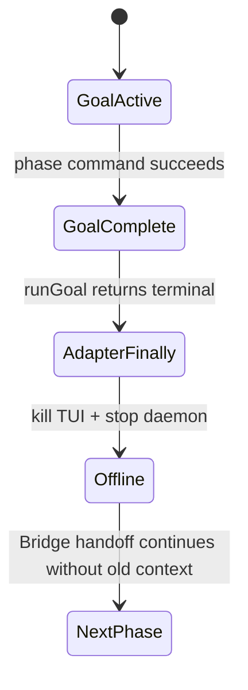

# FLY-1269 Codex Phase 全程常驻 — 探索
Issue: FLY-1269 (https://linear.app/geoforge3d/issue/FLY-1269/fix-codex-phase-会话在-phase-完成后就退出不像-claude-常驻到-issue-做完-三段式全程常驻缺失)
日期: 2026-07-14
基于: 无

## Context

Annie 定义的 three-stage 语义不是「三个一次性进程依次运行」，而是
Design、Implement、QA 三个带完整上下文的 phase session 在同一 issue 生命周期里
轮流持有 shared branch B；完成当前 phase 只代表交出 TURN，不代表销毁上下文。
三段必须一直可见、可唤醒，直到 issue shipped、canceled 或 founder close 才一起下线。

Claude Code 已满足这条产品语义：phase 执行 `park` 后，Claude 进程仍在 tmux
里等待，`PhaseOrchestrator` 可向同一 mailbox 发 handback/retest，issue-terminal
closeout 再统一关闭三段。

Codex 在 FLY-1188 后已经从一次性 `codex exec` 升级为 resident `/goal` daemon，
但「resident」只覆盖一个 goal 内的多个 turn。当前 `CodexTmuxAdapter.execute()`
在 `runGoal()` 返回 terminal 后立即进入 `finally`：停止 heartbeat 与 gate watcher、
关闭 founder TUI、停止 daemon、把 CommDB session 写成 completed。三段 phase 的 goal
恰好在 `phase_design_complete`、`needs_review` 或 QA verdict 后到达 complete，因此
Codex phase 在 handoff 后仍会消失。

## Problem Statement

需要把「phase 工作完成」与「session 生命周期完成」拆开：

- phase boundary：提交本段产物、交 TURN、让下一段开始；当前 Codex session 进入
  零 token 的 parked-alive 状态，保留同一 thread、goal、TUI 与 mailbox 能力；
- re-engage：Lead/founder/下一段通过现有 mailbox 把返工或问题送回本段；当前 session
  先重新拿 TURN，再在同一 thread/goal 上继续；
- issue terminal：现有 shipped/canceled/founder-close lifecycle closeout 才有权关闭
  tmux、删除 CommDB registration，并让 adapter 完成 daemon teardown。

不应把 StateStore 的 phase 状态机复制到 runner。Runner 只识别 Blueprint 传入的
phase keep-alive 资格、CommDB 的 phase park/wake 信号和 closeRunner 发出的 durable
shutdown request；handoff、TURN、issue disposition 继续由 Bridge 现有权威路径决定。

## Constraints

1. **Scope isolation**：只影响 `shareParentBranch=true` 的 design/implement/qa phase；
   single-session、Auto-QA、Claude、Antigravity/Kimi 保持原行为。
2. **Same context**：re-engage 必须复用同一 executionId、Codex thread 与 goal；不能
   respawn 一个新 Codex session 冒充常驻。
3. **Zero-token idle**：park 期间不能靠热 turn 或模型轮询维持生命；应使用原生
   `paused` goal 加慢速本地控制循环；phase hold时间不计入24h active-work deadline，
   也不能误套 gate wait的49h上限。
4. **Fail closed**：CommDB、declared-state、mailbox watcher 或 liveness probe 出错时
   留在 parked，不得把未知当 issue terminal。
5. **TURN first**：wake 文本不是 shared-worktree 写权限；模型恢复后仍必须先执行
   `flywheel-comm turn`，只有 `yours` 才能碰 worktree。
6. **Headless-safe**：phase 完成后不依赖终端用户输入；mailbox watcher 与 CommDB
   slow poll 是自动恢复入口。
7. **FLY-1257 orthogonality**：gate-wait hold 解决「门未答时 blocked 不终止」；本单
   解决「phase 已完成但 issue 未终态时 complete 不终止」。两者可共用低层 pause/
   activation primitive，但 latch、判定条件和 kill switch 必须分开。
8. **Existing closeout authority**：ship finalization 和 lifecycle-closeout 是唯一
   issue-terminal入口；`closeRunner` 与更早的 `postMergeTmuxCleanup` 都必须先走同一个
   Codex phase shutdown helper。本单不新增第二套 issue terminal 判定。Helper只对
   heartbeat持续前进且 pane probe=`alive` 的 controller等待 ack；controller已死/消失
   时回退现有 direct cleanup，probe不确定则 fail-closed，不能永久等一个不可能的 ack。

## Current Lifecycle



Bridge 侧其实已经按 keep-alive 设计：`onPhaseComplete()` 在 handoff 时先 probe，活着
就写 `runner_declared_states.kind=parked`，之后 wake 会先 clear declared state，再向
目标 backend mailbox 投递。缺的是 Codex adapter 对这些既有信号的消费。

## Options

### Option A — Native paused goal + durable phase hold（推荐，Lead 已批准）

Blueprint 显式把 phase keep-alive 资格和 role 传入 adapter。对这个明确身份，Codex
goal terminal分类器把任何正常 `complete` 解释为 `phase-hold` 而非 execution
terminal（除非 closeRunner shutdown 已先到）：先持久化 `phaseHold` latch，再把同一
goal置为 `paused`，此时才启动 Codex mailbox watcher，并在低频控制循环里等待 wake；另用
零 token的快速本地 control tick 等 closeRunner shutdown request。declared `parked`
用于确认 handoff/quiet状态与抑制 watchdog，不是 session 继续存活的前置条件。

Watcher 不在 active goal期间抢占 inbox。Codex mailbox本身是 durable store，进入 hold
后的 initial scan 会接住 boundary 前已经写入的 envelope。`flywheel-comm send` 同时写
CommDB instruction和带 `flywheelId + execId` 的 mailbox envelope；controller用一个
CommDB事务把 envelope写入 phase wake queue并认领对应 instruction，避免 resumed turn
再从 `inbox` 读到同一内容。若 active Runner只是列出过 instruction、`read_at`已写，
hold watcher仍然入队：列出不等于处理，稳定 message id让重复 turn可幂等跳过，不能用
静默丢 handback换取表面上的 at-most-once。

收到 mailbox 后，adapter 在 goal 仍为 `paused` 时先按消息顺序提交 exact wake
turn，确认 `turn/start` 被接受后再恢复 `active`；两步都成功后才清 latch。这样避免
`paused→active` 的原生 auto-continue 抢先启动一个不含 handback 的 turn。恢复 turn
会重新看到本 phase 的系统合同，必须先跑 TURN 自检。下一次 phase boundary 可再次
进入 hold。

优点：和 Claude parked-alive 的产品语义一致；零 token idle；保留同一上下文；使用
现有 park/wake/closeout 权威。代价：需要补完整的 terminal/hold race、mailbox ack、
daemon restart 和 closeout 测试；实施前还需真 daemon probe 验证 `complete→paused`
状态转换（FLY-1257 只验证了 `active→paused→active`）。

### Option B — Goal complete 后热 turn 轮询

每隔一段时间让模型检查 inbox/issue 状态，直到 issue terminal。

拒绝：持续消耗 token；容易被模型误判 complete；慢轮询与及时 wake 冲突；Bridge
状态异常时可能形成无限空转。

### Option C — Phase 完成后终止，返工时 respawn

维持当前终止行为，需要时在同一 branch 新建 execution/thread。

拒绝：丢失 session 上下文与 founder 可见性；`probe-before-wake` 继续把 dead Codex
判成需 respawn；不满足「三段全程常驻」和「same session re-engage」。

### Option D — 复制 issue lifecycle 到 Codex adapter

Adapter 直接查询 Linear/StateStore，自己判断 shipped/canceled/founder-close。

拒绝：形成第二套 disposition/FSM，和 `lifecycle-closeout` 的 mutex、fresh-authority、
closeRunner 顺序产生竞争。由 closeRunner 写 request、adapter drain 后 ack，仍是现有
closeout authority 的窄 backend handshake。

## Proposed State Model

```mermaid
stateDiagram-v2
    [*] --> Active
    Active --> PhaseHoldEntering: goal complete + phase parked
    PhaseHoldEntering --> Paused: persist latch, set native paused
    Paused --> Paused: no message; slow poll
    Paused --> Reactivating: ordered mailbox message
    Reactivating --> Active: paused wake accepted, then set active
    Reactivating --> Paused: activation or kick fails; latch retained
    Paused --> Teardown: closeRunner shutdown request
    Active --> Teardown: closeRunner shutdown request
    Teardown --> [*]: stop watcher, TUI, daemon; scrub credentials
```



`phaseHold` 应是带状态与冻结预算的结构化 latch，而不是一个模糊 boolean，例如：

```ts
type PhaseHold = {
  schemaVersion: 1;
  role: "design" | "implement" | "qa";
  state: "entering" | "paused" | "reactivating";
  enteredAt: string;
  deadlineRemainingMs: number;
  hardDeadlineRemainingMs: number;
};
```

Ordered wake queue不塞进多 writer共享的 `session.json`，而是放在 CommDB
`runner_phase_wakes` 表。对于 `send` envelope，queue insert与 instruction `read_at`
claim在同一 SQLite transaction完成；其他 gate/ask wake按 vendor message id直接入队。
transport ack只发生在事务提交之后。

进入 phase hold时同时冻结 active deadline与 run hard deadline的剩余值，wake后各自从
同一剩余值继续；多轮 park/wake累计排除所有 hold时间。Hold loop不经过现有49h
hardDeadline检查，使用独立 bounded control RPC timeout。这个 pause可以持续到
issue-terminal closeout；真正 active工作与 gate wait仍受原24h/49h预算约束，restart
不能补发新预算。

每次写 `session.json` 必须 read-merge + temp/rename，保留 FLY-1188 的 threadId、daemonPid
和 FLY-1257 可能增加的 `gateHold`。进入顺序固定为「phase goal complete → latch=true
→ pause → 观察/补报 park证据」；恢复顺序固定为「paused exact mailbox kick → active
→ queue item完成/latch clear」。任一失败保留 latch，下一轮或 adapter re-execution可重试。
即使 wake清除了上一轮 latch与 declared marker，`phaseKeepAlive` identity仍然存在；下一
次 complete无条件建立新 latch，不依赖模型再次执行 `park`。

## Race Decisions

### Complete 与 park 的竞态

Codex goal 可能先发 complete notification，而 `PhaseOrchestrator` 的 declared park 写入
晚几个毫秒。显式 `phaseKeepAlive` 身份已经足够让 classifier立即 latch+pause；随后
controller等 declared park出现。若 marker长时间缺失，fail loud并交给 reconcile/Lead，
但 session/daemon继续存活，绝不把 handoff缺口转换成 terminal reclaim。

### Wake 与 closeout 的竞态

closeout 的 session row 删除优先级高于未消费 wake。每次 active/kick 前后都重读 row；
若已删除，停止消费并进入 teardown。读失败视为未知，停在 hold。wake 已投递但 closeout
先赢时，停止 mailbox intake并保留审计记录，不能复活 terminal issue。

### Multiple messages

Watcher 只在 phase hold期间运行，按 durable mailbox顺序送入 CommDB queue；adapter
一次只激活一个 turn，激活后停止 watcher。active 期间的新消息留在 durable mailbox/
CommDB，当前 turn回到 phase hold后的 initial scan再依次接入。以 message id做 durable
去重；不能把多个 founder/Lead指令无条件拼接后丢失边界。

### Runtime restart

`phaseHold` 与 threadId 同存。daemon transport 轮换时，runtime resume 同一 thread，
preflight 读到 latch 后不得先自动 active/kick；先确认 CommDB row、declared park 与
phase wake queue，再选择保持 paused、恢复消息或 teardown。Lead 已确认本单不包含 Bridge
进程级 crash 后的 controller自动重建；该能力另开 boot reattachment follow-up。文档与
测试不能把 Heartbeat 的 “monitoring re-adopt” 误写成 mailbox/controller 已重建。

## Acceptance Shape

1. Focused unit/integration tests先复现：Codex design goal complete 后当前 adapter 会
   kill window + daemon；修后 phase keep-alive execution 留在 paused，普通 execution
   仍 terminal reclaim。
2. 同一 mailbox message 唤醒同一 thread/goal；TURN 检查仍是写入前硬门；同一进程内
   重复 wake 不重复 turn，crash window按 message id做 at-least-once安全重放。
3. `closeRunner` 发 request 后，held/active adapter 停 watcher、drain daemon、kill TUI
   并 ack；closeRunner 收到 ack 才删除 row/继续 cleanup；DB读取错误不触发 teardown。
   若 adapter heartbeat不再前进且 process probe证明 controller dead/absent，则使用现有
   direct cleanup而不是永久阻塞；indeterminate仍不误杀。
4. Claude keep-alive prompt/behavior不变；kill switch 关闭时 Codex phase 回到 legacy
   terminal reclaim。
5. 529 Room 真机：Codex-design handoff 后 cmux/session 仍活且可 re-engage；QA ship
   后 design/implement/qa 三段一起下线；Claude 对照场景无回归。

## Decision

采用 Option A。Lead 已明确批准：phase boundary 不再是 execution terminal；使用显式
phase identity、durable `phaseHold`、native paused goal、慢轮询和 same-thread mailbox
replay；teardown 只认 issue-terminal closeout；FLY-1257 gate hold 保持正交。后续收边也
已确认：mailbox采用 stable-id at-least-once（不从 `read_at`推断 handled），phase hold
同时冻结 active与 hard deadline剩余值，支持跨天常驻。
