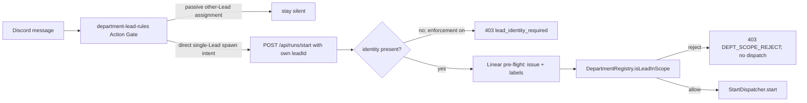

# FLY-127 部门范围启动守卫 — 调研
Issue: FLY-127 (https://linear.app/geoforge3d/issue/FLY-127/lead-spawns-runner-for-tasks-not-assigned-to-its-department)
日期: 2026-08-30
基于: exploration.md

## 1. 真实启动决策路径

Lead 的“要不要启动”是 prompt 纪律与服务端授权的串联：

`claude-lead.sh` 是规则装载点，不逐条解析 Discord 消息。它给 department Lead 注入 `department-lead-rules.md`；真正不可绕过的新 run admission 在 Bridge route。

## 2. 根因：省略身份后自我满足的校验

当前 `runs-route.ts` 顺序是：

1. 把 `req.body.leadId` 当作可选字符串。
2. 获取 Linear labels。
3. 若 `leadId` 缺失，调用 `resolveLeadForIssue()`，把 label 对应的 canonical Lead 写回 `leadId`。
4. 调 `isLeadInScope(projectName, leadId, labels)`。

对 Ops issue，步骤 3 必然得到 `ops-lead`，步骤 4 随后比较 `ops-lead` 与 Ops label，结果必然允许。服务端无法知道请求实际来自 Peter。现有 `start-e2e.test.ts` 甚至把 `leadId` omission→200 固化为预期，证明该缺口可执行而非推测。

修复必须在 auto-resolve 之前把“调用者身份是否存在”作为 admission 条件。`BRIDGE_DEPT_SCOPE_REJECT=off` 继续允许旧 auto-resolve，以保留已发布的紧急回滚语义。

## 3. 输入与响应合同

启用 scope enforcement 时：

- `leadId` 缺失、`null`、空字符串或全空白：`403`，`{success:false, code:"DEPT_SCOPE_REJECT", reason:"lead_identity_required", canonicalLeadId:null, silent:false}`。
- `leadId` 为非字符串：`400 INVALID_LEAD_ID / wrong_type`。
- 非空字符串继续进入项目 membership 与 department-label checks；Peter→Ops 返回 `label_mismatch`，Oliver→Ops 允许。
- 所有上述拒绝都发生在 dispatcher 之前；缺身份/错误类型还能在 Linear preflight 前拒绝，避免无权请求消耗 API 与 admission 资源。

不把缺身份请求自动归到 canonical owner，因为 owner 是资源属性，不是 caller identity。

## 4. 内建调用方兼容

### Gemini Agent

`SessionBinding` 已有可信的 `projectName` 与 `leadId`，而 `registry.ts` 注释也声明 binding 字段应只在 server-bound 侧附加。当前 `dispatch_runner` 却原样转发模型 args。修复方式与 `request_ship_approval`、`save_memory` 一致：body 用 binding 值覆盖模型值；model-facing schema 移除 `projectName`，只要求 `issueId`。测试同时证明 raw caller 传伪造 `projectName`/`leadId` 也无法覆盖 binding。

### test-slot 注入

`test-deploy.sh` 明确 `AGENT_ID=$(...botName)`，并把同一 `botName` 写入项目 Lead config。因此 `inject-linear-issue.sh` 从相同 slot 字段读取 `LEAD_ID` 是唯一一致来源。payload 改用 `jq -nc --arg`，避免 issue id、project 或 role 的 shell 字符破坏 JSON。

### 其他调用方

仓库搜索显示 xiaohongshu scheduler 已发送显式 `leadId`；Claude Lead 的 test identity 也明确规定 start body 必须用 slot `AGENT_ID`。工程 spike与测试 mock 不是生产调用面。

## 5. Prompt 与静默语义

现有规则已覆盖：

- 被动看到“给另一个 Lead 起 Runner”时，不调用 Bridge 并保持静默。
- 明确 @ 自己且 Bridge 返回 department mismatch 时，只回一次机读 reason 对应诊断，不重试。

需要补一条不可省略的 transport 规则：start body 必须携带自己的 `leadId`，不得省略、使用 canonical owner 或其他 Lead id。规则表新增 `lead_identity_required`；这类拒绝是调用合同错误，Lead 不重试未修改的请求。

## 6. 生命周期边界说明

`DepartmentRegistry.isLeadInScope()` 目前只被 public `/api/runs/start` 调用。它不是所有 Runner 生命周期 transition 的“唯一生产边界”：

- retry/phase handoff/auto-QA 从已存在 session 继续，不接受一个全新的任意 issue caller identity；
- actions path 使用 session ownership/scope checks；
- 要把 per-Lead authentication 扩展到所有内部 transition，需要新的 credential 与 migration 设计。

本计划只宣称保护 Lead-triggered initial start。残余认证强化会通过 Lead report 明确记录，不在 FLY-127 内偷偷扩 scope 或创建未经授权的外部 issue。

## 7. 基线验证事实

在仅含设计文档、runtime 与 `origin/main` 相同的 HEAD 上：

- `pnpm -r build`：exit 0。
- 正确 focused 命令 `pnpm --filter flywheel-teamlead exec vitest run src/__tests__/start-e2e.test.ts`：30/30 pass。
- department registry + rules bundle：43/43 pass。
- 精确全仓 gate `pnpm test:packages:run`：exit 1，仅 `packages/core/test/tmux-viewer.macos.test.ts` 的 2 个 real-osascript tests 失败；受管 runner 无可用 Terminal Apple Events session，错误为 `Connection Invalid`/AppleScript syntax。17 个其他 core test files、206 个 core tests 已通过。该失败在 FLY-127 代码前存在且与本变更文件无交集。

最终仍必须原样重跑 gate。通过标准是：lint/build/focused 与改动相关 package 全绿；全仓测试不得新增失败，并且基线两项 macOS integration failure 必须取得 Lead 的显式 waiver 才能交付。

## 8. Acceptance 对照

1. Identify where Lead decides to spawn Runner (handler in claude-lead.sh / department-lead-rules.md).
2. Add scope check: department mismatch → don't spawn.
3. Verify with: Annie addresses Oliver-only issue → only Oliver spawns Runner.
4. Update CLAUDE.md / docs with department-scope-spawn rule.

对应证据分别为 launcher/rule bundle audit、route identity+registry guards、paired Peter/Oliver route test、runtime rule doc + milestone。按角色硬约束不改 `CLAUDE.md`。
