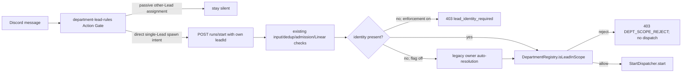

# FLY-127 部门范围启动守卫 — 调研
Issue: FLY-127 (https://linear.app/geoforge3d/issue/FLY-127/lead-spawns-runner-for-tasks-not-assigned-to-its-department)
日期: 2026-08-30
基于: exploration.md

## 1. 真实启动决策路径

Lead 的“要不要启动”是 prompt 纪律与服务端授权的串联：

`claude-lead.sh` 是规则装载点，不逐条解析 Discord 消息。它给 department Lead 注入 `department-lead-rules.md`；真正不可绕过的新 run admission 在 Bridge route。

## 2. 根因：省略身份后自我满足的校验

当前 `runs-route.ts` 把 `req.body.leadId` 当作可选字符串；完成 Linear labels 查询后，缺失时调用 `resolveLeadForIssue()`，再用解析出的 canonical owner 做 `isLeadInScope()`。对 Ops issue，这等同于把资源 owner 当作 caller identity，校验必然自我满足。现有 omission→200 测试证明该缺口可执行。

## 3. 输入合同与 response precedence

修复后的顺序明确如下：

1. 保留最前面的 `LINEAR_API_KEY` 503、`issueId/projectName` 400。
2. `rawLeadId` 若存在且不是字符串，立即返回 `400 INVALID_LEAD_ID / wrong_type`。这是唯一有意提前的新 precedence：畸形外部输入不再进入 agent/doc/model/dedup/admission。
3. 非空字符串原样作为 caller id；不 trim/改写有效 id。空串或全空白按“未提供”处理，并跳过旧 membership lookup。
4. 保留 agent/doc/model 400、active-session 409、admission 429、Linear 404/502 的原有 precedence。
5. 仅当以上都成功后，在 Linear preflight 内、FLY-80 auto-resolution 的紧前方：enforcement on 且身份缺失/空白时返回 `403 {success:false, code:"DEPT_SCOPE_REJECT", reason:"lead_identity_required", canonicalLeadId:null, silent:false}`。
6. flag off 时仍允许缺失/空白身份进入 legacy auto-resolution；非字符串始终是 400。

因此正常 omission 的 200 变 403，但已有 503/400/409/429/404/502 failure contracts 不被身份缺失遮蔽。所有拒绝都发生在 dispatcher 前；缺失身份仍会做 Linear issue/label read，这是维护 failure precedence 的有意代价。

## 4. 完整 caller migration

### TeamLead route tests

- `start-e2e.test.ts`：所有预期 200 且非 omission/rollback 专测的 bodies 加 `leadId:"product-lead"`；Ops happy path使用 `ops-lead`。专门保留 omitted identity 的 403、flag-off 200，以及缺 key/invalid input/409/429/Linear failure precedence 用例。
- `runs-route.stale-blocker.test.ts`：POST helper 显式带 `leadId`，避免测试 fixture 继续教授旧合同。

### Gemini Agent

`SessionBinding` 已有可信 `projectName/leadId`。`registry.ts` 应像其他 binding-owned 字段一样以 `{...args, projectName: binding.projectName, leadId: binding.leadId}` 覆盖 raw 值；model schema 移除 `projectName`，只要求 `issueId`。测试仍必须断言 `deptLabel` 不泄漏，同时证明 raw spoof 无法覆盖 binding。mock Bridge fixture 增加缺失/空白 `leadId` 的 403 path，以免 full-stack fixture 掩盖 contract regression。

### QA helper 与规则文档

- `inject-linear-issue.sh` 从 slot `botName` 读 `LEAD_ID`，验证非空，用 `jq -nc --arg` 构造 payload；403 分支打印 `code/reason/canonicalLeadId` 后失败，不落入 generic unexpected response。
- 新 shell test 用隔离 HOME/slot/curl capture 验证 payload 和 403 diagnostics，并在 `fly247-bash-suites.test.ts` 注册，确保 Linux CI 会执行。
- `department-lead-rules.md` 要求 own non-empty `leadId` 且禁止 canonical/other Lead substitution；`doc-flow-rules.md` 的完整 JSON 例子同步补 identity。

### 当前配置项目审计

2026-08-30 对 `~/.flywheel/projects.json` 所列 roots 做只读扫描：

- GeoForge3D 的 product/ops/shared start literals 都有 `leadId`。
- personal-assistant 的完整 start literal 有 `leadId`。
- joycon-typeless identity 明确要求总是传 `leadId`。
- growth 的 rafiki/reflection dispatch prose 明确 identity；其余角色由 base rules 约束。
- flywheel engineering/product identities 显式传 identity；其余角色不具备 start 行为或继承 base rules。
- tidal-echo 未发现无身份的完整 start body literal。

发布前重新执行同形扫描；若出现未迁移的完整 start literal，不得以 default-on 发布。紧急 rollback 是 `BRIDGE_DEPT_SCOPE_REJECT=off` 后重启 Bridge，恢复 FLY-80 auto-resolution。

## 5. Prompt 与静默语义

现有规则已覆盖被动看到“给另一个 Lead 起 Runner”时不调用 Bridge且保持静默；明确 @ 自己而 Bridge 返回 mismatch 时只回一次机读 reason 对应诊断。新增 transport rule 明确 own `leadId` 不可省略或替换；`lead_identity_required` 是 caller contract error，不重试未修改请求。

## 6. 生命周期边界与 follow-up

本任务只保护 Lead-triggered initial start。retry/phase handoff/auto-QA 继续已有 session。强认证仍是残余：Bridge 共享 API token 无法证明声称的 `leadId`，且 dashboard `/actions/retry` alias 没有 token middleware，`checkLeadScope()` 在缺 identity 时 fail-open。该具体路径必须写 milestone、Lead report并由 Lead决定 follow-up issue；没有授权时不在本实现节点创建外部 issue或扩大 FLY-127。

## 7. 基线验证事实

runtime 与 `origin/main` 相同的 docs-only HEAD 上：

- `pnpm -r build` exit 0；focused start/registry/rules tests green。
- TeamLead full suite 本地不可作为稳定 allowlist。连续两次运行分别得到 13 failed files/29 tests 与 28 failed files，集合显著漂移；失败来自受管 macOS sandbox/host integration（`mktemp`、`/.flywheel`、`/Library/LaunchAgents`、tmux/AppleScript）、root-owned npm cache EPERM、timeouts 和与 FLY-127 无关的 reconciliation/consent suites。
- 旧的“只有 Core 两个 real-osascript failure”结论被后续 TeamLead full-suite evidence 推翻，waiver question `61b39bc0-f774-4d1d-8f39-aff33aca5a5a` 已由更正问题 `64213dc8-a8a7-4ac0-bbd8-5c8dd4107e4b` 替代。
- `.github/workflows/ci.yml` 与 ship workflow 在 `ubuntu-latest` 执行 `pnpm test:packages:run`；Linux CI 是合并前权威 control。

最终仍原样运行全部 gate 并记录真实 exit。changed/focused tests、lint/build 必须绿；本地 TeamLead 全套若继续出现环境性漂移，不伪称通过或做虚假的逐项 allowlist，必须依 Lead裁决并要求 PR 的 authoritative Linux CI green。

## 8. Acceptance 对照

1. 启动判断位置：`claude-lead.sh` 装载 `department-lead-rules.md`；Bridge `runs-route.ts` 做 admission。
2. mismatch 不 spawn：explicit identity + registry fail-closed，omission 不再 auto-own。
3. Oliver-only issue：paired Peter 403 / Oliver 200 regression，dispatcher 恰好一次且 owner 为 ops。
4. 文档规则：更新 base department/doc-flow rules 与 milestone；按角色硬约束不改 `CLAUDE.md`。
